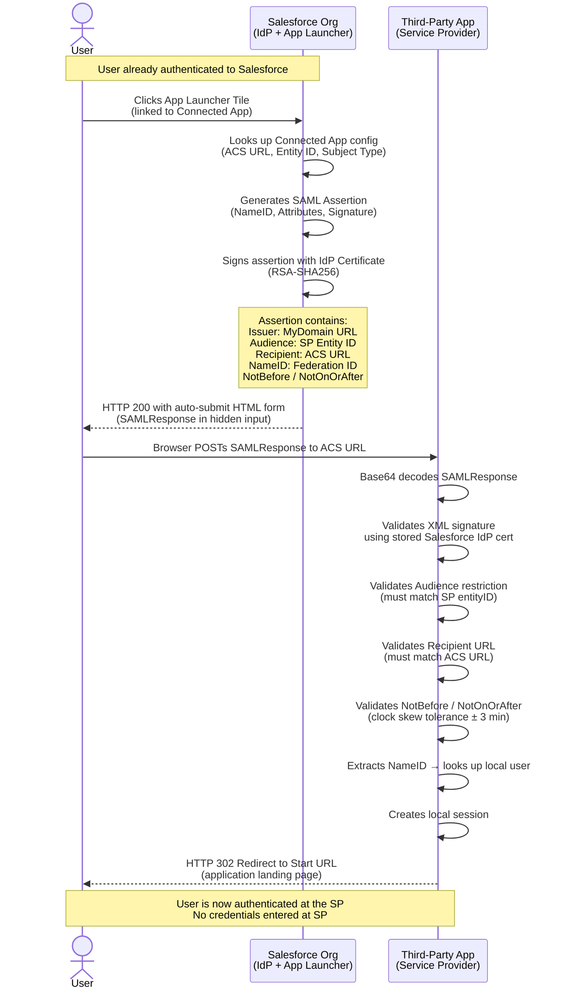
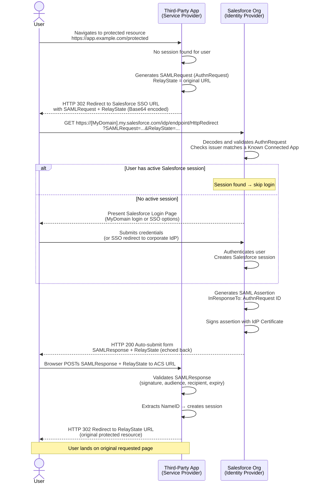
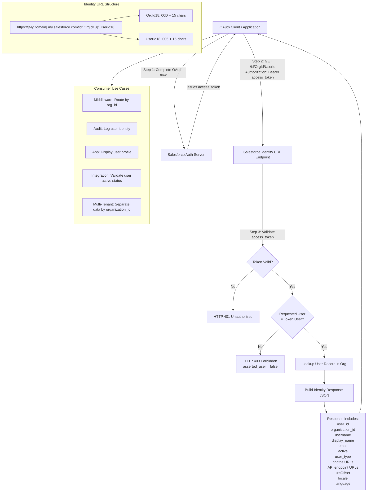
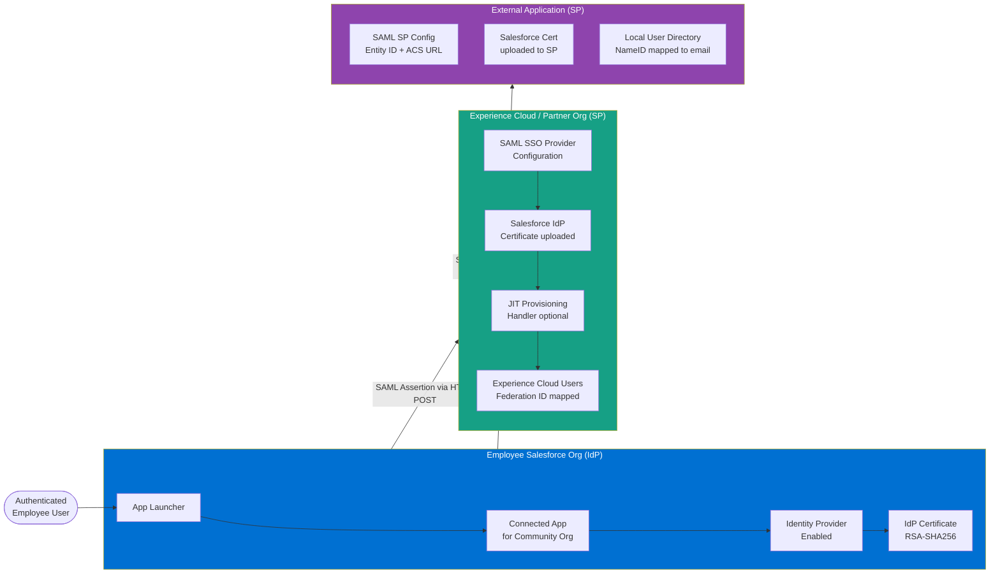

# Salesforce as an Identity Provider

## Exam Domain
Salesforce Identity — 25% of exam weight

---

## Foundations

### What Is an Identity Provider?

An Identity Provider (IdP) is an authoritative system that creates, maintains, and manages identity information for principals (users, services, devices) and provides authentication assertions to relying parties (Service Providers). When an IdP authenticates a user, it issues a signed assertion — in SAML that is an XML document, in OIDC that is a JWT — that the relying party trusts instead of asking the user to authenticate again.

The IdP holds the credential. The Service Provider (SP) holds no credential of its own for federated users; it trusts only what the IdP says.

Salesforce can play either role:
- **Salesforce as SP** — an external IdP (Okta, Azure AD, Ping, ADFS) asserts identity *into* Salesforce. The user authenticates at the external IdP and is logged in to Salesforce. This is covered in inbound SSO lectures.
- **Salesforce as IdP** — Salesforce authenticates the user and asserts identity *out to* a third-party application. The third-party app trusts Salesforce. This lecture covers that direction.

Understanding the directionality is critical. The exam routinely presents scenarios that require you to identify which org, or which product, is acting as IdP vs. SP.

### Why Would Salesforce Be the IdP?

Organizations that run Salesforce as their operational hub — where sales reps, service agents, and field workers live — may want Salesforce to serve as the SSO origin for adjacent tools:

- A custom web application built on Heroku or AWS
- A partner portal or community built on a separate Salesforce org
- Third-party tools like DocuSign, Marketo, Conga, niche industry SaaS
- Internal productivity tools that support SAML or OIDC but are not Microsoft 365 or Google Workspace (which typically have their own corporate IdP programs)

The value proposition: users are already authenticated to Salesforce. Rather than maintaining a separate enterprise IdP like Okta just for a handful of apps, organizations can federate outbound from Salesforce itself.

This pattern is most common in:
- Mid-market organizations without a dedicated IAM platform
- ISV partners whose customers use Salesforce as their primary SaaS platform
- Scenarios where the "employee" or "partner" Salesforce org needs to bootstrap access to a community or portal org

### SAML vs. OIDC as an IdP

Salesforce supports two protocols when acting as an IdP:

| Aspect | SAML 2.0 | OIDC / OAuth 2.0 |
|---|---|---|
| Assertion format | Signed XML | JWT (id_token) |
| Primary use | Browser-based enterprise SSO | Mobile, SPA, modern web apps |
| SP configuration | XML metadata, entityID, ACS URL | Client ID, Client Secret, redirect_uri |
| User info delivery | In the SAML assertion attributes | id_token claims + UserInfo endpoint |
| Salesforce config object | Identity Provider settings + Connected App | Connected App (OAuth scopes) |
| Binding | HTTP POST or HTTP Redirect | Authorization Code / Implicit |

For the exam, know that both protocols are available and understand what configuration artifacts are required for each.

---

## Core Concepts

### Enabling Salesforce as a SAML Identity Provider

Before Salesforce can issue SAML assertions, you must explicitly enable the Identity Provider feature within the org.

**Path:** Setup > Identity > Identity Provider > Enable Identity Provider

When you click Enable Identity Provider, Salesforce:
1. Creates a self-signed X.509 certificate and stores it as the IdP signing certificate
2. Exposes a SAML metadata endpoint you can give to SPs
3. Activates the IdP-initiated SSO login URL for App Launcher tiles

This is a per-org toggle. In a multi-org architecture, you may enable it only on the "employee" or "hub" org, not on every org.

The IdP certificate is what SPs use to verify the digital signature on SAML assertions. If you rotate or replace this certificate, every SP configured to trust Salesforce must receive the new certificate — this is a critical operational concern.

### Downloading Salesforce IdP Metadata

Once the Identity Provider is enabled, Salesforce publishes a SAML metadata XML document. This document contains:

- `entityID` — the unique identifier for this Salesforce org as an IdP (typically `https://[MyDomain].my.salesforce.com`)
- `IDPSSODescriptor` — the bindings and endpoint URLs for single sign-on
- `SingleSignOnService` — the SSO URL the SP should redirect users to (or post to) for IdP-initiated flows
- `KeyDescriptor` — the public signing certificate the SP uses to verify assertion signatures
- `NameIDFormat` — the format Salesforce uses for the subject NameID (typically `urn:oasis:names:tc:SAML:1.1:nameid-format:emailAddress` or `urn:oasis:names:tc:SAML:2.0:nameid-format:persistent`)

**Path to download metadata:** Setup > Identity > Identity Provider > Download Metadata

You provide this XML file to the SP administrator. Most SP tools (Okta SP mode, AWS IAM Identity Center, Workday, ServiceNow, etc.) have an upload field for IdP metadata, which auto-populates all fields.

The metadata download URL itself follows the pattern:
```
https://[MyDomain].my.salesforce.com/.well-known/samlidp/[certificateAlias]
```

### Identity Provider Certificate — Managing the Signing Certificate

The IdP certificate is an X.509 certificate used to digitally sign SAML assertions. The private key lives in Salesforce; the public key is distributed to SPs.

**Key management concerns:**

1. **Default certificate** — Salesforce creates a 2048-bit RSA self-signed certificate named `SelfSignedCert_[timestamp]`. This is sufficient for most enterprise use cases but is not CA-signed.

2. **Replacing the certificate** — You can upload a CA-signed certificate via Certificate and Key Management. After upload, you designate it as the Identity Provider certificate in the Identity Provider settings page.

3. **Certificate rotation** — When you change the IdP signing certificate:
   - All connected SPs must be updated with the new public certificate before the old one is deactivated
   - There is a window where both certificates must be trusted at the SP side (dual-cert trust)
   - Coordinate this as a change management event; do not rotate unilaterally

4. **Certificate expiry** — Self-signed certificates Salesforce creates have a 10-year expiry by default, but CA-signed certificates you upload may have shorter lifetimes (1-3 years). Set calendar reminders. Expired IdP certs cause assertion signature validation failures at every SP — a complete outage of all outbound SSO.

5. **Certificate alias** — In Salesforce, certificates are referenced by alias. The alias appears in the metadata URL and in Connected App configuration. Changing the alias impacts the metadata endpoint URL.

**Path:** Setup > Security > Certificate and Key Management

### Configuring a Third-Party SP to Trust Salesforce

From the SP's perspective, setting up Salesforce as IdP involves providing:

1. **entityID** (Issuer) — the unique string that identifies this Salesforce org as the IdP. Default: `https://[MyDomain].my.salesforce.com`
2. **SSO URL** — the Salesforce endpoint where the SP redirects authentication requests. For IdP-initiated flows this is less relevant, but for SP-initiated it is required. Format:
   ```
   https://[MyDomain].my.salesforce.com/idp/endpoint/HttpPost
   https://[MyDomain].my.salesforce.com/idp/endpoint/HttpRedirect
   ```
3. **IdP signing certificate (public key)** — uploaded to the SP so it can verify assertion signatures. Typically uploaded as a PEM or DER file.
4. **NameID attribute mapping** — the SP must know which attribute in the assertion maps to the local user account. Common: email address.

Each SP product has a different UI for this. Exam questions typically describe configuration at the conceptual level, not product-specific UI steps.

### Configuring the Connected App on the Salesforce Side

For each third-party application that Salesforce will assert to, you create a **Connected App** configured for SAML. The Connected App is the Salesforce-side representation of the SP.

**Connected App SAML settings:**

| Field | Description |
|---|---|
| Start URL | URL users are redirected to after successful assertion (the app's landing page) |
| Entity ID | The SP's entityID — must match exactly what the SP advertises |
| ACS URL | Assertion Consumer Service URL — where Salesforce POSTs the SAML assertion |
| Subject Type | What goes in the NameID — Federation ID, Username, User ID, or a custom field |
| Name ID Format | The URN format of the NameID (email, persistent, transient, unspecified) |
| Issuer | Salesforce entityID — defaults to MyDomain URL |
| IdP Certificate | Which certificate to sign assertions with |
| Attributes | Additional SAML attributes to include in the assertion |
| Custom Logout URL | Where to redirect users after logout at the SP |
| OAuth Policies | Not relevant for pure SAML; relevant for OAuth / OIDC Connected Apps |

**Critical: Entity ID at the SP vs. Connected App**

The Entity ID in the Connected App must match exactly what the SP declares as its own entityID. If there is a mismatch, Salesforce rejects or produces a malformed assertion. This is a common misconfiguration.

### SAML Assertion Attributes in Outbound SSO

When Salesforce issues a SAML assertion, it contains the following structural elements:

**1. Issuer**
The entityID of Salesforce as IdP:
```xml
<saml:Issuer>https://[MyDomain].my.salesforce.com</saml:Issuer>
```

**2. Subject / NameID**
The identifier for the user at the SP. Configured in the Connected App under "Subject Type":
- `Federation ID` — custom federation identifier on the User record (User.FederationIdentifier). Recommended for production.
- `Username` — the Salesforce username (user@company.com.sandbox if sandboxes are involved — watch out)
- `User ID` — the 15/18-character Salesforce ID
- `Custom Attribute` — a formula-based custom attribute

NameID format URN is set separately. Mismatched formats between Salesforce output and SP expectation cause assertion rejection.

**3. Conditions**
Controls assertion validity window:
```xml
<saml:Conditions NotBefore="2024-01-01T12:00:00Z" NotOnOrAfter="2024-01-01T12:05:00Z">
  <saml:AudienceRestriction>
    <saml:Audience>https://sp.example.com/saml/metadata</saml:Audience>
  </saml:AudienceRestriction>
</saml:Conditions>
```

**4. AudienceRestriction**
The `<saml:Audience>` element must match the SP's entityID. Salesforce populates this from the Entity ID field on the Connected App. If the SP checks this value (and most do), a mismatch causes rejection. This is the "Audience Restriction" concept on the exam.

**5. Recipient URL**
The `Recipient` attribute on the `<saml:SubjectConfirmationData>` element:
```xml
<saml:SubjectConfirmationData NotOnOrAfter="..." Recipient="https://sp.example.com/acs" .../>
```
This must match the SP's ACS URL. Salesforce populates it from the ACS URL field on the Connected App.

**6. Attribute Statements**
Additional user attributes Salesforce can include. Configured in the Connected App's "Custom Attributes" section:
```xml
<saml:AttributeStatement>
  <saml:Attribute Name="email">
    <saml:AttributeValue>user@example.com</saml:AttributeValue>
  </saml:Attribute>
  <saml:Attribute Name="firstName">
    <saml:AttributeValue>Jane</saml:AttributeValue>
  </saml:Attribute>
  <saml:Attribute Name="department">
    <saml:AttributeValue>Sales</saml:AttributeValue>
  </saml:Attribute>
</saml:AttributeStatement>
```

Attribute names are arbitrary strings — they must match what the SP expects. Coordinate with the SP administrator on expected attribute names and formats.

**7. Digital Signature**
Salesforce signs the assertion (and optionally the entire response) using the IdP private key. The signature is validated at the SP using the public certificate uploaded there.

### IdP-Initiated Flow from the App Launcher

In an IdP-initiated flow, the user starts at the IdP (Salesforce) — specifically from the App Launcher.

**Flow:**
1. User is already authenticated to Salesforce
2. User clicks an App Launcher tile linked to a Connected App
3. Salesforce generates a SAML assertion for that Connected App
4. Salesforce HTTP POSTs the assertion to the ACS URL of the SP (no prior request from the SP)
5. SP validates assertion, creates session, redirects user to the Start URL

**Tile configuration:** In the Connected App, the "Start URL" field determines where the user lands after the SP processes the assertion. This is typically the SP's home page or a deep link.

**No AuthnRequest in IdP-initiated flow.** Because Salesforce initiates without receiving a request, there is no `<samlp:AuthnRequest>` and no InResponseTo attribute in the assertion. Some strict SP implementations reject IdP-initiated assertions for this reason (they require a correlation ID). This is a known interoperability concern.

### SP-Initiated Flow Back to Salesforce as IdP

In an SP-initiated flow, the user starts at the SP's application, gets redirected to Salesforce, authenticates (or is already authenticated), and the assertion flows back.

**Flow:**
1. User navigates to `https://sp.example.com/protected-resource`
2. SP has no session; redirects user to Salesforce IdP SSO URL with an `AuthnRequest`
3. Salesforce validates the AuthnRequest; checks if the user has an active session
4. If no Salesforce session: Salesforce presents login page. User authenticates.
5. Salesforce issues SAML assertion, POSTs to ACS URL
6. SP validates assertion, creates session, redirects user to original resource

**SP-initiated requires the SP to know the Salesforce SSO URL.** This is typically configured when the SP administrator sets up the Salesforce IdP configuration.

**RelayState:** In SP-initiated flows, the SP includes a RelayState parameter in the AuthnRequest redirect. Salesforce echoes this RelayState value back in the assertion POST. The SP uses it to redirect the user to the original resource they were trying to access. If RelayState is lost or corrupted, users land on the generic start page rather than their intended destination.

### Connected App as SP

A "Connected App" in Salesforce can represent either:
- An external application that uses OAuth to call Salesforce APIs (Connected App as OAuth resource server config)
- An external application that Salesforce asserts identity to via SAML (Connected App as SP representation)

When the Connected App is configured with the SAML settings described above (Entity ID, ACS URL, Subject Type), Salesforce uses it as the outbound SAML configuration target. The Connected App does not "live" at a URL — it is purely a configuration record in Salesforce that describes the remote SP.

**Access control for Connected Apps:**
- By default, users with any profile can use a Connected App (if policies allow)
- You can restrict access by profile or by permission set: Setup > App > Connected Apps > Manage
- You can also enable "Admin-approved users are pre-authorized" or leave it as "All users may self-authorize"
- For SAML Connected Apps (not OAuth), you typically set the policy to "Admin approved users are pre-authorized" — there is no OAuth authorization screen for SAML flows

**IP Restrictions:** Connected Apps can have IP restrictions that control which IP ranges can initiate SAML flows. If a user's IP is outside the range, the SSO attempt is blocked. This is separate from org-level IP restrictions on login.

### Salesforce as an OIDC Provider

Beyond SAML, Salesforce can act as an OpenID Connect (OIDC) provider. OIDC is built on top of OAuth 2.0 and adds an `id_token` (JWT) that carries user identity information.

**Enabling OIDC IdP capability:** Salesforce is an OIDC provider by default for any Connected App configured with `openid` scope. No separate toggle is required (unlike SAML IdP, which requires the explicit enable step).

**Discovery Endpoint:**
OIDC providers publish a well-known configuration document:
```
https://[MyDomain].my.salesforce.com/.well-known/openid-configuration
```
This document advertises:
- `issuer` — the identity of this OIDC provider
- `authorization_endpoint` — where to send authorization requests
- `token_endpoint` — where to exchange codes for tokens
- `userinfo_endpoint` — where to retrieve user attributes
- `jwks_uri` — where to download the public keys for JWT signature verification
- `scopes_supported` — what scopes are available
- `response_types_supported` — code, token, id_token
- `claims_supported` — what claims can be in the id_token
- `id_token_signing_alg_values_supported` — RS256

**Authorization Endpoint:**
```
https://[MyDomain].my.salesforce.com/services/oauth2/authorize
```
The SP (relying party / RP) redirects users here with parameters: `response_type=code`, `client_id`, `redirect_uri`, `scope=openid profile email`, `state`, `nonce`.

**Token Endpoint:**
```
https://[MyDomain].my.salesforce.com/services/oauth2/token
```
The RP exchanges the authorization code for `access_token`, `refresh_token`, and `id_token`.

**UserInfo Endpoint:**
```
https://[MyDomain].my.salesforce.com/services/oauth2/userinfo
```
Returns JSON with user profile information for authenticated users. Requires a valid access token with `openid` scope.

**ID Token (JWT) Claims:**
The Salesforce-issued `id_token` contains standard OIDC claims:
- `iss` — issuer URL (the Salesforce MyDomain URL)
- `sub` — subject — the Salesforce Identity URL of the user (see next section)
- `aud` — audience — the Connected App's consumer key (client_id)
- `iat` — issued at (Unix timestamp)
- `exp` — expiry (Unix timestamp, short-lived — typically 3600 seconds)
- `nonce` — echoed back from the authorization request (replay protection)
- `at_hash` — access token hash
- Additional claims based on scopes: `email`, `profile`, `name`, `given_name`, `family_name`, `preferred_username`, `picture`, `zoneinfo`, `locale`, `updated_at`, `user_id`, `organization_id`

**Scope to Claim Mapping:**
| Scope | Claims returned |
|---|---|
| `openid` | `sub`, `iss`, `aud`, `iat`, `exp` |
| `profile` | `name`, `given_name`, `family_name`, `preferred_username`, `locale`, `zoneinfo`, `updated_at` |
| `email` | `email`, `email_verified` |
| `address` | `address` |
| `phone` | `phone_number`, `phone_number_verified` |
| `custom_permissions` | Custom permissions defined on the Connected App |

### The Salesforce Identity URL

The Salesforce Identity URL is a REST endpoint that returns comprehensive user information for the authenticated user. It is the `sub` claim value in OIDC id_tokens, and it uniquely identifies both the user and the org.

**Format:**
```
https://[MyDomain].my.salesforce.com/id/[OrgId18]/[UserId18]
```
Example:
```
https://mycompany.my.salesforce.com/id/00D5f000001ABC0EAK/0055f00000A1BcDEAX
```

Both the OrgId and UserId are the 18-character case-insensitive versions of the Salesforce ID.

**Accessing the Identity URL:**
The identity URL is a protected REST endpoint. You must include a valid OAuth 2.0 access token:
```
GET https://[MyDomain].my.salesforce.com/id/[OrgId]/[UserId]
Authorization: Bearer [access_token]
```

Or pass as a query parameter (less secure, avoid in production):
```
GET https://[MyDomain].my.salesforce.com/id/[OrgId]/[UserId]?oauth_token=[access_token]
```

**Identity URL Response Payload:**
The JSON response includes a rich set of user attributes:
```json
{
  "id": "https://mycompany.my.salesforce.com/id/00D.../005...",
  "asserted_user": true,
  "user_id": "0055f00000A1BcDEAX",
  "organization_id": "00D5f000001ABC0EAK",
  "username": "jane.doe@mycompany.com",
  "nick_name": "jane.doe1234",
  "display_name": "Jane Doe",
  "email": "jane.doe@mycompany.com",
  "email_verified": true,
  "first_name": "Jane",
  "last_name": "Doe",
  "timezone": "America/New_York",
  "photos": {
    "picture": "https://mycompany.my.salesforce.com/profilephoto/005.../F",
    "thumbnail": "https://mycompany.my.salesforce.com/profilephoto/005.../T"
  },
  "addr_street": null,
  "addr_city": null,
  "addr_state": "NY",
  "addr_country": "US",
  "addr_zip": null,
  "mobile_phone": null,
  "mobile_phone_verified": false,
  "is_lightning_login_user": false,
  "status": {
    "created_date": null,
    "body": null
  },
  "urls": {
    "enterprise": "https://mycompany.my.salesforce.com/services/Soap/c/...",
    "metadata": "https://mycompany.my.salesforce.com/services/Soap/m/...",
    "partner": "https://mycompany.my.salesforce.com/services/Soap/u/...",
    "rest": "https://mycompany.my.salesforce.com/services/data/v.../",
    "sobjects": "https://mycompany.my.salesforce.com/services/data/v.../sobjects/",
    "search": "https://mycompany.my.salesforce.com/services/data/v.../search/",
    "query": "https://mycompany.my.salesforce.com/services/data/v.../query/",
    "recent": "https://mycompany.my.salesforce.com/services/data/v.../recent/",
    "profile": "https://mycompany.my.salesforce.com/0055f...",
    "feeds": "https://mycompany.my.salesforce.com/services/data/v.../chatter/feeds",
    "groups": "https://mycompany.my.salesforce.com/services/data/v.../chatter/groups",
    "users": "https://mycompany.my.salesforce.com/services/data/v.../chatter/users",
    "feed_items": "https://mycompany.my.salesforce.com/services/data/v.../chatter/feed-items"
  },
  "active": true,
  "user_type": "STANDARD",
  "language": "en_US",
  "locale": "en_US",
  "utcOffset": -18000000,
  "last_modified_date": "2024-01-15T10:30:00.000+0000",
  "is_app_installed": true
}
```

**Key payload fields:**
- `user_id` — 18-char Salesforce User ID
- `organization_id` — 18-char Salesforce Org ID
- `username` — the Salesforce login username
- `display_name` — the formatted name shown in Salesforce UI
- `email` — user's email address
- `email_verified` — whether Salesforce has verified the email
- `photos.picture` / `photos.thumbnail` — profile photo URLs (require authentication to access)
- `active` — whether the user is currently active in Salesforce
- `user_type` — STANDARD, GUEST, PORTAL, etc.
- `urls` — a map of API endpoints scoped to this user's org and version
- `asserted_user` — true when the access token belongs to this user
- `is_app_installed` — whether the Connected App is installed for this user

**Use cases for the Identity URL:**
- A Heroku app receives an OAuth access token from Salesforce and calls the identity URL to get the user's email/name without querying the SFDC API
- A connected system uses `organization_id` to identify which Salesforce org the user belongs to (multi-org scenarios)
- JWT validation can use the `sub` (identity URL) to look up local user accounts

### SAML Assertion Signing and Encryption

**Signing:** By default, Salesforce signs SAML assertions with the IdP certificate. You can configure whether to sign just the assertion, just the response, or both. Most SPs require at minimum the assertion to be signed.

**Encryption:** Salesforce can also encrypt SAML assertions using the SP's public certificate. This is configured in the Connected App. Encrypted assertions prevent intermediaries (like load balancers with TLS termination) from reading assertion contents. Most implementations rely on TLS for transport security and do not require assertion-level encryption, but high-security environments may require it.

**Signature Algorithm:** Salesforce uses SHA-256 (RSA-SHA256) by default. Some legacy SPs expect SHA-1. The Connected App has a field for signature algorithm selection. The exam may test awareness that SHA-1 is deprecated but still supported for compatibility.

### Login History and Audit for Outbound SSO

When Salesforce acts as IdP, outbound SSO events are recorded in:
- **Login History** — records the login event type as "SAML Assertion" or "OIDC" with the Connected App name
- **Event Monitoring** (if licensed) — `LoginEvent` type captures full context including IP, TLS version, and assertion metadata
- **Identity Provider Event Log** — Setup > Identity > Identity Provider > View Identity Provider Event Log — shows success/failure, SP entity ID, and error codes for SAML transactions

The Identity Provider Event Log is a key diagnostic tool. When outbound SSO fails, this log shows whether the failure was at assertion generation or delivery, and what specific SAML error code was returned.

### My Domain and Outbound SSO

My Domain is mandatory for using Salesforce as an IdP. The My Domain URL becomes the issuer (entityID) and the base URL for all SSO endpoints. If an org does not have My Domain configured, outbound SAML SSO is not available.

The My Domain also affects:
- The metadata endpoint URL that changes if the My Domain name changes (domain rename scenarios)
- The ACS URL from Salesforce's perspective for inbound flows
- All OIDC endpoints published in the discovery document

**Domain rename impact:** If a customer renames their My Domain, all SPs that have Salesforce configured as IdP will have broken metadata URLs and potentially broken entityID matching until they update their SP configurations. This is a major operational risk in domain rename projects.

---

## PTA / SA Relevance

### When This Comes Up in Engagements

**1. Employee org as SSO origin for partner portals and communities**
A common enterprise pattern: the employee Salesforce org is the "golden source" of identity. Partner community orgs, customer community orgs, and Experience Cloud sites are configured to trust the employee org as the IdP. Users log in once to their Salesforce org and can navigate to partner portals without re-authenticating.

You will be asked to design this during an identity architecture workshop. Know the SAML-over-Salesforce pattern cold.

**2. Mid-market customers without an enterprise IdP**
Many companies in the 200-2000 employee range run Salesforce as their primary operational SaaS platform but do not have Okta, Azure AD, or Ping deployed. For tools like DocuSign, Marketo, or a custom Heroku app, Salesforce can serve as the outbound IdP rather than purchasing a dedicated IAM platform. The tradeoff (complexity, certificate management, outage risk) must be assessed against the cost and timeline of deploying a true IAM platform.

**3. ISV AppExchange patterns**
ISV partners building apps in AppExchange managed packages often need to authenticate users from subscriber orgs into their hosted application. The standard pattern is OAuth (Connected App), but some ISVs use Salesforce as SAML IdP with their own infrastructure as SP. Understanding the Connected App configuration for outbound SAML helps when reviewing ISV integration designs.

**4. Digital transformation projects with identity consolidation**
Large enterprises doing digital transformation often have a portfolio of legacy applications that support SAML but not modern OAuth. Salesforce-as-IdP can bridge the gap: Salesforce is the authenticated origin, and SAML assertions flow to legacy apps that cannot be retooled for OIDC.

**5. Multi-org Salesforce architectures**
Salesforce implementations with separate Sales Cloud and Service Cloud orgs, or employee and customer orgs, frequently need cross-org SSO. The "hub org as IdP" pattern (one Salesforce org authenticates users for another Salesforce org acting as SP) is a legitimate architecture pattern. The hub org configures a Connected App for outbound SAML; the target org configures a SAML SSO provider for inbound SAML.

### Common Architecture Failures

**1. Certificate expiry causing total SSO outage**
Self-signed or CA-signed IdP certificates expire. No monitoring = no warning. One day, all outbound SAML assertions are rejected because the signing cert expired. Every SP that trusted Salesforce is now broken. Recovery requires: generating/obtaining a new cert, updating Salesforce IdP settings, distributing the new cert to every SP, coordinating SP updates, testing.

Mitigation: Add certificate expiry to your ITSM calendar. Use Event Monitoring or Salesforce Health Check to track certificate validity. Define a certificate rotation runbook before go-live.

**2. Username-based NameID breaking in sandboxes**
If the Connected App Subject Type is set to "Username" and users have usernames like `jane.doe@company.com.sandbox`, the SAML assertion will contain that sandbox-suffixed username. The SP looks up `jane.doe@company.com.sandbox` and finds no matching account. SSO breaks. The root cause: the NameID value is environment-specific.

Mitigation: Use `Federation ID` as the Subject Type. The Federation ID is a custom field you control; set it to the user's email or a universal identifier that is consistent across environments.

**3. Entity ID mismatch**
The SP's entityID and the Entity ID in the Salesforce Connected App must match exactly — including trailing slashes, http vs. https, and case sensitivity in some implementations. A mismatch causes assertion rejection with a vague "audience restriction" error.

Mitigation: Copy-paste the entityID from the SP's metadata XML rather than typing it manually.

**4. ACS URL mismatch**
The ACS URL in the Connected App must exactly match the ACS URL the SP expects. If the SP's ACS URL changes (deployment to production, URL structure change), the Connected App must be updated. If the Recipient URL in the assertion does not match the SP's actual ACS URL, the SP rejects the assertion.

**5. IdP-initiated flow blocked by SP security settings**
Some SPs (particularly security-conscious ones) reject IdP-initiated assertions because there is no prior AuthnRequest to correlate. The assertion lacks an `InResponseTo` attribute. This is a legitimate security measure (prevents unsolicited assertion attacks). The SP administrator must explicitly enable IdP-initiated SSO.

**6. My Domain not deployed**
A developer org or older org without My Domain deployed cannot act as a SAML IdP. The error is confusing because the IdP enable button may appear, but assertions will fail or not be generated. Always verify My Domain is deployed (not just configured) before beginning IdP configuration.

**7. Connected App profile/permission restrictions blocking users**
The Connected App is accessible to all profiles by default, but if an administrator restricts it to specific profiles or permission sets, users outside those profiles receive access denied errors when clicking App Launcher tiles — without a clear error message about why.

### Enterprise Patterns

**Pattern 1: Hub-and-Spoke Multi-Org SSO**
```
Employee Salesforce Org (IdP Hub)
  ├── Sales Cloud Org (SP) — SAML inbound from hub
  ├── Service Cloud Org (SP) — SAML inbound from hub
  ├── Experience Cloud / Partner Community Org (SP) — SAML inbound from hub
  └── External App (SP) — SAML inbound from hub
```
All SPs trust the employee hub org as the authoritative IdP. Users authenticate once. The hub org must have My Domain, IdP enabled, and Connected Apps for each SP. License cost: the hub org may be a lightweight "identity" org with minimal user licenses.

**Pattern 2: Salesforce + External IdP (Dual-IdP)**
```
Corporate Azure AD (IdP for employee desktops/M365)
  └──[SAML inbound SSO]──> Salesforce Employee Org (SP from Azure AD)
                              └──[SAML outbound SSO as IdP]──> Custom App SP
```
Salesforce is simultaneously:
- An SP to Azure AD (employees use their corporate credentials to log in to Salesforce)
- An IdP to custom apps (Salesforce asserts identity to custom tools)

This is a relay pattern. Azure AD authenticates the user. Salesforce creates a session. Salesforce then asserts identity outbound. The user touches three systems but only provides credentials once (at Azure AD).

**Pattern 3: OIDC-Based App Integration (Modern Apps)**
```
User opens mobile or SPA app
  └──[OIDC Authorization Code + PKCE]──> Salesforce (OIDC Provider)
                                            └── issues id_token + access_token
  App calls Salesforce UserInfo endpoint to get user profile
  App uses access_token to call Salesforce REST APIs (combined auth + API access)
```
Here Salesforce serves double duty: OIDC IdP for user authentication AND API resource server. One access token grants both identity information and data access. This is the canonical pattern for ISV integrations with Customer 360.

**Pattern 4: Experience Cloud with Cross-Org SSO**
```
Employee Org (Sales Cloud, licensed users, IdP enabled)
  └──[SAML IdP-initiated from App Launcher]──> Experience Cloud Org
                                                  └── External Users (Partner / Customer licenses)
```
An employee sees partner records in Sales Cloud. Clicks a tile. Gets seamlessly logged in to the Experience Cloud portal where that partner has accounts, cases, and opportunities. The experience is seamless; the underlying mechanism is SAML assertion from employee org to Experience Cloud org.

The Experience Cloud org configures a SAML SSO provider (inbound). It maps the NameID from the assertion to Experience Cloud user records by Federation ID or email. Just-in-time (JIT) provisioning can create Experience Cloud user records on first login.

**Pattern 5: API + Identity Combined Flow**
```
External System
  ├── Step 1: OAuth 2.0 flows to Salesforce → receives access_token
  ├── Step 2: Calls Identity URL → retrieves org_id, user_id, email, active status
  └── Step 3: Uses access_token to call Salesforce REST API for data
```
The identity URL provides a unified way to validate the token is valid and get user context without a SOQL query. Particularly useful in middleware or integration platforms (MuleSoft, Dell Boomi, Informatica) that need user context for routing or audit logging.

---

## Architecture

### Salesforce as SAML IdP — IdP-Initiated Flow (App Launcher)



### Salesforce as SAML IdP — SP-Initiated Flow



### Salesforce as OIDC Provider

```mermaid
sequenceDiagram
    actor User
    participant App as Relying Party<br/>(Web/Mobile App)
    participant SFDC as Salesforce<br/>(OIDC Provider)

    User->>App: Navigates to protected page
    App->>App: No session; generate state + nonce
    App-->>User: Redirect to Salesforce authorization endpoint
    Note over App: scope=openid profile email<br/>response_type=code<br/>client_id=[Connected App key]<br/>redirect_uri=https://app.example.com/callback<br/>state=[random]<br/>nonce=[random]
    User->>SFDC: GET /services/oauth2/authorize?...
    alt User has Salesforce session
        Note over SFDC: Session found
    else No session
        SFDC-->>User: Present login page
        User->>SFDC: Authenticate
    end
    SFDC->>SFDC: Validate Connected App config<br/>Check redirect_uri matches registered value
    SFDC-->>User: Redirect to redirect_uri with ?code=...&state=...
    User->>App: GET /callback?code=...&state=...
    App->>App: Validate state matches<br/>(CSRF protection)
    App->>SFDC: POST /services/oauth2/token<br/>grant_type=authorization_code<br/>code=...&client_id=...&client_secret=...&redirect_uri=...
    SFDC->>SFDC: Validate code, client credentials
    SFDC-->>App: JSON response with<br/>access_token, refresh_token, id_token, token_type
    App->>App: Decode and validate id_token (JWT)<br/>Verify signature using JWKS<br/>Verify iss, aud, exp, nonce
    Note over App: id_token.sub = Salesforce Identity URL<br/>id_token.email = user email<br/>id_token.name = display name
    opt Additional user data needed
        App->>SFDC: GET /services/oauth2/userinfo<br/>Authorization: Bearer [access_token]
        SFDC-->>App: JSON user info payload<br/>(all profile claims)
    end
    App->>App: Create local session for user
    App-->>User: Return protected page content
```

### Salesforce Identity URL Data Flow



### Multi-Org Cross-Org SSO Architecture



**Limitations & Tradeoffs:**

**SAML IdP limitations:**
- Salesforce as IdP adds operational dependency: if the Salesforce org is in maintenance mode, all outbound SSO is unavailable. Every SP that depends on Salesforce-as-IdP is effectively down. Enterprise-grade IdP platforms (Okta, Azure AD) are designed for 99.99%+ uptime; Salesforce has planned maintenance windows.
- Salesforce does not support SAML proxy or chained assertions. If you need Salesforce to assert to a second IdP that then asserts to an SP, you need a proper IAM platform in between.
- Attribute filtering and transformation (e.g., normalizing an attribute value, splitting a field, mapping roles to groups) is limited. You can use custom attributes with formulas, but complex attribute transformation requires middleware or an IAM platform.
- Assertion validity window is fixed at 5 minutes. This is generally sufficient but can cause failures if there are clock synchronization issues at the SP.

**OIDC IdP limitations:**
- The `id_token` issued by Salesforce contains only what Salesforce knows about the user. If the RP needs attributes from an LDAP directory or HR system, those must be populated into Salesforce custom fields first (and exposed via custom OIDC claims).
- Refresh token rotation: Salesforce supports refresh tokens but organizations may configure policies to expire them. Long-lived app sessions need careful refresh token management.
- The discovery document is not customizable — it is auto-generated by Salesforce and always reflects Salesforce's supported features. You cannot add claims to the discovery document beyond what Salesforce supports.

**Identity URL limitations:**
- Each identity URL call requires an API call to Salesforce. High-traffic applications calling the identity URL per request will consume API governor limits. Cache identity URL responses; they are not real-time data for most use cases.
- Photos URLs in the identity URL response require an authenticated request to retrieve — they are not public URLs. Applications that want to display user profile photos must either proxy the request or use a separate CDN-hosted image.
- The identity URL is user-specific. There is no org-level identity URL equivalent for machine-to-machine flows.

---

## Key Facts to Memorize

1. **Enabling the IdP** — Setup > Identity > Identity Provider > Enable Identity Provider is required before Salesforce can issue SAML assertions. This is a one-time toggle per org.

2. **My Domain is mandatory** for Salesforce to act as a SAML IdP. Without My Domain deployed, the feature is unavailable.

3. **Identity Provider Certificate** — the signing certificate Salesforce uses to sign outbound SAML assertions. Public cert must be uploaded to every SP. Rotation requires coordinated SP updates.

4. **Connected App is the SP record** — each third-party app that Salesforce asserts to is represented as a Connected App on the Salesforce side, configured with the SP's Entity ID, ACS URL, and Subject Type.

5. **AudienceRestriction** — the `<saml:Audience>` value in the assertion must exactly match the SP's entityID. Configured as "Entity ID" in the Connected App.

6. **Recipient URL** — the `Recipient` attribute on SubjectConfirmationData must match the SP's ACS URL. Configured as "ACS URL" in the Connected App.

7. **Subject Types for NameID:**
   - Federation ID — recommended; use `User.FederationIdentifier` field
   - Username — risky in sandboxes due to `.sandbox` suffix
   - User ID — 15/18-char Salesforce ID; usually meaningless to external SPs
   - Custom attribute (formula-based)

8. **IdP-initiated flow** — triggered by App Launcher tile click. No prior AuthnRequest. No `InResponseTo` in assertion. Some strict SPs block this.

9. **SP-initiated flow** — SP generates AuthnRequest, redirects user to Salesforce IdP SSO URL. Salesforce echoes RelayState back in POST. Assertion includes `InResponseTo`.

10. **OIDC discovery endpoint** — `https://[MyDomain].my.salesforce.com/.well-known/openid-configuration`

11. **OIDC token endpoint** — `https://[MyDomain].my.salesforce.com/services/oauth2/token`

12. **UserInfo endpoint** — `https://[MyDomain].my.salesforce.com/services/oauth2/userinfo`

13. **Identity URL format** — `https://[MyDomain].my.salesforce.com/id/[OrgId18]/[UserId18]`

14. **Identity URL payload** includes: user_id, organization_id, username, display_name, email, active, user_type, photos, urls, timezone, locale

15. **OIDC id_token sub claim** — the value of `sub` in Salesforce-issued id_tokens is the Identity URL (not just the user_id)

16. **IdP Event Log** — Setup > Identity > Identity Provider > View Identity Provider Event Log — primary diagnostic tool for failed outbound SAML assertions

17. **SAML assertion validity** — assertions have a built-in expiry (NotOnOrAfter), typically 5 minutes from issuance. Clock skew between Salesforce and SP can cause validation failures.

18. **Signature algorithm** — Salesforce defaults to RSA-SHA256. Legacy SPs may require RSA-SHA1 (deprecated, avoid).

19. **No SAML IdP without My Domain** — attempting to enable IdP without My Domain deployed results in an error or non-functional configuration.

20. **OIDC scope `openid`** is mandatory for the flow to be OIDC. Without it, Salesforce performs OAuth 2.0 but does not issue an `id_token`.

---

## Exam Traps

**Trap 1: Confusing IdP and SP directions**
Questions will describe a scenario where "Salesforce users need SSO access to a third-party app." You must identify that Salesforce is the IdP (it holds credentials) and the third-party is the SP. Answers that configure Salesforce as SP (inbound SSO) are wrong in this direction.

**Trap 2: Username vs. Federation ID as Subject Type**
Questions involving sandbox environments where SSO breaks after refresh or promotion are almost certainly about the Username Subject Type containing `.sandbox` suffixes. The correct answer is always to switch to Federation ID.

**Trap 3: IdP enable toggle vs. Connected App SAML config**
Both are required. Enabling the Identity Provider feature is the org-level toggle. Creating the Connected App with SAML settings is the per-SP configuration. Questions may ask "what is needed to configure outbound SSO to App X?" — both steps are required.

**Trap 4: My Domain not deployed vs. just configured**
My Domain goes through states: not created, created/configured, deployed. It must be in the "deployed" state for it to work for SSO. "Configured" but not deployed is a partial state that does not enable SSO features.

**Trap 5: Entity ID case sensitivity and trailing slashes**
`https://sp.example.com/saml` is different from `https://sp.example.com/saml/`. One trailing slash can break the AudienceRestriction validation. The exam may present scenarios where "everything is configured correctly but SSO fails" — the root cause is a minor Entity ID mismatch.

**Trap 6: IdP-initiated rejected by SP**
The exam may ask why a correctly configured outbound SSO works from SP-initiated flows but fails from App Launcher tiles. The answer is that the SP has IdP-initiated SSO disabled (requires the SP to only accept assertions in response to an AuthnRequest). The fix is at the SP, not in Salesforce configuration.

**Trap 7: Certificate rotation partial update**
A scenario where "some users experience SSO failures after an IdP certificate was rotated." The answer: not all SPs were updated with the new certificate. The old cert was removed from Salesforce before all SPs were updated. Fix: maintain dual-cert trust during rotation; only remove old cert after all SPs confirm they accept the new one.

**Trap 8: OIDC without `openid` scope**
If a Connected App is configured for OAuth 2.0 but the authorization request does not include `scope=openid`, Salesforce will issue access_token and refresh_token but NOT an id_token. The integration works for API access but fails as an OIDC identity assertion. The fix is adding `openid` to the scope.

**Trap 9: Identity URL as `sub` in id_token**
Candidates who expect `sub` to equal the Salesforce User ID will be surprised. Salesforce sets `sub` to the full identity URL. Code that parses the `sub` claim to extract user_id must parse the URL, not treat `sub` as a bare ID.

**Trap 10: API calls consuming governor limits**
A scenario where an application is calling the Salesforce Identity URL on every API request and hitting governor limits. The correct answer is to cache identity URL responses, not to call the identity URL per-request. The identity URL is meant for initial session setup, not per-request validation.

---

## Practice Questions

### Question 1

A mid-market company uses Salesforce Sales Cloud as their primary business platform. They have just deployed a custom web application on Heroku that their sales team needs to access. The security team requires that users only authenticate once and do not maintain separate passwords for the Heroku app. No external identity provider exists. The Heroku app supports SAML 2.0. Which configuration steps are required on the Salesforce side?

**A.** Enable inbound SSO on Salesforce by creating a SAML Single Sign-On Setting; configure the Heroku app to POST assertions to Salesforce.

**B.** Enable the Salesforce Identity Provider feature; create a Connected App with SAML settings including the Heroku app's Entity ID and ACS URL; configure App Launcher tile.

**C.** Create an Auth. Provider record in Salesforce pointing to the Heroku app; configure a registration handler for Just-in-Time provisioning.

**D.** Enable OAuth on the Salesforce Connected App; configure the Heroku app to receive JWT access tokens from Salesforce using the JWT Bearer flow.

**Correct Answer: B**

**Explanation:** The requirement is outbound SSO from Salesforce (IdP) to the Heroku app (SP). The steps are: (1) Enable Salesforce Identity Provider at Setup > Identity > Identity Provider, (2) Create a Connected App with SAML settings — the Entity ID must match the Heroku app's entityID, the ACS URL must be the Heroku app's Assertion Consumer Service endpoint, and the Subject Type must identify the user. The App Launcher tile lets users click through to the Heroku app with an IdP-initiated SAML assertion.

**Why A is wrong:** Option A describes inbound SSO — the Heroku app asserting INTO Salesforce. That is the reverse direction. SAML Single Sign-On Settings are for configuring Salesforce as an SP, not as an IdP.

**Why C is wrong:** Auth. Provider records are for configuring external systems as authentication sources for Salesforce (inbound, Salesforce acting as SP). A registration handler is for JIT provisioning when users arrive from an external IdP. This is the wrong direction.

**Why D is wrong:** The JWT Bearer flow is an OAuth machine-to-machine flow for server-to-server API access. It provides API authorization, not browser-based SSO. The Heroku app supports SAML, not OAuth JWT assertion, for login.

---

### Question 2

An architect configures outbound SAML SSO from a Salesforce org to a third-party application. During testing, the SSO flow fails with an "Audience Restriction" error at the SP. Salesforce configuration shows: Entity ID (Connected App) = `https://partner-app.example.com/saml`, ACS URL = `https://partner-app.example.com/acs`. The SP administrator reports their system's entityID is `https://partner-app.example.com/saml/`. What is the most likely cause and resolution?

**A.** The ACS URL in the Connected App is incorrect; update it to `https://partner-app.example.com/saml/`.

**B.** The Salesforce Identity Provider is not enabled; enable it at Setup > Identity > Identity Provider.

**C.** The Entity ID in the Connected App has a trailing slash mismatch; update it to `https://partner-app.example.com/saml/` to exactly match the SP's entityID.

**D.** The IdP signing certificate has expired; generate a new certificate and re-upload it to the SP.

**Correct Answer: C**

**Explanation:** The AudienceRestriction in a SAML assertion is populated from the Entity ID field in the Connected App. The SP validates that the `<saml:Audience>` value matches its own entityID exactly. `https://partner-app.example.com/saml` (no trailing slash) does not match `https://partner-app.example.com/saml/` (with trailing slash). Even a single character difference causes assertion rejection. The fix is to update the Connected App's Entity ID field to include the trailing slash.

**Why A is wrong:** The ACS URL controls where Salesforce sends the assertion (the Recipient URL), not the audience value. Changing the ACS URL would not resolve an "Audience Restriction" error and could break the delivery endpoint.

**Why B is wrong:** If the Identity Provider were not enabled, Salesforce would not generate any assertion at all — the flow would fail earlier, before an assertion reaches the SP. An assertion was generated and delivered (the SP received it and evaluated it), which means the IdP is enabled.

**Why D is wrong:** A certificate expiry causes a signature validation error, not an audience restriction error. The SP error message specifically says "Audience Restriction" — this is the audience value check, not the signature check.

---

### Question 3

A company's Salesforce org acts as an Identity Provider for multiple third-party applications. The security team instructs you to rotate the Identity Provider signing certificate. What is the safest approach to ensure no SSO outage occurs during rotation?

**A.** Generate the new certificate in Salesforce, immediately update the Identity Provider settings to use the new certificate, then notify all SP administrators to update their configurations.

**B.** Disable the Identity Provider feature, generate the new certificate, re-enable the Identity Provider with the new certificate, and then notify SP administrators.

**C.** Generate the new certificate; distribute the new public certificate to all SP administrators and have them add it alongside the existing certificate (dual-cert trust); after all SPs confirm they accept the new cert, switch Salesforce to sign with the new certificate; then remove the old certificate from SPs.

**D.** Schedule a maintenance window; export the current certificate's private key; import it with a new expiry date; re-upload to all SPs.

**Correct Answer: C**

**Explanation:** Certificate rotation must be executed with a dual-trust window to prevent outages. The sequence is: (1) Generate new cert in Salesforce, (2) Distribute the new public certificate to all SPs — have them configure it as an accepted signing cert alongside (not replacing) the old cert, (3) Verify all SPs accept both certs, (4) Switch Salesforce IdP settings to use the new certificate for signing, (5) Verify new assertions are signed with the new cert and accepted at all SPs, (6) Remove the old certificate from SP configurations. This sequence ensures assertions are always validatable during the transition.

**Why A is wrong:** Immediately switching Salesforce to the new certificate while SPs still trust only the old certificate causes an immediate outage — all assertions signed with the new cert are rejected by SPs that have not yet been updated.

**Why B is wrong:** Disabling the Identity Provider causes an outage for all outbound SSO during the rotation window. It also does not address the SP-side certificate update timing issue.

**Why D is wrong:** You cannot export the private key of a Salesforce-managed certificate (Salesforce does not expose private keys for certificates it generates). Additionally, extending expiry dates on an existing certificate is not how X.509 certificate lifecycle works — you must generate a new certificate with a new validity period.

---

### Question 4

A developer is building an OIDC integration where a web application authenticates users via Salesforce as the OIDC provider. The developer completes the Authorization Code flow and receives an `id_token`. When parsing the `sub` claim, the developer expects a numeric Salesforce User ID, but receives a URL string instead. What does the `sub` claim contain in a Salesforce-issued id_token, and what does the developer need to do to get the Salesforce User ID?

**A.** The `sub` claim contains the Salesforce username (e.g., `user@company.com`). The User ID must be obtained by querying the Users sObject via the REST API.

**B.** The `sub` claim contains the Salesforce Identity URL in the format `https://[MyDomain].my.salesforce.com/id/[OrgId18]/[UserId18]`. Parse the last path segment to extract the User ID, or call the Identity URL endpoint with the access token to retrieve the full user profile.

**C.** The `sub` claim contains the Salesforce Organization ID. Call the `/services/oauth2/userinfo` endpoint to retrieve the User ID separately.

**D.** The `sub` claim contains a random opaque token generated per session. Decode it using the JWKS endpoint to obtain the User ID.

**Correct Answer: B**

**Explanation:** Salesforce sets the `sub` claim in its OIDC id_tokens to the full Identity URL: `https://[MyDomain].my.salesforce.com/id/[OrgId18]/[UserId18]`. This is by design — it uniquely identifies both the user and the org, enabling multi-org and multi-tenant scenarios. To extract the User ID programmatically, parse the URL and take the last path segment. Alternatively, call the Identity URL endpoint (`GET [sub_value]` with `Authorization: Bearer [access_token]`) to retrieve the full JSON payload including `user_id`, `organization_id`, `username`, `email`, and other attributes.

**Why A is wrong:** The `sub` claim does not contain the username. Usernames are included in other claims (`preferred_username`) when the `profile` scope is requested, but `sub` is always the Identity URL in Salesforce's OIDC implementation.

**Why C is wrong:** The `sub` claim does not contain the Organization ID. The Organization ID is available in the Identity URL payload (`organization_id` field) and also as a custom claim if configured, but `sub` is the full Identity URL.

**Why D is wrong:** The `sub` claim is not an opaque random token. It is a deterministic, stable, dereferenceable URL. The JWKS endpoint is used to verify the id_token's signature (the `kid` in the JWT header matches a key in JWKS), not to decode the `sub` value.

---

### Question 5

A company has two Salesforce orgs: an Employee org (Sales Cloud) and a Partner Community org (Experience Cloud). The requirement is for internal employees to access the Partner Community by clicking a tile in the Employee org App Launcher without re-authenticating. A consultant proposes configuring the Employee org as a SAML Identity Provider and the Partner Community org as an SP. During implementation, the consultant discovers that after clicking the tile, users receive an "Unknown Error" at the Community org. The Identity Provider Event Log in the Employee org shows "Success." Which of the following is the most likely root cause?

**A.** The Employee org does not have My Domain deployed; deploy My Domain to enable IdP functionality.

**B.** The Community org's SAML SSO provider configuration has a mismatched Entity ID or certificate — the certificate uploaded to the Community org does not match the Employee org's current IdP signing certificate.

**C.** The Community org does not have My Domain deployed; SAML inbound SSO requires My Domain on the SP side.

**D.** The Employee org's Connected App for the Community org has the Subject Type set to "Username" and the Employee org username does not match any Federation ID in the Community org.

**Correct Answer: D**

**Explanation:** The Identity Provider Event Log shows "Success" on the Employee org side, meaning the assertion was generated and the HTTP POST to the Community org was accepted (no delivery failure). The error is at the Community org's assertion processing layer. The most common cause of a "received but rejected" assertion in a same-company multi-org scenario is a NameID mismatch: the Subject Type on the Connected App is "Username" and the NameID value in the assertion is `jane.doe@company.com`, but the Community org looks up this value as a Federation ID and finds no matching user record. The fix is to ensure the Subject Type maps to a value that exists in the Community org's user records — typically Federation ID, set consistently on users in both orgs.

**Why A is wrong:** The Identity Provider Event Log in the Employee org shows "Success" — assertions are being generated and sent. This means My Domain is deployed on the Employee org and IdP is functioning. If My Domain were not deployed, the IdP feature would not be operational at all.

**Why B is wrong:** A certificate mismatch causes a "signature validation failed" or "invalid signature" error at the Community org — typically a more specific SAML error, not a generic "Unknown Error." Also, the Employee org IdP log showing "Success" means the assertion was properly formed and signed. A cert mismatch is possible, but the described "Unknown Error" pointing to user lookup failure is more consistent with NameID mismatch.

**Why C is wrong:** My Domain is required on the SP (Community org) side for inbound SAML SSO. However, if My Domain were not deployed on the Community org, the ACS URL used in the Connected App would be invalid and assertions would not even reach the Community org's processing layer — the Employee org IdP log would likely show a delivery failure rather than success. More importantly, Experience Cloud orgs provisioned with modern Salesforce always have My Domain.

---

*End of Lecture 06 — Salesforce as an Identity Provider*

*Next: Lecture 07 — Connected Apps Deep Dive: OAuth Flows and Scopes*
