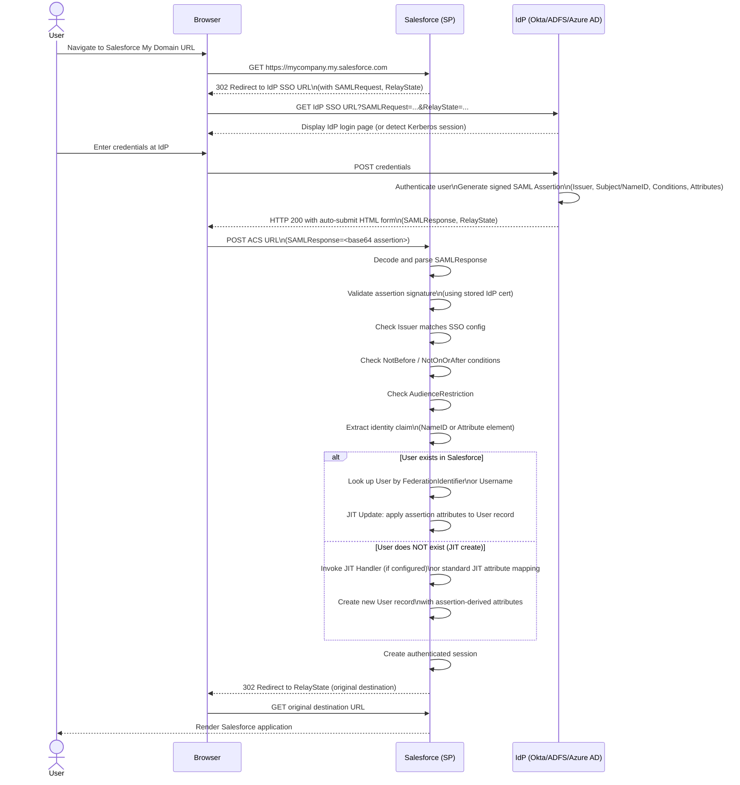
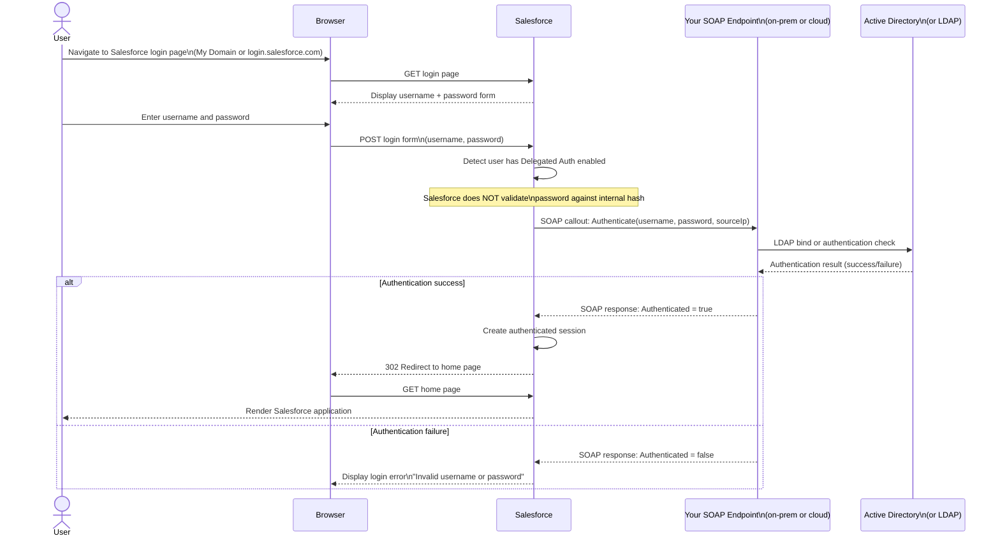
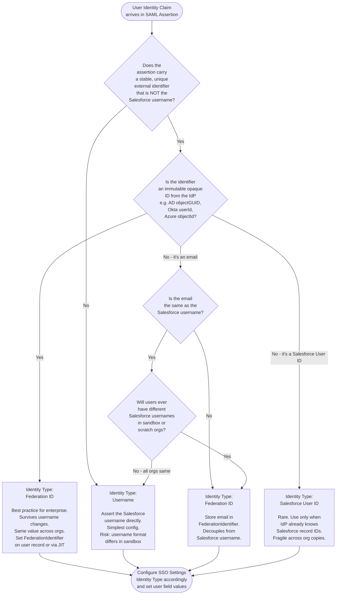
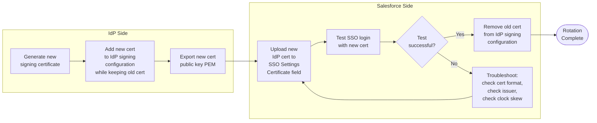

# Salesforce as a Service Provider (Inbound SSO)

## Exam Domain
Salesforce Identity — 25% of exam weight

---

## Foundations

### What Does "Service Provider" Mean?

In a federated identity architecture, two roles exist:

- **Identity Provider (IdP):** The system that authenticates the user and vouches for their identity. Examples: Active Directory Federation Services (AD FS), Okta, Azure Active Directory (Entra ID), PingFederate, OneLogin.
- **Service Provider (SP):** The system that the user wants to access. It trusts the IdP's assertion rather than managing its own authentication. **Salesforce acts as the SP** in inbound SSO.

When Salesforce is configured as an SP, it says: "I will not validate this user's password directly. Instead, I will trust a signed XML assertion from a pre-configured IdP. If the assertion is valid and I can match the identity claim to a Salesforce user record, I will grant a session."

This is the foundational mental model. Everything in this lecture flows from it.

### SAML 2.0 — The Protocol Layer

Security Assertion Markup Language 2.0 (SAML 2.0) is the dominant federation protocol in enterprise Salesforce deployments. It is an XML-based open standard for exchanging authentication and authorization data between an IdP and an SP.

Key SAML concepts you must know cold:

| Term | Definition |
|---|---|
| **Assertion** | A signed XML document the IdP issues after authenticating the user. Contains Subject, Conditions, and AuthnStatement. |
| **AuthnRequest** | An XML message from the SP asking the IdP to authenticate the user (SP-initiated flow). |
| **Binding** | The transport mechanism for SAML messages. HTTP-POST and HTTP-Redirect are most common. |
| **EntityID** | A URI that uniquely identifies a party (IdP or SP) in SAML. NOT necessarily a real URL. |
| **Issuer** | The entityID of the party that issued the SAML message. In an assertion, this is the IdP's entityID. |
| **Subject** | The principal being asserted — typically the user. Carried in the `<NameID>` element. |
| **Conditions** | Time bounds (`NotBefore`, `NotOnOrAfter`) and audience restrictions on an assertion. |
| **Signature** | The IdP signs the assertion (and optionally the response envelope) with its private key. Salesforce validates using the IdP's public certificate. |
| **ACS URL** | Assertion Consumer Service URL — the SP endpoint that receives the SAML response. |
| **Metadata** | XML document describing an entity's SAML configuration (entityID, endpoints, certificate). |

### SAML Flow Overview (SP-Initiated)

1. User navigates to a Salesforce URL (My Domain or a deep link).
2. Salesforce detects the user is unauthenticated and the org has SSO configured.
3. Salesforce constructs an `AuthnRequest`, signs it (optionally), and redirects the user's browser to the IdP's Single Sign-On URL.
4. IdP authenticates the user (Kerberos, MFA, etc.).
5. IdP generates a signed SAML assertion and POST it to Salesforce's ACS URL via the user's browser.
6. Salesforce validates the assertion signature, checks time conditions, resolves the user identity claim, and creates a session.

### SAML Flow Overview (IdP-Initiated)

1. User authenticates at the IdP portal (e.g., Okta dashboard).
2. User clicks a Salesforce tile.
3. IdP generates an assertion without a prior `AuthnRequest` and POSTs it to Salesforce's ACS URL.
4. Salesforce validates and grants a session.

IdP-initiated flows have no `InResponseTo` attribute in the response, and Salesforce must be configured to accept unsolicited responses.

---

## Core Concepts

### Configuring SAML SSO Settings in Salesforce

Navigate to: **Setup > Identity > Single Sign-On Settings**

Enable SAML at the org level: check **SAML Enabled** (org-level toggle). This gate-keeps all SAML SSO configurations.

Then click **New** to create an SSO configuration. Key fields:

#### Name and API Name
The label for this SSO configuration. Salesforce generates a URL-safe API name. Both are used in troubleshooting and in My Domain configuration.

#### Issuer (IdP EntityID)
This is the **entityID** of the IdP as it appears in the SAML assertion's `<Issuer>` element. Common examples:

- AD FS: `http://adfs.contoso.com/adfs/services/trust`
- Okta: `http://www.okta.com/exk1abc2defg3hij4`
- Azure AD: `https://sts.windows.net/{tenant-id}/`
- PingFederate: `https://pingfederate.example.com`

**Critical:** The Issuer value in Salesforce must match the Issuer element in every incoming assertion **exactly** — case-sensitive, slash-for-slash. A mismatch causes `SAML_ASSERTION_ERROR: issuer mismatch`. This is a top exam trap.

#### Identity Provider Certificate
The X.509 public certificate of the IdP. Salesforce uses this to validate the digital signature on the SAML assertion. Without signature validation, any party could forge an assertion — this is the security anchor of the entire trust relationship.

Steps:
1. Export the signing certificate from your IdP (PEM or DER format).
2. In Salesforce, upload it in the **Identity Provider Certificate** field.
3. Salesforce stores it and uses it at assertion-validation time.

**Certificate Rotation:** When the IdP rotates its signing certificate, you must update this field before the old cert expires. Many production outages stem from certificate expiry. Best practice: maintain two active certificates during rotation windows (if the IdP supports it). Salesforce allows only one certificate per SSO config — plan rotation carefully.

**Certificate Pinning Implications:** Salesforce pins the specific certificate. If the IdP re-issues a certificate from the same CA but with a new public key, you must update Salesforce. There is no automatic trust-chain-based validation — it is explicit cert pinning.

#### Identity Location
Tells Salesforce where in the assertion to find the user identity claim.

| Option | Where it reads |
|---|---|
| **Subject's NameID** | The `<NameID>` element inside the `<Subject>` block |
| **Attribute element** | A custom `<Attribute>` element in the assertion. You specify the attribute name. |

Most enterprise configurations use **Subject's NameID** (simpler, standard). The attribute-element option is used when IdPs cannot easily control NameID format or when multiple orgs share an IdP and need different identity fields per org.

#### Identity Type
Tells Salesforce which Salesforce User field to match the identity claim against.

| Option | Salesforce User Field | Notes |
|---|---|---|
| **Username** | `User.Username` | Default. Format: `user@domain.com.sandbox` in sandboxes. Requires exact match. |
| **Federation ID** | `User.FederationIdentifier` | Recommended for enterprise. Decoupled from Salesforce username. Survives username changes. |
| **Salesforce User ID** | `User.Id` | 15 or 18-char Salesforce record ID. Rare. Only usable when the IdP knows Salesforce IDs. |

**Federation ID is the architect's choice.** It survives org migrations, username policy changes, and sandbox refreshes (with appropriate handling). It maps cleanly to the enterprise directory's immutable identifier (e.g., AD `objectGUID` or `sAMAccountName`).

#### Request Signing Certificate
The certificate Salesforce uses to sign outbound `AuthnRequest` messages (SP-initiated SSO only). Select a certificate from Salesforce Certificate and Key Management. Not all IdPs require signed requests, but regulated environments and strict IdPs (some AD FS configurations) mandate it.

#### Request Signature Method
`RSA-SHA1` or `RSA-SHA256`. Always choose `RSA-SHA256` for new configurations — SHA-1 is deprecated.

#### Assertion Decryption Certificate
If the IdP encrypts the assertion (not just signs it), Salesforce needs the private key to decrypt it. Select the Salesforce-managed certificate whose public key was shared with the IdP for encryption. Encrypted assertions are less common but used in high-security environments.

#### Single Logout (SLO)
Configure the IdP's SLO URL and the Logout URL. When enabled, logging out of Salesforce sends a `LogoutRequest` to the IdP, which terminates sessions across all federated apps. Important for regulated environments but often skipped in initial deployments.

---

### NameID Formats

The `<NameID>` element carries a format attribute telling the SP how to interpret the value.

| Format URN | Meaning | Use Case |
|---|---|---|
| `urn:oasis:names:tc:SAML:1.1:nameid-format:unspecified` | No specific format. SP decides how to interpret. | Most flexible. Common in Okta/Azure AD defaults. |
| `urn:oasis:names:tc:SAML:1.1:nameid-format:emailAddress` | Value is an email address. | When matching Salesforce Username (email format) or Federation ID. |
| `urn:oasis:names:tc:SAML:2.0:nameid-format:persistent` | Opaque, permanent identifier for the user at this SP. Should not change. | When Federation ID is used with a stable opaque IdP identifier. |
| `urn:oasis:names:tc:SAML:2.0:nameid-format:transient` | Ephemeral identifier, changes per session. | Guest or anonymous use cases. NOT suitable for user matching in Salesforce. |

**Exam note:** Transient NameID cannot be used to match a Salesforce user record across sessions (by definition it changes each time). If you see a scenario where a transient NameID is used with Identity Type = Federation ID, that is a configuration error.

---

### Assertion Consumer Service (ACS) URL

The ACS URL is the Salesforce HTTPS endpoint that receives the `SAMLResponse` via HTTP-POST.

Format:
```
https://<my-domain>.my.salesforce.com?so=<orgID>
```

Or for My Domain:
```
https://<my-domain>.my.salesforce.com
```

You can find the ACS URL in Setup > Single Sign-On Settings > (your config) > view. Salesforce also exposes it in the SP metadata XML, downloadable from that page.

**Important details:**
- Salesforce validates that the `Destination` attribute in the assertion matches the ACS URL exactly.
- In sandbox orgs, the ACS URL changes because the org ID is different. This catches many teams during sandbox refresh — IdP configurations pointing to prod ACS URLs break sandbox SSO.
- When using My Domain, the ACS URL includes the My Domain hostname. Ensure the IdP is configured with the correct My Domain URL, not the classic `login.salesforce.com` URL.

---

### My Domain and SSO Configuration

My Domain is a prerequisite for SSO in most modern Salesforce configurations (required for Lightning Experience, Communities/Experience Cloud, embedded apps).

After deploying My Domain, navigate to **Setup > Company Settings > My Domain > Authentication Configuration**.

Here you:
1. Choose which **Authentication Services** appear on the My Domain login page. Each configured SSO setting is an option.
2. Check **Prevent login from `login.salesforce.com`** to enforce My Domain-only access (and thus enforce SSO for users whose profile requires it).
3. Configure the login page appearance (show/hide username+password form, show specific SSO buttons).

**SSO enforcement per user:** The user's profile or permission set can set **Is Single Sign-On Enabled** (SSO Required). Users with this enabled cannot use the username+password form — they must authenticate via the configured IdP. This is how you enforce SSO org-wide without removing the password option globally.

**My Domain subdomain change:** When a company changes its Salesforce My Domain (e.g., after a rebranding), all ACS URLs change. Every IdP SAML application configuration must be updated. This is a significant migration task — plan with org-wide communications.

---

### User Provisioning Strategies

When Salesforce receives a valid assertion, it must resolve the identity claim to a Salesforce User record. Three strategies exist:

#### Strategy 1: Pre-Created Users (Most Common Enterprise Pattern)

Users exist in Salesforce before first SSO login. The federation identifier in the assertion matches a field on the existing user record (Username or FederationIdentifier).

- **Pros:** Full control over user configuration (profile, role, permissions). No surprise user creation. Complies with strict license management.
- **Cons:** Requires a user provisioning process (HR system → IdP → Salesforce, often via SCIM or manual batch). New hire delay if provisioning is not automated.
- **When to use:** Most enterprise customers with User lifecycle management (ULM) processes, regulated industries, orgs where license counts matter.

#### Strategy 2: JIT (Just-In-Time) Provisioning

Salesforce creates or updates a User record on first (and subsequent) SSO login using attributes from the SAML assertion.

- **Pros:** Zero-touch provisioning. User account exists in Salesforce the moment they first log in. Attributes stay in sync on each login.
- **Cons:** Risk of unwanted user creation if assertion is misconfigured. Requires careful attribute mapping. Profile/Role must be deterministic from assertion attributes.
- **When to use:** High-volume user bases, partner portals, Experience Cloud communities, organizations that want IdP as the system of record for user attributes.

#### Strategy 3: Account Linking (Third-Party Account Link)

An existing Salesforce user links their account to an external identity. The `ThirdPartyAccountLink` object stores the relationship. Used in social login scenarios (Salesforce as SP with a consumer IdP like Google or Salesforce-as-IdP) or when migrating from password to SSO without recreating users.

---

### JIT Provisioning Deep Dive

#### Enabling JIT

In Setup > Single Sign-On Settings > (your config), check **Just-in-Time (JIT) User Provisioning**. You can also optionally check **JIT Handler** to point to an Apex class that implements `Auth.SamlJitHandler`.

#### Standard Attribute Mapping

When standard JIT is enabled (no Apex handler), Salesforce reads specific `<Attribute>` elements from the SAML assertion to populate user fields. The attribute names must match exactly:

| SAML Attribute Name | Salesforce User Field | Notes |
|---|---|---|
| `User.FirstName` | `User.FirstName` | Optional |
| `User.LastName` | `User.LastName` | Required |
| `User.Email` | `User.Email` | Required |
| `User.FederationIdentifier` | `User.FederationIdentifier` | Used when Identity Type = Federation ID |
| `User.Username` | `User.Username` | Required if not derivable |
| `User.ProfileId` | `User.ProfileId` | 15/18-char Profile record ID |
| `User.UserRoleId` | `User.UserRoleId` | Optional |
| `User.Title` | `User.Title` | Optional |
| `User.CompanyName` | `User.CompanyName` | Optional |
| `User.Department` | `User.Department` | Optional |
| `User.LocaleSidKey` | `User.LocaleSidKey` | Locale code, e.g., `en_US` |
| `User.LanguageLocaleKey` | `User.LanguageLocaleKey` | Language code |
| `User.TimeZoneSidKey` | `User.TimeZoneSidKey` | TZ code, e.g., `America/New_York` |

**JIT Update Behavior:** By default, JIT updates the user record on every successful SSO login with the latest assertion attributes. This keeps Salesforce in sync with the IdP. However, if attributes are missing from the assertion, those fields are NOT cleared — only present attributes update the record.

**Profile assignment via JIT:** If `User.ProfileId` is missing from the assertion and the user doesn't exist yet, JIT fails. Always ensure the profile ID is in the assertion or use a JIT Handler to apply default logic.

#### JIT Handler Apex Class

For complex provisioning logic, implement `Auth.SamlJitHandler`:

```apex
global class MyJitHandler implements Auth.SamlJitHandler {

    global User createUser(
        Id samlSsoProviderId,
        Id communityId,
        Id portalId,
        String federationIdentifier,
        Map<String, String> attributes,
        String assertion
    ) {
        User u = new User();
        u.Username = attributes.get('User.Username');
        u.LastName = attributes.get('User.LastName');
        u.FirstName = attributes.get('User.FirstName');
        u.Email = attributes.get('User.Email');
        u.FederationIdentifier = federationIdentifier;
        u.Alias = u.FirstName.substring(0,1) + u.LastName.substring(0,5);
        u.CommunityNickname = u.Username;
        u.LocaleSidKey = 'en_US';
        u.TimeZoneSidKey = 'America/New_York';
        u.LanguageLocaleKey = 'en_US';
        u.EmailEncodingKey = 'UTF-8';
        u.ProfileId = [SELECT Id FROM Profile WHERE Name = 'Standard User' LIMIT 1].Id;
        return u;
    }

    global void updateUser(
        Id userId,
        Id samlSsoProviderId,
        Id communityId,
        Id portalId,
        String federationIdentifier,
        Map<String, String> attributes,
        String assertion
    ) {
        User u = new User(Id = userId);
        u.Email = attributes.get('User.Email');
        u.FirstName = attributes.get('User.FirstName');
        u.LastName = attributes.get('User.LastName');
        update u;
    }
}
```

The handler is invoked in system context (no sharing restrictions). It can perform DML, SOQL, callouts (async context only), and complex business logic — e.g., assigning permission sets based on IdP group attributes, creating related Contact records for partner users.

**JIT Handler Registration:** In Setup > Single Sign-On Settings, set the **SAML JIT Handler** field to your Apex class name. The class must be global and implement `Auth.SamlJitHandler`.

#### JIT for Contacts in Communities (Experience Cloud)

For Experience Cloud (Community) portals, JIT can provision **Contact + User** pairs. The assertion must include:

- `ContactId` or `Contact.Email` (to find/create the underlying Contact)
- `AccountId` (the Account the Contact belongs to)
- Portal user profile mapping

When JIT creates a portal user, it:
1. Finds or creates a Contact record matching the assertion attributes.
2. Creates a portal User linked to that Contact.
3. Associates the User with the correct Account (via Contact's AccountId).

This is complex. JIT Handler Apex is strongly recommended for community portal provisioning to handle edge cases (duplicate contacts, contact ownership, account assignment).

---

### Delegated Authentication vs. SAML SSO

These are two entirely different mechanisms that both enable external authentication. Exam questions frequently test whether you understand the distinction.

#### Delegated Authentication

**How it works:**
1. User types their username and password into the Salesforce login form.
2. Salesforce intercepts the credentials and sends them (over HTTPS) to a web service endpoint you control.
3. Your web service validates the credentials (e.g., against Active Directory via LDAP).
4. Your web service returns a success/failure response.
5. Salesforce grants or denies the session based on the response.

**Key characteristics:**
- The **password IS typed into Salesforce** — users interact with the Salesforce login UI.
- Salesforce does NOT store the password hash (delegated auth bypasses Salesforce password validation).
- Your web service endpoint must be publicly accessible from Salesforce data centers.
- Enabled per user via the **Is Delegated Authentication** checkbox on the User record (or via profile setting).
- The endpoint URL is set in Setup > Security Controls > Delegated Authentication.

**Delegated Authentication SOAP Request (what Salesforce sends):**
```xml
<Envelope>
  <Body>
    <Authenticate>
      <username>user@example.com</username>
      <password>userpassword</password>
      <sourceIp>1.2.3.4</sourceIp>
    </Authenticate>
  </Body>
</Envelope>
```

**SAML SSO:**
- The **password is NEVER typed into Salesforce** — authentication happens entirely at the IdP.
- No web service endpoint required on your side (IdP handles authentication).
- Browser-based redirect mechanism (not a Salesforce-to-endpoint callout).
- No credentials transmitted to Salesforce.
- Assertion-based — cryptographically signed.

#### Comparison Table

| Dimension | Delegated Authentication | SAML SSO |
|---|---|---|
| Password in Salesforce | Yes (typed into SF login form) | No |
| Salesforce calls external service | Yes (SOAP web service) | No |
| Authentication UI | Salesforce login page | IdP login page |
| Protocol | Proprietary SOAP | SAML 2.0 |
| MFA handled by | Your web service or Salesforce | IdP |
| Assertion/token | None | SAML assertion (XML, signed) |
| Credential exposure risk | Higher (password traverses SF) | Lower |
| Best for | Legacy on-prem AD with no ADFS | Modern enterprise IdP |
| Still used? | Legacy scenarios, migration paths | Preferred for new deployments |

**Exam trap:** A question about "the user's password is NOT stored in Salesforce" applies to BOTH delegated auth (password not stored but IS transmitted to SF temporarily) and SAML (password never reaches SF). Distinguish by flow, not just password storage.

#### Delegated Authentication Setup

1. **Enable org permission:** Setup > Security Controls > Delegated Authentication > enable checkbox.
2. **Set endpoint URL:** Enter the HTTPS URL of your web service.
3. **Enable per user:** On the User record, check **Is Delegated Authentication** (or configure at profile level).
4. **Test credentials:** Use the built-in test feature in Setup to send a test SOAP call to your endpoint.
5. **Enforce TLS:** The endpoint must use valid TLS (Salesforce will not call HTTP endpoints).

---

### Linked Accounts and ThirdPartyAccountLink

Salesforce users can link multiple external identities to their account using the `ThirdPartyAccountLink` object. This supports scenarios such as:

- A user authenticates with both Okta SSO and Google OAuth.
- An internal user links their corporate Okta identity and a personal GitHub identity.
- Migration from one IdP to another with dual-login during the transition.

`ThirdPartyAccountLink` record fields:
- `UserId` — the Salesforce User record.
- `SsoProviderId` — the SSO Provider or Auth Provider configuration.
- `RemoteIdentifier` — the external identifier (NameID or subject value from the IdP).
- `Handle` — display name for the link.

Users manage linked accounts from their personal settings (**My Settings > Advanced User Details > Authentication Settings for External Systems** or via community profile pages).

**Note:** A single user can have multiple `ThirdPartyAccountLink` records (one per linked external identity). However, a given `RemoteIdentifier` + `SsoProviderId` combination must be unique — you cannot link the same external identity to two different Salesforce users.

---

### Error Handling: SAML Error Codes

When SSO fails, Salesforce displays an error code and message. Know these for the exam and for production support:

| Error Code | Cause | Resolution |
|---|---|---|
| `SAML_ASSERTION_ERROR` | Generic assertion validation failure. Often issuer mismatch, signature failure, or audience restriction failure. | Check Issuer config. Validate cert. Check Audience URI. |
| `USER_NOT_FOUND` | Identity claim in assertion doesn't match any Salesforce user (when JIT is disabled). | Fix Federation ID or Username on the user record. Enable JIT if needed. |
| `USER_NOT_ACTIVE` | Matched user is inactive/frozen. | Activate the user in Salesforce. |
| `INVALID_SAML_ISSUER` | Assertion's `<Issuer>` doesn't match the configured Issuer. | Verify exact issuer string match (case-sensitive). |
| `INVALID_CERTIFICATE` | Assertion signature can't be validated against the stored cert. | Update the IdP certificate in Salesforce SSO settings. |
| `ASSERTION_EXPIRED` | Assertion is outside the `NotBefore`/`NotOnOrAfter` window. | Check clock skew between IdP and Salesforce. Typical tolerance: ±5 minutes. |
| `INVALID_AUDIENCE` | The `AudienceRestriction` in the assertion doesn't match Salesforce's entityID. | Configure IdP to set correct Audience URI (Salesforce org entityID). |
| `JIT_PROVISIONING_ERROR` | JIT failed to create/update user. | Check required attribute mapping. Review debug logs for Apex JIT Handler. |
| `SAML_DUPLICATE_USER` | JIT tried to create a user but matching user already exists with different federation ID. | Resolve duplicate identity mapping. |

**Debugging tip:** Use **Setup > Identity Verification > SAML Assertion Validator** (paste an assertion to validate it against your SSO config). Also enable Debug Logs for the SSO flow — Salesforce logs SAML validation steps under the `ApexCode` and `AuthenticationService` log categories.

---

## PTA / SA Relevance

### When This Comes Up in Engagements

**Every enterprise Salesforce deployment.** SSO is not a feature conversation — it is a platform governance conversation. PTAs encounter Salesforce-as-SP in:

- **New org deployments:** First question from enterprise security: "Can we use our existing IdP?" Answer is always yes, and you own the architecture.
- **Acquisitions and divestitures:** The acquiring company's IdP must federate to the acquired company's Salesforce org (or vice versa). JIT vs. pre-created user choice matters enormously during M&A cutover timelines.
- **Experience Cloud partner/customer portals:** JIT provisioning for external users who cannot be pre-provisioned. Requires JIT Handler Apex for anything beyond trivial attribute mapping.
- **Regulated industries (FINS, HIPC, government):** MFA enforcement, SLO requirements, certificate rotation procedures — all of this lives in the SAML SSO config. You are the one who knows how it works.
- **Multi-org architectures:** A company with 5 Salesforce orgs all federating to the same Okta tenant. Each org is a separate SAML SP application in Okta. ACS URLs, audience URIs, and federation IDs must be carefully segregated.

### Common Architecture Failures

**Failure 1: Issuer / EntityID Mismatch**
The single most common SSO break. The IdP admin changes the federation metadata (e.g., migrates from one PingFederate instance to another), and the Issuer string changes. Salesforce throws `INVALID_SAML_ISSUER`. Resolution: update Salesforce SSO Settings Issuer field. Prevention: treat the Issuer field as immutable infrastructure — document it, put it in runbooks, never change it without a coordinated update.

**Failure 2: Certificate Expiry**
IdP signing certificates have 1-5 year lifespans. Nobody tracks them. The certificate expires, assertions can no longer be validated, and every user is locked out simultaneously at 3 AM on a Tuesday. Resolution: rotate the cert (upload new cert to Salesforce SSO Settings before old cert expires). Prevention: calendar reminders 90/60/30 days before expiry. Many enterprises now use their PKI team's certificate lifecycle management system to track IdP certs.

**Failure 3: Sandbox ACS URL Not Updated**
After a sandbox refresh, the org ID changes. The ACS URL in the IdP's SAML application still points to the old sandbox ACS URL (or production). Assertions arrive at Salesforce but the `Destination` doesn't match, causing assertion errors. Resolution: update IdP SAML app with new sandbox ACS URL after every refresh. Prevention: automate the sandbox refresh runbook to include IdP configuration updates.

**Failure 4: JIT Creates Duplicate Users**
JIT is enabled but the Federation ID is not unique across the user population (e.g., the assertion sends email address as Federation ID, and the same email is used in multiple Salesforce orgs or by a renamed user). Result: JIT tries to create a second user record, fails on uniqueness constraint. Resolution: use immutable identifiers (AD `objectGUID`, Okta `userId`, Azure AD `objectId`) as Federation IDs — never email addresses.

**Failure 5: Username Format in Sandbox**
A user's Salesforce Username in production is `jsmith@contoso.com`. In sandbox it is `jsmith@contoso.com.devuat`. The IdP asserts `jsmith@contoso.com`. If Identity Type = Username (not FederationId), the sandbox lookup fails. Mitigation: use FederationIdentifier (same value in prod and sandbox), or configure sandbox with Identity Type = Federation ID.

**Failure 6: Profile Not Assigned in JIT**
JIT provisioning is enabled with standard attribute mapping. The `User.ProfileId` attribute is missing from the assertion (IdP admin forgot to include it). First-time users cannot be created — `JIT_PROVISIONING_ERROR`. Existing users are not affected (update path). Fix: add `User.ProfileId` to the assertion, or implement a JIT Handler that assigns a default profile.

**Failure 7: Clock Skew**
The IdP's system clock is 7 minutes ahead of NTP. The assertion's `NotBefore` is in the future from Salesforce's perspective — assertion appears invalid. Salesforce has a default tolerance of approximately 3-5 minutes. Fix: sync IdP clock to NTP. This is surprisingly common with on-premises AD FS servers that drift.

### Enterprise Patterns

#### Pattern 1: Centralized IdP with Federation Hub

Large enterprises (50,000+ employees) often run a federation hub — a PingFederate or ForgeRock instance that aggregates identity from multiple sources (Active Directory, HR system, acquired-company LDAP) and presents a single SAML IdP to all SPs including Salesforce. The hub handles attribute enrichment (adding department, role, license type from HR system), MFA policy enforcement, and step-up authentication.

From Salesforce's perspective, this is just one SAML IdP. The complexity lives behind the federation hub.

#### Pattern 2: Multi-Org Federation

Company has Sales Cloud, Service Cloud, and a CPQ org. All three federate to the same Okta tenant. Each org is a separate Okta SAML app with its own ACS URL, audience URI, and SSO configuration. Users have Federation IDs set to the same value across all three orgs (e.g., their Okta `userId`). Centralized JIT Handler Apex (duplicated or managed via unlocked package) ensures consistent provisioning logic.

Certificate rotation affects all three orgs simultaneously — coordinate the update across all three SSO configurations.

#### Pattern 3: Partner Community with JIT

B2B SaaS company has 10,000 partner users in Experience Cloud. Partners authenticate at their own company IdPs (one per partner). Each partner IdP is a separate SAML SSO configuration in Salesforce. JIT Handler Apex determines account assignment based on the partner's domain (parsed from the asserted email). Pre-creating 10,000 users is not operationally feasible — JIT is the only viable pattern here.

#### Pattern 4: AD FS Configuration Checklist

When configuring AD FS as the IdP for Salesforce:

1. **Relying Party Trust:** Create in AD FS with Salesforce's entity ID as the identifier.
2. **Endpoint:** Add the Salesforce ACS URL as a SAML 2.0 assertion consumer endpoint (HTTP POST binding).
3. **Claims Issuance Rules:**
   - Name ID (NameID): Send LDAP attribute → `sAMAccountName` (or `objectGUID` for Federation ID scenarios) → mapped to Name ID with format `unspecified` or `emailAddress`.
   - Additional attributes: `User.Email`, `User.FirstName`, `User.LastName`, `User.FederationIdentifier` — mapped from AD LDAP attributes.
4. **Token-signing certificate:** Export the public cert from AD FS (Certificates > Token-signing > View > Copy to file). Upload to Salesforce SSO Settings.
5. **Signature algorithm:** Configure AD FS to use SHA-256 (not SHA-1) for token signing.
6. **AuthnRequest:** If Salesforce sends signed AuthnRequests, import Salesforce's signing certificate into AD FS relying party trust properties.

#### Pattern 5: Okta / Azure AD SAML Template Notes

**Okta:**
- Use the pre-built "Salesforce.com" app in the Okta Integration Network (OIN). It pre-fills ACS URL format and attribute mappings.
- Okta entityID: `http://www.okta.com/{app-id}` — copy exactly from the Okta admin Sign On > SAML Signing Certificates > View SAML setup instructions page.
- Attribute statements: Okta supports mapping profile attributes. Map `user.login`, `user.email`, `user.firstName`, `user.lastName`, `user.employeeNumber` (for Federation ID).

**Azure AD (Entra ID):**
- Use the Enterprise Application > Non-gallery app or search "Salesforce" in the gallery.
- entityID (issuer): `https://sts.windows.net/{tenantId}/` — include trailing slash. This is a common mismatch source.
- NameID: Configure as `user.userprincipalname` or a custom attribute.
- Attributes & Claims: Map Azure AD attributes to Salesforce JIT attribute names.
- Azure AD supports claims transformation — useful for mapping immutable Azure AD `objectId` to `User.FederationIdentifier`.

---

## Architecture

### SP-Initiated SAML Flow with Salesforce as SP and JIT Provisioning



---

### Delegated Authentication Flow



---

### Identity Type Selection Decision Tree



---

### Certificate Rotation Process



**Limitations and Tradeoffs:**

- Salesforce SSO Settings supports **one** IdP certificate per configuration. You cannot pre-load the new certificate and old certificate simultaneously in Salesforce. The moment you upload the new cert, Salesforce uses it exclusively. This creates a brief window of risk — if the IdP has already switched to the new cert before Salesforce is updated, assertions will fail during the update interval. Coordinate the certificate update with zero-downtime: (1) keep the old cert active on the IdP, (2) update Salesforce to the new cert, (3) then switch the IdP to the new cert.

- Some enterprise IdPs (PingFederate, Shibboleth) support multiple simultaneous signing certificates during rotation — use this feature to overlap the certificates and eliminate downtime.

- Delegated Authentication endpoint TLS certificates are managed by your endpoint's web server, not by Salesforce. Salesforce validates the TLS chain but does not pin the endpoint certificate. Endpoint TLS rotation is transparent to Salesforce as long as the certificate chains to a trusted root CA.

- JIT Handler Apex runs in system context — no sharing rules apply. This is necessary for creating users (users can't create users in user context) but means JIT Handler bugs can cause unintended data modification. Always test JIT Handlers in sandboxes with debug logging before production deployment.

---

## Key Facts to Memorize

1. **Salesforce-as-SP:** Salesforce trusts the IdP's signed SAML assertion. The user's password never reaches Salesforce.

2. **Issuer field = IdP entityID.** Must match the `<Issuer>` element in the assertion exactly (case-sensitive, character-for-character).

3. **ACS URL = Assertion Consumer Service URL.** The Salesforce HTTPS endpoint that receives the POST'd SAML assertion. Format: `https://<mydomain>.my.salesforce.com?so=<orgId>`.

4. **Identity Type options:** Username (default), Federation ID (best practice), Salesforce User ID (rare).

5. **Federation ID is stored in `User.FederationIdentifier`** and is indexed for fast SSO lookups.

6. **NameID format `transient` cannot be used to match Salesforce users** — it changes per session by definition.

7. **JIT provisioning = on-demand user creation/update from assertion attributes.** Requires specific SAML attribute names (e.g., `User.Email`, `User.ProfileId`).

8. **JIT Handler implements `Auth.SamlJitHandler`** and overrides `createUser()` and `updateUser()` methods.

9. **Delegated Authentication:** password IS typed into Salesforce → Salesforce calls your SOAP endpoint → your endpoint validates against AD/LDAP. Assertion-based? No.

10. **SAML SSO:** password typed into IdP's form → IdP POST signed assertion to Salesforce ACS URL. Assertion-based? Yes.

11. **Certificate expiry** is the #1 cause of production SSO outages. Track it. Rotate before expiry.

12. **Sandbox ACS URL is different from production ACS URL.** IdP must be updated after sandbox refresh.

13. **My Domain is required** for SSO in Lightning Experience and Experience Cloud.

14. **Single Logout (SLO)** terminates sessions across all federated apps, not just Salesforce.

15. **`ThirdPartyAccountLink`** stores linked external identities — a user can link multiple external accounts.

16. **SHA-256** is required for new configurations. AD FS defaults to SHA-1 — explicitly change it.

17. **`NotBefore`/`NotOnOrAfter`** window in the assertion must encompass the current time. Clock skew > ~5 minutes causes assertion failures.

18. **Audience Restriction** in the assertion must match Salesforce's SP entity ID (the org's My Domain URL or entity identifier).

19. **JIT for Communities:** Can provision Contact + User pairs. Requires `AccountId` and `ContactId` (or matchable contact attributes) in the assertion.

20. **Delegated Auth requires:** org-level enable, endpoint URL configuration, and per-user checkbox on User record.

---

## Exam Traps

**Trap 1: "No password stored in Salesforce" applies to both Delegated Auth AND SAML SSO**
Salesforce does not store password hashes for users on either mechanism. But the key difference is WHERE the password is entered (Salesforce login form vs. IdP login form). Pick the answer that distinguishes based on the authentication flow, not just password storage.

**Trap 2: Issuer vs. entityID confusion**
The Issuer field in Salesforce SSO Settings = the IdP's entityID. Do not confuse it with the SP's entityID (which is Salesforce's entity identifier shown in the SP metadata). Exam questions may describe a scenario where "the entityID of the IdP" needs to be configured — that's the Issuer field.

**Trap 3: Federation ID vs. Username for JIT**
Standard JIT attribute mapping uses `User.FederationIdentifier` as the attribute name, but only if Identity Type = Federation ID. If Identity Type = Username, the username must be in the assertion's identity location (NameID or attribute). Don't assume JIT always sets the Federation ID.

**Trap 4: JIT Handler creates users, standard JIT needs all required fields in assertion**
If `User.ProfileId` is missing from the SAML assertion and no JIT Handler is configured, user creation fails silently on first login. Standard JIT attribute mapping requires all mandatory User fields to be present. JIT Handler can supply defaults — standard JIT cannot.

**Trap 5: SAML signature validation uses the STORED certificate, not certificate chain**
Salesforce does NOT do PKI chain validation for SAML assertions. It explicitly checks the assertion signature against the exact certificate uploaded in the SSO Settings. Even if the IdP has a cert issued by a trusted CA, if that exact cert isn't uploaded, validation fails. This is explicit certificate pinning.

**Trap 6: SP-initiated vs. IdP-initiated and the InResponseTo attribute**
SP-initiated flows produce assertions with an `InResponseTo` attribute referencing the `AuthnRequest` ID. IdP-initiated flows have no `InResponseTo`. If Salesforce requires SP-initiated flows only (a security setting), it will reject assertions without `InResponseTo`. Know when each is appropriate.

**Trap 7: Transient NameID and JIT**
A question may present transient NameID + JIT enabled. Since transient NameID changes every session, Salesforce cannot match the user on subsequent logins — it would try to create a new user on every login. This is invalid for persistent user accounts. Persistent or unspecified NameID should be used with JIT.

**Trap 8: Delegated Authentication is not MFA-aware by default**
Delegated Auth passes the raw username and password to your endpoint. MFA logic must be implemented in your endpoint. Salesforce's native MFA does NOT apply to delegated authentication flows. A question about "enforcing MFA for all users including delegated auth" — the answer involves configuring MFA at the delegated auth endpoint or switching to SAML SSO where the IdP enforces MFA.

---

## Practice Questions

---

**Question 1**

A global manufacturing company is configuring Salesforce SSO with their on-premises Active Directory Federation Services (AD FS) instance. After configuration, users are unable to log in and receive the error `INVALID_SAML_ISSUER`. The Salesforce administrator confirms the SAML SSO Settings Issuer field is set to `http://adfs.contoso.com/adfs/services/trust`. The IdP admin confirms their AD FS federation service identifier is `http://adfs.contoso.com/adfs/services/trust/`. What is the most likely cause?

A. The Salesforce certificate used to sign the AuthnRequest has expired.
B. The Issuer field in Salesforce SSO Settings does not exactly match the `<Issuer>` element in the SAML assertion due to a trailing slash difference.
C. AD FS is sending the assertion to the wrong ACS URL.
D. The Identity Type is set to Federation ID but users have no FederationIdentifier set on their user records.

**Correct Answer: B**

**Explanation:** `INVALID_SAML_ISSUER` is thrown when the Issuer string in Salesforce's SSO Settings does not exactly match the `<Issuer>` element in the incoming SAML assertion. The strings are compared character-for-character, including trailing slashes. `http://adfs.contoso.com/adfs/services/trust` and `http://adfs.contoso.com/adfs/services/trust/` are different strings. The fix is to update the Salesforce Issuer field to include the trailing slash (or update AD FS to omit it — they must match exactly).

**Why A is wrong:** An expired AuthnRequest signing certificate would cause a different error (often related to signature validation of the request, not the assertion issuer).
**Why C is wrong:** An incorrect ACS URL would prevent the assertion from arriving at Salesforce at all — the user would see an IdP-side error, not a Salesforce `INVALID_SAML_ISSUER` error.
**Why D is wrong:** Missing Federation IDs cause `USER_NOT_FOUND`, not `INVALID_SAML_ISSUER`. The issuer validation happens before user lookup.

---

**Question 2**

A Partner Technical Architect is designing SSO for a Salesforce Experience Cloud portal with 15,000 external partner users. Partners authenticate using their own corporate IdPs (one IdP per partner company — 12 different IdPs in total). User accounts cannot be pre-created due to contractual constraints that prevent exchanging user PII in advance. Partners are onboarded daily. What is the BEST provisioning strategy?

A. Pre-create all 15,000 partner users manually before portal launch.
B. Use Delegated Authentication for each partner IdP, pointing to a centralized SOAP endpoint that queries each partner's LDAP.
C. Enable JIT provisioning with a custom SamlJitHandler Apex class that creates Contact and User records upon first login.
D. Use OAuth 2.0 authorization code flow with each partner IdP and store refresh tokens in a custom object.

**Correct Answer: C**

**Explanation:** JIT provisioning with a custom `SamlJitHandler` Apex class is the optimal strategy for this scenario. JIT creates user (and Contact) records on first successful SSO login, eliminating the need to pre-exchange PII. A custom JIT Handler is required (not standard JIT attribute mapping) because Contact-User pair provisioning for Experience Cloud requires handling `AccountId`, `ContactId`, and partner-specific profile/role assignment — logic too complex for standard attribute mapping. The 12 separate IdPs each have their own SSO configuration in Salesforce, all pointing to the same JIT Handler class, which uses assertion attributes to determine the partner and assign appropriate Account/Profile.

**Why A is wrong:** The requirement explicitly states users cannot be pre-created due to PII constraints. Pre-creation is also operationally infeasible at scale with daily onboarding.
**Why B is wrong:** Delegated Authentication requires users to type their password into Salesforce, which is incompatible with partners using their own IdPs. It also requires a publicly exposed SOAP endpoint and is a legacy pattern not suitable for Experience Cloud partner scenarios.
**Why D is wrong:** The question describes SAML-based IdPs (corporate identity providers), not OAuth. While OAuth is supported for some scenarios, the architecture described — 12 corporate IdPs in a B2B federation scenario — aligns with SAML SSO + JIT, not OAuth authorization code flows.

---

**Question 3**

An organization wants to allow employees to log in to Salesforce using their Active Directory credentials, but the security team mandates that the employee's password must NEVER leave the corporate network boundary and must NEVER be transmitted to Salesforce's servers. Which authentication mechanism satisfies this requirement?

A. Delegated Authentication with an on-premises SOAP endpoint.
B. SAML SSO with Active Directory Federation Services as the Identity Provider.
C. Salesforce-managed username and password with IP range restrictions.
D. OAuth 2.0 Resource Owner Password Credentials flow through an on-premises authorization server.

**Correct Answer: B**

**Explanation:** SAML SSO with AD FS as the IdP is the ONLY option here that guarantees the password never leaves the corporate network. The authentication flow is: user enters credentials into the AD FS login page (on-premises), AD FS authenticates against Active Directory (on-premises), AD FS generates a signed SAML assertion (no password in it), and POSTs the assertion to Salesforce. The password is never transmitted to or through Salesforce's infrastructure.

**Why A is wrong:** Delegated Authentication explicitly transmits the username AND password from Salesforce to the on-premises SOAP endpoint over the network. The password leaves the user's browser, passes through Salesforce's servers, and is then forwarded to the endpoint. While Salesforce uses HTTPS, the password DOES pass through Salesforce's infrastructure — violating the "never transmitted to Salesforce's servers" requirement.
**Why C is wrong:** Salesforce-managed passwords are stored in Salesforce and transmitted to Salesforce during login — directly violating the requirement.
**Why D is wrong:** OAuth 2.0 ROPC flow explicitly involves transmitting the user's password to the authorization server. If routed through Salesforce (or via a Salesforce Connected App), the password passes through Salesforce. Additionally, ROPC is deprecated in OAuth 2.1 for security reasons.

---

**Question 4**

A Salesforce administrator configured SAML SSO with JIT provisioning using standard attribute mapping (no Apex JIT Handler). The SAML assertion includes `User.Email`, `User.FirstName`, `User.LastName`, `User.FederationIdentifier`, and `User.Username` attributes. New users who have never logged in receive a `JIT_PROVISIONING_ERROR`. Existing users can log in successfully and their attributes are updated. What is the MOST likely cause?

A. The `User.FederationIdentifier` attribute is missing from the assertion.
B. The `User.ProfileId` attribute is absent from the SAML assertion, preventing new user creation.
C. The Salesforce SSO Settings Identity Type is set to Username instead of Federation ID.
D. The `User.Username` value in the assertion does not end with `.sandbox` suffix for sandbox orgs.

**Correct Answer: B**

**Explanation:** Standard JIT attribute mapping requires all mandatory Salesforce User fields to be present in the assertion for user CREATE operations. `User.ProfileId` is a required field on User records — a user cannot exist without a Profile. When the assertion lacks `User.ProfileId`, standard JIT cannot create a new user and throws `JIT_PROVISIONING_ERROR`. Existing users are unaffected because JIT updates only apply the attributes that ARE present — the existing user already has a Profile assigned, so the update path succeeds.

**Why A is wrong:** `User.FederationIdentifier` is present according to the question. If it were absent, the error would occur for both new and existing users (the identity claim lookup would fail for everyone).
**Why C is wrong:** The question states Identity Type is irrelevant to this specific error pattern. The symptoms (new users fail, existing users succeed) point to a missing required field for creation, not an identity type mismatch (which would affect all users equally).
**Why D is wrong:** While the `.sandbox` suffix is a real issue for username-based identity type in sandboxes, the question states the `User.Username` attribute IS present in the assertion, and the scenario does not specifically mention this is a sandbox. The symptom pattern (new vs. existing users) points to a missing required field, not a username format issue.

---

**Question 5**

A company has configured Salesforce SSO with Identity Type set to Federation ID. They are migrating from Okta to Azure AD as their IdP. The Azure AD SAML application is configured to send the user's Azure AD `objectId` (an immutable GUID) as the NameID in the assertion. The Okta configuration previously sent the user's `sAMAccountName` as the NameID. After updating the Salesforce SSO Settings (Issuer, Certificate, ACS URL), users cannot log in and receive `USER_NOT_FOUND`. No JIT provisioning is enabled. What must be done to restore SSO access?

A. Enable JIT provisioning in the new SSO settings so Azure AD can recreate all user accounts.
B. Update each Salesforce User record's `FederationIdentifier` field to match the Azure AD `objectId` for that user.
C. Change the Salesforce SSO Settings Identity Type from Federation ID to Username.
D. Configure Azure AD to send `sAMAccountName` as the NameID, identical to what Okta was sending.

**Correct Answer: B**

**Explanation:** The `USER_NOT_FOUND` error means Salesforce received a valid assertion (signature OK, issuer OK, conditions OK) but could not find a User record whose `FederationIdentifier` matches the asserted NameID value. Previously, `FederationIdentifier` on each user was set to their `sAMAccountName` (matching what Okta sent). Now Azure AD is sending the `objectId` (a GUID). Since no user has their `FederationIdentifier` set to their Azure AD `objectId`, all lookups fail. The fix is a data migration: update all Salesforce User records' `FederationIdentifier` values from `sAMAccountName` to Azure AD `objectId`. This can be done via Data Loader with a mapping file from the IdP migration team.

**Why A is wrong:** Enabling JIT would create DUPLICATE user records — one for each user who tries to log in — since the existing users cannot be found via the new `objectId`. This is exactly the wrong approach during an IdP migration and would cause license bloat and data duplication.
**Why C is wrong:** Changing to Identity Type = Username would require the assertion to contain the Salesforce username. Azure AD is sending `objectId`, not Salesforce usernames. This would also not fix the underlying identity mapping problem and would require a different assertion attribute configuration on the Azure AD side.
**Why D is wrong:** While technically possible (configure Azure AD to send `sAMAccountName`), this defeats the purpose of migrating to Azure AD's immutable identifier. `sAMAccountName` can change (user renames) whereas `objectId` is immutable — the whole point of using `objectId` as the Federation ID is stability. This answer is also architecturally backwards: fix the data, not the IdP configuration.

---

*End of Lecture 07: Salesforce as a Service Provider (Inbound SSO)*

*Next: Lecture 08 — Salesforce as an Identity Provider (Outbound SSO)*
