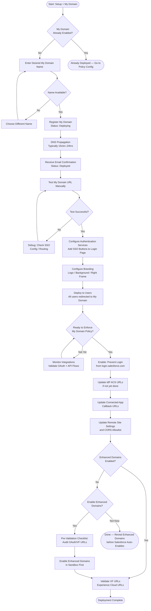
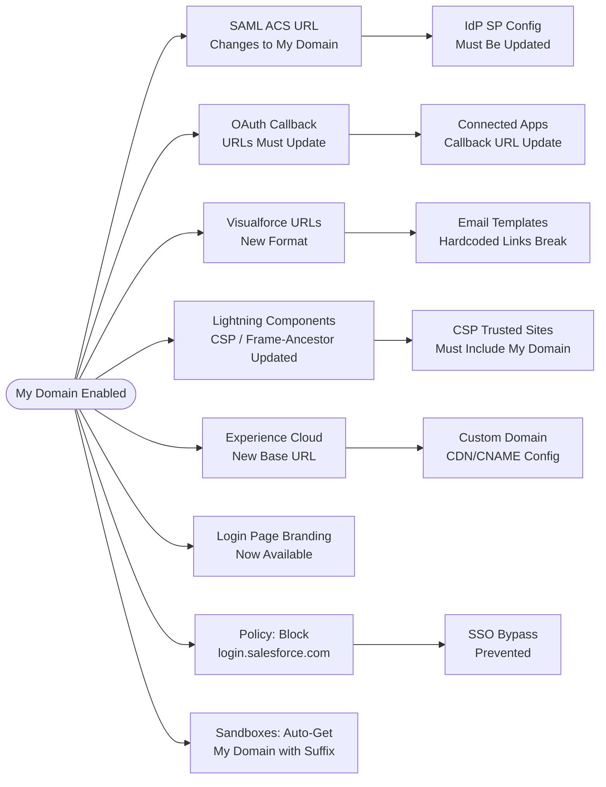
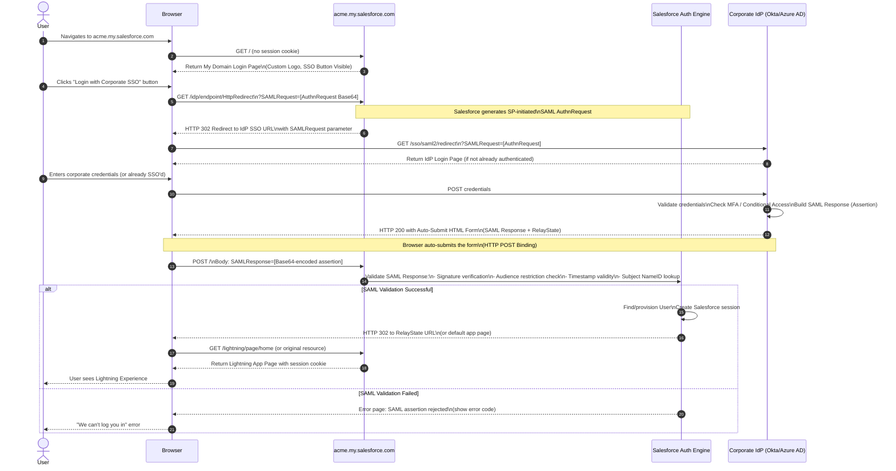
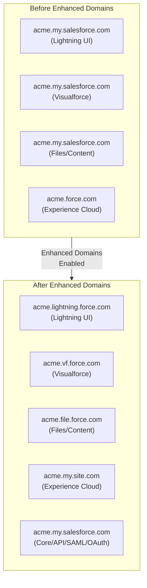

# My Domain & Custom Domains

## Exam Domain
Salesforce Identity — 25% of exam weight

---

## Foundations

### What Is My Domain?

My Domain is Salesforce's mechanism for giving an org a unique, organization-specific login URL instead of the shared `login.salesforce.com`. At its core, it is a DNS-level subdomain delegation that lets Salesforce route all authentication and resource requests for your specific org through a URL you control — or at least a URL that identifies your org uniquely.

Before My Domain existed, every Salesforce org shared the same login page at `login.salesforce.com`. This created fundamental architectural problems for identity federation:

- There was no org-specific SAML endpoint for Service Provider-initiated SSO — the Identity Provider had no way to target just your org
- Login page branding was impossible — every org looked identical
- SSO login buttons could not be added to a per-org basis
- Users could bypass SSO by going to login.salesforce.com directly if the org policy allowed it
- Chrome, Safari, and other browsers began restricting third-party cookies in iframes, which broke Visualforce pages and Lightning components embedded in external sites if the origin domain was shared

My Domain solves all of these by giving your org its own stable, unique subdomain.

### URL Format

```
https://[company].my.salesforce.com
```

Where `[company]` is a label you choose during the My Domain setup wizard. This label:

- Must be globally unique across all Salesforce orgs (Salesforce enforces this at registration time)
- Can be 3–40 characters
- Allows lowercase letters, numbers, and hyphens
- Cannot start or end with a hyphen
- Is permanent once deployed (you cannot change it without org provisioning intervention)

**Examples:**
```
https://acme.my.salesforce.com
https://globalbank-prod.my.salesforce.com
https://northstar-inc.my.salesforce.com
```

The My Domain label becomes a foundational component of dozens of downstream URLs — SAML ACS endpoints, OAuth redirect URIs, Visualforce page URLs, Experience Cloud sites, and more. Choosing a name carelessly creates expensive migration debt later.

### Why My Domain Is Mandatory for SSO

SAML-based SSO requires a Service Provider (SP) to have a unique Assertion Consumer Service (ACS) URL that the Identity Provider (IdP) posts the SAML Response to. Without My Domain, the ACS URL would be:

```
https://login.salesforce.com/
```

This is shared across all orgs. Salesforce would have no reliable way to route the inbound SAML assertion to the correct org based on that URL alone (it would have to inspect the `Audience` element of the assertion, which is fragile). With My Domain enabled, the ACS URL becomes:

```
https://[company].my.salesforce.com/
```

This is unambiguous. The subdomain uniquely identifies the target org. Every SAML, OAuth, and OIDC flow benefits from this uniqueness.

Additionally, My Domain enables:

1. **Login page authentication services** — the per-org ability to add SSO provider buttons (SAML, OIDC, Auth Provider) to your custom login page
2. **Prevent login from login.salesforce.com** — the policy control that enforces all users to authenticate via My Domain, removing the SSO bypass escape hatch
3. **Lightning Locker / CSP enforcement** — Lightning components rely on frame-busting rules that are scoped to the org's My Domain URL
4. **Named Credentials and OAuth flows** — OAuth 2.0 callback URLs are registered against the org's My Domain, not the shared login domain

My Domain is a hard prerequisite. You cannot configure SAML SSO, enable Auth Providers, or add SSO login buttons without first deploying My Domain.

---

## Core Concepts

### My Domain Deployment Phases

My Domain setup goes through two distinct phases. Understanding the difference is critical for the exam and for real deployment planning.

#### Phase 1: Deploying (Registered, Not Yet Active)

When you first register a My Domain name, the org is in the **Deploying** state. During this phase:

- Salesforce is propagating the DNS entry for your new subdomain globally
- The new My Domain URL (`https://[company].my.salesforce.com`) is not yet live for users
- All users still log in at `login.salesforce.com`
- You receive an email when propagation is complete, which typically takes a few minutes to up to 24 hours
- You can already configure My Domain settings (branding, authentication services) while waiting for propagation

**You cannot deploy the My Domain to users until DNS propagation is confirmed.** The Setup page shows status as "Deploying" with an estimated completion note.

#### Phase 2: Deployed (Active, User Testing, Then Rolled Out)

Once DNS is propagated, the My Domain transitions to **Deployed** state. At this point:

- The new URL is live and accessible
- **Existing users are NOT yet required to use it** — login.salesforce.com still works by default
- You can test the new My Domain URL yourself before forcing it on users
- You explicitly choose when to push the new login URL to all users via the "Log in with My Domain" option

When you click **Deploy to Users**, Salesforce updates all active sessions and future login flows to redirect to the My Domain URL. At that point, `login.salesforce.com` still functions (unless you enable the prevention policy), but the canonical URL for the org becomes the My Domain.

The two-phase approach is intentional: it gives architects time to test SSO configurations, update integrations, and communicate the URL change to users before forcing everyone over.

### Effect on Login URL After Deployment

Before My Domain deployment:
```
Login URL:  https://login.salesforce.com
```

After My Domain deployment:
```
Login URL:  https://acme.my.salesforce.com
```

After deployment, users who navigate to `login.salesforce.com` and authenticate to your org will be redirected to `https://acme.my.salesforce.com`. This redirect is permanent (HTTP 301-class behavior at the application layer). However, until you enable the **Prevent Login from login.salesforce.com** policy, the shared login URL still works.

### Impact on Existing Bookmarks, Integrations, and Metadata API References

This is one of the most underestimated operational impacts of enabling My Domain on an existing org. The change touches every URL surface in the system:

#### Bookmarks

Users who have bookmarked:
```
https://login.salesforce.com/apex/SomeVisualforcePage
```
will be redirected after My Domain is deployed and users are migrated, but the redirect chain adds latency. Organizations should communicate to users that their bookmarks need to be updated.

More critically, deep-link bookmarks that contain org-specific resource paths may break if the Visualforce, Lightning, or Experience Cloud URL formats change as a result of My Domain enablement.

#### API Integrations and Connected Apps

Any integration that uses the Salesforce SOAP API, REST API, or Bulk API with a hardcoded login endpoint needs to be evaluated:

- **SOAP API**: If the integration calls `https://login.salesforce.com/services/Soap/c/{version}`, it still works after My Domain because Salesforce maintains backward compatibility for API login endpoints. However, the token response will return My Domain-specific instance URLs.
- **OAuth flows**: Any OAuth 2.0 Authorization Code flow that has a hardcoded authorization endpoint of `login.salesforce.com/services/oauth2/authorize` needs to be updated to use the My Domain URL, especially if My Domain login prevention is enabled.
- **Named Credentials**: If Named Credentials are configured with specific login URLs, they may need updating.

#### Metadata API References

Salesforce metadata (especially Lightning components, Aura components, and Visualforce pages) that reference the org's base URL may contain hardcoded references that need to be updated. Specifically:

- Custom metadata records with URL fields
- Remote Site Settings — must include the new My Domain URL
- CORS Allowlist entries — need to be updated to include the new domain
- Content Security Policy Trusted Sites — must include new domain
- Named Credentials — may need endpoint URL updates
- OAuth Connected App callback URLs — must be updated

A best-practice deployment checklist includes running a full metadata audit before deploying My Domain in a production org.

---

### My Domain Login Page Branding

My Domain unlocks rich branding capabilities for the Salesforce login page. This is controlled in **Setup > My Domain > Authentication Configuration**.

#### Branding Options

| Element | Description | Notes |
|---|---|---|
| Custom Logo | Replaces the Salesforce cloud logo with your company logo | Recommended: 250x125px PNG, transparent background |
| Background Color | Hex color for the login page background | Applied behind the login box |
| Top-frame background image | Optional banner image at the top of the page | Used for full brand immersion |
| Right-frame content | Custom HTML/URL loaded in the right panel of the login page | Can embed videos, marketing content, announcements |
| Login button label | Custom text on the standard username/password login button | e.g., "Login with Company Credentials" |

#### Right-Frame Content

The right-frame (the area to the right of the login form) can display a custom URL. This is loaded in an iframe and allows organizations to show:

- A welcome message or animated brand video
- News or announcements
- Links to IT helpdesk
- Instructions for first-time SSO users

**Security note:** The right-frame content URL must be HTTPS and must be added to the **Remote Site Settings** or **CORS allowlist** if it involves cross-origin requests.

---

### Login Page Authentication Services

Authentication services are the SSO login buttons that appear on the My Domain login page. Each configured SSO provider (SAML IdP, Auth Provider, or Social Login) can be surfaced as a branded button.

#### Configuration

In **Setup > My Domain > Authentication Configuration**, you will find the **Authentication Services** section. Each item listed here maps to a configured:

- **SAML Single Sign-On Settings** (for SAML-based IdPs like Okta, Azure AD, PingFederate, ADFS)
- **Auth Providers** (for OIDC providers like Google, Facebook, Microsoft, Salesforce-as-IdP chains)
- **Username / Password** (the standard Salesforce form — can be hidden if SSO is mandated)

#### Checkbox Behavior

Each authentication service has a checkbox. Checked = the button appears on the login page. You can:

- Show only the SSO button and hide the username/password form (effective SSO enforcement on the UI layer)
- Show multiple SSO buttons (e.g., Internal users use Okta, partner users use a different IdP)
- Show no buttons at all (login page is effectively locked down to API access only — unusual but possible)

**Exam trap:** Hiding the username/password login form does NOT prevent programmatic username/password authentication via the API. To truly prevent username/password login, you must also update User profiles to enforce SSO (Single Sign-On setting in the Profile or Permission Set).

#### Login Button Customization

For each authentication service shown on the login page, you can customize:

- **Button label** — e.g., "Login with Okta" or "Employee SSO"
- **Button icon** — Upload a 16x16 or 32x32 PNG favicon-style icon

This is important for user experience when multiple IdPs serve different populations (employees vs. contractors vs. partners).

---

### My Domain Policies

#### Prevent Login from login.salesforce.com

This is the most operationally significant My Domain policy. When enabled:

- Users who navigate to `https://login.salesforce.com` and attempt to log in to your org are **redirected** to your My Domain URL
- For SSO configurations, this ensures that users cannot bypass the SAML/OIDC login flow by going directly to the shared login page
- API clients that authenticate against `login.salesforce.com` will still work (this policy is UI-focused), but depending on the version, some redirects may be enforced

**When to enable this:** After all integrations are verified against the My Domain URL and all SSO configurations are confirmed working. Enabling this prematurely will lock out users if SSO is misconfigured.

**Exam fact:** This policy does NOT affect users who authenticate via the API using `login.salesforce.com/services/Soap/c/{version}` — API compatibility is maintained separately. The intent is to enforce branded SSO login for human users.

#### Other Policies

- **Redirected**: When users go to the old login URL, they are redirected to My Domain (default behavior post-deployment)
- **Not allowed**: Complete block — `login.salesforce.com` will not service your org at all

---

### Enhanced Domains (Custom Domains)

Enhanced Domains is Salesforce's newer initiative (rolled out starting with the Spring '22 and Summer '22 releases) that replaces the older My Domain URL format with a more consistent, Salesforce-standard URL format.

#### URL Format Comparison

| Domain Type | URL Format | Example |
|---|---|---|
| Classic My Domain | `https://[company].my.salesforce.com` | `https://acme.my.salesforce.com` |
| Enhanced Domains (Classic UI) | `https://[company].my.salesforce.com` | Same |
| Enhanced Domains (Lightning) | `https://[company].lightning.force.com` | `https://acme.lightning.force.com` |
| Enhanced Domains (Visualforce) | `https://[company].vf.force.com` | `https://acme.vf.force.com` |
| Enhanced Domains (Experience Cloud) | `https://[company].my.site.com` | `https://acme.my.site.com` |
| Enhanced Domains (Content) | `https://[company].file.force.com` | `https://acme.file.force.com` |

#### What Enhanced Domains Does

Enhanced Domains provides hostname partitioning: instead of all Salesforce content (Lightning UI, Visualforce, files, sites) being served from the same `*.my.salesforce.com` hostname, each content type gets its own hostname. This serves several security and browser compatibility goals:

1. **Cookie isolation**: Each hostname gets its own cookie jar, preventing cross-domain cookie leakage between Salesforce features
2. **CSP scoping**: Content Security Policies can be applied more granularly per hostname
3. **Third-party cookie deprecation readiness**: As browsers phase out third-party cookies (Chrome's Privacy Sandbox initiative), having same-site cookies for each Salesforce domain type becomes important
4. **Clickjacking protection**: Frame-busting rules can be applied at the hostname level

#### Enhanced Domains Rollout Timeline

Salesforce made Enhanced Domains mandatory on a rolling schedule:

- **Spring '22**: Enhanced Domains became available (opt-in)
- **Summer '22**: Salesforce began encouraging adoption
- **Spring '23 / Summer '23**: Salesforce began auto-enabling Enhanced Domains for orgs that had not yet opted in
- **Winter '24 and beyond**: Enhanced Domains are standard for all new orgs; existing orgs without them were migrated

**Exam context:** For the CRT-405 exam, candidates must understand that Enhanced Domains is now the standard and that any org architected without Enhanced Domains awareness may face ACS URL, OAuth callback URL, and integration URL breakages during the transition.

#### Impact on Existing SSO Configurations (ACS URLs Must Update)

This is the single most disruptive aspect of Enhanced Domains from a Salesforce Identity perspective.

When Enhanced Domains is enabled, the SAML ACS URL changes:

**Before Enhanced Domains:**
```
https://acme.my.salesforce.com/
```

**After Enhanced Domains:**
```
https://acme.my.salesforce.com/
```
(The core SAML ACS URL — `/.../` — may remain on `my.salesforce.com`, but confirm per Salesforce release notes)

More specifically, the **Login URL** embedded in SAML metadata and the **callback URLs** in OAuth Connected Apps change:

| Resource | Before Enhanced Domains | After Enhanced Domains |
|---|---|---|
| SAML ACS URL | `https://acme.my.salesforce.com/` | `https://acme.my.salesforce.com/` |
| OAuth Authorize | `https://acme.my.salesforce.com/services/oauth2/authorize` | `https://acme.my.salesforce.com/services/oauth2/authorize` |
| OAuth Token | `https://acme.my.salesforce.com/services/oauth2/token` | `https://acme.my.salesforce.com/services/oauth2/token` |
| Visualforce pages | `https://acme--c.visualforce.com/apex/Page` | `https://acme.vf.force.com/apex/Page` |
| Lightning pages | `https://acme.lightning.force.com/...` | `https://acme.lightning.force.com/...` (consistent) |
| Experience Cloud | `https://acme.force.com/...` | `https://acme.my.site.com/...` |

**Critical deployment task:** Before enabling Enhanced Domains on a production org, update all registered OAuth callback URLs in Connected Apps, update SAML ACS URLs in your IdP (Okta policy, Azure Enterprise App, PingFederate SP config, etc.), and update any hardcoded URLs in custom code or integrations.

---

### My Domain for Sandboxes

Salesforce sandboxes have their own My Domain naming convention:

```
https://[company]--[sandbox-name].sandbox.my.salesforce.com
```

**Examples:**
```
https://acme--dev.sandbox.my.salesforce.com
https://acme--uat.sandbox.my.salesforce.com
https://acme--fullcopy.sandbox.my.salesforce.com
```

#### Key Sandbox My Domain Facts

1. **Automatic creation**: When a sandbox is created from a production org with My Domain enabled, the sandbox gets its own My Domain automatically with the `--[sandbox-name]` suffix appended
2. **Sandbox login endpoint**: The login endpoint for sandboxes is `test.salesforce.com`, not `login.salesforce.com`. This is critical for OAuth and SAML configurations targeting sandbox environments
3. **Metadata deployment**: When deploying metadata from sandbox to production, My Domain-specific URLs in the metadata must be environment-abstracted (use Named Credentials, Custom Labels, or Custom Metadata Types to avoid hardcoded sandbox URLs)
4. **SAML in sandboxes**: If you want to test SSO in a sandbox, you must update your IdP's SP configuration to point to the sandbox ACS URL, not the production one
5. **Sandbox refresh**: When a sandbox is refreshed, the My Domain name is regenerated if the sandbox name changes. All SSO configs in the IdP must be updated after sandbox refreshes

#### Enhanced Domains in Sandboxes

With Enhanced Domains:
```
https://[company]--[sandbox-name].sandbox.my.salesforce.com   (core)
https://[company]--[sandbox-name].sandbox.lightning.force.com  (Lightning)
https://[company]--[sandbox-name].sandbox.vf.force.com         (Visualforce)
```

---

### My Domain Impact on Specific Salesforce Features

#### Lightning Components: Frame-Busting and CSP

Lightning Web Components (LWC) and Aura components are subject to **frame-busting** rules. Salesforce Lightning enforces that the Lightning Experience UI cannot be loaded inside an iframe on a domain that is not the org's My Domain (or an Experience Cloud site URL that is allowed).

**Content Security Policy (CSP):** Lightning UI pages are served with CSP headers that restrict which origins can frame them. The `frame-ancestors` directive is set to prevent embedding the Lightning UI in arbitrary third-party pages. My Domain is central to this — the CSP headers are generated dynamically based on the org's My Domain URL.

**Trusted Sites for CSP:** If you have Lightning components that call external APIs (REST callouts from JavaScript, loading external scripts), the external domain must be registered in **Setup > CSP Trusted Sites**. My Domain enables the org-specific scoping of these CSP rules.

**LWC in Embedded Service / Communities:** When embedding Lightning components in external sites (e.g., Embedded Service for Chat), the host page's domain must be allowlisted in CORS and CSP Trusted Sites. The LWC itself is served from the org's My Domain, so cross-origin rules apply. Without My Domain, this embedding architecture cannot be properly secured.

#### Apex Callouts: No Change Needed

Apex callouts (`HttpRequest`, `Http.send()`) execute server-side on Salesforce's infrastructure. They are not subject to browser-enforced CORS or CSP restrictions. My Domain has **no direct impact** on Apex callout configurations.

However, if an Apex callout calls back into the same Salesforce org (e.g., calling the REST API on another Salesforce org, or a Salesforce-to-Salesforce integration), the endpoint URL used in the callout's Remote Site Settings or Named Credential should reflect the org's My Domain URL for clarity and consistency — but the old URL will also continue to work.

**Remote Site Settings:** Any external URL called by Apex must be registered in Remote Site Settings. If My Domain is part of the URL being called (e.g., calling back into your own org's REST API), the Remote Site Setting must include the My Domain URL.

#### Visualforce: New URL Format

Before My Domain, Visualforce pages were served from:
```
https://[instance].salesforce.com/apex/PageName
```
e.g., `https://na1.salesforce.com/apex/InvoicePage`

After My Domain:
```
https://[company].my.salesforce.com/apex/PageName
```
e.g., `https://acme.my.salesforce.com/apex/InvoicePage`

With Enhanced Domains:
```
https://[company].vf.force.com/apex/PageName
```
e.g., `https://acme.vf.force.com/apex/InvoicePage`

**Impact areas for Visualforce:**
- **Hardcoded URLs in Visualforce markup** — must be replaced with `{!URLFOR(...)}` or `$Page` references that resolve dynamically
- **S-Controls (legacy)** — heavily dependent on instance URLs; should be migrated
- **Visualforce email templates** — any hardcoded URLs need updating
- **External system integrations** — systems that call Visualforce pages via URL must be updated after My Domain deployment
- **Clickjack protection** — Visualforce pages can be set to allow or deny framing. My Domain affects the origin from which pages are served, which impacts frame-ancestor CSP headers

#### SAML ACS URL: Must Update When Enabling My Domain

The SAML Assertion Consumer Service (ACS) URL is where the Identity Provider posts the SAML Response (the assertion XML). This URL is registered in two places:

1. **In Salesforce**: Automatically updated when My Domain is configured
2. **In the Identity Provider**: Must be manually updated by the IdP administrator

The default Salesforce SAML ACS URL is:
```
https://[company].my.salesforce.com/
```

Some IdP configurations also use the **Login URL** for SP-initiated SSO. In Salesforce, this is found in **Setup > Single Sign-On Settings > [Your SSO Config]** and shows the Entity ID / Issuer and the Login URL (which is the SAML ACS endpoint).

**Order of operations for My Domain + SAML setup:**
1. Enable and deploy My Domain
2. Configure SAML SSO Settings in Salesforce (this generates the ACS URL based on My Domain)
3. Take the Salesforce metadata XML and upload it to the IdP (or manually enter the ACS URL and Entity ID)
4. Configure the Authentication Service on My Domain login page
5. Test with a non-admin user in a sandbox first

If you fail to update the IdP's ACS URL, the IdP will POST the SAML assertion to the old URL. Depending on the IdP, this results in a redirect loop or a "SAML assertion rejected" error.

#### OAuth Callback URLs

OAuth 2.0 flows use **redirect URIs** (callback URLs) that must be pre-registered in the Connected App's allowed callback URL list. These callback URLs are tied to the domain through which the authorization code is exchanged.

**Before My Domain (or without SSO):**
```
https://login.salesforce.com/services/oauth2/success
```

**After My Domain:**
```
https://acme.my.salesforce.com/services/oauth2/success
```

**After Enhanced Domains:**
```
https://acme.my.salesforce.com/services/oauth2/success
```
(Core OAuth endpoints remain on `my.salesforce.com` even with Enhanced Domains)

**Connected App callback URL registration:** When building OAuth flows that target your specific org (versus a multi-org app), register the My Domain-specific callback URLs. For multi-org apps (AppExchange packages), continue using `login.salesforce.com` and `test.salesforce.com` as the base URLs so the app works across any org.

**Mobile app OAuth:** Mobile apps using the Salesforce Mobile SDK or a generic OAuth library must be configured with the correct authorization server URL. After My Domain, if the org enforces "no login from login.salesforce.com," the mobile app must be configured to call `acme.my.salesforce.com/services/oauth2/authorize` instead of the generic login URL.

---

### Domain Management for Experience Cloud Sites

Experience Cloud sites (formerly Community Cloud / Customer Community, Partner Community, etc.) have their own domain behavior that is tightly integrated with My Domain.

#### Default Experience Cloud URL

Without custom domain configuration, Experience Cloud sites are served from:
```
https://[company].my.salesforce.com/s/           (for Salesforce Tabs + Visualforce)
https://[company].force.com/[site-path]/          (for Community Builder / LWR sites)
```

With Enhanced Domains:
```
https://[company].my.site.com/[site-path]/
```

#### Custom Domains for Experience Cloud

Organizations can configure a fully custom domain for their Experience Cloud site (e.g., `https://community.acmecorp.com`). This involves:

1. **DNS configuration**: Create a CNAME record in your DNS registrar pointing `community.acmecorp.com` to Salesforce's edge network (the specific CNAME target is provided in Setup > Custom Domains during the configuration process)
2. **SSL certificate provisioning**: Salesforce can auto-provision an SSL certificate via Let's Encrypt, or you can upload your own certificate (required for wildcard or EV certificates)
3. **Custom Domain record in Salesforce**: Created in **Setup > Custom Domains** (note: this is different from the "My Domain" Setup page)
4. **Site URL mapping**: Associate the custom domain with one or more Experience Cloud sites

#### Custom Domain Impact on SSO

When an Experience Cloud site uses a custom domain (e.g., `community.acmecorp.com`), the SAML SP-initiated SSO flow must account for this:

- The **RelayState** or post-login redirect in the SAML response should point to the custom domain
- If the IdP's SSO initiates from `acme.my.salesforce.com` but the user should land on `community.acmecorp.com`, the experience requires careful RelayState configuration
- The SAML ACS URL for Salesforce remains the org's My Domain URL — the custom domain does not change where assertions are POSTed, only where users are redirected after successful authentication

**Exam trap:** The SAML ACS URL is always based on the org's My Domain URL, never the Experience Cloud site's custom domain. The custom domain is a reverse-proxy-like layer on top.

---

### CDN Considerations with Custom Domains

When Experience Cloud sites use custom domains (like `community.acmecorp.com`), CDN integration becomes architecturally relevant.

#### How CDN Works with Salesforce Custom Domains

Salesforce's edge network sits in front of Experience Cloud sites. When you add a custom domain for an Experience Cloud site, traffic flows:

```
User browser → DNS resolves community.acmecorp.com → CNAME to Salesforce edge → Salesforce app servers
```

Some customers want to insert their own CDN (Akamai, Cloudflare, Fastly) in front of the custom domain for:
- Global performance optimization (geographic edge caching)
- Web Application Firewall (WAF) rules
- DDoS mitigation
- Custom response headers

#### Salesforce CDN Option

Salesforce offers a native CDN for Experience Cloud sites in higher-tier licenses. When enabled:

- Static assets (CSS, JavaScript, images) are cached at edge nodes globally
- The CDN is Salesforce-managed and uses the site's custom domain
- Session cookies and authenticated content are never cached — only public static assets

#### Considerations and Limitations

- **SSL termination**: If inserting a third-party CDN in front of a Salesforce custom domain, you must configure the CDN to pass through SSL (SSL passthrough or re-encryption) since Salesforce enforces HTTPS end-to-end
- **Authenticated sessions**: CDN edge caches must never cache authenticated Salesforce pages — cache-control headers from Salesforce are set to `no-store` for authenticated content, but verify CDN configuration respects these headers
- **My Domain + CDN + SSO**: When a CDN intercepts the SAML POST (the IdP posting the SAML assertion to the ACS URL), ensure the CDN is configured to pass POST requests directly to the origin without modification. Some CDNs strip or rewrite POST body content, which breaks SAML assertions
- **SameSite cookie attribute**: With Enhanced Domains, Salesforce sets `SameSite=Strict` or `SameSite=Lax` on session cookies. CDN configurations must not strip or downgrade these cookie attributes, as they are part of the browser security posture Salesforce relies on

---

## PTA / SA Relevance

### When This Comes Up in Engagements

My Domain and Enhanced Domains come up in nearly every enterprise Salesforce engagement, typically in these contexts:

**1. New Org Implementations (Greenfield)**
My Domain setup is typically one of the first tasks in a new org implementation. As a PTA, you should include My Domain activation in your Technical Architecture Runbook under "Pre-Configuration Prerequisites." SSO cannot be configured until My Domain is live, so it gates the entire identity track.

**2. SSO Onboarding Projects**
When a customer is adding Salesforce to their enterprise SSO program (connecting Okta, Azure AD, PingFederate, SailPoint, etc.), My Domain is the first dependency. Customers often come to the engagement with My Domain already deployed but not properly configured — particularly the "Prevent login from login.salesforce.com" policy, which is frequently not enabled, leaving an SSO bypass gap.

**3. Org Splits and Merges**
When splitting one org into two (e.g., separating Sales Cloud and Service Cloud into separate orgs for different business units), both new orgs need unique My Domain names. This is particularly tricky because:
- Custom metadata, Named Credentials, and Connected Apps from the source org will have the old My Domain URL hardcoded
- All IdP SSO configurations need to be duplicated and re-pointed to new ACS URLs
- User migration scripts that call the old org's API endpoints need updating

When merging two orgs into one, the "winning" org keeps its My Domain. All users who were accustomed to the other org's My Domain URL need to adapt, and all integrations from the merged org need re-pointing.

**4. Post-Go-Live My Domain Enablement**
This is the most dangerous scenario. A customer went live on Salesforce without enabling My Domain (common in pre-2020 orgs or orgs that ignored the guidance) and now needs to enable it. The risks are:
- Every external system that uses a hardcoded Salesforce URL (reports, dashboards, integration platforms, portal links in email templates) will break if URLs change
- Active API integrations will need their authentication endpoints evaluated
- SAML SSO configurations will need updates in both Salesforce and every connected IdP
- Experience Cloud sites on `force.com` URLs will change to `my.salesforce.com` or `my.site.com`

The remediation approach is:
1. Inventory all external integrations using the Salesforce URL
2. Enable My Domain in a full sandbox, run regression testing
3. Create a go-live runbook with a maintenance window
4. Update all IdP configurations before the production cutover
5. Enable in production, monitor for 48 hours, then enable the "Prevent login from login.salesforce.com" policy

**5. Enhanced Domains Migration**
Salesforce has been auto-enabling Enhanced Domains for existing orgs. Customers who were not actively managing this received a notification that their Visualforce URLs and Experience Cloud URLs were changing. This created emergency escalations where:
- Marketing automation platforms (Marketo, Pardot/Account Engagement) had hardcoded Visualforce tracking URLs that broke
- Partner portals on `force.com` URLs were suddenly redirecting
- API integrations calling Visualforce pages as endpoints failed

As a PTA, you should proactively flag Enhanced Domains in every engagement, verify whether it is already enabled, and build a migration task into the project plan if not.

**6. AppExchange ISV Packaging**
If you work with ISV partners building AppExchange packages, My Domain configuration is part of the package installation guidance. Managed packages that include Connected Apps, SAML configurations, or Experience Cloud sites must document My Domain dependencies and provide upgrade path guidance for Enhanced Domains.

---

### Common Architecture Failures

**Failure 1: SSO Bypass Left Open**
Configuring SAML SSO but not enabling "Prevent login from login.salesforce.com." This allows any user who knows their Salesforce username/password to bypass the corporate IdP, defeating MFA, conditional access policies, and audit logging at the IdP level.

**Detection:** Security review — check My Domain policies in Setup.
**Fix:** Enable the prevention policy after validating all admin accounts have SSO access and API integrations are verified.

**Failure 2: ACS URL Not Updated in IdP After Enhanced Domains**
Customer enables Enhanced Domains. SAML SSO stops working. Root cause: the IdP's SP configuration was not updated. SSO worked fine before because the old ACS URL was still valid.

**Detection:** SAML trace shows assertion being sent to deprecated URL; Salesforce logs show no incoming SAML requests.
**Fix:** Export Salesforce SAML metadata from the updated SSO Settings page and re-import in the IdP, or manually update the SP ACS URL in the IdP.

**Failure 3: Sandbox Refresh Breaks SSO Test Environment**
After sandbox refresh, the sandbox My Domain name changes (if the sandbox name changes) or the SSO configuration is overwritten with production data. Dev team loses their test SSO environment.

**Fix:** Post-sandbox-refresh runbook should include SSO configuration restoration and IdP SP config update.

**Failure 4: OAuth Callback URL Mismatch After My Domain**
After enabling My Domain, a Connected App's OAuth flow breaks because the registered callback URL still shows `login.salesforce.com`. Salesforce rejects the redirect URI.

**Fix:** Update Connected App callback URLs in production and all sandboxes. Note: Connected App configurations are not deployment-tracked by default in many orgs, so this can be missed in metadata deployments.

**Failure 5: Visualforce Pages in Email Templates Break**
Marketing team's email templates contain hardcoded Visualforce links. After My Domain or Enhanced Domains, the links resolve to a redirect or 404. Customer impact: every email with a Salesforce link becomes broken.

**Fix:** Update email templates to use relative URLs or dynamic URL generation (`$Page` merge field in Visualforce email templates). Consider using Experience Cloud site URLs that are more stable.

**Failure 6: Experience Cloud Site Loses Custom Domain After Org Migration**
When migrating an org (e.g., from one Salesforce account to another during M&A), custom domain configurations for Experience Cloud sites are sometimes not migrated. The DNS CNAME still points to the old org's edge.

**Fix:** Rebuild custom domain configuration in the target org, update SSL certificates, and perform a DNS TTL-aware cutover.

---

### Enterprise Patterns

**Pattern 1: Centralized My Domain Governance**

In large enterprises with multiple Salesforce orgs (Sales Cloud, Service Cloud, Marketing Cloud, Field Service, Financial Services Cloud, etc.), establish a My Domain naming convention at the start:

```
[company]-[function]-[env].my.salesforce.com
```
Examples:
```
globalbankna-sales-prod.my.salesforce.com
globalbankna-service-prod.my.salesforce.com
globalbankna-sales-uat.my.salesforce.com
```

This makes orgs self-describing from the URL alone and simplifies IdP SP catalog management when IT manages dozens of Salesforce SP configurations.

**Pattern 2: SSO-First Architecture with My Domain Policy Enforcement**

Design principle: Every production Salesforce org should have My Domain deployed with "Prevent login from login.salesforce.com" enabled and SSO enforced at the profile level. Only System Administrators (break-glass accounts) should retain username/password login capability, and those accounts should be subject to IP restriction and MFA enforcement through profile-level controls.

**Pattern 3: Experience Cloud Domain Architecture**

For customer-facing Experience Cloud sites, always use a fully branded custom domain (`portal.acme.com` rather than `acme.my.site.com`). This:
- Builds customer trust (they see their vendor's URL, not Salesforce's)
- Enables CDN integration for performance
- Allows CNAME switching for disaster recovery
- Provides future flexibility to migrate off Salesforce without changing customer-visible URLs

**Pattern 4: Enhanced Domains Pre-Validation Checklist**

Before enabling Enhanced Domains in production, run this checklist:
1. Audit all Connected Apps for OAuth callback URLs containing `*.visualforce.com` or `force.com` patterns
2. Audit Marketing Automation platforms for Visualforce tracking URLs
3. Check all Remote Site Settings for the org's current My Domain URL and verify the new URL format will be added
4. Update CORS allowlist entries
5. Notify all integration teams 4 weeks in advance
6. Test in a scratch org or sandbox with Enhanced Domains first
7. Schedule a maintenance window for production enablement (typically off-hours)

---

## Architecture

### My Domain Deployment Flow



### Impact Map: What Changes When My Domain Is Enabled



### Login Flow: My Domain with SSO Button



### Enhanced Domains URL Topology



**Limitations & Tradeoffs:**

| Limitation | Detail |
|---|---|
| My Domain name is permanent | Once deployed, the My Domain label cannot be changed without Salesforce support intervention and significant org disruption. Choose the name carefully. |
| Cannot revert My Domain | Once My Domain is deployed to users, you cannot roll it back to the pre-My-Domain state. The change is permanent in production orgs. |
| Enhanced Domains is one-way | Like My Domain itself, Enhanced Domains cannot be disabled after being enabled. Ensure all pre-conditions are validated in a sandbox before enabling in production. |
| Sandbox My Domain tied to sandbox name | If you rename a sandbox (or delete and recreate), the My Domain name changes. This breaks any external test SSO configurations pointing to the old sandbox URL. |
| My Domain length limit | The My Domain label is limited to 40 characters. Long company names or naming conventions that include environment and function descriptors may hit this limit. |
| Experience Cloud custom domain SSL | Salesforce auto-provisions SSL via Let's Encrypt for Experience Cloud custom domains, but auto-renewal requires DNS validation to be accessible. Organizations with split-horizon DNS or strict DNS policies may face renewal failures. |
| CDN caching and SAML POST | Some CDN configurations intercept HTTP POST requests and log or modify the body, which corrupts SAML assertions. Test thoroughly before inserting any CDN in front of the SAML ACS URL path. |

---

## Key Facts to Memorize

1. **My Domain is a prerequisite** for SAML SSO, Auth Providers (OIDC), and login page customization. You cannot configure these features without it.

2. **URL format**: `https://[company].my.salesforce.com` — the label must be globally unique across all Salesforce orgs.

3. **Two deployment phases**: "Deploying" (DNS propagation in progress) → "Deployed" (live but users not yet forced to use it) → "Deploy to Users" (all users redirected).

4. **"Prevent login from login.salesforce.com"** is the policy that enforces SSO. Without it, users can bypass SSO via the shared login URL.

5. **Sandbox format**: `https://[company]--[sandbox].sandbox.my.salesforce.com` — sandboxes use `test.salesforce.com` as the API login endpoint.

6. **SAML ACS URL changes** when My Domain is enabled. The IdP's SP configuration must be updated to the new ACS URL (`https://[company].my.salesforce.com/`).

7. **OAuth callback URLs** registered in Connected Apps must be updated to reflect the My Domain URL. Existing `login.salesforce.com` callback URLs may stop working if the "Prevent login" policy is enabled.

8. **Enhanced Domains** partitions content by hostname: Lightning → `.lightning.force.com`, Visualforce → `.vf.force.com`, Experience Cloud → `.my.site.com`, Files → `.file.force.com`.

9. **Apex callouts are NOT affected** by My Domain. They run server-side and are not subject to browser-enforced CORS or CSP.

10. **My Domain name is permanent** — it cannot be changed after deployment. For production orgs, choose the name in consultation with IT, brand guidelines, and M&A strategy.

11. **Enhanced Domains is irreversible** — once enabled, it cannot be rolled back. Test in a sandbox with all integrations validated before production enablement.

12. **Authentication services on the login page** are checkboxes — checking one makes that IdP/SSO button visible on the My Domain login page. Unchecking the username/password service hides the credential form but does NOT block API-level username/password authentication.

13. **Experience Cloud SAML ACS URL** is always the org's My Domain URL, never the Experience Cloud site's custom domain URL.

14. **Remote Site Settings, CORS Allowlist, and CSP Trusted Sites** must be updated when My Domain URL changes. Lightning components that call external resources rely on these configurations.

15. **My Domain branding** is configured in **Setup > My Domain > Authentication Configuration**. Elements include: custom logo, background color, right-frame content URL, and login button labels.

---

## Exam Traps

**Trap 1: "Hiding the username/password form enforces SSO for all users"**
False. Hiding the username/password form on the My Domain login page only prevents UI-based credential login. Users can still authenticate programmatically via the API using username/password. To truly enforce SSO, you must: (1) hide the form on the login page, AND (2) set the "Is Single Sign-On Enabled" profile attribute (or use a Permission Set) on each user.

**Trap 2: "My Domain can be renamed or reverted"**
False. My Domain is permanent once deployed to users. There is no self-service way to change or revert the My Domain name. A new My Domain name requires Salesforce Support involvement and is effectively a new org identity with massive migration implications.

**Trap 3: "The SAML ACS URL for an Experience Cloud site is the site's custom domain"**
False. The SAML ACS URL is always based on the org's My Domain (e.g., `https://acme.my.salesforce.com/`). The Experience Cloud site's custom domain is the URL users see in their browser after authentication — it is not the SAML endpoint.

**Trap 4: "Enabling Enhanced Domains only affects Visualforce"**
False. Enhanced Domains changes the hostname for Lightning UI, Visualforce, Experience Cloud sites, and file/content downloads. Each gets its own subdomain. The core API and SAML/OAuth endpoints remain on `my.salesforce.com`, but all browser-rendered content moves to new hostnames.

**Trap 5: "Apex callouts must be updated when My Domain is enabled"**
False. Apex callouts are server-side and unaffected by My Domain or Enhanced Domains. They do not use browser-enforced security mechanisms (CORS, CSP). Remote Site Settings for callout destinations are about what external URLs Apex can call outbound — these may need updating if the callout target is the org's own API (unusual) but standard external callouts are unaffected.

**Trap 6: "The 'Deploying' phase means My Domain is live for users"**
False. "Deploying" means DNS propagation is in progress and the My Domain is not yet live. "Deployed" means it is accessible but not yet pushed to users. "Deploy to Users" is the final step that redirects all users to the My Domain URL.

**Trap 7: "My Domain policies and authentication service checkboxes have the same effect"**
False. Policies (like "Prevent login from login.salesforce.com") control whether the shared login URL services your org at all. Authentication service checkboxes control which buttons appear on YOUR My Domain login page. They are separate controls with separate purposes.

---

## Practice Questions

---

### Question 1

A global financial services company has deployed My Domain and configured SAML SSO with their enterprise IdP (Azure Active Directory). Security auditors have flagged that during penetration testing, they were able to log into Salesforce using a service account's username and password by navigating to `login.salesforce.com`. The CISO wants this access vector closed. What is the correct action?

A. Delete the service account from Salesforce so it cannot be used for login.salesforce.com access
B. Enable the "Prevent Login from login.salesforce.com" policy in My Domain settings
C. Uncheck the "Username/Password" authentication service from the My Domain login page configuration
D. Set the Service Account user's profile to require SSO by enabling the "Is Single Sign-On Enabled" field on the profile

**Correct Answer: B**

**Explanation:** The "Prevent Login from login.salesforce.com" My Domain policy directs all login attempts for your org that come through `login.salesforce.com` to your My Domain URL. When combined with My Domain's authentication configuration (hiding the username/password form), this closes the login.salesforce.com bypass vector for UI-based login. This is the correct org-wide policy control.

**Why A is wrong:** Deleting the service account is an operational change that doesn't address the underlying bypass vector — any other user with username/password could still use login.salesforce.com.

**Why C is wrong:** Unchecking the username/password authentication service only removes the credential form from the My Domain login page. It has no effect on login.salesforce.com, which has its own login form entirely.

**Why D is wrong:** Enabling SSO on a single user's profile changes how that specific user authenticates, but it does not prevent other users from using login.salesforce.com. It is a supplementary control, not the primary org-level policy control for this scenario.

---

### Question 2

A Salesforce architect is preparing to enable Enhanced Domains on a production org. The org has an active Okta SAML SSO integration and multiple REST API integrations from MuleSoft. After enabling Enhanced Domains, which of the following changes is required?

A. Update the OAuth token endpoint URL in all MuleSoft REST API integrations from `https://acme.my.salesforce.com/services/oauth2/token` to `https://acme.lightning.force.com/services/oauth2/token`
B. Update the Apex Remote Site Settings to include the new `acme.vf.force.com` domain for server-side callouts
C. Update the SAML ACS URL in the Okta Enterprise App's SP configuration if the ACS URL domain has changed
D. Re-deploy all Lightning Web Components because the component JavaScript bundle URLs change with Enhanced Domains

**Correct Answer: C**

**Explanation:** When Enhanced Domains is enabled, the SAML ACS URL (Assertion Consumer Service URL) registered in the IdP (Okta) must be verified and updated if it has changed. Salesforce's SAML ACS endpoint typically remains on `my.salesforce.com` even after Enhanced Domains, but the key discipline is verifying the current ACS URL in Salesforce's SSO Settings and confirming the IdP matches. If any URL format change occurs, the Okta Enterprise App must be updated. Failing to do so results in SAML assertion rejection.

**Why A is wrong:** OAuth API endpoints (`/services/oauth2/token`, `/services/oauth2/authorize`) remain on the `my.salesforce.com` domain even after Enhanced Domains. The `.lightning.force.com` domain is for the Lightning UI experience, not API endpoints.

**Why B is wrong:** Apex Remote Site Settings control which external URLs Apex code can call outbound. Apex callouts are server-side and are not affected by Enhanced Domains, which is a browser-centric hostname partitioning feature.

**Why D is wrong:** LWC component bundle URLs are served through Salesforce infrastructure and are automatically adapted to the org's current domain configuration. Developers do not need to manually redeploy components because of an Enhanced Domains change.

---

### Question 3

A company is implementing Salesforce for the first time. The IT team is planning to use their existing PingFederate Identity Provider for SAML SSO. A junior developer has already created a Connected App and is working on the SAML configuration in Salesforce. They report that the "Single Sign-On Settings" page in Salesforce Setup does not show the option to create a new SAML SSO configuration. What is the most likely cause?

A. The System Administrator does not have the "Manage Single Sign-On Settings" permission
B. My Domain has not been deployed to users yet
C. The Connected App is misconfigured and is blocking the SAML settings page
D. SAML SSO requires a separate Salesforce Identity license before it can be configured

**Correct Answer: B**

**Explanation:** My Domain must be deployed (in "Deployed" status, visible to users) before SAML Single Sign-On Settings can be configured in Salesforce. This is a hard prerequisite that Salesforce enforces in the Setup UI. If My Domain is in "Deploying" status (DNS propagation in progress) or has not been set up at all, the SAML SSO configuration options are unavailable or display a warning requiring My Domain deployment first.

**Why A is wrong:** While the "Manage Single Sign-On Settings" permission is required to access the configuration, if it were the cause the developer would see the page but be unable to edit it, or they would see a permission error. The scenario describes the option not being present, which is more consistent with My Domain not being deployed.

**Why C is wrong:** Connected Apps are used for OAuth flows, not SAML configuration. A misconfigured Connected App does not affect the availability of the SAML Single Sign-On Settings setup area.

**Why D is wrong:** SAML SSO configuration does not require a separate Identity license. Salesforce includes basic SSO capabilities with standard licenses. Identity licenses are required for features like Identity Connect (AD sync) or when using Salesforce as an IdP for external apps beyond a standard count.

---

### Question 4

An organization has had My Domain deployed for two years. They are now refreshing their partial sandbox to use as a UAT environment for an upcoming SSO migration project. The architect is setting up SAML SSO in the sandbox for testing purposes. After the sandbox refresh completes, what is the correct login URL format for the sandbox My Domain, and where should API-based test tools (like Postman OAuth flows) point for the authorization endpoint?

A. Login URL: `https://acme-uat.my.salesforce.com` | OAuth Authorize: `https://login.salesforce.com/services/oauth2/authorize`
B. Login URL: `https://acme--uat.sandbox.my.salesforce.com` | OAuth Authorize: `https://test.salesforce.com/services/oauth2/authorize`
C. Login URL: `https://acme--uat.sandbox.my.salesforce.com` | OAuth Authorize: `https://acme--uat.sandbox.my.salesforce.com/services/oauth2/authorize`
D. Login URL: `https://acme.my.salesforce.com/sandbox/uat` | OAuth Authorize: `https://login.salesforce.com/services/oauth2/authorize`

**Correct Answer: B**

**Explanation:** Sandbox My Domain URLs follow the format `https://[company]--[sandbox-name].sandbox.my.salesforce.com`. For a sandbox named "uat" on an org with My Domain "acme," the URL is `https://acme--uat.sandbox.my.salesforce.com`. For OAuth and API authentication against sandboxes, Salesforce uses `test.salesforce.com` (not `login.salesforce.com`) as the base endpoint. This distinction is enforced by Salesforce — using `login.salesforce.com` for sandbox OAuth flows will fail unless the org is a production org. When building test OAuth flows in Postman or other tools, always use `test.salesforce.com` for sandboxes.

**Why A is wrong:** The sandbox URL format `acme-uat.my.salesforce.com` is incorrect. The correct format uses double-dash (`--`) between the company name and sandbox name, plus the `.sandbox.` subdomain. Also, `login.salesforce.com` is for production, not sandboxes.

**Why C is wrong:** While the sandbox My Domain URL is correct, the OAuth authorize endpoint for sandbox should use `test.salesforce.com`, not the full sandbox My Domain URL. Although using the sandbox My Domain URL for OAuth may work if My Domain is fully deployed in the sandbox, the canonical and universally supported endpoint for sandbox OAuth is `test.salesforce.com`.

**Why D is wrong:** The URL format `https://acme.my.salesforce.com/sandbox/uat` does not exist. Sandboxes are not subdirectories of the production My Domain — they are completely separate subdomains.

---

### Question 5

A multinational enterprise is deploying Salesforce with a global Experience Cloud partner portal. They want the portal to be accessible at `https://partners.globalcorp.com` (a branded custom domain). Partners authenticate via SAML SSO from the company's identity provider. A security architect is designing the authentication flow. Which of the following correctly describes the SAML flow for partner users accessing the portal?

A. Partners navigate to `https://partners.globalcorp.com` → browser is redirected to the IdP → IdP posts the SAML assertion to `https://partners.globalcorp.com/saml/acs` → user is logged in
B. Partners navigate to `https://partners.globalcorp.com` → browser is redirected to the IdP → IdP posts the SAML assertion to `https://globalcorp.my.salesforce.com/` → user is redirected to `https://partners.globalcorp.com` with an active session
C. Partners navigate to `https://partners.globalcorp.com` → Salesforce redirects to `https://globalcorp.my.salesforce.com` for authentication → user is logged in and kept on My Domain, not redirected back to the portal
D. Partners navigate to `https://partners.globalcorp.com` → the portal directly validates SAML assertions against a local Salesforce ACS endpoint embedded in the Experience Cloud site configuration, bypassing My Domain

**Correct Answer: B**

**Explanation:** The SAML ACS URL for a Salesforce org is always based on the org's My Domain (`https://globalcorp.my.salesforce.com/`), regardless of whether an Experience Cloud site uses a custom branded domain. The SAML assertion is posted to the org's My Domain ACS URL, not to the custom domain. After Salesforce processes the SAML assertion, establishes a session, and evaluates the RelayState (which should point to the Experience Cloud portal URL), the browser is redirected to `https://partners.globalcorp.com` with an authenticated session. The user sees the custom domain as their working URL. This two-step redirect is transparent to users but critical to understand architecturally.

**Why A is wrong:** The SAML ACS URL is never the Experience Cloud site's custom domain. Salesforce does not host a SAML ACS endpoint on custom domain-mapped sites. The assertion must go to the org's My Domain ACS endpoint.

**Why C is wrong:** The purpose of the RelayState in the SAML flow is to redirect the user back to their original destination (the portal URL) after authentication. A well-configured SAML SSO flow should return the user to the Experience Cloud portal, not leave them on My Domain. Remaining on My Domain would break the user experience for Experience Cloud portal users.

**Why D is wrong:** There is no local SAML ACS endpoint embedded in Experience Cloud site configuration that bypasses My Domain. All SAML processing occurs at the org level through the My Domain ACS URL. Experience Cloud sites do not independently validate SAML assertions.

---

*End of Lecture 08 — My Domain & Custom Domains*

*CRT-405 Identity & Access Management Designer | Section 02: Salesforce Identity*
