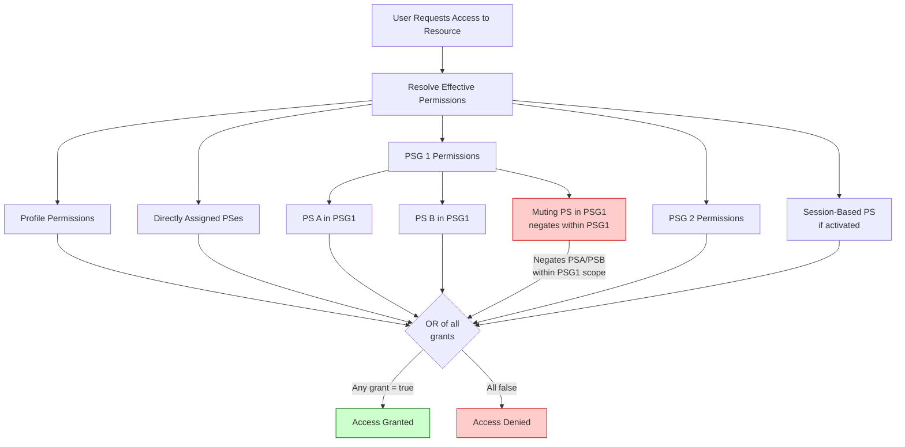
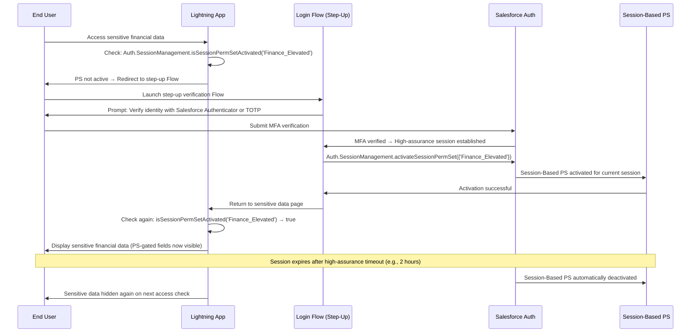

# Permission Sets, Permission Set Groups & Session-Based Permissions

## Exam Domain
Access Management & Governance — **20% of exam weight** (~12 questions)

Permission Sets are the modern Salesforce access model. The exam tests them at the architect level: how PS Groups aggregate permissions, how muting works, when session-based permissions apply, and how all of this interacts with the identity layer. Profiles are legacy — architects must understand how the transition to PS-centric models works.

---

## Foundations

### The Problem With Profiles Alone

The original Salesforce access model centered entirely on Profiles. Every user has exactly one Profile, and that Profile defines their object permissions, field permissions, system permissions, and login settings. This created a combinatorial explosion problem:

- A company with 50 variations in user access needed 50 profiles
- Profiles cannot be shared across objects in a modular way
- Changing a permission for one group of users meant editing a profile that many users shared (high blast radius)
- Sandbox-to-production profile management was painful — profiles carry field-level security for every field in the org

**Permission Sets** solve this by separating permission grants from the baseline profile. A user's effective permissions = their Profile permissions PLUS any Permission Sets assigned to them.

**The identity architecture implication:** As a PTA, you need to understand that permission sets are also the control plane for Connected App access (Admin Approved policy), session-based elevated access, and Experience Cloud user entitlements.

---

## Core Concepts

### Permission Sets vs. Profiles

| Dimension | Profile | Permission Set |
|---|---|---|
| Cardinality per user | Exactly 1 | 0 to many |
| Can grant permissions | Yes | Yes |
| Can revoke permissions below Profile | No | Only via Muting PS in a PS Group |
| Controls login settings | Yes (IP ranges, hours) | No |
| Controls page layouts | Yes | No |
| Controls record types | Yes | No (only via page layout) |
| Controls tab visibility | Yes | Yes |
| Can be assigned to groups | No (1:1 with user) | Yes (PS Groups) |
| License requirement | One license type per profile | Can be license-restricted |

### Permission Set Groups

A **Permission Set Group (PSG)** is a container for multiple Permission Sets that behaves as a single assignable unit. Instead of assigning 5 individual Permission Sets to a user, assign 1 PSG.

**Why PSGs exist:**
- Simplify user provisioning: one assignment instead of many
- Enable atomic access grant: the user gets all permissions in the group or none
- Enable muting: override specific permissions from included PSes without editing them
- Integration with license management: PSGs can be license-bound

**Creating a Permission Set Group:**
```
Setup > Permission Set Groups > New
Name: Sales_Executive_Access
Label: Sales Executive Access
Description: Full CRM access for Sales Executives

Add Permission Sets:
  - Sales_Object_Access (Leads, Opportunities, Contacts: CRUD)
  - Campaign_View (Campaigns: Read)
  - Reporting_Full (Reports, Dashboards: full access)
  - API_Integration_Access (API Enabled)
```

**Assigning a PSG to a user:**
```
Setup > Users > [User] > Permission Set Group Assignments > Edit
Move "Sales_Executive_Access" to Enabled
Save
```

Or via Apex:
```apex
PermissionSetAssignment psa = new PermissionSetAssignment();
// For a PS Group, you still use PermissionSetAssignment — the system handles the expansion
psa.AssigneeId = userId;
psa.PermissionSetGroupId = psgId;
insert psa;
```

### Muting Permission Sets

A **Muting Permission Set** is a special type of Permission Set that **negates** permissions from other Permission Sets within the same Permission Set Group. You add a Muting Permission Set to a PSG to selectively remove permissions that would otherwise be granted by the included PSes.

**Use case:** Your standard "Sales User" PSG grants `Delete` on Opportunity. For users in a specific sub-group (e.g., SDRs who should not be able to delete deals), you want to keep the rest of the PSG but remove Delete on Opportunity.

**Without muting:**
- Create a separate PSG for SDRs that is a full copy of Sales User but without Opportunity Delete
- Maintenance burden: changes to the base PSG don't propagate to the copy

**With muting:**
- Create a Muting Permission Set: `Mute_Opportunity_Delete`
  - Object Permission: Opportunity, Delete = OFF (muted)
- Add `Mute_Opportunity_Delete` to the `SDR_Access` PSG along with the base `Sales_Object_Access` PS
- The muting PS negates the Delete permission that `Sales_Object_Access` would otherwise grant

**Important constraints:**
- Muting Permission Sets can only REMOVE permissions — they cannot grant permissions
- Muting PSes are added TO a PSG — they do not stand alone
- A Muting PS in one PSG does not affect permissions from another PSG or from the Profile
- You cannot mute Profile-level permissions using a Muting PS

**Muting PS in the permission hierarchy:**
```
User's Effective Permission for Opportunity Delete:
= Profile (No) OR PS1 in PSG1 (Yes) MUTED by MutingPS1 (No) OR PS2 in PSG2 (Yes)
= No (Profile) OR No (muted) OR Yes (PSG2 not muted)
= YES (effective permission is OR of all non-muted grants)
```

Wait — Muting only mutes within its own PSG. If PSG2 grants Delete without muting, the user still has Delete from PSG2. Muting is **PSG-scoped**, not org-scoped.

---

### License Assignment and Permission Sets

Permission Sets can require a specific Salesforce License to be assigned. The relationship works as follows:

**License Types relevant to IAM:**

| License Name | Description | Common Use |
|---|---|---|
| Salesforce | Full CRM license | Internal employees |
| Salesforce Platform | Lightning Platform only (no Service/Sales CRM) | Internal users needing custom apps |
| Identity | Identity-only license — SSO without CRM access | Users who need SSO only, no CRM |
| External Identity | Community users — self-service identity | B2C community users |
| Partner Community | B2B portal users with full community features | Partner users |
| Customer Community | B2C portal users | Customer self-service |
| Customer Community Plus | Community users with sharing rules and reporting | Advanced community users |

**Permission Set License (PSL):**
A **Permission Set License** (PSL) is a license that gates access to specific features. Unlike user licenses, PSLs are additive — a user can have multiple PSLs on top of their user license.

Common PSLs:
- **Identity Connect**: Required for Identity Connect (AD synchronization)
- **Salesforce Authenticator**: For Mobile Authenticator integration
- **Salesforce Shield**: For Platform Encryption, Event Monitoring, Field Audit Trail
- **API Integration User**: For users who only access Salesforce via API

To assign a PSL to a user: Setup > Users > [User] > Permission Set License Assignments

A Permission Set that requires a specific PSL will only be assignable to users who have that PSL assigned.

---

### Session-Based Permission Sets

**Session-Based Permission Sets** are permission sets that are only active during a specific elevated session — not permanently for the user. They enable **temporary access elevation** based on an authentication event.

**Use Cases:**
- A user normally has read-only access to sensitive financial records
- When they click "Elevated Access" button, they are required to re-authenticate (step-up)
- After successful re-authentication, the session-based PS is activated — adding write access
- The PS deactivates when the elevated session expires or the user logs out

**How They Work:**

1. Create a Permission Set — mark it as "Session-Based" (checkbox in the Permission Set editor)
2. The PS is NOT assigned permanently to users; instead, it is activated programmatically
3. A **Login Flow** (Screen Flow) or **Connected App** with high-assurance session requirement triggers the elevation
4. Activation: `Auth.SessionManagement.activateSessionPermSet(permissionSetName)` called from Apex/Flow
5. The PS stays active for the duration of the high-assurance session
6. Deactivation: session expires naturally, or `Auth.SessionManagement.deactivateSessionPermSet(permissionSetName)`

**Apex Activation:**
```apex
// Activate a session-based permission set for the current user
Set<String> psNames = new Set<String>{ 'Elevated_Finance_Access' };
Map<String, Auth.VerificationResult> results = 
    Auth.SessionManagement.activateSessionPermSet(psNames);

// Check result
Auth.VerificationResult result = results.get('Elevated_Finance_Access');
if (result.success) {
    // PS is now active for this session
} else {
    System.debug('Activation failed: ' + result.message);
}
```

**Session-Based PS in High-Assurance Flows:**

The most common pattern is:
1. User accesses a sensitive area of the application
2. A Lightning component or Flow checks whether the user has the elevated PS active via `Auth.SessionManagement.isSessionPermSetActivated(psName)`
3. If not active, redirect user through a **Login Flow** that requires identity verification (MFA step-up)
4. After successful verification, the flow activates the session-based PS
5. User can now access the sensitive resource

---

### Permission Hierarchy Resolution

Understanding how Salesforce resolves effective permissions is critical:

```
Effective Permission =
  Profile_Permission
  OR PermissionSet1_Permission
  OR PermissionSet2_Permission
  OR PSGroup1_Permission (after muting applied within PSG1)
  OR PSGroup2_Permission
  OR SessionBasedPS_Permission (if activated)
```

The resolution is **additive via OR** — any grant wins. Profiles cannot be used to restrict permissions granted by Permission Sets (except for login settings like IP ranges and hours). Muting PSes are the only mechanism to selectively negate granted permissions — but only within a PSG.

**The system permission cascade:**
- System permissions (like "Modify All Data") operate the same way: any PS or Profile that grants it is sufficient
- Field-level security (FLS): additive OR logic applies to object access; for FLS, a field is visible if ANY assigned PS/Profile grants visibility

---

## PTA / SA Relevance

### When This Comes Up in Engagements

**Permission Set Architecture Reviews**
Customers with dozens of profiles from the "old days" want to migrate to a PS-centric model. Your role: design a PSG taxonomy that maps to business roles, not system capabilities. Business role first: "Sales Executive" = PSG. Technical capabilities inside: object access PS, API access PS, reporting PS.

**Connected App Access Control**
Admin Approved Connected Apps require Permission Set assignment. When you design a Connected App for an API integration or third-party app, you must define which Permission Set gates access. This is the intersection of identity and access management on the exam.

**Session-Based Permissions for Regulated Industries**
Healthcare customers need step-up authentication before accessing PII fields. The design: session-based PS on the PII field visibility + Login Flow with MFA verification. The PS is session-activated, not permanently granted. This is an examable architecture pattern.

**Muting for Sub-Role Access**
A PSG works for 95% of a team but 5% need fewer permissions. Instead of creating a duplicate PSG, add a Muting PS. Architect the exception pattern, not the duplicate pattern.

### Common Architecture Failures

**Failure 1: Profile-only Architecture**
Customer has 60 profiles that are slowly diverging. Every new permission request creates a new profile or a messy edit to an existing one. Resolution: design a Profile Rationalization — reduce to 5-10 base profiles (by license type) and model everything else via PSGs.

**Failure 2: Session-Based PS Never Activates**
The session-based PS is properly marked and the Apex code calls `activateSessionPermSet()`, but users still see no access change. Root cause: the user doesn't have the PS assigned at all — even session-based PSes must be assigned to users (as session-activated, not permanently activated). Fix: assign the PS to the user (assignment exists but is not yet "active" — it becomes active via session activation).

**Failure 3: Muting PS Applied at Wrong Level**
Admin creates a Muting PS and assigns it directly to users, not to a PSG. Muting PSes only work INSIDE a PSG — standalone assignment has no effect. The permissions are still granted.

### Enterprise Patterns

**Pattern: Role-Based PSG Architecture**
```
Business Roles → PSGs:
  - Sales_SDR_Access (PSG)
      → Base_CRM_Read (PS)
      → Lead_Write (PS)
      → Mute_Opportunity_Delete (Muting PS)
  - Sales_AE_Access (PSG)
      → Base_CRM_Read (PS)
      → Opportunity_Full (PS)
      → Forecast_Write (PS)
  - Sales_Manager_Access (PSG)
      → Sales_AE_Access permissions (PSs included)
      → Team_Reporting (PS)
      → User_Management_Limited (PS)
```

**Pattern: Privileged Access Management (PAM) via Session-Based PS**
```
Architect: System Administrator users have a session-based "Emergency_Access" PS
Normally: Admin does their job with standard permissions
For critical changes: Admin navigates to a "Break Glass" Flow
Flow: requires Salesforce Authenticator approval + manager approval (custom Apex)
On success: activateSessionPermSet("Emergency_Access")
Duration: 4 hours (high-assurance session timeout)
Audit: all changes during elevated session captured in Event Monitoring
```

---

## Architecture

### Permission Resolution Flowchart



### Session-Based Permission Set Elevation Flow



**Limitations & Tradeoffs:**

| Aspect | Detail |
|---|---|
| Muting scope | Muting PSes only negate within their own PSG. Other PSGs or Profile grants are unaffected. Cannot use Muting to override Profile permissions. |
| Session PS persistence | Session-based PSes are tied to the browser session token. If the user opens a new browser tab, the PS state is checked via the same session. If the session times out and a new session is started, the PS is no longer active — user must re-elevate. |
| PSG assignment atomicity | Assigning a PSG is atomic — all included PSes are granted simultaneously. There is no partial PSG assignment. |
| Performance | Resolving effective permissions on every data access is handled by the platform. Architects do not need to optimize this, but extremely large PS assignment counts per user (>100) can theoretically impact performance in bulk operations. |

---

## Key Facts to Memorize

1. **Users have exactly 1 Profile and 0-to-many Permission Sets/PSGs**
2. **PSGs aggregate multiple PSes into one assignable unit**
3. **Muting Permission Sets negate permissions WITHIN a PSG — not across PSGs or Profiles**
4. **Session-Based PSes activate per session via `Auth.SessionManagement.activateSessionPermSet()`**
5. **Session-Based PSes must still be assigned to users — just not permanently activated**
6. **Effective permissions = additive OR across Profile + all PSes + PSGs (after muting)**
7. **Profiles control login settings (IP ranges, hours); Permission Sets cannot**
8. **Permission Set Licenses (PSLs) gate specific feature access (Shield, Identity Connect, etc.)**
9. **Admin Approved Connected Apps require PSes for user assignment**
10. **PSG is the right unit for business roles; individual PSes for modular technical capabilities**
11. **Muting PS can only REMOVE permissions, not grant them**
12. **`isSessionPermSetActivated()` checks current session; `activateSessionPermSet()` activates**
13. **Profile-only architectures with 50+ profiles = technical debt; migrate to PSG model**
14. **Session-based PS is the Salesforce PAM (Privileged Access Management) pattern**
15. **PSG assignment is all-or-nothing — no partial PSG grants**

---

## Exam Traps

**Trap 1: "Muting Permission Sets can restrict Profile-level permissions"**
> Muting PSes only work within a Permission Set Group. They cannot reduce or negate permissions granted by the user's Profile. If the Profile grants Delete on Account, no Muting PS can remove it. Only changing the Profile itself (or using a different Profile) can remove Profile-level permissions.

**Trap 2: "Session-based Permission Sets do not need to be assigned to users"**
> Wrong. Session-based PSes must be assigned to users (or PSGs assigned to users) before they can be activated. The assignment exists in an "inactive" state until `activateSessionPermSet()` is called. If the PS is not assigned at all, activation fails.

**Trap 3: "Permission Set Groups can only contain Permission Sets, not other PSGs"**
> Correct — PSGs contain PSes and Muting PSes only. You cannot nest PSGs inside other PSGs. This is a constraint architects must work around by including all relevant PSes directly in the PSG.

**Trap 4: "Muting a permission in PSG1 prevents the user from having it anywhere"**
> Wrong. Muting in PSG1 only negates the permission as granted within PSG1. If PSG2 or a directly assigned PS also grants the same permission, the user still has it. Muting is not a deny-rule; it is a within-group override.

**Trap 5: "Permission Sets can control page layouts"**
> Page layouts are controlled by Profiles (and record type assignment). Permission Sets cannot control page layouts. This is a common source of confusion — when architects want to show different page layouts to different user groups, they must use Profile-based page layout assignment, not Permission Sets.

---

## Practice Questions

**Question 1**

An architect is designing access for a sales team where Account Executives (AEs) need full CRUD on Opportunities, but Sales Development Representatives (SDRs) in the same team need everything except Delete on Opportunities. What is the recommended approach using Permission Set Groups?

A. Create two separate profiles: AE_Profile with Opportunity Delete and SDR_Profile without it  
B. Create one PSG for the full sales team with Opportunity CRUD; create a separate PSG without Delete for SDRs  
C. Create one PSG with Opportunity CRUD for the whole team; create a Muting Permission Set that removes Opportunity Delete, add it to an SDR-specific PSG along with the base PS  
D. Use a session-based Permission Set to grant Opportunity Delete to AEs only when they explicitly request it  

**Answer: C**

*Explanation:* The Muting Permission Set pattern allows a base PSG to define the standard permissions, while a sub-group (SDRs) has the same base permissions minus the specific muted permission. Option A reverts to profile-centric design. Option B requires maintaining a near-duplicate PSG and keeping them in sync when either changes. Option D is architecturally incorrect for this use case — Opportunity Delete for AEs should be permanent, not session-elevated.

---

**Question 2**

A user has been assigned a session-based Permission Set called "Sensitive_Data_Access." The user tries to access sensitive fields but the fields are still hidden. What is the most likely cause?

A. Session-based Permission Sets do not control field-level security  
B. `Auth.SessionManagement.activateSessionPermSet()` has not been called for the current session  
C. The user's Profile explicitly restricts the sensitive fields, overriding the PS  
D. Session-based Permission Sets require a separate user license to activate  

**Answer: B**

*Explanation:* Session-based PSes exist in an assigned-but-inactive state until explicitly activated via `Auth.SessionManagement.activateSessionPermSet()` for the current session. Just having the PS assigned does not grant any permissions — the activation step (typically in a Login Flow after step-up authentication) must complete. A is wrong — session PSes can control field-level security. C could be a factor but the question says the PS was "assigned" — the most likely cause is it was never activated. D is fabricated.

---

**Question 3**

Which of the following is a valid use case for a Permission Set License (PSL)?

A. Restricting the number of login hours for API integration users  
B. Granting access to Salesforce Shield platform encryption features for specific users without a full Shield org subscription  
C. Enabling session-based elevation for privileged operations  
D. Assigning Connected Apps to users under Admin Approved policy  

**Answer: B**

*Explanation:* Permission Set Licenses (PSLs) gate access to specific Salesforce add-on features. The Salesforce Shield PSL enables a user to use Shield features (field encryption, event monitoring access, Field Audit Trail) without requiring the entire org to be on Shield. A is controlled by Profile login settings. C is achieved via session-based PSes, not PSLs. D uses regular Permission Sets, not PSLs.
