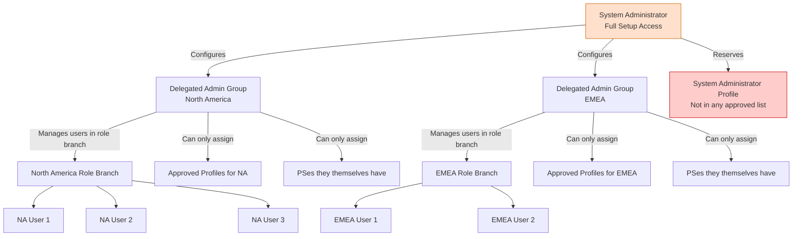
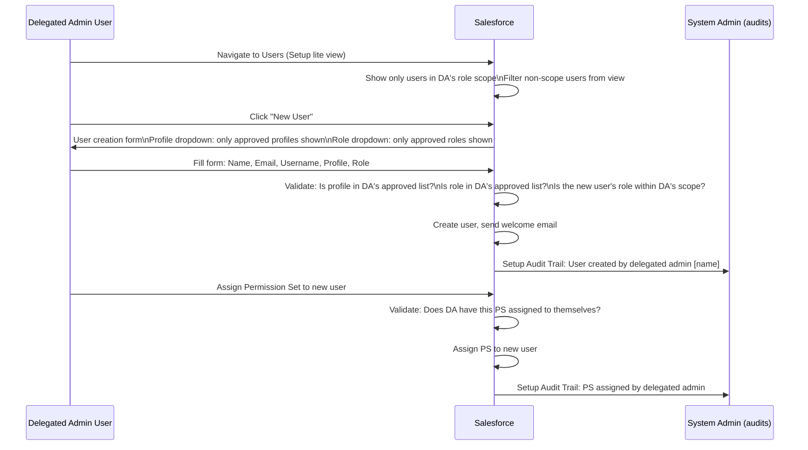

# Delegated Administration & Identity

## Exam Domain
Access Management & Governance — **20% of exam weight**

Delegated Administration lets non-administrator users manage a subset of users in Salesforce. For identity architects, this is critical in large enterprises where central IT cannot manage every user account — business unit admins, HR systems owners, and regional IT teams need scoped user management capabilities without System Administrator access.

---

## Foundations

### The Problem Delegated Administration Solves

In large organizations, a single Salesforce System Administrator managing thousands of users creates a bottleneck. Consider a company with:
- 5,000 Salesforce users across 10 business units
- Different user attributes per business unit (profiles, roles, custom fields)
- Regional IT teams who know their users but should not have full admin access
- HR systems that trigger user provisioning but should not expose the admin credentials to HR staff

**Delegated Administration** allows a System Administrator to designate specific users as **Delegated Administrators** — non-admin users who can perform a limited, defined set of user management tasks on a specific subset of users (the delegated group).

This is NOT the same as System Administrator. Delegated Administrators have narrowly scoped authority, defined by what profiles and roles they can manage.

---

## Core Concepts

### Delegated Administration Setup

**Location:** Setup > Security > Delegated Administration

**Step 1: Create a Delegated Administrator Group**

A Delegated Administration Group defines:
- The **delegated administrator users** (who has the elevated capability)
- The **user groups they can manage** (who they can manage)
- The **specific operations** they are permitted

**Step 2: Assign Users to the Delegated Administrator Group**

Only users explicitly listed as delegated administrators in the group have the capability.

**Step 3: Define What Profiles the Delegated Admin Can Assign**

The group configuration includes a list of **assignable Profiles**. The delegated admin can only assign profiles from this list to users they manage. They cannot assign any other profile.

**Step 4: Define What Roles the Delegated Admin Can Assign**

Similarly, **assignable Roles** are explicitly listed. The delegated admin can only assign roles from this list.

**Step 5: Define the Managed Users (User Roles)**

The delegated admin can only manage users within specific **Roles and Subordinates**. The group configuration points to a Role (or role branch) — all users in that role and below are the delegated admin's manageable scope.

---

### What Delegated Administrators CAN Do

| Capability | Detail |
|---|---|
| Create users | Within the managed role branch; can only assign profiles and roles from the approved list |
| Edit users | Update user fields (name, email, phone, title, department) for users in their scope |
| Deactivate users | Deactivate users in their scope |
| Reset passwords | Reset and unlock user accounts in their scope |
| Assign roles | From the approved role list only; to users in their scope |
| Assign profiles | From the approved profile list only; to users in their scope |
| Assign Permission Sets | Can assign PSes, but only PSes the delegated admin themselves has |
| Manage login credentials | Reset security tokens for users in their scope |
| View user records | See User records within their role branch scope |

### What Delegated Administrators CANNOT Do

| Cannot Do | Why |
|---|---|
| Create/edit other delegated admin groups | Only System Admins can modify delegated admin configuration |
| Assign profiles not in their approved list | Hard restriction — UI hides non-approved profiles |
| Manage users outside their role branch | Role-scoped restriction |
| Assign permission sets they don't have | Can only "share" their own PS access |
| Access Setup (beyond limited user management) | No general Setup access |
| Manage Connected Apps | Admin-only capability |
| Modify SSO Settings, Auth Providers | Admin-only |
| Change org security settings | Admin-only |
| Assign licenses beyond user license type | Cannot assign PSLs |
| Grant admin-level profiles | Cannot assign profiles like System Administrator |

---

### The Role-Scope Constraint: A Common Architecture Issue

The delegated admin group is scoped to a **role and subordinates**. This means:
- If User A is in "EMEA Sales" role, the delegated admin for "EMEA" branch can manage User A
- If User A's role is changed to a role outside the EMEA branch, the delegated admin loses management access
- Users without a role assigned are NOT in anyone's role scope — delegated admins cannot manage roleless users

**Architecture Implication:** Enterprises relying on Delegated Administration must maintain a role hierarchy that mirrors the organizational structure. If the role hierarchy is flat or poorly maintained, Delegated Administration scope becomes unmanageable.

---

### Permission Set Assignment by Delegated Admins

This is a heavily tested nuance. Delegated Admins CAN assign Permission Sets to users in their scope, but only PSes that the delegated admin user themselves has assigned.

**Example:**
- Delegated Admin User has PSes: `Read_Only_Analytics`, `Standard_CRM_Access`
- Delegated Admin can assign these two PSes to users they manage
- Delegated Admin does NOT have `System_Admin_Tools` PS
- Therefore, Delegated Admin cannot assign `System_Admin_Tools` to anyone

This creates a "you can only give what you have" model — preventing privilege escalation through delegation.

**The PS Group caveat:** Delegated admins can assign Permission Set Groups, but again only those they themselves have access to.

---

### Identity Architecture Considerations

Delegated Administration intersects with several identity management patterns:

#### SCIM Provisioning + Delegated Admin

In enterprise deployments, SCIM provisioning (from Okta, Azure AD, etc.) creates and manages users automatically. Delegated Administration is used for the exception cases — manual interventions that SCIM doesn't cover (e.g., emergency access, attribute corrections that SCIM doesn't sync).

The architect must define which user management actions are owned by:
- **SCIM/IdP system**: Automated create/deactivate/update
- **Delegated Admins**: Manual overrides, exceptions, local adjustments
- **System Admins**: Configuration, permission model changes, compliance-required actions

#### Profile Assignment Governance

Because Delegated Admins can only assign profiles from their approved list, the Profile list becomes a governance control. System Admins must review and approve which profiles each Delegated Admin group can assign before enabling delegation. This prevents unauthorized profile escalation.

**Best practice:** Document the Delegated Admin groups, their role scopes, and their assignable profile/role lists in an access governance document. Review annually.

#### Connected App Access for Delegated Admins

Delegated Admins cannot manage Connected App policies. If a delegated admin's users need access to a specific Connected App (Admin Approved), the System Admin must add the Permission Set for that Connected App to the list of PSes the delegated admin can assign — and ensure the delegated admin has that PS assigned to themselves.

---

### Identity Verification for Delegated Admins

Delegated Admins with user management capabilities represent an elevated-privilege use case. From an IAM architecture perspective:

- Delegated Admins should require **MFA** for Salesforce login (same as all users under MFA enforcement)
- For sensitive operations (password reset, deactivation), consider requiring a **high-assurance session** via a Login Flow
- Audit delegated admin actions via **Setup Audit Trail** — all user management actions appear in the audit log
- Consider **Transaction Security Policies** to alert or block suspicious delegated admin behavior (e.g., bulk user deactivations)

---

## PTA / SA Relevance

### When This Comes Up in Engagements

**Large Enterprise User Management Scalability**
A customer has 3 Salesforce admins managing 8,000 users across 15 business units. The admins are a bottleneck for basic tasks (password resets, new hire provisioning). Your recommendation: Delegated Administration with one delegated admin group per business unit. Define the role scope per unit. Each business unit's admin contact gets delegated admin rights scoped to their branch.

**SCIM + Delegated Admin Hybrid**
Customer uses Azure AD SCIM for automated provisioning but has exceptions (contractors, shared accounts). Design: SCIM handles the 95% standard case; Delegated Admins handle the exceptions in their region. SCIM-managed attributes (username, email) should be locked from Delegated Admin editing if SCIM is the system of record for those fields.

**Compliance: Limiting Admin Footprint**
Customer's security policy: minimize the number of System Admins (SOC2 audit requirement). Recommendation: reduce System Admin count; implement Delegated Administration for operational user management; restrict System Admin profile to configuration tasks only.

**Helpdesk Integration**
IT Helpdesk team (ITSM) needs to reset passwords and unlock accounts. Full admin access is a compliance risk. Solution: Delegated Admin group for the Helpdesk, scoped to all users, but with only password reset and unlock operations. (Note: this requires careful scope definition since "all users" scope is unusual — typically scoped to specific role branches.)

### Common Architecture Failures

**Failure 1: Delegated Admin Can Assign Admin Profile**
System Admin forgot to restrict the approved profiles list. Delegated Admin assigns "System Administrator" profile to a user, escalating privileges. Prevention: never include elevated profiles (System Admin, admin-equivalent custom profiles) in the assignable profiles list.

**Failure 2: Roleless Users Unmanageable**
The organization has 20% of users without Salesforce roles. Delegated Admins cannot manage them. During a wave of new hires, batch user creation assigns no roles → delegated admins are locked out. Fix: ensure every user in a delegated admin's scope has a role assigned, or use the "All Internal Users" scope for delegated admins who need broad access.

**Failure 3: PS Assignment Inconsistency**
Delegated Admin was assigned a PS last month, allowed to pass it to users. This month, the PS was removed from the delegated admin. Users the admin previously assigned the PS to RETAIN the PS — PS removal from the delegated admin doesn't cascade to remove it from managed users. Manual audit required.

**Failure 4: Delegation Without Audit**
Delegated admins are managing users with no audit trail review. A delegated admin creates unauthorized users. Without regular Setup Audit Trail reviews, this goes undetected for months. Recommendation: weekly automated audit report of delegated admin actions using Event Monitoring or Setup Audit Trail exports.

### Enterprise Patterns

**Pattern: Tiered Delegation Model**
```
Tier 1: System Admin — full Setup access, configuration changes
Tier 2: Regional IT Admins (Delegated Admin Groups) — user management within region
         Each group scoped to a regional role branch
         Can assign: Standard User, Read-Only, regional-specific profiles
         Cannot assign: System Admin, any elevated profile
Tier 3: Helpdesk (Read-Only Delegated Admin) — password resets only
         No create/edit capabilities beyond credential reset
```

**Pattern: SCIM + Delegated Exception Handling**
```
Standard flow: Azure AD SCIM → Salesforce (creates/deactivates users)
Exception flow: Delegated Admin portal → Salesforce (handles contractors, temp users)
Attribute of record:
  - Identity attributes (email, username, FederationId): SCIM-owned; locked from Delegated Admin edit
  - Business attributes (title, department, phone): Delegated Admin can edit; SCIM syncs on next cycle
  - Permission sets: System Admin governance document defines which PSes delegated admins can grant
```

---

## Architecture

### Delegated Administration Scope Model



### Delegated Admin User Creation Flow



**Limitations & Tradeoffs:**

| Aspect | Detail |
|---|---|
| Role-scope dependency | Delegated Administration requires a maintained role hierarchy. Flat role hierarchies or missing role assignments break delegation scope. |
| PS assignment propagation | PSes assigned by a delegated admin persist even after the delegated admin loses that PS or their delegated admin status. Requires periodic access reviews. |
| No CRUD on permission sets | Delegated admins cannot create or edit PS definitions; they can only assign existing PSes. |
| Audit visibility | System Admins must review Setup Audit Trail to monitor delegated admin actions. No native alerting when delegated admins take sensitive actions — requires Event Monitoring for that. |
| Experience Cloud limitation | Delegated Administration for Experience Cloud (portal) users behaves differently — External Identity and Community licenses may have restrictions on which user fields delegated admins can modify. |

---

## Key Facts to Memorize

1. **Delegated Admins are non-admin users who can manage a scoped subset of users**
2. **Scope is defined by Role and Subordinates — must have roles assigned to be in scope**
3. **Delegated Admins can only assign Profiles from the approved profiles list**
4. **Delegated Admins can only assign Permission Sets they themselves have**
5. **Delegated Admins CANNOT: modify SSO settings, manage Connected Apps, assign System Admin profile, manage users outside their role scope**
6. **Delegated Admin groups are configured in Setup > Security > Delegated Administration**
7. **Users without roles cannot be managed by delegated admins (unless "all users" scope)**
8. **PS removal from a delegated admin does not remove that PS from users the admin previously assigned it to**
9. **Setup Audit Trail records all delegated admin actions**
10. **Delegated Administration does NOT give access to Setup pages beyond limited user management**
11. **Delegated admins can deactivate users, reset passwords, and unlock accounts within their scope**
12. **Delegated Admin groups must be created/managed by System Administrators only**
13. **Combined with SCIM: Delegated Admin handles exceptions; SCIM handles automation**
14. **For compliance: Delegated Admin reduces System Admin count and limits admin footprint**
15. **Delegated Admins can assign Permission Set Groups, but again only those they have**

---

## Exam Traps

**Trap 1: Delegated Admins can assign any Permission Set**
> Wrong. Delegated Admins can only assign PSes that they themselves have. This "you can only give what you have" rule prevents privilege escalation through delegation.

**Trap 2: Delegated Admins have access to most of Setup**
> Delegated Admins have a very limited Setup view — essentially user management only. They cannot access SSO settings, Connected Apps, Security Center, org-wide settings, or any other Setup configuration area. They are non-admin users with a specific operational capability.

**Trap 3: Roleless users are accessible to delegated admins**
> If a user has no Salesforce role assigned, they fall outside any role branch and therefore outside any delegated admin's scope. A delegated admin scoped to "West Region" role branch cannot manage a user with no role, even if that user is supposed to be in the West Region organizationally.

**Trap 4: Delegated Admin can create users with any profile**
> Only profiles explicitly listed in the Delegated Admin Group's "Assignable Profiles" can be assigned. The profile dropdown on the user creation form shows ONLY the approved profiles. Attempting to assign an unapproved profile via the API also fails.

**Trap 5: Removing delegated admin status removes all PSes they assigned**
> PSe assignments made by a delegated admin persist independently. Removing the delegated admin's elevated status or removing a PS from the delegated admin does NOT cascade to remove those PSes from the users they were assigned to. Manual review and cleanup is required.

---

## Practice Questions

**Question 1**

A company has a System Administrator who wants regional IT managers to handle password resets and new user creation for their respective regional teams. These managers should NOT have full admin access. What is the appropriate Salesforce configuration?

A. Create custom profiles for each regional IT manager that include user management permissions  
B. Configure Delegated Administration groups, one per region, scoped to the regional role branch, with each regional manager designated as a delegated admin  
C. Assign the "Manage Users" Permission Set to each regional IT manager  
D. Create a sharing rule that gives regional IT managers read/write access to User records in their region  

**Answer: B**

*Explanation:* Delegated Administration is the built-in Salesforce mechanism for scoped user management. It defines exactly who can manage which users and what profiles/roles they can assign — without giving full admin access. A (custom profiles with Manage Users) gives broader access than needed and lacks the scope restriction. C (Manage Users PS) grants permission to manage ALL users, not just a regional subset — too broad. D (sharing rules on User objects) gives data visibility, not the management capability to create/edit/reset passwords.

---

**Question 2**

A delegated administrator is trying to assign a Permission Set called "Finance_Analyst_Access" to a user in their managed role branch. The attempt fails with an error indicating insufficient access. What is the most likely cause?

A. The user's profile prevents Permission Set assignment  
B. The delegated admin does not have the "Finance_Analyst_Access" Permission Set assigned to themselves  
C. Permission Set assignment requires System Administrator access  
D. The user is in a role branch outside the delegated admin's scope  

**Answer: B**

*Explanation:* Delegated admins can only assign PSes they themselves have. If the delegated admin doesn't have "Finance_Analyst_Access" assigned to their own user, they cannot assign it to others. This is the "you can only give what you have" constraint. D could be a factor, but the question says the user IS in the managed role branch. A and C are incorrect — profiles don't restrict PS assignment, and PS assignment is available to delegated admins for PSes they possess.

---

**Question 3**

An architect is designing a governance model where a company's Security team should be able to audit all delegated administration activities. What is the recommended approach?

A. Create a custom user object to log delegated admin actions via trigger  
B. Use Setup Audit Trail, which records all user management actions including those performed by delegated administrators  
C. Configure a Login Flow to log each delegated admin login separately  
D. Enable Debug Logging for all delegated admin users and export the logs weekly  

**Answer: B**

*Explanation:* The Setup Audit Trail automatically records all user management actions, including user creation, modification, password resets, and permission assignments, along with whether the action was performed by a System Admin or a Delegated Admin. This is the built-in audit mechanism and the correct architect-level answer. A is unnecessary — the native capability exists. C logs logins, not user management actions. D is a developer debugging tool, not an audit mechanism, and debug logs have retention limits.
