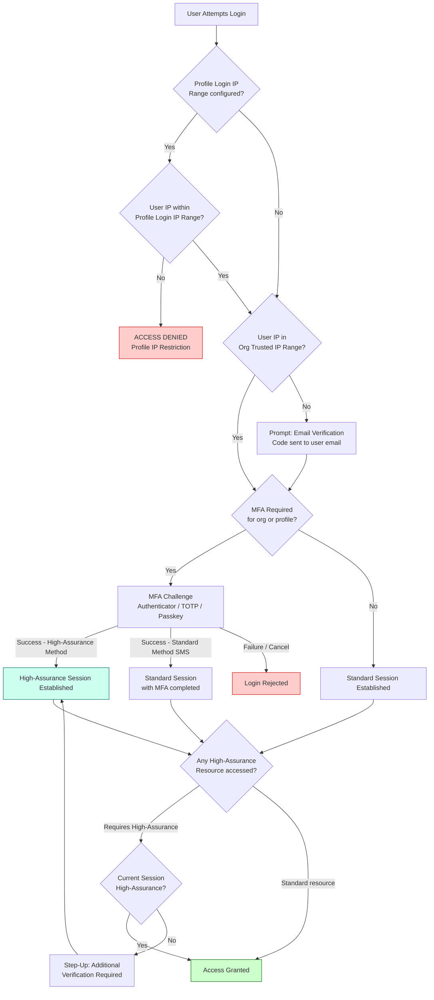
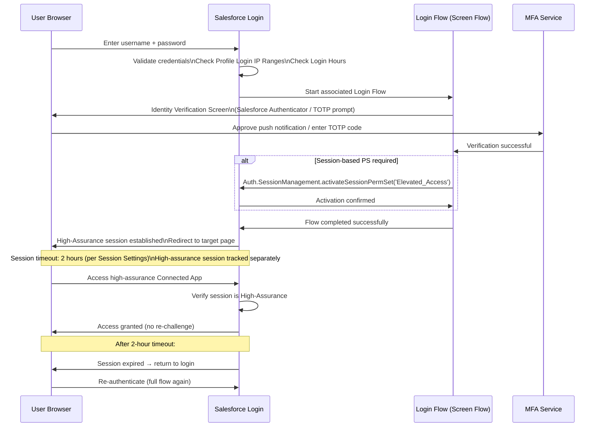

# Session Policies, IP Trust & Login Security

## Exam Domain
Access Management & Governance — **20% of exam weight**

Session security — controlling where, when, and how users can access Salesforce — is foundational IAM architecture. The exam tests IP range configuration at multiple levels, the distinction between trusted and required IP ranges, session timeout policies, high-assurance session requirements, Login Flows, and how MFA enforcement integrates into the login security stack. These controls are also your primary lever for zero-trust network architecture on the Salesforce platform.

---

## Foundations

### Why Session Security Matters at the Architecture Level

Authentication tells you WHO the user is. Session security tells you WHETHER you should trust this authentication event. Even if a user correctly authenticates, Salesforce can:
- **Block access** if they're logging in from an untrusted IP
- **Require MFA** as a second factor before establishing a session
- **Limit the session lifetime** to reduce the window of a stolen session token
- **Require step-up authentication** before accessing sensitive data
- **Terminate sessions** when a policy violation occurs

For a PTA, session security configurations are the "defense in depth" layer below identity verification. Zero-trust models require continuous re-verification, not just initial authentication.

---

## Core Concepts

### Session Timeout Settings

**Location:** Setup > Session Settings

**Session Timeout Value:**
Controls how long an inactive browser session remains valid before Salesforce automatically logs the user out.

| Setting | Value | Use Case |
|---|---|---|
| Timeout after | 15 minutes | High-security environments (healthcare, finance) |
| Timeout after | 30 minutes | Standard high-security default |
| Timeout after | 2 hours | Standard enterprise default |
| Timeout after | 4 hours | Field workers with intermittent network |
| Timeout after | 8 hours | Low-security use cases (public data) |
| Timeout after | 12 hours | Avoid — long window for session hijacking |
| No timeout | Avoid | Only for specific automation scenarios |

**Session Timeout Warning:**
Salesforce shows a warning dialog when the session is about to expire. The warning can be customized and disabled (not recommended — disabling causes abrupt logouts without warning).

**Force re-login after:** Separate from timeout — can force re-login after a calendar duration regardless of activity.

**Disable session timeout warning popup:** If enabled, sessions expire silently. Users lose unsaved work. Only disable in environments where security requires it.

---

### Session Security Level: Standard vs. High-Assurance

Every Salesforce session has a **security level**:

| Level | Description | When Established |
|---|---|---|
| **Standard** | Normal session — username/password authenticated | Default after successful login |
| **High-Assurance** | Elevated session — verified with MFA or identity verification | After completing MFA challenge |

**Why this matters:** Some Connected Apps, Named Credentials, and Features can require a **high-assurance session**. If a user has only a standard session and tries to access a high-assurance resource, Salesforce challenges them with identity verification before granting access.

**Session Security Level in Connected App Policies:**
- Navigate to Setup > Connected Apps > Manage > Edit Policies > High Assurance: Required
- If Required: any API call through this Connected App from a standard session triggers a verification challenge
- This is the mechanism for step-up authentication on API access

**Session Security Level in Session Settings:**
- Session Security Levels can be defined as policies in Setup > Security > Session Management
- Factors that establish high-assurance: TOTP authenticator app, Salesforce Authenticator push, hardware security key (FIDO2/WebAuthn)
- SMS-based verification is classified as **Standard** by default (configurable — some orgs demote SMS to a lower assurance level due to SIM-swap attack risk)

---

### IP Address Restrictions

IP restrictions in Salesforce operate at **three levels**. Understanding where each applies and how they interact is critical.

#### Level 1: Org-Wide Trusted IP Ranges

**Location:** Setup > Network Access > Trusted IP Ranges

**What it does:**
- Defines IP addresses and ranges that Salesforce trusts for ALL users in the org
- Users from trusted IP ranges do NOT receive the email verification challenge when logging in
- Users from outside trusted IP ranges ARE prompted to verify their identity via email verification code

**What it does NOT do:**
- Does NOT block access from untrusted IPs — it only waives the email verification challenge for trusted IPs
- NOT a firewall — Salesforce is accessible from any IP unless Profile-level restrictions are added

**Format:** Can use individual IPs or CIDR ranges (e.g., `203.0.113.0/24` = all IPs from 203.0.113.0 to 203.0.113.255)

#### Level 2: Profile-Level Login IP Ranges

**Location:** Setup > Profiles > [Profile] > Login IP Ranges

**What it does:**
- Hard restriction — users with this Profile CANNOT log in from IPs outside these ranges
- The login attempt is blocked entirely, not just challenged
- Applies to browser-based login (session authentication)
- Does NOT automatically apply to API token-based access (Connected App IP Relaxation setting governs API)

**Important distinction from Trusted IP Ranges:**
| | Org-Wide Trusted IP Ranges | Profile Login IP Ranges |
|---|---|---|
| Effect | Waives email verification | Hard blocks login |
| Scope | All users | Users with that Profile |
| Access from outside range | Allowed (with email verification) | DENIED |

**Critical exam fact:** Profile Login IP Ranges = hard block. Trusted IP Ranges = verification bypass.

#### Level 3: Connected App IP Relaxation (OAuth Token Access)

**Location:** Setup > Connected Apps > Manage > Edit Policies > IP Relaxation

**What it does:**
- Controls IP enforcement for OAuth token-based API access through that Connected App
- Three options:
  - **Enforce IP restrictions**: Token-based API access must come from IPs in the user's Profile Login IP Ranges
  - **Relax IP restrictions with second factor**: IP restriction bypassed IF user has a high-assurance session (MFA completed)
  - **Relax IP restrictions**: No IP restrictions for this Connected App (any IP can use the token)

**This is separate from Profile Login IP Ranges.** A user blocked from browser login by Profile IP Ranges might still access the API if the Connected App has IP Relaxation set to "Relax" — unless Enforce is chosen.

---

### Login Hours

**Location:** Setup > Profiles > [Profile] > Login Hours

**What it does:**
- Restricts login to specific days and hours for users with this Profile
- Outside defined hours, login is blocked entirely
- Applies to initial login; does NOT automatically terminate existing sessions when hours end

**Existing sessions and login hours:**
When Login Hours expire, Salesforce does NOT immediately terminate active sessions. Users logged in before hours ended remain logged in until their session times out or they explicitly log out. This is a common exam trap — login hours restrict NEW logins, not existing sessions.

**Time zone consideration:** Login Hours are evaluated in the org's default time zone unless the user has a time zone override. In a global organization, a Login Hours restriction of "9 AM to 6 PM" may block users in different time zones at unexpected times.

---

### Multi-Factor Authentication (MFA)

MFA in Salesforce is the requirement that users prove their identity using something they HAVE (a second factor) in addition to something they KNOW (their password).

#### MFA Enforcement Options

**1. Org-Wide MFA Enforcement:**
Setup > Identity > Identity Verification > Require multi-factor authentication (MFA) for all direct UI logins

When enabled, ALL internal users logging in via the UI must complete MFA. This is a single org-wide switch and is the simplest enforcement model.

**Salesforce MFA Requirement:** As of February 2022, Salesforce requires customers to use MFA for all users accessing Salesforce products. This is a contractual requirement under the Salesforce main service agreement.

**2. Profile-Level MFA (via Login Flows):**
For more granular control, use Login Flows to enforce MFA per profile or user group. A Screen Flow is built to perform identity verification and is associated with a Profile or Connected App.

#### Supported MFA Methods in Salesforce

| Method | Security Level | Notes |
|---|---|---|
| Salesforce Authenticator (push) | High-Assurance | Salesforce's own mobile app; push notification approval |
| TOTP Authenticator App (Google Auth, Authy, etc.) | High-Assurance | Time-based one-time password via any TOTP app |
| Hardware Security Key (FIDO2/WebAuthn) | High-Assurance | YubiKey, Titan Key, etc.; phishing-resistant |
| Built-in Authenticator (Touch ID, Face ID, Windows Hello) | High-Assurance | Passkey-style; platform authenticator |
| SMS Text Message | Standard | One-time code via SMS; weaker (SIM-swap risk); Salesforce classifies as Standard assurance |
| Email Verification | Standard | One-time code via email; used for Trusted IP management |

**High-Assurance methods establish a High-Assurance session; Standard methods (SMS, email) do NOT.**

#### Login Flows for MFA Enforcement

A **Login Flow** is a Screen Flow (built in Flow Builder) that executes as part of the login process. Login Flows can:
- Require additional identity verification steps
- Display custom messages or accept custom input
- Enforce conditional MFA (e.g., only require MFA if outside the office IP range)
- Activate session-based Permission Sets after verification

**Login Flow Association:**
- Associate a Login Flow with a Profile: Setup > Login Flows > New
- Associate a Login Flow with a Connected App (OAuth): Connected App > OAuth Policies > Login Flow

**MFA in Login Flow — the built-in verify action:**
Within a Flow, use the **Verify User Identity** action (available in Flow actions) to challenge the user with their registered MFA method. If verification succeeds, the flow continues. If the user has no MFA method registered, they are prompted to register one.

---

### Trusted IP Ranges: Detailed Behavior

The interaction between Trusted IP Ranges, Profile Login IP Ranges, and MFA enforcement creates a matrix that the exam tests:

| User IP | Trusted IP Range | Profile Login IP Range | MFA Required | Result |
|---|---|---|---|---|
| Corporate network | In range | In range | Yes | Login succeeds; MFA required (trusted IPs bypass email verification only, not MFA) |
| Corporate network | In range | In range | No | Login succeeds; no challenge |
| Home IP | Not in range | In range | No | Login succeeds; email verification required |
| Home IP | Not in range | In range | Yes | Login succeeds; email verification + MFA |
| External IP | Not in range | NOT in range | Any | Login BLOCKED (Profile Login IP Ranges hard block) |
| Home IP | In range | Not configured | Any | Login succeeds; no IP block (Profile has no range restriction); trusted range waives email verification |

**Critical point:** Being in the Trusted IP Range does NOT bypass Profile Login IP Range restrictions. It only waives the email verification challenge. If the Profile Login IP Range is configured and the user's IP is outside it, login is blocked regardless of Trusted IP Range.

---

### Single Sign-On and IP/MFA Interaction

When SSO is configured, IP and MFA controls interact differently:

**For SAML SSO:**
- IP validation at Salesforce level occurs before or after the SAML assertion is validated, depending on configuration
- MFA can be enforced at the **IdP level** (e.g., Okta/Azure AD enforces MFA before issuing the SAML assertion) OR at the **Salesforce level** (via Login Flow after SSO)
- Best practice: enforce MFA at the IdP level so MFA is consistent across all apps, not just Salesforce

**For OAuth/OIDC:**
- IP restrictions apply to token-based access via the Connected App IP Relaxation setting
- MFA for OAuth flows: the Login Flow can be associated with a Connected App to require identity verification during OAuth authorization

---

### Session Management Settings (Additional)

**Require secure connections (HTTPS):**
All Salesforce sessions require HTTPS by default. This setting enforces HTTPS for all connections and cannot be disabled in production orgs.

**Lock sessions to the IP address from which they originated:**
If enabled, a session is tied to the IP address used when the session was created. If the user's IP changes mid-session (common on mobile devices switching between WiFi and cellular), the session is immediately invalidated. This is a high-security setting that causes poor mobile UX. Use only in high-security, fixed-location environments.

**Allow only one concurrent login per user:**
If enabled, when a user logs in from a second browser/device, the first session is terminated. Useful for security, but creates support burden if users legitimately need multiple sessions.

**Force logout on session timeout:**
If disabled, the session times out in the background without actively redirecting the user. If enabled, the user gets a popup warning and is forced to the login page. Recommended for compliance environments.

**Remember device for verification:**
When users complete email verification from a new device, Salesforce can "remember" that device for future logins (reduces email verification challenges on the same device). This is controlled by the user in their settings and can be disabled org-wide by admins.

---

## PTA / SA Relevance

### When This Comes Up in Engagements

**Security Architecture Reviews**
Every security review involves session settings. PTAs should ask: What is the session timeout? Are Profile Login IP Ranges configured? Is MFA enforced? Is there a distinction between internal and community user session policies? Are Connected Apps enforcing appropriate IP restrictions?

**Zero-Trust Migration**
A customer moving to zero-trust wants Salesforce access policy to not rely on network location. The shift: remove Profile Login IP Range blocks (network-based control) and replace with MFA + session-based permission controls. This is a philosophical change: from "trust based on where you are" to "verify who you are regardless of where you are."

**Conditional Access Architecture**
Customer uses Azure AD Conditional Access to enforce device compliance before issuing SAML assertions. This is complementary to Salesforce session controls: Azure AD handles "trusted device" and "compliant device" conditions; Salesforce handles session lifetime and scope. The architecture: Azure AD Conditional Access → SAML → Salesforce + Session Settings for timeout. Two independent layers.

**Global Deployment Login Hours Challenge**
A customer has a global org with Login Hours set to 9-5 Central Time. Their APAC users cannot log in during business hours in Singapore. Fix: create separate Profiles per region (or use Profile-less Login Flow approach) with Login Hours appropriate to each time zone, OR configure Login Hours on the standard profile to cover all global hours (effectively always on) and rely on other controls for security.

### Common Architecture Failures

**Failure 1: Trusted IP Ranges Mistaken for Access Control**
Customer believes Trusted IP Range means "only these IPs can access Salesforce." Actually, Trusted IPs only waive the email verification challenge. Users from ANY IP can still log in (unless Profile Login IP Ranges are configured). Use Profile Login IP Ranges for actual access control.

**Failure 2: Profile Login IP Ranges Break OAuth**
Profile Login IP Ranges are configured for a narrow corporate range. An external integration uses OAuth JWT Bearer flow from a cloud server (IP outside the range). The Integration User's profile has Login IP Ranges set. The OAuth token is rejected. Fix: set the Connected App's IP Relaxation to "Relax IP restrictions" for that integration's Connected App, or move the Integration User to a profile without IP restrictions.

**Failure 3: MFA Enforcement Bypassed by API**
MFA is enforced for UI logins. But the customer's integration uses Username-Password (ROPC) OAuth flow, which bypasses MFA. The customer assumes MFA is enforced for all authentication. It's not. ROPC directly obtains tokens without MFA. Recommendation: replace ROPC with JWT Bearer, which doesn't bypass MFA (and doesn't trigger it — it's a different authentication mechanism entirely).

**Failure 4: Login Hours End, Sessions Continue**
Customer sets Login Hours to 9 AM - 6 PM expecting sessions to terminate at 6 PM. Users who logged in at 5:45 PM remain active past 6 PM until session timeout. For true session termination at Login Hours end, combine Login Hours with a shorter Session Timeout AND/OR Transaction Security Policies that terminate sessions outside hours.

### Enterprise Patterns

**Pattern: Defense-in-Depth Session Security**
```
Layer 1: Network (IdP level) — Azure AD Conditional Access: device compliance, location policy
Layer 2: Authentication — MFA enforced at IdP (SAML) for high-assurance session
Layer 3: Salesforce Profile — Login Hours: business hours only
Layer 4: Salesforce Session Settings — 2-hour timeout; Force logout on timeout; Lock to originating IP (optional)
Layer 5: Connected App IP Relaxation — Enforce for internal integrations; Relax+MFA for mobile
Layer 6: Transaction Security — Alert on anomalous activity (after-hours login, bulk export)
```

**Pattern: Session-Based Step-Up for Sensitive Data**
```
Standard session: User logs in (MFA completed → high-assurance session)
Accessing routine data: allowed with standard permissions
Accessing PII/financial fields: 
  → Check session-based PS activation status
  → If not activated: redirect to Step-Up Login Flow
  → Flow: verify Salesforce Authenticator
  → Activate "Sensitive_Data_Access" session PS
  → High-assurance session timer restarts
  → Access granted for PS-gated fields
```

---

## Architecture

### IP Trust and MFA Decision Tree



### Login Flow with MFA Step-Up



**Limitations & Tradeoffs:**

| Aspect | Detail |
|---|---|
| Login Hours vs. session expiry | Login Hours restrict new logins, not existing sessions. Combine with session timeout for full coverage. |
| IP Lock to origin | Locking sessions to originating IP causes mobile app disconnections when switching networks. Avoid for mobile-heavy user populations. |
| MFA method registration | MFA enforcement requires users to have a method registered. New users must register before enforcement takes full effect. Provide a grace period and registration workflow. |
| SMS as MFA | SMS verification is susceptible to SIM-swap attacks and is classified as Standard assurance. For sensitive workloads, require High-Assurance methods (authenticator app, hardware key). |
| SSO MFA handoff | When MFA is enforced at the IdP level for SSO, Salesforce may not "see" that MFA was completed (the assertion doesn't carry this reliably). Use SSO AuthnContext claims and Salesforce's AuthnContext mapping to have Salesforce trust the IdP's MFA completion and assign High-Assurance session level accordingly. |

---

## Key Facts to Memorize

1. **Trusted IP Ranges = bypass email verification ONLY; NOT a hard access block**
2. **Profile Login IP Ranges = HARD BLOCK — users outside range cannot log in**
3. **Connected App IP Relaxation governs OAuth API access; Profile IP Ranges govern browser login**
4. **High-Assurance session = MFA completed with a high-assurance method (authenticator app, hardware key)**
5. **SMS verification = Standard assurance (NOT high-assurance)**
6. **Login Hours restrict NEW logins — existing sessions continue until timeout**
7. **Session Timeout: default 2 hours; configurable; high-security envs use 15-30 min**
8. **"Lock session to originating IP" = session invalidated if IP changes mid-session**
9. **Login Flows: Screen Flows that execute during login; used for MFA enforcement, custom logic**
10. **MFA is required by Salesforce contractually for all direct UI logins (since Feb 2022)**
11. **ROPC (Username-Password OAuth) bypasses MFA enforcement — replace with JWT Bearer**
12. **Verify User Identity Flow action = built-in MFA challenge in a Login Flow**
13. **Session Security Levels: Standard = password-only; High-Assurance = MFA with high-assurance method**
14. **Profile Login IP Ranges + Connected App IP Relaxation "Enforce" = hardest restriction**
15. **Connected App "Relax with Second Factor" = bypass IP restriction IF high-assurance session exists**

---

## Exam Traps

**Trap 1: "Trusted IP Ranges block access from outside IPs"**
> Trusted IP Ranges only bypass the email verification challenge — they do NOT block access. Users from any IP can still log in; they just receive an email verification challenge if their IP is not trusted. Profile Login IP Ranges are the mechanism that actually blocks access.

**Trap 2: "Login Hours terminate existing sessions"**
> Login Hours only block NEW login attempts outside the defined hours. A user logged in before hours ended will remain logged in. To terminate sessions when hours end, combine Login Hours with a Transaction Security Policy or set a short session timeout.

**Trap 3: "MFA enforcement via org settings blocks API integrations"**
> Org-wide MFA enforcement applies to direct UI logins. API integrations using OAuth JWT Bearer or Client Credentials are unaffected by MFA enforcement — they authenticate via a different mechanism entirely (certificate/key). ROPC (Username-Password) IS affected but in the wrong way — it bypasses MFA rather than being blocked by it.

**Trap 4: "SMS verification = High-Assurance session"**
> SMS verification establishes a Standard assurance session, not High-Assurance. Only authenticator apps (TOTP, Salesforce Authenticator push), hardware security keys (FIDO2), and built-in authenticators (passkeys) establish High-Assurance sessions. This matters when a Connected App requires High-Assurance.

**Trap 5: "Profile Login IP Ranges automatically apply to OAuth API calls"**
> Profile Login IP Ranges apply to browser-based login sessions. OAuth API access through Connected Apps is governed by the Connected App's IP Relaxation setting. If the Connected App's IP Relaxation is set to "Relax," the Profile's Login IP Ranges do NOT apply to API calls.

---

## Practice Questions

**Question 1**

A Salesforce org has Profile Login IP Ranges set to the corporate network (203.0.113.0/24) for all internal users. A remote employee working from home (IP: 198.51.100.45) is unable to log in to Salesforce. What is the cause and resolution?

A. The org's Trusted IP Ranges do not include the home IP; add it to Setup > Network Access  
B. The Profile Login IP Ranges hard block logins from IPs outside the defined range; the employee needs a Profile without IP restrictions or their home IP added to the Profile Login IP Ranges  
C. MFA is not configured for remote access; enable MFA for users outside the office network  
D. The session timeout is too short; increase it to allow remote access  

**Answer: B**

*Explanation:* Profile Login IP Ranges create a hard block — users CANNOT log in from IPs outside the defined range, period. Adding the IP to Trusted IP Ranges (A) would only bypass the email verification challenge, which doesn't help when access is completely blocked. The fix is to either add the home IP to the Profile Login IP Ranges (or use a CIDR range covering home office IPs), create a separate Profile without IP restrictions for remote users, or remove the IP restriction and rely on MFA instead. MFA (C) and session timeout (D) are unrelated to this access blockage.

---

**Question 2**

A Connected App is configured with "Relax IP restrictions with second factor." A user with a Profile Login IP Range of 203.0.113.0/24 is working from home (198.51.100.45). The user wants to access Salesforce via the OAuth Connected App. What will happen?

A. Access is denied because the user's Profile Login IP Range does not include the home IP  
B. Access is allowed without any additional verification because the Connected App relaxes IP restrictions completely  
C. Access is allowed if the user has an active high-assurance session (completed MFA with an authenticator method)  
D. Access is allowed because Profile Login IP Ranges do not apply to OAuth API calls by default  

**Answer: C**

*Explanation:* "Relax IP restrictions with second factor" means IP restrictions are bypassed IF the user has a high-assurance session. The Profile Login IP Ranges normally apply to browser sessions; the Connected App IP Relaxation governs OAuth token access. With this setting, OAuth access from outside the Profile IP range is allowed only when MFA has been completed with a high-assurance method (authenticator app, hardware key). A is wrong because Connected App IP Relaxation overrides Profile IP Ranges for OAuth. B is wrong because "with second factor" requires MFA. D is wrong — Profile IP Ranges DO apply to OAuth unless the Connected App relaxes them.

---

**Question 3**

A security architect wants to ensure that users who log in outside business hours (after 5 PM on weekdays and all day on weekends) are immediately logged out, not just prevented from establishing new sessions. What combination of Salesforce features achieves this?

A. Configure Login Hours to 9 AM - 5 PM weekdays; existing sessions terminate automatically when hours end  
B. Configure Login Hours plus a Transaction Security Policy that terminates sessions when Login Hours are violated  
C. Set session timeout to 1 minute; users are automatically timed out immediately  
D. Enable "Force logout on session timeout" and set a session timeout of 8 hours starting from 9 AM  

**Answer: B**

*Explanation:* Login Hours alone (A) only block NEW logins — existing sessions continue. To terminate existing sessions when outside allowed hours, a Transaction Security Policy with a "Log Out User" response action, triggered by login events outside the defined hours, must be added on top of Login Hours. Option B is the correct combination. C (1-minute timeout) would log out users constantly during business hours too. D doesn't achieve the hours-based termination goal.

---

**Question 4**

An organization wants to require that users access a specific Salesforce Connected App only after completing multi-factor authentication, regardless of how they initially logged in. What is the correct configuration?

A. Set the org-wide MFA enforcement in Identity Verification settings  
B. Create a Login Flow that requires MFA and associate it with the Connected App in the OAuth Policies  
C. Configure the Connected App's IP Relaxation to "Relax IP restrictions with second factor"  
D. Set the Connected App's session timeout to 15 minutes to force frequent re-authentication  

**Answer: B**

*Explanation:* Associating a Login Flow with a Connected App via OAuth Policies causes the Flow to run when users authorize the Connected App — allowing the architect to inject an MFA challenge specific to this app. A (org-wide MFA) applies to all direct UI logins, but doesn't specifically target Connected App access. C (IP Relaxation with second factor) requires MFA to bypass IP restrictions — it doesn't enforce MFA regardless of IP. D (short timeout) causes frequent re-authentication but doesn't enforce MFA specifically.
