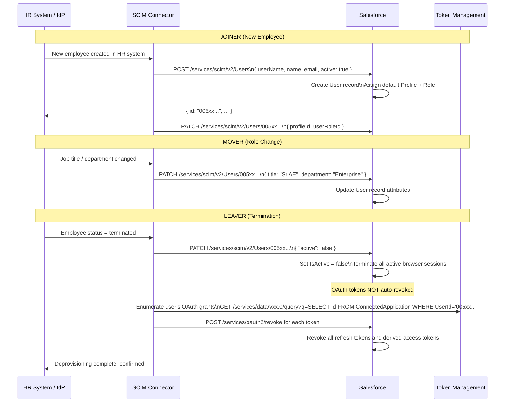
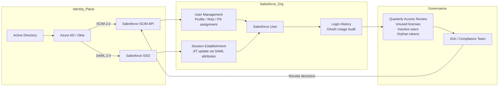

# Identity Governance & Lifecycle Management

## Exam Domain
Access Management & Governance — **20% of exam weight**

Identity Governance is where IAM meets compliance. It's not enough to configure SSO and permission sets — architects must design for the entire user lifecycle: how users are provisioned when they join, how access changes when they move between roles, and critically, how access is revoked when they leave. SCIM, connected app audit, login history, MFA registration, and identity verification methods are all testable on CRT-405.

---

## Foundations

### What Is Identity Governance?

Identity Governance answers three questions about every user in your Salesforce org:

1. **Who has access, and why?** — Entitlement management: what profiles, PSes, connected apps, and roles does each user have?
2. **Is this access still appropriate?** — Access reviews/certifications: periodic review of whether access granted in the past is still needed
3. **Did we clean up?** — Lifecycle management: was the user properly deprovisioned when they left or changed roles?

For the exam, governance translates to: SCIM provisioning/deprovisioning, connected app OAuth usage auditing, login history analysis, and the design of automated lifecycle workflows.

### The Joiner-Mover-Leaver Model

The most common IAM governance framework:

**Joiner (New Hire / New User):**
- Create Salesforce user account
- Assign appropriate Profile, PSGs, roles
- Configure MFA
- Link to SSO identity (Federation ID)
- Provision connected app access

**Mover (Role Change / Promotion):**
- Update Profile if needed
- Add new PSes/PSGs for new responsibilities
- Remove old PSes/PSGs no longer applicable
- Update Role in hierarchy
- Update SSO attributes (e.g., department in SAML JIT)

**Leaver (Termination / Off-boarding):**
- Deactivate Salesforce user (NOT delete — deletion is irreversible and breaks data relationships)
- Revoke all OAuth tokens
- Remove from any sharing rules as owner/member
- Transfer ownership of records to manager
- Audit: verify no active sessions remain

---

## Core Concepts

### SCIM 2.0 (System for Cross-domain Identity Management)

**What SCIM Is:**
SCIM 2.0 (RFC 7643, RFC 7644) is a REST-based standard protocol for automating user identity management between an Identity Provider/HR system and Service Providers (like Salesforce). It defines standard schemas for User and Group objects and standard REST endpoints for CRUD operations.

**Why SCIM for Salesforce:**
- Enables automated provisioning: when a user is created in Azure AD/Okta/Workday, Salesforce user is created automatically
- Enables automated deprovisioning: when a user is disabled in Azure AD, Salesforce user is deactivated (and tokens revoked)
- Enables attribute sync: changes to HR system attributes (title, department, manager) propagate to Salesforce
- Removes the need for manual user management or custom integration scripts

**Salesforce SCIM 2.0 Support:**
Salesforce has a native SCIM 2.0 endpoint. IdPs/IGA systems that support SCIM can connect directly.

**SCIM Endpoints in Salesforce:**
```
Base URL: https://[domain].my.salesforce.com/services/scim/v2/

Users: /services/scim/v2/Users
Groups: /services/scim/v2/Groups
ServiceProviderConfig: /services/scim/v2/ServiceProviderConfig
ResourceTypes: /services/scim/v2/ResourceTypes
Schemas: /services/scim/v2/Schemas
```

**Authentication for SCIM:**
SCIM calls to Salesforce use an **OAuth access token** in the Authorization header. The SCIM client (Okta, Azure AD provisioning service) must have a Connected App in Salesforce and use JWT Bearer or Client Credentials to obtain tokens for SCIM calls.

**SCIM User Schema — Key Salesforce Mappings:**

| SCIM Attribute | Salesforce Field | Notes |
|---|---|---|
| `userName` | Username | Must be unique; format: user@domain.com |
| `name.givenName` | FirstName | |
| `name.familyName` | LastName | |
| `emails[primary].value` | Email | |
| `active` | IsActive | Setting to false = deactivate user |
| `title` | Title | |
| `phoneNumbers[work].value` | Phone | |
| `addresses[work].locality` | City | |
| Custom extension attributes | Custom User fields | Supported via SCIM extension schemas |

**SCIM Provisioning Request — Create User (POST):**
```json
POST /services/scim/v2/Users
Authorization: Bearer <access_token>
Content-Type: application/scim+json

{
  "schemas": ["urn:ietf:params:scim:schemas:core:2.0:User"],
  "userName": "jsmith@company.com",
  "name": {
    "givenName": "John",
    "familyName": "Smith"
  },
  "emails": [{
    "value": "jsmith@company.com",
    "primary": true,
    "type": "work"
  }],
  "active": true,
  "title": "Account Executive",
  "urn:salesforce:schemas:extension:2.0:User": {
    "profileId": "00e...",
    "userRoleId": "00E..."
  }
}
```

**SCIM Deprovisioning — Deactivate (PATCH):**
```json
PATCH /services/scim/v2/Users/{salesforce_user_id}
Authorization: Bearer <access_token>
Content-Type: application/scim+json

{
  "schemas": ["urn:ietf:params:scim:api:messages:2.0:PatchOp"],
  "Operations": [{
    "op": "replace",
    "path": "active",
    "value": false
  }]
}
```

This deactivates the user in Salesforce (sets IsActive = false). Salesforce automatically invalidates all active browser sessions for a deactivated user. However, **OAuth tokens may persist** — see below.

**SCIM Deprovisioning and OAuth Tokens:**
When SCIM deactivates a user (IsActive = false), Salesforce:
- Invalidates all active browser sessions for that user — YES, automatically
- Revokes all OAuth refresh tokens — NO, not automatically in all configurations

For complete token revocation on deprovisioning, the SCIM client should also call the OAuth revocation endpoint, or use the Salesforce API to explicitly revoke all tokens for the user.

---

### Connected App OAuth Usage — Audit & Governance

**Location:** Setup > Connected Apps OAuth Usage

This page is the **OAuth entitlement audit dashboard**:
- Lists all Connected Apps in the org
- Shows the count of users who have active OAuth authorizations for each app
- Enables Block/Unblock operations on a per-app basis

**Governance use case:** Monthly or quarterly review of this page. Questions to ask:
- Are there Connected Apps with no active users? (Candidate for decommission)
- Are there apps with an unexpectedly high user count?
- Are there apps that were blocked and shouldn't be?

**Per-User Token Inventory:**
Navigate to Setup > Connected Apps OAuth Usage > [Click the app name] > OAuth Usage

Shows individual user-level grants:
- User name
- Token issue date
- Actions: Revoke individual token

**Programmatic Token Audit (Apex/API):**
```apex
// Query all OAuth authorizations (ConnectedApplication object)
List<ConnectedApplication> oauthGrants = [
    SELECT Name, UserId, User.Name, User.IsActive, LastModifiedDate
    FROM ConnectedApplication
    WHERE LastModifiedDate < :Date.today().addDays(-90)
    ORDER BY User.Name
];
// Find inactive users still holding OAuth grants
for (ConnectedApplication ca : oauthGrants) {
    if (!ca.User.IsActive) {
        System.debug('Inactive user with token: ' + ca.User.Name + ' → ' + ca.Name);
    }
}
```

---

### Login History

**Location:** Setup > Login History

Login History records every login attempt (successful and failed) to the Salesforce org. Retention: last 6 months.

**Filterable fields:**
- Username
- Login Date/Time
- Status (Success / Failed + reason)
- IP Address
- Login Type (SAML, OAuth, Application, etc.)
- Browser
- Application
- Authentication Method (Standard, MFA)
- Login URL (which endpoint was used)

**IAM Governance Use Cases:**

**1. Identify users never logging in:**
```
Filter: Last Login Before = [90 days ago]
Find users who haven't logged in recently → access review candidates
```

**2. Detect unusual login patterns:**
```
Filter: Login Type = OAuth
Multiple logins from new IPs
Login times outside normal business hours
```

**3. Verify SSO adoption:**
```
Filter: Login Type = SAML (or Application = SSO)
Compare to Username-Password logins — any users bypassing SSO?
```

**4. Failed login analysis:**
```
Filter: Status ≠ Success
High failure rate for specific user → account lockout risk or credential stuffing
High failure rate from single IP → possible brute force
```

**Login History API:**
Login history is queryable via SOQL:
```apex
List<LoginHistory> history = [
    SELECT Username, LoginTime, Status, IpAddress, LoginType, 
           AuthenticationServiceId, UserId
    FROM LoginHistory
    WHERE LoginTime > :DateTime.now().addDays(-30)
    AND Status != 'Success'
    ORDER BY LoginTime DESC
    LIMIT 100
];
```

---

### Identity Verification Methods

Identity verification methods are the registered second factors a user has available. The exam tests which methods establish High-Assurance vs. Standard sessions, and how administrators manage verification method enrollment.

#### Identity Verification Methods

| Method | Type | Assurance Level | Notes |
|---|---|---|---|
| **Salesforce Authenticator** | Mobile push app | High-Assurance | Salesforce's native app; push + location-based automation |
| **TOTP Authenticator App** | Time-based OTP | High-Assurance | Google Authenticator, Microsoft Authenticator, Authy, etc. |
| **Hardware Security Key** | FIDO2/WebAuthn | High-Assurance | YubiKey, Titan Key; phishing-resistant |
| **Built-in Authenticator** | Platform authenticator | High-Assurance | Touch ID, Face ID, Windows Hello (passkeys) |
| **SMS Text Message** | One-time code via SMS | Standard | Weaker; SIM-swap risk; not recommended for sensitive orgs |
| **Email Verification** | One-time code via email | Standard | For Trusted IP waiver; not for session-level MFA |

**Admin Management of Verification Methods:**
- **Disconnect user's registered methods:** Setup > Users > [User] > Disconnect next to the verification method
- This forces the user to re-register their MFA method on next login
- Use case: user gets a new phone; admin disconnects old Salesforce Authenticator to allow re-registration

**MFA Registration Challenges for New Users:**
When MFA is enforced and a new user logs in for the first time, they are prompted to register an MFA method before completing login. If MFA is enforced but the user cannot register (e.g., no smartphone for TOTP), they are locked out. Architect for exceptions:
- Provide hardware keys for users without smartphones
- Configure an admin-accessible bypass temporarily (not recommended for extended use)

#### Salesforce Authenticator Specific Features

**Location-based automation:** Users can save trusted locations. When logging in from a saved location, Salesforce Authenticator can automatically approve the request without user interaction (location-based auto-approval). This is a UX convenience that reduces friction for standard-location users.

**Activity monitoring:** Salesforce Authenticator shows login activity history within the app. Users can see recent login attempts and report suspicious activity.

---

### User Provisioning Automation Options

Beyond SCIM, Salesforce provides several provisioning approaches:

#### 1. SCIM (Recommended for enterprise)
Real-time automated provisioning from IdP/IGA system. Best for large enterprises with mature identity infrastructure.

#### 2. Identity Connect (Salesforce-specific)
Salesforce's own Active Directory synchronization product. Syncs AD users to Salesforce users in real time (or scheduled). Also supports SSO via ADFS or Azure AD.

**Identity Connect flow:**
- AD → Identity Connect agent (on-premises or cloud) → Salesforce SCIM API
- Bidirectional sync possible (changes in Salesforce sync back to AD in some configurations)
- Requires the **Identity Connect PSL** (Permission Set License)

#### 3. JIT Provisioning (SAML)
As covered in lecture 02 — users auto-created on first SAML login. Cannot deprovision.

#### 4. Salesforce Flow + External Data (Custom)
Process Builder/Flow + scheduled batch that calls HR system API to sync users. More custom but more flexible for complex provisioning logic.

#### 5. User Provisioning for Connected Apps
Salesforce can provision users FROM Salesforce TO external applications using the **User Provisioning** feature (in Connected Apps with provisioning enabled). This is the inverse of SCIM into Salesforce — it's Salesforce pushing user data out to external systems.

**User Provisioning for Connected Apps** — when to use:
- Salesforce is the "master" identity for an external app
- When a Salesforce user is created/deactivated, the external app should be notified

---

### Identity Lifecycle — Deprovisioning Deep Dive

Deprovisioning is where identity governance most often fails. The exam tests several nuances.

**Deactivation vs. Deletion:**
| | Deactivation (IsActive = false) | Deletion |
|---|---|---|
| Reversible | Yes | No |
| Retains user ID | Yes | No |
| Retains record ownership | Yes (records still owned by user) | No (records reassigned) |
| Retains audit trail | Yes | May break audit trail |
| Retains login history | Yes | Lost |
| Standard practice | YES | Only in very specific edge cases |

**Always deactivate, never delete** unless specifically required (e.g., test user cleanup in sandboxes).

**What happens immediately on deactivation:**
- User cannot log in
- Active browser sessions are terminated
- Password reset emails for this user are blocked
- User no longer appears in most user lists (but is still queryable)

**What does NOT happen automatically on deactivation:**
- OAuth refresh tokens are NOT automatically revoked
- Sharing rule memberships may persist (user is excluded from sharing evaluations but old records remain)
- Workflow/approval processes in flight remain (need manual cleanup)
- Chatter posts and feed items remain attributed to the user

**For full deprovisioning:**
1. Deactivate the user in Salesforce (IsActive = false)
2. Revoke OAuth tokens: Setup > Manage Connected Apps > OAuth Usage > Revoke, OR use the revocation API
3. Transfer record ownership: use Salesforce's mass record transfer or Data Loader
4. Review sharing rules for user-specific shares
5. Freeze the user if SCIM deprovisioning is delayed (Freeze prevents login while investigation is pending)

**Freezing vs. Deactivating:**
| | Freeze | Deactivate |
|---|---|---|
| Prevents login | Yes | Yes |
| Consumes license | Yes | No |
| Reversible | Yes | Yes |
| Records remain owned | Yes | Yes |
| Use case | Pending investigation; temporary lock | Final offboarding |

---

## PTA / SA Relevance

### When This Comes Up in Engagements

**SCIM Implementation Design**
Customer wants Azure AD to be the system of record for Salesforce user management. Design: Azure AD SCIM connector to Salesforce. Profile assignment in Salesforce cannot be set via standard SCIM — use the Salesforce SCIM extension schema for `profileId`. Roles similarly via `userRoleId`. Test the deprovisioning flow explicitly — the most common oversight.

**Compliance: User Access Reviews**
SOC 2, ISO 27001, HIPAA — all require periodic user access reviews. Design: quarterly access review report exported from Login History + Connected Apps OAuth Usage. Compare active OAuth grants against current employee list. Identify inactive users with active tokens. Present to security/compliance team for certification.

**Token Revocation on Termination**
Day 1 of a new engagement, a security incident occurred because an ex-employee still had a valid OAuth refresh token after being deactivated. Root cause: SCIM deactivation doesn't revoke OAuth tokens. Design fix: add an automated cleanup step to the offboarding process that calls the OAuth revocation endpoint for all of the user's connected app grants.

**MFA Rollout Project**
Company needs to roll out MFA for 2,000 internal users. Design phased approach: 1) Identify users without MFA methods registered (login history + identity verification report). 2) Send pre-registration communications. 3) Set a grace period. 4) Enable MFA enforcement per profile, starting with least-risk profiles. 5) Monitor login failure rates in Login History.

### Common Architecture Failures

**Failure 1: No Deprovisioning in SCIM Config**
Customer configured SCIM for provisioning (create/update) but never configured deprovisioning (disable). When users leave, they remain active in Salesforce indefinitely. Fix: explicitly configure and test the deprovisioning flow in the IdP SCIM connector settings.

**Failure 2: Salesforce SCIM Connector Using Admin Credentials**
The SCIM connector uses a System Administrator user's OAuth token for all operations. When the admin's password changes, SCIM breaks. Fix: create a dedicated Integration User with Manage Users permission and a Connected App using JWT Bearer. The token doesn't expire when passwords change.

**Failure 3: Deactivation Without Token Revocation**
Departing employee is deactivated in Azure AD. SCIM deactivates the Salesforce user. But their mobile app's OAuth refresh token (valid for 1 year per the refresh token policy) remains active. The ex-employee's phone can still call Salesforce APIs for 1 year. Fix: revoke tokens as part of the offboarding script.

**Failure 4: Identity Verification Method Left on Old Phone**
User gets a new phone, can't register new Salesforce Authenticator because the old one is still registered. User is locked out. Helpdesk doesn't know how to disconnect the old method. Fix: document and train on the process: Setup > Users > [User] > Click Disconnect on the old verification method.

### Enterprise Patterns

**Pattern: IGA-Integrated Governance Cycle**
```
Identity Governance & Administration (IGA) tool: SailPoint, Saviynt, Varonis
  ↓ (manages)
Azure AD / Okta (IdP)
  ↓ (SCIM provisioning)
Salesforce (SP)

Quarterly access review workflow:
IGA tool pulls Salesforce entitlement data (Profile, PS assignments via SCIM)
IGA tool presents to managers: "Does User X still need this access?"
Manager approves/revokes
IGA sends SCIM PATCH to Salesforce for revocations
IGA sends revocation API calls for OAuth tokens
Report generated for compliance audit
```

**Pattern: Salesforce-Native Governance with Login History Reports**
```
Scheduled Apex (weekly):
1. Query LoginHistory for past 30 days
2. Query User WHERE IsActive = true
3. Find active users with zero logins in 60 days
4. Send report to admins: "Inactive Users with Active Licenses"
5. Follow up: deactivate if confirmed inactive

Scheduled Apex (daily):
1. Query ConnectedApplication for users with tokens
2. Cross-reference User.IsActive
3. Flag: IsActive = false with active OAuth grants
4. Alert: auto-revoke or manual review trigger
```

---

## Architecture

### User Lifecycle Management Flow



### SCIM + SAML Hybrid Architecture



**Limitations & Tradeoffs:**

| Aspect | Detail |
|---|---|
| SCIM profile assignment | Standard SCIM schema doesn't include Salesforce Profile; requires Salesforce SCIM extension. Some IdP SCIM connectors don't support extension schemas — may need custom provisioning logic. |
| SCIM Permission Set assignment | PSes and PSGs are not part of the standard SCIM User schema. Group-based PS assignment (SCIM Groups → PSGs) is possible in some IdP connectors but varies. |
| Login History retention | Login History is retained for 6 months in standard Salesforce. For longer retention required by compliance, export to an external SIEM (Splunk, Azure Sentinel) using Event Monitoring. |
| SCIM group-to-PSG mapping | Mapping IdP groups to Salesforce Permission Set Groups is supported in some IdP connectors (Okta SCIM for Salesforce supports this). Azure AD SCIM for Salesforce maps groups to roles, not PSGs by default. |
| Deactivation propagation speed | SCIM deactivation is near-real-time but not instant. There may be a window (seconds to minutes) between HR termination event and Salesforce deactivation. For high-security scenarios, automate and monitor SLA. |

---

## Key Facts to Memorize

1. **SCIM 2.0: REST-based standard; Salesforce endpoint is `/services/scim/v2/`**
2. **SCIM authentication: OAuth access token (JWT Bearer or Client Credentials Connected App)**
3. **SCIM deactivation sets IsActive=false; does NOT automatically revoke OAuth tokens**
4. **Always DEACTIVATE users, never DELETE (deletion is irreversible and breaks audit trail)**
5. **Freezing = prevents login but retains license; Deactivating = frees license**
6. **Login History: retained 6 months; queryable via SOQL (LoginHistory object)**
7. **Connected Apps OAuth Usage: Setup dashboard for all OAuth grants; Block = revoke all tokens**
8. **Identity verification methods: TOTP/Authenticator App/Hardware Key = High-Assurance; SMS/Email = Standard**
9. **Disconnect verification method: Setup > Users > [User] > click Disconnect (for new phone scenarios)**
10. **Salesforce Authenticator: supports location-based auto-approval**
11. **SCIM extension schema for Salesforce: `urn:salesforce:schemas:extension:2.0:User` (profileId, userRoleId)**
12. **User Provisioning for Connected Apps: Salesforce pushes user data to external apps (outbound)**
13. **Joiner-Mover-Leaver: the standard IAM lifecycle framework**
14. **Identity Connect: Salesforce's AD synchronization product; requires Identity Connect PSL**
15. **Token revocation after offboarding: must be explicit; not automatic with SCIM deactivation**

---

## Exam Traps

**Trap 1: "SCIM deactivation automatically revokes all OAuth tokens"**
> SCIM PATCH with `active: false` deactivates the user (terminates browser sessions) but does NOT automatically revoke OAuth refresh tokens. Refresh tokens can persist indefinitely per the Connected App's Refresh Token Policy. Explicit OAuth token revocation must be a separate step in the offboarding process.

**Trap 2: "Deleting a Salesforce user is standard practice for departed employees"**
> Deleting users is irreversible and breaks data relationships (record ownership, audit trail attributions, approval history). Standard practice is DEACTIVATION (IsActive = false), which preserves all historical data while preventing access.

**Trap 3: "Login History shows all-time login data"**
> Login History is only retained for 6 months. For longer-term audit requirements (often required for SOC 2: 12 months), data must be exported to an external SIEM using Event Monitoring. The LoginHistory SOQL object reflects this 6-month limit.

**Trap 4: "SMS verification establishes a High-Assurance session"**
> SMS verification (one-time code via text message) establishes a Standard assurance session, not High-Assurance. This is because SMS is susceptible to SIM-swap attacks and is less secure. Only authenticator apps (TOTP/push), hardware security keys (FIDO2), and built-in authenticators (passkeys) establish High-Assurance sessions.

**Trap 5: "SCIM requires a custom Apex class to work with Salesforce"**
> Salesforce has a native SCIM 2.0 endpoint. No custom Apex is required for standard SCIM operations. IdP connectors (Okta, Azure AD) connect directly to the `/services/scim/v2/` endpoint using an OAuth access token. Custom logic may be needed for non-standard provisioning requirements but is not required for basic CRUD.

---

## Practice Questions

**Question 1**

A company uses Azure AD as the IdP for Salesforce. When an employee is terminated, HR deactivates their Azure AD account. The SCIM connector deactivates the employee's Salesforce user. Three weeks later, the security team discovers the ex-employee's mobile app can still retrieve Salesforce data. What was missed?

A. The employee's Profile should have been changed to a read-only profile before deactivation  
B. SCIM deactivation sets IsActive=false but does not automatically revoke OAuth refresh tokens; the tokens must be explicitly revoked  
C. Azure AD Conditional Access should have blocked the deactivated account from all OAuth flows  
D. Login Hours should have been configured to prevent after-hours access  

**Answer: B**

*Explanation:* When IsActive is set to false via SCIM, browser sessions are terminated but OAuth refresh tokens remain valid per the Connected App's Refresh Token Policy. The mobile app holds a long-lived refresh token that continues to function. The fix is to explicitly revoke all OAuth tokens as part of the offboarding process — either via the Connected Apps OAuth Usage page (Block) or programmatically via the `/services/oauth2/revoke` endpoint. A, C, and D address different scenarios and don't resolve the already-issued OAuth token.

---

**Question 2**

An architect is designing a SCIM integration from Okta to Salesforce. The architect needs Salesforce to create users with specific Profiles and Roles when SCIM provisions them. Which SCIM schema extension provides Salesforce-specific attributes like Profile ID and Role ID?

A. `urn:ietf:params:scim:schemas:extension:enterprise:2.0:User`  
B. `urn:salesforce:schemas:extension:2.0:User`  
C. `urn:oasis:names:tc:SAML:2.0:attrname-format:basic`  
D. Salesforce-specific SCIM attributes are not supported; use JIT provisioning instead  

**Answer: B**

*Explanation:* The Salesforce SCIM extension schema `urn:salesforce:schemas:extension:2.0:User` provides Salesforce-specific attributes including `profileId`, `userRoleId`, and others that don't exist in the standard SCIM core schema. The enterprise extension (A) adds common enterprise attributes like manager and department but not Salesforce-specific ones. C is a SAML attribute format, not SCIM. D is wrong — Salesforce SCIM does support profile/role assignment via the extension schema.

---

**Question 3**

A governance audit requires identifying all Salesforce users who have not logged in for 90 days but still hold active OAuth tokens for the "CRM Mobile App" Connected App. Which approach best accomplishes this?

A. Export the Connected Apps OAuth Usage page and manually cross-reference with login history  
B. Query LoginHistory for users inactive for 90 days; cross-reference with ConnectedApplication records for the target app  
C. Use the Setup Audit Trail to find OAuth activity in the past 90 days  
D. Check the Event Monitoring login event logs to identify idle sessions  

**Answer: B**

*Explanation:* SOQL can query both `LoginHistory` (to find users inactive for 90 days) and `ConnectedApplication` (to find users with OAuth grants for the specific app). Joining these queries by UserId identifies the intersection — inactive users who still have tokens. A is possible but manual. C (Setup Audit Trail) doesn't show OAuth token validity. D (Event Monitoring) requires a separate license and shows login events, not necessarily token validity. SOQL-based governance is the architect-level approach.

---

**Question 4**

A user cannot complete their first login after MFA enforcement is enabled. The user was provisioned via SCIM and has never logged in before. The login fails after entering correct credentials. What is the most likely cause?

A. The user's profile has Login IP Ranges that block their current location  
B. The user is being prompted to register an MFA verification method but lacks a compatible device  
C. SCIM provisioning set the user's IsActive to false during creation  
D. The MFA method was already registered and is blocking the new registration  

**Answer: B**

*Explanation:* When MFA is enforced and a new user logs in for the first time, Salesforce prompts them to register an MFA verification method before completing the login flow. If the user doesn't have a compatible device (smartphone for Salesforce Authenticator or TOTP app, or a hardware key), they cannot complete registration and are effectively locked out. The architect must plan for this: provide hardware keys as an alternative, or implement a temporary MFA bypass process for initial provisioning. A could be the cause but the question specifies "correct credentials" succeeded before MFA. C is possible but SCIM usually sets active:true. D is fabricated.

---

**Question 5**

A company needs to retain login history data for 3 years to comply with financial industry regulations. What is the recommended architecture?

A. Configure Salesforce Login History retention to 3 years in Session Settings  
B. Use Salesforce Shield Field Audit Trail to extend login record retention  
C. Schedule a nightly Apex job to export Login History to a Salesforce custom object for indefinite retention  
D. Configure Salesforce Event Monitoring with an external SIEM (Splunk, Azure Sentinel) to capture and retain login events long-term  

**Answer: D**

*Explanation:* Salesforce Login History is natively retained for only 6 months and cannot be extended beyond that within Salesforce. For 3-year retention, the data must be exported to an external system. Salesforce Event Monitoring (requires the Event Monitoring add-on or Shield) provides login events that can be streamed to a SIEM via the EventLogFile API. SIEMs like Splunk or Azure Sentinel can retain data for years. A is wrong — Login History retention cannot be configured beyond 6 months. B (Field Audit Trail) is for field-level data history, not login history. C (custom object storage) is technically possible but creates data governance issues and is not architecturally correct.
