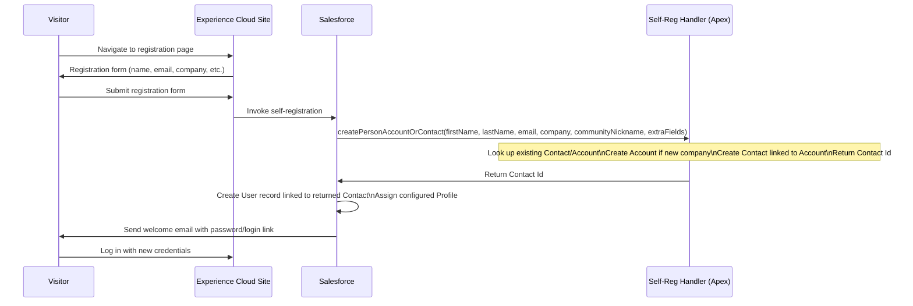
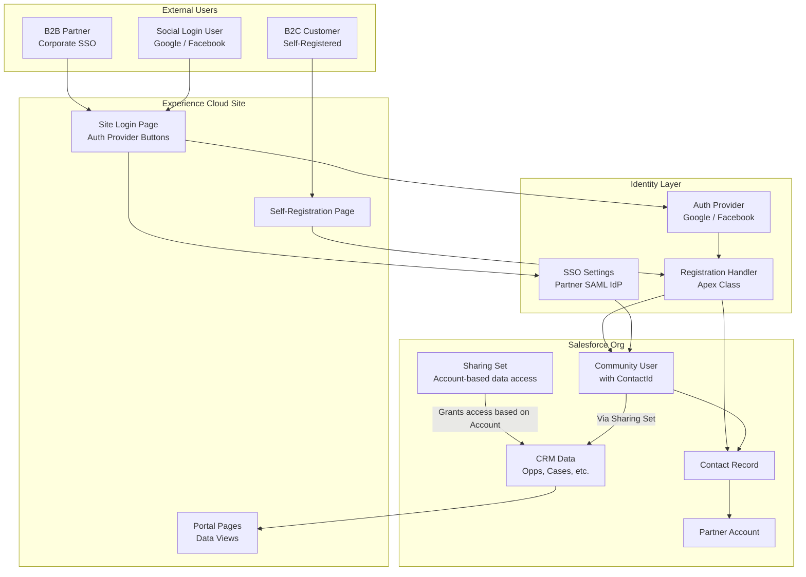

# Experience Cloud Identity

## Exam Domain
Communities, Portals & External Identity — **17% of exam weight** (~10 questions)

Experience Cloud (formerly Community Cloud) identity is conceptually distinct from internal Salesforce identity. External users — customers, partners, and self-registered community members — have different license models, different data access controls, and different authentication options. The exam tests the architecture of external identity at depth: self-registration flows, the Registration Handler Apex class in a community context, sharing sets, and the licensing nuances.

---

## Foundations

### What Is External Identity?

When Salesforce talks about "external identity," it means users outside your organization who access Salesforce via an Experience Cloud site (community, portal, or digital experience). These are NOT internal employees — they are:
- B2C customers (Consumer-facing portals)
- B2B partners (Partner Community)
- Dealers, franchisees, agents (Partner Community or Customer Community)
- Citizens (government portals)
- Students (education portals)

External users differ fundamentally from internal users:
- They have **Community licenses** or **External Identity licenses**, not full Salesforce licenses
- Their object access is much more limited — read/write on specific objects, not broad CRM access
- Their authentication options include social SSO, self-registration, and their own corporate SSO
- Data visibility is controlled by **Sharing Sets** and **Share Groups** in addition to standard sharing rules

---

## Core Concepts

### Experience Cloud Site Architecture

An Experience Cloud site is a Salesforce-hosted website that exposes Salesforce data and functionality to external users. It sits on top of a Salesforce org and uses the org's data model.

**Components:**
- **Experience Cloud site**: The configured site with pages, branding, and navigation
- **Experience Builder**: Drag-and-drop site builder
- **Community workspace**: Admin console for members, moderation, and reputation
- **Salesforce org**: The underlying data platform

**URL Structure:**
- Default: `https://[org-domain].my.site.com/[site-suffix]`
- Custom: `https://portal.company.com/[site-suffix]` (with DNS configuration)

**Identity entry points:**
- Site login page
- Self-registration page
- Social login (Auth Provider buttons on login page)
- External SSO (if the community users have a separate corporate IdP)

---

### External User Licenses and Profiles

External users must have a **Community Profile** or a Profile based on a Community License. The core licenses:

| License | Description | CRM Access | Typical Use |
|---|---|---|---|
| **External Identity** | Identity-only; SSO without community features | None | SSO portal without CRM data |
| **Customer Community** | Read-only community features; limited object access | No standard objects | B2C customer self-service |
| **Customer Community Plus** | Adds sharing rules, reporting | Limited CRM | Advanced customer portal |
| **Partner Community** | Full community features + CRM objects (Leads, Opps) | Yes (leads, opps, contacts) | Dealer/partner/reseller portals |

**Profile Requirements for Community Users:**
Each external user must have a Profile based on their community license. The Profile controls:
- Object-level access (which standard and custom objects they can see)
- Field-level security
- Login settings (hours, IP ranges — less commonly used for external users)
- Tab visibility within the community

**Community Profiles vs. Internal Profiles:** Community Profiles cannot be used for internal users. Internal Profiles cannot be used for community users. The profile type is tied to the license.

---

### Contact-Based Identity: The Community User Model

Every external community user in Salesforce must be associated with a **Contact** record. The Contact must be associated with an **Account** record. This is the fundamental identity model for Experience Cloud:

```
Account (Company / Organization)
  └── Contact (Individual)
        └── Community User
```

**Why this architecture?**
- Salesforce's sharing model for external users is built around the Account-Contact relationship
- Data visibility for a community user is often determined by which Account they belong to (e.g., a partner user can only see Opportunities linked to their partner Account)
- Sharing Sets and Share Groups use this relationship for automatic data sharing

**Creating a Community User:**
```apex
// 1. First, create or find the Account
Account partnerAccount = [SELECT Id FROM Account WHERE Name = 'Acme Partner' LIMIT 1];

// 2. Create or find the Contact
Contact c = new Contact();
c.FirstName = 'Jane';
c.LastName = 'Doe';
c.Email = 'jane.doe@acmepartner.com';
c.AccountId = partnerAccount.Id;
insert c;

// 3. Create the Community User linked to the Contact
Profile p = [SELECT Id FROM Profile WHERE Name = 'Partner Community User' LIMIT 1];
User u = new User();
u.FirstName = 'Jane';
u.LastName = 'Doe';
u.Email = 'jane.doe@acmepartner.com';
u.Username = 'jane.doe@acmepartner.com.partnerportal';
u.Alias = 'jdoe';
u.ProfileId = p.Id;
u.ContactId = c.Id;  // ← Key: links user to Contact
u.EmailEncodingKey = 'UTF-8';
u.LanguageLocaleKey = 'en_US';
u.LocaleSidKey = 'en_US';
u.TimeZoneSidKey = 'America/New_York';
insert u;
```

---

### Self-Registration

Self-registration allows new users to create their own community accounts from the site's registration page without admin intervention.

**Enabling Self-Registration:**
1. In Experience Builder > Settings > General > enable self-registration
2. Configure the Profile new users should receive
3. Configure the Account new users should be linked to (or set to null and handle in code)
4. Optionally configure a Self-Registration Handler Apex class for custom logic

**Self-Registration Flow:**


**Self-Registration Handler:**

The self-registration handler is an Apex class that implements the `Site.RegistrationHandler` interface (different from `Auth.RegistrationHandler` for Auth Providers):

```apex
global class MyRegistrationHandler implements Site.RegistrationHandler {
    
    global boolean onSendEmailConfirmation(Id userId, ApexPages.PageReference page) {
        // Optional: customize email verification behavior
        return true;
    }
    
    global Id createPersonAccountOrContact(
        String firstName, String lastName, String email, 
        String company, String communityNickname, 
        Map<String, Object> extraFields
    ) {
        // Look up existing Contact
        List<Contact> existingContacts = [
            SELECT Id FROM Contact 
            WHERE Email = :email 
            LIMIT 1
        ];
        if (!existingContacts.isEmpty()) {
            return existingContacts[0].Id;
        }
        
        // Look up or create Account
        List<Account> accounts = [
            SELECT Id FROM Account 
            WHERE Name = :company 
            LIMIT 1
        ];
        Id accountId;
        if (!accounts.isEmpty()) {
            accountId = accounts[0].Id;
        } else {
            Account a = new Account(Name = company);
            insert a;
            accountId = a.Id;
        }
        
        // Create Contact
        Contact c = new Contact();
        c.FirstName = firstName;
        c.LastName = lastName;
        c.Email = email;
        c.AccountId = accountId;
        insert c;
        
        return c.Id;
    }
}
```

---

### Sharing Sets — Data Access for External Users

Standard Salesforce sharing rules (criteria-based, owner-based) do NOT work for external Community users. Instead, **Sharing Sets** are the primary mechanism for granting external users access to records.

**What Sharing Sets Do:**
A Sharing Set grants access to records where a field on the record matches a field on the user's contact or account. It's a lookup-based access model.

**Example: Partner user can see Opportunities linked to their Account**

```
Sharing Set Configuration:
  Name: Partner Opportunity Access
  License Type: Partner Community
  
  Access Mapping:
    Object: Opportunity
    Field on Opportunity: Account (AccountId)
    Field on User: User.ContactId → Contact.AccountId
    Access Level: Read/Write
```

This means: "For any Opportunity where AccountId matches the community user's Account, grant Read/Write."

**Setting up Sharing Sets:**
Setup > Digital Experiences > Settings > Sharing Sets > New

Fields:
- **Sharing Set Name**: Display name
- **License Type**: Which community license this applies to
- **Access Mapping**: One or more object-to-field mappings defining when to share

**Multiple Object Support:**
A single Sharing Set can include multiple object mappings. A Partner Community Sharing Set might cover: Opportunities, Cases, Contacts (within the Account), Orders, Custom Objects.

**Sharing Set Limitations:**
- Only works for objects where there's a lookup relationship to the user's Account or Contact
- Does not support all standard objects (e.g., some objects are not supported in Sharing Sets)
- Cannot grant record-level access to specific records (use Share records for that)
- Records shared via Sharing Sets have the access level defined in the set (Edit or Read Only)

---

### Share Groups — Granting Access to Records Owned by Portal Users

By default, portal users' records (records owned by portal users) are only visible to the owning user. **Share Groups** allow broader visibility:

- A Share Group makes records OWNED BY a specific type of portal user visible to internal users or other portal user groups
- Use case: A Customer Community user submits a Case. The Case is "owned" by the community user. Without a Share Group, other internal agents may not see it via standard sharing.

**Share Groups are configured in:** Setup > Digital Experiences > Settings > Share Groups

---

### Social SSO for Communities

External community users can authenticate via social identity providers (Google, Facebook, LinkedIn, etc.) using the Auth Provider + Registration Handler pattern:

**Configuration:**
1. Create Auth Provider (Google, Facebook, etc.) — covered in Lecture 04
2. In the Auth Provider's Registration Handler, handle community-specific user creation:
   - Check `data.siteLoginUrl` to determine if login is from a community (not null) vs. internal org
   - Create a Community User (with `ContactId`) rather than an internal user

**Example Registration Handler for Community Social Login:**
```apex
global class CommunityRegistrationHandler implements Auth.RegistrationHandler {
    
    global User createUser(Id portalId, Auth.UserData data) {
        if (portalId != null) {
            // Community login
            return createCommunityUser(portalId, data);
        } else {
            // Internal org login
            return createInternalUser(data);
        }
    }
    
    private User createCommunityUser(Id portalId, Auth.UserData data) {
        // Find or create Contact
        Contact c = findOrCreateContact(data);
        
        Profile p = [SELECT Id FROM Profile WHERE Name = 'Customer Community Login User' LIMIT 1];
        User u = new User();
        u.FirstName = data.firstName;
        u.LastName = data.lastName;
        u.Email = data.email;
        u.Username = data.email + '.community';
        u.Alias = (data.firstName.substring(0, 1) + data.lastName).left(8);
        u.ProfileId = p.Id;
        u.ContactId = c.Id;  // Link to Contact
        u.EmailEncodingKey = 'UTF-8';
        u.LanguageLocaleKey = 'en_US';
        u.LocaleSidKey = 'en_US';
        u.TimeZoneSidKey = 'America/Los_Angeles';
        return u;
    }
    
    private Contact findOrCreateContact(Auth.UserData data) {
        List<Contact> existing = [
            SELECT Id FROM Contact WHERE Email = :data.email LIMIT 1
        ];
        if (!existing.isEmpty()) return existing[0];
        
        // Find or create Account for the domain
        String domain = data.email.substringAfter('@');
        List<Account> accounts = [SELECT Id FROM Account WHERE Website LIKE :('%' + domain) LIMIT 1];
        Account a;
        if (accounts.isEmpty()) {
            a = new Account(Name = 'Self-Registered: ' + domain);
            insert a;
        } else {
            a = accounts[0];
        }
        
        Contact c = new Contact(
            FirstName = data.firstName, 
            LastName = data.lastName,
            Email = data.email,
            AccountId = a.Id
        );
        insert c;
        return c;
    }
    
    global void updateUser(Id userId, Id portalId, Auth.UserData data) {
        User u = new User(Id = userId, Email = data.email);
        update u;
    }
}
```

---

## PTA / SA Relevance

### When This Comes Up in Engagements

**B2B Partner Portal Design**
A customer building a partner portal needs to control data access. You'll design:
- Account-Contact-User hierarchy for each partner company
- Sharing Sets that grant Opportunity and Case access based on Account membership
- SSO configuration for partners with their own corporate IdP (SAML or OIDC Auth Provider per partner company)
- Profile for partners: Partner Community User profile

**B2C Self-Registration Portal**
A retailer building a customer self-service portal. Key design decisions:
- Self-registration enabled with Registration Handler that looks up existing Contacts by email
- Optional social login (Google/Apple/Facebook)
- Customer Community license for registered users
- External Identity license for users who only need SSO (no community features)

**Headless Experience Cloud**
Modern architecture: a React/Next.js frontend uses Salesforce APIs for data, but Experience Cloud handles identity. Auth Provider + Community User + Sharing Sets still apply — the frontend calls Salesforce APIs using the community user's OAuth token.

### Common Architecture Failures

**Failure 1: No Registration Handler — Duplicate Users**
Self-registration creates a new user every time the same email registers. Root cause: no Registration Handler checking for existing Contacts. Every submission creates a new Contact and User. Fix: always query existing Contacts by email in the registration handler.

**Failure 2: Sharing Set Missing — Partners See No Data**
Partner Community site is configured. Partners log in. They see no Opportunities even though the partner Account has related Opportunities. Root cause: Sharing Set not configured. Without a Sharing Set, community users see only records they directly own. Fix: create a Sharing Set with Opportunity → AccountId mapping.

**Failure 3: Internal Profile Used for Community User**
Developer creates a community user using a standard internal profile. The user appears to work in testing but consumes a full Salesforce license. In production, this causes license overuse and potential compliance issues. Fix: always use a Profile based on the community license type.

**Failure 4: Social Login Creates Internal Users**
The Auth Provider Registration Handler doesn't check `portalId`. Social login from the community creates an internal Salesforce user without a `ContactId`. This user cannot access community data properly and consumes an internal license. Fix: always check `portalId != null` in `createUser()` to differentiate community from internal logins.

### Enterprise Patterns

**Pattern: Multi-Tier Partner Identity**
```
Tier 1: Gold Partners — Partner Community license, full portal access
         SAML SSO from partner's own Azure AD
         Sharing Sets: Opportunities (RW), Cases (RW), Products (R)

Tier 2: Silver Partners — Customer Community Plus license
         Username/password + MFA
         Sharing Sets: Cases only (RW)

Tier 3: Prospects — External Identity license
         Self-registration, email verification
         No CRM data access (just SSO and profile)
```

---

## Architecture

### Experience Cloud Identity Architecture



**Limitations & Tradeoffs:**

| Aspect | Detail |
|---|---|
| Contact requirement | Every community user must have a Contact. This creates data volume (large volumes of Contact records for B2C portals). Design your Contact management strategy carefully. |
| Sharing Set performance | Sharing Sets re-evaluate on relevant field changes. Large orgs with many community users and many shared records can experience performance impacts on sharing recalculation events. |
| Headless community identity | Headless architectures (React frontend + Salesforce APIs) still need Experience Cloud for identity — the community site is the OAuth authorization server for the external app. |
| License cost | External Identity license is lower cost than Customer Community, but provides no CRM data access. Customer Community Plus is higher cost than Customer Community but enables sharing rules and reports. Choose based on portal requirements. |

---

## Key Facts to Memorize

1. **Every community user must have a Contact; Contact must have an Account**
2. **Community Users use Community Profiles (based on community license) — not internal profiles**
3. **Sharing Sets: grant access to records where object field matches user's Account/Contact field**
4. **Share Groups: grant internal users access to records owned by community users**
5. **Self-registration Handler: implements `Site.RegistrationHandler`; returns Contact Id**
6. **Auth Provider Registration Handler for communities: check `portalId != null` to detect community context**
7. **Four community licenses: External Identity, Customer Community, Customer Community Plus, Partner Community**
8. **External Identity license = SSO only; no CRM access; lowest cost**
9. **Partner Community = CRM object access (Leads, Opportunities); highest cost**
10. **Social SSO for communities: Auth Provider configured; enabled on Experience Cloud login page**
11. **Self-registration: enabled in Experience Builder Settings; needs Registration Handler for production**
12. **Community users are subject to Sharing Sets, not standard sharing rules (for record-level access)**
13. **`portalId` parameter in `Auth.RegistrationHandler.createUser()`: not null = community login**
14. **Account-Contact-User hierarchy is the fundamental external identity model**
15. **Experience Cloud self-registration creates Contact + User; Registration Handler controls the Contact creation logic**

---

## Exam Traps

**Trap 1: "Community users can use standard Profile-level sharing rules"**
> Standard owner-based and criteria-based sharing rules apply at the org level. For community users, Sharing Sets are the mechanism for Account/Contact-based record sharing. Standard sharing rules may apply to community users for some scenarios, but Sharing Sets are the community-specific feature tested on the exam.

**Trap 2: "Self-registration automatically prevents duplicate user creation"**
> Without a custom Registration Handler, self-registration creates a new Contact and User on every new registration submission. Duplicate detection requires explicitly checking for existing Contacts by email in the `createPersonAccountOrContact()` method.

**Trap 3: "External Identity license users can access CRM objects"**
> External Identity license users cannot access Salesforce CRM objects. They have identity and SSO capabilities only. For CRM data access, Customer Community or Partner Community licenses are required.

**Trap 4: "The same Registration Handler class works identically for internal and community logins"**
> While the same class can serve both contexts, it MUST distinguish between them using `portalId`. When `portalId` is not null, the login is from a community and the handler must create a community user with `ContactId`. When `portalId` is null, it's an internal login. Failing to make this distinction creates wrong user types in either case.

**Trap 5: "Partners with their own IdP cannot use SSO for the Partner Community"**
> Partners can authenticate to an Experience Cloud site using their own corporate IdP. Configure SSO Settings (SAML) or an Auth Provider (OIDC) for the partner's IdP. Enable it on the Experience Cloud site's login page. The Registration Handler (for Auth Provider) or JIT provisioning (for SAML) handles user creation.

---

## Practice Questions

**Question 1**

A company is building a Partner Community portal where partner users need to access Opportunities related to their partner Account. Partners are logging in with username and password. After logging in, partners see no Opportunities even though Opportunities with their Account as the related Account exist. What is the most likely cause?

A. Partner Community users cannot access Opportunity records by design  
B. A Sharing Set has not been configured to grant Opportunity access based on the partner user's Account  
C. The Opportunity records are owned by internal users, so community users cannot see them  
D. The Partner Community license does not include Opportunity read access  

**Answer: B**

*Explanation:* Community users do not automatically see records simply because they exist in Salesforce. Sharing Sets must be configured to grant access to specific objects based on the relationship between the record and the community user's Account. Without a Sharing Set mapping Opportunity.AccountId to the user's Account, partners see no Opportunities. A is wrong — Partner Community users CAN access Opportunities. C is wrong — record ownership doesn't prevent access when a Sharing Set grants it. D is wrong — Partner Community license does include Opportunity access.

---

**Question 2**

An architect needs to implement self-registration for a customer-facing Experience Cloud site. During registration, the system should check if a Contact already exists with the same email address and link the new user to it instead of creating a duplicate. Which Salesforce feature enables this custom logic?

A. Self-registration URL parameter configuration in Experience Builder  
B. A Registration Handler Apex class implementing `Site.RegistrationHandler`  
C. A Process Builder automation triggered on User creation  
D. JIT provisioning configured in Single Sign-On Settings  

**Answer: B**

*Explanation:* The `Site.RegistrationHandler` interface's `createPersonAccountOrContact()` method is where custom self-registration logic lives. This method can query for existing Contacts by email and return the existing Contact ID instead of creating a new one. A (URL parameters) cannot contain custom logic. C (Process Builder) fires AFTER user creation — by then, a duplicate Contact may already exist. D (JIT) is for SAML SSO, not self-registration.

---

**Question 3**

A company using Experience Cloud has partners who authenticate via their own corporate SAML IdP. A new partner employee logs in for the first time. The SAML assertion is validated, but Salesforce cannot match the user and JIT provisioning creates an internal user (not a community user). What is the most likely architectural issue?

A. SAML JIT is not supported for Experience Cloud users  
B. The SAML SSO Settings are not associated with the Experience Cloud site; they are configured at the org level only  
C. JIT provisioning for community users requires additional SAML attributes specifying `User.ContactId` and a community profile  
D. The partner's IdP does not support the SAML assertions required for community user creation  

**Answer: C**

*Explanation:* SAML JIT provisioning for community users requires community-specific attributes in the SAML assertion: at minimum a community profile designation, and ideally `User.ContactId` (or enough attributes to determine which Contact to link) and a community-compatible username. Without these, JIT creates a standard internal user. The SAML assertion must include `User.ProfileId` or `User.ProfileName` pointing to a community profile, and the JIT handler must handle `User.ContactId`. A is wrong — JIT does work for community users with proper configuration. B is a valid issue (SSO must be enabled for the site) but isn't the root cause if the assertion is already being processed.
