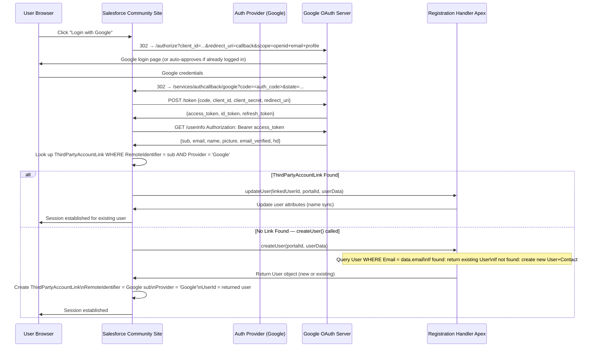

# Social SSO

## Exam Domain
Communities, Portals & External Identity — **17% of exam weight**

Social SSO allows users to authenticate via social identity providers — Google, Facebook, LinkedIn, Apple, Twitter/X — instead of creating yet another username and password. For B2C portals especially, social login reduces registration friction dramatically. The exam tests the complete configuration path: OAuth app at the social provider, Auth Provider in Salesforce, Registration Handler, linking to existing users, and the specific nuances of each major social provider.

---

## Foundations

### Why Social SSO Matters

Consumer expectations: users do not want to create a new account for every website. They expect to click "Login with Google" and be done. For Salesforce-backed portals, social SSO means:
- **Reduced friction**: No new password to remember
- **Pre-verified email**: Google/Facebook have already verified the email address
- **Consistent identity**: The same Google account links the user across your portal over time
- **Reduced support burden**: Fewer "forgot my password" tickets

For enterprise B2C use cases (retail portals, healthcare patient portals, insurance portals), social login can be the primary authentication mechanism. The architect must design the identity linking strategy — how does a social identity map to an existing customer record?

---

## Core Concepts

### Social SSO Architecture Overview

Every social SSO integration in Salesforce follows the same pattern:

1. **Register an OAuth app at the social provider** to get a Client ID and Client Secret
2. **Create an Auth Provider in Salesforce** with the Client ID/Secret and a Registration Handler
3. **Enable the Auth Provider on the Experience Cloud login page** (or My Domain)
4. **Write the Registration Handler** to map the social identity to a Salesforce user (or community user)

The core protocol: **OAuth 2.0 Authorization Code** flow (or OIDC for Google and others). The social provider is the Authorization Server; Salesforce is the OAuth client.

---

### Google Social SSO — Complete Configuration

#### Step 1: Create Google OAuth Application

1. Navigate to [Google Cloud Console](https://console.cloud.google.com/) > APIs & Services > Credentials
2. Click "Create Credentials" > OAuth 2.0 Client ID
3. Application type: **Web Application**
4. Name: `Salesforce Community Portal`
5. Under "Authorized redirect URIs": Leave blank for now (you'll add after creating the Salesforce Auth Provider)
6. Save → Copy the **Client ID** and **Client Secret**

#### Step 2: Create Salesforce Auth Provider

1. Setup > Auth. Providers > New
2. Provider Type: **Google**
3. Name: `Google Login`
4. URL Suffix: `google`
5. Consumer Key: `[Client ID from Step 1]`
6. Consumer Secret: `[Client Secret from Step 1]`
7. Scopes: `openid email profile`
8. Registration Handler: `[Your Apex class name]`
9. Execute Registration As: `[Dedicated automation user]`
10. Save

After saving, copy the **Callback URL** from the Auth Provider detail page:
- Format: `https://[your-domain].my.salesforce.com/services/authcallback/google`

#### Step 3: Register Callback URL in Google

1. Return to Google Cloud Console > OAuth 2.0 Client > Edit
2. Add the Salesforce Callback URL to "Authorized redirect URIs"
3. Save

#### Step 4: Enable on Experience Cloud Site

1. Experience Builder > Settings > Login & Registration
2. Under "Login", find the Google Auth Provider
3. Enable it → Google logo appears on the community login page

#### Google-Specific Claim: `hd` (Hosted Domain)

For Workspace (formerly G Suite) customers, Google provides the `hd` claim in the token, indicating the hosted domain (e.g., `company.com`). Use this in the Registration Handler to restrict logins:

```apex
String hostedDomain = data.attributeMap.get('hd');
if (hostedDomain == null || !hostedDomain.equals('company.com')) {
    throw new Auth.AuthProviderPluginException('Only company.com Google accounts are allowed');
}
```

#### Google OIDC Claims Available

| Claim | Description | Access via |
|---|---|---|
| `sub` | Unique Google user ID | `data.identifier` |
| `email` | Email address | `data.email` |
| `email_verified` | Whether Google verified the email | `data.attributeMap.get('email_verified')` |
| `name` | Full display name | `data.fullName` |
| `given_name` | First name | `data.firstName` |
| `family_name` | Last name | `data.lastName` |
| `picture` | Profile photo URL | `data.attributeMap.get('picture')` |
| `hd` | Hosted domain (G Suite only) | `data.attributeMap.get('hd')` |
| `locale` | Language/region | `data.locale` |

---

### Facebook Social SSO — Complete Configuration

#### Step 1: Create Facebook App

1. Go to [Facebook for Developers](https://developers.facebook.com/) > Create App
2. App Type: **Business** (or Consumer for B2C)
3. App Name: `Salesforce Portal`
4. Add the "Facebook Login" product to your app
5. In Facebook Login settings > Valid OAuth Redirect URIs: (add after creating SF Auth Provider)
6. Go to Settings > Basic → Copy **App ID** and **App Secret**

#### Step 2: Create Salesforce Auth Provider

1. Provider Type: **Facebook**
2. Consumer Key: `[App ID]`
3. Consumer Secret: `[App Secret]`
4. Scopes: `email public_profile`
5. Registration Handler: `[Your Apex class]`
6. URL Suffix: `facebook`

#### Step 3: Register Callback URL in Facebook

Add the Salesforce Callback URL to Facebook Login > Valid OAuth Redirect URIs.

#### Facebook-Specific Considerations

**Email permission is not guaranteed:**
Facebook users can deny the email permission during login. Your Registration Handler must handle the case where `data.email` is null:

```apex
global User createUser(Id portalId, Auth.UserData data) {
    if (String.isBlank(data.email)) {
        throw new Auth.AuthProviderPluginException(
            'Email access is required. Please allow email permission and try again.'
        );
    }
    // ... rest of handler
}
```

**Facebook identifier is numeric:**
The `data.identifier` for Facebook is a numeric App-Scoped User ID (unique per app). Use this as the linking key, not email (which can change or be absent).

**Facebook API version requirements:**
Facebook periodically deprecates API versions. Salesforce's built-in Facebook Auth Provider targets a specific Graph API version. When Facebook deprecates an older version, the Auth Provider may stop working. Monitor for Facebook API version deprecation notices.

---

### LinkedIn Social SSO

LinkedIn uses OAuth 2.0 and OpenID Connect (since the migration from the older v2 API). The Salesforce built-in LinkedIn Auth Provider type is available but note:

**LinkedIn Profile API Changes:**
LinkedIn significantly changed its API in 2022-2023. Profile information (first name, last name) was moved behind the OpenID Connect (`userinfo`) endpoint. The Salesforce built-in LinkedIn type may need to be configured correctly to access name data. Always test end-to-end after configuration.

**LinkedIn Scopes:**
- `openid`: Required for OIDC
- `profile`: First name, last name
- `email`: Email address (user must authorize separately)
- `w_member_social`: Post on behalf of user (not typically needed for SSO)

**Registration URL for LinkedIn App:**
Register your Salesforce Callback URL in the LinkedIn Developer Portal under Auth > OAuth 2.0 settings > Authorized Redirect URLs.

---

### Twitter (X) Social SSO

**Unique challenge: Twitter uses OAuth 1.0a (not 2.0)**

Salesforce's built-in Twitter Auth Provider handles OAuth 1.0a, but the process is different. Twitter provides: Consumer Key, Consumer Secret, Access Token, Access Token Secret.

**Twitter-specific setup in Salesforce Auth Provider:**
- Provider Type: Twitter
- Consumer Key: Twitter API Key (same concept, different label)
- Consumer Secret: Twitter API Key Secret

**What data Twitter provides:**
Twitter's basic API provides minimal user data: `screen_name`, `id`, `name`. Twitter does not provide email addresses in the basic profile API (it requires special permissions). Design your Registration Handler accordingly — use `screen_name` as the identifier and allow users to provide their email after login.

**Twitter for identity-only:**
Twitter is more commonly used for "Login with Twitter" for social/community platforms rather than enterprise identity. Consider whether LinkedIn or Google provides better identity quality for your use case.

---

### Linking Social Identities to Existing Users

The most architecturally complex aspect of social SSO is **linking a new social login to an existing Salesforce user**. Without proper linking logic, you get duplicate accounts.

**Three scenarios when a user logs in via social:**

| Scenario | What Happened | Handler Action |
|---|---|---|
| First time, no existing user | Brand new user | Create new User (and Contact if community) |
| First time, but existing user with same email | User exists from manual provisioning or other channel | Return existing User — link is created |
| Subsequent login from same social account | ThirdPartyAccountLink exists | `updateUser()` is called |

**Account Linking Implementation:**

```apex
global User createUser(Id portalId, Auth.UserData data) {
    // Strategy 1: Link by email
    if (data.email != null) {
        List<User> existingUsers = [
            SELECT Id, IsActive FROM User 
            WHERE Email = :data.email 
            AND IsActive = true
            LIMIT 1
        ];
        if (!existingUsers.isEmpty()) {
            // Link this social identity to the existing user
            // Salesforce creates ThirdPartyAccountLink automatically
            return existingUsers[0];
        }
    }
    
    // Strategy 2: Link by FederationIdentifier (if using social sub as federation ID)
    List<User> byFedId = [
        SELECT Id FROM User 
        WHERE FederationIdentifier = :data.identifier 
        AND IsActive = true
        LIMIT 1
    ];
    if (!byFedId.isEmpty()) {
        return byFedId[0];
    }
    
    // No match found — create new user
    return createNewUser(portalId, data);
}
```

**ThirdPartyAccountLink:**
When `createUser()` returns an existing User, Salesforce creates a `ThirdPartyAccountLink` record:
```apex
ThirdPartyAccountLink link = [
    SELECT Id, Handle, Provider, RemoteIdentifier, UserId
    FROM ThirdPartyAccountLink
    WHERE UserId = :userId 
    AND Provider = 'Google'
    LIMIT 1
];
// link.RemoteIdentifier = Google's sub (unique user ID)
// link.Handle = display name (often email)
```

On subsequent logins, Salesforce looks up the ThirdPartyAccountLink by `RemoteIdentifier + Provider` and calls `updateUser()` directly.

---

### Profile and Permission Set Assignment for Social Login Users

When a social login creates a community user, the profile determines access. Options:

**Option 1: Hardcode in Registration Handler**
```apex
Profile p = [SELECT Id FROM Profile WHERE Name = 'Customer Community Login User' LIMIT 1];
u.ProfileId = p.Id;
```

**Option 2: Data-driven based on social provider claims**
```apex
String hostedDomain = data.attributeMap.get('hd');
String profileName = (hostedDomain == 'enterprise.com') 
    ? 'Partner Community User'
    : 'Customer Community Login User';
Profile p = [SELECT Id FROM Profile WHERE Name = :profileName LIMIT 1];
u.ProfileId = p.Id;
```

**Option 3: Permission Sets via updateUser()**
After the user is created, add Permission Sets in `updateUser()` based on claims:
```apex
global void updateUser(Id userId, Id portalId, Auth.UserData data) {
    // Update user attributes
    User u = new User(Id = userId, Title = data.attributeMap.get('job_title'));
    update u;
    
    // Assign PSes based on claims (if needed)
    String tier = data.attributeMap.get('customer_tier');
    if (tier == 'premium') {
        // Assign premium PS
        PermissionSet ps = [SELECT Id FROM PermissionSet WHERE Name = 'Premium_Access' LIMIT 1];
        if (![SELECT Id FROM PermissionSetAssignment WHERE AssigneeId = :userId AND PermissionSetId = :ps.Id LIMIT 1].isEmpty()) {
            // Already assigned
        } else {
            insert new PermissionSetAssignment(AssigneeId = userId, PermissionSetId = ps.Id);
        }
    }
}
```

---

### Disabling Social Login Options

From an audit/compliance perspective, some organizations need to restrict which social providers are available:

**Org-level control:** In My Domain > Authentication Configuration, enable or disable specific Auth Providers on the login page.

**Experience Cloud site level:** In Experience Builder > Settings > Login & Registration, specifically enable the social providers for that site. Different sites can have different social providers enabled.

**Disabling self-service social account linking:** Prevent users from self-linking their social accounts via Setup > Identity > Allow users to set their own login options (if disabled, users cannot manage their own social logins).

---

## PTA / SA Relevance

### When This Comes Up in Engagements

**B2C Retail/Consumer Portal Design**
A retail company building a customer portal wants Google and Apple login. Key design decisions:
- Registration Handler must handle email-as-linking-key
- Apple returns a name only on the FIRST login — subsequent Apple logins don't return name. Store name from first login; don't rely on `updateUser()` to refresh it from Apple.
- Facebook email is not guaranteed — have a fallback flow
- Design the "account already exists with this email" state carefully: auto-link or require user to confirm?

**Account Linking Security**
Automatic linking by email creates a security risk: if an attacker creates a social account with someone else's email (some providers allow unverified email as the identifier), they could link to and access an existing account. Mitigation:
- Only auto-link when the social provider verifies the email (check `email_verified` claim for Google/Facebook)
- For high-security portals, require explicit user confirmation before linking
- Use the provider's unique `identifier` (sub claim) as the primary linking key, not email

**Multiple Social Providers for Same User**
A user logs in with Google, creates an account. Later they log in with Facebook (same email). Without proper handling, this creates a second Salesforce user. With proper handling, the Registration Handler links the Facebook identity to the existing user. The user now has two `ThirdPartyAccountLink` records — one for Google, one for Facebook — both pointing to the same Salesforce User.

### Common Architecture Failures

**Failure 1: Apple Login — Name Lost After First Login**
Apple only returns the user's name on the VERY FIRST authorization. After that, Apple sends only the identifier and email. Registration Handler doesn't persist the name on first login. On second login, the name is blank. Fix: persist name in `createUser()` — don't expect `updateUser()` to refresh it from Apple.

**Failure 2: Facebook Email Denial Causes Null Pointer**
`data.email` is null when user denies email permission. Handler doesn't check for null. NullPointerException during login. Fix: always null-check email. Either throw an exception with a user-friendly message, or allow email-less social login with a profile page that prompts for email post-registration.

**Failure 3: Social Login Bypasses Profile Assignment**
Social logins create users with the default "Minimum Access" profile because the Registration Handler uses a hardcoded profile that exists in one sandbox but not another. On go-live, Profile not found → user created with wrong profile. Fix: query Profile by Name; validate the profile exists; use Custom Metadata for profile names across environments.

**Failure 4: Twitter/X API Changes Break Login**
Twitter changed to a paid API model. Salesforce's built-in Twitter Auth Provider may stop working when API credentials expire or the free tier is removed. Monitor Twitter developer platform changes and have a contingency if Twitter login is a primary channel.

### Enterprise Patterns

**Pattern: Progressive Social Identity**
```
First visit: User logs in with Google → Registration Handler creates minimum-access community user
Post-registration: User fills "Complete Your Profile" form (phone, address, preferences)
After form completion: User is upgraded via Permission Set to full portal access
Background: updateUser() syncs Google profile changes on each login
Result: Minimal friction at entry; data quality improves over time
```

**Pattern: Multi-Provider Identity Merge**
```
User has existing portal account (username/password)
User clicks "Link Google Account" → Existing User Linking URL
Registration Handler in linking mode: return the EXISTING user's ID
Salesforce creates ThirdPartyAccountLink for the Google identity
User can now log in with either username/password OR Google
Decommission option: user can unlink social account from profile settings
```

---

## Architecture

### Social SSO with Account Linking Flow



**Limitations & Tradeoffs:**

| Aspect | Detail |
|---|---|
| Email as linking key risk | Email can be reused (person leaves company, email reassigned). Use provider sub + email_verified for safer linking. |
| Apple "Sign in with Apple" | Available as OpenID Connect provider. Name only on first login. Email may be relayed (randomized). Requires special handling. |
| Provider-specific API changes | Social provider APIs change. Build Auth Provider and Registration Handler to be resilient to missing claims (null-check everything). |
| Unlinking complexity | Users who unlink a social account but have no password set are locked out. Design the profile settings page to require a recovery method before allowing unlink. |
| Regulatory considerations | Some regions (EU, GDPR) require specific consent language when collecting data from social providers. Design the registration handler to show a consent screen before creating the user. |

---

## Key Facts to Memorize

1. **Social SSO uses Auth Provider (OAuth 2.0) — not SSO Settings (SAML)**
2. **Three required steps: (1) OAuth app at social provider; (2) Auth Provider in Salesforce; (3) Registration Handler**
3. **Callback URL from Salesforce Auth Provider must be registered in the social provider's app**
4. **Google provides `hd` claim for hosted domain (Workspace accounts only)**
5. **Facebook email is NOT guaranteed — users can deny email permission; handle null**
6. **Twitter uses OAuth 1.0a (not 2.0); limited user data; email requires special permission**
7. **Apple "Sign in with Apple": name returned ONLY on first authorization; must persist it**
8. **ThirdPartyAccountLink: the Salesforce object linking external provider identity to Salesforce User**
9. **Account linking: `createUser()` can return an existing User to link (not always create new)**
10. **`data.identifier` = provider's unique user ID (Google sub, Facebook App-Scoped ID, etc.)**
11. **`data.attributeMap` = all additional claims not mapped to standard UserData properties**
12. **`email_verified` claim: use for safe auto-linking (only link when provider verified the email)**
13. **Scopes for social providers: `openid email profile` for OIDC providers (Google, LinkedIn)**
14. **Multiple social providers can be enabled on the same Experience Cloud site simultaneously**
15. **Existing User Linking URL: allows users to link social accounts to existing Salesforce accounts**

---

## Exam Traps

**Trap 1: "Social SSO uses SAML protocol"**
> Social providers (Google, Facebook, LinkedIn) use OAuth 2.0 / OIDC. Social SSO in Salesforce is configured via Auth Providers, not SSO Settings. SSO Settings are for SAML-based enterprise IdPs (Okta, ADFS, Azure AD SAML).

**Trap 2: "Registration Handler creates a new user on every social login"**
> The Registration Handler should check for existing users first. `createUser()` is called when no ThirdPartyAccountLink exists. If the handler always inserts a new user without checking, duplicates are created on the first-ever login for each email address. `createUser()` can return an existing User object to link rather than always creating new.

**Trap 3: "Facebook always provides the user's email address"**
> Facebook users can deny the email permission during the OAuth consent screen. The Registration Handler must handle `data.email == null` gracefully. This is a common implementation mistake.

**Trap 4: "The Callback URL should be customized per deployment environment"**
> The Callback URL is auto-generated by Salesforce and follows a fixed format. You should not manually edit it. What you MUST do is register this auto-generated URL in the social provider's app settings (Google Cloud Console, Facebook Developer Portal, etc.). The registration is on the provider side, not the Salesforce side.

**Trap 5: "The same Auth Provider can be used for both My Domain and multiple Experience Cloud sites"**
> Each Experience Cloud site can independently enable which Auth Providers appear on its login page. The same Auth Provider record can power login on My Domain (internal org) AND multiple community sites. The Registration Handler must differentiate the context using `portalId` (null = internal org; not null = specific community site).

---

## Practice Questions

**Question 1**

A company wants to allow customers to log into their Experience Cloud portal using their Google accounts. A user logs in with Google for the first time. The next day, the same user logs in with Google again. On the second login, which method of the Registration Handler is called?

A. `createUser()` is called again because Google issues a new access token each time  
B. `updateUser()` is called because Salesforce has a ThirdPartyAccountLink from the first login  
C. Neither method is called; Salesforce automatically re-uses the previous session  
D. `createUser()` is called but returns null, triggering automatic session creation  

**Answer: B**

*Explanation:* After the first successful social login, Salesforce creates a ThirdPartyAccountLink record associating the Google user ID (sub) with the Salesforce User. On subsequent logins, Salesforce finds this link during the callback and calls `updateUser()` instead of `createUser()`. `updateUser()` is used to sync profile attributes (name, email) that may have changed. A is wrong — new access tokens don't reset the ThirdPartyAccountLink. C is wrong — sessions have timeouts; a new login triggers the handler. D is fabricated.

---

**Question 2**

An architect is implementing social SSO via Google for a B2C portal. The company already has 50,000 existing customer records in Salesforce (as Users and Contacts) created via a legacy import. When these existing customers log in via Google for the first time, the Registration Handler should link them to their existing Salesforce user rather than creating duplicates. What is the correct approach in the Registration Handler?

A. Configure a matching rule in Experience Cloud to automatically merge duplicate users  
B. In `createUser()`, query for an existing User by email matching `data.email` and return it if found; only insert a new User if no match exists  
C. In `updateUser()`, update the existing user's ThirdPartyAccountLink with the new Google identifier  
D. Configure a custom field on the User object to store the Google ID and map it in the Auth Provider settings  

**Answer: B**

*Explanation:* In `createUser()`, you check for an existing User with the same email as `data.email`. If found, you return that User object — Salesforce then creates the ThirdPartyAccountLink linking the Google sub to that existing user. On subsequent logins, `updateUser()` is called. This is the account linking pattern. A (matching rules) applies to Contact/Lead duplicate management, not user identity linking. C is wrong — `updateUser()` is only called when a link already exists. D could work as a supplementary approach but is not the primary mechanism for linking existing users.

---

**Question 3**

A company is implementing Facebook social SSO. During UAT, a tester logs in with a Facebook account that was configured to not share the email address with third-party apps. The login fails with a NullPointerException in the Registration Handler. What is the root cause and fix?

A. The Facebook app must be configured to require email — deny login without email  
B. The Registration Handler doesn't null-check `data.email`; Facebook doesn't guarantee email sharing; the handler must check for null and either throw a user-friendly exception or handle the email-less registration scenario  
C. The Facebook Consumer Secret has expired; renew it in the Auth Provider settings  
D. The Callback URL is incorrectly registered in Facebook; re-register the Salesforce Callback URL  

**Answer: B**

*Explanation:* Facebook does not guarantee email in the user's data — users can deny the email permission. If `data.email` is null and the Registration Handler attempts to use it (insert a User with email, query by email, etc.) without null-checking, it throws a NullPointerException. The fix is to add null checks: if email is null, either throw `new Auth.AuthProviderPluginException('Please allow email access and try again')` or handle the registration without an email (generating a placeholder or redirecting to a profile completion page). A is a valid UX approach but is on the Facebook side; B is the Apex-side fix. C and D are unrelated to the null pointer error.
