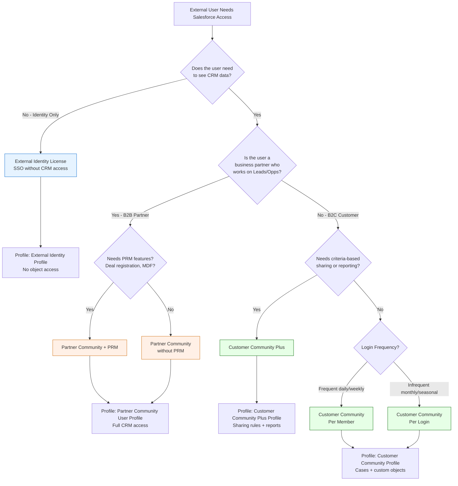
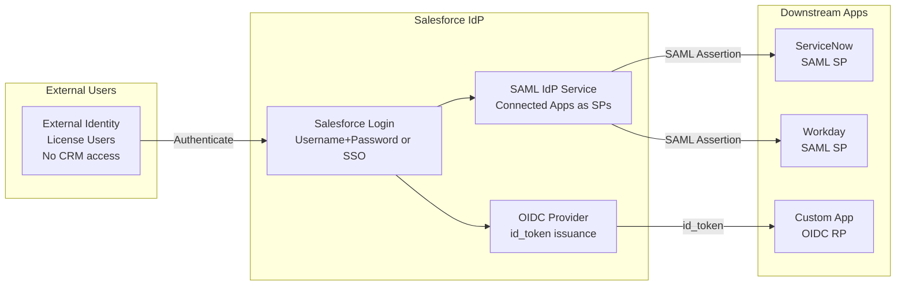

# External Identity Licensing

## Exam Domain
Communities, Portals & External Identity — **17% of exam weight**

Licensing drives architecture decisions. The exam tests when to use External Identity vs. Customer Community vs. Partner Community — not just what the licenses cost, but what they enable technically, what their hard limits are, and how license selection shapes the overall identity architecture. Getting this wrong in an engagement results in either rework or significant unexpected costs.

---

## Foundations

### The External User License Landscape

External users in Salesforce are NOT the same as internal employees. They don't need (and can't have) full Salesforce licenses. Instead, Salesforce offers a spectrum of external-facing licenses:

**From cheapest to most expensive (roughly):**
1. **External Identity** — Identity/SSO only; no community or CRM data
2. **Customer Community Login** (per login) — pay-per-login model
3. **Customer Community** (per member) — B2C portal with limited CRM data
4. **Customer Community Plus Login** — per-login with sharing rules
5. **Customer Community Plus** — Advanced B2C with sharing rules and reporting
6. **Partner Community** — Full B2B portal with CRM objects

The architect's job: match the business requirements to the minimum-cost license that delivers the needed capabilities.

---

## Core Concepts

### External Identity License — Deep Dive

**What it is:**
The External Identity license is the most basic external user license. It provides:
- Authentication only (username/password or SSO)
- Basic profile management
- NO access to standard or custom Salesforce CRM objects
- NO Experience Cloud community features (feeds, reputation, etc.)

**Primary use cases:**
- Users who need single sign-on into multiple systems via Salesforce as the IdP
- Users who need a Salesforce account but no Salesforce data access
- Identity-as-a-service: Salesforce manages the identity; other apps get the access
- Portal users who ONLY use Authentication via Salesforce for downstream app access

**What External Identity users CAN do:**
- Log in to Salesforce
- Use Salesforce as an OIDC/SAML IdP to authenticate to third-party apps
- Update their own password and profile (email, phone, locale)
- Use Salesforce Authenticator or TOTP for MFA

**What External Identity users CANNOT do:**
- Access Salesforce Records (Accounts, Contacts, Cases, Opportunities, etc.)
- See Experience Cloud community pages (feeds, groups, Chatter)
- Use most Community Builder pages that display Salesforce data
- Report on Salesforce data

**Identity-Only vs. Full Community Feature Comparison:**

| Feature | External Identity | Customer Community | Customer Community Plus | Partner Community |
|---|---|---|---|---|
| SSO via Salesforce IdP | ✓ | ✓ | ✓ | ✓ |
| MFA | ✓ | ✓ | ✓ | ✓ |
| Custom object read/write | ✗ | ✓ (limited) | ✓ | ✓ |
| Standard CRM objects | ✗ | Limited (Cases only usually) | Limited | Yes (Leads, Opps, etc.) |
| Chatter / Community feeds | ✗ | ✓ | ✓ | ✓ |
| Reporting | ✗ | ✗ | ✓ | ✓ |
| Criteria-based sharing rules | ✗ | ✗ | ✓ | ✓ |
| Sharing Sets | ✗ | ✓ | ✓ | ✓ |
| Workflows / approvals | ✗ | ✗ | Limited | ✓ |
| Lead object access | ✗ | ✗ | ✗ | ✓ |
| Opportunity object access | ✗ | ✗ | ✗ | ✓ |

---

### Customer Community License

**What it is:**
The Customer Community license enables full Experience Cloud community features for B2C users. Customers can:
- Access Community pages and portals
- Create and manage Cases
- Access Knowledge Base articles
- Use Chatter and community feeds
- Access custom objects (with appropriate permissions)
- Self-register and manage their profile

**Per-Member vs. Per-Login licensing:**

| Model | Description | Best For |
|---|---|---|
| **Per Member** | Fixed monthly fee per licensed user, regardless of how often they log in | Users who log in frequently (daily) |
| **Per Login** | Fixed fee per login event; no persistent user license | Users who log in infrequently (monthly) |

**License cost break-even:** If a user logs in more than approximately once per month (the break-even varies by Salesforce pricing), Per Member is cheaper than Per Login. For seasonal users (annual account review, occasional support ticket), Per Login is more cost-effective.

**Customer Community Object Access:**
Standard objects accessible with Customer Community license (with appropriate Profile configuration):
- Cases (Create, Read, Edit — standard for support portals)
- Contacts (own contact only — self-service profile management)
- Custom objects (Read, Create, Edit — as configured in Profile)
- Knowledge Articles (Read)
- Chatter / Community Features

**NOT accessible with Customer Community:**
- Accounts (cannot view other Accounts)
- Leads
- Opportunities
- Forecasts

---

### Customer Community Plus License

**What it adds over Customer Community:**
- **Criteria-based sharing rules**: Community Plus users can have sharing rules applied to them (standard and custom)
- **Reporting**: Community Plus users can run reports and view dashboards
- **Group Sharing**: Share records with Community Plus user groups

**When to choose Customer Community Plus over Customer Community:**
- You need to share records with community users based on criteria (not just their Account relationship)
- Community users need reporting/dashboard access
- You have complex multi-tier data sharing requirements

---

### Partner Community License

**What it is:**
The Partner Community license is the premium B2B external user license. It provides:
- Full CRM object access: Leads, Opportunities, Contacts, Accounts, Campaigns, Cases
- Full Experience Cloud features
- Chatter
- Reporting and Dashboards
- Full sharing rules support
- Workflow / approval process participation

**When to use Partner Community:**
- Dealer portals (auto, healthcare equipment)
- Reseller / channel partner portals
- Franchise management portals
- Managed services partner portals
- Any scenario where external users collaborate on CRM deals

**Partner Community + Salesforce PRM:**
Partner Relationship Management (PRM) is a Salesforce product built on top of Partner Community. It adds:
- Deal registration (leads submitted by partners)
- MDF (Market Development Funds) management
- Partner performance dashboards
- Partner scorecards

---

### License Selection Decision Framework

```
Decision Tree:

1. Does the user need to access any Salesforce data (CRM objects, custom objects)?
   → NO: External Identity license (identity-only)
   → YES: Continue

2. Is the user a business partner who needs to work on Leads, Opportunities?
   → YES: Partner Community license
   → NO: Continue

3. Does the user need criteria-based sharing rules or reporting?
   → YES: Customer Community Plus license
   → NO: Customer Community license

4. How often does the user log in?
   → Frequently (daily/weekly): Per Member
   → Infrequently (monthly or less): Per Login
```

---

### External Identity + Salesforce as IdP for Third-Party Apps

The most architecturally distinctive use of External Identity licenses is using **Salesforce as the Identity Provider** for other applications — without those users needing CRM access.

**Architecture:**
```
External Identity user logs in to Salesforce
  → Salesforce authenticates the user
  → User clicks on an app tile (Service Now, Workday, custom app)
  → Salesforce issues a SAML assertion or OIDC token
  → External app trusts Salesforce as IdP
  → User is logged into the external app via SSO
```

This is a pure **Identity Brokering** use case — Salesforce acts as the central identity hub, managing authentication for users who need access to multiple external systems but not Salesforce CRM data.

**Connected Apps as SAML Service Providers:**
When Salesforce is the IdP, external apps are configured as Connected Apps (with "Enable SAML" in Connected App settings). The Connected App defines:
- Entity ID of the external app
- ACS URL of the external app
- Attribute mapping (what Salesforce user fields to include in the SAML assertion)

---

### License Assignment Mechanics

**User License Assignment:**
Every Salesforce user has exactly one User License. The User License determines:
- Which Profiles can be assigned to the user
- Which system capabilities are available
- What base object permissions are possible

**License Limits:**
The Salesforce contract defines the number of each license type purchased. Exceeding the license count:
- Prevents new users from being created
- Salesforce will alert the admin when approaching limits
- Over-usage may trigger contractual compliance review

**Checking License Usage:**
Setup > Company Settings > Company Information > User Licenses section

Shows: total purchased, used, remaining per license type.

**License and Profile Pairing:**
Each Profile is tied to a specific User License type. Customer Community Profiles can only be assigned to users with Customer Community licenses. External Identity Profiles can only be assigned to users with External Identity licenses.

---

### Identity-Only vs. Full Community Features — Architecture Tradeoffs

**Choosing External Identity:**

Pros:
- Lowest cost for identity-only scenarios
- Simple: users just need to authenticate
- No CRM data access = no data leakage risk
- Ideal for SSO hub: one Salesforce org authenticates users across many downstream apps

Cons:
- Users cannot see ANY Salesforce data
- Cannot use Experience Cloud community pages with CRM data components
- If business requirements expand to include CRM access, license upgrade required

**Choosing Customer Community:**

Pros:
- Full Experience Cloud feature set
- Cases, Knowledge Base, custom objects accessible
- Self-service capabilities (submit cases, update profile, track orders via custom objects)

Cons:
- Higher cost than External Identity
- Data governance required: what can external users see?
- Requires Sharing Sets configuration for proper data isolation

**Choosing Partner Community:**

Pros:
- Full CRM collaboration: partners can manage leads and opportunities
- Native PRM capabilities when combined with Salesforce PRM
- Partners are embedded in the Salesforce workflow

Cons:
- Highest cost of all external licenses
- Complexity: partner data isolation is critical (Partner A cannot see Partner B's deals)
- Role hierarchy management: partners are usually in a branch separate from internal users

---

## PTA / SA Relevance

### When This Comes Up in Engagements

**License Sizing and Cost Estimation**
Every Experience Cloud project requires a license sizing conversation. Key questions:
- How many external users? (Per member vs. per login decision)
- What data do they need to access? (Determines license type)
- How often will they log in? (Per member vs. per login cost analysis)
- Will they collaborate on opportunities? (Partner vs. Customer Community)

Present a license tier comparison with cost implications. License costs are a significant project decision driver — the wrong license choice can add millions to a project's TCO.

**Multi-Tier Portal Design**
A customer wants one portal with tiered access: basic users see knowledge articles and case status (Customer Community); power users see deal pipeline and submit leads (Partner Community). Design: separate Experience Cloud sites for each tier, each with the appropriate license. Or a single site with access controlled by Profile and license type.

**External Identity for Internal SSO Consolidation**
A company has multiple SaaS apps (ServiceNow, Workday, SuccessFactors) that need SSO. Instead of configuring each app separately with their corporate AD, use Salesforce with External Identity licenses as the identity broker. Employees who need SSO to these apps but don't need Salesforce CRM get External Identity licenses. Salesforce becomes the central SAML/OIDC IdP.

### Common Architecture Failures

**Failure 1: Customer Community Used for Identity-Only**
Customer buys Customer Community licenses for users who only need SSO. External Identity licenses would have been sufficient and are cheaper. The architect didn't ask the right discovery questions about data access requirements.

**Failure 2: External Identity License + CRM Data Access**
Design calls for External Identity users to access custom objects. The team discovers during development that External Identity users have no object permissions. Rework required: either redesign to remove CRM data access, or upgrade licenses to Customer Community. Caught in UAT, not discovery.

**Failure 3: Partner Community for B2C Users**
A B2C retailer uses Partner Community for all 100,000 customer-facing portal users. Partner Community is designed for B2B partners — it provides CRM access beyond what B2C users need, and costs significantly more than Customer Community. Cost overrun.

**Failure 4: Per-Member for Infrequent Users**
A company has 50,000 seasonal users who log in once a year for annual reporting. They buy Per-Member licenses. Per-Login would have been dramatically cheaper. License model analysis not performed.

### Enterprise Patterns

**Pattern: License Segmentation Architecture**
```
External Identity (SSO-only users): 
  - Employees at subsidiaries who need app SSO but no CRM
  - Contractors needing identity without CRM access
  - Count: 2,000 users

Customer Community (support portal users):
  - End customers who submit cases and check order status
  - Custom objects: Orders, Products, Shipments
  - Count: 50,000 users; Per-Login (they log in ~2x/month)

Customer Community Plus (high-value customers):
  - VIP customers with dedicated dashboards and complex sharing
  - Count: 500 users; Per-Member

Partner Community (resellers):
  - Dealer network that registers leads and manages opportunities
  - Count: 3,000 partner users
  - Salesforce PRM enabled
```

---

## Architecture

### License Selection Flowchart



### Salesforce as Identity Broker — External Identity Use Case



**Limitations & Tradeoffs:**

| Aspect | Detail |
|---|---|
| External Identity has no API access | These users cannot call Salesforce REST/SOAP APIs. If they need to access any Salesforce data, even custom objects, they need at minimum Customer Community. |
| License type changes require profile changes | Upgrading a user from External Identity to Customer Community requires changing both their User License and their Profile (since profiles are license-bound). Plan upgrade paths in advance. |
| Per-Login billing granularity | Each login event counts as a "login" for Per-Login billing. A user who logs out and logs back in counts as two logins. Understand the billing implications for your use case. |
| Partner Community org role hierarchy | Partner Community users must be in a separate role branch from internal users (conventionally under "Partner" top-level role). Account territory and standard role hierarchy don't automatically segregate partner data from internal data — Sharing Sets and Account ownership rules must be configured. |

---

## Key Facts to Memorize

1. **External Identity = SSO and identity only; NO CRM object access; lowest cost**
2. **Customer Community = B2C portal; Cases, custom objects, community features; no Leads/Opps**
3. **Customer Community Plus = Customer Community + criteria-based sharing rules + reporting**
4. **Partner Community = full CRM (Leads, Opps); B2B partner portals; highest external cost**
5. **Per-Member = fixed monthly per user; best for frequent logins**
6. **Per-Login = pay per login event; best for infrequent users**
7. **External Identity users CAN be SAML/OIDC identity consumers (via Connected Apps as SPs)**
8. **External Identity is the Salesforce IdP pattern — Salesforce authenticates users for other apps**
9. **Community Profiles are license-bound — Customer Community profile ≠ External Identity profile**
10. **Sharing Sets apply to Customer Community, Customer Community Plus, Partner Community (NOT External Identity)**
11. **Partner Community users need Access to Lead, Opportunity standard objects (Customer Community cannot)**
12. **License count managed in Setup > Company Information > User Licenses**
13. **Exceeding license count prevents new user creation**
14. **Single portal can serve multiple license types via separate Profiles and Experience Builder permissions**
15. **External Identity + Salesforce as SAML IdP: companies use Salesforce as identity broker for SaaS apps**

---

## Exam Traps

**Trap 1: "External Identity users can access custom objects"**
> External Identity license users have no Salesforce object access — not standard, not custom. They can authenticate and use Salesforce as an IdP for SSO, but cannot read or write any CRM data. For custom object access, Customer Community (minimum) is required.

**Trap 2: "Customer Community users can access Opportunity and Lead objects"**
> Customer Community users cannot access Leads or Opportunities. These standard CRM sales objects require Partner Community license. Customer Community is designed for B2C support scenarios (Cases, Knowledge) and custom objects.

**Trap 3: "Per-Login licensing is always more cost-effective than Per-Member"**
> Per-Login is cost-effective for infrequent users. For users who log in daily or weekly, Per-Member becomes cheaper because each login event is billed. The break-even calculation depends on Salesforce's pricing for your contract — always model both options.

**Trap 4: "Sharing Sets work with External Identity licenses"**
> Sharing Sets are for Experience Cloud community users (Customer Community, Customer Community Plus, Partner Community). External Identity users have no object access, so Sharing Sets have nothing to grant them. The feature is not applicable to External Identity.

**Trap 5: "You can assign any Profile to a Customer Community user"**
> Profiles are bound to User License types. A Profile configured for Customer Community users can only be assigned to users with a Customer Community (or Customer Community Plus) User License. You cannot assign an internal Salesforce profile to a community user, and vice versa.

---

## Practice Questions

**Question 1**

A manufacturing company wants to build a portal for their dealer network. Dealers need to register leads (submit potential customer information), view and update Opportunities they're working on, and submit support cases. Which Experience Cloud license type is most appropriate?

A. External Identity — dealers need SSO to access the portal  
B. Customer Community — dealers need community features and Case access  
C. Customer Community Plus — dealers need sharing rules for complex data isolation  
D. Partner Community — dealers need access to Lead and Opportunity CRM objects  

**Answer: D**

*Explanation:* Leads and Opportunities are CRM sales objects accessible ONLY with the Partner Community license. Customer Community (B) only grants access to Cases, Knowledge, and custom objects — not Leads or Opportunities. External Identity (A) has no CRM object access. Customer Community Plus (C) adds sharing rules and reporting to Customer Community, but still doesn't grant Lead/Opportunity access. The requirement to "register leads and view Opportunities" is the definitive indicator for Partner Community.

---

**Question 2**

A technology company has 100,000 end users who interact with their support portal. Most users log in once a month to check their support ticket status. The company wants to minimize licensing costs. Which licensing model is most appropriate?

A. Per-Member Customer Community — one license per user regardless of login frequency  
B. Per-Login Customer Community — pay per login event, cost-effective for infrequent users  
C. External Identity — lowest cost license for any external portal use  
D. Customer Community Plus Per-Login — provides the most features with per-login pricing  

**Answer: B**

*Explanation:* Users logging in once per month are infrequent users. Per-Login licensing charges per login event, making it very cost-effective when users don't log in frequently. At one login per month per user, 100,000 users × 1 login = 100,000 login events/month. Per-Member would charge for all 100,000 user licenses every month regardless of whether they log in. A (Per-Member) charges more for this infrequent use pattern. C (External Identity) is incorrect because these users need to see support case data — External Identity has no object access. D adds unnecessary cost (Plus pricing) for capabilities (sharing rules, reporting) not mentioned as requirements.

---

**Question 3**

A company wants to use Salesforce to provide SSO for 5,000 employees of an acquired subsidiary. These employees do not need access to the parent company's Salesforce CRM data. They only need to authenticate via Salesforce and access external applications (ServiceNow, Workday) via SAML SSO. Which license type satisfies this requirement at the lowest cost?

A. Salesforce Platform — these employees need Salesforce access  
B. Customer Community — all external users need community features  
C. External Identity — identity and SSO without CRM data access  
D. Partner Community — acquired company employees are essentially partners  

**Answer: C**

*Explanation:* External Identity license is specifically designed for this use case: providing authentication and SSO capabilities without CRM data access. The users only need Salesforce to authenticate them and issue SAML assertions or OIDC tokens for downstream apps (ServiceNow, Workday). Full Salesforce Platform (A) and Community licenses (B, D) are all more expensive and provide capabilities beyond what's needed. External Identity is the lowest-cost, purpose-built solution for identity-only use cases.

---

**Question 4**

An architect is reviewing a Salesforce org configuration and finds that 200 users have External Identity licenses. These users are supposed to submit support cases through a community portal. When they log in, they cannot see the Case submission form. What is the issue?

A. External Identity users need the "Submit Cases" Permission Set assigned  
B. External Identity users cannot access Case records; the license must be upgraded to Customer Community  
C. The Sharing Set for Case access has not been configured  
D. External Identity users need to be added to the Experience Cloud site members list  

**Answer: B**

*Explanation:* External Identity license users have NO access to Salesforce CRM objects, including Cases. The Case submission form won't work because these users literally cannot create or read Case records. The license must be upgraded to at minimum Customer Community, which includes Case access. A (Permission Set) can't grant access to objects that the license doesn't permit. C (Sharing Set) is for sharing existing records, not for enabling object access — and Sharing Sets don't apply to External Identity licenses. D (site membership) is required but doesn't resolve the license limitation.
