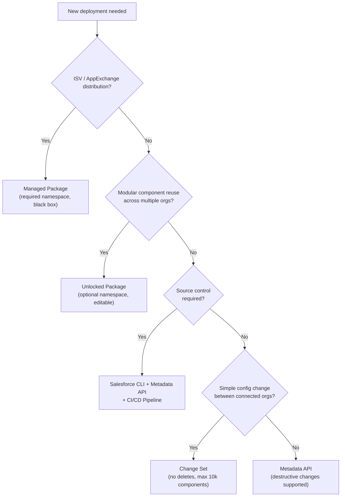
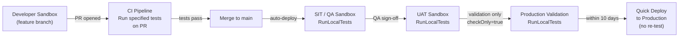
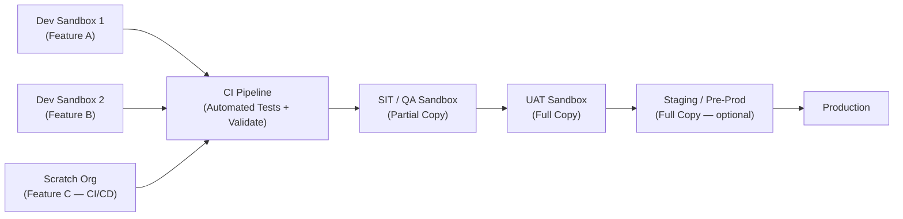
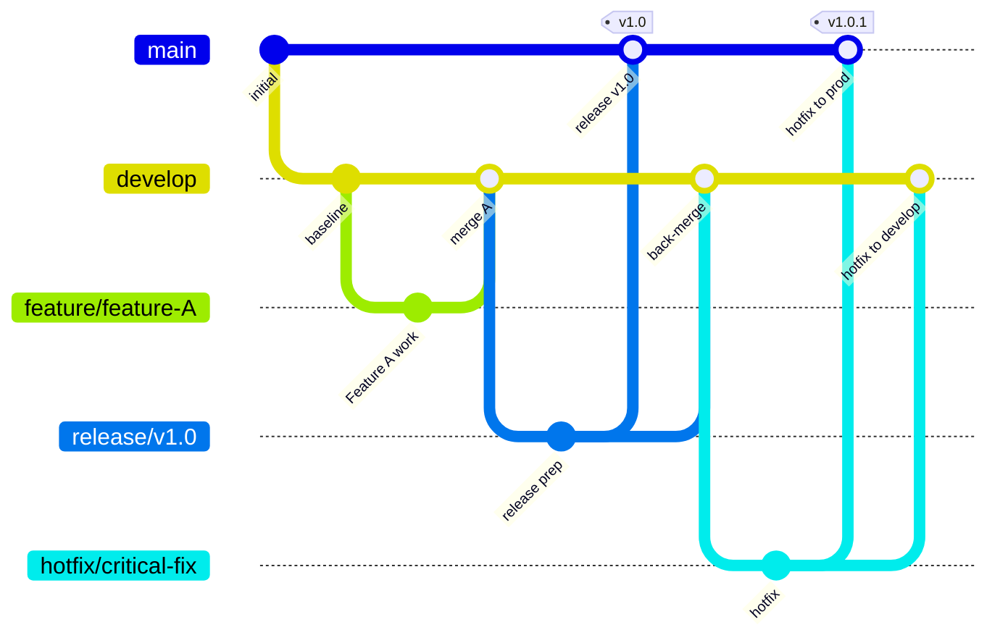
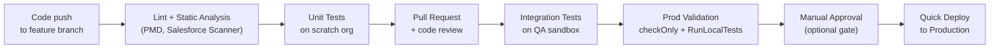
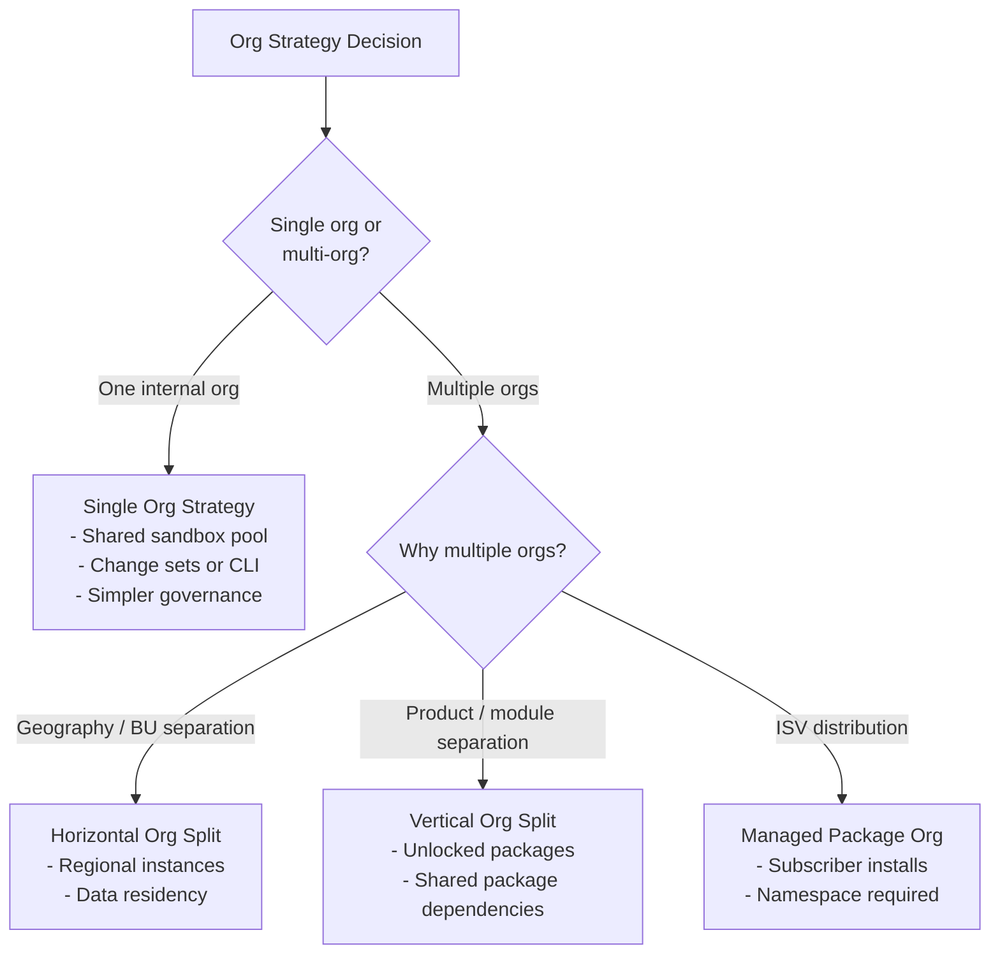

# Development Lifecycle & Deployment Designer (CRT-406) — Exam Cheat Sheet

## Exam Quick Stats

| Field | Detail |
|---|---|
| Exam Code | CRT-406 |
| Questions | 60 |
| Pass Score | 63% (38/60) |
| Time | 120 minutes |
| Format | Multiple choice, multiple select |
| Prerequisite | None (Salesforce Administrator recommended) |

---

## Domain Weights

| Domain | Weight | Key Topics |
|---|---|---|
| 1. Lifecycle Planning | 23% | Org strategy, environment planning, release governance |
| 2. Source Control | 20% | Git workflows, branch strategy, merge conflicts |
| 3. Deployments | 22% | Tools, metadata, change sets, packages |
| 4. Testing | 16% | Apex test execution, code coverage, test strategies |
| 5. Automation | 19% | CI/CD pipelines, DevOps tools, Salesforce Flow |

---

## Sandbox Types Quick Reference

| Type | Data | Refresh Interval | Use Case | Storage |
|---|---|---|---|---|
| Developer | None | 1 day | Individual dev work | 200 MB |
| Developer Pro | None | 1 day | Team dev, data loading | 1 GB |
| Partial Copy | Sample (5-10% of prod) | 5 days | Integration, regression testing | 5 GB |
| Full Copy | Full production copy | 29 days | UAT, performance testing | Full prod size |
| Scratch Org | Config-defined (no data by default) | N/A (create/delete) | Feature dev, CI/CD pipelines | N/A |

### Sandbox Notes
- **Partial sandbox**: percentage is NOT user-selectable — it is automatically chosen (5-10%)
- **Full sandbox refresh**: 29 days minimum, NOT 30
- **Developer/Dev Pro**: can be refreshed once every **1 day** (24 hours)
- **Sandbox templates**: used by Partial and Full sandboxes to define which objects/records to copy
- **Sandbox post-copy scripts**: Apex classes that run automatically after sandbox refresh
- Scratch orgs do NOT count against sandbox license limits

---

## Scratch Org Quick Reference

| Property | Detail |
|---|---|
| Max lifespan | 30 days (default: 7 days unless specified in definition file) |
| Definition file format | JSON (`project-scratch-def.json`) |
| Created via | `sf org create scratch -f <def-file>` |
| Data on creation | None — must use plan files, SObject Tree API, or Apex |
| Licenses | Count against Daily Scratch Org limit (not sandbox allotment) |
| Features | Defined in scratch definition file (e.g., `"features": ["Communities", "Service"]`) |

---

## Deployment Tools Comparison

| Tool | Use Case | Supports Delete? | Source Control Native? | Rollback? |
|---|---|---|---|---|
| Change Sets | Simple config changes, org-to-org | No | No | Manual only |
| Metadata API | Automated, scripted deployments | Yes (destructiveChanges.xml) | Via CI/CD pipeline | Manual |
| Salesforce CLI (sf) | Modern source-driven development | Yes | Yes (native) | Manual |
| Unlocked Packages | Component-based, modular delivery | Yes (version deprecation) | Yes | Version rollback |
| Managed Packages | ISV / AppExchange distribution | No (black box) | N/A | N/A |
| ANT Migration Tool | Legacy deployments (deprecated) | Yes | Via CI/CD | Manual |

### Change Set Limits
- **Max 10,000 components** per change set
- Cannot delete metadata (no destructive changes support)
- Requires connected org relationship (authorized connection between orgs)
- Available in: Developer Edition, Enterprise, Unlimited, Performance, Database.com

---

## Deployment Decision Flowchart



---

## Metadata API: Deployment Modes

| Mode | Description |
|---|---|
| `deploy()` | Deploys metadata to target org |
| `checkOnly=true` | Validates without deploying (required before quick deploy) |
| `testLevel=RunLocalTests` | Runs all tests NOT in managed packages (default for prod) |
| `testLevel=RunAllTestsInOrg` | Runs every test in the org including managed package tests |
| `testLevel=RunSpecifiedTests` | Runs named classes only; must still cover 75% of deployed code |
| `testLevel=NoTestRun` | Skips tests — NOT allowed for production deployments |
| `purgeOnDelete=true` | Permanently deletes records rather than soft-deleting to recycle bin |

---

## Code Coverage Requirements

| Metric | Value |
|---|---|
| Minimum for production deployment | **75%** org-wide |
| Coverage calculation | Org-wide aggregate, NOT per class |
| Triggers | Must have at least 1 line covered (even if org is above 75%) |
| Quick Deploy validity window | **10 days** from successful validation |
| Quick Deploy benefit | Skips re-running tests in production |

### Coverage Rules to Remember
- 75% is **org-wide** — one well-covered class can compensate for a poorly-covered one
- Every **trigger** must have at least 1 test method providing some coverage
- `@isTest(SeeAllData=true)` allows tests to see org data — use sparingly, avoid in new code
- `@TestSetup` methods run once per test class and roll back after each test method
- Test data created in `@TestSetup` is available across all test methods in the class

---

## Test Execution Strategy



---

## Package Development Quick Reference

| Property | Unlocked Package | Managed Package |
|---|---|---|
| Namespace | Optional | Required |
| Source visible to subscriber | Yes | No (protected/black box) |
| Editable in subscriber org | Yes | No |
| Version rollback | Yes (install previous version) | No |
| AppExchange distribution | No | Yes |
| Dependencies declared | Yes (sfdx-project.json) | Yes |
| Subscriber can customize | Yes | Only if developer exposes extension points |
| Org-dependent variant | Yes (tied to specific org ID) | No |
| Delete component from version | No (deprecate only) | No |

### Package Versioning Rules
- Released versions **cannot be deleted** — only deprecated
- Deprecated packages can still be installed until the publisher removes them
- `@Deprecated` annotation marks Apex as deprecated for managed packages
- Beta versions can be installed in non-production orgs only
- Released versions can be installed in production

---

## Environment Strategy Patterns



### Environment Strategy Principles
- **Developer sandboxes** for individual feature work (isolated, frequent refresh)
- **Scratch orgs** for CI/CD pipelines and automated feature development
- **Partial Copy** for integration testing with representative data
- **Full Copy** for UAT, performance testing, data migration rehearsal
- **Full Copy (Staging)** optional pre-production gate for high-risk releases

---

## Git Branch Strategies



### GitFlow vs Trunk-Based

| Aspect | GitFlow | Trunk-Based Development |
|---|---|---|
| Main branches | main, develop | main only |
| Feature branches | Long-lived (days/weeks) | Short-lived (hours/days) |
| Release branches | Yes | No (tags or release flags) |
| Hotfix branches | Yes | Cherry-pick or branch from tag |
| CI/CD fit | Scheduled releases | Continuous delivery |
| Merge conflicts | Higher risk (long-lived branches) | Lower risk (frequent merges) |
| Salesforce fit | Large teams, release trains | DevOps Center, modern CI/CD |

---

## Salesforce DX (SF CLI) Quick Reference

### Project Commands
```bash
sf project generate --name MyProject          # Create new DX project
sf project deploy start --source-dir force-app # Deploy source to org
sf project retrieve start --source-dir force-app # Pull from org to local
sf project deploy validate                     # Validate without deploying
```

### Org Commands
```bash
sf org create scratch -f project-scratch-def.json -a MyScratch  # Create scratch org
sf org delete scratch -o MyScratch            # Delete scratch org
sf org list                                   # List all orgs
sf org login web -a MyDevSandbox              # Authorize an org
```

### Package Commands
```bash
sf package create --name "My Package" --type Unlocked --path force-app
sf package version create -p "My Package" --installation-key test1234
sf package version promote -p 04tXXXXXXXXXXXXX  # Promote beta to released
sf package install -p 04tXXXXXXXXXXXXX -o TargetOrg
```

### Key Files
| File | Purpose |
|---|---|
| `sfdx-project.json` | Project config: package directories, namespace, package dependencies |
| `project-scratch-def.json` | Scratch org definition: edition, features, settings |
| `.forceignore` | Exclude metadata from push/pull (like .gitignore) |
| `package.xml` (manifest) | Declare metadata for retrieve/deploy in metadata format |

---

## Source Format vs Metadata Format

| Aspect | Source Format (DX) | Metadata Format (MDAPI) |
|---|---|---|
| Storage | Decomposed — one file per component | Bundled — one large XML per type |
| Example | `CustomObject__c.object-meta.xml` + field files | `CustomObject__c.object` monolith |
| Git diffs | Clean, minimal, reviewable | Noisy, large XML diffs |
| CLI command | `sf project deploy/retrieve` | `sf mdapi deploy/retrieve` |
| Change sets | Use metadata format internally | Native format |

---

## .forceignore Common Patterns

```
# Ignore profiles (use permission sets instead)
**/profiles/**

# Ignore scratch org config
**/config/**

# Ignore destructive change manifests
**/destructiveChanges.xml

# Ignore standard value sets (managed by Salesforce)
**/standardValueSets/**
```

---

## DevOps Center Overview

| Feature | Detail |
|---|---|
| Based on | GitHub (required) |
| Deployment model | Work items → pipelines → stages |
| Stage types | Development (scratch/sandbox), Bundling, Production |
| Conflict detection | Automatic, visual merge tool |
| User access | Declarative admin-friendly UI |
| CI/CD integration | Hooks into GitHub Actions |
| Best for | Teams moving from change sets to source-driven |

---

## CI/CD Pipeline Stages



---

## Destructive Changes

To delete metadata via CLI/Metadata API:

```xml
<!-- destructiveChanges.xml -->
<Package xmlns="http://soap.sforce.com/2006/04/metadata">
  <types>
    <members>MyClass</members>
    <name>ApexClass</name>
  </types>
  <version>59.0</version>
</Package>
```

- Include both `package.xml` (empty) AND `destructiveChanges.xml` in the deploy ZIP
- `destructiveChangesPre.xml` — runs before other metadata deploys
- `destructiveChangesPost.xml` — runs after other metadata deploys
- Change sets **cannot** perform destructive changes — use CLI or Metadata API

---

## Release Management Approaches

| Approach | Description | Best For |
|---|---|---|
| Big Bang | All changes deployed at once | Small orgs, infrequent releases |
| Phased Rollout | Features deployed to subset of users | Large user bases, risk mitigation |
| Feature Flags | Code deployed, activated via config | Continuous delivery, A/B testing |
| Blue/Green | Two identical environments, switch traffic | Zero-downtime, instant rollback |
| Canary | Gradual traffic shift to new version | Risk reduction, performance validation |

---

## Apex Governor Limits Relevant to Deployment

| Limit | Value |
|---|---|
| Max Apex classes per org | No hard limit (storage-based) |
| Max test class execution time | 10 minutes per Apex transaction |
| SOQL queries per transaction | 100 synchronous |
| DML statements per transaction | 150 |
| Heap size | 6 MB synchronous, 12 MB async |
| CPU time | 10,000 ms synchronous |

---

## Permission Sets vs Profiles in Source Control

| Aspect | Profiles | Permission Sets |
|---|---|---|
| Metadata complexity | Very large XML (all settings) | Focused, smaller XML |
| Merge conflicts | High — any org change modifies profile XML | Low — only relevant settings |
| Recommended practice | Avoid in source control | Yes — use permission sets |
| Deployment risk | High | Low |
| Salesforce recommendation | Migrate to permission set groups | Preferred going forward |

---

## Org Strategy Patterns



---

## Data Migration Strategy

| Tool | Use Case | Notes |
|---|---|---|
| Data Loader | Bulk insert/update/delete/export | Desktop app, CSV-based, 50k batch size |
| Dataloader.io | Cloud-based, scheduled jobs | Third-party, drag-and-drop |
| Data Import Wizard | Standard objects, up to 50k records | In-app, simpler UI |
| Salesforce CLI (sfdx tree) | Dev/test data seeding via plan files | JSON-based, for scratch orgs |
| ETL tools (MuleSoft, Informatica) | Complex transformations, enterprise integration | Full ELT/ETL pipeline |

### Data Migration in Sandbox Refresh
- **Partial Copy**: uses sandbox template — selects objects/records to copy
- **Full Copy**: mirrors entire production (data, files, chatter, attachments)
- **Sandbox seeding**: for Developer/Scratch orgs — use Data Loader or plan files post-refresh

---

## Top 20 Exam Traps

| # | Trap | Correct Answer |
|---|---|---|
| 1 | Change sets can delete metadata | **FALSE** — use Metadata API/CLI for destructive changes |
| 2 | 75% coverage is per class | **FALSE** — it is org-wide aggregate |
| 3 | Quick deploy window is 7 days | **FALSE** — it is **10 days** from successful validation |
| 4 | Scratch org default lifespan is 30 days | **FALSE** — default is **7 days** (max is 30) |
| 5 | Partial sandbox is user-selectable percentage | **FALSE** — system chooses 5-10% automatically |
| 6 | Full sandbox refresh minimum is 30 days | **FALSE** — it is **29 days** |
| 7 | RunLocalTests includes managed package tests | **FALSE** — it excludes managed package tests |
| 8 | Unlocked packages cannot be edited in subscriber org | **FALSE** — they CAN be edited |
| 9 | Package versions can be deleted after release | **FALSE** — only deprecated, not deleted |
| 10 | Source format = one big XML per object | **FALSE** — decomposed (one file per field/component) |
| 11 | Change set max components is 1,000 | **FALSE** — max is **10,000 components** |
| 12 | Validation deploys the code to production | **FALSE** — validation only; use quick deploy separately |
| 13 | Profiles are safe to track in source control | **FALSE** — use permission sets to reduce conflict risk |
| 14 | Org-dependent packages work in any org | **FALSE** — tied to specific org ID |
| 15 | Scratch org data persists across refresh | **FALSE** — no data by default; must seed explicitly |
| 16 | Managed packages require a namespace | **TRUE** — namespace is mandatory for managed packages |
| 17 | Unlocked packages require a namespace | **FALSE** — namespace is optional |
| 18 | `@TestSetup` data persists between test methods | **FALSE** — rolls back after each test method, re-runs for next |
| 19 | NoTestRun is valid for production deployment | **FALSE** — at least RunLocalTests required for production |
| 20 | DevOps Center requires Jira for work items | **FALSE** — DevOps Center uses GitHub and its own work item tracking |

---

## Key Formulas and Numbers Summary

| Topic | Value |
|---|---|
| Pass score | 63% (38 of 60) |
| Code coverage minimum | 75% org-wide |
| Quick deploy validity | 10 days |
| Scratch org default lifespan | 7 days |
| Scratch org maximum lifespan | 30 days |
| Developer sandbox refresh | 1 day |
| Developer Pro sandbox refresh | 1 day |
| Partial Copy sandbox refresh | 5 days |
| Full Copy sandbox refresh | 29 days |
| Partial Copy data volume | 5-10% of production |
| Developer sandbox storage | 200 MB |
| Developer Pro sandbox storage | 1 GB |
| Partial Copy sandbox storage | 5 GB |
| Change set component limit | 10,000 |

---

## Domain 1: Lifecycle Planning — Key Concepts

- **Release train**: scheduled releases on a fixed cadence (e.g., quarterly); requires GitFlow or similar branch strategy
- **Continuous delivery**: code is always release-ready; requires trunk-based development and strong automated testing
- **Org strategy review**: consider data residency, regulatory requirements, user volume, and integration complexity
- **Governance**: define who approves deployments to production; change advisory board (CAB) for high-risk changes
- **Environment strategy**: map environments to SDLC stages (Dev → QA → UAT → Staging → Prod)

## Domain 2: Source Control — Key Concepts

- **Single source of truth**: source control is authoritative, not the org
- **Retrieve vs push**: always retrieve before making changes to avoid overwriting others' work
- **Metadata conflicts**: occur when same component modified in multiple orgs or branches simultaneously
- **Audit trail**: source control provides history of every change (who, what, when)
- **Branching convention**: branch names should reflect purpose (feature/, bugfix/, hotfix/, release/)

## Domain 3: Deployments — Key Concepts

- **Metadata API WSDL**: defines all deployable metadata types
- **package.xml**: manifest declaring which metadata to retrieve or deploy
- **Connected app**: required for CLI authentication to non-scratch orgs
- **Named credentials**: externalize endpoint + auth from code — deployable and environment-safe
- **Custom metadata types**: deployable configuration data (unlike custom settings, which are org-specific)

## Domain 4: Testing — Key Concepts

- **Unit tests**: test single class/method in isolation with mock data
- **Integration tests**: test interaction between components or external systems
- **User acceptance testing (UAT)**: business users validate against requirements
- **Regression testing**: ensure existing functionality not broken by new changes
- **Test isolation**: never rely on existing org data in tests; always create test data programmatically

## Domain 5: Automation — Key Concepts

- **CI trigger**: automated pipeline triggered on PR or push to main
- **Static analysis**: PMD, Salesforce Code Analyzer — catch issues before deployment
- **Pipeline gates**: automated checks that must pass before proceeding to next stage
- **Approval steps**: human sign-off gates in deployment pipeline
- **Rollback strategy**: for packages — install previous version; for org metadata — redeploy previous state from source control
