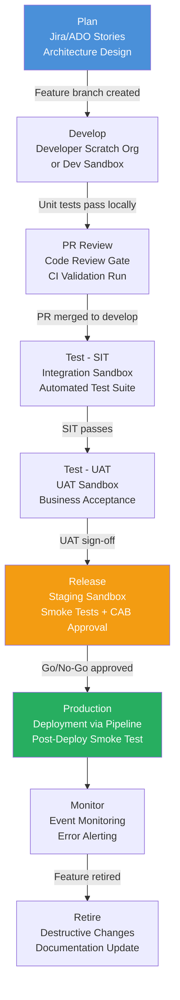
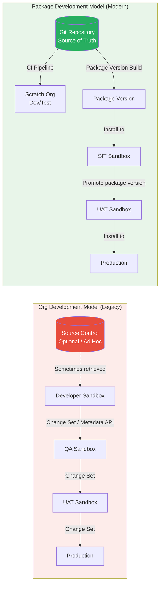

# Application Lifecycle Management Fundamentals

## Overview / Context

Application Lifecycle Management (ALM) is the overarching framework that governs how software is built, tested, deployed, and maintained from inception through retirement. In the Salesforce context, ALM takes on particular importance because Salesforce is simultaneously a configuration platform, a declarative development environment, and a programmatic development platform — each with different artifacts, different risks, and different deployment mechanisms. A poorly designed ALM process in Salesforce regularly produces production outages, lost work, conflicting changes, and deployment failures that could have been prevented at the architecture stage.

At the architect level, ALM is not a development team concern — it is a governance concern. The decisions made about ALM at the start of a program determine whether 50 developers can work in parallel without stepping on each other, whether a hotfix can be deployed in 30 minutes without running a full regression suite, and whether a rollback is possible at all. Every architectural decision downstream — sandbox strategy, package model, CI/CD tooling, branching strategy — flows from the ALM model established at the beginning.

On the exam, ALM Fundamentals is 23% of the material and the conceptual foundation for the remaining 77%. Exam questions in this domain test whether you understand the *relationship* between ALM phases and the tools/processes used to support each phase. The "org development model vs package development model" distinction is the single most important conceptual divide in the entire exam — every other decision branches from it.

## Foundations

Application Lifecycle Management is the process of managing a software application from its initial planning through its eventual retirement. Think of it as the operational model for building and maintaining software: how do you take an idea from a business stakeholder, turn it into working code, verify that it does what it's supposed to do, deliver it to users, keep it running, and eventually replace or retire it?

In traditional software development (Java, .NET, etc.), ALM involves source code files, compiled binaries, and deployment packages. Salesforce is different: instead of compiled code, the primary deliverables are *metadata* — XML files describing page layouts, flows, Apex classes, custom objects, permission sets, and hundreds of other configuration-driven artifacts. Some of these artifacts are created by clicking through a UI (declarative configuration); others are written as code (Apex, LWC). The ALM process must handle both equally well.

The implication is significant: in a traditional application, only developers touch the source. In Salesforce, an administrator clicking "Save" on a page layout is making a production change that needs to be managed like code. ALM for Salesforce must account for this dual-track reality — code changes by developers AND configuration changes by admins — or it breaks down under the weight of untracked, conflicting, undocumented modifications.

For architects, the key insight is that ALM is not about tools — it is about *discipline enforced by process and tooling*. You can use the most sophisticated CI/CD pipeline in the world, but if your process allows direct production edits by admins, your ALM is broken. The tools are only as strong as the governance model they enforce.

---

## Core Concepts / Framework

### The Six ALM Phases

Every Salesforce ALM framework cycles through six phases:

```
Plan → Develop → Test → Release → Monitor → Retire
```

| Phase | What Happens | Salesforce Specifics |
|---|---|---|
| **Plan** | Requirements, architecture decisions, work item creation | Define org vs package model, sandbox strategy, branching model |
| **Develop** | Coding, configuration, unit testing | Feature branches, scratch orgs, local unit tests |
| **Test** | Integration testing, UAT, regression | SIT sandbox, UAT sandbox, automated regression suite |
| **Release** | Deploy to production, smoke test, monitor | CI/CD pipeline, deployment validation, post-deploy smoke tests |
| **Monitor** | Track runtime behavior, errors, performance | Salesforce Event Monitoring, Debug Logs, Health Cloud dashboards |
| **Retire** | Deprecate features, remove unused components | Destructive changes, package deprecation, org cleanup |

**Exam trap:** Questions often test whether you can identify *which ALM phase* a given activity belongs to. "A developer creates a scratch org and writes unit tests" = Develop phase. "A business analyst validates workflows against acceptance criteria" = Test phase. "A release manager creates a deployment plan" = Plan phase (not Release).

### Org Development Model vs Package Development Model

This is the most important distinction in the entire exam. Understand it deeply.

#### Org Development Model

The traditional Salesforce approach. A set of persistent orgs (Developer sandboxes, Full sandboxes) serves as the development environment. Changes are made in a sandbox and promoted to production through change sets or Metadata API deployments.

**Characteristics:**
- The org is the source of truth
- Changes are promoted org-to-org
- Difficult to version individual features
- Harder to scale across multiple teams
- Suitable for smaller teams with low change velocity
- Dominated by change sets in legacy implementations

**Problems at scale:**
- Multiple developers share a sandbox → conflicts
- No clear rollback mechanism
- Deployment "merging" happens at the org level, not in code
- Metadata retrieved from org may not match what's in source control
- Change history is org metadata, not Git history

#### Package Development Model

The modern Salesforce DX approach. Source code is the source of truth. Changes are organized into packages (typically unlocked packages) and deployed via version-controlled pipelines.

**Characteristics:**
- Git repository is the source of truth
- Developers work in isolated scratch orgs
- Changes are version-controlled, testable, reusable units
- Natural support for CI/CD
- Requires Salesforce DX tooling
- Preferred for multi-team, high-velocity environments

**The key mental model:**

```
Org Dev Model:    Org → Retrieve → Source Control → Deploy → Org
                  (Org drives source control)

Package Dev Model: Source Control → Build → Package → Install → Org
                   (Source control drives the org)
```

### How Salesforce ALM Differs from Traditional ALM

| Aspect | Traditional ALM | Salesforce ALM |
|---|---|---|
| Artifact type | Compiled binaries, JARs, DLLs | Metadata XML files |
| "Build" process | Compile source code | Assemble/validate metadata package |
| Deployment unit | Deployment package | Metadata package, change set, or installable package |
| Rollback mechanism | Redeploy previous version | Destructive changes or revert + redeploy |
| Configuration vs code | Separate concerns | Merged (declarative config IS code) |
| Environment parity | Containers / VMs | Sandboxes / Scratch orgs (not 100% parity with production) |
| Testing | Unit + integration tests | Unit + integration + org-specific system tests |
| Dependencies | Library/module dependencies | Org-level dependencies (standard objects, permission sets) |

The critical implication for architects: **you cannot "containerize" a Salesforce environment**. Each environment has its own history, settings, and activated features. This is why environment strategy (sandboxes + scratch orgs) is a first-class architectural concern in Salesforce ALM, not an afterthought.

### Environment Strategy Aligned to ALM Phases

| ALM Phase | Environment(s) | Purpose |
|---|---|---|
| Plan | None / existing diagrams | No org needed |
| Develop | Scratch orgs or Developer sandboxes | Feature development in isolation |
| Test (SIT) | Integration sandbox (Developer Pro or Partial) | Team integration, automated tests |
| Test (UAT) | Full sandbox or Partial Copy with masked data | Business acceptance testing |
| Release | Staging Full sandbox | Final smoke test before prod |
| Production | Production org | Live business operations |

### Governance: Change Advisory Boards, Release Trains, Hotfix Protocols

**Change Advisory Board (CAB):**
The CAB is the governance body that approves changes before they are released to production. In a Salesforce context, the CAB typically reviews:
- Impact assessment for major feature releases
- Environment access requests
- Emergency change requests (hotfixes)
- Changes that touch security, sharing rules, or integrations

The CAB does NOT review every code commit — that would create an unworkable bottleneck. The CAB reviews *release-level* changes, while developer-level changes are governed by pull request reviews and automated CI gates.

**Release Train Model:**
A release train is a scheduled, repeating release cycle. Common Salesforce implementations use:
- Bi-weekly sprints with one release per sprint
- Monthly "release trains" where multiple features board the train together
- A code freeze window before each release (typically 2-3 days for testing)

**Hotfix Protocol:**
When production breaks, normal release processes are too slow. The hotfix protocol bypasses the regular release train:
1. Create a hotfix branch from the main/production branch (NOT from develop)
2. Make minimal, targeted fix
3. Deploy to staging for smoke test
4. Deploy to production with CAB emergency approval
5. Merge hotfix branch back to main AND develop (critical — don't lose the fix)
6. Document the incident and root cause

**Exam trap:** Hotfix branches must be merged back to both main and develop (or whatever your long-running branches are). Missing this merge is a common failure mode that the exam tests.

---

## PTA / SA Relevance

### Parallels to Daily Advisory Work

ALM Fundamentals maps directly to some of the most common architecture conversations PTAs have:

**The "why does our deployment break production" conversation:** Almost always a missing or weak ALM process. No gates, no test automation, no environment parity. The ALM framework provides the vocabulary and structure to diagnose and fix this.

**The "we're doing a Salesforce COE" conversation:** Every Center of Excellence setup requires defining the ALM model: who owns the release process, what the approval workflow looks like, how environment access is managed. This is the CAB, release train, and governance content from this lecture.

**The "can Salesforce work like our enterprise DevOps?" conversation:** Customers migrating from SAP/Oracle/Workday have mature DevOps practices and want to apply them to Salesforce. The comparison table above (Traditional vs Salesforce ALM) is exactly the content that sets expectations correctly.

### How to Use This in Customer Engagements

**Workshop opener:** Start a DevOps advisory engagement by asking customers: "In your current process, is the Salesforce org the source of truth, or is Git the source of truth?" The answer tells you immediately whether they're operating an org development model or a package development model, and what their maturity level is.

**Decision framework for new programs:** When a customer is starting a new Salesforce implementation, ask:
1. How many developers will work simultaneously? (< 5 = org model may be fine; > 5 = push toward package model)
2. Will there be multiple releases per week? (Yes = CI/CD required; No = change sets might survive)
3. Is there an AppExchange or ISV component? (Yes = managed packages required)
4. Are there multiple independent functional areas? (Yes = unlocked packages are the answer)

**Red flags to call out in delivery reviews:**
- "We deploy directly to production for small changes" — bypasses all gates
- "We don't need source control, the org is our backup" — org dev model anti-pattern
- "We share a single sandbox for all 15 developers" — environment strategy failure
- "We do full regression manually before each release" — signals no test automation

---

## Architecture / Scenario

### ALM Phase Flow with Environment Mapping



### Org Development Model vs Package Development Model



---

## Key Principles to Apply

- **Source control must be the system of record.** If it isn't in Git, it doesn't exist in an architecturally sound ALM process. The org is the runtime, not the record.
- **Every ALM phase needs a gate.** Moving from Develop to Test, Test to Release, Release to Production — each transition needs a formal gate with defined criteria. Implicit promotion (deploying because it "seems ready") is an ALM anti-pattern.
- **Environment purpose must be explicit and enforced.** Mixing UAT and SIT in the same sandbox, or allowing developers to do ad hoc testing in staging, breaks the ALM chain.
- **Governance scales with risk, not with org size.** A two-person team building a simple app doesn't need a CAB. A 50-person team touching payments and integrations does. Architect the governance to the risk profile.
- **The hotfix protocol is a first-class ALM artifact.** Teams that haven't defined their hotfix protocol before they need it will execute it poorly under pressure. Define it during the Plan phase.
- **ALM for Salesforce must handle both declarative and programmatic changes.** Any ALM design that only manages code files (Apex, LWC) but ignores flows, page layouts, and permission sets will fail in practice.
- **The org development model is not wrong — it's limited.** Small teams with low change velocity can operate effectively in the org model. The mistake is applying org model practices to high-velocity, multi-team environments.
- **CAB approval is not a technical gate; it's a business governance gate.** Don't conflate automated test results (technical gate) with CAB approval (business governance gate). Both are needed; they serve different purposes.

---

## Common Mistakes (Exam Candidates + Customers)

1. **Treating change sets as an ALM strategy.** Change sets are a deployment mechanism, not an ALM strategy. They have no version control, no automated test gates, and no rollback. Using change sets exclusively is an ALM risk, not an ALM strategy.

2. **Confusing the Develop phase with the Test phase.** Unit testing happens in the Develop phase (written by the developer alongside the code). Integration and UAT testing happen in the Test phase. Exam questions will test this boundary.

3. **Assuming scratch orgs replace all sandboxes.** Scratch orgs replace *developer* sandboxes for feature development. They do not replace SIT or UAT sandboxes, which need persistent data and business-accessible URLs.

4. **Not merging hotfix branches back to develop.** A hotfix deployed to production but not merged back to the develop branch will be overwritten by the next release. This is a critical process failure.

5. **Skipping the Monitor phase.** Many ALM designs focus on Plan-Develop-Test-Release and ignore Monitor and Retire. Production monitoring is part of ALM, and failing to design it means problems go undetected.

6. **Applying org development model practices to package development model projects.** Retrieving metadata from a sandbox into a Git repo that's supposed to be a package project is an org model pattern that corrupts the package model.

7. **Designing the CAB as a bottleneck, not a gate.** A poorly designed CAB that must approve every change (including minor bug fixes) creates a governance bottleneck that developers route around. CABs should govern releases, not individual commits.

8. **Not defining environment ownership.** Without explicit ownership (who has admin access, who can deploy to what, who approves sandbox refreshes), environments drift and the ALM process loses integrity.

---

## Practice Questions / Scenario Exercises

**Question 1**
A company has 15 developers working on a Salesforce CPQ implementation. Currently, they all share a single Full sandbox and deploy to production via change sets. They report frequent conflicts, broken deployments, and a 3-day manual regression cycle before each release. As the architect, what is the single most impactful change you would recommend first?

A. Purchase additional Full sandboxes for each developer  
B. Migrate to a Salesforce DX source-driven model with isolated scratch orgs and a CI/CD pipeline  
C. Implement a code freeze policy where only one developer commits changes per day  
D. Add a second change set promotion lane from a QA sandbox to production

**Answer: B**
The root cause is the org development model applied to a high-velocity, multi-team environment. Individual scratch orgs eliminate conflicts. Source control catches merge conflicts early. CI/CD automates the regression cycle. Option A is expensive and doesn't solve the process problem. C is a band-aid that kills velocity. D adds a step to a broken process.

---

**Question 2**
During a production incident, an emergency fix is needed for a broken Apex trigger. The architect needs to deploy a hotfix immediately. What is the correct sequence of steps?

A. Fix the bug in production directly, then back-port to develop branch  
B. Create a hotfix branch from the release/main branch, fix, deploy to staging, deploy to production, merge to main AND develop  
C. Fix the bug in the SIT sandbox, promote through the normal release train  
D. Create a hotfix branch from develop, fix, deploy directly to production, merge to main

**Answer: B**
Hotfix branches must branch from main (production state) to avoid including unreleased features from develop. After deployment to production, the fix must be merged to both main AND develop — otherwise the next regular release will overwrite the hotfix. Option A (fix in production directly) bypasses all governance. Option C is too slow for an emergency. Option D branches from develop, which may include unreleased work.

---

**Question 3**
A large enterprise customer asks: "We've been using Salesforce for 8 years with change sets. We're adding 20 developers for a new Sales Cloud plus Service Cloud plus custom platform initiative. Should we keep using change sets?" How should you respond?

A. Change sets are fully supported and scale well; continue using them  
B. Change sets should be augmented with a managed package strategy for scale  
C. The team should migrate to a Salesforce DX + Git + CI/CD package development model before the new initiative starts  
D. Use change sets for configuration and a custom deploy script for Apex code only

**Answer: C**
Twenty developers on a multi-product initiative is exactly the scenario where change sets fail catastrophically: no version control integration, no automated test gates, no parallel work support, no rollback. The architect should recommend migrating to the package development model before the new initiative grows to a size where migration becomes painful. Options A and D perpetuate a model that won't scale. Option B (managed packages) is for ISV/AppExchange distribution, not internal development at scale.

---

**Question 4**
A customer's CAB currently reviews and approves every individual code commit before it can be merged into the develop branch. The development team reports that CAB approval takes 3-5 days and is killing sprint velocity. As an architect, how would you redesign this governance model?

A. Eliminate the CAB entirely since developers should be trusted to self-govern  
B. Move CAB approval to the release level (feature-set or sprint release), with automated gates at the commit/PR level  
C. Add more CAB members to process approvals faster  
D. Give developers direct production access to bypass the CAB for low-risk changes

**Answer: B**
The architectural fix is to right-scope the CAB to the appropriate ALM phase. CABs govern releases (business risk gate), not commits (engineering quality gate). Commits and PRs should be governed by automated CI checks, required code reviews, and test gates — not manual human approval. Adding CAB members (C) doesn't fix the structural problem. Eliminating the CAB (A) removes necessary governance. Production access (D) creates risk without governance.
