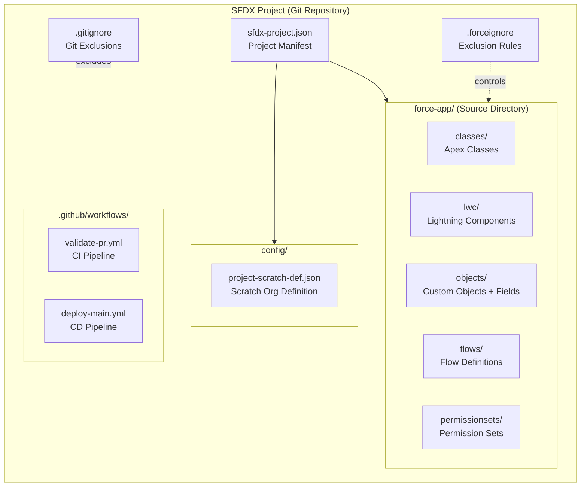
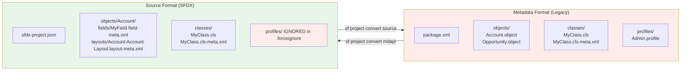

# Salesforce DX Overview

## Overview / Context

Salesforce DX (Developer Experience) is Salesforce's modern developer toolset that shifts Salesforce development from an org-centric model to a source-driven model. Introduced in 2017 and now the foundation of Salesforce's recommended development approach, SFDX represents a paradigm shift: rather than building in an org and exporting metadata, you build in source files and push to orgs. This inversion — source first, org second — is what makes CI/CD pipelines, automated testing, version control, and team scalability possible in Salesforce.

For architects, Salesforce DX is not just a set of tools — it is a development philosophy. The tools (Salesforce CLI, VS Code extension, scratch orgs) are the *implementation* of the philosophy. Understanding the philosophy first — and being able to articulate it to customers — is more valuable than memorizing command syntax. When a customer asks "should we use Salesforce DX?", the real question is "should we treat our Salesforce metadata as code that lives in version control?" The answer is almost always yes.

On the exam, Salesforce DX concepts appear throughout all five domains. Direct questions cover sfdx-project.json structure, source vs metadata format, .forceignore, and CLI command patterns. Indirect questions test whether you understand the *implications* of Salesforce DX for environment strategy (scratch orgs), deployment (sf project deploy), and CI/CD (JWT authentication, pipeline design).

## Foundations

Salesforce DX is best understood by contrast with what came before it. In the pre-DX world, developers worked directly in a sandbox org, made changes through the Setup UI or code editors connected to the org, and then "retrieved" those changes as XML metadata files. The metadata files were an output of the org, not an input. Source control, if used at all, was an afterthought — developers might commit what they retrieved, but the org was still the real system of record.

Salesforce DX reverses this relationship. You write code and configuration in local files first. You push those files to a temporary org (a scratch org) to test them. When you're done, you throw away the org and keep only the source files. The source files, managed in Git, become the system of record. If you need a new environment, you spin up a new scratch org and push the source to it — the environment is recreated from the source, not the other way around.

This approach borrows from how modern application development works. A Node.js developer doesn't develop inside the production server and then "export" their code — they write code locally, push to Git, and deploy via a pipeline. Salesforce DX brings this same discipline to Salesforce development. The scratch org is like a Docker container: ephemeral, reproducible, and defined by configuration.

The practical result is that any developer can reproduce any environment from scratch (literally — a scratch org), the entire history of changes is in Git, automated pipelines can validate and deploy changes without human intervention, and teams of 50+ developers can work in parallel without stepping on each other.

---

## Core Concepts / Framework

### What Salesforce DX Is

Salesforce DX is the combination of:
1. **Source format** — a file structure that maps Salesforce metadata to developer-friendly files
2. **Scratch orgs** — ephemeral, configurable Salesforce environments for development and testing
3. **Salesforce CLI (sf)** — command-line tools for managing orgs, metadata, and packages
4. **VS Code + Salesforce Extension Pack** — IDE integration for development and debugging
5. **sfdx-project.json** — the project manifest that defines structure and behavior

### sfdx-project.json — Structure and Key Fields

The `sfdx-project.json` file is the heart of any SFDX project. It defines how the project is structured and how the CLI interacts with it.

```json
{
  "packageDirectories": [
    {
      "path": "force-app",
      "default": true,
      "package": "My Unlocked Package",
      "versionName": "Summer 2024",
      "versionNumber": "2.3.0.NEXT",
      "definitionFile": "config/project-scratch-def.json"
    }
  ],
  "namespace": "",
  "sourceApiVersion": "62.0",
  "sfdcLoginUrl": "https://login.salesforce.com",
  "packageAliases": {
    "My Unlocked Package": "0Ho...",
    "My Unlocked Package@2.3.0-1": "04t..."
  }
}
```

**Key fields explained:**

| Field | Purpose | Exam Relevance |
|---|---|---|
| `packageDirectories` | Array of source directories, each can be a package | Defines project structure; `default: true` sets the default deploy dir |
| `path` | Relative path to source directory | Typically `force-app`; custom for modular projects |
| `package` | Package name (for unlocked/managed) | Required for package version commands |
| `versionNumber` | Semantic version (major.minor.patch.build) | `NEXT` auto-increments build number |
| `namespace` | Org/package namespace | Empty string for no namespace |
| `sourceApiVersion` | API version for source format | Should match target org API version |
| `sfdcLoginUrl` | Default login URL | Use `https://test.salesforce.com` for sandbox-first workflows |
| `definitionFile` | Path to scratch org definition JSON | Links project to its scratch org configuration |
| `packageAliases` | Short names for package IDs | Maps human-readable names to subscriber package version IDs |

**Exam trap:** `sourceApiVersion` in sfdx-project.json controls the metadata API version used when retrieving/deploying, NOT the API version of the org itself. These can differ, and the mismatch can cause deployment failures.

### Source Format vs Metadata Format

This is a critical distinction tested on the exam.

**Metadata Format** (legacy / Metadata API format):
- Used by change sets and Metadata API directly
- Single XML file per component (e.g., `MyClass.cls-meta.xml` and `MyClass.cls` are separate)
- Retrieved into a flat structure
- package.xml required for all operations

**Source Format** (SFDX format):
- Used by Salesforce DX projects
- Decomposed structure: one file per metadata sub-component where possible
- Profiles, permission sets split into granular pieces
- No package.xml required for most operations
- Profiles decomposed into multiple sub-files (much easier for Git diffs)

**Comparison:**

| Aspect | Metadata Format | Source Format |
|---|---|---|
| Custom Object definition | Single large XML | Separate fields/, layouts/, etc. directories |
| Custom Field | Embedded in object XML | Separate `fieldName.field-meta.xml` file |
| Profile | Single large XML per profile | Decomposed (applicationVisibilities, classAccesses, etc.) |
| Flow | Single XML | Single XML (no decomposition currently) |
| Apex Class | `.cls` + `.cls-meta.xml` | Same (unchanged) |
| Deployment tool | Metadata API, ANT, Change Sets | sf CLI, Salesforce DX |
| Git diff quality | Poor (large monolithic files) | Good (granular, one change per file) |

**Converting between formats:**
```bash
# Convert metadata format to source format
sf project convert mdapi --root-dir mdapi/ --output-dir force-app/

# Convert source format to metadata format
sf project convert source --output-dir mdapi/
```

### .forceignore — What to Exclude and Why

`.forceignore` tells the Salesforce CLI which files to ignore during push/pull operations. It follows `.gitignore` syntax.

**Common patterns:**

```
# .forceignore

# Profiles - too risky to deploy wholesale in org model
**/profiles/

# Permission Sets - manage separately
**/permissionsets/

# Installed managed package components - don't overwrite
**/wave/

# Named credentials - environment-specific, can't promote
**/namedCredentials/

# Custom labels - often environment-specific
# **/labels/   (commented out = manage labels)

# Scratch org-specific settings
**/connectedApps/

# Temp files
**/.DS_Store
**/node_modules/

# Large static resources (deploy separately)
# **/staticresources/large_dataset.resource
```

**Why profiles need special treatment:**
Profiles in Salesforce contain accumulated permissions for every object, field, and tab in the org. Deploying a profile retrieved from one org to another can silently remove permissions that exist in the target but not the source. This is one of the most common causes of "we deployed and now users can't see X" incidents.

**Architect recommendation:** In org development model, add `**/profiles/` to `.forceignore` and manage profiles through dedicated permission sets. In package development model, only include profile sections explicitly needed by the package.

### VS Code + SFDX Extension

The Salesforce Extension Pack for VS Code provides:
- Apex language server (syntax highlighting, code completion, error checking)
- SOQL editor with execution
- Apex test runner (sidebar + individual test method execution)
- Org picker (switch between authenticated orgs)
- LWC language support
- Anonymous Apex execution (Ctrl+Shift+P → "Execute Anonymous Apex")
- Debug log viewer

**Important for architects:** VS Code extensions don't change the underlying CLI behavior — they're a UI wrapper. CI/CD pipelines always use the CLI directly, not VS Code.

### Project Structure Best Practices

```
my-salesforce-project/
├── .github/
│   └── workflows/
│       ├── validate-pr.yml          # CI: validate on PR
│       └── deploy-main.yml          # CD: deploy on merge to main
├── config/
│   └── project-scratch-def.json    # Scratch org definition
├── force-app/
│   └── main/
│       └── default/
│           ├── classes/             # Apex classes
│           ├── lwc/                 # Lightning Web Components
│           ├── flows/               # Flows and Process Builders
│           ├── objects/             # Custom objects, fields
│           ├── permissionsets/      # Permission sets
│           └── triggers/            # Apex triggers
├── scripts/
│   ├── apex/
│   │   └── seedData.apex           # Anonymous Apex for data seeding
│   └── shell/
│       └── createScratchOrg.sh     # Org creation automation
├── .forceignore                    # SFDX ignore patterns
├── .gitignore                      # Git ignore patterns
├── package.json                    # npm (for LWC Jest)
└── sfdx-project.json              # Project manifest
```

**For multi-package projects:**
```
my-salesforce-project/
├── app-core/                       # Core unlocked package
│   └── main/default/...
├── app-sales/                      # Sales module package
│   └── main/default/...
├── app-service/                    # Service module package
│   └── main/default/...
├── config/
│   ├── project-scratch-def.json
│   └── scratch-def-sales.json     # Package-specific scratch defs
└── sfdx-project.json              # Multiple packageDirectories entries
```

---

## PTA / SA Relevance

### Parallels to Daily Advisory Work

Salesforce DX is the technical foundation of almost every DevOps advisory conversation. When customers ask about "developer productivity," "deployment reliability," or "CI/CD for Salesforce," the answer starts with Salesforce DX.

**In pre-sales:** Salesforce DX is a differentiator when presenting the Salesforce platform as enterprise-ready for DevOps. Customers coming from Java/Node.js backgrounds immediately understand the value proposition once you explain the source-driven model using terms they know.

**In delivery reviews:** When you see an implementation that's not using Salesforce DX, that's a risk flag. Changes deployed without source control are changes that can't be audited, rolled back, or reproduced. This is the conversation you have in a delivery health check.

**In architecture design sessions:** sfdx-project.json structure decisions (mono-repo vs multi-repo, single package vs multiple packages, namespace vs no namespace) are architectural decisions that affect the entire program. Getting these right at the start saves months of refactoring later.

### How to Use This in Customer Engagements

**Diagnostic question to ask customers:** "If your production org disappeared today, how long would it take to recreate it from source control?" If the answer is "we don't know" or "we'd need weeks," they're in the org development model and haven't completed the Salesforce DX migration.

**SFDX adoption roadmap for customers:**
1. Install Salesforce CLI + VS Code Extension Pack on all developer machines
2. Create an SFDX project and do an initial source retrieve from existing org
3. Set up Git repository (GitHub, GitLab, Azure DevOps)
4. Define .forceignore to exclude problematic metadata types (profiles, named credentials)
5. Establish scratch org definition file from org shape
6. Train developers on the push/pull workflow
7. Add basic CI validation (validate on PR)
8. Add full CD pipeline (deploy on merge to main)

**Maturity model conversation:**

| Maturity Level | Characteristics | Recommendation |
|---|---|---|
| Level 1 (Ad hoc) | No SFDX, change sets only, no Git | Start with SFDX + Git immediately |
| Level 2 (Basic) | SFDX + Git, manual deployments | Add CI validation on PRs |
| Level 3 (Automated) | CI/CD pipeline, scratch orgs | Move to package development model |
| Level 4 (Optimized) | Packages, automated regression, policy-as-code | Optimize pipeline speed and coverage |

---

## Architecture / Scenario

### SFDX Project Structure Diagram



### Source Format vs Metadata Format Comparison



---

## Key Principles to Apply

- **Source format is for Git; metadata format is for Metadata API.** The two formats serve different tools. Never mix them in the same project without explicit conversion.
- **sfdx-project.json is authoritative.** Changes to source API version, package structure, and namespace should happen in the project manifest, not in individual files.
- **.forceignore is a risk management tool.** Every entry in .forceignore is a type of metadata you're choosing not to automate. Understand why each one is excluded and have a manual governance process for it.
- **Profiles are a special case.** They accumulate all org permissions and should never be deployed wholesale. Use permission sets as the primary access management mechanism.
- **The scratch org definition file is documentation.** It describes what features and settings the application requires. Keep it up to date; it's how a new developer can reproduce the correct environment in minutes.
- **Project structure is a long-term decision.** Changing from mono-package to multi-package, or adding a namespace after the project is live, is painful. Make these decisions at project inception.
- **The CLI is the pipeline.** Everything a developer does in VS Code can be done via CLI. This is what makes CI/CD possible — every human action has a CLI equivalent that can be automated.
- **Source format decomposition is a Git workflow benefit.** When a custom field change generates a single small XML file change, Git diffs, code reviews, and merge conflict resolution become tractable. This is one of the most underappreciated benefits of SFDX.

---

## Common Mistakes (Exam Candidates + Customers)

1. **Treating SFDX as just a set of commands.** SFDX is a development model, not just a CLI. Customers who install the CLI but continue using org-centric workflows have the tools without the philosophy.

2. **Setting sourceApiVersion too high.** If `sourceApiVersion` is set to an API version higher than the target org's current version, deployments will fail with "Unknown component type" errors for metadata types introduced in the newer API version.

3. **Not configuring .forceignore before first retrieval.** Retrieving a production org without .forceignore configured first pulls profiles, installed package components, and environment-specific metadata into source control — creating a mess that's hard to clean up.

4. **Having a single packageDirectory for a large, complex project.** Large projects with 500+ metadata components in a single package directory are impossible to test or deploy incrementally. The architecture should reflect the modular structure of the application.

5. **Confusing sfdcLoginUrl with the connected app callback URL.** sfdcLoginUrl in sfdx-project.json is the default login endpoint for `sf org login` commands. Setting it to `https://test.salesforce.com` tells the CLI to default to sandbox auth. It does not affect OAuth callbacks.

6. **Forgetting that source format conversion is lossy for some metadata.** Not all metadata types decompose cleanly. Reports, dashboards, and some complex metadata types may not survive a round-trip conversion without manual review.

7. **Excluding too much in .forceignore.** Some teams add entire metadata categories to .forceignore out of caution, then wonder why their deployments are missing components. Each exclusion should be deliberate and documented.

8. **Not using `definitionFile` in sfdx-project.json for scratch org-based projects.** Without a linked scratch org definition file, scratch orgs created by CI pipelines won't have the correct features and settings, causing test failures that don't exist in developer environments.

---

## Practice Questions / Scenario Exercises

**Question 1**
A developer is setting up a Salesforce DX project for a new Service Cloud implementation. They have retrieved the metadata from an existing sandbox to bootstrap the project. After the initial retrieve, the Git diff shows massive changes to 15 profile files every time any permission is changed. What should the developer do to fix this?

A. Switch back to metadata format, which handles profiles more cleanly  
B. Add `**/profiles/` to `.forceignore` and use permission sets for access control instead  
C. Create separate Git branches for each profile to avoid conflicts  
D. Use the `--ignore-conflicts` flag on all push/pull operations

**Answer: B**
Profiles are notoriously large and noisy in source format (and metadata format). The correct architectural solution is to exclude profiles from source control and rely on permission sets for access management. Option A is the wrong direction — source format is better, not worse, than metadata format for most components. Options C and D don't solve the underlying problem.

---

**Question 2**
A CI/CD pipeline is failing with "Error: unknown component: DigitalExperienceBundle" when deploying source from a project where `sourceApiVersion` is set to 58.0, targeting an org on API version 55.0. What is the most likely cause?

A. The target org needs a permission set to enable DigitalExperienceBundle  
B. The `sourceApiVersion` in sfdx-project.json is higher than the target org's API version  
C. DigitalExperienceBundle components must be deployed using the Metadata API directly  
D. The `.forceignore` file needs a `**/digitalExperienceBundles/` exclusion

**Answer: B**
`DigitalExperienceBundle` was introduced in a later API version than 55.0. When `sourceApiVersion` is 58.0, the source format includes component types from API 58.0 that don't exist in the target org's metadata registry (API 55.0). The fix is to either upgrade the target org's API version or lower `sourceApiVersion` to match the target.

---

**Question 3**
An architect is designing an SFDX project for a large customer with three distinct functional modules: Core (shared utilities), Sales (CPQ and opportunity management), and Service (cases, entitlements). What project structure should the architect recommend?

A. A single SFDX project with all metadata in one `force-app` directory  
B. Three separate SFDX projects, each with its own `sfdx-project.json` and Git repository  
C. A single SFDX project with three `packageDirectories` entries in `sfdx-project.json`, one per module  
D. A single SFDX project with subdirectories under `force-app` for each module but no package separation

**Answer: C**
Multiple `packageDirectories` in a single `sfdx-project.json` supports a mono-repo multi-package structure: one Git repository, independent packages per module, dependency tracking between packages. This balances code co-location (one repo, easy cross-module references) with deployment independence (each module can be deployed/tested separately). Option B (separate repos) creates inter-package dependency management overhead. Options A and D don't support independent package versioning.
