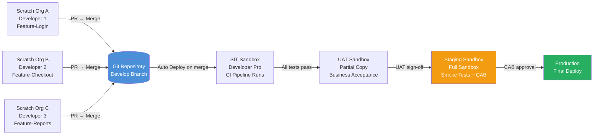

# Scratch Orgs and Sandbox Strategy

## Overview / Context

Environment strategy is one of the most consequential architectural decisions in a Salesforce program. Every downstream decision — team structure, branching strategy, CI/CD pipeline design, data management, release velocity — is constrained or enabled by the environment architecture. A poorly designed environment strategy is one of the top three causes of Salesforce program delivery failures: developers stepping on each other, UAT data contaminated by development testing, production deployments that were never validated in a production-like environment.

Architects need to understand not just the types of environments available, but the rationale for each tier: what questions each environment answers, what risks it mitigates, and what its specific limitations are. Exam questions in this domain consistently test whether you can match environment type to use case, and whether you understand the cost-quality-velocity trade-off that drives sandbox tier selection.

The key conceptual distinction is between **ephemeral environments** (scratch orgs — created for a specific purpose, then discarded) and **persistent environments** (sandboxes — created once, maintained over time, refreshed periodically). Understanding when each type is appropriate is the foundation of environment strategy.

## Foundations

A Salesforce "environment" is simply an instance of the Salesforce platform — a database, metadata store, and application runtime that operates independently from other environments, including production. Every change you make to an environment (adding an object, writing an Apex class, configuring a flow) exists only in that environment until you explicitly deploy it somewhere else.

The reason you need multiple environments is risk isolation. If every developer, tester, and business analyst worked directly in production, every experiment, every bug, every "let me try this" would potentially break the live business application. Environments let you fail safely: you can break a scratch org, corrupt a sandbox, or deploy a bad feature to UAT, and the business keeps running.

Salesforce provides two fundamentally different types of non-production environments: **sandboxes** and **scratch orgs**. Sandboxes are copies of your production org — they have the same metadata, optionally some or all of the same data, and they persist until you refresh or delete them. Scratch orgs are fresh, temporary Salesforce environments created from a configuration file — they have no production data, they expire after a set number of days, and they're designed to be created and destroyed repeatedly.

Think of a sandbox like a long-lived staging environment in traditional IT: you set it up once, keep it updated with production changes, and use it for integration testing and UAT. Think of a scratch org like a Docker container: you spin one up for a specific task, do your work, and throw it away when you're done.

For architects, the design challenge is figuring out how many of each type you need, what each one is for, and how metadata flows between them. Too few environments and teams conflict. Too many and the governance overhead exceeds the benefit.

---

## Core Concepts / Framework

### Scratch Orgs — Deep Dive

Scratch orgs are temporary, configurable Salesforce environments created from source. They are the cornerstone of the package development model.

**Scratch org characteristics:**
- Ephemeral: expire after 1–30 days (default: 7 days)
- Created from a **scratch org definition JSON file** (defines features, settings, edition)
- Empty by default — no production data, no accumulated metadata
- Deleted (not refreshed) when no longer needed
- Created via CLI: `sf org create scratch`
- Push metadata to them with `sf project deploy start`; pull changes with `sf project retrieve start`

**Scratch org definition JSON example:**
```json
{
  "orgName": "My Dev Org",
  "edition": "Developer",
  "features": [
    "EnableSetPasswordInApi",
    "Communities",
    "ServiceCloud",
    "SalesCloud",
    "CPQ"
  ],
  "settings": {
    "orgPreferenceSettings": {
      "selfSetPasswordInApi": true,
      "requireHttps": true
    },
    "caseSettings": {
      "enableCaseFeed": true
    },
    "lightningExperienceSettings": {
      "enableS1DesktopEnabled": true
    }
  },
  "hasSampleData": false
}
```

**Key fields:**
| Field | Purpose |
|---|---|
| `edition` | Developer, Enterprise, Group, Professional |
| `features` | Salesforce features to enable (Communities, CPQ, etc.) |
| `settings` | Org-wide settings equivalent to Setup configurations |
| `hasSampleData` | Whether to include Salesforce sample data |
| `orgName` | Display name for the org |

**Scratch org limits (important for exam):**

| Limit | Standard Developer Edition Hub |
|---|---|
| Max active scratch orgs | 6 active orgs |
| Daily scratch org creations | 6 per day |
| Max scratch org lifespan | 30 days |
| Default scratch org lifespan | 7 days |

*Enterprise/Unlimited Edition Dev Hub limits are higher (often 200 active, 200/day) but the Developer Edition limits are what the exam tests.*

**Scratch org vs sandbox — when to use which:**

| Scenario | Use Scratch Org | Use Sandbox |
|---|---|---|
| Individual developer feature work | Yes | Possible but wasteful |
| Team integration testing | No | Yes (Developer Pro) |
| UAT with business users | No | Yes (Full or Partial) |
| CI pipeline automation | Yes (primary) | Sometimes (for org-model CI) |
| Production-like performance testing | No | Yes (Full sandbox) |
| ISV / package development | Yes | No |
| Training / demos | No | Yes (Developer) |
| Data volume testing | No | Yes (Full) |

### Sandbox Types — Complete Reference

| Type | Storage | Data Copied | Refresh Interval | Use Case |
|---|---|---|---|---|
| **Developer** | 200 MB | Metadata only (no data) | 1 day minimum | Individual developer feature work |
| **Developer Pro** | 1 GB | Metadata only (no data) | 1 day minimum | Team integration testing (SIT) |
| **Partial Copy** | 5 GB | Metadata + subset of data (template-based sampling) | 5 days minimum | UAT with representative data |
| **Full** | Full production copy | Metadata + all data | 29 days minimum | Staging, performance testing, final UAT |

**Critical exam details:**
- **Developer** sandboxes: 200 MB storage. Creating one takes minutes. Refresh takes seconds to minutes. Used for feature development when scratch orgs aren't in use. No production data.
- **Developer Pro** sandboxes: 1 GB storage. Same as Developer but more room. Common choice for SIT environments. No production data.
- **Partial Copy** sandboxes: Takes a random sample of production data (you define which objects to include using a sandbox template). The 5-day refresh limit is important — you can't rapidly iterate on Partial Copy environments.
- **Full** sandboxes: Exact copy of production. Takes hours to days to create/refresh. The 29-day refresh minimum means your Full sandbox can be up to 29 days stale — plan accordingly. Critical for performance testing and final UAT.

**Data in sandboxes:**
- Developer and Developer Pro contain NO production data — only metadata
- Partial Copy and Full contain production data, which must be **masked** before business use
- Salesforce Data Mask (separate product) anonymizes PII in sandbox copies

### Data Masking — Why It Matters

When a Full sandbox is created, it contains a complete copy of production data including: names, emails, phone numbers, SSNs, financial data, HIPAA-covered health information. Using this data for testing without masking violates privacy regulations (GDPR, CCPA, HIPAA) and company data policies.

**Salesforce Data Mask:**
- Salesforce native product for anonymizing data in sandboxes
- Runs after sandbox creation to replace real PII with synthetic equivalents
- Supports: Random data replacement, similar data replacement (preserves format), deletion
- Applied per object/field, preserving referential integrity
- Required for Full sandboxes in most enterprise environments

**Data masking principles:**
1. Mask data immediately after sandbox creation, before any user access
2. Mask at the field level, not the record level (preserve record structure)
3. Use "similar data" masking for fields where format matters (e.g., phone numbers keep the format but change the values)
4. Never allow developers to access Full sandbox before masking is complete
5. Automate masking as part of the sandbox refresh process

### Sandbox Seeding Strategies

After creating a Developer or Developer Pro sandbox (which has no data), you need test data. Three strategies:

| Strategy | Mechanism | When to Use |
|---|---|---|
| **Static test data** | Apex `@testSetup` methods, TestDataFactory | For automated unit/integration tests |
| **Seeding scripts** | Anonymous Apex, Data Loader, Workbench | For manual testing environments (SIT) |
| **Data copy tools** | Copado Data Deploy, OwnBackup, Data Loader | For UAT environments needing real-scale data |

**TestDataFactory pattern (used in Apex tests):**
```apex
@isTest
public class TestDataFactory {
    public static Account createAccount(Boolean doInsert) {
        Account a = new Account(
            Name = 'Test Account',
            Industry = 'Technology',
            BillingState = 'CA'
        );
        if (doInsert) insert a;
        return a;
    }
    
    public static List<Opportunity> createOpportunities(Id accountId, Integer count) {
        List<Opportunity> opps = new List<Opportunity>();
        for (Integer i = 0; i < count; i++) {
            opps.add(new Opportunity(
                Name = 'Test Opportunity ' + i,
                AccountId = accountId,
                StageName = 'Prospecting',
                CloseDate = Date.today().addDays(30)
            ));
        }
        insert opps;
        return opps;
    }
}
```

### Environment Strategy Pattern — Enterprise Reference Architecture

The canonical Salesforce environment pipeline:

```
Developer Scratch Orgs (1 per developer/feature)
    ↓ Pull Request + CI Validation
Integration Sandbox (Developer Pro) — SIT
    ↓ Automated Integration Test Suite Pass
UAT Sandbox (Partial Copy or Full) — Business Acceptance
    ↓ UAT Sign-off from Business Stakeholders
Staging Sandbox (Full) — Final Gate
    ↓ Smoke Tests Pass + CAB Approval
Production
```

**Why each tier exists:**

| Environment | Question It Answers |
|---|---|
| Scratch Org | "Does my feature work in isolation?" |
| SIT Sandbox | "Does my feature work with other teams' features?" |
| UAT Sandbox | "Does the feature satisfy business requirements?" |
| Staging Sandbox | "Will this deployment succeed in production?" |
| Production | "Is the feature live and serving users?" |

### Org Shape — Replicating Production Settings to Scratch Orgs

**Org Shape** is a Salesforce feature that captures the edition and feature settings of an existing org and allows you to create scratch orgs that match it. Instead of manually listing features in the scratch org definition file, you can reference an org shape:

```json
{
  "sourceOrg": "00D...",  // Production org ID
  "orgName": "Shape-Based Dev Org"
}
```

Org Shape is important for complex orgs with many features enabled — it prevents the "works on my scratch org, fails in production" class of bugs caused by missing feature flags.

---

## PTA / SA Relevance

### Parallels to Daily Advisory Work

Environment strategy conversations happen in every enterprise Salesforce engagement. The most common scenarios:

**License cost discussions:** Full sandboxes require separate Salesforce licenses in some editions. Customers sometimes try to minimize sandbox tiers to save license costs. The architect must frame this as a risk trade-off: the cost of one production incident caused by inadequate testing environments far exceeds the license cost of an additional sandbox.

**Refresh planning:** Enterprise customers frequently discover that their Full sandbox is 45+ days stale because they forgot the 29-day minimum refresh interval means 29 days between requests, not 29 days of refresh time. The actual refresh may take 24-72 hours on top of that for large orgs.

**Merger/acquisition scenarios:** When a customer acquires another company's Salesforce org, the integration team needs a stable, production-like environment to test the merge. This almost always requires Full sandbox strategy with data masking.

**Compliance and GDPR:** In every healthcare, financial services, or EU customer engagement, data masking in sandboxes is a compliance requirement, not a nice-to-have. Architects who don't raise this in the environment strategy design are creating legal risk for the customer.

### How to Use This in Customer Engagements

**Environment strategy workshop questions:**
1. "How many developers will be working simultaneously on different features?" (Drives scratch org vs Developer sandbox count)
2. "Who performs UAT — business users who need real-looking data, or technical testers?" (Drives Partial vs Full sandbox need)
3. "What is your compliance posture around production data in non-production environments?" (Triggers data masking conversation)
4. "How often do you release to production?" (Weekly = need fast refresh; Monthly = Full sandbox manageable)
5. "Do you have any integrations that only work in production-like environments?" (Argues for Full sandbox for integration testing)

**Environment cost estimation for proposals:**
- Developer sandboxes: typically included in most editions (limited count)
- Developer Pro: requires purchase in some editions
- Partial Copy: typically 1 included with Enterprise; additional cost for more
- Full: typically 1 included with Enterprise; significant additional cost for more
- Scratch orgs: no direct cost, but require Dev Hub license

---

## Architecture / Scenario

### Environment Type Decision Tree

```mermaid
flowchart TD
    Q1{Is the environment for\nan individual developer\nworking on a feature?}
    Q1 -->|Yes| Q2{Are you using the\npackage development model\nor Salesforce DX?}
    Q1 -->|No| Q3{Is this for team\nintegration testing?}
    
    Q2 -->|Yes| A1[Use Scratch Org\nEphemeral, isolated,\ncreated from def file]
    Q2 -->|No| A2[Use Developer Sandbox\nPersistent, 200MB,\nno production data]
    
    Q3 -->|Yes| A3[Use Developer Pro Sandbox\n1GB, no production data,\nfor automated CI runs]
    Q3 -->|No| Q4{Is this for UAT with\nbusiness users?}
    
    Q4 -->|Yes| Q5{Do users need\nproduction-representative data?}
    Q4 -->|No| Q6{Is this the final\npre-production gate?}
    
    Q5 -->|Yes, full data| A4[Use Full Sandbox\n29-day refresh, full data,\nrequires data masking]
    Q5 -->|Sample data OK| A5[Use Partial Copy Sandbox\n5-day refresh, subset data,\nrequires data masking]
    
    Q6 -->|Yes| A6[Use Full Sandbox (Staging)\nMirroring production,\nsmoke tests run here]
    Q6 -->|No| A7[Developer or Dev Pro\nbased on storage needs]

    style A1 fill:#27ae60,color:#fff
    style A4 fill:#e74c3c,color:#fff
    style A6 fill:#f39c12,color:#fff
```

### Sandbox Promotion Pipeline



---

## Key Principles to Apply

- **Environments must match their purpose.** A Developer sandbox should never be used for UAT. A Full sandbox should never be used for individual developer work. Environment misuse creates incorrect test confidence.
- **Refresh frequency must match change frequency.** A UAT sandbox that's 60 days stale relative to production metadata is not testing what production will do. Plan refresh cycles aligned to the release cadence.
- **Every environment needs a data strategy.** "We'll figure out test data later" is a project risk. The data strategy (masked copy, synthetic, static test data) must be designed alongside the environment strategy.
- **Scratch orgs are disposable; treat them that way.** Don't make changes in a scratch org that aren't also in source control. The moment you treat a scratch org as persistent, you've lost the benefit.
- **Org Shape reduces environment drift.** As production grows in complexity, scratch orgs created from a simple definition file drift further from production. Org Shape closes this gap.
- **Data masking is non-negotiable in regulated industries.** Unmasked Full sandboxes are a compliance violation waiting to happen. Build masking into the refresh automation.
- **The number of environments is not the issue — governance of environments is.** Having 10 sandboxes is not a problem if you have clear ownership, refresh schedules, and access controls. Having 3 sandboxes with no governance is a disaster.
- **Sandbox refresh timing affects release planning.** If a Full sandbox takes 24 hours to refresh and the release cycle is 2 weeks, you need to factor the refresh window into the release calendar.

---

## Common Mistakes (Exam Candidates + Customers)

1. **Not data-masking Full sandboxes.** The exam tests whether architects know that Full sandboxes contain production data and require masking. "Create a Full sandbox and give it to the UAT team immediately" is always a wrong answer.

2. **Using a Full sandbox for developer environments.** Full sandboxes are expensive, slow to refresh, and overkill for individual developer work. They should be reserved for staging and large-scale UAT.

3. **Confusing the refresh interval with refresh duration.** "Developer sandbox refresh interval is 1 day" means you can't request a refresh more than once per day. It does not mean the refresh takes 1 day. Developer sandbox refresh is typically near-instant. Full sandbox refresh takes hours to days.

4. **Assuming Partial Copy data is representative without a template.** Without a sandbox template defining which objects and how many records to sample, Partial Copy data selection is random and may not include the records needed for testing.

5. **Not deleting scratch orgs after use.** Scratch orgs count against your active org limit. Failing to delete scratch orgs after feature branches are merged causes CI pipelines to fail when the org limit is reached.

6. **Treating scratch org definition file as set-and-forget.** As new features are added to production (new integrations, new features enabled), the scratch org definition file must be updated or scratch orgs will drift from production and tests will fail in ways that don't reflect production behavior.

7. **Conflating sandbox storage limits with data volume.** 200MB in a Developer sandbox sounds small, but it's metadata storage. With typical CRM metadata (objects, fields, Apex, LWC), you rarely hit this limit unless you're loading large amounts of test data.

8. **Not having a sandbox seeding strategy for Developer/Developer Pro sandboxes.** These sandboxes have no production data. Without a seeding strategy (TestDataFactory, seed scripts, Apex setup methods), developers spend significant time creating test data manually.

---

## Practice Questions / Scenario Exercises

**Question 1**
A company is setting up an environment strategy for a 20-developer Salesforce implementation. The project includes complex integrations with SAP and Workday that require production-like data volumes to test properly. UAT will be conducted by business users who need to validate workflows with realistic data. What is the minimum set of environments the architect should recommend?

A. 20 Developer sandboxes + 1 UAT sandbox  
B. 20 scratch orgs (via Dev Hub) + 1 Developer Pro (SIT) + 1 Full sandbox (UAT/Staging)  
C. 20 scratch orgs (via Dev Hub) + 1 Developer Pro (SIT) + 1 Partial Copy (UAT) + 1 Full (Staging)  
D. 1 Developer sandbox shared by all developers + 1 Full sandbox for UAT

**Answer: C**
The environment chain matches each tier's purpose: scratch orgs isolate developer work; Developer Pro supports team SIT; Partial Copy gives UAT users representative data without full production volume; Full sandbox gives integration and performance testing a production-like data volume for the final gate. Option B misses the distinction between UAT data needs and staging needs. Option D (shared developer sandbox) causes team conflicts. Option A lacks scratch org isolation.

---

**Question 2**
A Full sandbox was created from production 35 days ago. The release manager wants to run final regression tests in this sandbox before a major release. What risk should the architect raise?

A. The Full sandbox contains unmasked PII data  
B. The Full sandbox may have metadata drift — up to 35 days of production changes are not reflected  
C. The Full sandbox refresh interval prevents testing until it is refreshed  
D. Full sandboxes cannot be used for regression testing

**Answer: B**
The 29-day minimum refresh interval means the Full sandbox could be up to 35 days out of date relative to production metadata. Any metadata changes made in production in the last 35 days (from admins, other deployments) are not present in this sandbox. Running regression tests in a stale environment gives false confidence. Option A (PII masking) is a valid concern for a newly created sandbox but the question asks about the 35-day-old sandbox specifically. Option C misreads the refresh interval — it's a minimum, not a lock.

---

**Question 3**
A developer team is using scratch orgs for feature development. The CI pipeline fails with "Maximum number of active scratch orgs reached." The pipeline was working yesterday. What is the most likely cause and solution?

A. The scratch org definition file has an error; fix the JSON syntax  
B. Developers are not deleting scratch orgs after their feature branches are merged; implement an automated cleanup step  
C. The Dev Hub org needs a sandbox license upgrade to support more scratch orgs  
D. The `sfdx-project.json` needs a higher `sourceApiVersion` to support more concurrent scratch orgs

**Answer: B**
Active scratch org limits are per Dev Hub org. When developers create scratch orgs for features but don't delete them after merging, the active count accumulates until the limit is hit. The solution is automated scratch org deletion as part of the PR merge process (or a scheduled cleanup job). Option C conflates Dev Hub edition limits with license types. Options A and D are unrelated to org count limits.
