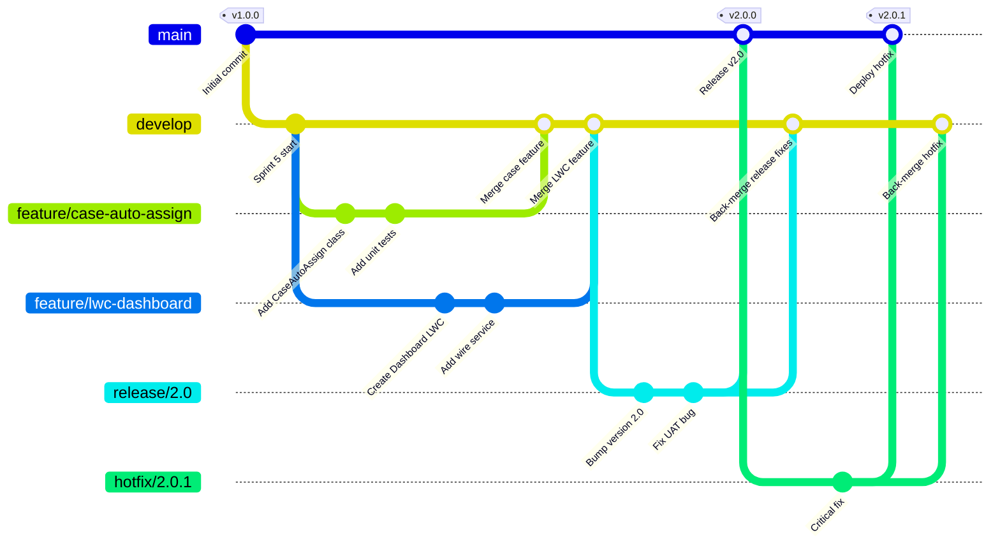
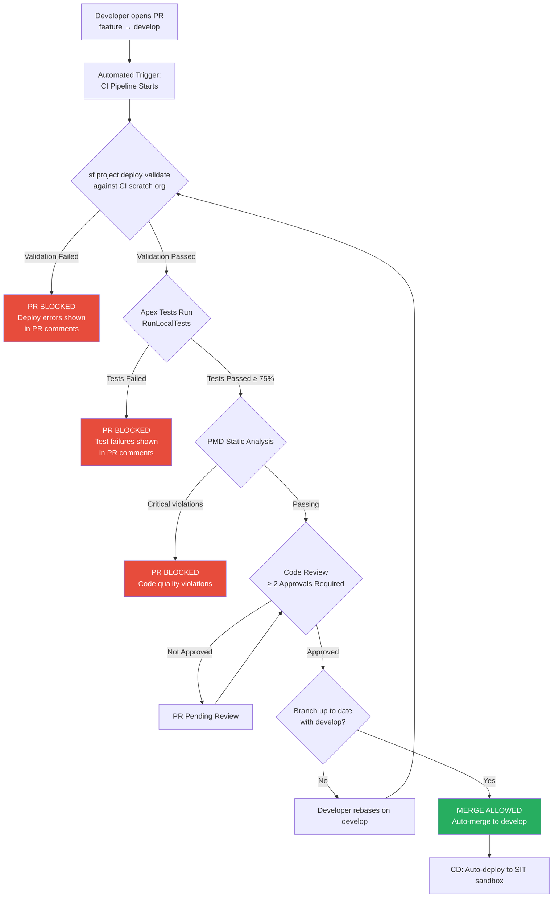

# Source Control and Git for Salesforce

## Overview / Context

Source control is the foundation of repeatable, auditable, reversible software delivery. In Salesforce programs, the absence of proper source control is one of the clearest markers of delivery risk — and one of the most common root causes of production incidents. An org without source control is an org where you can't answer basic questions: What changed? Who changed it? When? Can we roll it back? The inability to answer these questions at 2 AM during a production outage is what separates well-run programs from disaster stories.

For architects, the source control conversation is simultaneously technical and organizational. Git is a tool; the branching strategy and pull request governance model are processes; and the cultural shift from "deploy directly to production" to "everything through the pipeline" is an organizational change management challenge. Architects who treat source control as purely a developer concern miss the governance and risk management dimensions that make it relevant at the executive level.

On the exam, source control questions appear in two forms: direct questions about Git mechanics (branching models, .gitignore, conflict resolution) and scenario-based questions where source control is a component of a larger ALM or deployment architecture. The most tested concepts are GitFlow vs trunk-based development, merge conflict resolution in metadata XML, and pull request governance with CI gates.

## Foundations

Source control (also called version control) is a system that records changes to files over time so you can recall specific versions later. Git is the dominant source control system used in modern software development, and it's the de facto standard for Salesforce DevOps.

At its most basic level, Git tracks every change you make to your files, who made it, and when. You can go back to any point in history, compare the current state of your code to what it was a month ago, and see exactly what changed between two versions. This is valuable on its own, but Git's real power comes from its branching model: you can create independent lines of development (branches) that can proceed in parallel and then be merged together.

In a traditional software project, developers each work on separate branches, push their changes to a shared remote repository (like GitHub, GitLab, or Azure DevOps), and create Pull Requests — proposals to merge their branch into the main codebase. Other developers review the code, automated tests run, and only after approval and passing tests does the code get merged. This workflow is the foundation of modern software delivery.

For Salesforce, the same principles apply, but with a twist: Salesforce metadata is XML, not traditional programming code. XML merges differently than Python or JavaScript. A large `Account.object-meta.xml` file touched by two developers simultaneously is much harder to merge than two separate Python functions in separate files. This is why source format (which decomposes metadata into smaller files) and careful branching strategies are essential for Salesforce teams working in parallel.

---

## Core Concepts / Framework

### Why Source Control Is Mandatory for Enterprise Salesforce

The business case for source control in Salesforce goes beyond developer convenience:

| Concern | Without Source Control | With Source Control |
|---|---|---|
| Audit trail | No record of who changed what, when | Complete commit history with author, timestamp, message |
| Rollback | "Best effort" — manually recreate previous state | `git revert` — precise rollback of specific changes |
| Parallel development | Developers step on each other | Independent branches, conflicts detected early |
| Release management | "We'll figure out what to deploy when we get there" | A tag/branch IS the release; exactly reproducible |
| Disaster recovery | Org backup only — may be days old | Current source code always in Git, deploy in minutes |
| Code review | None or ad-hoc | PR review gates every change |
| Compliance | No evidence of change controls | Commit history IS the change log |

### Git Fundamentals in Salesforce Context

Key Git commands every architect needs to understand (not just developers):

```bash
# Initialize a new Git repository
git init

# Clone an existing repository
git clone https://github.com/company/salesforce-project.git

# Check repository status
git status

# Fetch latest from remote (doesn't merge)
git fetch origin

# Pull latest from remote (fetch + merge)
git pull origin develop

# Create and switch to a new branch
git checkout -b feature/my-feature
# Modern syntax:
git switch -c feature/my-feature

# Stage changes for commit
git add force-app/main/default/classes/MyClass.cls
git add force-app/main/default/classes/MyClass.cls-meta.xml

# Commit changes
git commit -m "feat: add case auto-assignment logic"

# Push to remote
git push origin feature/my-feature

# Merge branch (while on target branch)
git checkout develop
git merge feature/my-feature

# Rebase (replay commits on top of another branch)
git rebase develop feature/my-feature

# View log
git log --oneline --graph --all
```

**Fetch vs Pull — Salesforce context:**
In a Salesforce project, use `git fetch` before `git pull` when you want to see what changed in the remote before integrating it. This is especially important before merging a long-lived feature branch — you want to see what conflicts exist before committing to the merge.

### Branching Strategies

#### GitFlow

GitFlow is a branching model with well-defined roles for branches:

```
main          — production-ready code only; tagged with version numbers
develop       — integration branch; next release candidate
feature/*     — individual feature development (branch from develop)
release/*     — pre-release stabilization (branch from develop, merge to main + develop)
hotfix/*      — emergency production fixes (branch from main, merge to main + develop)
```

**GitFlow characteristics:**
- Structured, works well for scheduled release cadences (monthly, quarterly)
- Excellent for large teams with defined release trains
- Higher branch management overhead
- Long-lived feature branches can cause merge conflicts
- Good fit for **org development model** and scheduled release trains

**GitFlow workflow:**
```
1. Feature branches created from develop
2. Feature PR merged back to develop
3. Release branch cut from develop when sprint is complete
4. Release branch tested; fixes committed to release branch
5. Release branch merged to main (production deploy) AND develop
6. Main tagged with release version (v2.3.0)
7. Hotfix if needed: branch from main, fix, merge to main + develop
```

#### Trunk-Based Development (TBD)

Trunk-based development uses a single main branch ("trunk") with short-lived feature branches:

```
main          — always deployable; the trunk
feature/*     — short-lived (< 1 day to 2-3 days), merge frequently
```

**TBD characteristics:**
- Simpler branching model
- Requires excellent automated test coverage to work safely
- Feature flags used to hide unfinished features in main
- Continuous integration is essential
- Higher discipline required from developers (frequent, small commits)
- Good fit for **package development model** and continuous delivery

**When to use GitFlow vs TBD for Salesforce:**

| Factor | GitFlow | Trunk-Based |
|---|---|---|
| Release cadence | Monthly/quarterly | Weekly/daily |
| Development model | Org development | Package development |
| Team discipline | Moderate | High |
| Test automation | Moderate coverage OK | High coverage required |
| Feature flag support | Not needed | Needed for partial features |
| Team size | Large, multiple streams | Any size |
| Exam recommendation | Legacy/established orgs | New DX projects |

#### GitHub Flow

A simplified model used by many Salesforce teams:
```
main          — always deployable
feature/*     — any non-main work; merge via PR
```
GitHub Flow is essentially trunk-based but without the strict continuous deployment requirement. Good for teams transitioning from GitFlow to TBD.

### .gitignore vs .forceignore

These are two different ignore files that serve different purposes:

**.gitignore — What Git excludes:**
```
# .gitignore

# Node modules (LWC Jest dependencies)
node_modules/

# Build outputs
.sfdx/
.localdevserver/

# IDE files
.vscode/settings.json
.idea/

# OS files
.DS_Store
Thumbs.db

# Credentials (NEVER commit these)
.env
*.pem
config/jwt/

# Scratch org metadata generated locally
.sfdx/
```

**.forceignore — What SFDX CLI excludes from push/pull:**
```
# .forceignore

# Profiles - too risky to deploy wholesale
**/profiles/

# Installed managed package components
**/wave/

# Named credentials - environment-specific
**/namedCredentials/

# Custom metadata types with environment-specific data
# **/customMetadata/   (comment out if you DO manage these)

# Managed package metadata that shouldn't be overwritten
**/installedPackages/
```

**Key distinction for the exam:**
- `.gitignore` controls what goes into Git history — never put credentials, `.env` files, or JWT private keys in Git
- `.forceignore` controls what the Salesforce CLI considers during push/pull — prevents certain metadata from being accidentally deployed or overwritten
- These two files have overlapping but different purposes; both should exist in an SFDX project

### Merge Conflict Resolution in Metadata XML

Merge conflicts in Salesforce metadata are inevitable in multi-developer teams. Understanding how they occur and how to resolve them is both a practical skill and an exam topic.

**How XML conflicts happen:**
Two developers each modify the same metadata component (e.g., `Account.object-meta.xml` or a flow) in separate branches. When their changes are merged, Git marks the conflict regions with `<<<<<<`, `=======`, and `>>>>>>` markers.

**Example conflict in a Permission Set XML:**
```xml
<<<<<<< feature/checkout-permissions
    <fieldPermissions>
        <editable>true</editable>
        <field>Opportunity.Checkout_Status__c</field>
        <readable>true</readable>
    </fieldPermissions>
=======
    <fieldPermissions>
        <editable>true</editable>
        <field>Opportunity.Payment_Method__c</field>
        <readable>true</readable>
    </fieldPermissions>
>>>>>>> feature/payment-fields
```

**Resolution process:**
1. Identify the conflict using `git status`
2. Open the conflicted file in VS Code (conflict markers are highlighted)
3. Determine whether to keep HEAD (current branch), incoming (other branch), or both
4. For additive changes (two new fields) — keep both sections
5. For contradictory changes (both modify the same field's value) — choose the correct value
6. Remove all conflict markers (`<<<`, `===`, `>>>`)
7. Validate the resulting XML is syntactically correct
8. `sf project deploy validate` against a scratch org to confirm it deploys cleanly
9. `git add` the resolved file and complete the merge

**Why source format reduces conflicts:**
In source format, a custom object's fields are each in separate files (`fields/MyField.field-meta.xml`). Two developers adding two different fields produce two different files — no conflict. In metadata format, both fields would be in the same monolithic `Account.object` file — always a conflict.

### Mono-Repo vs Multi-Repo for Multi-Package Projects

| Aspect | Mono-Repo | Multi-Repo |
|---|---|---|
| All packages in one Git repo | Yes | No (one repo per package) |
| Cross-package code browsing | Easy | Requires cloning multiple repos |
| Inter-package dependency management | In sfdx-project.json | Requires external registry or manual coordination |
| CI pipeline complexity | One pipeline, multiple jobs | One pipeline per repo |
| Code review across packages | Single PR across packages | Requires coordinated PRs |
| Access control | Harder (everyone sees everything) | Easier (package-level access control) |
| Salesforce recommendation | **Preferred** for related packages | For truly independent products |

### Pull Request Governance

A pull request (PR) is not just a code review — it's a gate in the CI/CD pipeline. For enterprise Salesforce, PRs should enforce:

```
PR Created
    ↓
CI: sf project deploy validate (against SIT scratch org or sandbox)
    ↓ If validation fails → PR blocked
Automated Tests: RunSpecifiedTests or RunLocalTests
    ↓ If tests fail → PR blocked  
Code Review: Minimum 2 approvers
    ↓ If not approved → PR blocked
Static Analysis: PMD Apex scan, ESLint for LWC
    ↓ If critical violations → PR blocked
Merge Allowed
```

**Branch protection rules (GitHub example):**
- Require status checks to pass before merging (CI validation)
- Require pull request reviews (minimum 2 reviewers)
- Dismiss stale reviews when new commits are pushed
- Require branches to be up-to-date before merging
- Restrict push to main/release branches (protect prod-equivalent branches)
- Require signed commits (for compliance-heavy customers)

---

## PTA / SA Relevance

### Parallels to Daily Advisory Work

Source control conversations come up in:
- **Delivery health assessments:** The first question in any delivery health check should be "Is all Salesforce metadata in source control?" A "no" or "partially" is a red flag.
- **DevOps transformation programs:** Moving customers from change sets to Git-based deployments is a common transformation initiative. Architects design the strategy; developers execute it.
- **Audit and compliance responses:** Regulators increasingly ask for change logs of Salesforce modifications. A Git commit history is a much better answer than "we have change sets" or "we look at audit trail in Setup."
- **Acquisition integration programs:** When two Salesforce orgs need to be merged, having both in source control is the only way to understand what changed in each and manage the merge systematically.

### How to Use This in Customer Engagements

**Branching strategy selection framework:**
Ask the customer: "How often do you release to production, and do all features in a sprint need to ship together or can they ship independently?"
- If features ship together on a schedule: **GitFlow** — release branch enforces bundled releases
- If features can ship independently when ready: **GitHub Flow or TBD** — simpler model, faster cycle

**The "change sets to Git" migration conversation:**
- Phase 1: Set up Git repository, retrieve current production metadata, make Git the record
- Phase 2: Implement developer workflow: branch → develop → PR → review
- Phase 3: Add CI validation (validate on PR)
- Phase 4: Add CD pipeline (deploy on merge)
- Phase 5: Introduce scratch orgs for new feature development
- Change sets remain available as fallback during transition but become "last resort"

**PR governance as an organizational contract:**
Frame branch protection rules not as a technical constraint but as an organizational agreement: "We agree that no change goes to production without passing automated tests and receiving a code review from a peer." This frames governance in terms the business understands.

---

## Architecture / Scenario

### GitFlow Branching Diagram



### PR Gate Flow



---

## Key Principles to Apply

- **Git is the system of record — always.** The org is the runtime. If a change isn't in Git, it isn't controlled, audited, or reversible.
- **Branch protection rules are architecture, not process.** Configuring required status checks and required reviewers is an architectural decision that enforces the governance model automatically, without relying on developer discipline.
- **Short-lived branches reduce merge conflicts.** The longer a feature branch lives without merging, the more it diverges from the base, and the harder the merge. Encourage daily commits and frequent integration.
- **Merge vs rebase is a team agreement.** Both approaches work; what matters is consistency. Rebase produces cleaner history; merge preserves branch topology. Document the team's choice.
- **Commit messages are the change log.** "Fixed stuff" is not a commit message. "fix: resolve governor limit in CaseService.getRelatedCases() when > 200 cases" is. Enforce conventional commit format in PR reviews.
- **Never commit credentials.** JWT private keys, OAuth secrets, and environment passwords must never be committed to Git. Use GitHub Secrets, Azure Key Vault, or Salesforce Named Credentials instead.
- **Conflict resolution requires deployment validation.** After resolving an XML merge conflict, always validate the deployment against a scratch org before merging the PR. The XML may be syntactically correct but semantically broken.
- **Source format decomposition is a force multiplier for teams.** It doesn't just reduce conflicts — it makes code reviews more meaningful (smaller, focused diffs), onboarding faster (clear file → component mapping), and debugging easier (blame a single field file).

---

## Common Mistakes (Exam Candidates + Customers)

1. **Using the org as the system of record.** "We retrieve from production to update our Git repo" is backwards. Source control should drive the org, not the other way around.

2. **Not configuring .gitignore before first commit.** Committing `.sfdx/` directories, `node_modules/`, and `.env` files creates noise in the repository and potential security issues.

3. **Long-lived feature branches.** Feature branches that live for weeks or months accumulate conflict debt. When finally merged, the integration effort can dwarf the original development effort.

4. **Not merging hotfix branches back to develop.** The most common GitFlow error. A hotfix merged only to main will be overwritten by the next release from develop.

5. **Confusing `git fetch` with `git pull`.** `git fetch` downloads remote changes without modifying your working directory. `git pull` = `git fetch` + `git merge`. Using pull when you meant to fetch can unexpectedly modify your local branch.

6. **Resolving XML merge conflicts with "keep mine" reflexively.** In metadata XML, many conflicts are additive (both sides added something). Blindly choosing one side discards valid changes.

7. **Treating branch protection rules as optional.** Without enforced branch protection, developers under deadline pressure bypass reviews and CI gates. The protection rules are what makes governance real.

8. **Not having a branching strategy documented.** Undocumented branching conventions degrade over time. Every program should have a branching strategy diagram in its architecture documentation that is reviewed and updated as the program evolves.

---

## Practice Questions / Scenario Exercises

**Question 1**
A 25-developer Salesforce team using GitFlow has a 2-week sprint cycle. They are experiencing frequent merge conflicts in object metadata files when multiple developers' feature branches are merged during the release consolidation window. What is the most effective architectural fix?

A. Move to a single shared developer sandbox to prevent concurrent development  
B. Migrate to SFDX source format so metadata is decomposed into per-component files, reducing conflict surface area  
C. Use the Metadata API format instead of source format for better XML merging  
D. Increase the release cadence to monthly to give more time for conflict resolution

**Answer: B**
Source format decomposes metadata (like objects and their fields) into granular files. When Developer A adds Field X and Developer B adds Field Y, these become two separate files — no conflict. In metadata format, both fields are in the same monolithic object XML file — always a conflict. Options A and D address the symptom by reducing parallelism; they don't fix the underlying structural problem. Option C is the wrong direction — metadata format is more prone to conflicts.

---

**Question 2**
A company's Salesforce administrator made a critical permission change directly in production to resolve a live support ticket. This change was not captured in source control. Two weeks later, the monthly release overwrites the change because the source code doesn't include it, causing production to break. What process should have prevented this?

A. Disable admin access to production  
B. Implement a policy where all production changes, including admin changes, must be made via the deployment pipeline with the change captured in source control first  
C. Require all admins to take a Git training course  
D. Run a production org retrieve weekly to sync source control with production

**Answer: B**
The root cause is a "back-door" change that bypassed the pipeline. The fix is a governance policy: all changes to production go through source control first, then pipeline. Even urgent changes can use a hotfix branch. Option A is impractical — admins need production access for break-fix. Option C addresses the person, not the process. Option D (retrieve from org to update source) is the backwards pattern — org → source rather than source → org.

---

**Question 3**
A team is choosing between GitFlow and trunk-based development for a new Salesforce CPQ implementation. They will have 30 developers, release to production weekly, and have committed to 80% automated test coverage. Which strategy should the architect recommend, and why?

A. GitFlow, because the large team requires the structured branch model  
B. GitFlow, because monthly release cadences require release branch stabilization  
C. Trunk-based development, because weekly releases and high test coverage support continuous integration  
D. GitHub Flow, because it supports only two branch types which is simpler for large teams

**Answer: C**
Trunk-based development requires two preconditions: short release cycles (met — weekly) and high automated test coverage (met — 80%). With these in place, TBD is the superior choice for a large team because it eliminates the merge conflict problem inherent in long-lived feature branches. Short-lived feature branches (1-3 days) + high test coverage + frequent integration is the TBD formula. Option A is wrong — team size alone doesn't dictate GitFlow. Option B mentions monthly cadence which doesn't match the scenario. Option D (GitHub Flow) is a valid simplification but the exam favors TBD with the described preconditions.
