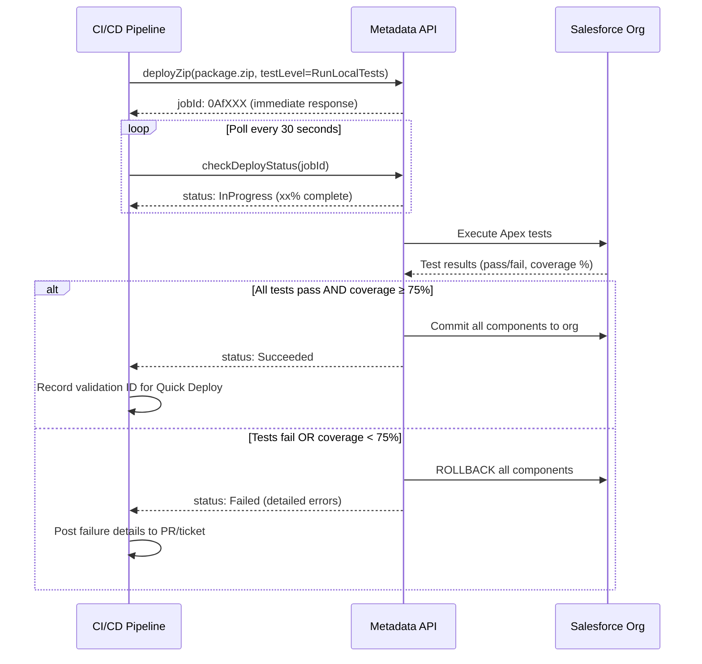
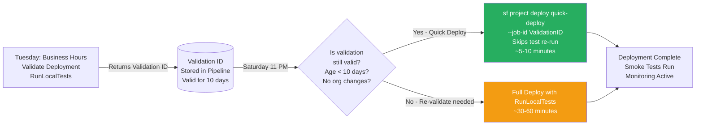

# Metadata API Deployment Deep Dive

## Overview / Context

The Metadata API is Salesforce's foundational deployment mechanism. Every other deployment tool — change sets, the Salesforce CLI, Copado, Gearset, AutoRABIT — ultimately calls the Metadata API under the hood. Understanding how the Metadata API works is not just an academic exercise: it explains the behavior of every deployment you'll ever do, the errors you'll encounter, and the architectural decisions about quick deploy, test levels, and deployment validation.

At the architect level, the Metadata API's properties (asynchronous execution, job IDs, test level requirements, package.xml manifests) directly determine how CI/CD pipelines must be designed. A synchronous mind expects to kick off a deployment and wait for immediate feedback — the Metadata API's asynchronous nature means pipelines must poll for completion, handle timeouts, and process result payloads. Understanding this shapes how you design pipeline timeouts, retry logic, and deployment reporting.

The exam heavily tests Metadata API details: the difference between deploy and validate, the quick deploy window and conditions that invalidate it, and test execution levels. These are frequently tested as scenario questions where choosing the wrong test level causes a deployment failure or an unacceptable risk.

## Foundations

Before the Salesforce CLI and Salesforce DX became the primary developer tools, the Metadata API was the only programmatic way to deploy Salesforce configuration and code. Even today, the Salesforce CLI's `sf project deploy` commands are a higher-level abstraction over Metadata API calls.

A deployment in Salesforce is the process of moving metadata — Apex classes, custom objects, flows, page layouts, validation rules, and many other component types — from one org to another. The Metadata API provides a SOAP-based web service that accepts a ZIP archive containing metadata files and a `package.xml` manifest, sends it to Salesforce, and returns a job ID. The job runs asynchronously in the Salesforce infrastructure, and the deployer polls for completion.

Think of it like submitting a job to a print queue: you submit the package, get a ticket number (job ID), and periodically check whether the job is done, succeeded, or failed. This asynchronous pattern is fundamental to how all Salesforce deployments work, and understanding it explains why deployment tools need to handle "deployment pending" states, timeouts, and polling intervals.

The Metadata API wraps the deployment in a transaction: either all components deploy successfully (and the transaction commits), or any failure causes the entire transaction to roll back. This all-or-nothing model is both a safety feature (partial deployments can't leave an org in an inconsistent state) and a frustration (one failing test class blocks the entire deployment).

---

## Core Concepts / Framework

### Metadata API Deployment Mechanics

**Deployment flow:**
1. Client assembles a deployment package: ZIP file containing metadata files + `package.xml`
2. Client calls `deployZip()` Metadata API method, receives an async job ID
3. Salesforce processes the package:
   - Validates component syntax and structure
   - Runs specified Apex tests
   - If all validations and tests pass, commits changes to the org
4. Client polls `checkDeployStatus()` with the job ID until status is `Succeeded` or `Failed`
5. Client retrieves detailed results: component-level success/failure, test results, code coverage

**Key properties:**
- **Asynchronous:** Never blocks the calling process; returns a job ID immediately
- **Transactional:** All-or-nothing — failure rolls back all components
- **Test-gated:** Deployments to production require test execution (minimally RunLocalTests)
- **Order-dependent:** Components are deployed in dependency order (referenced objects before referencing objects)

### Deploy vs Validate

This is one of the most tested distinctions in the exam.

**Deploy (`deploy` / `sf project deploy start`):**
- Runs test suite
- If tests pass: commits all components to the org permanently
- If tests fail: rolls back entire deployment
- Actual changes are made to the org

**Validate (`deploy --checkonly` / `sf project deploy validate`):**
- Runs test suite
- If tests pass: reports success but makes NO changes to the org
- If tests fail: reports failure (same as Deploy failure)
- Org is unchanged regardless of outcome
- Returns a validation ID that can be used for Quick Deploy

**When to validate:**
- Before a production deployment during a maintenance window (validate during business hours, quick deploy during the maintenance window)
- In CI pipelines on Pull Requests (validate proves deployability without changing the org)
- When you need test results without committing changes

**Critical exam distinction:** Validate = "prove it would work" / Deploy = "make it happen"

### Quick Deploy — Conditions and Rules

Quick Deploy allows you to deploy a previously validated package without re-running tests.

**Requirements for Quick Deploy:**
1. A prior **validation** run must have succeeded (not just a deploy)
2. The validation ran with **RunLocalTests or RunAllTests** (not NoTestRun or RunSpecifiedTests with < 100% coverage)
3. The validation is within the **10-day validity window**
4. The **75% code coverage threshold** was met during validation
5. The org's metadata has **not changed significantly** since validation (Salesforce may invalidate it)

**Quick Deploy benefits:**
- Skips re-running tests (tests already proven during validation)
- Significantly faster deployment, especially for large test suites
- Ideal for maintenance window deployments (validate during day, quick-deploy at night)

**What invalidates Quick Deploy:**
- More than 10 days have passed since validation
- Apex code has been modified in the org since validation
- New Apex classes have been added to the org
- The validation job ID is expired

**Quick Deploy process:**
```bash
# Step 1: Validate (returns validation ID)
sf project deploy validate --source-dir force-app --test-level RunLocalTests

# Step 2: Note the validation job ID from output
# Example job ID: 0AfxxxxxxxxxxxxxxX

# Step 3: Quick Deploy using the validation ID (within 10 days)
sf project deploy quick-deploy --job-id 0AfxxxxxxxxxxxxxxX
```

### Test Execution Levels

This is another heavily tested topic. Every deployment to production must specify a test level.

| Test Level | What Runs | When to Use |
|---|---|---|
| `NoTestRun` | No tests | Sandboxes only (not production); deploying metadata with no Apex |
| `RunSpecifiedTests` | Only the tests you list explicitly | When deploying to production with specific test classes covering exactly the deployed code |
| `RunLocalTests` | All Apex tests in the org EXCEPT managed package tests | Standard production deployment; the default for full releases |
| `RunAllTestsInOrg` | All Apex tests INCLUDING managed package tests | When managed package test compatibility must be verified; slow |

**Production rule:** You cannot deploy to production with `NoTestRun`. The minimum is `RunSpecifiedTests` with classes that cover the deployed code.

**75% rule in context:**
- For `RunSpecifiedTests`: the tests you specify must collectively cover ≥ 75% of the Apex code in the deployment package
- For `RunLocalTests`/`RunAllTestsInOrg`: the overall org-wide Apex coverage must be ≥ 75%
- Coverage is measured by lines executed, not assertions

**Exam trap — RunSpecifiedTests and coverage:**
When using `RunSpecifiedTests`, the 75% threshold applies to the code you're deploying. If you deploy a new Apex class and only specify tests that cover 60% of its lines, the deployment fails — even if the rest of the org has 90% coverage.

### Package.xml — Structure and Usage

`package.xml` (also called the deployment manifest) defines which components to include in a deployment or retrieval.

**Structure:**
```xml
<?xml version="1.0" encoding="UTF-8"?>
<Package xmlns="http://soap.sforce.com/2006/04/metadata">
    <types>
        <members>MyApexClass</members>
        <members>AnotherClass</members>
        <name>ApexClass</name>
    </types>
    <types>
        <members>Account.My_Custom_Field__c</members>
        <name>CustomField</name>
    </types>
    <types>
        <members>*</members>
        <name>CustomObject</name>
    </types>
    <version>62.0</version>
</Package>
```

**Wildcard vs explicit members:**
- `<members>*</members>` = retrieve/deploy ALL components of that type
- `<members>MyClass</members>` = retrieve/deploy only that specific component
- Wildcard retrieval may not work for all metadata types (some types don't support `*`)
- Wildcard deploy is dangerous — can accidentally overwrite components you didn't intend to modify

**What cannot be retrieved via Metadata API:**
- Some standard objects (Account, Contact — only their custom fields can be retrieved)
- Some settings embedded in Setup (UI-only configurations)
- Historical data (Metadata API = metadata only, not records)
- Some managed package components

### Deployment Monitoring and Common Error Messages

| Error | Cause | Fix |
|---|---|---|
| `CANNOT_INSERT_UPDATE_ACTIVATE_ENTITY` | Apex trigger fails during deployment of related component | Fix trigger logic or include trigger in deployment |
| `INVALID_FIELD_FOR_INSERT_UPDATE` | Field referenced in code doesn't exist in target org | Deploy the custom field first, or include it in the same package |
| `REQUIRED_FIELD_MISSING` | Required field doesn't have a default and there's no data | Check record types, required fields in the target org |
| `NO_APPLICABLE_CODE` | Test class covers no code in the deployment | Specify the correct test class or include the class being tested |
| `UNKNOWN_EXCEPTION` | Timeout or infrastructure issue | Retry; if persistent, check field dependencies |
| `Error: Dependent class is invalid and needs recompilation` | A class depends on another class that is being deployed | Deploy all dependent classes together in the same package |

---

## PTA / SA Relevance

### Parallels to Daily Advisory Work

Metadata API knowledge appears in:
- **Pipeline architecture reviews:** When reviewing a customer's CI/CD pipeline design, understanding validate vs deploy and quick deploy conditions tells you whether they're optimizing their deployment window correctly.
- **Production deployment planning:** "We need to deploy on Saturday night in a 2-hour maintenance window" — validate during the week, quick deploy Saturday night.
- **Incident post-mortems:** "Our deployment failed at 11 PM and we had to roll back" — understanding why deployments fail (test failures, dependency errors, metadata conflicts) enables the correct post-mortem analysis.
- **DevOps tool evaluations:** When evaluating Copado, Gearset, AutoRABIT — understanding that they all sit on top of the Metadata API means you can evaluate them on governance, UI, and workflow features rather than deployment mechanics.

### How to Use This in Customer Engagements

**Quick Deploy strategy for enterprise customers:**
For customers with large test suites (30+ minutes to run all tests), quick deploy is essential for meeting maintenance window requirements. The architectural recommendation:
- Run `validate` with `RunLocalTests` every night in an off-hours window
- Keep the validation job ID
- When the weekly deployment window arrives, run `quick-deploy` using the validated job
- Total deployment window = 5-10 minutes instead of 30-60 minutes

**Test level selection framework for customers:**
```
Deploying to sandbox (no Apex changes)?       → NoTestRun
Deploying to sandbox (with Apex changes)?      → RunSpecifiedTests or RunLocalTests
Deploying to production (targeted hotfix)?     → RunSpecifiedTests (faster, proves coverage)
Deploying full sprint release to production?   → RunLocalTests (covers everything)
Deploying when managed packages are in scope?  → RunAllTestsInOrg (verify package compat)
```

---

## Architecture / Scenario

### Metadata API Deployment Flow



### Quick Deploy Sequence



---

## Key Principles to Apply

- **Validate before every production deployment.** Running a validation at least 24 hours before the deployment window catches test failures and dependency errors when there's time to fix them.
- **Quick deploy is a maintenance window strategy.** The 10-day window is designed for exactly this: validate during business hours, quick deploy during the scheduled maintenance window.
- **RunLocalTests is the production deployment standard.** It covers all your code, excludes managed package tests (which you can't fix), and is the most balanced test level for production deploys.
- **RunSpecifiedTests is for targeted hotfixes only.** Using RunSpecifiedTests for a full release is risky because it only covers the specified code, not the rest of the org. Use it when you need fast deployment of a minimal fix.
- **Transactional rollback is a feature, not a bug.** The all-or-nothing deployment means a failed class doesn't partially corrupt the org. Design deployments to succeed completely; don't rely on partial success.
- **Dependency order matters in package.xml.** The Metadata API handles most dependency ordering automatically, but explicitly including dependent components in the same package is safer than assuming automatic ordering.
- **NoTestRun is only appropriate for metadata-only deployments.** If you have Apex in the deployment, NoTestRun will prevent you from catching test failures. Reserve it for config-only pushes to sandboxes.
- **Monitor deployment queue during large releases.** Multiple concurrent deployments to the same org queue up. If another deployment is in progress, yours waits. Plan release windows to avoid conflicts.

---

## Common Mistakes (Exam Candidates + Customers)

1. **Using validate and thinking the deployment happened.** Validate produces no changes in the org. Candidates sometimes confuse "validation succeeded" with "deployment succeeded."

2. **Using the deploy job ID for Quick Deploy instead of the validate job ID.** Quick Deploy requires a job ID from a `--checkonly` (validate) operation. A deploy job ID cannot be used for Quick Deploy.

3. **Letting the 10-day Quick Deploy window expire.** Validating on a Monday and planning to Quick Deploy the following Wednesday (12 days later) will fail. The window is calendar days, not business days.

4. **RunSpecifiedTests with insufficient coverage.** Specifying test classes that don't cover 75% of the code being deployed causes production deployment failures. Always pre-check coverage locally before specifying tests.

5. **Not handling the asynchronous nature in CI pipelines.** A pipeline step that calls deploy and doesn't poll for completion will incorrectly report success (the API call succeeded, but the job may still fail). Every deploy step must poll until completion.

6. **Wildcard `*` in package.xml for destructive deployments.** Using wildcards in a destructiveChanges.xml can accidentally delete components you didn't intend to remove. Always use explicit component names in destructive packages.

7. **Not including dependent components in the same package.** Deploying a trigger that references a new custom field, but not including the field in the package, causes `INVALID_FIELD_FOR_INSERT_UPDATE` errors. Include all related components together.

8. **Assuming metadata format and source format packages are interchangeable.** The Metadata API expects metadata format. Source format (SFDX) must be converted before passing to Metadata API directly. The Salesforce CLI handles this conversion transparently.

---

## Practice Questions / Scenario Exercises

**Question 1**
A release manager validates a deployment to production on Monday morning with RunLocalTests. The validation succeeds with 82% code coverage. The scheduled maintenance window is Saturday night (5 days later). What should the release manager do to execute the deployment efficiently during the maintenance window?

A. Run a full deployment with RunLocalTests during the maintenance window — validation results cannot be reused  
B. Use the validation job ID from Monday's successful validation run to execute a Quick Deploy during Saturday's window  
C. Run a new validation on Saturday afternoon and then use Quick Deploy later that night  
D. Deploy with NoTestRun during the maintenance window since tests already passed on Monday

**Answer: B**
Monday's successful validation with RunLocalTests meets all Quick Deploy requirements: passed with RunLocalTests, coverage ≥ 75%, and within the 10-day window (5 days have elapsed). Quick Deploy skips re-running tests, making the actual deployment window just minutes. Option A is unnecessarily slow. Option C wastes time re-validating. Option D (NoTestRun) is not Quick Deploy and bypasses tests entirely.

---

**Question 2**
A developer is deploying a hotfix to production that contains one new Apex class (50 lines) and one modified Apex trigger (20 lines). They want to use RunSpecifiedTests to minimize deployment time. They specify two test classes. What condition must be true for the deployment to succeed?

A. The entire org must have ≥ 75% code coverage  
B. The two specified test classes must collectively cover ≥ 75% of the lines in the new Apex class and modified trigger  
C. The two specified test classes must cover 100% of the new Apex class  
D. At least one specified test must pass; coverage is checked org-wide

**Answer: B**
With RunSpecifiedTests, the 75% coverage threshold applies to the code being deployed — not the entire org. The specified tests must cover ≥ 75% of the lines in the Apex class and trigger being deployed. Option A describes the org-wide rule that applies to RunLocalTests/RunAllTests. Option C (100%) is incorrect. Option D incorrectly describes how coverage is checked.

---

**Question 3**
A CI/CD pipeline's deployment step completes in 3 seconds and reports "success." However, the QA engineer finds that none of the new Apex classes are visible in the target org. What is the most likely explanation?

A. The package.xml was missing the ApexClass metadata type  
B. The deployment was asynchronous — the pipeline step didn't poll for the job to complete; it only captured the initial response  
C. The test execution level was set to NoTestRun, which prevents Apex deployment  
D. The Salesforce session timed out mid-deployment

**Answer: B**
Metadata API deployments return a job ID immediately (in milliseconds), but the actual processing is asynchronous. A pipeline step that calls the API and returns after 3 seconds has only captured the "job submitted" response, not the "job completed" result. If the pipeline didn't poll for the job to finish, it won't know whether the deployment succeeded, is still processing, or failed. The fix is to add a polling loop to the deployment step. Option A would show up as a deployment error, not silent success. Option C is a rule about production, not about Apex visibility.
