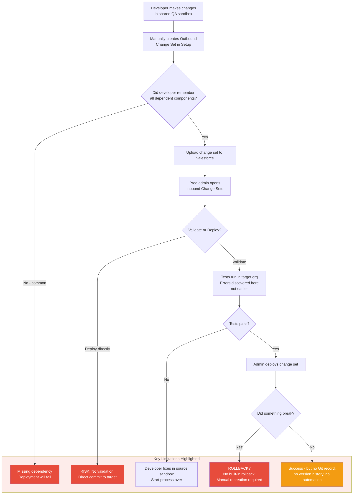

# Change Sets — Use Cases and Critical Limitations

## Overview / Context

Change sets are Salesforce's built-in, GUI-based deployment tool. They were the primary deployment mechanism for most Salesforce implementations from their introduction in 2010 until Salesforce DX became mainstream around 2018-2020. Change sets remain in use today — especially in small teams, low-change-velocity orgs, and organizations that haven't yet invested in DevOps tooling — but they are definitively the legacy approach for enterprise programs.

Understanding change sets in depth matters for architects in two ways: first, you will inherit projects that use them and need to assess and improve their practices; second, the exam uses change sets as the "wrong answer" in many enterprise scenario questions, and knowing precisely *why* they're wrong requires understanding what they do and don't support. "Change sets don't support X" is the correct rationale you need to articulate.

The critical architectural insight is that change sets are a deployment mechanism with no connection to source control, no automated testing gates, no rollback capability, and no audit trail beyond what Salesforce Setup provides. In the ALM model, change sets handle only the Develop-to-Test and Test-to-Production transitions, and they handle them manually, one-way, without governance infrastructure.

## Foundations

A change set is a collection of Salesforce components (metadata) that you explicitly select and package for deployment from one org to another. Think of it like a manual "shopping cart" for deployment: you browse your org's components, add the ones you want to move, and submit the package for delivery to a connected org.

To use change sets, two orgs must first be connected in Setup — this connection is called a "deployment connection." The org that prepares the change set is the source; the org that receives it is the target. You build an "outbound change set" in the source org, upload it to Salesforce's servers, and then "inbound" it to the target org where you choose to validate or deploy it.

Change sets were revolutionary when they were introduced because they gave Salesforce admins a built-in way to move changes between orgs without needing developer tools, API access, or technical knowledge. For their era, they were a significant step forward. The problem is that software development practices have advanced considerably since 2010, and change sets haven't kept pace. They operate in a world without Git, without CI/CD, without automated testing pipelines — the world of 2010, not 2024.

For a small admin team making a few configuration changes per month in a single-team org, change sets are manageable. For an enterprise team with 20+ developers making hundreds of changes per sprint, change sets collapse under their own limitations. The architect's job is to know exactly where that line is and be explicit about it.

---

## Core Concepts / Framework

### What Change Sets Are

**Technical definition:**
- A named collection of metadata components packaged for org-to-org deployment
- GUI-based: built through Salesforce Setup (no command line required)
- Requires a deployment connection between source and target orgs
- Two directions: **outbound** (from source org) and **inbound** (in target org)

**Deployment connection requirements:**
- Both orgs must be in the same Salesforce account / org hierarchy
- Connections must be explicitly configured in Setup → Deployment Settings
- Connections are directional: org A connected to org B for change sets doesn't automatically mean B can send to A

### Outbound vs Inbound Change Sets

**Outbound Change Set (in source org):**
1. Navigate to Setup → Outbound Change Sets
2. Create a new change set (name, description)
3. Add components: manually browse component types and select what to include
4. Upload the change set (packages it and makes it available to target org)
5. Cannot retrieve it back — once uploaded, it's submitted

**Inbound Change Set (in target org):**
1. Navigate to Setup → Inbound Change Sets
2. See uploaded change sets from connected source orgs
3. Choose to **Validate** (runs tests, checks dependencies, no changes made) or **Deploy** (applies changes)
4. Review deployment results

**The one-way nature:** Change sets flow from outbound (source) to inbound (target). They cannot be "undone" once deployed — there is no rollback button.

### What CAN Be Deployed with Change Sets

Change sets support a wide range of metadata types, including:

| Category | Examples |
|---|---|
| Apex | Apex Classes, Apex Triggers |
| Flows | Flow definitions (but not all flow versions) |
| Lightning | LWC, Aura Components |
| Data Model | Custom Objects, Custom Fields, Relationships |
| Security | Profiles, Permission Sets, Roles |
| UI | Page Layouts, Record Types, List Views |
| Automation | Workflow Rules, Approval Processes, Validation Rules |
| Integration | Remote Sites, Custom Labels, Custom Metadata Types |
| Reports/Dashboards | Reports, Dashboards, Report Types |

### What CANNOT Be Deployed with Change Sets

This is more important to know than what CAN be deployed:

| Component | Limitation |
|---|---|
| **Flow versions** | Only the latest version is included; version history is not preserved |
| **Standard fields** | Cannot deploy changes to standard fields (e.g., Account.Phone field settings) |
| **Standard objects** | Cannot create or meaningfully modify standard objects |
| **Certain org-wide settings** | Many settings must be enabled manually in target org Setup |
| **Data records** | Change sets are metadata only — no record data |
| **Large metadata** | Very large components (giant reports, complex flows) may fail silently |
| **Installed managed packages** | Cannot include or upgrade managed package components |
| **Experience Cloud site structure** | Partial support — some components excluded |

### Critical Limitations of Change Sets

These limitations are the heart of why architects recommend moving beyond change sets for enterprise programs:

**1. No version control integration**
Change sets have zero integration with Git or any source control system. A deployed change set leaves no Git commit, no author history, no branch reference, no diff. The only audit trail is the Salesforce deployment history in Setup. If you want to know what was in change set "Sprint 23 Release" from 8 months ago, you have to click through the change set's component list — you cannot `git log` it.

**2. No automated testing gate on the outbound side**
When you upload an outbound change set, Salesforce does not run any tests. Tests run only when the inbound change set is validated or deployed in the target org. This means a developer can create a change set with failing tests and it will upload successfully — the failure is only discovered when it hits the target.

**3. Manual process — no CI/CD integration**
Change sets cannot be triggered by a Git push, a PR merge, or any automated event. A human must manually select components, create the change set, upload it, navigate to the target, and deploy it. This makes change sets impossible to integrate into automated pipelines.

**4. No rollback mechanism**
If a deployed change set breaks production, there is no "undo" button. Rollback requires either:
- Creating a new change set with the previous configuration (if you remember what it was)
- Manually reverting each changed component one by one in Setup
- Restoring from a sandbox snapshot (if one exists)

This is particularly dangerous for Apex code changes — if you deployed a broken Apex class and it's now in production, you need to deploy a fixed version or the original version as quickly as possible, manually.

**5. Dependencies must be manually managed**
If you add a custom field to a change set but forget to include the object it belongs to (or the object is already in the target), change sets have limited intelligence about dependencies. You must manually add all dependent components or face deployment failures.

**6. No branching support or parallel stream management**
When multiple developers make changes in the same sandbox, change sets pick up whatever is in the org — there's no way to say "include Developer A's changes but not Developer B's." This forces developers to coordinate timing, use separate sandboxes, or accept bundled deployments.

**7. No support for selective component deployment easily**
To deploy only some fields on an object, you must individually add each field to the change set. There's no way to say "deploy all changes made since the last deployment" — you must manually track and add components.

**8. Deployment connections are environment-specific**
Change set connections must be reconfigured when sandbox environments change. After a sandbox refresh, the deployment connection must be re-established. This creates operational overhead.

### When Change Sets Are Still Appropriate

Despite their limitations, change sets have valid use cases:

| Scenario | Justification |
|---|---|
| Small admin team (1-5 people) | Low change velocity; manual process manageable |
| Simple configuration changes only | No Apex, no LWC — minimal test risk |
| One-off admin changes | Isolated change, no parallel development |
| Organizations with no Git access | Low-maturity teams without DevOps tooling |
| Supplementary to pipeline (emergency) | When pipeline is unavailable for an urgent change |
| Learning/training environments | Students learning deployment concepts |

### Why Enterprises Must Move Beyond Change Sets

The business case against change sets at enterprise scale:

1. **Audit trail is inadequate for compliance.** "Who changed this and when?" is answered by Setup audit trail, which is limited to 180 days and provides no context (no ticket number, no PR link, no business reason).

2. **Release velocity is capped by manual process.** A team that deploys weekly via change sets takes 2-4 hours per release. A team with a CI/CD pipeline takes 20-30 minutes.

3. **Rollback is impractical.** For regulated industries (FSC, HLS), the inability to quickly roll back a bad deployment is a compliance risk, not just an inconvenience.

4. **No parallel development support.** 20 developers in a shared sandbox with change sets is the DevOps antipattern. It's how you get three-day code freezes before every release.

5. **Hidden technical debt.** Without source control, you cannot measure what was deployed, what was changed, or what the original state was. Technical debt accumulates invisibly.

---

## PTA / SA Relevance

### Parallels to Daily Advisory Work

The change set conversation is universal in Salesforce programs:
- **Customers presenting their "DevOps strategy"** often describe it as "we use change sets." This is the moment to introduce the maturity model and build a roadmap.
- **Delivery escalations** often have "change set deployment failed" as a root cause — missing dependencies, untested code, wrong component selection.
- **Compliance reviews** in regulated industries often surface "no audit trail for Salesforce configuration changes" as a finding — change sets can't address this without supplementary tools.

### How to Use This in Customer Engagements

**The "change set to pipeline" migration pitch:**
Frame the migration not as "change sets are bad" (which feels like criticism) but as "your team has outgrown change sets" (which feels like growth):
- "Change sets were built for single-admin orgs. You now have 15 developers. That's a sign of success — time for the tooling to catch up."
- "Here's what you gain: rollback capability, full audit trail, automated testing gates, and 3x deployment velocity."

**Calculating the ROI of pipeline vs change sets:**
- Current: 3 hours/release × 2 releases/month × $150/hr developer time = $10,800/year just in deployment labor
- With pipeline: 30 min/release × 2 releases/month × $150/hr = $1,800/year
- Plus: incident risk reduction (one change-set-related prod incident often costs $50,000+ in recovery)

---

## Architecture / Scenario

### Change Set Deployment Flow Showing Limitations

---

## Key Principles to Apply

- **Change sets are a deployment tool, not a DevOps strategy.** Teams that describe their ALM as "we use change sets" have a deployment mechanism, not a lifecycle management process.
- **Every limitation of change sets is an argument for source control + pipeline.** Use the change set limitations list as your checklist when building the business case for DevOps tooling.
- **Change sets have no rollback — prevention must compensate.** When change sets are unavoidable, the risk management strategy must be heavier on the prevention side: validate before deploy, always have a "before" snapshot, have a recovery plan written before deployment day.
- **Never rely on change sets for emergency hotfixes.** A change set emergency deployment requires human coordination, Setup navigation, and no automated tests. This is the worst scenario for a production incident.
- **The developer sandbox-to-QA-to-production change set chain is the org model.** Change sets are not just a tool; they define the org development model pattern. Moving to pipelines means moving to the source-driven model entirely.
- **For compliance customers: source control + pipeline = audit trail.** Change sets cannot satisfy "show me every change made to Salesforce in the last 12 months, who made it, what the before-and-after state was, and what business requirement it addressed." Git + JIRA integration can.
- **Change set component selection is a risk.** Manual component selection means manual omission errors. Automated deployments from source control are complete by definition.
- **When you must use change sets, validate always before deploying.** Validation in the target org is the only testing gate change sets provide. Never skip it.

---

## Common Mistakes (Exam Candidates + Customers)

1. **Treating change sets as the recommended enterprise deployment approach.** They are legacy. Exam questions that present change sets as the recommended solution for large teams are traps.

2. **Forgetting that change sets can't include flow version history.** Change sets include the current (latest) version of a flow. Prior versions are not included. Rolling back a flow via change set requires re-deploying the previous version (which you'd need to have separately captured).

3. **Assuming deployment connection setup is permanent.** After sandbox refreshes, deployment connections must be re-established. Customers frequently forget this and find their change set pipeline broken.

4. **Confusing outbound and inbound.** Outbound = built in source, uploaded. Inbound = received in target, validated/deployed. The exam sometimes asks which side an action happens on.

5. **Believing change sets enforce test gates.** Change sets allow deployment without validation (you can skip validate and go straight to deploy). Without a process rule requiring validation, untested code reaches production.

6. **Not accounting for deployment connection limits.** There are limits on the number of deployment connections per org. Large sandbox environments with many connected orgs can hit these limits.

7. **Thinking change sets are "safe" because they require admin action.** Human-operated processes are not inherently safer than automated ones. A human making manual deployment decisions at 11 PM under deadline pressure is a higher-risk scenario than an automated pipeline with tests.

8. **Ignoring the standard field limitation.** Change sets cannot modify standard field attributes that must be changed in Setup. Customers are sometimes surprised when they try to add a validation rule on a standard field and find it can't be included in a change set.

---

## Practice Questions / Scenario Exercises

**Question 1**
A 30-developer enterprise team is using change sets to promote code from three developer sandboxes to a shared QA sandbox, then to production. They report that deployments frequently fail due to missing components, conflicts between developers' changes, and a 4-hour deployment process every sprint. As the architect, what is the primary recommendation?

A. Add a fourth developer sandbox to reduce developer conflicts  
B. Implement a change set checklist process so developers don't miss components  
C. Migrate to a Salesforce DX + Git + CI/CD pipeline with automated deployments  
D. Hire a dedicated release manager to oversee change set construction

**Answer: C**
The problems described (missing components, conflicts, slow process) are structural limitations of change sets, not process discipline problems. Adding sandboxes (A) doesn't fix conflict management. A checklist (B) and release manager (D) are band-aids on a broken tool. The architectural solution is the package development model with automated pipelines, which eliminates manual component selection (solving missing components), uses Git merges to detect conflicts early (solving deployment conflicts), and automates the deployment process (solving velocity).

---

**Question 2**
A production deployment via change set deployed a broken Apex trigger that is now throwing an unhandled exception. The trigger fires on every Account update and is locking out users. What is the fastest safe path to resolution?

A. Deactivate the trigger in production via the Setup UI (if it's inactive-capable)  
B. Log a Salesforce support case to roll back the change set  
C. Create a new change set with the fixed trigger, validate it, and deploy to production  
D. Restore the sandbox from before the deployment

**Answer: C**
Change sets have no rollback. Option B — Salesforce Support does not roll back customer deployments. The fastest resolution is to fix the trigger in source (or retrieve the previous version), create a new change set with the fix, validate, and deploy. Option A may work for specific triggers but Apex triggers can't always be "deactivated" via Setup — it's class-level, not a checkbox. Option D restores the sandbox, not production.

---

**Question 3**
An architect is reviewing a customer's deployment process. The customer says: "We use change sets and it works fine for us — we've never had a production issue." The customer has 3 developers, one admin, makes 5-10 configuration changes per sprint, and has no Apex code. What should the architect recommend?

A. Immediately migrate to Salesforce DX and a full CI/CD pipeline  
B. The current change set approach is appropriate for their team size and change velocity; recommend adding validation steps before deployment  
C. Move to the Metadata API directly for programmatic deployments  
D. Purchase Copado or Gearset immediately to professionalize their deployment process

**Answer: B**
This is a trick question that tests whether candidates understand context. The change set limitations matter *at scale*. For a 3-developer, no-Apex team with low change velocity and no incidents, change sets are appropriate. The architect's recommendation should acknowledge this and suggest the one real improvement: always validate before deploying. Options A, C, and D would be over-engineering for this team size and risk profile.
