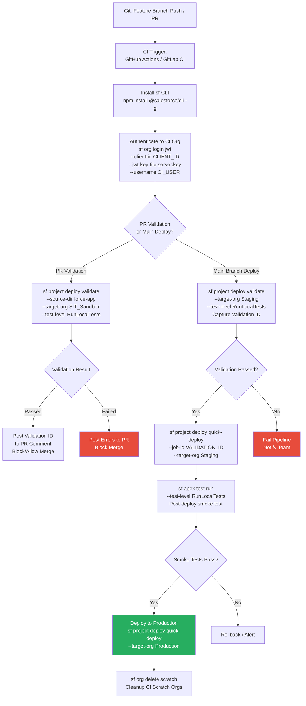

# Salesforce CLI Deployment Commands

## Overview / Context

The Salesforce CLI (Command Line Interface) is the developer's primary tool for interacting with Salesforce orgs programmatically. For DevOps architects, it's the engine that drives every automated CI/CD pipeline — every GitHub Actions workflow, every Copado behind-the-scenes operation, every Jenkins job that validates or deploys Salesforce metadata runs CLI commands. Understanding the CLI is not optional for architects who design DevOps solutions: it's the foundational API that every tooling layer sits on top of.

The Salesforce CLI has undergone a significant architecture change: the legacy `sfdx` commands are being replaced by the unified `sf` CLI (Salesforce Functions CLI, now the main Salesforce CLI). The exam tests both the old (`sfdx`) and new (`sf`) command patterns, and architects must understand the migration between them. In practice, most enterprise customers are in mid-migration — they have a mix of `sfdx` and `sf` commands in their pipelines, and knowing both is operationally necessary.

On the exam, CLI questions focus on command intent (what does this flag do?) rather than exact syntax memorization. Scenario questions ask: "What command would achieve X?" or "This pipeline uses Y flag — what is the effect?" The most tested areas are deployment commands, authentication methods (especially JWT for CI), and org management commands.

## Foundations

A command-line interface is a text-based way to interact with a system. Instead of clicking buttons in a GUI, you type commands and receive text output. The Salesforce CLI is a Node.js-based program that you install on your computer (or a CI server) and use to communicate with Salesforce orgs over their REST and Metadata APIs.

Before the Salesforce CLI existed, developers had only two options: use the Salesforce UI (clicking through Setup) or write custom code against the Salesforce SOAP/REST APIs. Neither was practical for automation. The CLI changed this by packaging common operations — authenticate to an org, push source code, run tests, create scratch orgs — into simple commands that can be strung together in scripts and automated pipelines.

The CLI is also how you interact with Salesforce DX features. You can't create a scratch org through the Salesforce UI. You can't push SFDX source format to an org through the UI. You can't run a headless CI pipeline through the UI. The CLI is the bridge between your local development environment (or CI server) and the Salesforce platform.

There are two generations of the Salesforce CLI: the legacy `sfdx` command (still installed as part of the current CLI package) and the newer unified `sf` command. Salesforce is migrating all `sfdx` commands to `sf` with a different command structure. Both work today, but `sf` is the future. The exam covers both — expect questions about both naming conventions.

---

## Core Concepts / Framework

### sfdx vs sf CLI Architecture

**Legacy sfdx format:**
```bash
sfdx force:source:deploy -p force-app -u MyOrg --testlevel RunLocalTests
sfdx force:source:retrieve -m ApexClass -u MyOrg
sfdx force:org:create -f config/project-scratch-def.json -a MyScratchOrg -d 7
```

**Unified sf format (current):**
```bash
sf project deploy start --source-dir force-app --target-org MyOrg --test-level RunLocalTests
sf project retrieve start --metadata ApexClass --target-org MyOrg
sf org create scratch --definition-file config/project-scratch-def.json --alias MyScratchOrg --duration-days 7
```

**Key architectural change:**
- `sfdx` format: `sfdx <topic>:<subtopic>:<action> -<shortflag> value`
- `sf` format: `sf <topic> <action> --<longflag> value`
- The `sf` format is more readable and consistent
- Both are installed when you install `sf` (sfdx is an alias for backwards compatibility)

**Checking installed version:**
```bash
sf --version
sf plugins
```

### Core Deployment Commands

**sf project deploy start** — Deploy source to an org:
```bash
# Basic deployment
sf project deploy start --source-dir force-app --target-org production

# With test level
sf project deploy start --source-dir force-app --target-org production \
  --test-level RunLocalTests

# Deploy specific metadata types
sf project deploy start --metadata ApexClass:MyClass --target-org MyOrg

# Deploy using package.xml manifest
sf project deploy start --manifest package.xml --target-org production

# Specify individual tests (RunSpecifiedTests)
sf project deploy start --source-dir force-app --target-org production \
  --test-level RunSpecifiedTests \
  --run-tests MyClassTest AnotherTest

# Async deployment (don't wait for completion — useful for long pipelines)
sf project deploy start --source-dir force-app --target-org production \
  --async

# Wait for deployment to complete (in minutes)
sf project deploy start --source-dir force-app --target-org production \
  --wait 60
```

**sf project deploy validate** — Validate without deploying:
```bash
# Validate (checkonly) - no changes made to org
sf project deploy validate --source-dir force-app --target-org production \
  --test-level RunLocalTests

# Returns validation job ID for use with quick-deploy
# Output: Deploy ID: 0AfXXXXXXXXXXXXXXX
```

**sf project deploy quick-deploy** — Quick deploy using validation ID:
```bash
# Quick deploy using validation job ID
sf project deploy quick-deploy --job-id 0AfXXXXXXXXXXXXXXX --target-org production
```

**sf project deploy cancel** — Cancel in-progress deployment:
```bash
sf project deploy cancel --job-id 0AfXXXXXXXXXXXXXXX --target-org production
```

**sf project deploy resume** — Resume polling for async deployment:
```bash
sf project deploy resume --job-id 0AfXXXXXXXXXXXXXXX
```

### Flags Reference Table

| Flag (sf format) | Short | Description |
|---|---|---|
| `--source-dir` | `-d` | Source directory to deploy |
| `--metadata` | `-m` | Specific metadata type:name to deploy |
| `--manifest` | `-x` | Path to package.xml manifest |
| `--target-org` | `-o` | Alias or username of target org |
| `--test-level` | `-l` | Test execution level |
| `--run-tests` | `-t` | Specific test classes (with RunSpecifiedTests) |
| `--dry-run` | | Validate only (alias for validate command) |
| `--wait` | `-w` | Minutes to wait for async completion |
| `--async` | | Don't wait; return job ID immediately |
| `--ignore-errors` | | Don't fail deployment on warnings |
| `--ignore-conflicts` | | Deploy even if conflicts exist (use carefully) |
| `--api-version` | | Override API version for this operation |

### Retrieve Commands

```bash
# Retrieve specific metadata types
sf project retrieve start --metadata ApexClass --target-org MyOrg

# Retrieve all metadata in a directory
sf project retrieve start --source-dir force-app --target-org MyOrg

# Retrieve using package.xml
sf project retrieve start --manifest package.xml --target-org MyOrg

# Retrieve specific component
sf project retrieve start --metadata "ApexClass:AccountController" --target-org MyOrg

# Preview what would be retrieved (no actual change)
sf project retrieve preview --target-org MyOrg
```

### Authentication Commands

Authentication is the most critical CI/CD setup. Two main methods:

**Web-based auth (developer machines):**
```bash
# Login via browser (opens OAuth flow)
sf org login web --alias MyDevOrg

# Login to sandbox
sf org login web --alias MySandbox --instance-url https://test.salesforce.com

# Login to production
sf org login web --alias MyProdOrg --instance-url https://login.salesforce.com
```

**JWT-based auth (CI/CD pipelines — no browser):**
```bash
# JWT auth - requires: certificate, connected app, private key
sf org login jwt \
  --client-id <ConnectedAppConsumerKey> \
  --jwt-key-file server.key \
  --username deployer@myorg.com \
  --alias CIOrg \
  --instance-url https://login.salesforce.com
```

**JWT Auth Setup — Complete Process:**

1. **Generate certificate and private key:**
```bash
openssl genrsa -out server.key 4096
openssl req -new -key server.key -out server.csr
openssl x509 -req -sha256 -days 365 -in server.csr -signkey server.key -out server.crt
```

2. **Create Connected App in Salesforce:**
   - Enable OAuth settings
   - Upload the server.crt (digital certificate)
   - Enable: "Use digital signatures"
   - OAuth scopes: api, web, refresh_token (or full access for pipelines)
   - Enable: "Require Secret for Web Server Flow"
   - Note the Consumer Key (client ID)

3. **Pre-authorize the user:**
   - The CI/CD deployment user must have "Connected App" access via profile or permission set
   - First authentication sometimes requires web-flow approval by the user before JWT works

4. **Store in CI secrets:**
   - Private key content → `SF_JWT_SECRET_KEY` (or similar)
   - Consumer Key → `SF_CLIENT_ID`
   - Username → `SF_USERNAME`
   - Instance URL → `SF_INSTANCE_URL`

5. **Use in CI pipeline:**
```bash
echo "${SF_JWT_SECRET_KEY}" > server.key
sf org login jwt \
  --client-id "${SF_CLIENT_ID}" \
  --jwt-key-file server.key \
  --username "${SF_USERNAME}" \
  --instance-url "${SF_INSTANCE_URL}" \
  --alias TargetOrg
```

### Org Management Commands

```bash
# List all authenticated orgs
sf org list

# Display details of a specific org
sf org display --target-org MyOrg

# Open org in browser
sf org open --target-org MyOrg

# Delete a scratch org
sf org delete scratch --target-org MyScratchOrg --no-prompt

# Create a scratch org
sf org create scratch \
  --definition-file config/project-scratch-def.json \
  --alias DevScratch \
  --duration-days 7 \
  --target-dev-hub MyDevHub

# Set default org
sf config set target-org MyOrg

# Set default Dev Hub
sf config set target-dev-hub MyDevHub
```

### Data and Apex Commands

```bash
# Run anonymous Apex
sf apex run --file scripts/apex/seedData.apex --target-org MyOrg

# Run Apex tests
sf apex test run --test-level RunLocalTests --target-org MyOrg --result-format json

# Run specific tests with code coverage
sf apex test run \
  --tests MyTestClass.testMethod1 \
  --code-coverage \
  --result-format human \
  --target-org MyOrg

# Query org data (SOQL)
sf data query --query "SELECT Id, Name FROM Account LIMIT 10" --target-org MyOrg
```

### org:deploy vs project:deploy

This is a naming change that trips up exam candidates:

| Legacy (`sfdx force:source:deploy`) | Current (`sf project deploy start`) |
|---|---|
| `sfdx force:source:deploy` | `sf project deploy start` |
| `-p` for source path | `--source-dir` |
| `-u` for username | `--target-org` |
| `--testlevel` | `--test-level` |
| `--runtests` | `--run-tests` |
| `--checkonly` for validate | Separate `sf project deploy validate` command |

The concepts are identical; only the command structure changed.

---

## PTA / SA Relevance

### Parallels to Daily Advisory Work

CLI knowledge matters in:
- **Pipeline design reviews:** Reading and understanding a customer's CI YAML requires knowing what each CLI command does.
- **Incident diagnosis:** When a deployment pipeline fails, the error is always in a CLI command's output. Knowing what the command was supposed to do tells you how to interpret the error.
- **DevOps tool selection:** All Salesforce DevOps tools (Copado, Gearset, AutoRABIT) use the CLI under the hood. Understanding this helps frame tool evaluations: you're evaluating the governance layer, not the deployment engine.
- **Developer onboarding:** JWT auth setup is one of the most commonly broken parts of new pipeline setups. Architects who understand it can unblock teams quickly.

### How to Use This in Customer Engagements

**JWT auth vs web auth — the enterprise conversation:**
Web-based OAuth auth requires a browser. CI/CD pipelines don't have browsers. JWT auth is designed specifically for non-interactive (headless) authentication. When a customer asks "how does our pipeline log into Salesforce without a user clicking a button?", the answer is JWT auth.

**CI user best practices for customers:**
- Use a dedicated "CI/CD service account" user (e.g., `deploy-ci@mycompany.com`)
- Give this user only the permissions needed for deployment (avoid System Administrator profile)
- Rotate the JWT certificate annually
- Never commit the private key to source control
- Store the private key in your CI platform's secret management (GitHub Secrets, Azure Key Vault)

---

## Architecture / Scenario

### CLI Command Flow for Deploy Pipeline



---

## Key Principles to Apply

- **JWT auth is the only viable CI/CD authentication method.** Web-based OAuth requires human interaction. Any pipeline that uses web auth is broken — it will fail the moment the OAuth token expires (typically after 15 days to a few hours of inactivity).
- **Never commit private keys.** The JWT private key is a credential. It belongs in CI secrets management, not in a file committed to Git. A committed private key is a security incident.
- **`--async` and polling are production patterns.** Interactive commands that wait synchronously are fine for developer machines. Pipelines should use `--async` or `--wait` with appropriate timeouts, and handle the polling explicitly.
- **`sf project deploy validate` generates a reusable job ID.** Capture and store this ID. It's your Quick Deploy key.
- **Test level selection in CLI matches Metadata API test levels.** The `--test-level` flag maps directly to the Metadata API test level enum. Understanding the concepts from Lecture 05 applies directly here.
- **org management commands are day-2 operations for architects.** `sf org list`, `sf org display`, and `sf org delete scratch` are the commands you use when diagnosing pipeline issues or cleaning up environments.
- **Source dir vs manifest vs metadata flags serve different use cases.** `--source-dir` deploys everything in a directory; `--manifest` deploys the package.xml specification; `--metadata` deploys specific named components. Use the right tool for each scenario.
- **The CI/CD deployment user's permissions must be tested separately.** Pipeline failures due to insufficient permissions for the CI user are common. Test the JWT auth and deployment with the CI user explicitly before building the pipeline.

---

## Common Mistakes (Exam Candidates + Customers)

1. **Using sfdx legacy commands in examples.** The exam may test both, but new pipeline designs should use `sf` syntax. When asked "what command should be used," prefer `sf project deploy start` over `sfdx force:source:deploy`.

2. **Not using `--wait` in synchronous pipeline steps.** Without `--wait`, the CLI returns immediately after submitting the deployment job. The pipeline step reports success (the API call succeeded) even if the deployment fails later.

3. **Deploying with `--metadata "*"` or wildcard.** Wildcard metadata deploys can include components you didn't intend to modify. Always use `--source-dir` or explicit `--manifest` in automated pipelines.

4. **Storing JWT private key as a file in the repo.** The private key must be stored as a CI secret, not in the repository. Storing it as `server.key` in a committed directory is a security vulnerability.

5. **Forgetting `--instance-url` for sandbox authentication.** Without `--instance-url https://test.salesforce.com`, JWT auth defaults to `https://login.salesforce.com` and fails for sandbox-targeted deployments.

6. **Not pre-authorizing the CI user for the Connected App.** The first JWT auth often fails because the CI user hasn't yet authorized the Connected App through an interactive session. This must be done once before headless auth works.

7. **Confusing `sf project deploy validate` result with deployment.** Validate does not change the org. Teams that run "validate" thinking they deployed have not deployed.

8. **Using RunAllTestsInOrg for every production deployment.** RunAllTestsInOrg includes managed package tests, which can take hours and may fail due to data issues in managed packages. Unless there's a specific reason to test managed packages, RunLocalTests is the appropriate choice.

---

## Practice Questions / Scenario Exercises

**Question 1**
A CI/CD pipeline needs to authenticate to a production org without any human interaction. The deployment runs at 2 AM on Saturday. Which authentication approach should the architect configure?

A. Store admin credentials in the pipeline environment variables and use username/password auth  
B. Configure JWT-based authentication with a Connected App and certificate, storing the private key in CI secrets  
C. Use OAuth web flow and pre-authenticate the deployment user before the weekend run  
D. Use a named credential in Salesforce that points to the CI server

**Answer: B**
JWT auth is specifically designed for non-interactive, headless authentication. It uses a certificate-based asymmetric key exchange that doesn't require browser interaction or stored passwords. Option A (username/password) stores credentials insecurely and is blocked by some security policies. Option C (pre-authenticate) breaks on session expiry — OAuth tokens expire and there's no human to re-authenticate at 2 AM. Option D (named credentials) are for Salesforce calling out, not for CI servers calling in.

---

**Question 2**
A deployment pipeline runs the following command in a CI step:
```bash
sf project deploy start --source-dir force-app --target-org production --test-level RunLocalTests
```
The step completes in 5 seconds and reports "Exit code 0 (success)." However, checking production 10 minutes later, the deployment hasn't applied. What is the likely cause?

A. The `--source-dir` flag pointed to the wrong directory  
B. The command needs `--manifest` instead of `--source-dir` for production deployments  
C. The deployment was submitted asynchronously and the pipeline step only captured the submission success, not the deployment outcome  
D. RunLocalTests is not supported for source-dir deployments

**Answer: C**
The sf CLI submits deployment jobs asynchronously. Without `--wait <minutes>`, the command returns immediately after the API call succeeds (which takes seconds), reporting success for the job submission — not the deployment outcome. The actual test execution and metadata application happen asynchronously after the command returns. The fix is to add `--wait 60` (or appropriate minutes) to the command, or use `--async` and separately poll with `sf project deploy resume`.

---

**Question 3**
A development team wants to validate a deployment to production during business hours on Thursday, then do a quick deploy on Sunday night. They run:
```bash
sf project deploy validate --source-dir force-app --target-org production --test-level RunSpecifiedTests --run-tests MyTest1 MyTest2
```
The validation passes. On Sunday, they run quick-deploy using the validation ID. What condition could cause the quick deploy to fail even though validation succeeded?

A. RunSpecifiedTests was used for validation; quick deploy requires RunLocalTests or RunAllTests  
B. The validation job ID has expired because more than 10 days have passed  
C. The validation ran with RunSpecifiedTests which doesn't qualify for quick deploy  
D. Sunday deployments are not supported for quick deploy

**Answer: C**
Quick Deploy requires that the validation ran with `RunLocalTests` or `RunAllTestsInOrg`. `RunSpecifiedTests` does not qualify for Quick Deploy because it doesn't verify the full test suite. A validation with RunSpecifiedTests will succeed and return a validation ID, but that ID cannot be used for quick deploy. Option B (10-day expiry) would also be a valid failure reason but the scenario says Thursday to Sunday (3-4 days), well within the 10-day window.
