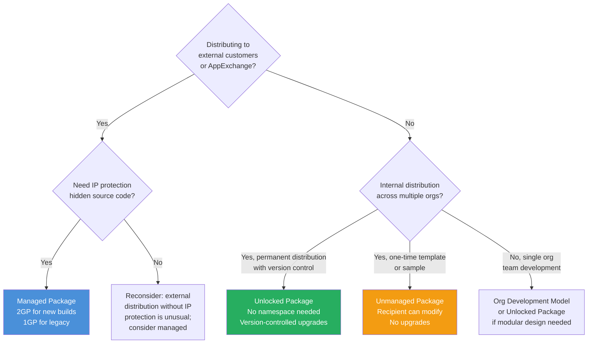
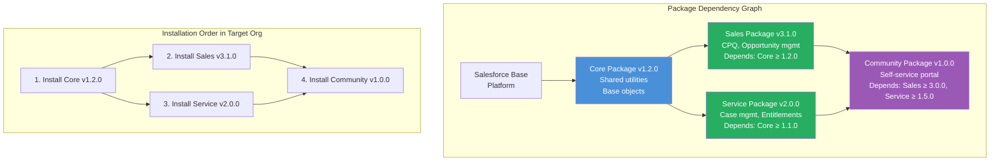

# Package Development Model — Unlocked, Managed, Unmanaged

## Overview / Context

The package development model represents Salesforce's most mature approach to application delivery. Rather than deploying metadata as raw files, packages are versioned, self-contained, installable artifacts. Understanding the three package types — unmanaged, managed, and unlocked — is not just an exam requirement: it's the foundation for advising customers on ISV strategy, internal application architecture, AppExchange readiness, and multi-team development at scale.

The distinctions between package types are sharp and consequential. A customer who chooses managed packages for an internal tool has locked themselves into AppExchange-style constraints (namespace, upgrade paths, protected components) that they didn't need. A customer who ships an internal tool to clients as an unmanaged package has given away their source code. An ISV partner who uses unlocked packages when they need AppExchange distribution has no way to protect their IP. Getting these decisions right at the architecture stage saves enormous remediation effort later.

On the exam, package questions appear in all five domains. Direct questions about package types are in the Application Lifecycle domain. Package versioning and dependency questions appear in Release Management. Package installation and CI/CD integration appears in the DevOps sections.

## Foundations

A package in Salesforce is a container that holds related metadata (and in some cases code and data) bundled together into an installable artifact. Before packages existed, the only way to distribute Salesforce customizations was via change sets or the Metadata API — which required the recipient to have deployment access to your org, trusted your source, and gave them no version history.

Packages changed this by creating discrete, versioned, installable units. A package has a version number (like software: 1.0, 1.1, 2.0), can be installed in any Salesforce org with a single action (via a URL or CLI command), and can be updated in place. This makes packages the right model for distributing applications — whether you're an ISV selling on AppExchange or an enterprise distributing internal tools to multiple business units.

Think of Salesforce packages like npm packages for Node.js or Maven JARs for Java. A package defines what it provides (components, API), its version, its dependencies on other packages, and optionally, constraints on how it can be modified in the installing org. The three package types (unmanaged, managed, unlocked) differ primarily in these constraints.

The package development model also influences how you develop: instead of building everything in one large org and deploying it all at once, you build modular packages, each with its own version history, test suite, and dependencies. This modularity is what makes large-scale parallel development possible without teams constantly conflicting.

---

## Core Concepts / Framework

### Three Package Types — Complete Comparison

| Attribute | Unmanaged | Managed (1GP/2GP) | Unlocked |
|---|---|---|---|
| **Primary Use** | Templates, samples, one-time distribution | AppExchange ISV distribution, IP protection | Internal distribution, team-based development |
| **Namespace required** | No | Yes | No (optional) |
| **Source code visible to installer** | Yes (fully visible) | No (protected) | Yes (fully visible) |
| **Upgradeable** | No (one-time install) | Yes (versioned upgrades) | Yes (versioned upgrades) |
| **IP Protection** | None | Full (managed = hidden source) | None |
| **AppExchange eligible** | No | Yes (managed only) | No |
| **Modifiable after install** | Yes (fully modifiable) | Restricted (protected components) | No (locked) |
| **Version history** | None | Full version history | Full version history |
| **Dependency support** | None | 1GP: limited; 2GP: full | Full |
| **CI/CD integration** | Not typical | Yes (2GP) | Yes |
| **Requires Dev Hub** | No | Yes (2GP); No (1GP) | Yes |

### Unmanaged Packages

Unmanaged packages are the simplest type. They're essentially a ZIP archive of metadata components that can be installed in any org.

**Characteristics:**
- No namespace
- Source code is fully visible after installation
- Cannot be upgraded — each install is independent
- After installation, the recipient can modify anything
- No version control for the package itself (just metadata snapshot)

**When to use:**
- Distributing code templates and starter kits (e.g., "here's a sample Apex trigger pattern")
- One-time migration of configuration from one org to another
- Educational/training content
- AppExchange samples

**When NOT to use:**
- Any scenario requiring IP protection
- Any scenario requiring future upgrades
- Internal application distribution (use unlocked packages instead)

**Critical exam point:** Unmanaged packages are NOT for internal distribution at enterprise scale. They're for templates. If the exam asks about internal application distribution, unlocked packages are the answer.

### Managed Packages — 1GP vs 2GP

Managed packages are the AppExchange standard. They require a namespace, protect source code, and support versioned upgrades.

**1GP (First-Generation Packages):**
- Legacy model
- Built in a "packaging org" — a special production org where the package is assembled
- The packaging org IS the development environment
- Limited dependency support between packages
- Namespace must be registered in the packaging org
- AppExchange Security Review required before listing
- Slower development cycle (tight coupling to packaging org)

**2GP (Second-Generation Packages):**
- Modern model, introduced with Salesforce DX
- Built from source code in Git; no "packaging org" required
- Supports inter-package dependencies (dependency graph)
- Dev Hub org manages package metadata; scratch orgs for development
- Namespace still required for AppExchange listing
- Faster development cycle, CI/CD native

**1GP vs 2GP comparison:**

| Aspect | 1GP | 2GP |
|---|---|---|
| Development environment | Packaging org (production) | Scratch orgs + Dev Hub |
| Source control | Difficult (org-centric) | Native (source-driven) |
| Package creation | In packaging org UI | `sf package create` CLI |
| Inter-package deps | Limited | Full dependency graph |
| CI/CD support | Limited | Native |
| Migration path | Migrate to 2GP | N/A (start here) |
| Namespace | Required | Required (for AppExchange) |

**Exam tip:** When a question asks about a modern ISV building a new AppExchange app, the answer is 2GP managed packages. When a question asks about a legacy ISV maintaining an existing app, it may be 1GP with a migration path to 2GP.

### Unlocked Packages

Unlocked packages are the recommended model for internal Salesforce application development at scale.

**Characteristics:**
- Optional namespace (can be namespaced or namespace-free)
- Source code visible after installation
- Fully versionable and upgradeable
- Components are "locked" — cannot be modified in the subscriber org (unlike unmanaged)
- Designed for CI/CD: build version → install in next environment → test → promote
- Ideal for modular enterprise architecture (Core package, Sales package, Service package, etc.)

**Why "locked":**
When you install an unlocked package version, the installed components are "owned" by that package. You cannot modify them directly in the subscriber org — changes must go through source control → new package version → install/upgrade. This is the governance model in practice: if you want to change a component, change the source.

**When to use unlocked packages:**
- Internal multi-team development (one package per team or module)
- When you need version control and upgrade paths but not AppExchange distribution
- Replacing org development model for new initiatives
- Any scenario where a consistent, repeatable deployment artifact is needed

### Package Versioning — major.minor.patch.build

Package versions follow semantic versioning with an added build number:

```
1.2.3.NEXT
│ │ │  └── Build number (auto-incremented; NEXT = auto)
│ │ └───── Patch (bug fixes, minor changes)
│ └─────── Minor (new features, backward compatible)
└───────── Major (breaking changes)
```

**Version commands:**
```bash
# Create a new package (one-time)
sf package create --name "My Unlocked Package" --type Unlocked --path force-app

# Create a new package version
sf package version create \
  --package "My Unlocked Package" \
  --definition-file config/project-scratch-def.json \
  --version-number 1.2.0.NEXT \
  --code-coverage \
  --installation-key MySuperSecretKey \
  --wait 30

# List package versions
sf package version list --packages "My Unlocked Package"

# Promote a package version to released (required before installing in production)
sf package version promote --package 04t... 

# Install a package version
sf package install --package 04t... --target-org MyOrg --installation-key MySuperSecretKey
```

**Package version promotion:**
Package versions start as "beta" (not yet released). Before installing a beta package in production, you must promote it to "Released" status. Beta packages can only be installed in scratch orgs and sandboxes — not production.

```bash
# Promote to released (makes it production-installable)
sf package version promote --package 04tXXXXXXXXXXXXXXX
```

### Package Dependencies

Unlocked packages and 2GP managed packages can declare dependencies on other packages:

```json
// sfdx-project.json
{
  "packageDirectories": [
    {
      "path": "app-core",
      "package": "Core Package",
      "versionNumber": "1.0.0.NEXT"
    },
    {
      "path": "app-sales",
      "package": "Sales Package",
      "versionNumber": "1.0.0.NEXT",
      "dependencies": [
        {
          "package": "Core Package",
          "versionNumber": "1.0.0.1"
        }
      ]
    }
  ]
}
```

**Dependency resolution order:**
When installing packages in a target org, dependencies must be installed first. If Sales Package depends on Core Package, Core must be installed before Sales.

**Import implications:**
- A package version is pinned to its dependency version
- Upgrading Core Package doesn't automatically upgrade Sales Package's view of it
- Must create new Sales Package version referencing the new Core version

### Package Installation Flags

```bash
sf package install \
  --package 04tXXXXXXXXXXXXXXX \
  --target-org MyOrg \
  --installation-key MySuperSecretKey \
  --upgrade-type Mixed \
  --wait 30
```

**--upgrade-type options (for upgrades, not first installs):**

| Option | Behavior |
|---|---|
| `DeprecateOnly` | Deprecated components are deprecated but not deleted; safest |
| `Mixed` | Components deleted if no upgrade scripts preserve them; balanced |
| `Delete` | Aggressively removes components that were in old version but not new; most disruptive |

**--installation-key:**
A password that protects who can install the package. Set during version creation. Required during installation. Used to prevent unauthorized installation of internal packages.

### Namespaces

A namespace is a prefix applied to all API names in a package to prevent conflicts with other components in the installing org.

**Example:** If your namespace is `myco`, a custom field `Status__c` in your package becomes `myco__Status__c` in the subscriber org.

**When namespace is required:**
- AppExchange listing (managed packages)
- When your package components need to be uniquely identified across all subscribers

**Namespace implications:**
- All Apex code, field references, SOQL queries must include the namespace prefix
- Test data in SOQL needs namespace: `myco__Status__c` not `Status__c`
- Makes the codebase more complex
- Once set, cannot be changed without creating a new package

**Unlocked packages without namespace:**
Internal unlocked packages typically have no namespace. This simplifies code (no prefix required) and is appropriate when you control all orgs the package installs into.

---

## PTA / SA Relevance

### Parallels to Daily Advisory Work

Package decisions appear in:
- **ISV partner assessments:** When a customer is evaluating an AppExchange package, you need to distinguish 1GP vs 2GP impacts on upgrade reliability, managed package testing (RunAllTestsInOrg implications), and namespace conflicts.
- **Multi-team enterprise programs:** The "should we use unlocked packages?" conversation happens on every large Salesforce program. The answer depends on team structure, release cadence, and how independent the modules need to be.
- **AppExchange GTM strategy:** Partners building new AppExchange products need the 2GP + namespace + AppExchange security review path. Architects advising ISV partners must know this cold.
- **Multi-org consolidation:** When merging orgs (M&A), understanding what's managed vs unlocked vs unmanaged determines what can and can't be moved.

### How to Use This in Customer Engagements

**Package type selection framework:**
```
Are you distributing to external customers / AppExchange?
  Yes → Managed Package (2GP preferred, 1GP for legacy)

Are you distributing internally across multiple orgs/teams?
  Yes, with IP protection needed → Managed Package
  Yes, no IP protection needed → Unlocked Package

One-time distribution of a template or starter?
  Yes → Unmanaged Package

Single org, single team, no distribution?
  → Org development model (no package needed)
```

**The unlocked package pitch for enterprise customers:**
"Think of unlocked packages as the unit of deployment for your Salesforce platform. Instead of deploying everything at once and hoping nothing breaks, you deploy Core (deployed monthly), Sales (deployed every sprint), and Service (deployed independently based on their team's cadence). Each module has its own version history, its own tests, and its own release cycle. When Service has a bug, you fix and re-deploy Service without touching Core or Sales."

---

## Architecture / Scenario

### Package Type Decision Tree



### 2GP Package Dependency Graph



---

## Key Principles to Apply

- **Package type choice is an irreversible architectural decision.** Changing from managed to unlocked, or adding a namespace after the fact, requires rebuilding the package. Get this right at architecture design time.
- **Unlocked packages are the enterprise ALM enabler.** They're the mechanism that makes module-by-module, team-by-team release cadences possible in Salesforce at scale.
- **2GP is the only defensible choice for new AppExchange products.** 1GP is legacy; 2GP is source-controlled, CI/CD-native, and faster to develop. All new ISV builds should start with 2GP.
- **Namespace means commitment.** Once you add a namespace, every API name is prefixed, every code reference changes, and every SOQL query must account for it. Add a namespace only when required (AppExchange distribution or explicit conflict avoidance need).
- **Package versions, not deployments, are the unit of promotion.** In the package model, you don't "deploy" — you install a specific package version. Version number tracks exactly what's installed in every org.
- **Beta versions cannot be installed in production.** Always promote to Released before a production install. This is a pipeline gate, not a manual step.
- **Installation keys protect internal packages.** Without an installation key, anyone with the package ID can install your internal package in any org. Always use installation keys for non-public packages.
- **Dependency management is explicit and version-pinned.** A package version references exact dependency versions. "Latest" is not a valid dependency — this is a feature, not a limitation.

---

## Common Mistakes (Exam Candidates + Customers)

1. **Using managed packages for internal distribution.** Managed packages are for AppExchange/external customers. For internal org-to-org distribution, unlocked packages are the correct choice.

2. **Using unmanaged packages for anything other than templates.** Unmanaged packages give away source code and can't be upgraded. "I'll use unmanaged packages to distribute our app to business units" is an architectural error.

3. **Forgetting that beta versions can't be installed in production.** A CI pipeline that creates a new package version and immediately tries to install it in production will fail because new versions are beta by default. The `sf package version promote` step must precede production install.

4. **Not declaring inter-package dependencies.** A Sales package that uses components from Core package must declare that dependency in sfdx-project.json. Without the declaration, CI will fail because the components won't be in the scratch org during package version creation.

5. **Assuming 1GP and 2GP packages are interchangeable.** A 1GP managed package cannot be migrated to a 2GP package without subscriber coordination (all subscribers must uninstall 1GP and install 2GP with data migration). These are distinct package lineages.

6. **Adding a namespace to an unlocked package that doesn't need one.** Internal unlocked packages should typically not have namespaces. Adding one unnecessarily complicates every API reference and SOQL query in the codebase.

7. **Using `--upgrade-type Delete` without careful analysis.** Delete removes components that existed in the previous version but aren't in the new version. This can destroy customer data if custom fields are removed. Use DeprecateOnly first.

8. **Not storing installation keys securely.** Installation keys stored in CI pipeline logs or environment variables without secret management are accessible to anyone with pipeline access.

---

## Practice Questions / Scenario Exercises

**Question 1**
An ISV is building a new application to sell on AppExchange. They have two development teams and want to use modern DevOps practices with CI/CD and Git. They currently have no Salesforce implementation experience. What package strategy should the architect recommend?

A. 1GP managed package because it's the established AppExchange standard  
B. Unmanaged package because it's the simplest to develop and distribute  
C. 2GP managed package with a registered namespace and Salesforce DX + CI/CD pipeline  
D. Unlocked package with no namespace for ease of development

**Answer: C**
New AppExchange ISV builds should use 2GP managed packages. 2GP supports source-driven development (Git, Salesforce DX), CI/CD natively, and inter-package dependency management. The namespace is required for AppExchange listing and IP protection. Option A (1GP) is legacy with a harder development model and limited CI/CD support. Option B (unmanaged) gives away source code and can't be listed on AppExchange. Option D (unlocked) can't be listed on AppExchange and provides no IP protection.

---

**Question 2**
A large enterprise has three internal development teams: Core (shared utilities), Sales (CPQ integration), and Service (case management). They want each team to have an independent release cadence. What package architecture should the architect recommend?

A. A single large managed package containing all three modules  
B. Three separate unlocked packages with declared inter-package dependencies  
C. Three separate unmanaged packages, one per team  
D. One unlocked package for Core and two change-set-based deployments for Sales and Service

**Answer: B**
Three independent unlocked packages with dependency declarations give each team an independent version and release cycle. Sales Package can depend on Core Package ≥ specific version; Service Package can depend on Core Package ≥ specific version. Each team creates and promotes package versions independently. Option A creates a monolith — one team's bug blocks all three teams. Option C (unmanaged) has no version history or upgrade path. Option D is a hybrid that defeats the purpose of package architecture for Sales and Service.

---

**Question 3**
A CI/CD pipeline creates a new package version and immediately attempts to install it in production, failing with "Package version not available for production installation." What is the missing step?

A. The package version must be validated in a Full sandbox before production install  
B. The package version must be promoted from Beta to Released using `sf package version promote`  
C. The package must have a namespace before it can be installed in production  
D. The installation key must be set before the package can be installed in production

**Answer: B**
Newly created package versions default to "Beta" status, which restricts installation to scratch orgs and sandboxes only. Before a package version can be installed in production, it must be explicitly promoted to "Released" status using `sf package version promote --package <version-id>`. This is a required step in any production-deployment CI/CD pipeline using packages. Option A (Full sandbox validation) is good practice but doesn't resolve the "not available" error. Option C (namespace) is a design decision, not an installation gate.
