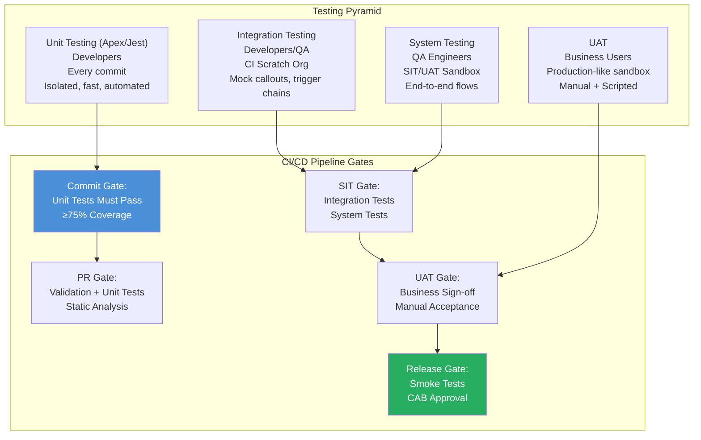

# Testing Strategy Design for Salesforce

## Overview / Context

Testing strategy is the architectural blueprint for how an organization verifies that its Salesforce implementation works correctly, continues to work correctly after changes, and meets business requirements. A testing strategy is not a list of test scripts — it is a systematic design that determines what gets tested, at what level, by whom, using what tools, and how test results gate deployments.

At the architect level, the testing strategy is a risk management instrument. Every gap in test coverage is a category of defect that can reach production undetected. Every test that runs in CI is a deployment failure prevented before it happens. Every missing UAT scenario is a gap between what developers built and what business users need. The architect's job is to design a testing strategy that is complete enough to catch meaningful defects without being so expensive that it slows development velocity to a crawl.

On the exam, testing strategy questions appear in three forms: direct questions about testing level definitions (what is UAT?), scenario questions about test data strategies (when to use @testSetup vs test factories), and architecture questions about where testing gates belong in the deployment pipeline. The testing domain is 17% of the exam — not the largest domain, but a domain where deep knowledge of the details pays off significantly.

## Foundations

Software testing is the process of verifying that a software system does what it's supposed to do and doesn't do what it isn't supposed to do. At its simplest level, testing is just "run the feature and see if it works." At its most sophisticated, it's a comprehensive suite of automated checks that run on every code change and catch bugs before a human ever sees them.

In Salesforce, testing is particularly important for a specific reason: the platform enforces a 75% code coverage requirement before any Apex code can be deployed to production. This is not optional. You can't turn it off. Salesforce requires that at least 75% of every line of Apex code in your production org be covered by test methods before any deployment succeeds. This built-in enforcement means every Salesforce developer must write tests — the platform doesn't give them a choice.

But passing the 75% threshold is a floor, not a ceiling. A test suite that hits 76% coverage by running methods without asserting any outcomes doesn't catch bugs — it just "touches" code. Good testing strategy means designing tests that actually verify behavior, catch edge cases, simulate bulk data, and confirm business rules.

Testing in Salesforce has layers. Unit tests (Apex test methods) verify individual classes and methods in isolation. Integration tests verify that connected systems (callouts, triggers, flows) work together. System tests verify the end-to-end behavior of a complete feature in an org. UAT tests verify that the solution satisfies the business's stated requirements. Each layer catches different types of defects; each layer has a different cost and execution time.

---

## Core Concepts / Framework

### The Testing Pyramid for Salesforce

The testing pyramid is a framework that describes how many tests you should have at each level:

```
         /\
        /  \
       / UAT \        Few, expensive, slow, human-driven
      /--------\
     /  System  \     Moderate, automated where possible
    /------------\
   / Integration  \   More, automated, catches API/callout failures
  /----------------\
 /   Unit (Apex)    \ Many, fast, developer-written, automated
/--------------------\
```

**Layer characteristics:**

| Layer | What It Tests | Who Runs It | When | Speed |
|---|---|---|---|---|
| Unit | Single class/method behavior | Developer | Every commit / CI | Seconds to minutes |
| Integration | Multiple components, callouts | Developer / QA | CI pipeline | Minutes |
| System | Full org feature end-to-end | QA engineer | Pre-UAT | Hours |
| UAT | Business requirements | Business analyst | Pre-release | Days |

**The pyramid principle:** More tests at the bottom (unit), fewer at the top (UAT). Unit tests are cheap to write, fast to run, and easy to automate. UAT tests are expensive, slow, and require human judgment. Inverting the pyramid (lots of UAT, few unit tests) is an antipattern that produces slow pipelines and insufficient coverage.

### Test Data Strategy

Test data is one of the most commonly neglected aspects of Salesforce testing design. Poor test data strategy causes intermittent failures, slow test suites, and false positives.

**Principle 1: Test isolation (`SeeAllData=false`)**

By default in Salesforce, test classes should use `@isTest(SeeAllData=false)` which is the default. This means test methods cannot see production or sandbox data — only data created within the test context.

```apex
@isTest(SeeAllData=false)  // Default behavior - tests can't see org data
public class MyTest {
    // All test data must be created explicitly
}
```

**Never use `SeeAllData=true` except:**
- When testing components that explicitly require existing standard objects that can't be created (very rare)
- When testing against specific metadata configurations
- Even then, consider if a dedicated sandbox with specific setup is more appropriate

**Why `SeeAllData=false` matters:**
Tests that depend on org data are brittle. When production data changes (records deleted, fields updated), the test breaks — not because the code changed, but because the data changed. This produces false failures that erode trust in the test suite.

**Principle 2: @testSetup for common data**

`@testSetup` creates shared test data once per test class, available to all test methods:

```apex
@isTest
public class AccountTriggerTest {
    
    @testSetup
    static void setupTestData() {
        // This runs ONCE, before all test methods in this class
        List<Account> accounts = new List<Account>();
        for (Integer i = 0; i < 10; i++) {
            accounts.add(new Account(
                Name = 'Test Account ' + i,
                Industry = 'Technology'
            ));
        }
        insert accounts;
    }
    
    @isTest
    static void testAccountUpdate() {
        // @testSetup data is available here
        List<Account> accs = [SELECT Id FROM Account WHERE Industry = 'Technology'];
        // Test logic...
    }
    
    @isTest
    static void testAccountDelete() {
        // @testSetup data is also available here (fresh copy - it's reset between tests)
        List<Account> accs = [SELECT Id FROM Account WHERE Industry = 'Technology'];
        // Test logic...
    }
}
```

**Key behavior:** `@testSetup` data is rolled back and recreated for each test method. Each test method gets a fresh copy. This ensures test isolation without the overhead of creating data in every individual test method.

**Principle 3: TestDataFactory pattern**

For reusable test data creation across multiple test classes:

```apex
@isTest
public class TestDataFactory {
    
    public static Account createAccount(String name, String industry, Boolean doInsert) {
        Account a = new Account(
            Name = name,
            Industry = industry,
            BillingState = 'CA',
            Phone = '555-555-1234'
        );
        if (doInsert) insert a;
        return a;
    }
    
    public static List<Opportunity> createOpportunities(
        Id accountId, Integer count, String stage, Boolean doInsert
    ) {
        List<Opportunity> opps = new List<Opportunity>();
        for (Integer i = 0; i < count; i++) {
            opps.add(new Opportunity(
                Name = 'Test Opp ' + i,
                AccountId = accountId,
                StageName = stage,
                CloseDate = Date.today().addDays(30 + i),
                Amount = 10000 * (i + 1)
            ));
        }
        if (doInsert) insert opps;
        return opps;
    }
    
    // Bulk method for governor limit testing
    public static List<Account> createBulkAccounts(Integer count, Boolean doInsert) {
        List<Account> accounts = new List<Account>();
        for (Integer i = 0; i < count; i++) {
            accounts.add(new Account(Name = 'Bulk Account ' + i));
        }
        if (doInsert) insert accounts;
        return accounts;
    }
}
```

**Principle 4: Static resources for JSON callout mocks**

When testing callouts to external systems, use static resources to store the mock JSON response:

```apex
// Static resource: MockAccountResponse.json
// { "id": "001", "name": "Test Account", "status": "Active" }

@isTest
static void testExternalCallout() {
    StaticResourceCalloutMock mock = new StaticResourceCalloutMock();
    mock.setStaticResource('MockAccountResponse');
    mock.setStatusCode(200);
    mock.setHeader('Content-Type', 'application/json');
    Test.setMock(HttpCalloutMock.class, mock);
    
    // Call your service that makes the HTTP callout
    MyExternalService service = new MyExternalService();
    MyResult result = service.fetchAccount('001');
    
    System.assertNotEquals(null, result);
    System.assertEquals('Test Account', result.name);
}
```

### Integration Test Design

Integration testing in Salesforce focuses on testing components that interact with external systems or with other platform components.

**HttpCalloutMock for single callouts:**
```apex
@isTest
global class MockHttpResponse implements HttpCalloutMock {
    global HTTPResponse respond(HTTPRequest request) {
        HttpResponse response = new HttpResponse();
        response.setHeader('Content-Type', 'application/json');
        response.setBody('{"success": true, "id": "12345"}');
        response.setStatusCode(200);
        return response;
    }
}

// In test class:
Test.setMock(HttpCalloutMock.class, new MockHttpResponse());
```

**MultiRequestMock for multiple callouts in a single transaction:**
```apex
@isTest
global class MultiRequestMock implements HttpCalloutMock {
    Map<String, HttpCalloutMock> requests;
    
    public MultiRequestMock(Map<String, HttpCalloutMock> requests) {
        this.requests = requests;
    }
    
    global HTTPResponse respond(HTTPRequest request) {
        HttpCalloutMock mock = requests.get(request.getEndpoint());
        if (mock != null) {
            return mock.respond(request);
        }
        throw new Exception('Unexpected endpoint: ' + request.getEndpoint());
    }
}
```

### System Testing — What Unit Tests Miss

System testing in Salesforce tests the complete end-to-end behavior in a fully configured org — things that can't be tested in unit tests:

| What System Tests Cover | Why Unit Tests Miss It |
|---|---|
| Flow and Process Builder execution | Apex unit tests don't fire flows unless explicitly invoked |
| Page layout field visibility | No page layout rendering in unit tests |
| Sharing rules and access | Unit tests often bypass sharing rules (`with sharing` class behavior is testable, but complex sharing calc needs system test) |
| Integration with managed packages | Unit tests can mock callouts; system tests exercise real managed package logic |
| Performance under realistic data volume | Unit test data is small by design |
| Cross-object formula and rollup fields | These fire via triggers/platform events; complex chains need system testing |
| Email deliverability | Can be tested in Apex but real delivery requires system-level verification |

**System testing environment:**
- Requires a sandbox with representative metadata and configuration
- Often uses a Developer Pro sandbox (SIT) or Partial Copy sandbox
- Run by QA engineers using test scripts
- Can be partially automated with UI testing tools (UTAM, Provar)

### UAT — Business Acceptance Criteria

User Acceptance Testing is the final verification that the delivered solution meets the business's requirements.

**UAT design principles:**
- UAT test cases map directly to business acceptance criteria (from requirements)
- Written by business analysts, executed by business users (or proxy users)
- In a production-like environment (Partial Copy or Full sandbox with masked data)
- Scripted testing: step-by-step test scripts for standard scenarios
- Exploratory testing: unscripted business user exploration to find unexpected behavior
- Go/No-Go gate: UAT sign-off is a formal business approval to release

**UAT environment requirements:**
- Production-representative data (masked Partial Copy or Full sandbox)
- Correct user profiles and permission sets for the test personas
- All integrations either active or mocked
- No development work happening in this environment during UAT

### Regression Testing

A regression suite is a set of tests that verify existing functionality continues to work after a new change.

**What to include in regression suite:**
- Test cases for every previously fixed defect (prevent re-introduction)
- Happy-path tests for all major features
- Edge case tests for business-critical processes (invoicing, contract approval, etc.)
- Integration smoke tests
- Performance benchmarks for high-volume processes

**Automate vs manual for regression:**
- Automate: Repeating high-value scenarios (login, record create/edit, standard navigation)
- Manual: Low-frequency, high-complexity scenarios; exploratory testing; accessibility testing
- Tools for automation: Provar, UTAM, Selenium (with limitations)

### Performance Testing

Often neglected until production, performance testing verifies behavior under realistic data and user loads.

**What to test:**
- Data volume: Does the Apex query still run in < 100ms with 10M account records?
- Governor limits: Does the batch job finish with 5M records without hitting limits?
- Concurrent users: Does the LWC page load in < 3 seconds with 100 simultaneous users?
- Scheduled jobs: Do all nightly batch jobs complete within their processing window?

**Performance testing in Salesforce:**
- Full sandbox is required (production-scale data)
- Simulated user load testing: JMeter, LoadRunner (for API load), or Salesforce-native tools
- Governor limit simulation: Design Apex tests with 200 records to test bulk behavior
- Data volume simulation: Create representative record volumes in testing environment before test execution

---

## PTA / SA Relevance

### Parallels to Daily Advisory Work

Testing strategy conversations appear in:
- **Delivery health assessments:** "What is your test coverage?" "Do you have automated regression?" "How long does your UAT cycle take?" These questions diagnose delivery risk.
- **Release readiness reviews:** The testing strategy is a gate before release approval. Architects sign off on release readiness only when testing tiers have been executed and results reviewed.
- **Escalation analysis:** When a production defect occurs, the post-mortem almost always reveals a testing gap. The architect's role is to close that gap in the testing strategy.
- **Tool selection:** Provar, UTAM, Copado Robotic Testing — customers evaluating UI test automation tools need an architect who can map their testing strategy requirements to tool capabilities.

### How to Use This in Customer Engagements

**Testing strategy workshop framework:**
1. Map every business process to a test case category (unit / integration / system / UAT)
2. Identify gaps: which processes have no automated coverage?
3. Prioritize by risk: what would break the business if it regressed?
4. Assign ownership: who writes/runs each test tier?
5. Integrate with CI/CD: which tests block deployment vs advise?

**The "we don't need more tests" objection:**
When developers or project managers push back on testing investment: "You currently spend 3 days in manual regression before every release. Automated regression would run in 90 minutes in CI. That's 2+ days of developer time per sprint, every sprint. The testing investment pays back in < 1 quarter."

---

## Architecture / Scenario

### Testing Pyramid with CI/CD Integration



---

## Key Principles to Apply

- **The testing pyramid is a cost-optimization model, not just a testing model.** More unit tests = fewer expensive manual tests. Invest in the base to reduce the cost at the top.
- **SeeAllData=false is not optional — it's the default and should stay the default.** Tests depending on org data are brittle, non-deterministic, and create false test failures.
- **Test data factory pattern is DRY applied to test code.** Don't recreate the same Account/Contact/Opportunity setup in 50 test methods. One factory function, called from everywhere.
- **Integration tests must mock callouts.** Real callouts in unit tests are not allowed by the platform (and shouldn't be — they're slow, brittle, and environment-dependent).
- **UAT is a business contract, not a technical gate.** UAT sign-off means the business has agreed the solution meets their requirements. It's the last line of defense before production.
- **Performance testing requires production-scale data.** Testing a SOQL query against 100 records tells you nothing about its behavior against 10 million records. Schedule performance testing with Full sandbox data before go-live.
- **Regression suite maintenance is ongoing investment.** A regression suite that's never updated becomes stale and loses value. Budget time each sprint for test maintenance.
- **Integration tests > Apex tests for complex trigger/flow chains.** A chain of: trigger → flow → process builder → apex callout → integration is not testable purely in unit tests. System-level testing in a configured org is required.

---

## Common Mistakes (Exam Candidates + Customers)

1. **Treating 75% coverage as the testing goal.** 75% is the floor. Tests that meet 75% by "touching" code without assertions are worse than no tests — they create false confidence.

2. **Not designing for bulk testing.** Salesforce processes records in batches of 200. Tests that only create 1-2 records per test method miss the bulk execution path where most governor limit errors occur.

3. **Using `SeeAllData=true` broadly.** A common "easy fix" when tests fail because data is missing. The correct fix is to create the data in the test or `@testSetup`. SeeAllData=true is a test design anti-pattern.

4. **Not mocking callouts in integration tests.** Tests that make real HTTP callouts are blocked by Salesforce (you'll get a "Callout not allowed from tests" exception). Always mock external endpoints.

5. **Skipping system testing and going directly from unit tests to UAT.** Unit tests verify code in isolation; they don't catch flow misconfiguration, page layout errors, or sharing rule issues. System testing bridges this gap.

6. **UAT happening too late in the cycle.** When UAT discovers that the feature doesn't match requirements, the cost to fix it is 10x higher than if it had been caught in the design phase. Shift-left UAT (involve business early) reduces this risk.

7. **No regression suite — only new feature tests.** A team that only tests new features (not existing features) will encounter regressions in production. The regression suite protects existing investments.

8. **Not defining the go/no-go criteria for UAT before UAT begins.** "We'll know it's ready when it feels right" is not a go/no-go criterion. Define: what pass rate is required, what categories of defects are blockers, who signs off. Define this before UAT, not during.

---

## Practice Questions / Scenario Exercises

**Question 1**
A Salesforce test class has 200 test methods with 92% code coverage. However, the QA team reports frequent production defects, many of which were "covered" by the test suite. What is the most likely problem with the testing strategy?

A. The code coverage percentage is too low at 92%  
B. Tests are covering code (executing lines) without asserting expected outcomes — no meaningful assertions  
C. The test class has too many test methods; consolidation would improve quality  
D. The tests are running with SeeAllData=true which introduces data contamination

**Answer: B**
High code coverage with frequent production defects is the classic symptom of a test suite that executes code without asserting anything. A test method that calls a function, gets a return value, and then asserts nothing counts toward coverage but catches no bugs. The fix is to add meaningful assertions that verify the actual behavior, not just the execution path. Option A (92% coverage) is excellent. Option C (too many methods) is backwards. Option D is possible but the root cause described fits B more precisely.

---

**Question 2**
A development team has Apex unit tests that use `@isTest(SeeAllData=true)` because their test methods need existing Account records to run properly. The tests pass in the developer sandbox but fail in the CI sandbox. What is the root cause and correct fix?

A. The CI sandbox needs the same Account records as the developer sandbox; copy them  
B. The tests depend on org data that doesn't exist in the CI sandbox; refactor to create test data using TestDataFactory or @testSetup  
C. The CI sandbox needs `SeeAllData=true` enabled as an org setting  
D. Move the tests to the developer sandbox's CI pipeline instead

**Answer: B**
`SeeAllData=true` tests depend on specific records existing in the org. When those records don't exist in another environment (like a fresh CI sandbox), tests fail. The correct fix is to refactor the tests to create their own data using `@testSetup` or `TestDataFactory`. This makes tests self-contained and environment-independent. Option A is a band-aid that creates ongoing maintenance burden. Option C doesn't exist as a setting. Option D avoids the problem without fixing it.

---

**Question 3**
A Salesforce team is designing a test strategy for a new Order Management implementation. Order processing involves: a custom Apex trigger, two Flows, an external payment gateway callout, and email notifications. Which test approach should the architect recommend?

A. Apex unit tests only — they cover all these components  
B. Unit tests for the Apex trigger + HTTP mock for the callout, plus system-level testing in a configured sandbox to verify the full trigger-flow-callout-email chain  
C. Manual testing only since the integrated flow can't be automated  
D. UAT testing only — business users will catch all defects

**Answer: B**
The multi-component chain (trigger + flows + callout + email) requires multiple test layers. Unit tests verify the Apex trigger logic in isolation with mocked callouts. But unit tests don't execute flows, don't test page layouts, and don't verify email delivery — these need system-level testing in a configured org. The full integrated path must be verified as a system before UAT. Option A is insufficient because unit tests can't fire flows properly. Option C gives up on automation unnecessarily. Option D relies entirely on manual testing with no automated safety net.
