# Apex Test Coverage Deep Dive

## Overview / Context

Apex test coverage is simultaneously one of the most misunderstood and most tested topics in the entire CRT-406 exam. The 75% rule is widely known; what is poorly understood is exactly what it counts, what it excludes, what it guarantees (and doesn't), and how it's calculated at the org level vs the component level. Misunderstanding these details costs customers production deployments and costs exam candidates points.

At the architect level, test coverage is a governance metric, not just a technical metric. A 76% org-wide coverage means you can deploy to production today. It does not mean your code works. Coverage degradation (dropping below 75% over time) is a real production risk that happens when code is added without tests. And the consequences of a failed deployment due to coverage — especially in a maintenance window — are significant enough that coverage management deserves architectural attention.

The exam tests coverage from multiple angles: the calculation method, the scope (what's counted), the deployment behaviors at different levels, the `@isTest` annotation behaviors, and bulk testing requirements. This is one area where knowing the specific numbers and rules cold pays off on every scenario question.

## Foundations

Test coverage in Salesforce refers specifically to Apex code coverage — what percentage of your Apex code lines have been executed by your test methods. It's not about testing correctness; it's about code execution. When Salesforce calculates coverage for a class, it looks at every non-comment line of code and checks whether at least one test method caused that line to execute. The percentage is: (lines executed by tests) / (total executable lines) × 100.

Salesforce introduced the mandatory 75% coverage requirement as a platform-level enforcement of testing discipline. The reasoning was that developers who can't deploy to production without test coverage have a strong incentive to write tests. It's an imperfect incentive (you can "cover" code by calling it without asserting anything), but it has dramatically improved the average quality of Salesforce Apex code compared to what existed before the requirement.

The coverage requirement applies to production deployments. You can deploy Apex code to sandboxes with any coverage level — even 0%. The 75% gate only activates when you try to deploy to production. This is by design: sandboxes are for development and testing, production is for live business use.

For architects, the key insight is that coverage is a lagging indicator that can degrade. You might have 80% coverage today. Next sprint, a developer adds 200 lines of new Apex code without any tests. Your coverage drops to 72%. Your next deployment to production fails. Managing this risk requires tracking coverage trends, not just checking coverage before deployment.

---

## Core Concepts / Framework

### The 75% Rule — Precise Definition

**The rule:** At the time of a production deployment, the **org-wide** Apex code coverage must be **at least 75%**.

**What it counts:**
- All Apex classes (custom code)
- All Apex triggers
- Lines of executable code (not blank lines, not comments, not class/method declarations)

**What it does NOT count:**
- Test classes themselves (classes annotated with `@isTest`)
- Managed package Apex code (code from installed packages you don't own)
- Code coverage percentage measures executable lines, not total lines

**Org-wide vs class-level:**
- The 75% threshold is **org-wide average**, not per-class
- Individual classes can have 0% coverage as long as the org-wide average is ≥ 75%
- However: individual Apex triggers must have **at least 1% coverage** (any coverage at all) before deployment
- Best practice: each class and trigger should be ≥ 75% (for maintainability), but the platform only enforces the org-wide average

**Example calculation:**
```
Org has:
  ClassA: 100 executable lines, 90 covered = 90%
  ClassB: 50 executable lines, 40 covered = 80%
  ClassC: 200 executable lines, 100 covered = 50%
  TriggerA: 50 executable lines, 40 covered = 80%
  
Total: 400 executable lines, 270 covered
Org-wide coverage: 270/400 = 67.5% → FAILS 75% requirement
```

### What "Coverage" Means — Lines Executed, Not Assertions

This is the most important conceptual distinction in the coverage section.

**Coverage = lines executed by test methods, regardless of assertions.**

A test method that calls a class's methods causes those lines to be "covered" even if the test method never asserts any result:

```apex
@isTest
static void badTest() {
    Account a = TestDataFactory.createAccount('Test', 'Tech', true);
    MyAccountService service = new MyAccountService();
    service.processAccount(a.Id);  // This line executes all the code paths
    // No assertions at all!
    // But this test still contributes to code coverage!
}
```

This is a test anti-pattern. The code executes (coverage increases), but no behavior is verified. The test will pass even if `processAccount` returns wrong data, throws a caught exception, or modifies records incorrectly.

**What good assertions look like:**
```apex
@isTest
static void goodTest() {
    Account a = TestDataFactory.createAccount('Test', 'Tech', true);
    MyAccountService service = new MyAccountService();
    String result = service.processAccount(a.Id);
    
    System.assertEquals('PROCESSED', result, 'Account should be marked as processed');
    
    Account updatedAcc = [SELECT Status__c FROM Account WHERE Id = :a.Id];
    System.assertEquals('Active', updatedAcc.Status__c, 'Account status should be Active after processing');
    System.assertNotEquals(null, updatedAcc.Status__c, 'Status should not be null');
}
```

### System.assert Methods — Never Optional

| Method | Purpose |
|---|---|
| `System.assert(condition)` | Fails if condition is false |
| `System.assert(condition, message)` | Fails with message if condition is false |
| `System.assertEquals(expected, actual)` | Fails if values don't match |
| `System.assertEquals(expected, actual, message)` | Same with custom failure message |
| `System.assertNotEquals(notExpected, actual)` | Fails if values match |

**Best practice:** Every test method should have at minimum one meaningful assertion. For complex test scenarios, 3-7 assertions per method is reasonable. Assert both positive cases (what should be true) and negative cases (what should NOT be true).

**The `message` parameter matters:**
When a test fails, the message appears in the test result. "Expected Active but was Pending: Account status should be Active after processing" is far more useful than "Expected Active but was Pending."

### Test Class Structure

```apex
@isTest
public class MyComplexServiceTest {
    
    // ==========================================
    // Test Setup — Runs ONCE, shared across all test methods
    // ==========================================
    @testSetup
    static void setupData() {
        // Create the base data set for all tests
        Account testAccount = new Account(
            Name = 'Test Corp',
            Industry = 'Technology',
            BillingCountry = 'US'
        );
        insert testAccount;
        
        Contact testContact = new Contact(
            FirstName = 'Test',
            LastName = 'User',
            Email = 'test@testcorp.com',
            AccountId = testAccount.Id
        );
        insert testContact;
    }
    
    // ==========================================
    // Happy Path Tests
    // ==========================================
    @isTest
    static void testProcessRecord_HappyPath() {
        Account a = [SELECT Id FROM Account WHERE Name = 'Test Corp' LIMIT 1];
        
        Test.startTest();  // Resets governor limit counters
        MyComplexService service = new MyComplexService();
        String result = service.processRecord(a.Id);
        Test.stopTest();   // Flushes async operations (future methods, batch jobs)
        
        System.assertEquals('SUCCESS', result, 'Process should return SUCCESS for valid account');
    }
    
    // ==========================================
    // Edge Case Tests  
    // ==========================================
    @isTest
    static void testProcessRecord_NullId() {
        Test.startTest();
        MyComplexService service = new MyComplexService();
        try {
            String result = service.processRecord(null);
            System.assert(false, 'Should have thrown exception for null ID');
        } catch (IllegalArgumentException e) {
            System.assertEquals('Account ID cannot be null', e.getMessage());
        }
        Test.stopTest();
    }
    
    // ==========================================
    // Bulk Tests — ALWAYS include 200-record test
    // ==========================================
    @isTest
    static void testProcessRecord_Bulk200Records() {
        // Create 200 records to test bulk behavior
        List<Account> accounts = new List<Account>();
        for (Integer i = 0; i < 200; i++) {
            accounts.add(new Account(Name = 'Bulk Account ' + i));
        }
        insert accounts;
        
        Test.startTest();
        // Test bulk processing
        for (Account a : accounts) {
            MyComplexService service = new MyComplexService();
            service.processRecord(a.Id);
        }
        Test.stopTest();
        
        // Verify bulk results
        Integer processedCount = [SELECT COUNT() FROM Account WHERE Status__c = 'Processed'];
        System.assertEquals(200, processedCount, 'All 200 accounts should be processed');
    }
    
    // ==========================================
    // Async/Future Method Tests
    // ==========================================
    @isTest
    static void testFutureCallout() {
        Account a = [SELECT Id FROM Account WHERE Name = 'Test Corp' LIMIT 1];
        
        // Mock the callout
        Test.setMock(HttpCalloutMock.class, new MockSuccessResponse());
        
        Test.startTest();
        MyCalloutService.callExternalSystem(a.Id);  // @future method
        Test.stopTest();  // CRITICAL: Test.stopTest() forces future methods to execute
        
        // Verify the result after future method completes
        Account updatedAcc = [SELECT ExternalId__c FROM Account WHERE Id = :a.Id];
        System.assertNotEquals(null, updatedAcc.ExternalId__c, 'External ID should be set after callout');
    }
}
```

### Test.startTest() / Test.stopTest() — Critical Behavior

**Purpose of startTest/stopTest:**
1. **Resets governor limit counters** — gives the code under test fresh limits (not shared with setup code)
2. **Forces async operations to execute synchronously** — future methods, queueable jobs, batch jobs invoked within startTest/stopTest will execute before stopTest returns

```apex
// Without startTest/stopTest: future method runs after test completes
// With startTest/stopTest: future method runs at Test.stopTest()

Test.startTest();
MyService.invokeFutureMethod();  // @future method
Test.stopTest();  // ← Future method executes HERE before this returns

// Now you can assert on the result of the future method
```

**Important:** If you invoke a `@future` method in a test but don't use `Test.stopTest()`, the future method runs after the test completes — any assertions after the invocation will be checking the state before the future method ran. This is a very common test bug.

### Running Tests

**In Setup UI:**
- Setup → Apex Classes → Run All Tests
- Setup → Apex Test Execution → Run Tests

**Via CLI:**
```bash
# Run all local tests
sf apex test run --test-level RunLocalTests --target-org MyOrg --result-format human

# Run specific test classes
sf apex test run --tests MyTest1 MyTest2 MyTest3 --target-org MyOrg

# Run with code coverage report
sf apex test run --test-level RunLocalTests --code-coverage --result-format json --target-org MyOrg

# Async run and check results later
sf apex test run --test-level RunLocalTests --async --target-org MyOrg
# Returns test run ID, check with:
sf apex test report --test-run-id <id> --target-org MyOrg
```

**Test levels during deployment:**

| Level | What Runs | Coverage Calculation |
|---|---|---|
| `NoTestRun` | Nothing | No coverage check |
| `RunSpecifiedTests` | Listed tests | Coverage of deployed code ≥ 75% |
| `RunLocalTests` | All local tests | Org-wide coverage ≥ 75% |
| `RunAllTestsInOrg` | All tests including managed | Org-wide coverage ≥ 75% |

### Coverage Reporting — What's Excluded

Classes and code excluded from coverage calculation:
- **`@isTest` annotated classes** — test classes themselves
- **`@testVisible` methods** — included in coverage (they're regular methods made accessible to tests)
- **Managed package Apex** — code you didn't write and can't modify
- **External objects and data** — not Apex

**Checking coverage:**
```bash
# Via CLI
sf apex test run --test-level RunLocalTests --code-coverage --result-format json

# Via VS Code: Apex extension → Code Coverage tab
```

### Coverage Degradation — A Real Production Risk

This is an architect-level concern that the exam tests:

**Scenario:** Your org has 80% coverage on Monday. By Friday, three developers have added 300 lines of new Apex code with no tests. By Friday night, coverage has dropped to 68%. Saturday morning's production deployment fails.

**Why this happens:**
- New code is added without tests
- Code that was previously tested is refactored, changing line numbers/structure
- Test data changes break existing tests (SeeAllData=true pattern)
- Managed package updates add new required test dependencies

**Prevention strategies:**
1. **Coverage gate in CI:** Every PR must maintain or improve coverage. If coverage drops, PR is blocked.
2. **Per-class coverage reporting:** Track coverage per class, not just org-wide. Classes with < 75% are flagged.
3. **Mandatory tests for new code:** Code review checklist requires test class for every new Apex class.
4. **Scheduled coverage monitoring:** Automated weekly coverage report sent to tech lead.

### Bulk Testing — The 200-Record Rule

Salesforce processes DML operations in batches of up to 200 records. Triggers, which are invoked per batch, must handle bulk operations correctly.

**Why bulk testing matters:**
- Governor limits apply per transaction, not per record
- A trigger that works for 1 record may hit SOQL limits with 200 records
- Apex best practices mandate bulk-safe code (collections, not single-record operations)

**The pattern for bulk trigger testing:**
```apex
@isTest
static void testTrigger_BulkInsert200Accounts() {
    List<Account> accounts = new List<Account>();
    for (Integer i = 0; i < 200; i++) {
        accounts.add(new Account(Name = 'Test ' + i));
    }
    
    Test.startTest();
    insert accounts;  // Fires trigger once with 200 records
    Test.stopTest();
    
    // Verify all 200 were processed correctly
    List<Account> result = [SELECT Id, Status__c FROM Account WHERE Name LIKE 'Test %'];
    System.assertEquals(200, result.size(), '200 accounts should exist');
    for (Account a : result) {
        System.assertEquals('Processed', a.Status__c, 'All accounts should be processed');
    }
}
```

---

## PTA / SA Relevance

### Parallels to Daily Advisory Work

Coverage conversations show up in:
- **Production deployment gates:** Customers who have never had a failed deployment due to coverage suddenly do after a large feature sprint adds untested code. This is a common delivery escalation.
- **Code quality reviews:** When reviewing a new Salesforce implementation, the first metric to check is test coverage distribution (not just org-wide %). Classes at < 50% coverage are red flags.
- **Technical debt assessments:** A large volume of tests without assertions is technical debt — it gives false confidence and provides no safety net. This is the "coverage without quality" problem.
- **DevOps pipeline design:** Architects who include a coverage gate in CI pipelines prevent the "coverage drift" problem. This is a proactive architectural decision, not just a reactive deployment fix.

### How to Use This in Customer Engagements

**Coverage maturity model:**
- Level 1 (At Risk): Org-wide < 75% or coverage not tracked
- Level 2 (Compliant): Org-wide ≥ 75% but no per-class tracking, no assertions review
- Level 3 (Quality): Org-wide ≥ 85%, per-class ≥ 75%, assertions on all test methods
- Level 4 (Governed): CI gate enforces coverage, coverage trending tracked, coverage review in sprint reviews

---

## Architecture / Scenario

### Test Coverage Calculation Diagram

```mermaid
flowchart TD
    subgraph CALC["Coverage Calculation at Deployment Time"]
        A[All Apex Classes\nin Org] -->|Exclude| B[Remove @isTest\nAnnotated Classes]
        B -->|Exclude| C[Remove Managed\nPackage Classes]
        C --> D[Remaining:\nYour Apex Code]
        D --> E[Count Total\nExecutable Lines]
        E --> F[Count Lines Executed\nby Any Test Method]
        F --> G{Lines Executed / Total Lines}
        G -->|≥ 75%| H[DEPLOYMENT ALLOWED\nProduction]
        G -->|< 75%| I[DEPLOYMENT BLOCKED\nFix coverage first]
    end

    subgraph DEGRADES["Coverage Degradation Risk"]
        J[Sprint Start:\n80% Coverage] --> K[3 Developers Add\n300 Lines Apex\nNo New Tests]
        K --> L[Sprint End:\n300 New Uncovered Lines\n÷ Larger Total]
        L --> M{New Coverage %?\nMath depends on\noriginal class sizes}
        M -->|If drops < 75%| N[Production Deploy\nFAILS]
        M -->|If stays ≥ 75%| O[Deploy succeeds\nbut quality degraded]
    end

    style H fill:#27ae60,color:#fff
    style I fill:#e74c3c,color:#fff
    style N fill:#e74c3c,color:#fff
```



---

## Key Principles to Apply

- **75% is the floor, not the target.** Design for 85%+ org-wide and 75%+ per class. The floor exists for deployments; the target exists for quality.
- **Assertions are the point, coverage is the side effect.** Write tests that verify behavior. Coverage will follow. Write tests to hit lines and you get coverage without safety.
- **Bulk tests are not optional for trigger code.** Every Apex trigger that handles DML must be tested with 200 records. Governor limit violations under bulk load are a top cause of production incidents.
- **Test.startTest()/stopTest() is the async execution boundary.** Any test involving future methods, queueable jobs, or batch invocations must use this pattern or the async code won't run during the test.
- **Coverage degradation is an architectural risk, not just a technical issue.** Manage it with CI gates, per-sprint coverage tracking, and a code review policy requiring tests.
- **`@testSetup` is the performance optimization for test suites.** Creating 50 records in `@testSetup` instead of in each of 20 test methods = 1 DML call vs 20. Faster test suite, same isolation.
- **Test class naming convention matters.** Name test classes `<ClassUnderTest>Test` or `Test_<ClassUnderTest>`. This makes it easy to find which test covers which class during deployment analysis.
- **Managed package tests are excluded from coverage calculation, but they can fail.** `RunAllTestsInOrg` includes managed package tests that you didn't write and can't fix. Use this test level only when you specifically need to verify package compatibility.

---

## Common Mistakes (Exam Candidates + Customers)

1. **Assuming 75% per-class is enforced.** The platform enforces 75% org-wide, plus any coverage for triggers. Individual non-trigger classes can be at 0%. This creates risk of untested classes in production.

2. **Not using Test.stopTest() when testing async methods.** Future methods, queueable jobs, and batch apex invocations don't execute until Test.stopTest() is called. Tests that check results without calling stopTest() are testing the state before the async code ran.

3. **Calling System.assert() without a message.** When tests fail in CI, the only context you have is the assertion message. "System.assert(false)" tells you nothing. "System.assert(false, 'Expected record to be Active but Status was null')" tells you everything.

4. **Not testing negative / exception paths.** Coverage-only testing focuses on happy paths. Exception paths (null inputs, required field violations, governor limit near-misses) are often the ones that fail in production.

5. **Using `Database.insert` with `allOrNone=false` in production code and then not testing the partial failure case.** The failure case is a distinct code path that needs its own test.

6. **Creating test data in every test method when @testSetup would work.** Creates slower test suites and higher DML consumption. If multiple tests share the same base setup, use @testSetup.

7. **Deploying with RunSpecifiedTests and not verifying the specified tests actually cover the deployed code.** RunSpecifiedTests can succeed (tests pass) but coverage of the deployed code is < 75%, causing the deployment to fail. Always verify coverage before specifying.

8. **Forgetting that code coverage is an org-wide snapshot, not a per-deployment check.** If your deployment includes 10 new classes and you have coverage for all of them, the deployment can still fail if the pre-existing org coverage is already below 75%.

---

## Practice Questions / Scenario Exercises

**Question 1**
An org has 10 Apex classes. Nine classes have 90% coverage each. One class (a 500-line complex service) has 0% coverage. What is true about deploying new code to production?

A. Deployment will fail because one class has 0% coverage  
B. Deployment may succeed if the org-wide average is still ≥ 75% despite the zero-coverage class  
C. Deployment will succeed because the individual class limit is 50%  
D. Deployment requires every individual class to have ≥ 75% coverage

**Answer: B**
The 75% threshold is org-wide, not per-class (except for triggers, which need any coverage). Nine classes at 90% can compensate for one class at 0% in the average calculation. However, this is an architectural anti-pattern — a production class with 0% coverage is an untested class that can fail silently. Option A is incorrect because the per-class minimum (except triggers) is not enforced for non-trigger classes. Option D is incorrect — the 75% is not enforced per-class by the platform.

---

**Question 2**
A developer writes a test method that calls `AccountService.processAllAccounts()`, a method with 100 lines of Apex. The test method makes no assertions. After running the test, the developer reports 100% code coverage for AccountService. A week later, the method starts returning incorrect data but no tests fail. What is the most accurate description of the problem?

A. The test coverage calculation is wrong — 100% should catch all bugs  
B. The test method covers the code (executes all lines) but verifies nothing — coverage without assertions provides no regression protection  
C. System.assertEquals should be used to replace System.assert for better bug detection  
D. The coverage percentage needs to be higher than 100% for full protection

**Answer: B**
Coverage measures lines executed, not correctness verified. A test that calls the method and makes no assertions will execute every line (100% coverage) but catch zero bugs. When the method starts returning wrong data, no assertion fails because there are no assertions. The fix is to add meaningful assertions that verify the expected output for given inputs. Option A is a fundamental misunderstanding of what coverage guarantees. Options C and D are incorrect.

---

**Question 3**
A development team is preparing for a production deployment. They have RunSpecifiedTests configured with the test classes they wrote for this sprint's features. Before the deployment, they should verify which condition?

A. That the total org-wide coverage is ≥ 75% (as RunSpecifiedTests uses specified tests to check deployment code coverage)  
B. That the specified tests cover ≥ 75% of the lines in the Apex components being deployed  
C. That each specified test class has exactly 75% coverage  
D. That the specified tests pass the RunAllTestsInOrg threshold

**Answer: B**
With RunSpecifiedTests, the 75% threshold applies specifically to the code being deployed — the specified tests must cover ≥ 75% of the executable lines in the Apex classes and triggers included in the deployment package. This is different from RunLocalTests/RunAllTests which check org-wide coverage. Option A describes the wrong coverage scope for RunSpecifiedTests. Option C (exactly 75%) is both incorrect and a misstatement of the rule. Option D mixes test levels.
