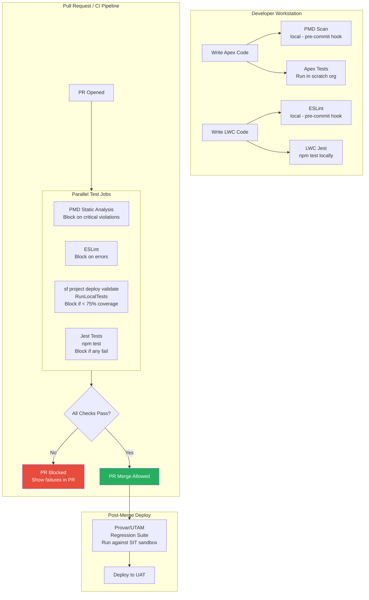

# Automated Testing Tools for Salesforce

## Overview / Context

The Salesforce testing ecosystem extends well beyond Apex unit tests. A mature Salesforce program uses a layered toolchain: Apex unit tests for backend logic, LWC Jest for frontend components, static analysis tools to catch code quality issues before they become bugs, and UI test automation tools for end-to-end browser-based testing. Architects who understand this toolchain can design a complete quality gate — one where problems are caught at the lowest-cost, earliest-possible layer.

The tool selection conversation is increasingly relevant as customers invest in DevOps maturity. When a customer asks "what tools do we need for automated testing?", they often think about Apex only. Architects who can introduce Jest, PMD, ESLint, and Provar as part of a comprehensive toolchain are delivering significantly more value than those who answer "just write Apex tests."

On the exam, automated testing tools appear as secondary-level questions: you need to know what each tool does, when to use it, and how it integrates into a CI/CD pipeline. You won't be asked to write Jest test code from memory, but you will be asked "what tool would test an LWC component in isolation?" or "what tool performs static analysis on Apex code?"

## Foundations

Automated testing means that tests run without a human manually executing them. Instead of a QA engineer clicking through the application step by step, automated tests run via scripts — often triggered automatically on every code change, in a CI/CD pipeline, within seconds of a developer pushing code to Git.

Automation matters because speed and scale. A QA team of 5 people can manually test maybe 100 scenarios per day. An automated test suite can run 10,000 tests in 20 minutes. The more of your testing you can automate, the faster your feedback cycle and the lower your risk.

Different layers of the application require different testing tools because different layers are technically different. Apex backend code runs on the Salesforce server and is tested with Apex test methods. Lightning Web Components run in the browser and are tested with JavaScript testing frameworks (Jest). End-to-end browser flows involve a real browser navigating the UI, which requires browser automation tools (Selenium, UTAM, Provar).

Static analysis tools are a different category — they don't run the code at all. Instead, they analyze the source code for patterns that are known to cause problems: security vulnerabilities, performance issues, code style violations, or complexity indicators. Think of static analysis as automated code review that runs in seconds and catches a class of issues that human code reviewers often miss.

---

## Core Concepts / Framework

### Apex Unit Testing — The Built-In Foundation

(Covered in depth in Lecture 10 — summary here for toolchain context)

**Key characteristics:**
- Built into the Salesforce platform — no external tool required
- `@isTest` annotation marks test classes
- `Test.startTest()` / `Test.stopTest()` for async testing
- HttpCalloutMock for external service simulation
- Integrated into deployment pipeline (test level flags)
- JUnit XML output supported for CI reporting

**CI integration:**
```bash
sf apex test run \
  --test-level RunLocalTests \
  --output-dir test-results/ \
  --result-format junit \
  --target-org CISandbox \
  --code-coverage
```

The `--result-format junit` flag produces XML that GitHub Actions, Jenkins, and most CI platforms can parse and display as test results.

### LWC Jest Testing

LWC (Lightning Web Component) components are JavaScript, and they're tested with Jest — the industry-standard JavaScript testing framework.

**What LWC Jest tests:**
- Component rendering (does the component render the expected HTML?)
- User interactions (button clicks, input changes)
- Wire service data (mock Salesforce data)
- Custom events (does the component fire and handle events correctly?)
- Error states (what happens when wire data returns an error?)

**Setup:**
```bash
# Install Jest + LWC Jest utilities
npm install @salesforce/lwc-jest --save-dev

# Run tests
npm test
# or: npx jest
```

**package.json configuration:**
```json
{
  "scripts": {
    "test:unit": "lwc-jest"
  },
  "jest": {
    "testPathPattern": "/__tests__/",
    "moduleNameMapper": {
      "^@salesforce/apex$": "<rootDir>/jest-mocks/apex.js",
      "^lightning/(.*)$": "<rootDir>/jest-mocks/lightning/$1.js"
    }
  }
}
```

**LWC Jest test example:**
```javascript
// force-app/main/default/lwc/accountCard/__tests__/accountCard.test.js

import { createElement } from 'lwc';
import AccountCard from 'c/accountCard';
import { registerApexTestWireAdapter } from '@salesforce/lwc-jest';
import getAccount from '@salesforce/apex/AccountController.getAccount';

const mockGetAccount = registerApexTestWireAdapter(getAccount);

describe('c-account-card', () => {
    afterEach(() => {
        while (document.body.firstChild) {
            document.body.removeChild(document.body.firstChild);
        }
    });

    it('displays account name', () => {
        const element = createElement('c-account-card', {
            is: AccountCard
        });
        document.body.appendChild(element);
        
        // Emit mock wire data
        mockGetAccount.emit({
            Id: '001000000000001',
            Name: 'Acme Corp',
            Industry: 'Technology'
        });
        
        return Promise.resolve().then(() => {
            const nameElement = element.shadowRoot.querySelector('p.account-name');
            expect(nameElement.textContent).toBe('Acme Corp');
        });
    });

    it('handles wire error gracefully', () => {
        const element = createElement('c-account-card', {
            is: AccountCard
        });
        document.body.appendChild(element);
        
        // Emit wire error
        mockGetAccount.error();
        
        return Promise.resolve().then(() => {
            const errorElement = element.shadowRoot.querySelector('p.error');
            expect(errorElement).not.toBeNull();
        });
    });
});
```

**Wire adapter mocking:**
Wire adapters (like `@wire(getAccount)`) are replaced in Jest tests with test adapters that allow you to emit mock data or errors. This lets you test component behavior without making real Salesforce callouts.

**Component mocking:**
Child Lightning base components (like `lightning-button`, `lightning-input`) are mocked automatically by the LWC Jest utilities. You test your component's behavior without testing Lightning's built-in components.

### Selenium / WebDriver for UI Testing — Limitations

Selenium is the most widely known browser automation framework. It automates browser interactions (clicking, typing, form submission) and verifies UI behavior.

**Limitations in Salesforce context:**

| Challenge | Why It's a Problem |
|---|---|
| Dynamic DOM IDs | Salesforce generates dynamic IDs that change between page loads — standard Selenium locators break |
| Shadow DOM | LWC uses Shadow DOM; standard Selenium can't pierce shadow roots without special handling |
| Namespace prefixes | Custom components have namespace prefixes that vary between orgs |
| Salesforce UI versions | LEX updates can change component structure without notice |
| Performance | Salesforce pages are complex; UI tests are slow and brittle |

**Result:** Vanilla Selenium is not a recommended tool for Salesforce UI testing. Use Salesforce-specific tools (UTAM, Provar) instead.

### Provar — Salesforce-Native Test Automation

Provar is the most widely-used Salesforce-specific UI test automation tool. It was built specifically for Salesforce and handles the challenges that break generic Selenium tests.

**Key features:**
- **Salesforce-aware locators:** Understands Salesforce DOM structure; doesn't rely on fragile IDs
- **Self-healing locators:** When Salesforce UI changes, Provar's locators adapt automatically (in Pro tier)
- **Record type and layout awareness:** Test scripts adapt to different record types and page layouts
- **Data management:** Built-in test data setup and teardown
- **CI/CD integration:** Can run headlessly via command line; integrates with Jenkins, GitHub Actions
- **Cross-environment support:** Same test script runs across multiple sandboxes

**When to use Provar:**
- Regression testing of complex end-to-end user scenarios
- UAT script automation
- Release smoke testing
- Multi-browser compatibility testing

**Cost consideration:** Provar is a paid third-party tool. For exam purposes, know what it does and when to recommend it. Don't assume every customer should have it.

### Copado Robotic Testing

Copado Robotic Testing (formerly Panaya Test Dynamix) is the Salesforce DevOps-integrated test automation layer.

**Key features:**
- Integrated with Copado pipeline
- Self-healing locators
- AI-assisted test maintenance
- Native Salesforce test data management
- Visual test recording (codeless test creation)

**When to recommend:** Teams already using Copado as their DevOps platform benefit from tight integration. For teams using other DevOps tools, Provar or UTAM may be more appropriate.

### UTAM — Salesforce's Own UI Test Automation Model

UTAM (UI Test Automation Model) is Salesforce's open-source framework for UI testing. Unlike Provar, it's free and built by Salesforce.

**How UTAM works:**
UTAM uses "Page Objects" — abstractions that describe UI components and their interactions. This separates test logic from component structure:

```javascript
// Page Object for Account Detail page
{
  "implements": "utam-salesforce/pageObjects/force/record",
  "type": "page",
  "elements": [
    {
      "name": "accountName",
      "type": "utam-salesforce/pageObjects/base/labeledField",
      "selector": { "css": ".accountName" }
    }
  ],
  "methods": [
    {
      "name": "getAccountName",
      "compose": [
        { "element": "accountName", "apply": "getText" }
      ]
    }
  ]
}
```

**Benefits over Selenium:**
- Shadow DOM-aware by design
- Salesforce component library has pre-built page objects
- Test scripts are more stable (page objects encapsulate locator logic)
- Free and open source

**Limitation:** Steeper learning curve than Provar; less visual tooling.

### PMD — Static Analysis for Apex

PMD is the primary static analysis tool for Apex code. It analyzes Apex source code for common issues without running the code.

**What PMD detects:**
| Rule Category | Examples |
|---|---|
| Best Practices | Avoid global modifiers where not needed, use constants |
| Design | Avoid deeply nested code, method too complex, class too long |
| Performance | SOQL in loops (critical!), DML in loops (critical!), excessive queries |
| Security | Avoid hardcoded credentials, insecure endpoint |
| Error Prone | Empty catch blocks, null reference risks |
| Code Style | Naming conventions, comment requirements |

**Critical rules for Salesforce:**
- **AvoidSoqlInLoops:** SOQL queries inside loops are a governor limit violation waiting to happen
- **AvoidDmlInLoops:** Same for DML operations
- **ApexSOQLInjection:** Detect potential SOQL injection vulnerabilities
- **ApexXSSFromURLParam:** Detect XSS vulnerabilities from URL parameters

**CI integration (PMD command line):**
```bash
# Install PMD
# Download from https://pmd.github.io/

# Run PMD against Apex classes
pmd check \
  --dir force-app/main/default/classes \
  --rulesets category/apex/bestpractices.xml,category/apex/performance.xml,category/apex/security.xml \
  --format xml \
  --report-file pmd-results.xml \
  --fail-on-violation true
```

**CI gate strategy:**
- Block PR on Critical severity PMD violations (SOQL in loops, DML in loops, security issues)
- Warn (but don't block) on Medium violations
- Report Low violations for developer information

### ESLint for LWC

ESLint is the standard JavaScript/TypeScript linter, extended with Salesforce-specific rules for LWC.

**@salesforce/eslint-config-lwc:**
A Salesforce-maintained ESLint configuration specifically for LWC:

```bash
# Install
npm install @salesforce/eslint-config-lwc --save-dev
```

**.eslintrc.json:**
```json
{
  "extends": ["@salesforce/eslint-config-lwc/recommended"],
  "rules": {
    "no-console": "warn",
    "no-unused-vars": "error"
  }
}
```

**What ESLint catches for LWC:**
- Incorrect use of `@wire` decorators
- Invalid event naming conventions
- Missing error handling in async methods
- Accessibility violations (with additional plugins)
- JavaScript best practices violations

**CI integration:**
```bash
# Run ESLint as part of CI
npx eslint force-app/main/default/lwc
```

### Test Result Reporting — JUnit XML for CI

All major CI platforms (GitHub Actions, Jenkins, GitLab CI) understand JUnit XML format for test result reporting. Salesforce tools can output to this format.

**GitHub Actions JUnit reporter:**
```yaml
- name: Run Apex Tests
  run: |
    sf apex test run \
      --test-level RunLocalTests \
      --result-format junit \
      --output-dir test-results \
      --target-org ${{ env.SF_TARGET_ORG }}

- name: Publish Test Results
  uses: EnricoMi/publish-unit-test-result-action@v2
  if: always()
  with:
    files: test-results/**/*.xml
```

This makes test results visible in the GitHub PR — pass/fail, individual test names, failure messages — without having to read log output.

---

## PTA / SA Relevance

### Parallels to Daily Advisory Work

Tool selection conversations:
- **LWC adoption programs:** When a customer migrates from Aura to LWC, they should also set up Jest testing for new LWC components. Architects who recommend LWC migration without recommending Jest adoption are leaving quality on the table.
- **DevOps tool evaluations:** Provar, UTAM, Copado Robotic Testing — each has a positioning. The architect's role is to map the customer's needs (team size, budget, existing DevOps stack, test complexity) to the right tool.
- **Security reviews:** PMD with security rulesets should be part of every Salesforce program's CI gate. Customers in regulated industries need documented evidence that code is scanned for security vulnerabilities before production.

### How to Use This in Customer Engagements

**Recommended toolchain by maturity level:**

| Maturity | Backend Tests | Frontend Tests | Static Analysis | UI Automation |
|---|---|---|---|---|
| Basic | Apex unit tests | None | None | None |
| Developing | Apex unit tests | LWC Jest | PMD | Manual only |
| Mature | Apex unit tests | LWC Jest | PMD + ESLint | UTAM or Provar |
| Optimized | Full test pyramid | LWC Jest | PMD + ESLint + custom | Provar + CI integration |

**Tool cost comparison for budget conversations:**
- Apex: Built-in, free
- LWC Jest: Open source, free
- PMD: Open source, free
- ESLint + LWC plugin: Open source, free
- UTAM: Open source, free
- Provar: Licensed, ~$150-300/user/month
- Copado Robotic Testing: Bundled with Copado, ~$30-100/user/month

For most customers, the "free" tier (Apex + Jest + PMD + ESLint) provides 80% of the quality benefit at 0% of the licensing cost.

---

## Architecture / Scenario

### Automated Testing Toolchain Diagram



---

## Key Principles to Apply

- **Jest for LWC is as mandatory as Apex tests for Apex.** A program that has 90% Apex coverage but no LWC Jest tests has an untested frontend. LWC logic bugs are real bugs.
- **Static analysis is not optional — it's the cheapest form of bug prevention.** A PMD scan that takes 30 seconds in CI catches SOQL-in-loops and security issues that would otherwise reach production. The cost-benefit is unambiguous.
- **Don't use generic Selenium for Salesforce UI testing.** The dynamic DOM and Shadow DOM in Salesforce LEX will break standard Selenium locators constantly. Use UTAM or Provar.
- **Test result reporting in JUnit format makes quality visible.** Engineers shouldn't have to dig through log output to understand test results. JUnit XML parsed by CI platforms gives immediate, visible feedback in PRs.
- **Tool selection should match team capability.** Provar is powerful but requires training and maintenance. UTAM is free but requires engineering investment. Match the tool to the team's capacity to use and maintain it.
- **Pre-commit hooks for static analysis accelerate feedback.** Running PMD/ESLint as a Git pre-commit hook catches issues before they're pushed, rather than waiting for CI. The faster the feedback, the cheaper the fix.
- **Mock coverage ≠ real coverage.** Jest tests with mocked wire adapters verify component logic but not the actual data. Supplement with integration and system tests that use real data flows.
- **Test coverage measurement across all layers.** Org-wide Apex coverage (from Salesforce) + Jest coverage report (from Jest --coverage) + static analysis pass rate — all three are leading indicators of quality.

---

## Common Mistakes (Exam Candidates + Customers)

1. **Not knowing that LWC testing requires Jest.** The exam tests whether you know the right tool for the layer. "I'd write an Apex test to test an LWC component" is wrong. LWC is JavaScript; test it with Jest.

2. **Thinking UTAM and Provar are the same type of tool as Apex tests.** They're UI automation tools, not unit testing tools. They test browser-rendered end-to-end flows, not isolated class/component behavior.

3. **Recommending Selenium for Salesforce UI testing.** Know the limitations: Shadow DOM, dynamic IDs, namespace prefixes. The correct answer for Salesforce UI automation is UTAM, Provar, or Copado Robotic Testing.

4. **Not configuring PMD to run in CI.** Teams that only run PMD locally (when developers remember) miss the opportunity to make static analysis a gate. It must be in CI to be governance.

5. **Running Jest without wire adapter mocks.** LWC components that use `@wire` decorators will fail in Jest tests unless wire adapters are mocked. Not setting up the mock infrastructure is a common Jest setup mistake.

6. **Thinking ESLint LWC rules are the same as standard ESLint rules.** The `@salesforce/eslint-config-lwc` package adds Salesforce-specific rules. Using only standard ESLint without the LWC plugin misses Salesforce-specific issues.

7. **Not using `--coverage` flag in Jest for CI coverage reporting.** Without the coverage flag, Jest runs tests but doesn't produce a coverage report. For CI quality gates, you need the coverage data.

8. **Using Provar for unit testing use cases.** Provar is for end-to-end UI flows. Using it to test individual component behavior is like using a sledgehammer for a finishing nail — slow, expensive, and wrong for the job.

---

## Practice Questions / Scenario Exercises

**Question 1**
A development team has built a Lightning Web Component that uses a wire adapter to fetch account data and displays it in a card format. What tool and approach should the QA strategy include for testing this component in isolation?

A. Apex unit test that calls the AccountController Apex class  
B. Provar UI test that navigates to the Account record page in a sandbox  
C. LWC Jest test that mounts the component, uses a wire adapter mock to emit test data, and asserts on the rendered output  
D. A manual test script run by a QA engineer in a Developer sandbox

**Answer: C**
LWC components are JavaScript; they require JavaScript testing tools. Jest with wire adapter mocking allows you to test the component's rendering logic in isolation — without a Salesforce org, without real data, and very fast. Option A (Apex unit test) tests the server-side controller, not the component. Option B (Provar) is an end-to-end test, not an isolation test. Option D (manual) is not automated testing.

---

**Question 2**
A CI pipeline fails with "PMD: Critical violation - Avoid SOQL in loops (line 47, AccountService.cls)". The team wants to disable this rule to fix the pipeline quickly. How should the architect respond?

A. Add the class to .forceignore to exclude it from PMD analysis  
B. Disable the SOQL-in-loops rule globally in the PMD configuration — it produces false positives  
C. Fix the SOQL query to be outside the loop using a Map pattern — this violation represents a real governor limit risk  
D. Mark the pipeline as passing despite the violation for this sprint and fix it next sprint

**Answer: C**
SOQL in loops is one of the most common causes of governor limit exceptions in Salesforce. With 200+ records in a trigger batch, a SOQL query inside a loop can easily exceed the 100 SOQL queries per transaction limit. The PMD violation is not a false positive — it's identifying a real architectural bug. The fix is to move the SOQL query outside the loop and use a Map/Set to correlate records. Options A, B, and D are all forms of hiding a real problem rather than fixing it.

---

**Question 3**
An enterprise customer is evaluating UI test automation tools for their Salesforce implementation. Their requirements are: (1) self-healing locators for LEX updates, (2) integration with their existing Copado pipeline, (3) no-code test recording for business analysts, (4) manageable licensing cost. Which tool best fits these requirements?

A. Selenium WebDriver with custom XPath locators  
B. UTAM (UI Test Automation Model)  
C. Copado Robotic Testing (formerly Panaya)  
D. Apex test methods with SOQL verification

**Answer: C**
Copado Robotic Testing checks all boxes: self-healing locators (requirement 1), native Copado pipeline integration (requirement 2), visual codeless test recording for business analysts (requirement 3), and is bundled with Copado licensing (manageable cost, requirement 4). Option A (Selenium) lacks self-healing locators and has Shadow DOM issues. Option B (UTAM) is free but requires engineering effort to write page objects — no codeless recording for business analysts. Option D is not a UI tool.
