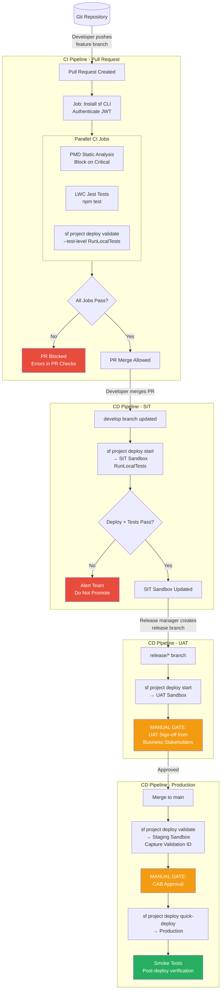

# CI/CD Pipeline Design for Salesforce

## Overview / Context

CI/CD pipeline design is the capstone architectural skill of this certification. It integrates every other topic — source control, environments, deployment mechanisms, testing strategy, release management — into a cohesive automated delivery system. A well-designed pipeline is the difference between a team that releases with confidence and a team that dreads every deployment.

At the architect level, CI/CD design is not about knowing specific YAML syntax — it's about understanding the principles that make pipelines work: gate placement, failure isolation, rollback strategy, environment mapping, and the balance between speed and safety. When you design a CI/CD pipeline for a customer, you're making decisions about what quality gates to enforce, what environments to deploy through, and what automation to trust versus what human judgment to require.

On the exam, CI/CD questions test your understanding of pipeline stages, gate criteria, tool selection, and the relationship between branches and environments. Scenario questions often present a broken pipeline or a customer scenario and ask what the architect should change.

## Foundations

CI/CD stands for Continuous Integration and Continuous Deployment (or Continuous Delivery). These are two related but distinct practices.

**Continuous Integration (CI)** means that every time a developer commits code, an automated system immediately builds and tests that code. The goal is to catch integration problems early — before a developer's work has been sitting in a branch for days and has diverged significantly from everyone else's work. In a CI system, "integration" happens multiple times per day, automatically, rather than once per sprint during a painful manual merge.

**Continuous Deployment (CD)** means that every code change that passes CI is automatically deployed to the next environment. In its strictest form, code that passes all tests is deployed to production automatically, with no human in the loop. In practice, most organizations use "Continuous Delivery" — where deployment is automated and ready but a human makes the final decision to deploy to production.

For Salesforce, CI means: every time a developer pushes code to a feature branch, an automated process validates the deployment against a CI sandbox, runs all Apex tests, runs Jest tests, and reports results. CD means: when code is merged to the develop branch, it's automatically deployed to SIT; when merged to release, to UAT; when merged to main, the pipeline prepares and (optionally) executes a production deployment.

The pipeline is the series of automated steps that code travels through from "written" to "in production." Think of it like an assembly line: code enters one end, passes through quality checks at each station, and emerges at the other end as a production deployment. Any piece that fails a quality check stops on the line — it doesn't move forward until the problem is fixed.

---

## Core Concepts / Framework

### CI vs CD — Definitions and Gate Functions

**Continuous Integration (CI):**
- Triggered by: every push to any branch, or every PR creation
- Goal: catch integration failures early
- Output: pass/fail status posted to the PR
- Gate function: block merges on failure

**Continuous Deployment/Delivery (CD):**
- Triggered by: merge to a protected branch (develop, release, main)
- Goal: advance code through environment stages automatically
- Output: deployment to the next environment in the pipeline
- Gate function: stop advancement on failure, notify team

### Pipeline Stages — Complete Architecture

A production-grade Salesforce CI/CD pipeline has six stages:

```
Source → Build → Validate → Test → Deploy → Verify
```

**Stage 1: Source**
- Trigger: git push / PR opened / merge
- Actions: checkout code, install dependencies (sf CLI, npm), authenticate to orgs
- Gate: authentication success
- Failure: pipeline won't start

**Stage 2: Build**
- Trigger: source stage complete
- Actions: compile (minimal for Salesforce — mostly validation), create deployment package, install package dependencies
- Gate: package compiles, all dependencies resolve
- Failure: block merge / stop pipeline

**Stage 3: Validate**
- Trigger: build stage complete
- Actions: `sf project deploy validate`, test execution, code coverage check
- Gate: deployment validation success + ≥75% code coverage
- Failure: block merge (CI) / stop pipeline (CD), post detailed errors

**Stage 4: Test** (may overlap with Validate stage in some designs)
- Trigger: validation stage complete
- Actions: LWC Jest tests, PMD static analysis, ESLint, security scan
- Gate: all tests pass, no critical static analysis violations
- Failure: block merge, post specific violations

**Stage 5: Deploy**
- Trigger: all previous stages pass
- Actions: `sf project deploy quick-deploy` (using validation ID) or fresh deploy, or `sf package install`
- Gate: deployment completion without errors
- Failure: alert team, trigger rollback procedure

**Stage 6: Verify**
- Trigger: deploy stage complete
- Actions: smoke tests, health checks, key business process spot checks
- Gate: smoke tests pass, monitoring shows normal error rates
- Failure: alert team, initiate rollback evaluation

### Gate Criteria at Each Stage

| Stage | Gate Criterion | On Failure |
|---|---|---|
| Source | Auth success, CLI available | Pipeline blocked from starting |
| Build | Package compiles, dependencies resolve | PR blocked / pipeline stops |
| Validate | Deployment validation success, ≥75% coverage | PR blocked / pipeline stops |
| Test | All unit tests pass, no critical PMD violations | PR blocked / pipeline stops |
| Deploy | Deployment completes without component errors | Alert, evaluate rollback |
| Verify | Smoke tests pass, error rate normal | Alert, evaluate rollback |

### Branch-to-Environment Mapping

The pipeline must map each branch to its corresponding environment:

```
feature/*    → CI scratch org     (validate on PR)
develop      → SIT sandbox        (auto-deploy on merge)
release/*    → UAT sandbox        (auto-deploy on merge, UAT gate is manual)
main/prod    → Staging sandbox    (auto-deploy on merge, manual prod deploy)
hotfix/*     → Staging sandbox    (accelerated path, CAB approval required)
```

**Why this mapping matters:**
- Each environment tests different qualities
- The progression is designed so problems are caught before reaching production-like environments
- The manual gate at UAT ensures business sign-off before production
- Main branch auto-deploys to staging (not production) — humans decide when to take the final step

### Deployment Strategies

**1. Direct Deploy:**
```
sf project deploy start --source-dir force-app --target-org production --test-level RunLocalTests
```
Simple, synchronous (if --wait used). Acceptable for sandboxes; for production, use Validate then Quick Deploy.

**2. Validate then Quick Deploy:**
```bash
# Step 1: Validate (can happen during business hours)
sf project deploy validate --source-dir force-app --target-org production --test-level RunLocalTests
# Save validation ID

# Step 2: Quick Deploy (maintenance window)
sf project deploy quick-deploy --job-id $VALIDATION_ID --target-org production
```
Best practice for production. Tests run during business hours; production change happens in maintenance window.

**3. Package Install:**
```bash
# Build package version
sf package version create --package "My Package" --installation-key $KEY

# Promote to released
sf package version promote --package $PACKAGE_VERSION_ID

# Install in target
sf package install --package $PACKAGE_VERSION_ID --target-org production --installation-key $KEY
```
Used in the package development model. The package version IS the deployment artifact.

### Rollback Strategies

Rollback in Salesforce is more complex than in traditional applications because there is no "undo" button for metadata changes.

**Option 1: Destructive Changes (fastest for known components)**
```xml
<!-- destructiveChanges.xml -->
<?xml version="1.0" encoding="UTF-8"?>
<Package xmlns="http://soap.sforce.com/2006/04/metadata">
    <types>
        <members>BrokenClass</members>
        <name>ApexClass</name>
    </types>
    <version>62.0</version>
</Package>
```
Removes specific components. Only appropriate if the problem was introduced by a new component.

**Option 2: Revert commit + Redeploy (clean and auditable)**
```bash
# Revert the merge commit
git revert -m 1 <merge-commit-hash>
git push origin main

# CI/CD pipeline auto-deploys the revert
```
This is the architecturally preferred approach. The revert is auditable, and the pipeline handles the deployment.

**Option 3: Package version rollback (package model)**
```bash
# Install the previous package version
sf package install --package <previous-version-id> --target-org production
```
Clean, auditable, and fast. This is why package versioning is valuable for rollback.

**Option 4: Fix forward (don't roll back — fix the problem)**
```bash
# Create a hotfix branch, fix the issue, deploy the fix
git checkout -b hotfix/broken-class main
# ... fix ...
git push origin hotfix/broken-class
# Pipeline validates, deploys to staging, manually approve to production
```
When the rollback is more disruptive than the fix (e.g., new deployment would require re-running complex data migrations), fix-forward is appropriate.

**Rollback vs Fix-Forward decision:**

```
Is the defect actively breaking users? → Yes
  Is there a clean rollback available? → Yes → Rollback
  Is rollback more disruptive than fix? → Fix Forward

Is it a data corruption issue? → Yes
  → Rollback immediately, then fix forward with data correction

Is it a performance degradation? → Yes
  → Rollback if severe, Fix Forward if manageable
```

### Pipeline Tools Comparison

| Tool | Type | Best For |
|---|---|---|
| **GitHub Actions** | Native CI/CD (GitHub) | GitHub-hosted repos, free tier, flexible |
| **GitLab CI** | Native CI/CD (GitLab) | GitLab-hosted repos, runners on-prem/cloud |
| **Azure DevOps** | Enterprise CI/CD | Azure/Microsoft ecosystem, on-prem options |
| **Copado** | Salesforce DevOps platform | Full-stack Salesforce DevOps, no-code pipeline |
| **Gearset** | Salesforce DevOps platform | Easy comparison/deploy, good for org model |
| **AutoRABIT** | Salesforce DevOps platform | Enterprise, compliance-heavy environments |
| **Flosum** | Salesforce DevOps platform | Native Salesforce app, no external CI |

**Architect guidance:**
- Small teams, low complexity → Gearset (lowest barrier to entry)
- Medium teams, GitHub users → GitHub Actions + sf CLI
- Enterprise, compliance requirements → Copado or AutoRABIT
- Azure/Microsoft shops → Azure DevOps with sf CLI tasks
- Package-driven, engineering-led → GitHub Actions or GitLab CI

### Build Artifacts for Salesforce Deployments

In traditional software, a "build artifact" is a compiled binary (JAR, Docker image) that is the deployment unit. In Salesforce, artifacts are:

| Artifact Type | Description | Used In |
|---|---|---|
| Source + package.xml | ZIP of metadata files with manifest | Org development model |
| Package version ID (04t...) | Installable package reference | Package development model |
| Validation job ID (0Af...) | Reference to successful validation run | Quick Deploy |
| Delta deploy set | Only changed components since last deploy | Optimized org model pipelines |

**Artifact management:** In org model CI/CD, the deployment artifact is generated fresh from the Git commit for each pipeline run — no artifact registry needed. In package model, the package version ID from `sf package version create` is the artifact, and it should be stored in the pipeline's output/job summary for auditability.

---

## PTA / SA Relevance

### Parallels to Daily Advisory Work

CI/CD design is one of the highest-value advisory conversations PTAs have:
- **Digital transformation programs:** Moving from quarterly manual releases to weekly automated deployments is a transformation goal for many large Salesforce customers. The pipeline design is the technical centerpiece.
- **DevOps tool evaluations:** Copado vs Gearset vs home-built — the tool selection framework (team size, complexity, budget, stack) comes directly from this domain.
- **Pipeline reviews in delivery health assessments:** "Walk me through your deployment pipeline" is a standard health check question. The quality of the answer tells you the delivery risk level.
- **Program rescue engagements:** Programs in trouble often have broken or missing CI/CD pipelines. Fixing the pipeline is frequently the highest-leverage intervention.

### How to Use This in Customer Engagements

**Pipeline maturity assessment:**
1. No pipeline (change sets / manual) → High risk
2. Basic CI (validate on PR) → Low risk for regression
3. CI + CD to sandboxes → Medium maturity
4. Full CI/CD with smoke tests and rollback procedures → High maturity
5. Pipeline + security scans + performance gates + full observability → Optimized

**The "should we buy or build?" conversation:**
- Copado/Gearset/AutoRABIT are "buy" options: faster time to value, less engineering investment, but licensing cost and vendor dependency
- GitHub Actions / sf CLI is "build": more flexible, lower cost, but requires engineering investment to set up and maintain
- For < 10 developers: Gearset or Copado (buy)
- For > 10 developers with a DevOps engineer: GitHub Actions (build)
- For enterprise compliance: AutoRABIT or Copado Enterprise (buy, with enterprise SLAs)

---

## Architecture / Scenario

### Full CI/CD Pipeline Flow



---

## Key Principles to Apply

- **The pipeline enforces the architecture.** Branch protection rules + required status checks make the pipeline governance-as-code. It's enforced by tooling, not by trust.
- **Every environment transition needs a gate.** Dev → SIT: automated tests. SIT → UAT: integration tests. UAT → Staging: business sign-off. Staging → Production: CAB approval. Gaps in gates are gaps in quality.
- **Quick Deploy is the production deployment strategy.** Separate validation from deployment. Never run 45-minute test suites during a 1 AM maintenance window. Validate during business hours, quick deploy during the window.
- **Rollback by revert commit + redeploy is the clean approach.** A Git revert is auditable, reversible, and triggers the normal pipeline. Avoid direct production manipulation when the pipeline can handle rollback.
- **Pipeline visibility is as important as pipeline function.** Developers need to see test results in their PRs, not in external tools. Post results as PR checks, not just to a log file.
- **Tools are interchangeable; principles are not.** Whether you use GitHub Actions, GitLab CI, or Azure DevOps, the pipeline stages, gates, and strategies are the same. Evaluate tools against these requirements.
- **Pipeline as code is non-negotiable.** Store pipeline configuration (YAML, Jenkinsfile, etc.) in the same Git repository as the Salesforce source. Pipeline changes go through the same PR review process as code changes.
- **Monitor pipeline performance.** A pipeline that takes 45 minutes discourages frequent commits. Aim for < 15 minutes for CI validation. Use parallel jobs, caching, and test selection optimization to stay fast.

---

## Common Mistakes (Exam Candidates + Customers)

1. **No gate between CI (PR) and CD (deploy to SIT).** Without requiring PR approval + CI pass before merging, broken code reaches SIT sandbox, contaminating the integration environment.

2. **Using RunAllTestsInOrg in the PR validation pipeline.** This includes managed package tests that can take hours. PR validation should use RunLocalTests for speed; RunAllTests is for release gates only.

3. **Not storing the validation job ID for Quick Deploy.** If the validate step doesn't capture and store the validation ID, the quick deploy step can't use it. This must be explicitly handled in the pipeline YAML.

4. **Deploying to production without a staging gate.** Production deployments should always be preceded by a staging environment validation. Deploying directly from develop → production skips the final environment sanity check.

5. **Building pipeline stages sequentially when they can be parallel.** PMD scan, ESLint check, and Jest tests are independent. Running them in parallel vs. sequential can cut CI time by 60-70%.

6. **Not handling async deployment completion.** The `sf project deploy start` command without `--wait` returns immediately. Pipelines that don't wait for completion report false success.

7. **Brittle pipelines with hard-coded org URLs.** Pipeline configurations that hard-code sandbox URLs or usernames break every time a sandbox is refreshed. Use environment variables and CI secrets for all org-specific configuration.

8. **No alerting on pipeline failure.** If no one gets notified when a CD pipeline fails (SIT deployment breaks), the broken state persists until someone manually checks the pipeline. Configure Slack/Teams alerts on CD failures.

---

## Practice Questions / Scenario Exercises

**Question 1**
A team wants to prevent any code with SOQL queries inside for loops from reaching the develop branch. They currently have no automated code quality checks. What is the most effective way to implement this gate?

A. Add a code review checklist requirement in GitHub requiring reviewers to check for SOQL in loops  
B. Configure a PMD static analysis step in the PR CI pipeline that fails on `AvoidSoqlInLoops` violations  
C. Create a custom Apex class that scans for SOQL in loops before deployment  
D. Rely on Salesforce governor limit exceptions to surface SOQL-in-loops issues in test execution

**Answer: B**
PMD with the `AvoidSoqlInLoops` rule is the purpose-built solution. It runs automatically in CI, checks every PR, and blocks merge on violation — exactly what the requirement asks for. Option A (manual checklist) depends on reviewer discipline and is error-prone. Option C is reinventing a wheel that exists. Option D relies on tests catching the issue, but governor limit violations may not surface in test data volumes that differ from production.

---

**Question 2**
A customer's production deployment takes 2 hours because the test suite runs during the deployment window (midnight Saturday). This violates their 1-hour maintenance window SLA. What pipeline architecture change should the architect recommend?

A. Reduce the number of tests to fit in the 1-hour window  
B. Switch from RunLocalTests to RunSpecifiedTests to run fewer tests  
C. Implement a validate-then-quick-deploy strategy: validate with RunLocalTests during business hours (Friday), quick deploy during the maintenance window  
D. Deploy to production without running tests, then run tests as a post-deploy verification step

**Answer: C**
Quick Deploy uses the validation ID from a prior successful validation run and skips re-running tests. Validate on Friday with RunLocalTests (takes 2 hours), capture the validation ID, and then Quick Deploy on Saturday night (takes 5-10 minutes for just the component commit). This meets the 1-hour window. Option A (fewer tests) is dangerous — removing tests to hit a time window creates quality risk. Option B (RunSpecifiedTests) may not qualify for Quick Deploy. Option D cannot deploy without tests to production.

---

**Question 3**
After a production deployment, smoke tests reveal a critical bug: a validation rule is preventing all new Opportunity creation. The release manager needs to restore functionality within 15 minutes. What is the fastest safe path?

A. Disable the validation rule directly in production Setup  
B. Create a hotfix branch, revert the validation rule change, run it through the full CI/CD pipeline  
C. Revert the merge commit in Git — the pipeline will automatically detect this and deploy the revert to production  
D. Roll back using the change set that contained the original deployment

**Answer: A**
In a 15-minute window, running the full CI/CD pipeline is too slow (validation + tests alone take much longer). The fastest safe action is disabling the validation rule directly in production Setup — a reversible action that immediately restores Opportunity creation. Simultaneously, the team creates a hotfix branch to fix the rule properly. Then Option B follows as the permanent fix. Option C is correct in principle but too slow for 15 minutes. Option D assumes a change set was used; if the pipeline was used, there's no such change set.

*Note: This question tests the judgment that "fastest safe" sometimes means bypassing the pipeline for an emergency, then going back through the pipeline for the permanent fix.*
