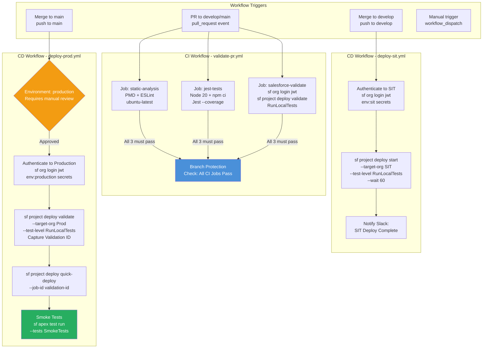

# GitHub Actions for Salesforce CI/CD

## Overview / Context

GitHub Actions is the most widely adopted CI/CD platform for Salesforce implementations as of 2024. Its tight integration with GitHub repositories, generous free tier for public repos and reasonable pricing for private repos, and large marketplace of reusable Actions make it the default choice for teams building Salesforce DevOps pipelines. Understanding GitHub Actions architecture at the depth needed to design, build, and troubleshoot Salesforce pipelines is an architect-level skill that the exam tests directly.

The exam tests GitHub Actions not for YAML syntax memorization, but for architectural understanding: what triggers workflows, how jobs relate to each other, how secrets are managed, how Salesforce authentication works in headless CI, and how branch protection rules enforce the governance model. These are decisions architects make when designing the pipeline, not when writing the YAML line by line.

At the advisory level, GitHub Actions is the platform that powers the principles from the previous lectures. JWT auth, quick deploy, validate-then-deploy, package promotion — all of these are implemented as GitHub Actions workflow steps. Knowing the architecture bridges theory and implementation.

## Foundations

GitHub Actions is an automation platform built into GitHub. It allows you to define workflows — sequences of automated steps — that run in response to GitHub events. When a developer opens a Pull Request, that's an event. When code is merged to the main branch, that's an event. When a developer manually clicks "Run workflow", that's an event. GitHub Actions lets you respond to any of these events by running scripts in a virtual machine that GitHub manages.

A workflow is defined in a YAML file stored in the `.github/workflows/` directory of your repository. When the trigger event occurs, GitHub allocates a fresh virtual machine (called a "runner"), runs the steps you defined, and reports the results back to GitHub — where they appear as "checks" on Pull Requests or as status indicators on commits.

For Salesforce, workflows typically do things like: install the Salesforce CLI, authenticate to a Salesforce org, run deployment validation, run Apex tests, and report results. The virtual machine doesn't know anything about Salesforce by default — you have to install the tools and authenticate in each workflow run. This is different from a developer's workstation where you stay logged in — every CI run starts fresh.

The freshness is actually a feature. Because each workflow run starts from scratch (fresh VM, no residual state from previous runs), you get reproducible, clean execution of your pipeline. A test failure in CI is always about the code, never about "stale state on the CI machine." This determinism is one of the most valuable properties of CI/CD.

---

## Core Concepts / Framework

### GitHub Actions Fundamentals

**Core concepts:**

| Concept | Description |
|---|---|
| **Workflow** | A YAML file defining automation; triggered by events |
| **Event** | What triggers the workflow (push, pull_request, workflow_dispatch, schedule) |
| **Job** | A set of steps that runs on one runner (VM) |
| **Step** | A single task within a job (run a command, use an Action) |
| **Runner** | The VM that executes a job (GitHub-hosted or self-hosted) |
| **Action** | A reusable step (from GitHub Marketplace or your own repo) |
| **Secret** | Encrypted environment variable stored in GitHub repository settings |
| **Environment** | Named deployment target with required reviewers and protection rules |

**Workflow structure:**
```yaml
name: Salesforce CI/CD

on:                           # Trigger events
  push:
    branches: [main, develop]
  pull_request:
    branches: [main, develop]
  workflow_dispatch:          # Manual trigger

jobs:
  job-name:                   # Job ID
    runs-on: ubuntu-latest    # Runner type
    steps:
      - name: Step description
        run: echo "command"
```

**Trigger events for Salesforce workflows:**

| Event | When It Fires | Salesforce Use Case |
|---|---|---|
| `push` | On any push to specified branches | CD: Auto-deploy on merge |
| `pull_request` | On PR open/update | CI: Validate on PR |
| `workflow_dispatch` | Manual button in GitHub UI | Manual production deploy trigger |
| `schedule` | Cron schedule | Nightly regression test run |
| `release` | When a release is created | Release-based deployment trigger |

### Salesforce CI Authentication — JWT Flow

JWT authentication is required for headless CI. The complete setup:

**Step 1: Generate certificate and key (one-time setup):**
```bash
# Generate private key
openssl genrsa -out server.key 4096

# Generate certificate signing request
openssl req -new -key server.key -out server.csr \
  -subj "/C=US/ST=CA/O=MyCompany/CN=salesforce-ci"

# Self-sign the certificate (valid for 1 year)
openssl x509 -req -sha256 -days 365 \
  -in server.csr -signkey server.key -out server.crt
```

**Step 2: Create Connected App in Salesforce:**
- Setup → Apps → App Manager → New Connected App
- Enable OAuth Settings
- Upload `server.crt` in "Digital Certificate"
- Enable "Use digital signatures"
- OAuth Scopes: Full access or api + web + refresh_token
- Enable "Require Secret for Web Server Flow"
- Note the Consumer Key (Client ID)

**Step 3: Pre-authorize the CI user:**
- Manage Connected App → Edit Policies
- Permitted Users: "Admin approved users are pre-authorized"
- Add the CI/CD service account user to the Connected App permission set

**Step 4: Store secrets in GitHub:**
```
Repository → Settings → Secrets and variables → Actions → New repository secret:

SF_JWT_SECRET_KEY     = (contents of server.key file)
SF_CLIENT_ID          = (Connected App Consumer Key)
SF_USERNAME           = deployer@mycompany.com
SF_INSTANCE_URL       = https://login.salesforce.com
                        (or https://test.salesforce.com for sandbox)
```

**Step 5: Use in workflow:**
```yaml
- name: Authenticate to Salesforce
  run: |
    echo "${{ secrets.SF_JWT_SECRET_KEY }}" > server.key
    sf org login jwt \
      --client-id "${{ secrets.SF_CLIENT_ID }}" \
      --jwt-key-file server.key \
      --username "${{ secrets.SF_USERNAME }}" \
      --instance-url "${{ secrets.SF_INSTANCE_URL }}" \
      --alias TargetOrg
    rm server.key  # Clean up key file immediately
```

### Complete Salesforce GitHub Actions Workflow

**validate-pr.yml — CI workflow for Pull Requests:**
```yaml
name: Validate Pull Request

on:
  pull_request:
    branches:
      - main
      - develop
    paths:
      - 'force-app/**'      # Only run if Salesforce source changed
      - 'package.json'

jobs:
  static-analysis:
    name: Static Code Analysis
    runs-on: ubuntu-latest
    steps:
      - uses: actions/checkout@v4
      
      - name: Install PMD
        run: |
          PMD_VERSION=7.0.0
          wget https://github.com/pmd/pmd/releases/download/pmd_releases%2F${PMD_VERSION}/pmd-dist-${PMD_VERSION}-bin.zip
          unzip pmd-dist-${PMD_VERSION}-bin.zip -d $HOME/pmd
          echo "$HOME/pmd/pmd-bin-${PMD_VERSION}/bin" >> $GITHUB_PATH

      - name: Run PMD Apex Analysis
        run: |
          pmd check \
            --dir force-app/main/default/classes \
            --rulesets category/apex/bestpractices.xml,category/apex/performance.xml \
            --format sarif \
            --report-file pmd-results.sarif \
            --fail-on-violation true
        continue-on-error: false

  jest-tests:
    name: LWC Jest Tests
    runs-on: ubuntu-latest
    steps:
      - uses: actions/checkout@v4
      
      - name: Setup Node.js
        uses: actions/setup-node@v4
        with:
          node-version: '20'
          cache: 'npm'          # Cache npm dependencies
      
      - name: Install dependencies
        run: npm ci
      
      - name: Run Jest Tests
        run: npm test -- --coverage --coverageReporters=json-summary --ci

  salesforce-validate:
    name: Salesforce Validate Deployment
    runs-on: ubuntu-latest
    steps:
      - uses: actions/checkout@v4
      
      - name: Install Salesforce CLI
        run: npm install -g @salesforce/cli@latest
      
      - name: Authenticate to CI Sandbox
        run: |
          echo "${{ secrets.SF_JWT_SECRET_KEY_SIT }}" > server.key
          sf org login jwt \
            --client-id "${{ secrets.SF_CLIENT_ID_SIT }}" \
            --jwt-key-file server.key \
            --username "${{ secrets.SF_USERNAME_SIT }}" \
            --instance-url "https://test.salesforce.com" \
            --alias SITSandbox
          rm server.key
      
      - name: Validate Deployment
        id: validate
        run: |
          # Run validation and capture output
          RESULT=$(sf project deploy validate \
            --source-dir force-app \
            --target-org SITSandbox \
            --test-level RunLocalTests \
            --json)
          
          echo "$RESULT" > deploy-result.json
          
          # Extract job ID for potential quick deploy
          JOB_ID=$(echo "$RESULT" | jq -r '.result.id')
          echo "validation-id=$JOB_ID" >> $GITHUB_OUTPUT
          echo "Validation ID: $JOB_ID"
      
      - name: Upload Validation Result
        uses: actions/upload-artifact@v4
        if: always()
        with:
          name: deploy-results
          path: deploy-result.json

  # All jobs must pass for PR to be mergeable (configured in branch protection)
```

**deploy-main.yml — CD workflow for production deployment:**
```yaml
name: Deploy to Production

on:
  workflow_dispatch:         # Manual trigger with parameters
    inputs:
      target-org:
        description: 'Target org alias'
        required: true
        default: 'production'
      use-quick-deploy:
        description: 'Use quick deploy with validation ID'
        type: boolean
        default: false
      validation-id:
        description: 'Validation ID for quick deploy'
        required: false

jobs:
  validate-staging:
    name: Validate Against Staging
    runs-on: ubuntu-latest
    environment: staging      # Requires reviewer approval
    outputs:
      validation-id: ${{ steps.validate.outputs.validation-id }}
    
    steps:
      - uses: actions/checkout@v4
      
      - name: Install Salesforce CLI
        run: npm install -g @salesforce/cli@latest
      
      - name: Authenticate to Staging
        run: |
          echo "${{ secrets.SF_JWT_SECRET_KEY_STAGING }}" > server.key
          sf org login jwt \
            --client-id "${{ secrets.SF_CLIENT_ID_STAGING }}" \
            --jwt-key-file server.key \
            --username "${{ secrets.SF_USERNAME_STAGING }}" \
            --instance-url "https://test.salesforce.com" \
            --alias StagingSandbox
          rm server.key
      
      - name: Validate Deployment
        id: validate
        run: |
          OUTPUT=$(sf project deploy validate \
            --source-dir force-app \
            --target-org StagingSandbox \
            --test-level RunLocalTests \
            --json)
          VALIDATION_ID=$(echo "$OUTPUT" | jq -r '.result.id')
          echo "validation-id=$VALIDATION_ID" >> $GITHUB_OUTPUT
          echo "Validation succeeded. ID: $VALIDATION_ID"

  deploy-production:
    name: Deploy to Production
    runs-on: ubuntu-latest
    needs: validate-staging
    environment: production    # Requires reviewer approval (CAB gate)
    
    steps:
      - uses: actions/checkout@v4
      
      - name: Install Salesforce CLI
        run: npm install -g @salesforce/cli@latest
      
      - name: Authenticate to Production
        run: |
          echo "${{ secrets.SF_JWT_SECRET_KEY_PROD }}" > server.key
          sf org login jwt \
            --client-id "${{ secrets.SF_CLIENT_ID_PROD }}" \
            --jwt-key-file server.key \
            --username "${{ secrets.SF_USERNAME_PROD }}" \
            --instance-url "https://login.salesforce.com" \
            --alias ProductionOrg
          rm server.key
      
      - name: Quick Deploy to Production
        run: |
          sf project deploy quick-deploy \
            --job-id ${{ needs.validate-staging.outputs.validation-id }} \
            --target-org ProductionOrg
      
      - name: Run Smoke Tests
        run: |
          sf apex test run \
            --tests SmokeTestSuite \
            --target-org ProductionOrg \
            --result-format human \
            --wait 30
```

### Secrets Management Best Practices

**GitHub Secrets hierarchy:**
- **Repository secrets:** Available to all workflows in the repository
- **Environment secrets:** Available only to workflows targeting a specific environment
- **Organization secrets:** Shared across multiple repositories

**For Salesforce multi-environment pipelines:**
```
Repository Secrets (generic):
  SF_CLI_VERSION = latest

Environment: sit
  SF_JWT_SECRET_KEY_SIT
  SF_CLIENT_ID_SIT
  SF_USERNAME_SIT

Environment: uat
  SF_JWT_SECRET_KEY_UAT
  SF_CLIENT_ID_UAT
  SF_USERNAME_UAT

Environment: production
  SF_JWT_SECRET_KEY_PROD
  SF_CLIENT_ID_PROD
  SF_USERNAME_PROD
  # Production environment requires manual reviewer approval
```

**Accessing secrets in YAML:**
```yaml
env:
  MY_SECRET: ${{ secrets.MY_SECRET }}
  
run: |
  echo "Secret is: $MY_SECRET"  # Don't do this - echoes secret to log!
  
  # Correct: Use the secret directly in the command
  sf org login jwt --client-id "${{ secrets.SF_CLIENT_ID }}"
```

**Note:** GitHub automatically masks secrets in log output — if a secret value appears in log output, it's replaced with `***`. However, avoid printing secrets unnecessarily.

### Matrix Builds

Matrix builds let you test against multiple configurations in parallel:
```yaml
jobs:
  test-multiversion:
    strategy:
      matrix:
        api-version: [58.0, 59.0, 60.0]
        sandbox: [sit, uat]
    
    runs-on: ubuntu-latest
    steps:
      - name: Deploy and Test
        run: |
          sf project deploy validate \
            --source-dir force-app \
            --target-org ${{ matrix.sandbox }} \
            --api-version ${{ matrix.api-version }} \
            --test-level RunLocalTests
```

**Use cases for Salesforce:**
- Test against multiple API versions before an org upgrade
- Validate against multiple sandbox environments simultaneously
- Run different test suites in parallel

### Caching npm Dependencies

LWC Jest tests require npm packages. Without caching, each workflow run downloads hundreds of MB of dependencies:

```yaml
- name: Setup Node.js with Cache
  uses: actions/setup-node@v4
  with:
    node-version: '20'
    cache: 'npm'            # Caches node_modules based on package-lock.json hash

- name: Install npm packages
  run: npm ci               # Clean install using package-lock.json (not npm install)
```

The `cache: 'npm'` option automatically caches `~/.npm` and invalidates when `package-lock.json` changes. This reduces Jest test job startup from ~3 minutes to ~30 seconds for most projects.

### Branch Protection Rules

Branch protection in GitHub enforces the CI/CD governance model:

**Configuration for the `main` branch:**
- **Require a pull request before merging:** Every change must go through PR review
- **Require approvals:** Minimum 2 reviewers
- **Dismiss stale pull request approvals when new commits are pushed:** Re-review required after changes
- **Require status checks to pass before merging:**
  - `static-analysis / Run PMD Apex Analysis` ← CI job name
  - `jest-tests / Run Jest Tests` ← CI job name
  - `salesforce-validate / Validate Deployment` ← CI job name
- **Require branches to be up to date before merging:** Prevents out-of-date merges
- **Require signed commits:** For compliance environments
- **Include administrators:** Applies rules to admins too (prevents bypass)
- **Restrict who can push to matching branches:** Only CI/CD service account + release managers

---

## PTA / SA Relevance

### Parallels to Daily Advisory Work

GitHub Actions knowledge directly supports:
- **Pipeline implementation reviews:** Reading a customer's workflow YAML to assess whether it's correctly implementing validate-then-quick-deploy, proper secret management, and appropriate gates.
- **Onboarding accelerators:** A reusable GitHub Actions workflow template for Salesforce is a deliverable that speeds up new project starts and ensures consistent pipeline patterns across a portfolio.
- **Security posture reviews:** Auditing secret management practices (are private keys committed to the repo?), reviewing Connected App permissions for the CI user, and verifying branch protection rules.

### How to Use This in Customer Engagements

**GitHub Actions starter template offer:**
Customers starting a new Salesforce DevOps initiative can receive a starter `.github/workflows/` directory with the CI validation workflow, CD deployment workflow, and configured for Salesforce DX source format. This is a high-value deliverable that takes an experienced architect half a day to produce and saves a customer team several weeks.

**Security review checklist for existing GitHub Actions pipelines:**
1. Is the JWT private key stored in GitHub Secrets (not committed to the repo)?
2. Does the workflow delete the key file immediately after auth?
3. Is the CI/CD service account limited to minimum required permissions?
4. Are production secrets stored in a protected Environment (with required reviewers)?
5. Are branch protection rules configured to require CI checks before merge?
6. Does the Connected App have the minimum required OAuth scopes?
7. Is the Connected App certificate rotated annually?

---

## Architecture / Scenario

### GitHub Actions Workflow Architecture for Salesforce



---

## Key Principles to Apply

- **Secrets in GitHub Environments, not Repository Secrets, for production credentials.** Repository secrets are accessible to all workflows. Environment secrets require environment protection rules (reviewer approval) before they're exposed.
- **Clean up key files immediately after auth.** `rm server.key` immediately after `sf org login jwt`. The key file exists on the runner disk momentarily and should not persist beyond the auth step.
- **Use `npm ci`, not `npm install`, in CI.** `npm ci` installs from `package-lock.json` deterministically. `npm install` can upgrade packages and introduce inconsistent behavior across runs.
- **`paths:` filtering prevents unnecessary pipeline runs.** If only documentation changed, why run the Salesforce deployment validation? Use `paths: ['force-app/**']` to scope CI to relevant changes.
- **GitHub Environments with required reviewers implement CAB gates.** The production environment's required reviewers are the automated implementation of the Change Advisory Board approval requirement.
- **Matrix builds are for multi-environment or multi-version validation.** Use them when you need to validate that a deployment works across multiple API versions or across multiple org configurations.
- **Workflow dispatch inputs enable parameterized manual deploys.** For the final production deployment, a manual trigger with inputs (which org, quick deploy or fresh deploy, validation ID) gives humans control over the final production push.
- **Store all workflow definitions in Git.** `.github/workflows/*.yml` files are code. They must be reviewed, versioned, and treated with the same governance as Salesforce source code.

---

## Common Mistakes (Exam Candidates + Customers)

1. **Committing the JWT private key to the repository.** The single most dangerous security mistake. The private key must be in GitHub Secrets. A committed key in any branch, ever, requires key rotation.

2. **Using personal OAuth tokens instead of JWT auth.** OAuth access tokens expire. A pipeline authenticated with a personal OAuth token will start failing when the token expires — often without warning.

3. **Not using `needs:` to create job dependencies.** Without `needs:`, jobs run in parallel by default. A CD deploy job that doesn't `need: [validate]` will deploy without waiting for validation to pass.

4. **Not caching npm dependencies.** Every LWC Jest run without caching downloads 200-500MB of packages. With thousands of pipeline runs per year, this adds significant cost and time.

5. **Hardcoding org usernames in workflow YAML.** Org usernames change when sandboxes are refreshed and recreated. Use secrets for all environment-specific values.

6. **Not configuring the `paths:` filter.** Without path filtering, every documentation change, README update, or workflow file edit triggers a full Salesforce validation — wasting CI minutes and slowing developer feedback.

7. **Using the same Connected App for all environments.** Each environment (SIT, UAT, Staging, Production) should have its own Connected App and its own JWT key pair. If one key is compromised, it doesn't affect all environments.

8. **Ignoring workflow failure notifications.** If no one is notified when a CD pipeline to SIT fails, the sandbox remains in a broken state until someone manually checks GitHub Actions. Configure Slack or Teams notifications for CD failures.

---

## Practice Questions / Scenario Exercises

**Question 1**
A development team has configured GitHub Actions for Salesforce CI/CD. The workflow runs on every PR and uses `sf org login jwt` for authentication. After 3 weeks, the workflow starts failing with "Authentication failure: expired certificate." What is the most likely cause and fix?

A. The JWT token in GitHub Secrets has expired; regenerate the token  
B. The digital certificate uploaded to the Connected App has expired (certificates are typically valid for 1 year); generate a new certificate, update the Connected App, and update GitHub Secrets with the new private key  
C. The Salesforce org session has timed out; re-login using web auth  
D. The `SF_INSTANCE_URL` secret needs to be updated with the current instance URL

**Answer: B**
JWT authentication uses an X.509 digital certificate, which has an expiration date (commonly set to 1 year during `openssl x509` generation). After expiration, the Salesforce Connected App rejects the JWT token. The fix is to: generate a new private key + certificate, upload the new certificate to the Connected App, and update the `SF_JWT_SECRET_KEY` secret in GitHub. Option A conflates JWTs with OAuth tokens. Option C (web auth) is for interactive sessions, not CI. Option D is unrelated to certificate expiration.

---

**Question 2**
A GitHub Actions workflow has these jobs: `validate`, `jest-tests`, `pmd-analysis`, `deploy`. The workflow is configured such that `deploy` has `needs: [validate]` but does NOT have dependencies on `jest-tests` or `pmd-analysis`. What is the problem?

A. `deploy` should not depend on any other jobs  
B. `deploy` can execute even if `jest-tests` or `pmd-analysis` fail, since only `validate` is required  
C. GitHub Actions doesn't support `needs` with multiple dependencies  
D. The jobs will run in alphabetical order regardless of `needs` configuration

**Answer: B**
`needs: [validate]` means `deploy` only waits for and depends on `validate`. If `jest-tests` or `pmd-analysis` fail, the `deploy` job still runs as long as `validate` passes. The correct configuration should be `needs: [validate, jest-tests, pmd-analysis]` — requiring all quality gates to pass before deployment. This is a common misconfiguration that lets deployment proceed despite failing test or analysis jobs.

---

**Question 3**
A production deployment workflow uses GitHub Environments. The `production` environment is configured with two required reviewers. When the workflow reaches the production deployment job, the pipeline pauses and waits. A developer with admin privileges approves the deployment directly in GitHub. The deployment proceeds. Is this a security concern?

A. No — admin approval is equivalent to having two reviewers  
B. Yes — the required reviewers setting should include admin users; if admin overrides bypass the reviewer requirement, it's a governance gap. Enable "Include administrators" in branch protection to prevent admin bypass  
C. No — GitHub Environments with required reviewers always require both reviewers, regardless of who approves  
D. Yes — no single person should be able to approve their own deployment; but this is expected behavior  

**Answer: B**
GitHub Environment protection rules can have an "Include administrators" option. Without this, repository administrators can bypass required reviewer rules. For production governance, this means the CAB requirement (represented by required reviewers) can be bypassed by admins. In regulated environments, enabling admin inclusion is a compliance requirement. Option A is incorrect — the policy was designed for 2 reviewers. Option C is incorrect — admins can bypass if the option isn't enabled.
