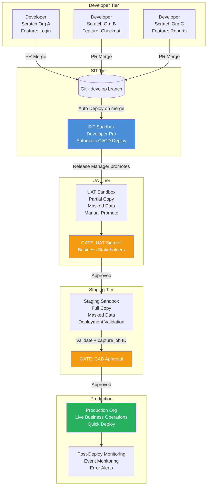
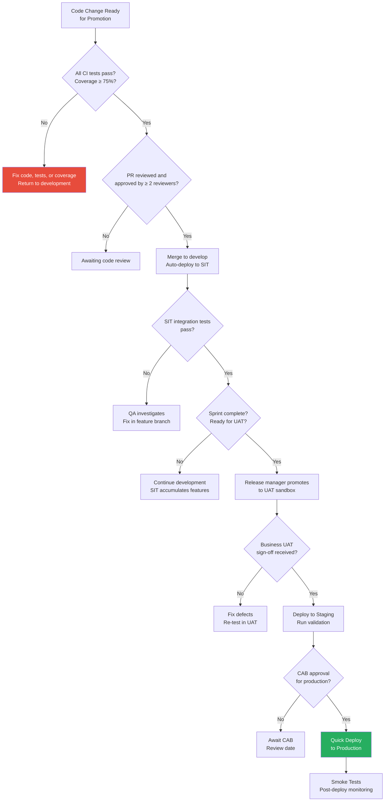

# Environment Strategy Design

## Overview / Context

Environment strategy design is the architectural blueprint for how non-production Salesforce environments are structured, governed, and used throughout the development lifecycle. It is one of the highest-impact architectural decisions on a Salesforce program — yet it's frequently treated as an afterthought, decided by whoever creates the first sandbox rather than designed with intention.

A poorly designed environment strategy manifests in predictable ways: developers waiting for sandbox access, UAT contaminated by in-progress development, production deployments that were never tested in a production-like environment, and sandbox refresh cycles that collide with sprint timelines. Each of these failure modes is preventable with thoughtful architecture.

Environment strategy is worth 22% of the CRT-406 exam — the second-largest domain. Questions test your ability to match environment types to purposes, design refresh strategies, define governance models, and handle multi-team scenarios. The most sophisticated questions test whether you can reason about the *interactions* between environment design and other architectural choices (branching strategy, data management, team structure).

## Foundations

A "Salesforce environment" is simply an isolated Salesforce org instance. It has its own metadata, optionally its own data, its own users, and its own URL. Changes made in one environment don't automatically appear in any other environment — they must be deliberately deployed.

The purpose of having multiple environments is risk management through isolation. You want to catch problems as early as possible (when they're cheap to fix), in an environment where they can't hurt real users. The further an environment is from production in your promotion chain, the lower the risk of a problem there — and the less expensive it is to fix.

A typical enterprise Salesforce program has a chain of environments that code travels through: a developer works in isolation (scratch org or dev sandbox), their change is integrated with others (SIT sandbox), tested by business users (UAT sandbox), staged for final verification (staging sandbox), and eventually deployed to the live system (production). Each step in this chain serves a specific purpose and answers a specific quality question.

The architect's job is to define how many environments are needed, what each one is for, who can access it, how data flows between them, when they get refreshed, and what the rules are for promoting code from one environment to the next. These aren't developer-level decisions — they're program-level decisions with budget, timeline, and compliance implications.

---

## Core Concepts / Framework

### Environment Tiers — Definitions and Purpose

**Tier 1: Developer Environments**

*Type: Scratch Orgs (preferred) or Developer Sandboxes*

Purpose: Individual feature development in isolation. A developer starts a feature by creating a scratch org from the definition file (or using their assigned Developer sandbox), builds the feature, writes unit tests, and validates it works before raising a PR.

Characteristics:
- Each developer has their own environment (no sharing)
- Short-lived (scratch orgs) or individual-assigned (developer sandboxes)
- No production data
- Changes are local until pushed to CI
- Source control is the sync mechanism

Governance:
- Developer owns their environment
- No formal access control needed (it's theirs)
- Scratch orgs deleted after feature branch merges

**Tier 2: System Integration Testing (SIT) Sandbox**

*Type: Developer Pro Sandbox (preferred) or Developer Sandbox*

Purpose: Integration testing — verifying that multiple developers' features work together correctly. This is where the team-level quality is verified. CI/CD auto-deploys to SIT on merge to the develop branch.

Characteristics:
- Shared team environment (all merged code is here)
- Automated deployments from develop branch
- Automated test suite runs on every deployment
- No production data (Developer Pro = metadata only)
- Must always be in a deployable state

Governance:
- Pipeline deploys automatically; developers don't have deployment access
- QA engineers have access for exploratory/integration testing
- Refresh from production metadata after each major sprint cycle

**Tier 3: User Acceptance Testing (UAT) Sandbox**

*Type: Partial Copy (representative data) or Full (full production data)*

Purpose: Business acceptance testing. Business users validate that the delivered features meet the requirements they specified. This environment must look like production to business users — realistic data, correct user profiles, active integrations (or production-like mocks).

Characteristics:
- Business users have testing access (with production-like profiles/permissions)
- Representative data (masked or synthetic)
- Manually promoted (not auto-deployed) — a release manager decides when SIT is ready for UAT
- Integrated with external systems (or mocked to simulate them)
- Protected from developer changes during active UAT window

Governance:
- Business analyst and QA team own UAT environment during test cycle
- Developers cannot deploy to UAT directly (only release manager can)
- Refresh on each major release cycle (after UAT completes)
- Data masking required before business user access

**Tier 4: Staging Sandbox**

*Type: Full Sandbox*

Purpose: Final pre-production gate. Identical to production in metadata, settings, and configuration. Used for final smoke tests, performance testing, and the production deployment validation (the "validate" step before Quick Deploy).

Characteristics:
- Full copy of production metadata
- Used for the deployment validation step (Quick Deploy source)
- No active development — only releases that have passed UAT
- CAB approval required for promotion to production
- May run performance tests for high-volume scenarios

Governance:
- Only release manager and operations team have deploy access
- Refresh after major releases (to stay aligned with production)
- Emergency hotfixes bypass the UAT tier but still go through staging

**Tier 5: Production**

*Type: Production Org*

Purpose: Live business operations. Real users, real data, real business processes. No direct deployments except via pipeline.

Governance:
- No direct deployments by developers or admins (except break-glass emergency procedures)
- All changes go through the pipeline
- Every deployment documented and approved
- Post-deployment monitoring active

### Environment Refresh Strategy

Refresh timing must align with the release cadence. Otherwise, environments drift from production and testing in them becomes unreliable.

| Environment | Refresh Type | Trigger | Frequency |
|---|---|---|---|
| Developer Sandboxes | Developer | As needed by developer | Up to every day |
| SIT Sandbox | Developer Pro | After each sprint (to get new production metadata) | Every sprint (2-4 weeks) |
| UAT Sandbox | Partial Copy / Full | Before each UAT cycle starts | Every sprint or major release |
| Staging | Full | After major releases complete | Monthly or after major releases |

**Refresh automation:**
- Salesforce doesn't support fully automated sandbox refresh via API (requires manual trigger in Setup)
- Some DevOps platforms (Copado, AutoRABIT) can automate sandbox refresh requests
- Best practice: incorporate refresh into the sprint kickoff checklist

**Refresh risk management:**
- SIT refresh destroys all test data → plan seed data scripts to run post-refresh
- UAT refresh destroys all existing test data → notify UAT team before refresh
- Full sandbox refresh takes 24-72 hours → plan around release schedule
- After full sandbox refresh, deployment connections must be re-established (for change-set-based workflows)

### Org Shape — Replicating Production to Scratch Orgs

**What is Org Shape?**
Org Shape is a Salesforce feature that captures the edition settings and feature configuration of an existing org (typically production) and makes it available as the basis for new scratch orgs.

**Why it matters:**
Without Org Shape, scratch orgs created from a simple scratch org definition file may have different features/settings than production. A feature that works in a scratch org with all features enabled may fail in production because a specific feature isn't active there.

**Using Org Shape:**
```bash
# Create an org shape from production
sf org create shape --target-org production

# Reference the org shape in scratch org definition
{
  "sourceOrg": "00D..." // Production org ID
}

# Create scratch org using the shape
sf org create scratch \
  --definition-file config/project-scratch-def.json \
  --target-dev-hub DevHub \
  --alias FeatureScratch
```

**Exam relevance:** Org Shape is the mechanism that addresses "works in scratch org, fails in production" class of bugs. Know when to recommend it.

### Data Strategy Per Environment

| Environment | Data Source | Method | Special Considerations |
|---|---|---|---|
| Developer Scratch Org | None (fresh) | Anonymous Apex seed scripts, TestDataFactory | Minimal: just enough to test the feature |
| Developer Sandbox | None | Seed scripts, manual entry | Simple test data for manual testing |
| SIT Sandbox | None | Automated seed scripts (post-refresh) | Must cover all integration test scenarios |
| UAT Sandbox | Production subset | Partial Copy with sandbox template + data masking | Must be masked; must be representative |
| Staging Sandbox | Full production | Full refresh + data masking | Must be masked; test with production-scale data |

**Sandbox template for Partial Copy:**
A sandbox template defines which objects (and optionally how many records) to include in the Partial Copy. Without a template, Salesforce picks records randomly — which may not include the specific records needed for testing.

Create sandbox templates in Setup → Sandbox → New Sandbox Template. Define:
- Which standard and custom objects to include
- Sampling percentage per object (e.g., 50% of Accounts, 100% of Pricebooks)
- Must include all objects referenced by the test scenarios

**Data masking approach (Full and Partial Copy):**
```
Production → Full/Partial Copy refresh → Raw sandbox with real PII
    ↓
Salesforce Data Mask tool runs
    ↓
Fields masked: Email → fake@masked.com, Phone → 555-000-XXXX, SSN → 000-00-XXXX
    ↓
Sandbox available for UAT/Staging use
```

### Environment Governance — Who Can Deploy to What

**Deployment permission matrix:**

| Environment | Developer | QA | Release Manager | CI/CD Pipeline |
|---|---|---|---|---|
| Scratch Org | Owner only | N/A | N/A | Can create/delete |
| Developer Sandbox | Owner only | N/A | N/A | Can deploy on PR validate |
| SIT Sandbox | No direct deploy | Read | Can deploy | Auto-deploys on merge to develop |
| UAT Sandbox | No | Read | Can deploy | Can deploy on release branch merge |
| Staging | No | No | Can deploy | Can deploy after UAT sign-off |
| Production | No | No | Can initiate | Can deploy after CAB approval |

**Implementation:**
- Use IP restrictions and profile restrictions to prevent developer access to SIT+
- Use Salesforce-managed packages or permission sets to control what each role can see
- Pipeline auth uses dedicated service account with exactly the permissions needed
- Salesforce Shield Event Monitoring can audit all org access if required by compliance

### Multi-Team Environments — Three Patterns

**Pattern 1: Separate Sandboxes per Team (Isolated Teams)**

Each team has their own SIT sandbox, promoting to a shared integration environment.

```
Team A: feature → Team A SIT → Integration SIT → UAT → Staging → Prod
Team B: feature → Team B SIT → Integration SIT → UAT → Staging → Prod
```

Best for: Teams with highly independent functional areas (Sales vs Service), low interdependency, willing to manage cross-team deployments explicitly.

**Pattern 2: Shared SIT with Branch-Based Isolation (Common)**

Teams share a SIT sandbox but use branches to manage when their features are integrated.

```
Team A feature branch → PR → develop branch → SIT → UAT → Staging → Prod
Team B feature branch → PR → develop branch → SIT → UAT → Staging → Prod
```

Best for: Teams that do share components and must integrate regularly. Conflicts surface at PR merge time (Git), not deployment time (org).

**Pattern 3: Scratch Orgs per Team for Development (Recommended for Large Programs)**

Each team (or each feature) gets a scratch org for development. Integration happens in a shared SIT sandbox via CI/CD.

```
Team A Scratch 1, 2, 3 → CI/CD → SIT Sandbox → UAT → Staging → Prod
Team B Scratch 1, 2, 3 → CI/CD → SIT Sandbox → UAT → Staging → Prod
```

Best for: Large programs with 10+ developers across multiple teams. Maximum isolation during development; controlled integration via CI.

---

## PTA / SA Relevance

### Parallels to Daily Advisory Work

Environment strategy is the most practical architecture discussion in Salesforce programs:

**Program kickoffs:** The first architecture deliverable on most programs should be an environment strategy diagram. It defines how every other delivery activity flows — team structure, branching, data management, UAT planning, release scheduling.

**Merger and acquisition integrations:** When two Salesforce orgs need to be merged or integrated, the environment strategy is the first thing that gets designed. What test environments support the integration testing? What do you do with data from both orgs?

**Customer proposals:** Proposing a Salesforce implementation without specifying the environment strategy is an incomplete proposal. The sandbox types, data strategy, and refresh schedule all affect cost (licenses, services) and timeline.

### How to Use This in Customer Engagements

**Environment strategy design workshop:**
Agenda (2-4 hours):
1. Map the team structure to environment needs
2. Define the promotion chain (which environment feeds which)
3. Define refresh triggers and timelines
4. Define data strategy per environment (including compliance requirements)
5. Define access governance (who can do what in each environment)
6. Map to the release cadence (are refresh cycles compatible with sprint cycles?)
7. Cost estimate (sandbox types needed, Data Mask licensing, data migration effort)

**Red flags in customer environment strategies:**
- "We all use the same Full sandbox for development" — developer conflict guaranteed
- "We refresh sandboxes when something breaks" — no planned refresh cycle
- "Business users test directly in production" — no UAT environment
- "We don't mask data in our sandboxes" — GDPR/HIPAA compliance risk
- "We only have one non-production environment" — no ability to run UAT and SIT simultaneously

---

## Architecture / Scenario

### Environment Pipeline Diagram



### Deployment Gate Decision Tree



---

## Key Principles to Apply

- **Every environment has exactly one purpose.** When an environment serves multiple purposes (developers AND QA testing in the same sandbox), it serves neither well.
- **Production access is a privilege, not a right.** Even for emergencies, production access should be logged, time-limited, and reviewed post-incident. Normal processes should never require direct production access.
- **Data masking is a first-class architecture concern, not a nice-to-have.** In any environment that contains production-derived data, masking is required before user access. Design the masking step into the environment refresh process.
- **Refresh cycles must align with release cycles.** A 5-week UAT sandbox refresh interval is incompatible with a 2-week sprint cycle. Design environment refresh schedules to support, not constrain, the release cadence.
- **Org Shape closes the scratch org → production drift gap.** Every scratch org created without Org Shape is a potential "works here, fails there" bug waiting to happen.
- **Environment access audit trails are part of governance.** Know who accessed what, when, and what they changed. Event Monitoring, field audit trails, and deployment history provide this — but only if you design the governance to use them.
- **Multi-team environments require explicit integration points.** When teams share a SIT sandbox, integration conflicts surface. Design the process for resolving them: PR review gates, integration testing schedules, and communication protocols between teams.
- **Don't conflate test environment count with test environment quality.** Having 10 sandboxes with no governance, no refresh strategy, and no data masking is worse than having 3 environments with excellent governance.

---

## Common Mistakes (Exam Candidates + Customers)

1. **Using Full sandboxes for developer work.** Full sandboxes are expensive, slow to refresh, and contain production data. Developer sandboxes or scratch orgs are the right tool for individual feature development.

2. **No data strategy for UAT.** Assuming business users can test effectively without realistic data is a UAT design failure. The lack of representative data is one of the most common UAT failure causes.

3. **Not refreshing environments between release cycles.** A UAT sandbox tested against a 90-day-old production metadata snapshot is testing a fiction, not production reality.

4. **Allowing developers to deploy directly to SIT.** When developers can deploy directly to shared integration environments (bypassing CI gates), the integration environment becomes polluted with untested changes.

5. **Not re-establishing deployment connections after sandbox refresh.** After a Full sandbox refresh, the environment is new — all deployment connections, Connected Apps, and named credentials must be reconfigured.

6. **Treating staging as optional.** "We test in UAT, that's enough for production confidence." UAT is a business acceptance environment; staging is a technical production environment. Both serve different purposes.

7. **Using a single connected app/certificate for all environments.** If the production certificate is compromised, it should not also compromise SIT, UAT, and staging. Each environment gets its own Connected App and credentials.

8. **Not documenting the environment strategy.** An undocumented environment strategy is known only to the people who designed it. When team members change, the strategy degrades. Document the environment diagram, purpose, access controls, and refresh schedules — and keep it updated.

---

## Practice Questions / Scenario Exercises

**Question 1**
A company has three development teams: Platform (shared components), Sales Cloud, and Service Cloud. Each team has 8 developers. The current environment strategy has all 24 developers sharing one Developer Pro sandbox, one Full sandbox for UAT, and production. What changes should the architect recommend?

A. Purchase three Full sandboxes, one per team  
B. Implement scratch orgs for developer work (one per developer), three team-level Developer Pro sandboxes for SIT, one Partial Copy for UAT, one Full sandbox for staging, and one Full for production  
C. Purchase one additional Developer Pro sandbox and alternate team deployments  
D. Use the Full sandbox for both UAT and staging since a Full sandbox mirrors production

**Answer: B**
The architect recommendation provides: isolation (scratch orgs prevent developer conflicts), team-level integration testing (one Developer Pro per team), business UAT with representative data (Partial Copy), final pre-production validation (Full staging), and production. Option A (three Full sandboxes) is expensive and uses the wrong type for development. Option C (one more Dev Pro) doesn't solve the 24-developer conflict problem. Option D conflates UAT purpose (business acceptance) with staging purpose (technical pre-production gate).

---

**Question 2**
A UAT sandbox was created from a Full sandbox refresh 45 days ago. Business users are about to start UAT for the quarterly release. The release manager is considering whether to refresh the sandbox before UAT begins. What should the architect recommend?

A. Proceed with UAT on the existing sandbox — the metadata is still valid  
B. Refresh the sandbox before UAT begins — 45 days of production metadata drift means business users are testing against outdated configuration  
C. The Full sandbox refresh interval is 29 days, so the sandbox cannot be refreshed anyway  
D. Refresh only if there have been major configuration changes to production in the last 45 days

**Answer: B**
45 days of metadata drift is significant for a quarterly release cycle. Any configuration changes made to production in the past 45 days (admin changes, other deployments, managed package updates) are absent from the UAT sandbox. UAT should always start with a reasonably current snapshot of production metadata. Option C is wrong — the 29-day interval means you can't request a refresh more frequently than once every 29 days. Since 45 days have elapsed, a refresh is now possible. Option D is pragmatic but the architect should recommend a standard refresh at the start of each UAT cycle.

---

**Question 3**
An architect is designing the environment strategy for a highly regulated financial services customer. They require that all access to non-production environments containing customer data is audited, and that test data is anonymized. What should the environment strategy include?

A. Restrict all non-production environments to test data only — no customer data in any sandbox  
B. Use Partial Copy and Full sandboxes with Salesforce Data Mask applied immediately after refresh, Salesforce Shield Event Monitoring enabled on UAT and staging sandboxes, and a documented access request process  
C. Use Developer sandboxes only — they contain no production data and require no masking  
D. Encrypt all data in sandboxes using Salesforce Shield Platform Encryption before use

**Answer: B**
The regulatory requirements (audit trail + anonymized data) are addressed by: Data Mask (anonymizes PII in Full/Partial Copy sandboxes), Shield Event Monitoring (logs all access and changes for audit purposes), and a documented access request process (governance for who gets access). Option A (test data only) would prevent using a Full sandbox for staging and UAT, which have legitimate needs for representative data. Option C solves the data masking issue but sacrifices the UAT and staging environments' value. Option D (Platform Encryption) protects data at rest but doesn't anonymize it for testing purposes.
