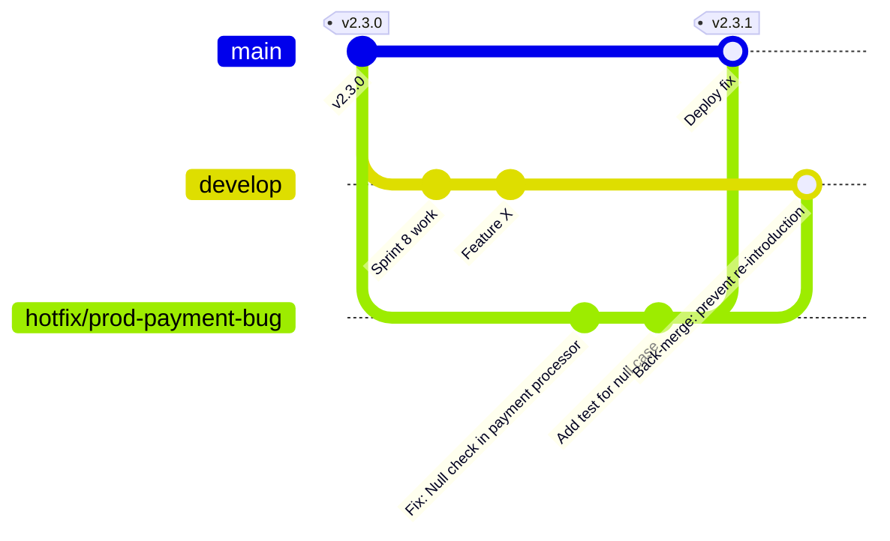
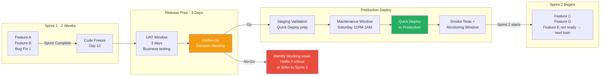
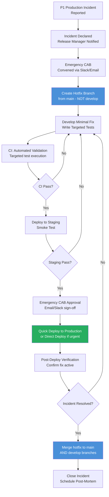

# Release Management

## Overview / Context

Release management is the process of coordinating, scheduling, and controlling the movement of builds through environments to production. It sits at the intersection of technical execution and business governance — it's the operational framework that determines when code ships, who approves it, what happens when things go wrong, and how the organization learns from each release.

At the architect level, release management is a governance design challenge. The technical pipeline (CI/CD) is the engine; release management is the steering wheel. Without thoughtful release management design, even the best pipeline will be misused: releases will ship without adequate testing, hotfixes will bypass critical gates, rollbacks will be botched, and the business will lose confidence in the technical team's ability to deliver reliably.

The exam tests release management from the angle of process design: what constitutes a release train, when to create a hotfix branch vs. go through the normal process, what makes a good go/no-go criteria, and how to design a rollback decision. These are judgment questions that require contextual reasoning, not recall.

## Foundations

Release management is the set of processes, tools, and governance structures that control when and how software changes are delivered to production. In any organization that releases software, some version of release management exists — even if it's informal ("we deploy when the developer says it's ready"). The question is whether the release management process is intentional and designed for the organization's risk profile, or ad hoc and reactive.

A "release" in software terms is a discrete, named event where a set of changes is promoted to production together. In Salesforce programs, a release might be a sprint release (all work completed in a two-week sprint), a major release (a large feature set), a patch release (a small bug fix), or a hotfix (an emergency fix for a production incident).

Release management answers three questions:
1. **What goes in this release?** (Scope control — what features/fixes are included)
2. **When does it go?** (Schedule control — release cadence, maintenance windows, code freeze)
3. **How do we know it's safe?** (Quality gates — test results, approvals, go/no-go criteria)

For enterprise Salesforce programs, release management also must answer: "What do we do when it goes wrong?" — defining rollback procedures and fix-forward protocols before they're needed under pressure.

---

## Core Concepts / Framework

### Release Types

**Minor Release (Sprint Release):**
- Cadence: Every sprint (typically 2 weeks)
- Scope: All features and bug fixes completed in the sprint
- Process: Normal pipeline (CI → SIT → UAT → Staging → Production)
- Testing: Full regression suite + sprint-specific UAT
- Risk level: Low to medium (features are incremental)

**Major Release:**
- Cadence: Quarterly or semi-annually
- Scope: Large feature sets, architectural changes, integrations
- Process: Extended testing cycle, UAT with all business stakeholders, CAB review
- Testing: Full regression + new feature UAT + performance testing
- Risk level: High (broad impact, complex changes)

**Hotfix / Emergency Patch:**
- Cadence: As needed (unplanned)
- Scope: Minimal — exactly what's needed to fix the critical issue
- Process: Bypasses normal release train; uses accelerated hotfix path
- Testing: Targeted testing (only the fixed component and its direct dependencies)
- Risk level: High urgency, controlled scope

**Release Naming Convention:**
- Sprint releases: `2024.Q4.S1` (Year.Quarter.Sprint)
- Major releases: `v3.0.0` (semantic versioning)
- Hotfixes: `2024.Q4.S1-hotfix-001` (parent release + hotfix number)

### Release Train Model

A release train is a scheduled, recurring release cycle where features must be "ready" by a cutoff date to board that release. Features not ready by the cutoff wait for the next train.

**Release Train Components:**

```
Sprint 1 (Weeks 1-2)  → Sprint 2 (Weeks 3-4)  → Release Window (Week 5)
[Feature A]           [Feature C]             [All features ship together]
[Feature B]           [Feature D]             [If not ready → next train]
     ↓                     ↓                           ↓
   Dev/SIT              Dev/SIT              UAT → Staging → Production
```

**Code Freeze:**
The code freeze is the point at which no new features can be added to the current release. It's typically 2-5 days before the release date, giving the QA team time to complete regression testing without a moving target.

**Code Freeze Policy:**
- After code freeze: Only bug fixes for in-flight release are merged
- New features wait for next sprint/release
- Hotfixes bypass code freeze for emergency issues
- Release manager owns and enforces the code freeze

**Release Calendar:**
A release calendar documents:
- Sprint cycle start/end dates
- Code freeze windows
- UAT windows
- Production deployment dates
- Maintenance windows
- Excluded dates (holidays, business-critical events)

### Change Management Process — CAB

The Change Advisory Board (CAB) is the governance body that reviews and approves changes before production deployment.

**CAB structure:**
| Role | Responsibility |
|---|---|
| CAB Chair | Runs the meeting, owns the process |
| Technical Lead | Reviews technical risk of changes |
| Business Stakeholder | Reviews business impact |
| QA Lead | Reviews test coverage and UAT sign-off |
| Release Manager | Presents changes, manages scheduling |
| Operations | Reviews deployment procedure and rollback plan |

**CAB review checklist:**
1. Is UAT sign-off documented from business stakeholders?
2. Is the deployment validation (Quick Deploy source) available?
3. What is the rollback plan if deployment fails?
4. Are there dependencies on other systems or releases?
5. What is the post-deployment verification plan (smoke tests)?
6. Has the change been tested in a staging environment?
7. Is the deployment window documented and communicated?

**Emergency Change Process:**
For P1 production incidents requiring immediate fixes:
1. Incident declared → Release manager notified
2. Emergency CAB convened (email/Slack approval from key members)
3. Hotfix branch created and fix developed
4. Accelerated testing (targeted, not full regression)
5. Deploy to staging → smoke test
6. Emergency CAB approval → production deploy
7. Post-incident review: full CAB retrospective within 5 business days

### Hotfix Process — Complete Protocol

The hotfix process is designed for when a production issue cannot wait for the next regular release.

**Hotfix triggers:**
- P1: Production system unavailable (complete outage)
- P1: Data integrity issue affecting live transactions
- P1: Security vulnerability being exploited
- P2: Critical feature broken for all users (not a single user complaint)

**Hotfix branching model:**



**Critical rule: Branch hotfix from main, merge back to BOTH main AND develop.**
- Branch from main: ensures the hotfix is applied to production state, not develop state (which contains unreleased sprint work)
- Merge to main: deploys the fix to production
- Merge back to develop: ensures the fix isn't overwritten by the next sprint release from develop

**Hotfix PR process (compressed):**
1. Emergency code review by at least 1 reviewer (2 if process allows time)
2. Automated CI validation (validate against staging)
3. Targeted test execution (only affected components)
4. Deploy to staging + smoke test
5. Emergency CAB approval (email/chat)
6. Quick deploy to production
7. Validate fix in production
8. Merge hotfix branch back to develop
9. Close incident, schedule post-mortem

### Release Notes and Documentation

Release notes serve both technical and business audiences:

**Technical release notes (for ops/developers):**
- List of all deployed components (with JIRA ticket references)
- Pre/post deployment steps (if any)
- Known issues and workarounds
- Rollback procedure for this release
- Validation ID and deployment job ID (for audit trail)
- CI/CD pipeline run links

**Business release notes (for stakeholders):**
- New features and enhancements (in business language)
- Bug fixes (with user impact description)
- Known limitations
- User training resources (if needed)
- What users should see differently after deployment

### Go/No-Go Criteria

Go/No-Go is the formal decision made before a production deployment proceeds. It requires explicit sign-off from multiple stakeholders.

**Technical go criteria:**
- [ ] All CI/CD pipeline stages passed
- [ ] Apex code coverage ≥ 75% org-wide
- [ ] All UAT test cases passed (or all blocking defects fixed)
- [ ] Deployment validation successful in staging
- [ ] Performance benchmarks met (if applicable)
- [ ] No critical PMD violations in deployed code

**Business go criteria:**
- [ ] UAT sign-off received from business owner(s)
- [ ] Change request approved in change management system
- [ ] CAB approval obtained
- [ ] Maintenance window confirmed with operations team
- [ ] Communication sent to impacted users

**No-Go triggers:**
- Any P1 or P2 open defect unresolved
- UAT sign-off not received
- Test coverage below threshold
- Staging validation not completed within 10-day Quick Deploy window
- Key stakeholder on record saying "stop" (regardless of technical status)

### Post-Deployment Verification

After deployment, a structured verification process confirms the deployment succeeded.

**Smoke test protocol:**
1. Run automated smoke test suite (30-60 seconds)
2. Manually verify top 3 critical business processes (login, create record, key integration)
3. Check error monitoring dashboards (Salesforce Event Monitoring, connected APM tools)
4. Confirm no spike in Apex exception logs
5. Verify integration endpoints responding normally
6. Get verbal confirmation from operations on-call

**Monitoring window:**
- First 30 minutes: Active monitoring by release manager + on-call engineer
- First 2 hours: Periodic monitoring (every 15 minutes)
- First 24 hours: Passive monitoring with alert-based escalation

### Rollback Procedure — When to Roll Back vs Fix Forward

**Roll back criteria:**
- Complete feature unavailability for all users
- Data integrity issues identified
- Revenue-impacting transactions failing
- Rollback is cleaner than fix (no data migration involved)
- Fix will take > 2 hours to develop, test, and deploy

**Fix forward criteria:**
- Issue affects a small percentage of users
- Fix is straightforward and can be deployed quickly (< 1 hour)
- Rollback would require reverting dependent data migrations
- Business prefers the feature to stay in production with a workaround
- Rollback would cause worse disruption than the current issue

**Rollback execution:**
```bash
# Method 1: Revert commit + auto-deploy via pipeline (preferred)
git revert -m 1 <merge-commit-hash>
git push origin main
# Pipeline auto-deploys the revert to production

# Method 2: Package rollback (package model)
sf package install \
  --package <previous-package-version-id> \
  --target-org production \
  --installation-key $KEY

# Method 3: Destructive changes (remove newly added components)
sf project deploy start \
  --manifest destructiveChanges.xml \
  --target-org production \
  --test-level RunLocalTests
```

**Post-rollback steps:**
1. Confirm rollback successful via smoke tests
2. Communicate rollback to business stakeholders
3. Create hotfix branch to fix the issue
4. Schedule post-mortem within 5 business days
5. Update release plan to include the fixed feature in next release

---

## PTA / SA Relevance

### Parallels to Daily Advisory Work

Release management advisory shows up in:
- **Operating model design:** Customers building a Salesforce Center of Excellence need a documented release management process. Architects design the process framework; the customer's release managers execute it.
- **Program health assessments:** "How do you know a release is ready?" — the answer reveals the maturity of the release management process. No formal go/no-go? That's a risk finding.
- **Post-incident reviews:** When production releases fail, the post-mortem almost always reveals a release management gap. Missing go/no-go criteria, inadequate staging testing, or no rollback plan.
- **Vendor management:** When customers use Copado, Flosum, or AutoRABIT, the release management process is partially embedded in the tool. Architects must understand how the tool implements the process to assess its adequacy.

### How to Use This in Customer Engagements

**Release management maturity assessment:**
- Level 1 (Ad hoc): Releases happen when developers say they're ready; no formal process
- Level 2 (Basic): Defined release windows; some testing required before deployment
- Level 3 (Managed): Formal go/no-go process; CAB reviews; hotfix protocol documented
- Level 4 (Optimized): Automated gates enforce criteria; rollback automation; continuous improvement of release metrics

**Release cadence recommendation framework:**
- Low change velocity (< 20 components/sprint): Monthly release trains
- Medium change velocity (20-50 components/sprint): Bi-weekly sprint releases
- High change velocity (50+ components/sprint): Weekly releases or continuous delivery
- Hotfix cadence: Always available, independent of regular releases

---

## Architecture / Scenario

### Release Train Diagram



### Hotfix Flow



---

## Key Principles to Apply

- **Hotfix branches must come from main (production state), not develop.** Develop contains unreleased sprint work. Branching a hotfix from develop would include all that unreleased work in the hotfix — exactly what you're trying to avoid.
- **Every hotfix must be merged back to develop.** Missing this step is how fixes disappear in the next regular release, reintroducing the production issue.
- **Code freeze is a governance tool, not a technical constraint.** It must be enforced by people and process, not just by branch protection. Communicate clearly: after code freeze, new features don't board this train.
- **Go/No-Go criteria must be defined before UAT begins.** Defining criteria after UAT results are in is backwards and invites subjective decision-making. Write the criteria down, publish them to all stakeholders, and hold to them.
- **Rollback decision should be pre-designed, not improvised.** Under production incident pressure, improvised rollback decisions are high-risk. Document the decision criteria in advance so the on-call team can execute without escalation.
- **Release notes are a business artifact.** They should be understandable to business stakeholders, not just technical teams. Maintain two versions: one for operations (technical details) and one for the business (feature descriptions in plain language).
- **Post-deployment monitoring is part of the release.** A release isn't "done" when the deployment completes — it's done when the monitoring window closes with no incidents. Build the monitoring window into the release plan.
- **Release metrics drive process improvement.** Track: deployment frequency, change failure rate, mean time to restore, lead time for changes. Publish these to stakeholders. Trends in these metrics tell you whether the release management process is improving or degrading.

---

## Common Mistakes (Exam Candidates + Customers)

1. **Branching hotfix from develop instead of main.** This is a fundamental GitFlow error. A hotfix from develop carries all unreleased sprint features into an emergency production fix — creating more risk than the original issue.

2. **Defining go/no-go criteria during the go/no-go meeting.** Criteria defined after seeing the test results are biased by the results. Define criteria before UAT begins.

3. **No rollback plan documented before deployment.** "We'll figure it out if something goes wrong" is not a rollback plan. Rollback must be pre-planned because production incidents are not the time for creative problem-solving.

4. **CAB approval as the only gate before production.** CAB approval is a business governance gate. It does not replace test coverage, UAT sign-off, or staging validation. All gates must pass.

5. **Not communicating the code freeze to all stakeholders.** Developers who don't know about the code freeze will push features after the cutoff, creating merge conflicts and UAT scope changes.

6. **Using hotfix process for non-emergency issues.** Hotfix bypasses most normal process gates. Using it for convenience ("we need this feature in production before the sprint release") undermines the governance model.

7. **Not scheduling post-mortems for production incidents.** Every production incident contains process improvement information. Failing to conduct post-mortems means making the same mistakes repeatedly.

8. **Single-threaded go/no-go approval.** If the business owner who must sign off on go/no-go is unavailable, and no backup is defined, the release is blocked indefinitely. Define backup approvers for every required sign-off.

---

## Practice Questions / Scenario Exercises

**Question 1**
A sprint release was deployed to production on Saturday night. On Monday morning, users report that the Case assignment rules are no longer working correctly. Investigation reveals the new Assignment Rule Apex class deployed on Saturday has a bug. The bug affects all new Case creation. What is the correct response?

A. Roll back the entire sprint release via destructive changes  
B. Fix the bug in the develop branch and include it in next sprint's release  
C. Create a hotfix branch from main, fix the Assignment Rule class, test in staging, deploy to production with emergency CAB approval, then merge hotfix back to both main and develop  
D. Disable Case creation until the next sprint release

**Answer: C**
A bug breaking all Case creation is a P1 incident requiring immediate action. The hotfix protocol is: branch from main (production state), fix the specific bug, test minimally but specifically (the Assignment Rule class + its tests), staging smoke test, emergency CAB approval, and production deploy. Merge back to both main AND develop ensures the fix doesn't disappear in the next sprint release. Option A (rollback everything) is more disruptive than a targeted fix. Option B (wait for next sprint) leaves production broken. Option D is a workaround, not a fix.

---

**Question 2**
A release manager is preparing for a major quarterly release. They have scheduled a go/no-go meeting 30 minutes before the maintenance window starts. During the meeting, the QA lead announces that 3 test cases are still failing in UAT. The release manager says "let's proceed — the failing tests are low priority." Should they proceed?

A. Yes — if the failing tests are low priority, the risk is acceptable  
B. No — the go/no-go criteria should have been defined before UAT, and failing UAT test cases (regardless of priority) without explicit stakeholder sign-off is a no-go condition  
C. Yes — the release can proceed with the known issues documented as post-release bugs  
D. No — all UAT test cases must pass before any production deployment, regardless of business input

**Answer: B**
Go/no-go criteria should have been defined before UAT began, including what "acceptable failures" look like. Making subjective priority judgments during the meeting is ad hoc governance. The release manager doesn't have the authority to declare low-priority failures acceptable without the explicit agreement of the business stakeholder who specified those test cases. Option D is overly strict — not all UAT failures are blockers, but the criteria for what is/isn't a blocker must be pre-defined, not improvised. Option A assumes "low priority" was assessed correctly under deadline pressure.

---

**Question 3**
A company runs bi-weekly sprint releases with a code freeze on Day 12 of each sprint. A feature team completes Feature X on Day 13 — one day after code freeze. The feature is not critical and all tests are passing. What should happen?

A. Feature X should be included in the current release since it's complete and passing  
B. Feature X misses this release train and will board the next sprint release in 2 weeks  
C. The code freeze should be extended to accommodate Feature X  
D. Feature X should go to production immediately via a separate deployment, bypassing the code freeze

**Answer: B**
Code freeze is a governance boundary. Features not ready by the cutoff miss the current train — that's the entire point of the code freeze. Including Feature X after code freeze means UAT and staging validation already completed without it, meaning the current release wasn't actually tested with Feature X. The correct answer is to hold Feature X for the next sprint release. This is not a failure — it's the process working correctly. Option A (include it) undermines the purpose of code freeze. Options C and D bypass the governance model.
