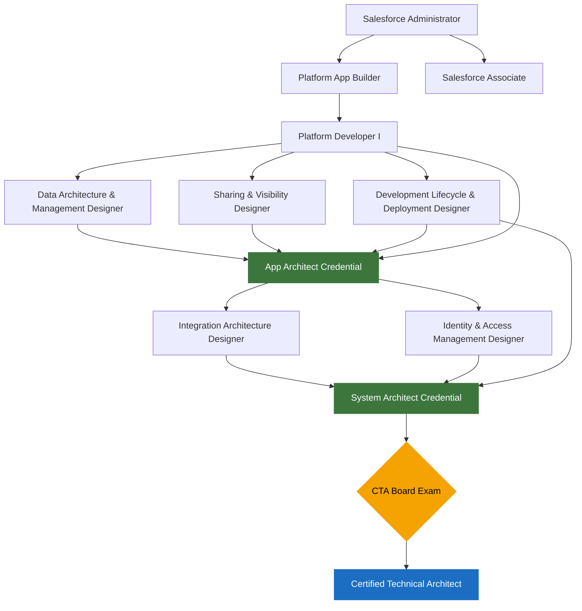
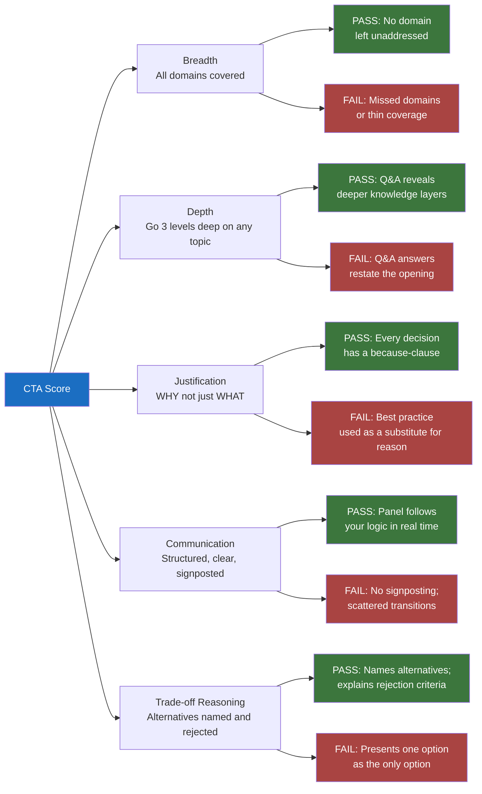

# CTA Board Prep: Course Overview and Strategy

## Overview / Context

The Certified Technical Architect (CTA) credential is the apex of the Salesforce certification ecosystem. Unlike every other Salesforce cert — which are proctored, machine-scored exams testing recall and configuration knowledge — the CTA is a peer-reviewed, live performance evaluated by a panel of sitting CTAs. There are no multiple-choice questions. There is no partial credit algorithm. You walk into a room, receive a scenario you have never seen before, and you have two hours to demonstrate that you think, communicate, and defend architecture decisions at the highest level of the Salesforce platform. The credential signals that you can be trusted with the most complex, highest-stakes Salesforce programs in the world — multi-cloud enterprises, regulated industries, global deployments — and that you can lead other architects toward sound decisions under ambiguity.

The ~40-50% pass rate is not an artifact of poor preparation among candidates. The people who sit the CTA board are experienced — most have years of Salesforce delivery behind them, hold the System Architect credential (itself a multi-year journey through five designer exams, App Architect, and System Architect), and have led real enterprise programs. The pass rate reflects something more specific: the gap between knowing the right answer and performing the right answer live, under challenge, in a structured format, against a clock. Candidates fail because they present like consultants instead of architects (recommendations without justification), because they miss entire architecture domains (breadth failure), because they crumble under Q&A challenge (composure failure), or because their time management collapses mid-presentation. The exam tests synthesis, communication, and resilience — not just knowledge.

As a Partner Technical Architect at Salesforce, you have a natural and substantial foundation for this exam. You spend your days doing exactly what the CTA board tests: analyzing complex customer situations, recommending architecture across multiple Salesforce clouds, justifying decisions to skeptical stakeholders, and defending your recommendations under challenge. You have broader platform exposure than most consulting-side candidates — you see patterns across dozens of customers, you understand the full Salesforce product portfolio, and you operate at the executive level daily. Your blind spots, however, are real and worth naming: your advisory work skews toward business outcomes and deal positioning, which can leave gaps in deep technical specifics (LDV internals, Apex governor limits, Shield encryption mechanics, Flows vs Apex decision criteria at scale); your presentations to customers are generally well-received and rarely challenged with expert rigor, so your Q&A composure under peer-level pressure may be underbuilt; and your communication style is likely polished but may trend toward executive-speak rather than the precise architectural reasoning the panel expects. This course is built to close those gaps.

---

## Core Concepts / Framework

### CTA Credential Path

The CTA requires the System Architect credential as a prerequisite. System Architect itself requires App Architect plus six other exams. The full path is substantial:

| Level | Credential | Components Required |
|---|---|---|
| Foundation | Salesforce Administrator | 1 exam |
| Foundation | Salesforce Associate | 1 exam (optional but useful) |
| App Architect | Application Architect | Data Architecture & Management Designer + Sharing & Visibility Designer + Development Lifecycle & Deployment Designer + Platform Developer I |
| System Architect | System Architect | Integration Architecture Designer + Identity & Access Management Designer + Development Lifecycle & Deployment Designer (shared with App Arch) + Platform Developer II (optional but strongly recommended) |
| **CTA** | **Certified Technical Architect** | **System Architect credential + Board Exam** |

Note: The App Architect and System Architect credentials are sometimes called the "5 designer certs" path. The five designer exams are: Data Architecture & Management, Sharing & Visibility, Development Lifecycle & Deployment, Integration Architecture, and Identity & Access Management.

---

### CTA Exam Session: Granular Format

The exam is a single 2-hour session with three sequential phases. There are no breaks. The session is conducted in person (or via video in approved remote formats) with a panel of three sitting CTAs.

#### Phase 1 — Scenario Review: 30 Minutes

You receive a printed or digital scenario document. You are alone (no panel present). The document is typically 3-5 pages and contains:

- **Business context**: Industry, company size, business model, strategic initiative
- **Current state description**: Existing systems, org structure, technical debt
- **3-5 numbered requirements**: These are the explicit architectural challenges you must address
- **Constraints**: Budget limits, timelines, existing system retention mandates, compliance requirements
- **Future-state goals**: Where the business wants to be in 12-24 months
- **Sometimes**: Volume/scale numbers, user counts, geographic distribution, partner/customer-facing context

**How to use the 30 minutes:**
- First 10 minutes: Read the entire scenario twice without writing anything. First pass is business context. Second pass is technical requirements.
- Next 15 minutes: Annotate every requirement with its architecture domain. Mark constraints as Hard or Soft. Circle numbers (volume signals). Underline implied requirements. Mark unknowns.
- Last 5 minutes: Build your presentation structure — which domains will you cover, what's your opening, what are the three most defensible decisions you'll make?

#### Phase 2 — Presentation: 45 Minutes

The panel enters. You present. You drive the structure entirely — they observe and take notes. Key structural requirements:

| Segment | Time Budget | What to Cover |
|---|---|---|
| Opening | 3 min | Business context (2 sentences), assumptions (2-4), domains you'll address and why |
| Domain 1 (typically Data or the scenario's heaviest domain) | 6-8 min | Requirements mapping, decision, trade-offs, constraints addressed |
| Domain 2 | 6-8 min | Same pattern |
| Domain 3 | 6-8 min | Same pattern |
| Domain 4+ (if applicable) | 5-6 min each | Compressed but complete |
| Diagram narration | 2-3 min each | Draw while narrating, not before |
| Closing | 2-3 min | Summary of key decisions and the thread connecting them |

**Critical rule**: Do not skip a domain that is implicated by the scenario even if the requirement seems minor. Breadth failure is one of the most common failure modes. A scenario with an SSO requirement means you must address Identity & Access Management even if only one sentence in the scenario mentions it.

#### Phase 3 — Q&A: 45 Minutes

Immediately after your closing statement, the panel begins. Every major architectural decision you made is a candidate for challenge. Q&A types:

| Question Type | Example | What it tests |
|---|---|---|
| Clarifying | "When you said you'd use Platform Events, can you walk us through the delivery guarantee?" | Depth of knowledge |
| Challenging | "Why not MuleSoft here instead of the native Salesforce integration you described?" | Trade-off reasoning |
| Stress-testing | "What happens to this design if the volume triples in year two?" | Scalability thinking |
| Trap | "Would you use Apex or Flow for this automation?" (when neither is clearly better) | Nuance and context awareness |
| Domain-specific | "How does your Shield encryption choice interact with the sharing model?" | Cross-domain integration |
| Composure | "That assumption you made in the opening — the scenario actually contradicts it. Now what?" | Adaptability under pressure |

---

### Scoring Dimensions

The panel scores on five dimensions. A candidate must demonstrate competence across all five to pass.

| Dimension | What It Means | Pass Indicator | Fail Indicator |
|---|---|---|---|
| **Breadth** | Did you address all architecture domains the scenario implicates? | All relevant domains covered with substantive decisions | Missed a domain; gave a one-sentence answer to a heavy domain |
| **Depth** | Can you go deeper on any domain when pressed? | Can go 2-3 levels deeper from your opening statement on any topic | Answers Q&A with restatements of what you already said |
| **Justification** | Do you explain WHY, not just WHAT? | Every decision is followed immediately by a because-clause tied to scenario constraints | Presents solutions without reasoning; says "best practice" as a substitute for justification |
| **Communication** | Is your reasoning clear and structured? | Panel can follow your logic; transitions are explicit; no jargon without explanation | Scattered structure; no verbal signposting; uses Salesforce jargon without definition |
| **Trade-off Reasoning** | Do you acknowledge alternatives and why you rejected them? | Names at least one alternative for major decisions; explains rejection criteria | Presents one option as if it is the only option; never acknowledges a counter-design |

---

### Pass vs. Fail: Specific Distinguishing Criteria

**A passing presentation:**
- Covers all domains the scenario touches, even lightly
- Opens with explicit assumptions (because scenarios always have gaps)
- States trade-offs proactively — before the panel asks
- Under Q&A, can go from a high-level decision to implementation-level detail and back
- When challenged, can say "you're right, if that constraint applies, then my decision changes to X because Y"
- Manages time so all domains get addressed before the 45 minutes expire
- Draws at least one architecture diagram that is legible and adds explanatory value

**A failing presentation:**
- Covers 3 of 5 required domains thoroughly and skips 2 entirely
- Makes decisions and moves on without explaining the why
- Under Q&A, restates the original answer when challenged instead of going deeper
- Treats constraints as suggestions rather than hard architectural requirements
- Runs out of time and never addresses the last domain
- Opens by restating the scenario to the panel (they read it; this wastes your time)

---

### 8-12 Week Study Plan

| Week | Focus | Key Activities |
|---|---|---|
| 1 | Self-assessment | Take a practice scenario cold; score yourself on all 5 dimensions; identify your weakest domain |
| 2 | Data Architecture deep dive | LDV, big objects, archiving, MDM, external objects, query optimization; practice 2 data-heavy scenarios |
| 3 | Security & Sharing deep dive | OWD→Role Hierarchy→Sharing Rules→Manual→Apex Managed; Shield; platform encryption; practice 2 security scenarios |
| 4 | Integration Architecture deep dive | Patterns, MuleSoft, CDC, Platform Events, callout limits, error handling, real-time vs async; 2 integration scenarios |
| 5 | Identity & Access Management deep dive | SAML, OAuth 2.0 flows, Connected Apps, Named Credentials, delegated auth, My Domain; 2 IAM scenarios |
| 6 | ALM & Development Lifecycle deep dive | Unlocked packages, scratch orgs, CI/CD, sandbox strategy, deployment anti-patterns; 2 ALM scenarios |
| 7 | Application Architecture deep dive | Multi-org strategy, LWC performance, governor limits, Flow vs Apex decision tree, platform limits planning |
| 8 | Full mock exam #1 | 30 min scenario → 45 min timed presentation (recorded) → 45 min peer Q&A. Score all 5 dimensions. |
| 9 | Weakness remediation | Based on mock exam scores, go deep on the lowest-scoring domain(s) |
| 10 | Full mock exam #2 | Different scenario. Focus on trade-off proactivity and Q&A composure. |
| 11 | Communication and presentation polish | Review recordings; fix verbal habits; practice diagram drawing under 3 minutes |
| 12 | Final review and readiness | Light review of all domains; mental rehearsal of opening structure; rest |

---

### Course File Index — 16-cta-board-prep

```
16-cta-board-prep/
├── 00-overview-and-strategy.md                          ← This file
│
├── section-01-board-format/
│   ├── lecture-01-cta-exam-format.md                    ← 2-hour session deep dive, scoring rubric
│   ├── lecture-02-scenario-analysis-framework.md        ← 30-minute methodology, RED FLAGS
│   └── lecture-03-presentation-skills.md                ← Presentation structure, trade-offs, whiteboard
│
├── section-02-architecture-domains/
│   ├── lecture-01-data-architecture.md                  ← LDV, big objects, MDM, archiving
│   ├── lecture-02-security-and-sharing.md               ← OWD, hierarchy, rules, Shield
│   ├── lecture-03-integration-architecture.md           ← Patterns, MuleSoft, CDC, Platform Events
│   ├── lecture-04-identity-and-access.md                ← SAML, OAuth, Connected Apps, IDP/SP
│   ├── lecture-05-alm-and-deployment.md                 ← Packages, CI/CD, sandbox strategy
│   └── lecture-06-application-architecture.md           ← Multi-org, governor limits, LWC, Flow vs Apex
│
├── section-03-scenario-practice/
│   ├── lecture-01-scenario-analysis-walkthrough.md      ← Annotated worked example
│   ├── lecture-02-multi-domain-scenario-01.md           ← Full scenario: Manufacturing/Partner Portal
│   ├── lecture-03-multi-domain-scenario-02.md           ← Full scenario: Financial Services/Compliance
│   ├── lecture-04-multi-domain-scenario-03.md           ← Full scenario: Healthcare/Multi-Org
│   ├── lecture-05-cross-domain-integration.md           ← Scenarios spanning 5+ domains
│   └── lecture-06-qa-simulation.md                      ← Q&A transcript examples with model answers
│
├── section-04-presentation/
│   ├── lecture-01-whiteboard-techniques.md              ← Diagram patterns, drawing under pressure
│   ├── lecture-02-trade-off-frameworks.md               ← Decision matrices, when A beats B
│   ├── lecture-03-qa-handling.md                        ← Challenge types, composure strategies
│   └── lecture-04-mock-exam-guide.md                    ← How to run effective mock exams
│
└── exam-prep/
    ├── quick-reference-domain-signals.md                ← Cheat sheet: requirement signals by domain
    ├── constraint-classification-guide.md               ← Hard vs soft constraint catalog
    └── pre-exam-checklist.md                            ← Day-of mental and logistics checklist
```

---

## PTA / SA Relevance

### Parallels to Daily Advisory Work

Your PTA role maps directly onto CTA exam skills in four critical ways:

**Deal reviews → Scenario analysis under time pressure.** In deal reviews, you receive a customer situation — often incomplete, often with contradictory requirements — and must synthesize a recommended architecture quickly. The CTA scenario phase is structurally identical: you have limited information, limited time, and must organize your thinking before you present. The difference is formality: the CTA requires you to make your analytical process explicit in a way that deal reviews do not.

**Architecture assessments → Multi-domain solution design.** Your architecture assessments already span multiple Salesforce clouds and typically require you to address data, integration, and security simultaneously. The CTA scenario will do the same. The difference is that the CTA panel will probe every domain equally, whereas customer assessments often let you park lightly on domains the customer isn't focused on. You cannot do that in the board exam.

**Executive presentations → Communication and trade-off framing.** You already know how to frame a recommendation for a C-suite audience — outcomes, risks, alternatives rejected. The CTA panel includes non-technical-seeming moments where they want to understand your business rationale, not just your technical rationale. Your advisory communication style is an asset here.

**Partner conversations and deal defenses → Defending recommendations under challenge.** When a partner's architect disagrees with your recommendation, or when a customer's IT architect challenges your integration design, you defend your position with evidence and reasoning. The Q&A phase of the CTA is this — but with three expert peers pushing simultaneously, and your performance is being scored in real time. The stakes and pressure are structurally different from a customer meeting.

### How to Use This in Customer Engagements

**Frame your advisory work as CTA practice.** Every customer architecture review you lead is an opportunity to practice the CTA discipline: state your assumptions explicitly, name the domains you're covering, and proactively state the trade-offs before the customer or partner asks. This builds the habit that the CTA exam requires.

**Request challenge in your internal reviews.** When presenting an architecture recommendation internally — at a deal review, an architecture review board, or a QBR — explicitly ask a colleague to challenge your decisions the way a CTA panel would. "Push back on my integration choice" is good practice for Q&A composure.

**Document your justification rigorously.** The CTA panel cannot see the reasoning that lives in your head. Neither can your customers. Get into the habit of writing architecture decision records (ADRs) that capture decision, alternatives considered, and rejection criteria. This forces the explicit reasoning the CTA rewards.

**Use scenario constraints as architecture drivers in real engagements.** When a customer says "we can't replace SAP" or "we need GDPR compliance," treat these as hard constraints that shape every subsequent architectural decision — exactly as you would in the CTA board. This makes your real-world recommendations more defensible and your CTA preparation more intuitive.

---

## Architecture / Scenario

### Credential Path



---

### CTA Exam Session Timeline

```mermaid
gantt
    title CTA Board Exam — 2-Hour Session
    dateFormat  mm
    axisFormat %M min

    section Phase 1
    Receive scenario document        :milestone, m1, 00, 0min
    First full read (business context)  :a1, 00, 10min
    Second read + annotation         :a2, 10, 15min
    Organize structure and opening   :a3, 25, 5min

    section Phase 2
    Panel enters — Presentation begins  :milestone, m2, 30, 0min
    Opening: context, assumptions, domains  :b1, 30, 3min
    Domain coverage (4-6 domains)    :b2, 33, 37min
    Closing summary                  :b3, 70, 5min

    section Phase 3
    Q&A begins                       :milestone, m3, 75, 0min
    Panel challenges all major decisions :c1, 75, 45min
    Session ends                     :milestone, m4, 120, 0min
```

---

### Scoring Dimensions — Five Axes of Evaluation



---

## Key Principles to Apply

- **The "CTA Mindset" is justification-first, not solution-first.** The panel is not interested in what you built; they are interested in why you built it that way and what you considered before deciding. Lead every architectural statement with reasoning, not conclusions.

- **Assumptions are mandatory, not optional.** Every scenario has gaps. A candidate who makes no assumptions is either lying (they guessed and didn't acknowledge it) or has missed the gaps. State your assumptions explicitly in the opening — it frames your entire presentation and gives you a defensible baseline for Q&A.

- **No single right answer — only well-justified answers.** Two candidates can present opposing architectural decisions (single-org vs. multi-org, for example) and both can pass — if both justify their decision thoroughly with reference to the scenario's constraints. Do not search for the "correct" answer; search for the best-justified answer given your stated assumptions.

- **Breadth before depth in the presentation; depth on demand in Q&A.** During your 45 minutes, touch all relevant domains even if you can't go deep on all of them. Save depth for Q&A, where the panel will direct you. A shallow mention of a domain is better than no mention.

- **Constraints are architecture drivers, not footnotes.** If the scenario says "cannot replace SAP ERP," that single constraint shapes your integration architecture, your data model, your master data management strategy, and your identity design. Treat every constraint as a first-class architectural input.

- **Trade-offs must be stated before you are asked.** Proactively naming the downside of your recommendation is a strength signal, not a weakness signal. It tells the panel you understand the solution space — not just your chosen path. Waiting for the panel to surface the trade-off is a missed opportunity.

- **Time is an architectural constraint on the exam itself.** Poor time management is a failure mode. If you spend 30 minutes on Data Architecture because you know it deeply, you leave Security, Integration, and Identity to be rushed or skipped. Allocate your presentation time as deliberately as you allocate compute resources in a production architecture.

- **Q&A composure is a scoring dimension.** Being challenged does not mean you are wrong. The panel challenges every candidate, including those who pass. The ability to say "That's a valid concern. If that constraint exists, here is how my recommendation changes and why" is exactly what passing candidates demonstrate.

---

## Common Mistakes

**1. Restating the scenario in the opening.** The panel wrote the scenario. Spending 5 of your 45 minutes walking them through it wastes time and signals you are not yet in presentation mode. Your opening should be: context (2 sentences), assumptions (2-4 items), domains you'll cover. Nothing more.

**2. Presenting without trade-offs and waiting for Q&A to bring them up.** Many candidates structure their presentation as a series of recommendations, then plan to address challenges in Q&A. The panel sees this as a depth failure — you should already be demonstrating you understand the solution space. State the alternative and why you rejected it during your presentation.

**3. Missing a domain because the requirement seems minor.** A scenario with one sentence mentioning "partners will log in via their company SSO" requires you to address Identity & Access Management architecture: SAML configuration, My Domain, SP-initiated vs IDP-initiated flow, Connected App settings, and the interaction with your sharing model. One sentence can drive a substantial architecture domain.

**4. Saying "best practice" without justification.** "We'll use Unlocked Packages because it's best practice" is a failing answer. "We'll use Unlocked Packages because this scenario has three teams deploying independently on overlapping timelines, and package-based boundaries let each team maintain an independent release cadence while enforcing explicit API contracts between packages" is a passing answer.

**5. Defending the wrong decision under Q&A instead of adapting.** When the panel challenges a decision, some candidates defend their original position regardless of what the challenger says. If the panel surfaces a constraint you missed, or makes a valid point that invalidates your assumption, the correct move is to acknowledge it and adapt: "You're right. If that volume threshold applies, my original approach breaks at the governor limit. I'd pivot to Platform Events with a consumer queue instead of synchronous callouts, because..."

**6. Treating the whiteboard as an afterthought.** Candidates who draw a diagram at the start of Q&A, or who never draw one at all, miss the communication dimension. Drawing while narrating is a real-time comprehension tool for the panel. Start with a system context diagram in the first 10 minutes of your presentation; it anchors everything you say after it.

**7. Spending too much time on your strongest domain.** Almost every experienced architect has a domain they know deeply — Data, Integration, or Security. The temptation is to go deep there because it feels comfortable. The exam scores you on breadth. Spending 20 minutes on Data Architecture when you allocated 6 minutes leaves two domains unaddressed.

**8. Failing to address the business context of architectural decisions.** The CTA is an architect credential, not a developer credential, and the panel includes people who think in terms of business risk, cost, and outcomes — not just technical correctness. A decision that is technically correct but ignores cost, timeline, or organizational risk is an incomplete answer. Frame every major decision in terms of what it enables the business to achieve, not just what it does technically.

---

## Practice Questions

**Question 1 — Readiness self-assessment: Breadth**
Without looking at notes, name the six primary architecture domains assessed in a CTA board exam and write two "red flag" scenario signals for each domain that would require you to address it. If you cannot name at least one signal per domain, that domain needs focused study.

*Model answer framework:* Data (">1M records," "GDPR/HIPAA"), Security/Sharing ("multiple BUs," "field-level data sensitivity"), Integration ("legacy system," "real-time sync"), Identity/Access ("SSO," "partner login"), ALM ("multiple release teams," "parallel development"), Application Architecture ("governor limits," "multi-org," "offline mobile").

---

**Question 2 — Readiness self-assessment: Depth**
For any domain you identified above, try to answer this sequence without pausing: (1) What is your default recommendation for the most common architectural challenge in that domain? (2) What are the top two alternatives? (3) What are the rejection criteria for each alternative? (4) What would cause you to revisit your recommendation? If you stall at question 2, depth study is needed.

*Model answer framework (Integration example):* Default: Salesforce-native REST callout or Platform Events depending on sync/async requirement. Alternatives: MuleSoft (rejected when no existing Anypoint investment and scenario is point-to-point); CDC (rejected when consumer needs event-driven reaction vs. batch sync). Revisit trigger: volume exceeds 150 callout limit per transaction.

---

**Question 3 — Readiness self-assessment: Time management**
Set a timer for 45 minutes. Choose a scenario (from this course or external source). Present aloud — to yourself, to a recording device, or to a colleague. When the timer ends, assess: Did you cover all domains? Did you open with assumptions? Did you state at least 3 trade-offs proactively? Did you close with a summary? Anything unfinished is a time management signal.

*Model answer framework:* A well-structured 4-domain scenario should take approximately: 3 min opening + 4×7 min domains + 2 min closing = 33 minutes. That leaves 12 minutes of buffer, which in practice gets consumed by diagrams and depth. If your timer ran out before the closing summary, your per-domain time is too long.

---

**Question 4 — Readiness self-assessment: Trade-off reasoning**
Name five architectural decisions where you have a strong opinion about the right answer. For each one, write a one-paragraph argument for the opposite decision. If you cannot construct a credible argument for the alternative, your trade-off reasoning on that topic is immature — you see one option, not a solution space.

*Model answer framework (Unlocked Packages vs. change set deployments):* "Change sets are appropriate when the deployment team is small, the org has a simple and stable structure, and the deployment cadence is low — perhaps quarterly releases with a single release manager. The overhead of package dependency management is disproportionate to the risk. Unlocked Packages add governance cost and require developer skill uplift that may not be justified in a low-velocity environment."

---

**Question 5 — Readiness self-assessment: Composure under challenge**
Ask a colleague or practice partner to read your architecture recommendation on any topic, then say: "I disagree. The alternative you dismissed is actually the right answer here, and here's why: [made-up but plausible reason]." Your job is to respond without getting defensive, without dismissing their challenge, and without simply capitulating. Assess yourself: Did you acknowledge the validity of the challenge, test it against your constraints, and either adapt or maintain your position with new evidence? If you felt defensive or simply agreed to end the discomfort, composure work is needed.

*Model answer framework:* "That's a valid point. Let me test it against the constraint from the scenario — the requirement states real-time response under 2 seconds. If we go with the async approach you're suggesting, we'd need to implement a polling mechanism or a callback, which adds latency and complexity. Given the SLA requirement, I'd maintain the synchronous callout approach but add a circuit breaker pattern to handle the failure case you're describing."
