# CTA Architecture Patterns Reference

This reference covers 18 named architecture patterns that the CTA board commonly tests. For each pattern: when to use it, a diagram, key trade-offs, and how to justify the choice to the board.

---

## Pattern 1 — Territory-Based Sharing Model

**When to Use**
When the scenario has: (1) sales force organized by geographic or account-defined territories, (2) LDV objects (>1M Account or Opportunity records) where sharing rule proliferation would cause recalculation performance issues, (3) dynamic territory assignment requirements where accounts change hands between reps frequently.

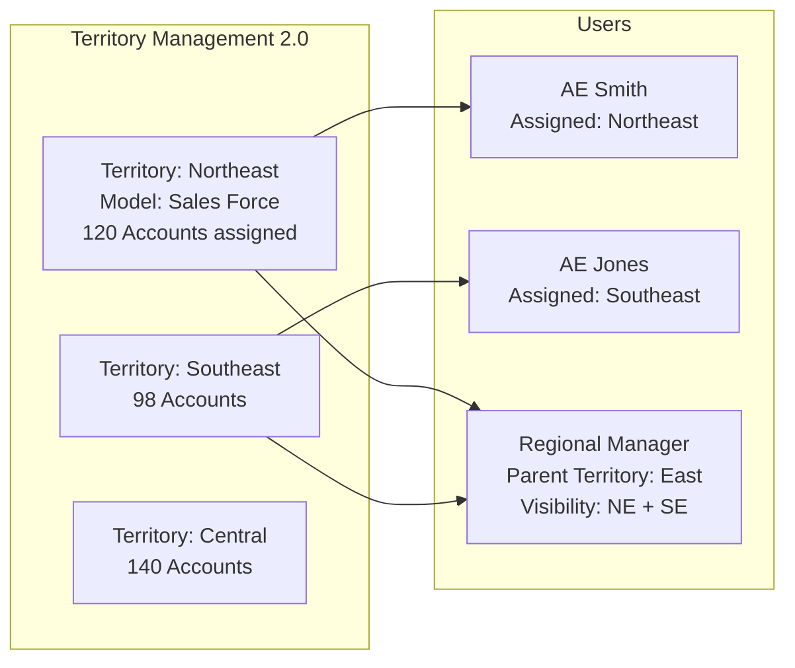

**Key Trade-offs**
- Territory Management vs. Role Hierarchy + Sharing Rules: Territory Management scales better for LDV objects (no per-record sharing recalculation when territory membership changes); Role Hierarchy requires sharing rules that generate row-level sharing records for every rule match
- Territory Management does not apply to Service objects (Case, Work Order) — service access requires separate sharing model design

**How to Justify to the Board**
"The 8.5M Account records exceed the LDV threshold. Private OWD with standard sharing rules generates one sharing record per Account per sharing rule match — at this volume with 400 reps, sharing recalculation can cause org-wide performance lockouts during territory reassignment. Territory Management 2.0 avoids per-record sharing recalculation for territory-based access because access is evaluated at query time through territory membership, not through pre-computed sharing records."

---

## Pattern 2 — Three-Phase Migration Pattern

**When to Use**
Any scenario involving migration of an active system to Salesforce. Applicable whether the source is a legacy CRM (Siebel, Oracle, Microsoft Dynamics) or another Salesforce org. Any migration with >100K records on any object, or where go-live requires zero downtime.

```mermaid
sequenceDiagram
    participant Legacy
    participant ETL
    participant SF as Salesforce
    participant QA as Quality Gate

    Note over Legacy,SF: Phase 1 — Historical Load
    Legacy->>ETL: Extract historical/closed records
    ETL->>SF: Bulk API upsert with ExternalId__c
    SF->>QA: Record count + relationship integrity check

    Note over Legacy,SF: Phase 2 — Active Data Load (parallel operation)
    Legacy->>ETL: Extract all open/active records + dedup
    ETL->>SF: Bulk API upsert
    Note over Legacy,SF: Legacy still primary SOR — both systems active

    Note over Legacy,SF: Phase 3 — Delta Cutover
    Legacy->>Legacy: READ-ONLY
    Legacy->>ETL: Delta since Phase 2 extract
    ETL->>SF: Final upsert
    SF->>QA: 2-hour validation window
    alt PASS
        SF-->>Legacy: SF becomes SOR; Legacy archived
    else FAIL
        QA-->>Legacy: Rollback: Legacy returns to READ-WRITE
    end
```

**Key Trade-offs**
- Three-phase vs. single big-bang cutover: three-phase reduces cutover window risk at the cost of a longer parallel operation period; big-bang is faster but higher risk
- Rollback requirement: legacy system must remain in a restorable state through Phase 3; do not destructively modify legacy data before SF validation passes

**How to Justify to the Board**
"The three-phase pattern decouples migration risk from go-live risk. Phase 1 (historical data) carries zero business risk — closed records are not in active use. Phase 2 (active data) runs in parallel with the legacy system, so if data integrity issues are found they can be corrected before cutover. Phase 3 (delta cutover) has a defined rollback procedure and a 2-hour validation window. This contrasts with a big-bang migration where validation failures on go-live day leave the business with no fallback — which is an unacceptable risk posture for a business-critical system."

---

## Pattern 3 — External ID Idempotent Upsert Pattern

**When to Use**
Any object that receives data from an external system — either in migration or ongoing integration. Objects without external IDs cannot be safely reloaded after a failed migration attempt and cannot be deduplicated across systems.

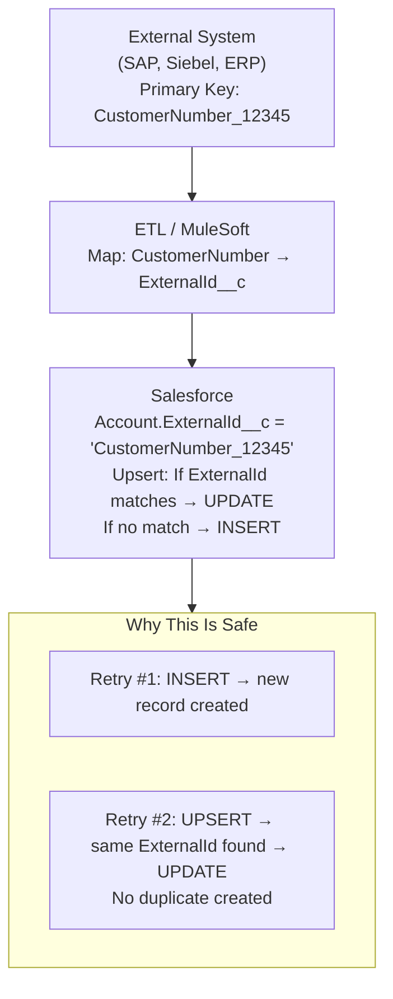

**Key Trade-offs**
- One ExternalId__c field per source system: if an object receives data from multiple source systems, each source needs its own External ID field (e.g., `SAPId__c`, `SiebelId__c`, `LegacySFId__c`)
- External ID fields must be Text(255) with External ID checkbox and Unique checkbox checked
- Relationship upserts: when loading child records (Contact under Account), use the parent Account's External ID in the relationship field — eliminates the need to know Salesforce Record IDs before loading children

**How to Justify to the Board**
"Every object in this migration receives data from SAP using SAP's primary key as the ExternalId__c field value. This enables idempotent upserts — if the migration fails at record 800,000 of 1M and must be rerun, the Bulk API upsert finds the already-loaded records by ExternalId, updates them, and inserts only the records not yet loaded. Without External IDs, a failed migration retry creates duplicates. External IDs are also the mechanism for relationship mapping — when loading Contact records, we reference the parent Account by its SAP customer number, not by Salesforce Record ID, which we don't know at load time."

---

## Pattern 4 — Platform Event Asynchronous Decoupling

**When to Use**
Integration scenarios where: (1) external system availability should not affect Salesforce user experience; (2) Salesforce events must trigger near-real-time external system updates; (3) fan-out is required (one Salesforce event consumed by multiple external subscribers); (4) retry and replay capability is required for integration reliability.

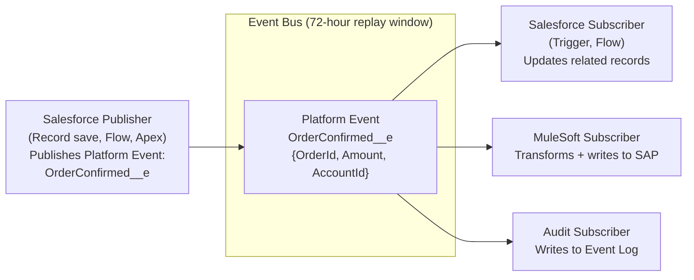

**Key Trade-offs**
- Platform Events vs. Change Data Capture (CDC): Platform Events are explicitly published (application must trigger them); CDC automatically publishes for any supported object record change. Use Platform Events when the business event is richer than a record change (includes calculated data, multi-object context); use CDC when any change to a record must propagate to downstream systems.
- Platform Events are guaranteed delivery within the 72-hour replay window — if a subscriber is down, it replays missed events on recovery. This is the resilience advantage over synchronous callouts.
- Delivery order is not guaranteed for high-volume Platform Events — if strict ordering is required, use a sequence number field and handle out-of-order events in the subscriber

**How to Justify to the Board**
"The order confirmation event path uses Platform Events rather than a synchronous Apex callout to SAP for resilience. If SAP is unavailable when an AE clicks Close-Won, a synchronous callout would fail the save action and block the AE. With Platform Events, the order event is published to the Event Bus immediately; the AE's save succeeds; MuleSoft picks up the event and writes to SAP when SAP is available. If SAP is down for 4 hours and then recovers, MuleSoft replays the queued events and writes all orders in sequence. The 72-hour replay window ensures no events are lost."

---

## Pattern 5 — Shield Compliance Stack

**When to Use**
Any scenario with: HIPAA, GDPR (high sensitivity), PCI-DSS, SOX, FINRA data retention, or any regulatory obligation requiring field-level encryption, change audit trail, or detailed access audit. The three components are often used together but have distinct applicability.

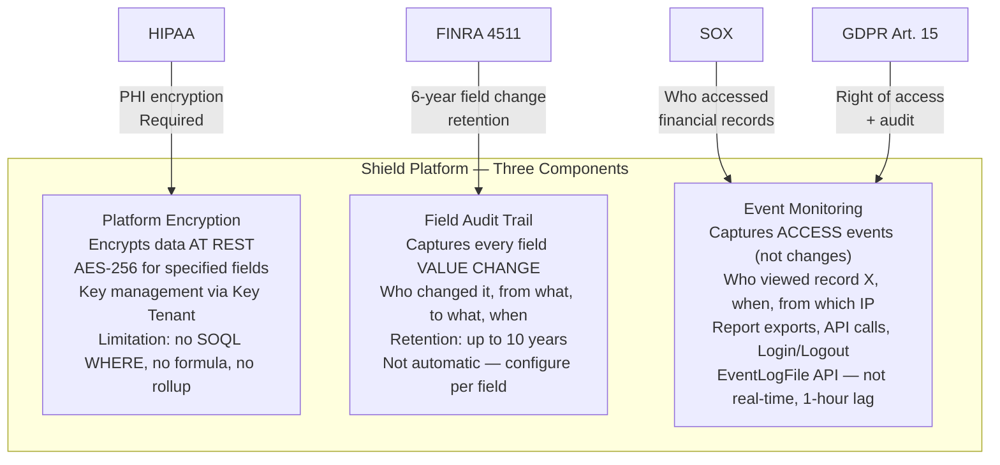

**Key Trade-offs**
- Platform Encryption field limitations: encrypted fields are excluded from standard indexes, cannot be used in SOQL WHERE clauses, formula fields, or roll-up summaries. Architectural response: use an unencrypted reference field (e.g., MRN for patient lookup) as the query key; encrypt only the fields required by regulation, not all PII.
- Field Audit Trail vs. History Tracking: standard Salesforce History Tracking retains 18 months maximum; Field Audit Trail retains up to 10 years. FAT must be explicitly configured per field — it does not auto-capture all fields.
- Event Monitoring lag: EventLogFile entries are available approximately 1 hour after the event. For real-time access alerts (e.g., compliance alert when an executive's record is accessed), use Shield Transaction Security Policies which can trigger a real-time Flow.

**How to Justify to the Board**
"The HIPAA compliance requirement maps directly to three Shield components: Platform Encryption for PHI fields at rest (required by HIPAA Security Rule §164.312(a)(2)(iv)), Field Audit Trail for field change history on clinical and financial data (FINRA equivalent: 6-year retention), and Event Monitoring for access audit trail (HIPAA §164.312(b) audit controls — 'implement hardware, software, and/or procedural mechanisms to record and examine activity in information systems'). I'm applying Shield selectively — not to all fields, because encrypting operational query fields breaks the sharing and reporting architecture. Specifically: Name, DOB, SSN, and Diagnosis are encrypted; MRN (the query key) is not."

---

## Pattern 6 — MuleSoft API-Led Connectivity

**When to Use**
Any scenario with: (1) multiple integration endpoints (>3 external systems); (2) enterprise integration governance requirement (all integrations must go through the corporate integration platform); (3) reusable integration assets across multiple Salesforce clouds or multiple projects; (4) complex transformation, orchestration, or routing between systems.

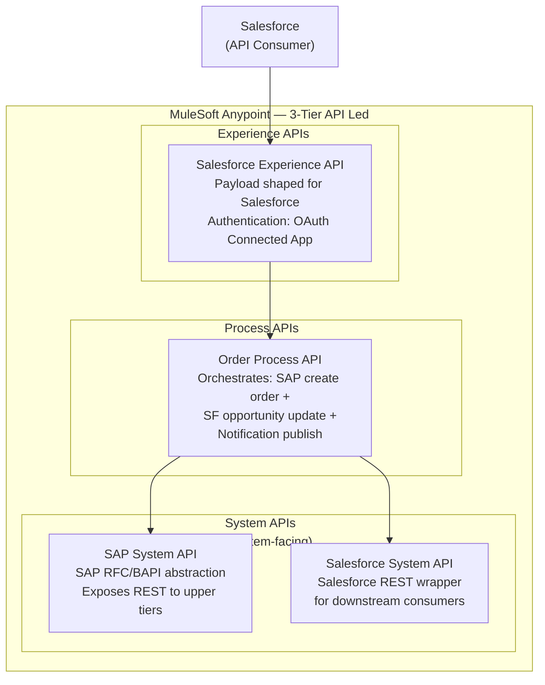

**Key Trade-offs**
- API-Led vs. point-to-point: API-Led adds an initial build cost (3 API tiers instead of 1 direct connection) but produces reusable assets that reduce total cost over time; point-to-point is faster initially but creates a maintenance burden as integration count grows
- API-Led is not always necessary: for simple, single-direction, low-volume integrations (e.g., nightly FTP file processing), the three-tier model adds unnecessary complexity; use it when reusability and governance justify the overhead

**How to Justify to the Board**
"The API-led model is justified here by three factors: (1) the customer has an enterprise integration governance requirement that all integrations must go through MuleSoft; (2) the same SAP pricing data is consumed by both the Salesforce CPQ integration and a separate B2B Commerce integration in scope for Phase 2 — the SAP System API is reused without rebuilding; (3) the process tier can orchestrate the multi-system order creation (SAP SD + Salesforce record update + email notification) as a single transactional unit, which a direct Apex callout cannot do."

---

## Pattern 7 — Experience Cloud Sharing Model (Sharing Sets + Sharing Rules)

**When to Use**
Any scenario with external portal users (customers, partners, patients, volunteers) who need row-level access to records related to their Account or Contact. Portal users exist outside the internal role hierarchy; standard sharing mechanisms do not apply without specific portal-aware configuration.

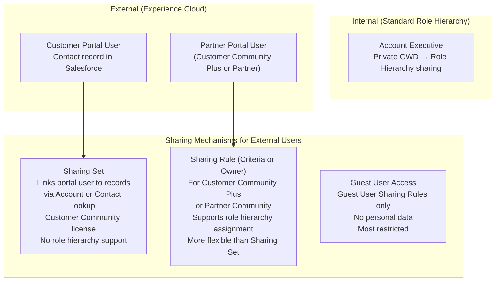

**Key Trade-offs**
- Sharing Set vs. Sharing Rule for portal users: Sharing Sets are simpler but limited — they can only grant access to records where the portal user's Account or Contact is a direct lookup field. Sharing Rules for Community users (Customer Community Plus) provide more flexibility but require role assignment for portal users.
- Guest User access: Guest Users can be granted access to records via Guest User Sharing Rules but should never see personal data; any record with personal data must require authentication.
- Customer Community Plus license vs. External App license: External App (new) is more flexible in object access; Customer Community Plus is the legacy equivalent. New implementations should use External App licensing.

**How to Justify to the Board**
"Distributor portal users are Customer Community Plus license (or External App equivalent) because they need access to Opportunity records for deal registration and pipeline management — standard Customer Community license does not provide Opportunity access. Sharing Sets alone are insufficient because deal registration requires Opportunity creation (not just read access to existing records linked to the distributor's Account). Sharing Rules for Community users grants Opportunity access to distributor users scoped to opportunities where the Distributor_Account__c lookup matches the portal user's account."

---

## Pattern 8 — FHIR as a View (Healthcare Integration Pattern)

**When to Use**
Healthcare scenarios where: (1) an EHR (Epic, Cerner, Meditech) has an HL7 FHIR R4 API; (2) the legal or compliance posture prohibits duplicating PHI in the CRM; (3) real-time clinical context is needed for care coordination workflows; (4) the EHR is the authoritative system and Salesforce is the engagement layer.

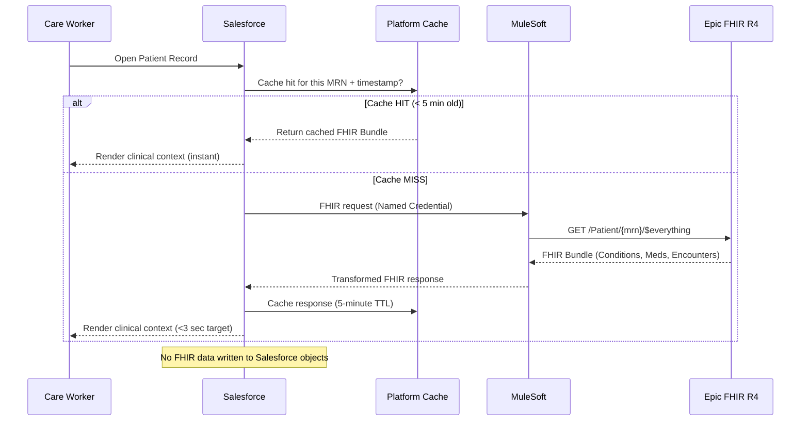

**Key Trade-offs**
- FHIR as a View vs. Stored Clinical Data: stored data enables offline access, faster queries, richer Salesforce reporting; FHIR-as-view reduces PHI liability surface, ensures data freshness, eliminates Salesforce storage for PHI. Decision driven by legal/compliance posture.
- 42 CFR Part 2 (substance use disorder records): FHIR-as-view does not automatically solve consent management for SUD data — the FHIR endpoint must enforce consent validation; if the EHR's FHIR API does not enforce SUD consent, the CRM layer must apply additional access gates.

**How to Justify to the Board**
"The legal team has determined that duplicating PHI in a CRM system creates regulatory exposure under HIPAA's minimum-necessary-access principle. The 'FHIR as a View' pattern addresses this: Epic is the system of record for all clinical data; Salesforce renders it on demand via a Named Credential FHIR callout but does not write any clinical data to Salesforce objects. If the FHIR call fails, the UI degrades gracefully to a 'Clinical data temporarily unavailable' message — the care coordinator can still work with Salesforce-native data (care plans, interaction history, program enrollment) while the FHIR system recovers."

---

## Pattern 9 — Apex Managed Sharing (Row-Level Access Override)

**When to Use**
When the required sharing logic cannot be expressed through standard Salesforce sharing mechanisms (OWD + Role Hierarchy + Sharing Rules + Territory Management). Common cases: sharing based on a custom data attribute that isn't a user or territory lookup; sharing that changes based on a workflow state; access patterns that require programmatic evaluation of multiple conditions.

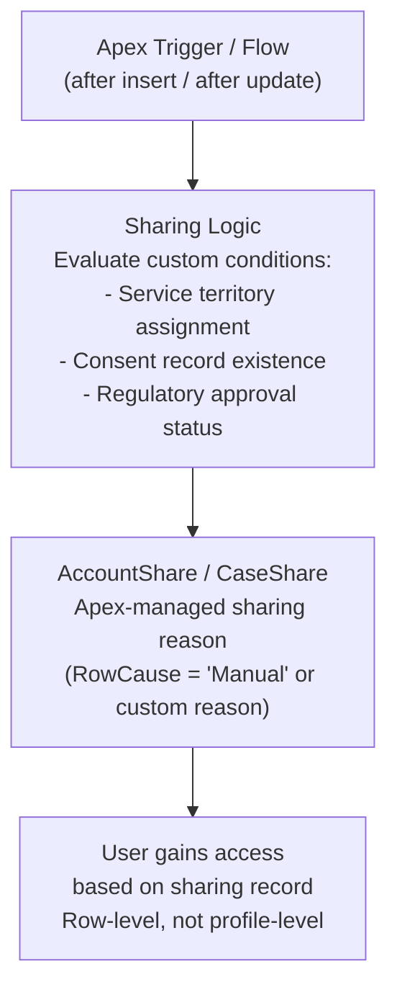

**Key Trade-offs**
- Apex Managed Sharing is powerful but fragile: sharing records created by Apex must be explicitly deleted when no longer needed; if the trigger fails or is bypassed, sharing records may be orphaned or missing
- Performance: creating thousands of sharing records via Apex trigger on a high-volume object can cause trigger timeout; batch job pattern preferred for bulk sharing updates
- Maintenance overhead: changes to sharing logic require code changes, not admin configuration — increases technical debt if overused

**How to Justify to the Board**
"The service engineer access model cannot be expressed through standard sharing: engineers need access to all Assets and Cases in their geographic dispatch territory, regardless of which AE or distributor originally sold the account. Territory Management handles Account-based sales territories; it does not apply to Asset/Case service territories. Apex Managed Sharing creates a row-level sharing record on each Account and Asset in the engineer's dispatch zone, with a custom row cause 'ServiceTerritoryAccess.' This is maintained by a scheduled Apex batch that runs nightly when territory assignments change — not by a real-time trigger — to avoid performance impact on the live org."

---

## Pattern 10 — Org Strategy: Single Org with Hyperforce Data Residency

**When to Use**
GDPR or data sovereignty requirements that specify data must reside in a particular geography, combined with a business need for unified Salesforce instance (single Customer 360 data model). Preferred over multi-org when legal review accepts Hyperforce contractual data residency as sufficient.

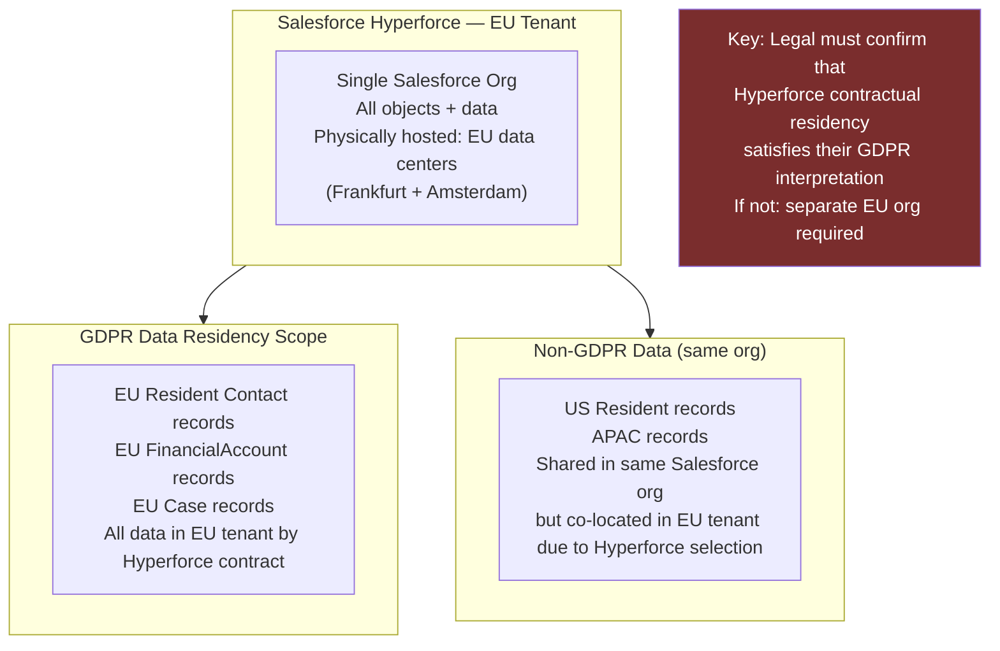

**Key Trade-offs**
- Hyperforce single org vs. separate EU org: Hyperforce is simpler (one org, one admin team, unified reports); separate EU org is a harder regulatory boundary but doubles integration complexity and prevents unified Customer 360 view
- Hyperforce data residency covers infrastructure (where data is stored on disk); it does not prevent data from being accessed by US-based administrators — access controls are a separate architectural layer

**How to Justify to the Board**
"I'm recommending a single org on Hyperforce EU tenant rather than a separate EU org for one primary reason: the business requires a unified customer 360 view, which is impossible if EU and non-EU customer records are in separate orgs. Hyperforce contractual data residency satisfies the data localization requirement. I've flagged this as an assumption that requires legal validation before architecture sign-off — some legal teams require a physically separate org for GDPR compliance, and if that is MedNet's legal interpretation, the architecture requires a redesign toward separate EU org with cross-org integration."

---

## Pattern 11 — Skinny Tables + Custom Indexes for LDV Query Performance

**When to Use**
Objects with >10M records where specific query patterns are causing scan performance issues. Not a first-line solution — start with OWD design and selective custom indexes; skinny tables are applied when those are insufficient.

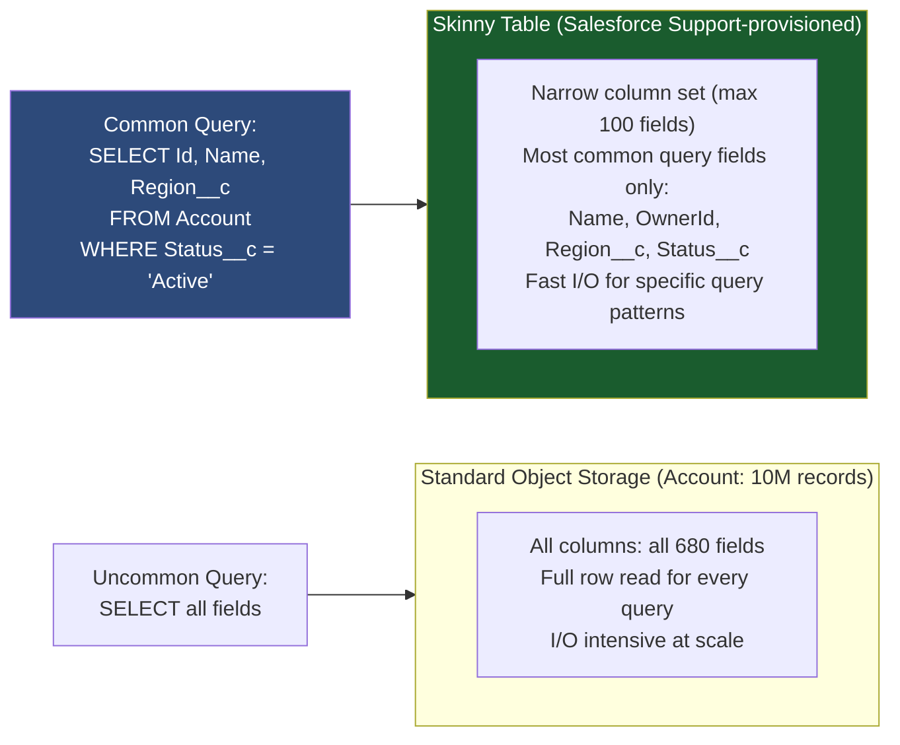

**Key Trade-offs**
- Skinny tables are not self-service: they must be provisioned by Salesforce Support; provisioning takes days; they are not immediately available after a sandbox refresh (must request anew)
- Custom indexes vs. skinny tables: a custom index helps the query optimizer find records; a skinny table reduces the data read cost after the records are found. Both may be needed on the same object.
- Skinny tables become stale if the schema changes: adding columns to the base object does not automatically add them to the skinny table — schema changes require a support request to update the skinny table definition

**How to Justify to the Board**
"At 10M Accounts, list view and report performance on common query patterns (filter by Region, Status, and OwnerId) was modeled to be inadequate with standard indexes alone — the I/O cost of reading full Account rows (with 680 custom fields) for every filtered result set is the bottleneck, not the row lookup. A skinny table containing 12 fields (the fields used in the top-5 most common query patterns) reduces the I/O cost by ~95% for those patterns. I'd initiate the Salesforce Support request for skinny table provisioning in Phase 1 so it's available by go-live. This is combined with a custom index on Region__c and Status__c to address the selectivity side of the query plan."

---

## Pattern 12 — SCIM Provisioning for User Lifecycle

**When to Use**
Enterprise deployments with 500+ users where manual user management creates access control risk. Any organization with an existing Okta, Azure AD, or Ping identity management system.

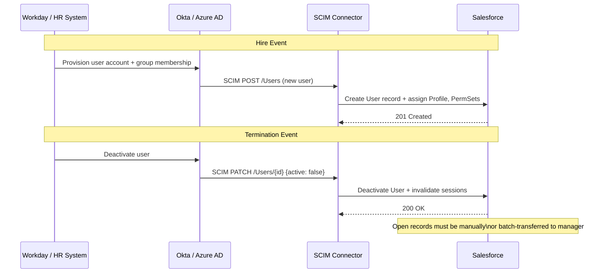

**Key Trade-offs**
- SCIM vs. JIT provisioning: SCIM provides pre-provisioning (user account exists before first login) and immediate deprovisioning (account deactivated without user logging in); JIT creates the account on first login (no pre-provisioning) and cannot deactivate without a separate process
- SCIM does not handle all Salesforce attributes: SCIM can set standard user attributes (FirstName, LastName, Email, IsActive) and map to Profiles, but Salesforce-specific attributes (Role, Territory, Record Types) typically require supplemental configuration or a custom Apex user management hook

**How to Justify to the Board**
"The 85,000 store associate user population requires automated lifecycle management. Manual provisioning at this scale is operationally impossible — even a 1% monthly turnover (850 users/month) requires 850 manual account creations and deactivations by the IT team. SCIM provisioning from Workday (the HR system of record for store associates) automates this: Workday sends a SCIM event to Salesforce within 24 hours of an employment status change. Immediate deprovisioning is the security-critical capability — a terminated associate's Salesforce session is invalidated within hours of HR recording the termination, not when IT gets to the manual task queue."

---

## Pattern 13 — CPQ Pricing Waterfall

**When to Use**
Complex pricing scenarios with multiple pricing tiers, customer segments, volume discounts, and approval workflows. The CPQ Pricing Waterfall is the sequence in which price adjustments are applied; understanding and naming the sequence demonstrates CPQ architecture depth.

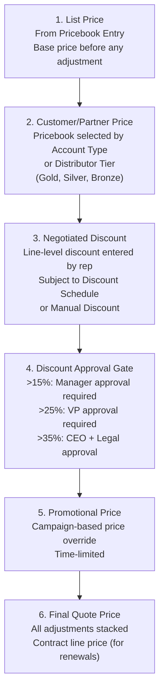

**Key Trade-offs**
- Pricebook multiplicity: one Pricebook per pricing tier × currency combination vs. a single Pricebook with custom price rules. At high SKU counts, multiple Pricebooks are simpler to maintain; custom price rules are more flexible but harder to debug.
- Approval threshold configuration: CPQ approval rules vs. standard Salesforce Approval Processes. CPQ native approval rules are more tightly integrated with the CPQ quote flow; standard approval processes are more flexible for complex multi-level workflows.

**How to Justify to the Board**
"The CPQ pricing waterfall handles GlobalTech's four-tier distributor pricing model through Pricebook selection: each distributor tier (Platinum, Gold, Silver, Bronze) has its own Pricebook populated from SAP pricing conditions via the nightly sync. The rep's quote line item automatically selects the distributor's Pricebook based on the Account's Distributor_Tier__c field. Volume discounts are applied through CPQ Discount Schedules — structured tables that automatically apply the correct volume break. Manual discounts above 15% trigger a CPQ Approval Rule requiring manager sign-off before the quote can be advanced — this is enforced in CPQ, not in a separate workflow, so it cannot be bypassed by quote cloning or manual price overrides."

---

## Pattern 14 — Two-Tier Archive (Standard Objects + Big Objects)

**When to Use**
Scenarios with large historical data volumes (>20M records on a single object) combined with a regulatory retention requirement (7-10 years). The two-tier approach keeps recent, operationally relevant records in standard objects for full platform capability, and moves aged records to Big Objects for cost-efficient long-term storage.

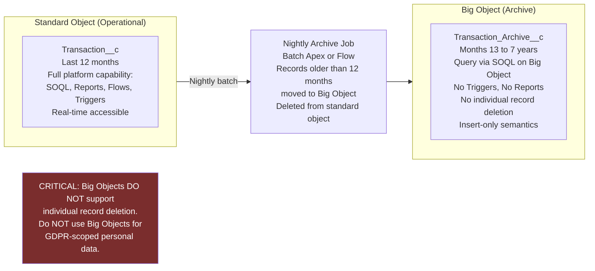

**Key Trade-offs**
- Big Objects vs. External Archive (S3 + Tableau CRM): Big Objects keep data in the Salesforce ecosystem (accessible via SOQL); external archive offers cheaper storage and richer analytics but requires an additional tool and breaks the single-platform model
- Big Objects cannot be used for GDPR personal data (no deletion capability)
- Reporting on Big Object data: standard Salesforce Reports do not query Big Objects; Tableau CRM (Einstein Analytics) can ingest Big Object data for analytical reports

**How to Justify to the Board**
"The two-tier archive pattern keeps the Transaction__c object below 10M records in the standard tier, which maintains query performance and avoids LDV degradation for the active data. Records older than 12 months are moved to a Big Object archive nightly. The archive satisfies the 7-year retention requirement at significantly lower storage cost. I'm specifically noting that this pattern is only applicable to the transaction data (purchase history), not to the consumer Contact/PersonAccount records — those are GDPR-scoped and cannot use Big Objects because Big Object records cannot be individually deleted for a right-to-erasure request."

---

## Pattern 15 — 42 CFR Part 2 Consent Gate

**When to Use**
Healthcare scenarios involving behavioral health, mental health, or substance use disorder programs where federal law (42 CFR Part 2) requires explicit patient consent before disclosing SUD treatment records — even to other treating providers.

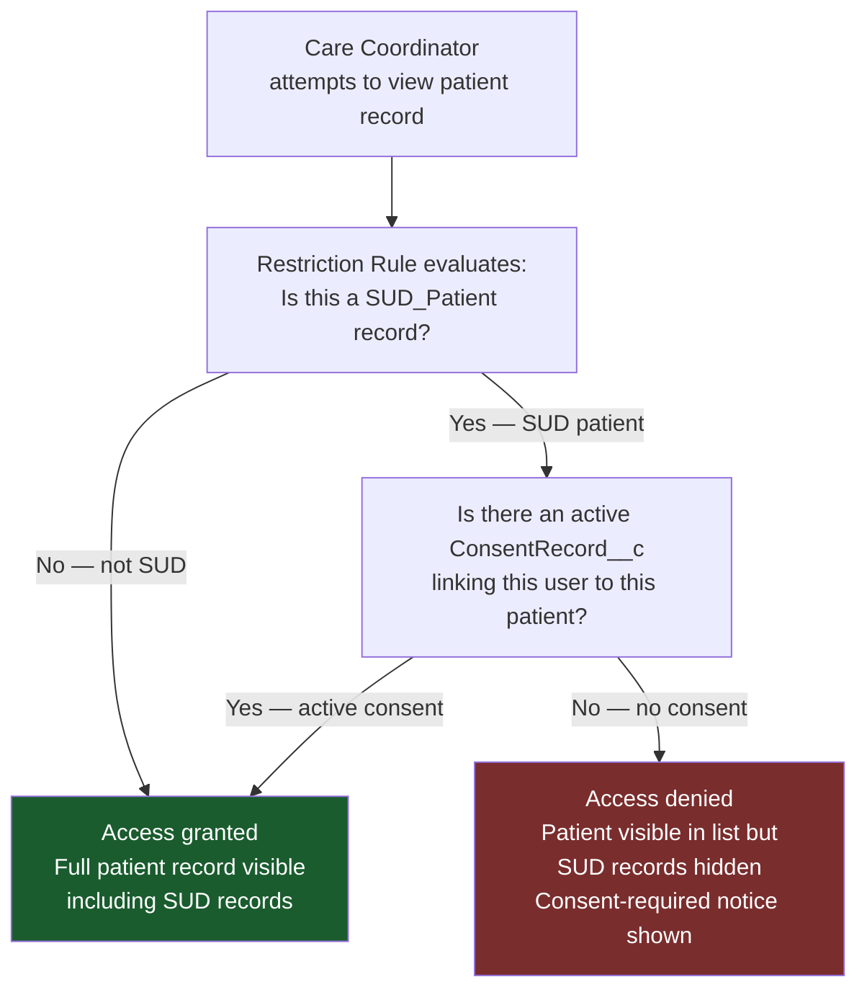

**Key Trade-offs**
- Restriction Rules (platform-native) vs. Apex Managed Sharing: Restriction Rules are declarative and evaluated at query time — no sharing records to manage. Apex Managed Sharing requires maintaining sharing records per consent. Restriction Rules preferred for this use case.
- Consent expiration: ConsentRecord__c must have an expiration date field; an automated Flow or Scheduled Apex deactivates expired consents and removes access — this cannot be a manual process in a compliant healthcare architecture.

**How to Justify to the Board**
"42 CFR Part 2 is a more restrictive federal regulation than HIPAA — it specifically governs SUD treatment records and prohibits disclosure without patient consent, even to other treating providers. The Restriction Rule pattern gates access at the data layer: SUD-flagged records are hidden from all users unless they have an active ConsentRecord__c specifically authorizing their access to that patient's SUD information. This is enforced by the platform, not by application logic — a care coordinator cannot bypass this gate by modifying a URL parameter or using a direct API call, because the Restriction Rule is evaluated at the SOQL level in all query contexts."

---

## Pattern 16 — Multi-IdP Tiered Portal Identity

**When to Use**
B2B partner or distributor portals where external users come from companies with varying identity infrastructure — some have enterprise IdPs (Okta, Azure AD), some have basic LDAP, some have no IdP at all. Salesforce supports up to 12 SAML SSO configurations per org; a tiered strategy serves larger partners individually and smaller partners through a shared IdP service.

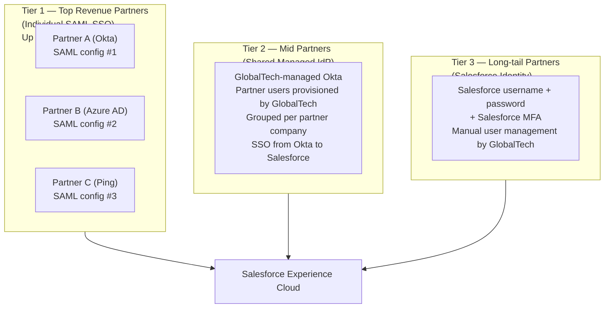

**Key Trade-offs**
- Managed IdP (Tier 2) adds cost (Okta licensing for managed tenant) but reduces Tier 3 management overhead as partners grow
- Salesforce 12-SAML-config limit: if the org grows to >12 partners requiring individual SSO, a federated IdP broker (Okta as a hub that connects to multiple customer IdPs) can route all partner SSO through a single SAML configuration in Salesforce

**How to Justify to the Board**
"With 1,800 distributors and a 12-SAML-configuration limit per Salesforce org, one-config-per-distributor is not viable. The tiered approach segments by strategic value: the top 12 distributors by revenue (representing ~60% of channel revenue) get individual SAML SSO for the best user experience and enterprise-grade identity management. The next ~200 distributors use a GlobalTech-managed Okta tenant — they get SSO without requiring GlobalTech to configure individual SAML integrations. The long-tail 1,600 distributors with 1-5 users use Salesforce-managed credentials, which is acceptable for occasional users. This tiered approach serves 80% of channel revenue with SSO while keeping the configuration complexity manageable."

---

## Pattern 17 — NPSP to Nonprofit Cloud Migration

**When to Use**
Nonprofit organizations currently on NPSP whose implementation has accumulated technical debt, whose NPSP configuration conflicts with NPSP standard behaviors (custom triggers override NPSP), or who need capabilities that NPC provides but NPSP does not (Program Management Module, modern Fundraising, native grants management).

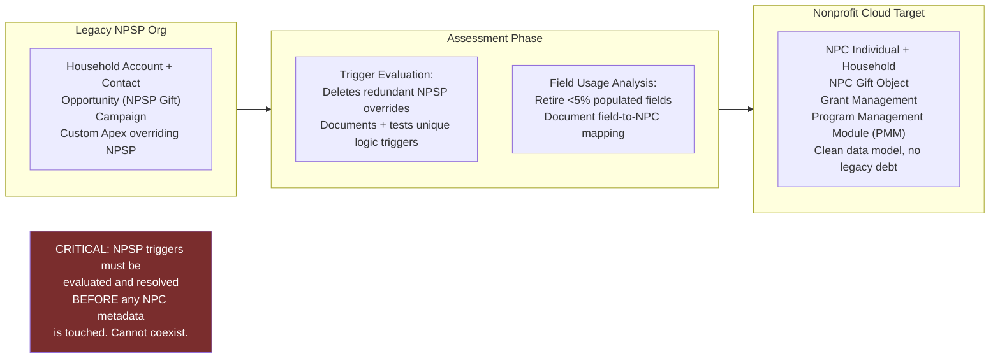

**Key Trade-offs**
- In-place upgrade vs. new org build: in-place preserves 8 years of history automatically but inherits all technical debt and NPSP version state; new org build produces a clean NPC implementation but requires full data migration planning
- NPC is newer: less community knowledge, fewer third-party integrations, some ISV packages not yet NPC-certified. This is a legitimate risk to name; mitigation is confirming NPC certification of all required ISV packages before architecture sign-off

**How to Justify to the Board**
"The new-org build is recommended over in-place upgrade for HopeWorks because the current NPSP installation has custom Apex triggers that directly override NPSP standard behaviors — specifically the household rollup triggers and the duplicate prevention logic. These overrides are incompatible with NPC's updated data model and would require removal before NPC could function correctly. Given that we're removing these overrides anyway, a clean NPC build with planned data migration is architecturally cleaner than trying to untangle the overrides in place while simultaneously migrating to a new data model."

---

## Pattern 18 — Cross-Domain Interaction: LDV × Sharing × Integration

**When to Use**
This is not a standalone pattern but a checklist for validating cross-domain architectural consistency. The most common CTA failure is designing domains in isolation and missing the interactions. Apply this check at the end of every CTA presentation.

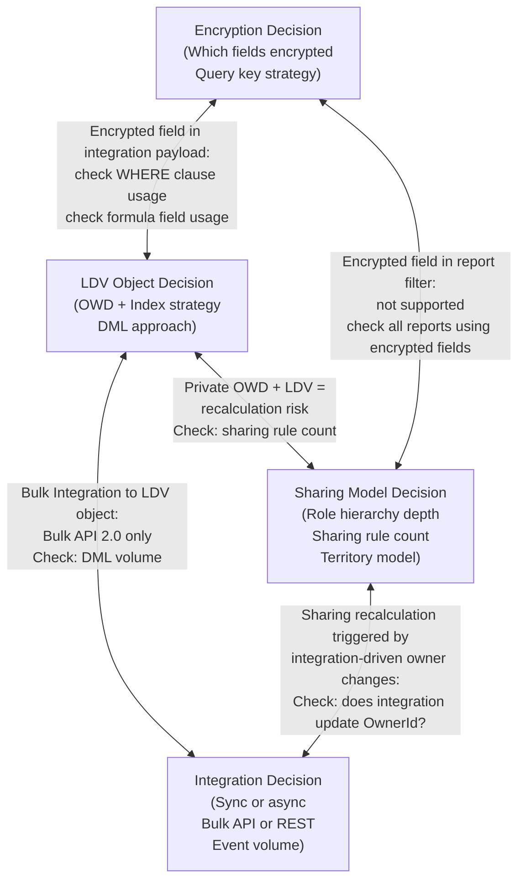

**Validation Checklist:**
- [ ] Does the LDV object have Private OWD? → Check sharing rule count and recalculation risk
- [ ] Does the integration update OwnerId on the LDV object? → Each OwnerId update triggers sharing recalculation
- [ ] Does any integration query use an encrypted field in a WHERE clause? → Encrypted fields cannot be indexed — query will full-scan
- [ ] Does the sharing model rely on a field that is also updated by integration? → Sharing recalculation triggered by integration is a performance risk
- [ ] Is there a skinny table or custom index for the most common query pattern on the LDV object? → Required at >10M records
- [ ] Does the compliance encryption scope conflict with reporting requirements? → Encrypted fields cannot be used in report groupings or filters

**How to Justify to the Board**
"Before finalizing the architecture, I run a cross-domain consistency check because the most common failure mode in enterprise architectures is designing each domain correctly in isolation but missing the interactions. Specifically: I check that the LDV sharing model choice is compatible with the integration's write patterns (does the integration update OwnerId on the LDV object — if so, the sharing recalculation triggered by each integration write is a performance risk). I check that the Shield Encryption scope doesn't include fields used in integration WHERE clauses or report filters. These cross-domain checks are part of the architecture review before I present — they are the architectural quality gate that prevents internal contradictions from reaching production."

---

## Quick Reference — Pattern Matching Signals

| Scenario Signal | Pattern to Apply |
|-----------------|-----------------|
| ">1M records on any object" | LDV treatment: OWD, indexes, skinny tables |
| "Sales force organized by territory" | Territory Management (Pattern 1) |
| "Migrate from [Legacy System]" | Three-phase migration (Pattern 2) + External ID (Pattern 3) |
| "Multiple systems sending data to Salesforce" | External ID per source system (Pattern 3) |
| "External system downtime should not affect Salesforce" | Platform Event decoupling (Pattern 4) |
| "HIPAA / SOX / GDPR / FINRA" | Shield compliance stack (Pattern 5) |
| "Multiple integration endpoints, enterprise governance" | MuleSoft API-Led (Pattern 6) |
| "Portal users — customers or partners" | Experience Cloud sharing (Pattern 7) |
| "Epic EHR / FHIR / no PHI in Salesforce" | FHIR as a View (Pattern 8) |
| "Access based on custom logic, not standard hierarchy" | Apex Managed Sharing (Pattern 9) |
| "GDPR + single Salesforce org" | Hyperforce EU Tenant (Pattern 10) |
| ">10M records, query performance issues" | Skinny Tables + Custom Indexes (Pattern 11) |
| "500+ users, automated provisioning" | SCIM Provisioning (Pattern 12) |
| "Complex pricing, CPQ, multi-tier discounting" | CPQ Pricing Waterfall (Pattern 13) |
| "7-year retention, high volume historical data" | Two-Tier Archive (Pattern 14) |
| "Behavioral health / substance use disorder" | 42 CFR Part 2 Consent Gate (Pattern 15) |
| "1,800 distributors, varying IdP capabilities" | Multi-IdP Tiered Portal (Pattern 16) |
| "NPSP migration, legacy customizations" | NPSP → NPC Migration (Pattern 17) |
| "Complex scenario, multiple domains" | Cross-Domain Validation Checklist (Pattern 18) |
