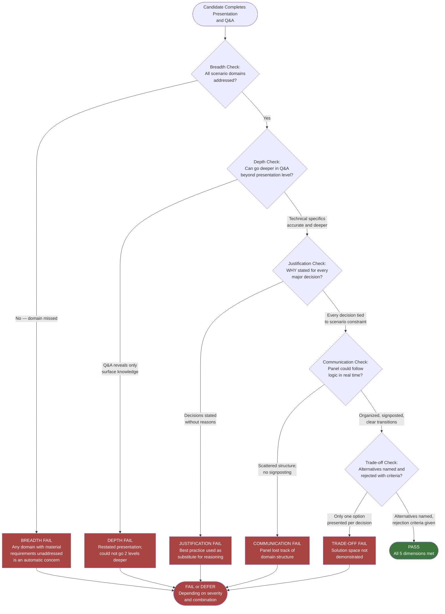

# CTA Exam Format Deep Dive

## Overview / Context

The CTA board exam is unlike any other credentialing process in the Salesforce ecosystem — and unlike most professional certification programs in enterprise software broadly. It is a live, unscripted performance assessed by a panel of three sitting CTAs who have passed the same exam themselves. There are no correct answers to look up, no rubric that a machine grades, and no partial credit for getting three of five requirements right. The panel evaluates you holistically: how you structure ambiguity, how you defend your reasoning under expert challenge, and whether the architecture you produce is fit for purpose given the constraints you were given. The exam is designed to answer a single question: would we trust this person to lead the most complex Salesforce programs in the world? Everything about the format — the scenario ambiguity, the time pressure, the Q&A challenge — is engineered to surface the answer to that question.

Understanding the format at a granular level is the first preparation task, because the exam rewards people who use the structure well and punishes people who improvise. Candidates who know the format deeply walk in with a plan: they know how they will use every minute of the scenario review phase, they have a presentation structure they can execute from memory, and they have rehearsed how they will respond to the most common Q&A challenge patterns. Candidates who underestimate the format spend their first 10 minutes of scenario review in an undifferentiated reading state, present their architecture as a stream of consciousness, and collapse under Q&A because they treated it as a surprise rather than an expected gauntlet.

This lecture documents the format in full — every phase, every minute allocation, the scoring rubric, and the failure modes that result from mismanaging the structure. Read it once for the overview, then read it again specifically to audit your current approach against each phase. The goal is that by the time you sit the exam, the format itself creates zero cognitive load — you know exactly what to do at every moment, so your brain is free to focus on the architecture.

---

## Core Concepts / Framework

### The Full Exam Format — Phase by Phase

#### Phase 1: Scenario Review (30 Minutes)

You are given the scenario alone, without the panel present. The document is printed or displayed digitally. Physical annotation tools (highlighters, pens) are typically available. The scenario is 3-5 pages and is structured as follows:

**Scenario document structure:**

| Section | Typical Content | Your Job in This Section |
|---|---|---|
| Business overview | Industry, company size, business model, competitive context | Understand who the company is and what drives their decisions |
| Current state | Existing Salesforce orgs (if any), legacy systems, integrations, pain points | Identify technical debt, constraints on what can be changed |
| Requirements | 3-5 numbered, explicitly stated requirements | The core of your architecture work — tag each one with its domain |
| Constraints | Budget, timeline, regulatory, system retention mandates | Hard constraints shape every downstream decision |
| Future state | Where they want to be in 12-24 months | Sets the target architecture horizon |
| Implied context | Numbers, geographic mentions, user type references | These are implied requirements you must surface |

**30-minute time allocation:**

| Minutes | Activity | Detail |
|---|---|---|
| 0-10 | Two full reads | First read: read for business context only — understand the company, not the requirements. Second read: read for technical requirements — annotate domains, constraints, numbers. |
| 10-25 | Deep annotation | Mark every requirement with its domain (D, S, I, IAM, ALM, App). Mark constraints H (hard) or S (soft). Circle all volume/scale numbers. Underline implied requirements. Put a ? next to every unknown. |
| 25-29 | Structure your presentation | Decide: what are your 4-6 domains? What is your opening assumption set? What diagram will you draw first? What are the three most defensible trade-offs you'll state proactively? |
| 29-30 | Final sweep | Confirm no requirement is unaddressed. Check that your assumption list covers the major gaps. |

**What NOT to do in Phase 1:**
- Do not start designing the architecture before you have read the entire scenario. Jumping to a solution on page 2 is how you miss a critical constraint on page 4.
- Do not treat the 30 minutes as purely reading time. You should have a structured plan for your presentation before the phase ends.
- Do not panic about unknowns — every scenario has them by design. Your job is to name them as assumptions, not to resolve them.
- Do not skip the constraint section. Many candidates read requirements carefully and skim constraints. A constraint like "cannot replace SAP ERP" reshapes your entire integration strategy.

---

#### Phase 2: Presentation (45 Minutes)

The panel enters and the clock restarts. You own the structure entirely — the panel will not guide you, prompt you to move faster, or tell you what to cover. They observe, take notes, and may make brief clarifications (though usually they wait for Q&A).

**The non-negotiable structural elements:**

| Element | Time | Content |
|---|---|---|
| Opening | 3 min max | Business context summary (2 sentences), your assumptions (2-4 explicit), domains you'll cover (list them) |
| Domain coverage | 6-8 min per domain | Requirements mapping → decision → justification → trade-offs → next domain |
| Diagrams | 2-3 min each | Drawn while narrating, not pre-drawn before you start talking |
| Closing | 2-3 min | Summary of 3-5 key architectural decisions and the thread connecting them |

**Domain coverage formula (per domain):**
1. "Requirement X from the scenario drives [domain] decisions."
2. "My recommendation is [decision]."
3. "I chose this because [reason tied to scenario constraint or requirement]."
4. "The alternative I considered was [Y]. I rejected it because [criterion]."
5. "The trade-off I'm accepting is [cost or risk]. I would revisit this if [condition]."

This formula, applied to every domain, produces a presentation that scores on justification, depth, and trade-off reasoning simultaneously.

**Time allocation by scenario complexity:**

| Scenario Type | Domains | Time per Domain | Buffer Remaining |
|---|---|---|---|
| 3-domain scenario | 3 | 10 min each | 3+30+3 = 36 min → 9 min buffer |
| 4-domain scenario | 4 | 7-8 min each | 3+30+3 = 36 min → 9 min buffer |
| 5-domain scenario | 5 | 6 min each | 3+30+3 = 36 min → 9 min buffer |
| 6-domain scenario | 6 | 5 min each | 3+30+3 = 36 min → 9 min buffer |

The 9-minute buffer is consumed by diagram drawing and transitions. Do not plan to use it for extended depth on one domain.

**Whiteboard discipline:**
- Draw a system context diagram (actors + Salesforce + external systems) in the first 10 minutes of your presentation. It becomes your visual anchor for everything you say afterward.
- Draw while narrating — the act of drawing with commentary is a communication signal to the panel that you think visually and can communicate architecture, not just describe it in words.
- Label every arrow with a protocol, pattern, or data flow description (REST, SAML, CDC, Platform Events, batch, async). Unlabeled arrows mean nothing.
- Do not draw: ERD diagrams with field-level detail, screen mockups, workflow step-by-step diagrams. These are implementation-level artifacts, not architecture.

---

#### Phase 3: Q&A (45 Minutes)

Q&A begins immediately after your closing statement. The panel has been taking notes throughout your presentation and arrives at Q&A with a list of decisions they want to probe. Every major architectural decision you made is a candidate for challenge.

**The five types of Q&A questions:**

| Type | Example | What It Tests | How to Respond |
|---|---|---|---|
| **Clarifying** | "When you said you'd use Platform Events for the integration, can you walk us through the delivery guarantee and how you'd handle subscriber failure?" | Depth — can you go 2 levels deeper than your presentation? | Go deeper with specifics: delivery guarantee tiers, RetryableException, Dead Letter Queue strategy |
| **Challenging** | "Why not MuleSoft here instead of the native integration you described?" | Trade-off reasoning — do you understand the full solution space? | Acknowledge validity: "MuleSoft is the right answer if there's an existing Anypoint investment or if the integration will fan out to 8+ systems. In this scenario, I read it as a point-to-point integration with a single legacy system, so native callouts with Named Credentials is lower overhead. If the scope expanded, I'd revisit." |
| **Stress-testing** | "Your design handles current volume. What happens if this company acquires two BUs and volume triples in year two?" | Scalability and architectural resilience | Name the breaking point: "At 3x volume, the synchronous callout approach hits governor limits. I'd pre-plan the migration path to Platform Events with a consumer queue." |
| **Trap** | "Should you use Apex or Flow for this automation?" (when neither is clearly superior without more context) | Nuance — do you reach for context before answering, or pick one reflexively? | Request clarification or acknowledge the nuance: "The answer depends on the complexity and transaction volume. For this scenario's described process which is UI-triggered and low-volume, Flow is appropriate. If it were bulk-triggered by a data migration, I'd use Apex with a Batchable interface." |
| **Domain-specific** | "You chose Shield Platform Encryption. Walk us through how that interacts with the sharing model you described." | Cross-domain integration — do you see the system as a whole? | Walk the interaction explicitly: "Shield Platform Encryption operates at rest — it doesn't affect sharing rules because sharing controls access at query time, before decryption. The risk is around search and filter on encrypted fields, which I'd address by keeping the fields used in sharing criteria unencrypted." |

**Q&A composure framework:**
1. **Pause** before answering — 2-3 seconds signals deliberation, not ignorance.
2. **Acknowledge** the challenge — "That's an important consideration" (not hollow, only when true).
3. **Engage** — test the challenge against your stated constraints and assumptions.
4. **Adapt or defend** — if the challenge reveals a real gap, adapt gracefully. If your original answer holds, defend it with more evidence.
5. **Invite** — "Does that address your question, or would you like me to go deeper on [specific aspect]?"

**What the panel is looking for in Q&A:**
- Composure: You don't get rattled when challenged. Challenge is expected. Being challenged doesn't mean you are wrong.
- Adaptability: When the panel surfaces a valid point you missed, you can incorporate it and revise your recommendation without losing your thread.
- Depth reservoir: Your presentation was the surface. Q&A reveals whether there is substance underneath.
- Honesty: "The scenario doesn't give me that data. My assumption was X. If X is wrong and the actual answer is Y, here's how I'd adapt." This is stronger than bluffing.

---

### Scoring Rubric

The panel scores on five dimensions. Each dimension has pass and fail indicators. A candidate must achieve passing marks on all five dimensions to receive an overall pass.

| Dimension | Weight Signal | Pass Descriptor | Fail Descriptor |
|---|---|---|---|
| **Breadth** | High | All architecture domains implicated by the scenario are addressed. No domain is ignored because it seems minor. | One or more domains with material scenario requirements are absent from the presentation. |
| **Depth** | High | Can go 2-3 levels deeper from opening position on any domain when pressed in Q&A. Technical specifics are accurate (governor limits, configuration options, platform constraints). | Q&A answers restate the presentation. Pressed further, candidate becomes vague or silent. |
| **Justification** | High | Every major decision is immediately followed by a rationale clause tied to a specific scenario requirement or constraint. "Best practice" is never used as a standalone justification. | Decisions are stated without reasons. Reasons, when given, are generic ("that's the standard approach") rather than scenario-specific. |
| **Communication** | Medium | Presentation is organized and signposted. Transitions between domains are explicit. Diagram narration adds clarity. Panel can follow the architecture in real time without asking for structure. | Presentation is scattered or stream-of-consciousness. No signposting. Panel loses track of which domain is being addressed. |
| **Trade-off Reasoning** | High | Alternatives are named for major decisions. Rejection criteria are tied to scenario constraints. Trade-offs accepted are acknowledged, not hidden. | Only one option is presented for each decision. Alternatives are not acknowledged. Candidate appears unaware of the solution space. |

**Scoring outcome determination:**
- **Strong pass**: All five dimensions at pass or above; Q&A reveals depth on every challenged domain; candidate demonstrates CTA-level thinking throughout.
- **Pass**: All five dimensions at pass; one or two areas of weakness that do not constitute failure; Q&A composure demonstrated.
- **Near miss / defer**: One or two dimensions at fail level; overall architecture is sound but breadth or justification gaps prevent a pass.
- **Fail**: Multiple dimensions at fail level; presentation leaves material domains unaddressed; Q&A reveals surface-level knowledge or composure failure.

---

### Presentation Structure Template

Use this template as a mental scaffold for every practice run.

```
OPENING (3 minutes)
├── Business context: "This is a [industry] company with [key driver] and [primary challenge]."
├── Assumptions: "I'm assuming [1], [2], [3]. If these don't hold, I'll note the impact."
└── Scope declaration: "I'll address [Domain 1], [Domain 2], [Domain 3], and [Domain 4] because
    the scenario requirements span these areas."

DOMAIN 1 — [Most architecturally complex domain] (7-8 minutes)
├── Requirements mapping: "Requirement [X] drives [domain] decisions here."
├── Decision: "My recommendation is [solution]."
├── Justification: "Because [constraint/requirement from scenario]."
├── Trade-off: "Alternative was [Y]. Rejected because [criterion]. Trade-off I accept: [cost]."
└── Diagram: [draw system context or domain-specific diagram while narrating]

DOMAIN 2 — [Second domain] (6-7 minutes)
└── [Same formula]

DOMAIN 3 — [Third domain] (6-7 minutes)
└── [Same formula]

DOMAIN 4+ — [Additional domains] (5-6 minutes each, compressed)
└── [Same formula, faster cadence]

CLOSING (2-3 minutes)
├── "Let me summarize the three most consequential architectural decisions I made:"
├── Decision 1 + one-sentence rationale
├── Decision 2 + one-sentence rationale
├── Decision 3 + one-sentence rationale
└── "The thread connecting these decisions is [architectural philosophy or constraint that drove them all]."
```

---

### Common Failure Mode Matrix

| Failure Mode | Description | Root Cause | Prevention Strategy |
|---|---|---|---|
| Too narrow | Only 2-3 domains addressed in a 5-domain scenario | Candidate spent too long on comfort domains; didn't plan breadth | Time-box every domain in Phase 1 before the panel enters |
| Too shallow | Correct decisions but no justification or trade-offs | Candidate defaulted to "what" without "why" | Practice the 5-step domain coverage formula until automatic |
| Too defensive | In Q&A, restated original answers when challenged; no adaptation | Treated challenge as personal attack | Reframe Q&A mentally: challenge means the panel is doing its job |
| Too verbose | Excellent content on 3 domains; timer ran out before domains 4-5 | No per-domain time discipline | Practice timed runs; use a mental timer per domain |
| No trade-offs | Presented solutions as if only one option exists | Candidate doesn't know the solution space, or didn't surface it | For every major decision, force yourself to name the alternative before presenting |
| Assumption-free | Never stated assumptions; scenario gaps became unexplained holes | Didn't recognize that gaps exist and must be made explicit | In every practice run, force yourself to state 3 assumptions in the opening |
| Technical imprecision | Architecture decisions were right but technical details were wrong | Knowledge gaps at implementation level | Domain study: know governor limits, configuration specifics, platform constraints |
| Communication collapse | Great architecture, poor structure; panel couldn't follow | Over-reliance on stream-of-consciousness delivery | Memorize signposting phrases and practice verbal transitions |

---

## PTA / SA Relevance

### Parallels to Daily Advisory Work

The three-phase structure of the CTA exam maps precisely onto your most high-stakes advisory moments as a PTA. The scenario review phase is equivalent to a rapid customer briefing before an executive meeting — you have a limited window to synthesize a complex situation and structure your recommendation. The presentation phase mirrors your executive architecture briefings: structured, outcome-focused, time-constrained, with a skeptical audience who can ask hard questions. The Q&A phase is structurally identical to being challenged by a customer's Enterprise Architect or a partner's technical leadership team on a proposed architecture — except the CTA panel will challenge you with greater depth and less deference than a typical customer.

The key difference from your daily work is accountability to breadth. In customer engagements, you often implicitly prioritize the domains the customer is most focused on and handle the others at a summary level. The CTA board does not allow this: if Identity & Access Management is implicated by the scenario, you will be asked about it in Q&A regardless of whether you addressed it thoroughly in your presentation. Developing the habit of breadth-first coverage — even when it means being shallower on your strongest domain — is the behavioral shift the exam requires.

### How to Use This in Customer Engagements

**Structure your real customer presentations using the CTA template.** Opening with explicit assumptions, covering all relevant domains systematically, and closing with the key decisions and their connective thread makes your customer presentations more defensible and more persuasive — and trains the exact habit the CTA exam rewards.

**Use your deal reviews and architecture review boards as timed practice.** Before your next architecture presentation, give yourself a "Phase 1" constraint: 15 minutes to structure your recommendation before you speak. Practice the feeling of deliberate organization under time pressure.

**Track your Q&A challenges.** After every architecture presentation to a customer or partner, note the challenges you received in Q&A. What domains did they push back on? What trade-offs did they surface that you hadn't stated proactively? This is a live scoring rubric for your CTA preparation.

**Ask peers to play the panel role.** Before a major deal review or customer architecture workshop, brief a colleague on the CTA challenge types (Clarifying, Challenging, Stress-testing, Trap, Domain-specific) and ask them to apply these patterns during your dry run. This is the highest-fidelity practice you can get without actually sitting in front of a CTA panel.

---

## Architecture / Scenario

### Exam Session Timeline

```mermaid
sequenceDiagram
    participant C as Candidate
    participant P as Panel (3 CTAs)
    participant T as Time

    Note over C,T: Phase 1 — Scenario Review (30 min)
    T->>C: t=0:00 — Scenario document delivered
    C->>C: 0:00-0:10 Two full reads (no writing)
    C->>C: 0:10-0:25 Deep annotation (domains, constraints, numbers, implied reqs)
    C->>C: 0:25-0:29 Build presentation structure
    C->>C: 0:29-0:30 Final sweep — no missed requirement

    Note over C,P,T: Phase 2 — Presentation (45 min)
    T->>P: t=0:30 — Panel enters
    C->>P: 0:30-0:33 Opening: context, assumptions, domains
    C->>P: 0:33-0:41 Domain 1 (diagram + decision + trade-offs)
    C->>P: 0:41-0:48 Domain 2 (decision + trade-offs)
    C->>P: 0:48-0:55 Domain 3 (decision + trade-offs)
    C->>P: 0:55-1:09 Domains 4-N (compressed)
    C->>P: 1:09-1:12 Closing summary

    Note over C,P,T: Phase 3 — Q&A (45 min)
    P->>C: 1:12 Panel begins challenges
    P->>C: Clarifying + Depth probes
    P->>C: Challenging + Trade-off probes
    P->>C: Stress-testing + Scale scenarios
    P->>C: Domain-specific cross-domain probes
    T->>P: t=2:00 — Session ends
```

---

### Scoring Dimensions Decision Flow



---

## Key Principles to Apply

- **Know the format so well it creates zero cognitive load.** Every minute you spend thinking "what should I be doing right now?" during the exam is a minute you're not spending on architecture. Internalize the three phases and their time allocations until they are automatic.

- **Phase 1 ends with a written presentation plan, not just annotations.** Before the panel enters, you should have on paper: your opening assumption list, the ordered domains you'll cover, and the first diagram you'll draw. This plan is your safety net when time pressure hits in Phase 2.

- **The opening is the most leveraged 3 minutes of the exam.** A strong opening — concise context, explicit assumptions, clear domain roadmap — sets expectations, builds credibility, and gives you a defensible structure to fall back on when Q&A challenges your decisions.

- **Treat each domain as a self-contained module.** When you transition to a new domain, the panel should hear a clear signal. "Now I'll address security architecture, specifically the sharing model and encryption requirements from requirements 3 and 5." This prevents the panel from losing track of your structure.

- **Every diagram must add value or don't draw it.** A system context diagram with unlabeled boxes is noise. A system context diagram with actors, systems, protocols, and data flows labeled is a communication tool. Quality over quantity — one excellent diagram beats three vague ones.

- **The panel's challenge is information, not attack.** When a panelist challenges your recommendation, they may be testing your depth, or they may be surfacing a genuine gap. Receive the challenge as data and respond to its content, not its tone.

- **The closing is the second-most leveraged 3 minutes.** A strong closing — the three most consequential decisions and the architectural thread connecting them — tells the panel you have a coherent point of view, not just a list of solutions. It also sets the agenda for Q&A, which is a tactical advantage.

- **Practice under pressure, not just under study conditions.** All your domain knowledge means nothing if it dissolves under time pressure and expert challenge. Every practice session should involve a timer, a recorded or live audience, and explicit Q&A challenge. Comfortable practice produces false confidence.

---

## Common Mistakes

**1. Using the 30-minute scenario review as pure reading time.** Candidates who use Phase 1 only to read the scenario arrive at Phase 2 without a presentation plan. The result is a presentation that follows the order of the scenario document rather than a structured architectural argument. Phase 1 must end with a plan.

**2. Opening the presentation by summarizing the scenario back to the panel.** The panel wrote the scenario and has read it multiple times. A 5-minute recap is not a "warm-up" — it is 5 minutes of wasted time during which you are not demonstrating architectural thinking. Open with assumptions and domain scope.

**3. Waiting for Q&A to surface trade-offs.** Every trade-off you haven't stated proactively becomes a potential Q&A challenge — and you will have to defend it under pressure rather than framing it on your own terms. State trade-offs immediately after every major decision in the presentation.

**4. Treating the whiteboard diagram as optional.** Some candidates deliver the entire 45 minutes verbally. The Communication dimension includes visual communication. Without a diagram, the panel cannot assess whether you can translate abstract architecture into a visual model — which is a core CTA skill.

**5. Letting one domain run over time without a recovery plan.** If you spend 15 minutes on Data Architecture and realize you have 30 minutes left for four more domains, you have a crisis. The recovery is not to skip domains — it is to compress each remaining domain to the minimum viable structure: requirements → decision → one trade-off. Acknowledge the compression: "In the interest of time I'll address Integration at a higher level and I'm happy to go deeper in Q&A."

**6. Becoming defensive in Q&A.** When a panelist says "I think your integration design would fail at scale," the wrong response is to repeat your original argument louder. The right response is to engage with the specific concern: "Walk me through the failure mode you're seeing — I want to make sure I'm addressing the right constraint."

**7. Bluffing on technical specifics.** The panel are sitting CTAs who know the platform deeply. If you are not certain about a technical detail — a specific governor limit, an encryption algorithm, a SAML configuration parameter — it is better to say "I'd validate that specific limit before finalizing the design" than to state a wrong number with false confidence.

**8. Failing to connect domains in the closing.** A closing that says "I covered Data, Security, Integration, and Identity" is a list. A closing that says "The thread connecting these decisions is that every choice was optimized for the data sovereignty constraint in requirement 4 — it drove my encryption approach, my integration pattern, my identity federation choice, and my org strategy" is architectural reasoning. The panel wants to hear that you have a point of view, not just a catalog.

---

## Practice Questions

**Scenario 1 — Format practice: Phase 1 simulation**

You receive the following scenario excerpt. Apply the Phase 1 time allocation and produce: (a) annotated requirements by domain, (b) constraint classification, (c) implied requirements you identified, (d) your opening assumption list.

*Scenario excerpt:* "GlobalMed is a pharmaceutical company operating in 23 countries with 8,000 internal users and 15,000 healthcare provider contacts managed externally. They currently run Sales Cloud and Service Cloud on a single org. The IT team is concerned about HIPAA compliance for US operations and GDPR for EU contacts. They want to launch a partner portal for HCPs within 6 months. Their ERP (SAP S/4HANA) manages product catalog and order management and cannot be replaced. Three of their country operations are managed by independent distributors who need Salesforce access."

*Model answer:* Requirements by domain: Data (HIPAA/GDPR → data residency, field encryption, audit trail), Security/Sharing (HCP portal → Experience Cloud sharing model, 3 distributors → separate sharing contexts), Integration (SAP → integration pattern, catalog/order sync), IAM (portal login, SAML for internal users), Application Architecture (single org holding capacity with 23K users + portal users). Constraints: Hard: SAP cannot be replaced (integration required), HIPAA compliance (US), GDPR (EU). Implied requirements: multi-language (23 countries), data residency (EU contacts), guest vs. authenticated access model for portal. Assumptions: SAP is SoR for product catalog; HCP portal is Experience Cloud (not standalone); HIPAA applies only to US-linked data; distributors need limited access (not full Sales Cloud seats).

---

**Scenario 2 — Phase 2 time management**

Using the domain set you identified in Scenario 1 (Data, Security, Integration, IAM, Application Architecture — 5 domains), build a time allocation plan for the 45-minute presentation. Show minutes allocated per section and the trade-off you make if you realize at the 30-minute mark that you've only covered 3 domains.

*Model answer:* Opening: 3 min. Data (heaviest domain given HIPAA/GDPR): 8 min. Security/Sharing (portal + distributors): 7 min. Integration (SAP): 6 min. IAM: 6 min. Application Architecture: 5 min. Closing: 3 min. Total: 38 min. 7-min buffer. Recovery at 30 min (only 3 domains covered): Compress IAM to 4 min (decisions only, no deep trade-offs) and Application Architecture to 3 min. Acknowledge in closing: "I've covered IAM and App Architecture at a summary level — happy to go deeper in Q&A." Do not skip either domain.

---

**Scenario 3 — Q&A simulation: Challenging question**

You have just stated: "I recommend a single Salesforce org with data segregation using custom field encryption and sharing rules rather than separate EU and US orgs." The panelist says: "Why not two orgs? You'd get clean data residency compliance rather than a complex in-org segregation model." Construct your response.

*Model answer:* "That's a legitimate alternative and in some scenarios I would recommend it. The factors that pushed me toward single-org here are: first, the scenario describes a global sales process — opportunities, forecasting, and pipeline visibility exist across regions, and a two-org model requires a data aggregation layer for reporting that adds integration complexity. Second, the scenario has a 6-month portal deadline, and a two-org architecture with separate Experience Cloud deployments, separate integration endpoints to SAP, and separate ALM pipelines would be difficult to deliver inside that constraint. The trade-off I'm accepting is that in-org data segregation is more complex to audit and configure correctly than org boundary separation. I'd address that with Shield Field Audit Trail, a clearly documented data classification matrix, and a quarterly compliance review process. If the company's legal team determined that GDPR required full data residency rather than just data protection — meaning physical server location, not just access control — then two orgs with Hyperforce EU zone would be the right answer."

---

**Scenario 4 — Q&A simulation: Stress-testing question**

You recommended Experience Cloud with a Lightning Web Runtime portal for the HCP partner portal. The panelist asks: "This portal will start with 15,000 HCPs. The company acquires a distributor network next year that adds 75,000 more. Does your design hold?" Construct your response.

*Model answer:* "At 90,000 external users, the design needs to be evaluated on two axes: Experience Cloud capacity and sharing model performance. Experience Cloud itself scales to millions of users — the platform limit is not the constraint. The constraint is the sharing model. At that scale, if I've used Sharing Rules or manual shares, recalculation events — like a role hierarchy change or a mass data load — can create performance issues. I'd pre-architect for scale here by using External Account Hierarchy or Sharing Sets for the HCP relationship data rather than criteria-based sharing rules. The second concern is governor limits on the portal pages themselves — if we're doing callouts to SAP for product catalog on every page load, at 90K concurrent users we'd need to cache the catalog data in a Custom Metadata Type or Salesforce CMS rather than live callouts. I'd design that caching layer in from day one rather than retrofitting it when the acquisition happens."

---

**Scenario 5 — Composure simulation: The assumption invalidation**

You stated in your opening: "I'm assuming the 8,000 internal users are all on standard Salesforce licenses and the portal HCPs will use Partner Community licenses." Halfway through your presentation, a panelist interjects: "The scenario actually specifies that the distributor employees need full CRM access — they're not just portal users. They need the same Sales Cloud capabilities as internal employees." Construct your response.

*Model answer:* "Thank you — that's a material change to my assumption. If distributors need full Sales Cloud access rather than portal access, that affects three things I've described so far. First, my sharing model recommendation changes: I was using Experience Cloud sharing with a restricted access model for distributors, but if they're on full licenses, they go into the standard sharing model and I need to account for them in the role hierarchy. Second, my license cost model changes significantly — full Sales Cloud licenses for distributor employees at potentially hundreds of users per distributor is a different commercial conversation than Community licenses. I'd recommend the customer model that with their Salesforce AE before finalizing. Third, if distributor employees are fully in the org, the data segregation approach I described for GDPR becomes more complex — we need to ensure distributor users in EU countries cannot access US patient data that may have HIPAA implications. I'd address that with permission set groups and field-level security rather than relying on role hierarchy alone. I'll carry this revised assumption through the rest of my presentation."
