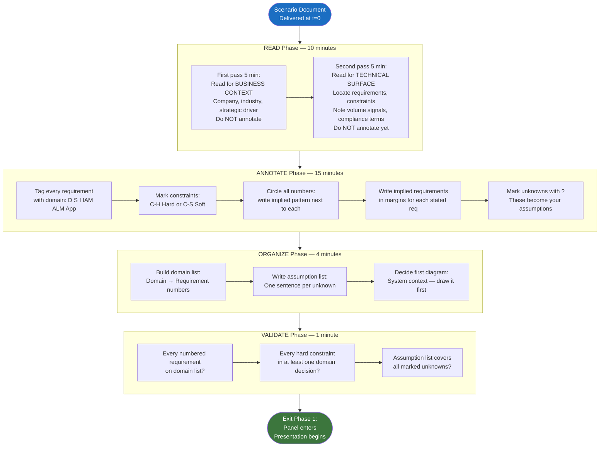
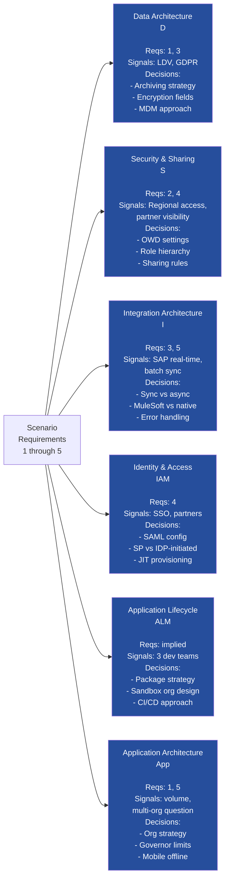

# Scenario Analysis Framework — The 30-Minute Methodology

## Overview / Context

The 30-minute scenario review phase is the most strategically underutilized part of the CTA exam. Many candidates treat it as reading time — they read the scenario carefully, highlight a few things, and then improvise the presentation structure when the panel enters. This is a critical error. The scenario review phase is not just preparation for the presentation; it is the architecture analysis phase. The work you do in these 30 minutes directly determines the quality of your breadth coverage, the clarity of your domain structure, and your ability to surface trade-offs proactively rather than reactively. A candidate who exits the scenario review phase with a structured, domain-annotated, constraint-classified, assumption-articulated presentation plan will outperform a candidate with deeper knowledge who exits the phase without one.

The READ → ANNOTATE → ORGANIZE → VALIDATE (RAOV) framework structures the 30 minutes into four discrete cognitive modes. Each mode has a specific purpose and a specific time budget. Shifting between modes deliberately — rather than reading and annotating simultaneously in a stream-of-consciousness way — produces a more complete analysis because it prevents the common error of forming design opinions before you have read all the constraints. Many failed presentations can be traced back to a candidate who read requirement 2, started designing an integration, and missed the constraint on page 4 that made that integration approach impossible. The RAOV framework prevents this by enforcing a full read before any annotation begins.

As a PTA who does architecture analysis daily, you already have strong pattern-recognition for scenario signals. The discipline this framework adds is structure and completeness. You likely already notice "GDPR" and immediately think data residency — the framework ensures you also notice the implied requirement that follows: a field audit trail for data access, consent management, and potentially a data residency add-on or Hyperforce selection. Your instinct is your asset; the framework ensures you don't stop at the first-order implication and miss the second and third.

---

## Core Concepts / Framework

### The RAOV Framework

```
READ (10 minutes) → ANNOTATE (15 minutes) → ORGANIZE (4 minutes) → VALIDATE (1 minute)
```

Each phase has a distinct cognitive mode and a strict time budget.

---

#### Phase R — READ (10 Minutes)

**Purpose:** Build a complete mental model of the scenario before forming any architectural opinions.

**First read (5 minutes): Business context only.**
- Who is this company? Industry, size, business model.
- What problem are they trying to solve?
- What is the strategic initiative driving this Salesforce project?
- What does success look like for the business?
- Do not look for requirements yet. Do not annotate. Read.

**Second read (5 minutes): Technical surface scan.**
- Where are the requirements? Identify all numbered or bulleted requirements.
- Where are the constraints? Find the limits section.
- What numbers appear? Volume, user count, transaction rates, timeline.
- What external systems are named?
- What compliance terms appear (GDPR, HIPAA, PCI, SOX, FedRAMP)?
- Still do not annotate. This read builds the complete picture before you respond to any of it.

**Why two reads without writing?**
Forming opinions before you have the full picture is the most common analytical failure mode. Constraint information often appears after requirement information in a scenario document. If you annotate "use REST callouts for real-time SAP integration" after reading requirement 3, then miss the constraint on page 4 that says "all SAP connections must go through the corporate ESB," you have a false foundation. Both reads first, annotation second.

---

#### Phase A — ANNOTATE (15 Minutes)

**Purpose:** Mark every piece of information in the scenario with its architectural significance.

**The annotation system:**

| Mark | Meaning | What to Write |
|---|---|---|
| Domain tag | Architecture domain this requirement touches | D (Data), S (Security/Sharing), I (Integration), IAM (Identity), ALM (Lifecycle), App (Application Architecture) |
| **C-H** | Hard constraint | Non-negotiable; shapes every downstream decision |
| **C-S** | Soft constraint | Preference or aspiration; can be traded off |
| **#** | Volume/scale signal | Circle every number — user counts, record volumes, transaction rates |
| **IR:** | Implied requirement | What must be true for this stated requirement to work? Write it in the margin |
| **?** | Unknown | What information would you need that the scenario doesn't provide? |
| **!** | Red flag | Complex architectural pattern required — note the pattern |

**The annotation sequence (execute in this order):**

1. **Mark domain tags on every requirement.** Some requirements span multiple domains — tag them all. Requirement: "All healthcare provider contacts must be segmented by region and accessible only by regional teams" → tag S (sharing model) and D (data architecture for the territory model).

2. **Mark all constraints as C-H or C-S.** Read the constraints section and every sentence that sounds like a limit or restriction. "Cannot replace SAP" → C-H. "Prefer to avoid custom code where possible" → C-S. "Must be production-ready within 6 months" → C-H (if budget commitment is tied to it) or C-S (if it's aspirational).

3. **Circle all numbers and write what they imply.** ">1M records" → write "LDV." "5,000 concurrent portal users" → write "Experience Cloud scale." "15-second SLA" → write "sync integration." "200 integration events/hour" → write "within Platform Event tier, check limits."

4. **Write implied requirements in the margins.** For every stated requirement, ask: "What must already be true, or what must I also build, for this requirement to be satisfied?" Examples:
   - Stated: "SSO for internal users via the company's Azure AD." Implied: SAML configuration, My Domain setup, session settings, SP-initiated vs. IDP-initiated flow decision.
   - Stated: "Partners should log in and view relevant opportunities." Implied: Experience Cloud license type, sharing model for opportunities, role hierarchy extension for partners, visibility into quotes/products.
   - Stated: "Real-time inventory lookup from SAP." Implied: synchronous callout design, error handling, latency budget, SAP connection credentials (Named Credentials), timeout strategy.

5. **Circle all unknowns with a ?** These become your assumptions in the opening. Every ? is a gap that must be named as an assumption rather than silently resolved.

---

#### Phase O — ORGANIZE (4 Minutes)

**Purpose:** Build the structure for your presentation.

Produce three outputs on your scratch paper:

**Output 1: Domain list with requirement mapping**
List each domain you'll address and write which requirements (by number) it covers.

```
Data Architecture: Req 1 (LDV), Req 3 (GDPR field-level)
Security/Sharing: Req 2 (regional teams), Req 4 (portal users)
Integration: Req 3 (SAP real-time), Req 5 (ERP sync)
IAM: Req 4 (partner SSO), Req 1 (internal Azure AD SSO)
Application Architecture: Req 5 (multi-org vs single), implied (governor limits at scale)
```

**Output 2: Assumption list**
For every ? you marked, write a one-sentence assumption. These go in your opening verbatim.

**Output 3: First diagram decision**
Decide now: what is the first diagram you'll draw? Almost always: a system context diagram showing Salesforce, external systems, and actor groups. Having this decided before the panel enters means you start drawing immediately rather than thinking about what to draw.

---

#### Phase V — VALIDATE (1 Minute)

**Purpose:** A final sweep to catch anything missed.

- Check every numbered requirement: does it appear on your domain list?
- Check every hard constraint: does it appear in at least one domain's decision criteria?
- Check your assumption list: does it cover all the unknowns you marked?
- Confirm you have not built a design opinion on a ? that you haven't named as an assumption.

---

### Requirement Categorization Taxonomy

| Category | Definition | Example | CTA Relevance |
|---|---|---|---|
| **Functional** | The system must do something specific | "Agents must be able to create cases from email" | Drives Application Architecture domain |
| **Non-functional** | How the system must perform or comply | "Response time must be under 2 seconds" | Drives Integration, Data, and Application Architecture |
| **Current-state** | Description of what exists now | "They currently use Pardot for marketing automation" | Establishes integration context and migration scope |
| **Future-state** | Target condition to achieve | "All regions should have a unified customer view" | Sets the target architecture and migration horizon |
| **Explicit** | Stated directly in the scenario | "The system must support HIPAA compliance" | Address in presentation directly |
| **Implied** | Required for a stated requirement to be achievable | "Must track all data access for HIPAA" implies Field Audit Trail or Shield Event Monitoring | Must be surfaced as implied requirement and addressed |
| **Architectural driver** | Must be solved architecturally; cannot be addressed by configuration alone | ">5M records in a single object" → LDV strategy required | These are the core of your presentation |
| **Nice-to-have** | Would improve the solution but doesn't constrain it | "It would be nice to have a mobile app" | Address briefly; do not over-architect |

---

### Domain Identification Matrix

Use this matrix to translate scenario language into architecture domains and required actions.

| Domain | Typical Requirement Signals | Example Scenario Language | Required CTA Response |
|---|---|---|---|
| **Data Architecture** | Volume keywords, record counts, MDM, archiving, reporting, analytics, master data | "over 1M accounts," "360-degree customer view," "data warehouse sync," "7-year retention requirement" | LDV strategy, big objects, archiving, skinny tables, MDM approach, external objects |
| **Security & Sharing** | Access control, visibility, teams, territories, compliance, encryption | "only regional managers can see," "field-level sensitivity," "GDPR," "HIPAA," "confidential records" | OWD → role hierarchy → sharing rules → manual shares; Shield encryption; FLS |
| **Integration Architecture** | External systems, sync, real-time, batch, ERP, legacy | "SAP," "real-time sync," "legacy mainframe," "cannot replace [system]," "two-way data sync" | Pattern choice (REST/SOAP/CDC/PE/MuleSoft), error handling, retry, volume limits |
| **Identity & Access Management** | Login, SSO, authentication, IDP, partners, communities | "SSO," "Azure AD," "Okta," "partners log in," "named credentials," "OAuth" | SAML configuration, Connected Apps, SP/IDP-initiated, delegated auth, Named Credentials |
| **ALM & Deployment** | Multiple teams, release management, CI/CD, sandbox, packages | "3 development teams," "bi-weekly releases," "parallel development tracks" | Unlocked packages, scratch orgs, CI/CD pipeline, sandbox strategy, deployment sequence |
| **Application Architecture** | Multi-org, governor limits, LWC, mobile, Flow vs Apex, custom platform | "multiple business units," "offline mobile," "high transaction volume," "custom platform" | Multi-org decision, governor limit planning, LWC performance, Flow vs Apex decision criteria |

---

### Constraint Classification

Understanding whether a constraint is hard or soft is one of the most important analytical moves in the scenario review phase. Hard constraints are architectural drivers — they eliminate options. Soft constraints are design considerations — they inform preference but don't eliminate.

**Hard Constraints — Examples and Architectural Impact:**

| Constraint | Example Scenario Language | Architectural Impact |
|---|---|---|
| Compliance mandate | "Must comply with HIPAA," "GDPR applies to all EU contact data" | Drives encryption, audit trail, consent management, potentially data residency |
| System retention mandate | "SAP cannot be replaced," "existing Oracle DB must remain the SoR" | Integration required (not migration); integration pattern choice is constrained by what SAP supports |
| Budget ceiling | "Total Salesforce spend cannot exceed $500K annually" | Eliminates certain license tiers or add-ons; constrains cloud selection |
| Security certification | "Must achieve FedRAMP authorization" | Constrains to Salesforce Government Cloud; limits available features |
| Timeline commitment | "Board has committed to go-live in Q2" | Eliminates architectures requiring long implementation cycles |
| Geographic restriction | "All data must remain within EU borders" | Hyperforce EU zone, data residency add-on, or multi-org with EU-only org |
| Existing infrastructure contract | "3-year contract with MuleSoft in place" | Integration architecture should leverage MuleSoft even if native Salesforce patterns would suffice |

**Soft Constraints — Examples and Design Preference Signal:**

| Constraint | Example Scenario Language | Architectural Impact |
|---|---|---|
| Code avoidance preference | "Prefer declarative over custom code" | Prefer Flow over Apex; prefer standard objects over custom; note the preference but override with justification when necessary |
| Timeline aspiration | "Would like to be live within 6 months" | Influences complexity of proposed architecture; flag if the recommended architecture requires more time |
| Budget preference | "Looking to keep costs low" | Prefer standard licenses over add-ons where possible; note premium features with justification |
| Team skill preference | "The team is new to Salesforce" | Prefer simpler administration patterns; flag features requiring admin expertise |
| Vendor preference | "Has an existing relationship with Informatica" | Consider as a preference in data integration design, not a mandate |

---

### The 12 Red Flag Signals

These scenario signals always require substantial architectural attention. When you mark a red flag, immediately write in the margin the architectural pattern it implies.

| Signal | Implication | Required Architecture Response |
|---|---|---|
| **">1M records"** on any single object | Large Data Volume (LDV) strategy required | Skinny tables, async SOQL, index optimization, archiving strategy, big objects consideration, bulk API for data loads |
| **"GDPR" or "HIPAA"** | Data protection compliance architecture | Shield Platform Encryption, Field Audit Trail, Event Monitoring, consent management, data residency review, data classification matrix |
| **">10,000 concurrent users"** | Experience Cloud scaling and LWC performance design | Caching strategy, CDN, page layout performance review, async data loading, authentication scaling |
| **"real-time"** | Synchronous integration with latency budget | REST callout design, timeout strategy, error handling, Named Credentials, governor limit awareness (10 callouts/transaction), circuit breaker pattern |
| **"legacy system"** | Migration or integration required; never assume replacement | Integration pattern selection, data mapping, error handling, EtL vs ETL, cutover strategy, parallel run period |
| **"multiple companies" or "multiple BUs"** | Multi-org vs. single org with data segregation decision | Org strategy: single org with permission set groups and sharing model, or separate orgs with data aggregation layer; brand experience decision |
| **"cannot replace [system X]"** | Hard constraint: integration required, not migration | Integration pattern to the named system; identify data model mapping; define SoR for overlapping data |
| **"SSO" + named identity provider** | SAML or OAuth 2.0 federation design | My Domain required; SAML metadata exchange; SP-initiated vs IDP-initiated flow; session timeout policy; JIT provisioning decision |
| **"offline"** | Mobile offline architecture | Briefcase (if Field Service or Sales), Einstein Analytics offline, LWC offline API; data set size and sync frequency design |
| **"compliance audit"** | Audit trail and event monitoring required | Shield Event Monitoring, Transaction Security Policies, Field Audit Trail (extends from 18 months to 10 years), Data Mask for sandboxes |
| **"multiple countries"** | Multi-currency, multi-language, data residency | Advanced Currency Management, translation workbench, multi-language UI, locale settings, data residency review per country |
| **"distributors" or "channel partners"** | Experience Cloud with complex sharing model | Sharing Sets or Share Groups for record access, Channel Account relationships, partner user license type selection, super user delegation |

---

### The "So What" Test

For every requirement in the scenario, the "so what" test asks: "So what does this mean for my architecture?" The answer is always an architectural decision, not a feature reference.

| Requirement Signal | First-Order "So What" | Second-Order "So What" (often missed) |
|---|---|---|
| "Real-time inventory lookup from ERP" | Synchronous integration with ERP | Governor limit: 10 callouts per Apex transaction; what happens on batch data loads that trigger inventory checks per record? |
| "Field sales reps need offline access" | Mobile offline architecture required | What is the data set size for offline? How often does it sync? What happens to conflicts when they reconnect? |
| "GDPR compliance for EU contacts" | Encryption and audit trail | Who is the data controller? Is Salesforce a processor? What is the data retention policy? What is the right-to-erasure process? |
| "Three acquisition targets will need Salesforce access in year two" | Org strategy must accommodate future orgs or users | Does the current architecture scale to absorb three orgs? Is the integration pattern reusable for new orgs? |
| "Board reporting requires aggregated global pipeline" | Reports must cross data sources | If multi-org: aggregation layer needed. If single org: ensure sharing model permits management roll-up. CRM Analytics? |
| "Partners manage their own sub-accounts" | External hierarchy and sharing | Experience Cloud hierarchy design; partner account ownership; Sharing Sets scoped to account; avoiding over-sharing |
| "Must support bi-directional sync with SAP" | Integration pattern: bi-directional is complex | Conflict resolution strategy (which system wins on conflict?); event loop prevention (Salesforce update triggers SAP which triggers Salesforce); deduplication |
| "All service interactions must be auditable" | Audit trail on Service Cloud | Field History Tracking (limited to 20 fields) may not suffice; Shield Field Audit Trail for full history; Event Monitoring for user actions |
| "Development team of 15 will work in parallel streams" | ALM architecture required | Unlocked packages with defined dependency boundaries; scratch org strategy; CI/CD pipeline; deployment sequence governance |
| "Company is considering acquiring a competitor next year" | Current org must be designed for future M&A | Avoid hard-coded org IDs in integrations; design sharing model to accommodate new BU; preference for modular package architecture |

---

## PTA / SA Relevance

### Parallels to Daily Advisory Work

Your daily work as a PTA involves rapid scenario analysis constantly — in deal qualification calls, architecture review boards, pre-sales technical discovery sessions, and escalation calls. The pattern-recognition skills you've built are directly transferable to the CTA scenario phase. The framework this lecture provides is the discipline layer on top of that instinct.

In your advisory work, you likely already notice the "red flags" — you hear "real-time" and think "callout limits," you hear "GDPR" and think "data residency." The discipline gap is often completeness: in a deal context, you might notice the integration red flag and address it, while the ALM red flag (three parallel development teams) gets left for the implementation team to work out. In the CTA exam, both red flags must be addressed in your presentation. The RAOV framework forces you to sweep all six domains every time, not just the ones that are most salient to you.

Your experience with customer discovery gives you an advantage in identifying implied requirements. Customers rarely state all the requirements explicitly — they say "we want partners to log in" and expect you to understand that means a license decision, a sharing model decision, a My Domain configuration, and possibly a brand differentiation. The habit of surfacing implied requirements is one you've built in years of discovery work. Apply it deliberately during annotation.

### How to Use This in Customer Engagements

**Use the domain tagging system in your architecture assessments.** When leading a customer architecture assessment, apply the same annotation approach: tag every requirement with its domain, classify every constraint as hard or soft, and surface the implied requirements explicitly in your findings. This produces more comprehensive assessments and demonstrates systematic thinking to your customers.

**Teach the "red flag" signals to your partners.** When coaching partner architects — whether in deal reviews or formal training — the 12 red flag signals are a high-value framework to share. Partners who can identify scenario signals and immediately name the architectural pattern they require will produce better designs and better customer outcomes.

**Use the "so what" test in discovery sessions.** When a customer states a requirement in a discovery session, immediately ask yourself the "so what" question: "What architectural decision does this drive, and what does that decision imply at the second level?" This habit closes the gap between customer requirements and architectural completeness.

**Build constraint classification into your architecture documents.** In any architecture recommendation you produce, explicitly separate hard constraints from soft constraints. This makes your recommendations more defensible (decisions are tied to specific constraint categories) and more flexible (soft constraints can be traded off when needed).

---

## Architecture / Scenario

### RAOV Framework Flow



---

### Domain-to-Requirement Mapping Template



---

## Key Principles to Apply

- **Read twice before you write once.** The entire point of the two-pass read is to prevent early closure — forming architectural opinions before you have encountered all constraints. Discipline yourself to complete both reads before you put pen to annotation.

- **Every number is an architectural signal.** User count drives license and Experience Cloud design. Record volume drives LDV strategy. Transaction rate drives synchronous vs. asynchronous integration. Timeline drives architecture complexity ceiling. Circle every number and write its implication immediately.

- **Implied requirements are equally important as stated requirements.** The scenario will not say "configure SAML federation with Okta, set SP-initiated flow, create Named Credentials for the IDP endpoint, and define JIT provisioning logic." It will say "users log in using SSO." Your architectural value is in recognizing what "SSO" implies — the full list is your domain expertise.

- **Constraints are not obstacles; they are design inputs.** A hard constraint like "cannot replace legacy mainframe" doesn't mean the architecture is incomplete — it means the integration architecture must be designed for the mainframe's capabilities and limitations. Treat every constraint as a first-class input to your architectural decisions.

- **The annotation system must be legible and usable, not decorative.** Your annotated scenario is a live reference document during your presentation. If your annotations are too dense or inconsistent to read quickly, they lose their value. Develop a consistent annotation shorthand and use it in every practice run.

- **Organize before the panel enters; don't discover your structure during the presentation.** The moment the panel sits down, you should already know which domain you're starting with, what assumption you're opening with, and what diagram you'll draw first. The ORGANIZE phase exists precisely to prevent on-the-fly structure discovery.

- **The "so what" test converts feature knowledge into architectural reasoning.** Every Salesforce feature you know is useful only if you can answer: "What architectural problem does this solve, what are the conditions under which it's the right answer, and what is the second-order implication of using it?" Practice the "so what" test on every signal you annotate.

- **Name every unknown as an assumption.** Unknown information in the scenario is not a problem to be ignored — it is an opportunity to demonstrate analytical rigor. Naming unknowns as explicit assumptions ("I'm assuming this is a single Salesforce org scenario; if it's multi-org, the integration architecture changes") shows the panel you see the gaps and are managing them deliberately.

---

## Common Mistakes

**1. Annotating during the first read.** Starting to annotate before completing a full read of the scenario means your early annotations are formed without the context of later constraints. A candidate who annotates "use REST callouts" on requirement 2 then encounters on page 4 that all external connections must go through a DMZ proxy now has an annotation that conflicts with a constraint they hadn't read yet.

**2. Marking only the obvious domain for multi-domain requirements.** The requirement "Healthcare provider contacts must be segmented by region" touches Data (territory model, account hierarchy), Security (OWD for contacts, territory-based sharing rules), and Application Architecture (territory management feature configuration). Marking it only as Security misses two additional domain threads that the panel will probe.

**3. Skipping the implied requirements step.** Most scenario analysis failures come from addressing only what was explicitly stated. "SSO" is stated. The SAML configuration, My Domain, session policy, JIT provisioning decision, and the interaction between SSO and the sharing model are all implied. If you don't surface implied requirements during annotation, they surface as Q&A gaps.

**4. Treating all constraints as equally binding.** Soft constraints like "prefer to avoid custom code" should influence design preference, not eliminate options entirely. A candidate who rigidly refuses to recommend Apex triggers because the scenario mentions preferring declarative approaches — even when a declarative approach cannot satisfy a hard performance requirement — has misapplied a soft constraint. Classify, then apply proportionally.

**5. Using the ORGANIZE phase to refine annotations instead of building structure.** The ORGANIZE phase is for building the presentation plan, not for continuing annotation work. Candidates who spend the last 5 minutes annotating more requirements end up entering the presentation phase without a clear structure.

**6. Not numbering the domains in the ORGANIZE output.** You will enter the presentation and state "I'll cover four domains." If you haven't written them down in order with the requirements they cover, you risk forgetting a domain mid-presentation — which is a breadth failure.

**7. Building an assumption list that is too long.** Two or three well-chosen assumptions are a signal of analytical clarity. Twelve assumptions signal that you didn't have enough information to form a recommendation. If you have more than four assumptions, compress: combine related gaps, or acknowledge uncertainty at domain level rather than requirement level.

**8. Failing to validate the requirement-to-domain mapping before Phase 1 ends.** The most common breadth failure is not from being unfamiliar with a domain — it's from simply not having mapped a requirement to its domain during annotation, so the requirement gets no coverage. The 60-second validate sweep is insurance against this.

---

## Practice Questions

**Scenario 1 — RAOV application: Full annotation exercise**

Apply the full RAOV framework to the scenario below. Produce: (a) Domain-tagged requirements, (b) constraint classification, (c) implied requirements list, (d) red flags identified, (e) assumption list, (f) presentation domain order.

*Scenario:* "TechRetail Corp is a $4B e-commerce and brick-and-mortar retailer with 1,200 internal users, 45,000 B2B buyers managed in an existing Salesforce Sales Cloud org, and a customer service team handling 80,000 cases per month. They currently run Service Cloud on a separate org from Sales Cloud. They want to: (1) Merge the two orgs into a single org to achieve a 360-degree customer view. (2) Launch a self-service portal for B2B buyers to track orders, view invoices, and submit service requests. (3) Integrate with their Oracle ERP for real-time order and invoice data. (4) Implement SSO using their existing Microsoft ADFS. (5) Ensure PCI-DSS compliance for payment-related data accessible in Salesforce. All four initiatives must be delivered by Q4."

*Model answer:*

Domain tags: Req 1 → D (LDV: 45K accounts + 80K cases/month), App (org merge complexity, data migration), S (sharing model unification). Req 2 → App (Experience Cloud), S (B2B buyer sharing — Sharing Sets, portal profiles), IAM (portal authentication). Req 3 → I (Oracle ERP, real-time, synchronous integration concern). Req 4 → IAM (SAML, ADFS as IDP, My Domain, SP-initiated). Req 5 → D (PCI field identification), S (Shield encryption for PCI fields), App (tokenization approach).

Constraints: C-H: Q4 deadline (all 4 initiatives). C-H: PCI-DSS compliance. C-H: Microsoft ADFS as IDP (not negotiable — "existing"). C-S: Implied preference for single org (stated goal, but technically soft — validate if org separation could still meet the 360 view via aggregation).

Implied requirements: Req 1 implies: data migration strategy (45K accounts + history), duplicate management post-merge, shared record ID strategy, testing/validation plan for merged org. Req 2 implies: B2B buyer license type, account hierarchy for buyer/org relationship, portal branding, search configuration. Req 3 implies: Named Credentials for Oracle, error handling, retry strategy, governor limit assessment (real-time callout per user action is feasible; real-time per case update at 80K/month needs async approach). Req 4 implies: My Domain configuration, SAML assertion mapping (which ADFS attributes map to Salesforce user fields), JIT provisioning decision, session timeout policy. Req 5 implies: PCI field identification workshop, Shield licensing decision, key management strategy, audit trail for PCI fields.

Red flags: ">45,000 B2B accounts" + "80,000 cases/month" → LDV signal on Cases. "Real-time" Oracle integration → synchronous callout risk at Case volume. "Two orgs merging" → org merge is high-risk; metadata conflict resolution required. "PCI-DSS" → Shield Platform Encryption required; encryption keys governance. "SSO" + "Microsoft ADFS" → SAML federation design.

Assumptions: (1) The Q4 deadline means all initiatives must be in production, not just in development. (2) The Oracle integration is real-time for portal order lookup, not for bulk sync — bulk sync would be async. (3) B2B buyers will use Experience Cloud (not full Salesforce licenses). (4) "PCI-DSS compliance" means payment card data is accessible in Salesforce (not that Salesforce processes payments directly).

Domain order: Data Architecture (org merge LDV + PCI field classification) → Application Architecture (Experience Cloud design) → Integration (Oracle ERP) → Security/Sharing (portal sharing model) → IAM (ADFS + portal auth).

---

**Scenario 2 — Red flag identification**

Read the following scenario segment and identify all red flags using the 12-signal taxonomy. For each, name the implied architectural pattern.

*Segment:* "PharmaCo Global operates in 47 countries across three business units: Pharmaceutical, Medical Devices, and Consumer Health. They have 12,000 internal employees, 400,000 healthcare provider contacts, and they distribute through 800 independent distributors who need access to Salesforce pricing and order data. Data sovereignty laws in Germany, France, and Brazil prevent patient data from leaving those countries. The current Salesforce implementation is a single Sales Cloud org that is struggling with performance as record volumes have grown to 3M accounts and 8M contacts."

*Model answer:* Red flags identified:
- ">3M accounts, 8M contacts" → LDV. Requires skinny tables, async SOQL, index optimization, archiving strategy.
- "400,000 HCP contacts" → Scale signal for Experience Cloud sharing if portal is planned.
- "47 countries, 3 BUs" → Multi-org vs. single-org decision required; brand and data segmentation.
- "Data sovereignty in Germany, France, Brazil" → Data residency architecture. Hyperforce regional zones or separate orgs per country. Cannot be addressed with encryption alone if the requirement is server location.
- "800 independent distributors needing access" → Experience Cloud with complex sharing model. Sharing Sets, partner account hierarchy, license type for distributors.
- "Struggling with performance at 3M/8M" → LDV optimization required before adding more load. Current state is already at risk.
- Implied: "Pharmaceutical" → Likely HIPAA or equivalent health data regulations depending on country.

---

**Scenario 3 — Implied requirement surfacing**

For the single stated requirement below, write all implied requirements it generates. There should be at least six.

*Stated requirement:* "Field service technicians need to access and update work orders while in areas without mobile data coverage."

*Model answer:* Implied requirements:
1. Mobile offline architecture required — Field Service app or custom LWC with offline API.
2. Offline data set definition required — which records does each technician need offline? Account, Work Order, Work Order Line Item, Asset, Service Appointment? Size of offline data set per user.
3. Sync strategy required — how often does offline data sync when connectivity is restored? What is the conflict resolution strategy if a record is updated both offline and by another user online simultaneously?
4. Device management policy — what devices will be used? iOS/Android? MDM enrollment for remote wipe?
5. Authentication offline — how does the technician authenticate when offline? Does the app support offline biometric or PIN authentication?
6. Data freshness SLA — how stale can the offline data be? If a work order was updated 2 hours ago by dispatch and the technician has stale data, what is the risk?
7. Governor limits for offline sync batch — when multiple technicians reconnect simultaneously after a field outage, the sync batch must not exceed Bulk API or batch Apex limits.
8. Testing strategy — offline behavior must be tested in a Salesforce sandbox; how does the QA process simulate offline conditions?

---

**Scenario 4 — Constraint classification**

Classify each of the following scenario statements as Hard Constraint (C-H), Soft Constraint (C-S), or Not a Constraint (requirement or description). Explain your classification.

1. "The company currently uses Informatica for data integration."
2. "All personally identifiable information must be encrypted at rest per company policy, which is non-negotiable."
3. "The IT team would prefer minimal custom development."
4. "The project must be completed before the fiscal year end in December."
5. "The legacy CRM system has been in place for 15 years and the data export format is a flat-file CSV."
6. "Ideally the solution would also include a customer community."

*Model answer:*
1. C-S (soft). "Currently uses" does not mean it cannot change. It is context, not constraint. If the scenario said "3-year Informatica contract in place" it would be C-H.
2. C-H (hard). "Non-negotiable" and "company policy" makes this a hard constraint. Every data architecture decision must accommodate encryption.
3. C-S (soft). "Would prefer" signals preference, not mandate. You should respect this preference but override it with justification when necessary.
4. C-H (hard), if budget or business commitment is attached. A "must be completed" with a specific deadline tied to a business event (fiscal year reporting, regulatory deadline, board commitment) is hard. If it reads as aspirational, treat as soft until you can ask in the opening assumptions.
5. Not a constraint — this is a current-state description. The implication is an integration pattern choice (ETL from flat-file), but it doesn't restrict what you can build.
6. C-S (soft), leaning toward nice-to-have. "Ideally" and "also" signal this is additive and optional. Note it; don't architect around it.

---

**Scenario 5 — "So what" test drill**

For each of the following scenario signals, apply the "so what" test at two levels (first-order implication, second-order implication).

1. "The company will expand from 3 countries to 15 countries in the next 18 months."
2. "Salesforce will be the system of record for all customer data, replacing their legacy CRM."
3. "The finance team needs real-time visibility into deal margins, which are calculated in their SAP system."

*Model answer:*

Signal 1 first-order: Multi-language, multi-currency, locale settings required. Data governance and privacy compliance varies by country — need to identify which new countries bring new regulations. Second-order: Role hierarchy and territory model must be designed to accommodate 12 additional country structures without redesign. If any new countries include EU states: GDPR applies. License model must account for new country users in contract planning. If countries have unique business processes: consider whether a single org can support process variation or whether a multi-org strategy is required.

Signal 2 first-order: Migration from legacy CRM required. Salesforce becomes SoR — existing integrations that wrote to legacy CRM must be re-pointed to Salesforce. Second-order: Data quality on import — legacy CRM data has 10+ years of technical debt, duplicates, and outdated records. A data cleansing and deduplication strategy is required before or during migration, not after. All systems that read from legacy CRM (reporting, analytics, other apps) must be updated to read from Salesforce. Record ID change (old CRM IDs are not Salesforce IDs) — any downstream system that uses legacy CRM IDs as a join key must be updated.

Signal 3 first-order: Real-time integration from SAP for margin calculation — synchronous callout pattern. Named Credentials for SAP authentication. Second-order: "Real-time" on an opportunity means the callout fires on opportunity record load or save. At scale (many reps loading records simultaneously), this creates a synchronous callout dependency that adds SAP response time to Salesforce page load time. The UX SLA is now jointly owned by Salesforce and SAP. Consider caching the SAP margin calculation result on the opportunity as a field, refreshed on a schedule, with a "recalculate" button rather than fully live callout — unless the finance team's requirement is truly that they need the margin at the moment of record view, not at the moment of record save.
