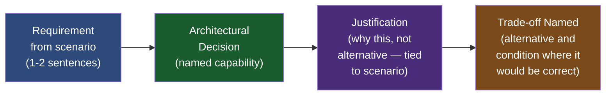
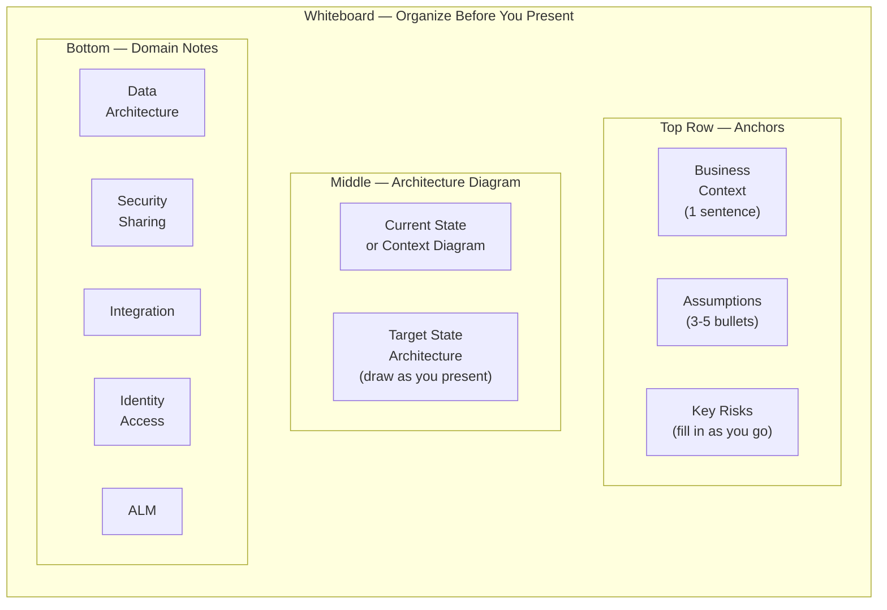

# Presentation Skills for the CTA Board

## Overview

The 45-minute presentation phase is the CTA board's window into how you think and communicate. Every CTA candidate sitting before the panel has demonstrated technical depth — they have been vetted through experience requirements and pre-screening. What differentiates passing candidates from failing ones at the presentation stage is almost never knowledge. It is clarity of structure, deliberate pacing, confident handling of uncertainty, and the ability to tell an architectural story that a business executive and a platform engineer can both follow simultaneously.

CTA panelists report a consistent pattern in failed presentations: the candidate knows the material but cannot present it architecturally. They talk in features ("I'd use Platform Events for this"), jump between domains without connecting them, spend 20 minutes on a domain they're comfortable with and then rush through two others, and never explicitly surface trade-offs. The panel is left uncertain whether the candidate has an architecture or a collection of technical opinions. Passing presentations, by contrast, open with a clear architectural direction tied to business context, step through domains with explicit linkage between them, name trade-offs proactively before the panel asks, and close with a confident view of risk and recommendation.

For a PTA, the structure here mirrors the executive architecture briefing format you already use with customers — but compressed, higher-stakes, and with a technically adversarial audience. The difference from customer advisory work is that panelists will challenge every assumption and every design choice. The PTA instinct to "read the room and adapt" serves you well in Q&A; in the presentation itself, rigid adherence to structure and timing serves you better than improvisation.

---

## Core Framework / Approach

### The Architecture Story Arc

Every CTA presentation should follow this five-act structure, regardless of scenario type:

```
Act 1 — Frame the Business Problem (3-4 minutes)
Act 2 — State Your Assumptions (2 minutes)
Act 3 — Present the Architecture, Domain by Domain (28-32 minutes)
Act 4 — Summarize Trade-offs and Risks (4-5 minutes)
Act 5 — Close with a Recommendation (1-2 minutes)
```

This structure is not optional. Candidates who skip Act 1 and 2 and go directly into domain architecture present a solution without a business justification — the panel will ask "why did you make that choice?" at every turn because they have no established frame of reference. Candidates who skip Act 4 and 5 leave without a coherent recommendation, which makes the architecture feel unfinished.

---

### Act 1 — Frame the Business Problem (3-4 minutes)

The opening is the most important two minutes of the presentation. Open with business context, not platform features.

**What to say in Act 1:**
- One sentence describing the company and its strategic challenge
- One sentence describing what success looks like for the business after this implementation
- One sentence describing the architectural complexity that makes this scenario non-trivial (why this is not a standard implementation)
- The three or four high-level architectural themes you will address

**What NOT to say in Act 1:**
- Platform feature names
- Specific configuration choices
- Anything that starts with "Salesforce will..."

**Example opening (retail scenario):**
> "RetailGlobal is a global specialty retailer migrating from an on-premise legacy CRM to Salesforce, with 8.5 million customer records, omnichannel operations across 35 countries, and a GDPR obligation covering their EU customer base. Success for this business means a single customer view that is performant at scale, supports regional data residency, and is available to both field sales and an 80,000-user retail associate workforce. The architectural challenges I will address are: large data volume management, a multi-tier sharing model for regional and associate access, cross-border data residency with Hyperforce, and a two-phase migration that minimizes disruption to ongoing sales operations."

This opening takes 45 seconds and establishes the entire frame for everything that follows. A panelist hearing this knows what to look for in your presentation. A panelist hearing "So I'm going to start with data architecture, and for the Account object I'll use a Private OWD..." is immediately lost.

---

### Act 2 — State Your Assumptions (2 minutes)

Every CTA scenario has gaps. The candidate who ignores gaps presents an architecture based on undisclosed assumptions; when the panel reveals a different interpretation, the candidate's entire solution may need to be restructured. The candidate who explicitly names assumptions gives the panel a chance to correct early, demonstrates analytical honesty, and creates a defensible basis for every design decision.

**How to state assumptions:**

Write three to five assumptions on the whiteboard before presenting any architecture. Read each one. For each, state:
- What you assumed
- Why you assumed it (what in the scenario suggested it)
- What the alternative assumption would be and how it would change the architecture

**Example assumption statement:**
> "I've made five assumptions about this scenario. First, I'm assuming the SAP ERP integration is read-only from Salesforce's perspective — SAP owns the product catalog and pricing data, and Salesforce displays it but does not write back. If SAP requires bidirectional sync, the integration architecture changes significantly. Second, I'm assuming the 5,000 portal users are external partners, not employees — this drives my Experience Cloud license selection. Third..."

**The assumption contract:** Once you've stated your assumptions and the panel has not corrected them, you have established the frame for your entire architecture. When Q&A probes a decision, you can respond: "Based on my assumption that [X], I chose [Y]. If [X] were not true, I would redesign as [Z]." This demonstrates adaptability without undermining your solution.

---

### Act 3 — Present the Architecture, Domain by Domain (28-32 minutes)

Allocate time explicitly to each domain based on scenario complexity, not on your personal comfort. The most common timing failure is: strong candidate spends 15 minutes on integration (their background), 10 minutes on security (comfortable), 5 minutes rushing through data architecture, and mentions application lifecycle in one sentence. The panel now has 25 minutes of Q&A left and will focus their questions on the two domains the candidate didn't cover.

**Recommended domain order and timing (adjustable based on scenario emphasis):**

| Domain | Suggested Time | What to Cover |
|--------|---------------|---------------|
| Data Architecture | 6-8 min | Volume, schema, migration, MDM/SOR |
| Security and Sharing | 6-8 min | OWD, sharing rules, field-level, compliance |
| Integration | 6-8 min | Patterns, systems, error handling, volume |
| Identity and Access | 4-5 min | SSO, user lifecycle, portal identity |
| Application Lifecycle | 3-5 min | Org strategy, environment, deployment, governance |
| Application Architecture (if needed) | 3-4 min | Customization approach, packages, automations |

**Within each domain, follow the Domain Triad:**

```
1. State the key requirement from the scenario (1-2 sentences)
2. Name the architectural decision (specific platform capability)
3. Justify the decision (why this, not the alternatives — tie back to scenario)
```

Example (security domain):
> "The requirement is that field sales reps can only see accounts they own, while regional managers see all accounts in their region, and the executive team sees everything. The architectural decision is a role hierarchy with Public Read Only OWD on Account and territory-based sharing rules for regional visibility. I chose role hierarchy over manual sharing because this company has 500 sales reps organized in a defined regional structure — role hierarchy scales to this without manual maintenance. I chose Territory Management over standard sharing rules because the regional assignments are based on geographic territory, not reporting lines, and territory membership changes more frequently than the org hierarchy."

Every domain section must contain at least one explicit trade-off statement. "I could have used [alternative] but chose [decision] because [reason tied to scenario]." If you never name alternatives, the panel will ask about them in Q&A — and you'll be defending choices reactively rather than proactively.

---

### Act 4 — Surface Trade-offs and Risks (4-5 minutes)

After presenting all domains, step back to the whiteboard and name the three to five most significant trade-offs or risks in the architecture. This section demonstrates architectural judgment — the ability to look at a complete solution and identify where it is most vulnerable.

**Structure for each trade-off:**
1. Name the trade-off (what two valid approaches are in tension)
2. State what you chose and why
3. Name the condition under which your choice would be wrong

**Example:**
> "The most significant trade-off in this architecture is between data residency and single-org simplicity. I chose a single Salesforce org with Hyperforce data residency for EU records over a separate EU org because a split-org approach doubles the integration complexity and creates a permanent data synchronization challenge. The condition under which my choice would be wrong is if the customer's legal team determines that Hyperforce data residency alone does not satisfy their interpretation of GDPR Article 46 — in that case, the EU subsidiary may require a physically separate org, and the integration architecture would need to be redesigned for cross-org data flows."

**What the panel hears:** a candidate who understands the limits of their own solution. This is the primary differentiator between a passing presentation and an excellent one.

---

### Act 5 — Close with a Recommendation (1-2 minutes)

Never let a 45-minute presentation end with "...and that concludes my architecture." Close with a recommendation. The CTA title is about architectural leadership — architects recommend, they don't just describe.

**Closing structure:**
- Restate the business outcome the architecture enables
- Name the single highest-risk implementation decision and how you'd manage it
- State your recommendation for what the customer should do first (Phase 1 priority)
- Invite questions

**Example:**
> "This architecture enables RetailGlobal to operate a single global Salesforce instance, compliant with EU data residency requirements, performant at 8.5 million Account records, and extensible to the partner experience cloud they've described for Phase 3. The highest-risk element in this plan is the 3-phase data migration — specifically the cutover window, which is tight given the transaction volume. My recommendation is that Phase 1 begin with the historical data load and migration tooling validation in a full-data sandbox before any active data migration begins. I'm ready for your questions."

---

## PTA / SA Relevance

### Parallels to Daily Advisory Work

The five-act structure maps directly to the executive architecture briefing you deliver in strategic customer engagements. Act 1 (Business Problem Frame) is your executive summary slide. Act 2 (Assumptions) is the "out of scope" and "decisions deferred" section of every architecture document. Acts 3 and 4 are the architecture deep-dive and trade-off analysis slides. Act 5 is the recommendation slide that closes every exec briefing.

The discipline the CTA exam forces — 45 minutes, all domains covered, trade-offs named, a recommendation delivered — is the same discipline that separates advisory architects from implementation architects in customer work. Customers who only hear about features and configurations leave the meeting without a recommendation; customers who hear a framed business problem, an architecture with explicit trade-offs, and a recommendation leave with clarity and trust in their advisor.

### How to Use This in Customer Engagements

**For internal demos and executive architecture briefings:** Practice the five-act structure by adapting it to your next customer QBR or architecture workshop. Open with business context before touching slides. State your assumptions explicitly before proposing solutions. End with a recommendation, not just a summary.

**For complex multi-cloud proposals:** The domain-by-domain structure (Data → Security → Integration → Identity → ALM) is an effective sequence for multi-cloud architecture proposals. It follows the pattern of foundational decisions (data, security) before capability decisions (integration, identity) before operational decisions (ALM). Customers and internal teams find this sequencing more logical than feature-by-feature or cloud-by-cloud presentations.

**For pre-sales technical workshops:** The trade-off section (Act 4) is a high-value differentiator in pre-sales work. Most competitors present one solution. Presenting two options with explicit trade-offs, then recommending one, demonstrates architectural maturity that resonates with CTO and VP Engineering audiences.

---

## Architecture / Diagrams

### CTA Presentation Structure — Timing Map

```mermaid
gantt
    title CTA 45-Minute Presentation Structure
    dateFormat mm
    axisFormat %M min

    section Opening
    Act 1 — Business Context       :active, 00, 4m
    Act 2 — Assumptions            :active, 04, 2m

    section Architecture Domains
    Data Architecture              :06, 8m
    Security and Sharing           :14, 8m
    Integration                    :22, 7m
    Identity and Access            :29, 5m
    Application Lifecycle          :34, 4m

    section Close
    Act 4 — Trade-offs and Risks   :38, 5m
    Act 5 — Recommendation         :43, 2m
```



### The Domain Triad Pattern (per domain)



### Whiteboard Layout



---

## Key Principles to Apply

1. **Open with business context, not platform features.** The first sentence out of your mouth should describe the company's business problem, not Salesforce capabilities. Every panelist has heard hundreds of presentations that open with "So I'm going to start with the data architecture..." — none of them stand out.

2. **State assumptions before presenting solutions.** Any decision you make in your architecture that rests on an unstated assumption is a liability in Q&A. Name assumptions explicitly, in writing on the whiteboard, before presenting any domain. This gives the panel a chance to correct you early instead of waiting until Q&A.

3. **Follow the Domain Triad on every design decision.** Requirement → Decision → Justification. A decision without a scenario-tied justification is an opinion. A justification without an alternative considered is shallow. The panel is listening for the triad on every decision — give it to them.

4. **Allocate time proportional to complexity, not comfort.** Your weakest domain needs the same coverage as your strongest. A candidate who covers four domains well and visibly rushes a fifth signals to the panel exactly where to probe in Q&A.

5. **Name trade-offs proactively, not reactively.** If a panelist has to ask "did you consider [alternative]?" you have lost the initiative. Saying "I considered [X] and [Y]; I chose [X] because [Z]" before the panel asks demonstrates mastery.

6. **End with a recommendation.** Architects recommend. Describing an architecture without a recommendation is unfinished. The last sentence of your presentation should be a recommendation, not a summary.

---

## Common Mistakes (CTA Candidates)

1. **Opening with platform features rather than business context.** "I'm going to talk about data architecture first — I've decided to use Big Objects for the archive and Bulk API 2.0 for migration." This presentation is already in trouble. The panel has no business frame.

2. **Running out of time before completing all domains.** Thirty-eight minutes into the 45-minute presentation, the candidate is still on integration. ALM is covered in two sentences. The panel now has 25 minutes of Q&A on a topic the candidate barely mentioned.

3. **No whiteboard use or disorganized whiteboard.** Candidates who present verbally without drawing anything give the panel nothing to anchor Q&A challenges to. A well-organized whiteboard is a communication tool, a navigation tool, and a confidence anchor.

4. **Treating assumptions as failures.** Many candidates are reluctant to state assumptions because they feel like admissions of ignorance. The opposite is true: naming assumptions is a sign of analytical rigor. The panel expects you to have assumptions — they want to see that you've identified them.

5. **Defending a wrong answer instead of revising.** The panel corrects a candidate: "Actually, that integration pattern would hit the Apex callout governor limit in the scenario you described." The candidate argues. This is a near-instant fail. The correct response: "You're right — I hadn't accounted for the governor limit in that high-volume path. I'd revise the pattern to [alternative] which avoids the synchronous callout issue."

6. **No explicit trade-off statements.** An architecture presented as a series of correct answers, with no acknowledgment that alternatives exist, signals to the panel that the candidate hasn't deeply considered the problem space. Paradoxically, naming the limitations of your own design demonstrates more confidence than presenting it as perfect.

7. **Jumping between domains without explicit transitions.** "Okay, so that's data architecture... actually before I continue, I should mention that the integration here is going to affect the security model, so let me go back to..." The panel loses the thread. Domain transitions should be explicit: "That completes data architecture. The next domain is security and sharing, and it connects to data architecture in two ways: the LDV volume on Account affects the OWD choice, and the GDPR compliance requirement affects which fields can be shared via the integration. Let me walk through the security model."

---

## Practice Exercises

**Exercise 1 — The 60-Second Opening**

Write and deliver (out loud) a 60-second opening statement for a scenario where:
- Company: global insurance firm, 3M policyholder records
- Challenge: migrating from Siebel + three regional CRMs to a single Salesforce org
- Complexity: multi-national (US, EU, APAC), GDPR applicable, agent licensing concerns

Practice until the opening is natural and does not start with any Salesforce product name.

**Exercise 2 — Assumptions Drill**

Take the retail scenario from Lecture 10. Without reading the proposed solution, write five assumptions you would state at the top of your presentation. For each, write the alternative assumption and one sentence on how it would change the architecture.

**Exercise 3 — Timed Domain Coverage**

Using a stopwatch, present the integration domain from the financial services scenario (Lecture 11) in exactly 7 minutes. Stop at 7 minutes regardless of where you are. Practice until you can cover the Domain Triad on every integration decision within the time box.

**Exercise 4 — Trade-off Table**

Before presenting any scenario, create a two-column table: "What I Chose" and "What I Did Not Choose and Why." Require at least one row per domain. Practice incorporating these trade-off statements into your presentation without making them feel like disclaimers — they should feel like evidence of depth.

**Exercise 5 — The Closing Recommendation**

Craft closing recommendations for three different scenario types (retail, healthcare, financial services). Each closing must: name the business outcome, identify the single highest-risk implementation element, and state a Phase 1 priority. Practice delivering each in 90 seconds or less.
