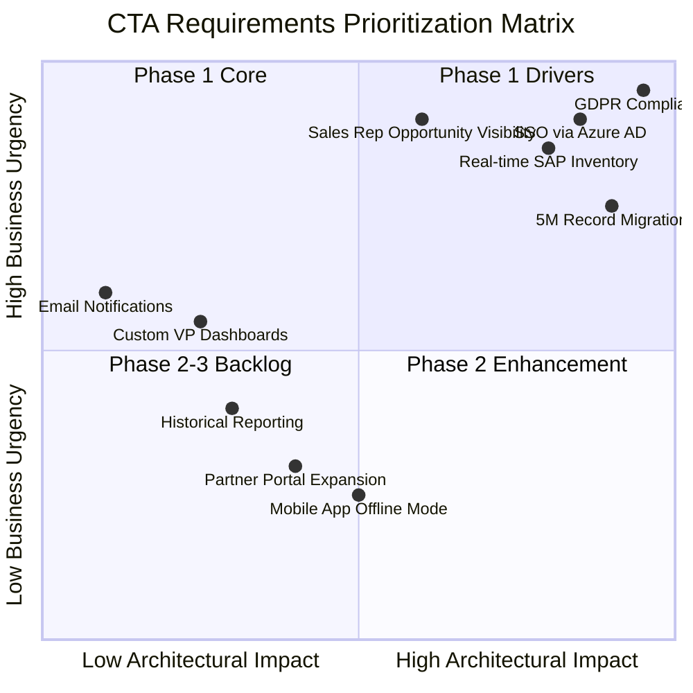
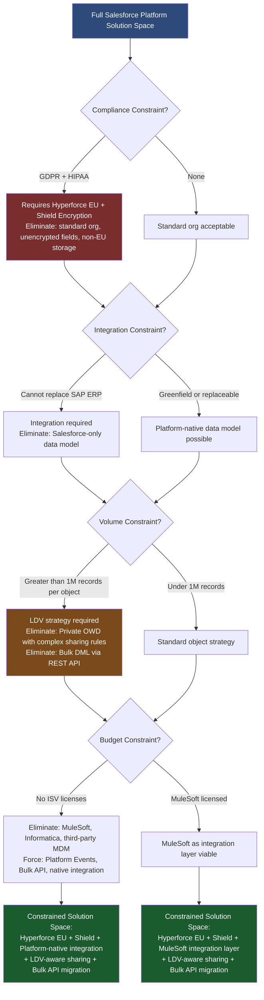

# Requirements Prioritization in CTA Scenarios

## Overview / Context

CTA scenario packets typically present 3–5 pages of requirements across multiple architecture domains, delivered in a compressed 30-minute read window. The most common failure mode is not a lack of knowledge — it is treating all requirements as equal and attempting to architect for everything simultaneously. Every CTA scenario contains a deliberate hierarchy: some requirements fundamentally constrain or determine the architecture, and the rest layer on top. Failing to identify this hierarchy leads to presentations that are wide but shallow, covering every domain superficially and satisfying none deeply.

Requirements prioritization in the CTA context is distinct from product backlog prioritization. You are not optimizing for delivery velocity — you are identifying which 2–3 requirements will determine the core architectural decisions, then ensuring all other requirements are satisfied without contradicting those foundations. Architectural drivers are the requirements that, if changed, would require a fundamentally different architecture. Every other requirement should be satisfiable within the architecture those drivers dictate.

Non-functional requirements (NFRs) receive disproportionately little attention from candidates who have spent their careers focused on functional delivery. In CTA scenarios, NFRs often contain the architectural constraints that make the difference between a passing presentation and a failing one. A candidate who builds a correct functional architecture on top of an LDV object with Private OWD, or who proposes real-time integration with a 500ms SLA via batch API, has failed at requirements prioritization regardless of how well they address the functional requirements.

---

## Core Concepts / Framework

### MoSCoW Applied to CTA Scenarios

The MoSCoW framework, when applied to CTA scenarios, is not about negotiating scope with a client — it is about structuring your thinking so the architecture addresses the right things at the right depth.

**Must Have** — requirements tied to compliance, core business function, or explicit system constraints. These drive the entire architecture and must be addressed in Phase 1 with no compromise. Examples:
- "Must comply with GDPR for all EU customer data" — this is not a feature, it is a boundary condition on every other architectural decision
- "All sales reps must only see their own account records" — this establishes OWD = Private, which cascades into LDV considerations and integration patterns
- "Cannot replace the existing SAP ERP" — immediately establishes that integration is required and the architecture must accommodate SAP's data model

**Should Have** — important functionality that could be deferred to Phase 2 without blocking the core business value. When phasing your presentation, move these to Phase 2 with explicit explanation of why the Phase 1 architecture supports them without rework.

**Could Have** — features that would dilute architectural focus in your presentation. Name them in your architecture but explicitly defer them with a rationale. Attempting to fully architect these is a time trap in a 45-minute presentation.

**Won't Have (in defined scope)** — requirements explicitly deferred, out of scope, or phased to Phase 3+. State these explicitly to demonstrate requirements awareness and scope management. Never present an architecture that silently omits a stated requirement.

### Constraint-First Thinking

Before proposing any solution, map the constraints that define the boundary of the solution space. Constraints are not requirements — they are conditions that eliminate solution options. The architecture exists within the intersection of all active constraints.

| Constraint Type | Example in CTA Scenario | Solution Space Impact |
|----------------|------------------------|----------------------|
| Budget | "No ISV licenses beyond current stack" | Eliminates all third-party products; forces platform-native or existing licensed tools |
| Timeline | "Go-live in 6 months" | Forces phased delivery; complex custom builds deprioritized; configuration over code |
| Technical | "Cannot decommission legacy Oracle DB for 3 years" | Integration required; bi-directional sync or source-of-truth must be defined |
| Organizational | "IT will not support custom Apex" | Forces declarative-first; Flow, Platform Events, standard APIs |
| Compliance | "Must comply with HIPAA for all PHI" | Encryption at rest mandatory; BAA required; role-based access enforced; Shield required |
| Data residency | "EU customer data cannot leave EU" | Hyperforce EU tenant or org-level data segregation; affects data migration and backup |
| Integration | "ERP sends data via SFTP only" | Eliminates event-driven patterns; requires scheduled batch with middleware |

**Working procedure for constraint mapping (use during the 30-minute read):**
1. Read the scenario once for narrative context
2. On a second pass, mark every sentence that contains a constraint word: "cannot," "must," "required," "no more than," "only," "existing," "cannot replace," compliance framework names
3. Group constraints by type (technical, compliance, organizational, budget, timeline)
4. Identify which constraints eliminate entire architectural options — these are the critical constraints

### Identifying Architectural Drivers

An architectural driver is a requirement (functional or non-functional) that, if changed, would require a materially different architecture. Identifying the 2–3 drivers in a scenario is the single most important skill in the 30-minute read phase.

**How to identify architectural drivers:**

A requirement is an architectural driver if it meets one or more of these criteria:
1. It touches multiple architecture domains simultaneously (data + security + integration)
2. It creates hard constraints that other requirements must satisfy within
3. It involves volume or scale thresholds that change the technology choice (>1M records, >10K users, real-time SLA)
4. It involves a compliance or regulatory mandate that is non-negotiable
5. It is the primary purpose of the system (the core business capability)

**Examples of architectural drivers vs. non-drivers:**

| Requirement | Driver? | Why |
|-------------|---------|-----|
| "5M customer records migrated from Siebel with 7-year history" | YES — major driver | Drives LDV strategy (data), migration design, sharing model performance, Field Audit Trail (security), integration pattern |
| "Users must authenticate via existing Azure AD" | YES — driver | Determines entire IAM architecture (SAML/OIDC), affects Experience Cloud identity, JIT provisioning, Connected App design |
| "Managers must see all opportunities in their team hierarchy" | YES — driver | Drives OWD and Role Hierarchy design, which constrains LDV performance |
| "Salesforce must send order status emails" | NO — non-driver | Satisfied by standard Email Alerts or Flow Email Action; doesn't constrain other domains |
| "Custom dashboards for VP-level reporting" | NO — non-driver | Standard Analytics Studio / Einstein Analytics; doesn't determine architecture |
| "Real-time inventory check during quote creation" | YES — driver | Synchronous integration required with <2s SLA; determines callout pattern, error handling, timeout strategy |

### Phasing Strategy for CTA Scenarios

Every enterprise CTA scenario should produce a phased architecture. Panels expect candidates to demonstrate that they understand delivery risk, organizational change management, and the difference between an MVP and a fully realized architecture. A candidate who presents everything in Phase 1 signals inexperience.

**The CTA Phasing Model:**

**Phase 1 — Foundation (MVP):**
- All compliance requirements (NEVER phase compliance — it is a failing signal to do so)
- Core business function — the capability that justifies the project
- Data model and security model foundations (OWD, Role Hierarchy, core objects)
- Primary integration — the integration the business cannot operate without
- Identity architecture (SSO, MFA)
- Migration of active/current data

**Phase 2 — Enhancement:**
- Should-have functional requirements
- Performance optimization (skinny tables, indexes, query tuning post-load)
- Advanced analytics, custom reporting
- Secondary integrations (reporting feeds, data warehouse loads)
- Historical data migration
- Experience Cloud / portal expansion

**Phase 3 — Optimization:**
- Nice-to-have features
- Process automation enhancements
- AI/Einstein features
- Partner portal expansion
- Long-tail user onboarding

**The phasing principle that matters most:** The Phase 1 architecture must not require rework to support Phase 2 and Phase 3. This means the data model, security model, and integration patterns must be designed to accommodate future phases from day one, even if those phases are not built yet. A schema change between Phase 1 and Phase 2 that requires data migration is an architectural failure.

### Non-Functional Requirements and Their Architectural Implications

This is the area where most candidates fail. When you see an NFR in a scenario, immediately translate it into a specific architectural implication before moving on.

| NFR Category | Threshold Signal | Architectural Implication |
|--------------|-----------------|--------------------------|
| Performance | Page load target / SOQL query time | LDV strategy (skinny tables, indexes), SOQL selectivity review, async processing for slow operations |
| Scalability | >1M records on any single object | LDV object treatment required; OWD cannot be Private without performance analysis; Bulk API mandatory for DML |
| Availability | <1 hr/month downtime | Release management strategy (sandbox → production flow), deployment windows, zero-downtime deployment practices |
| Concurrency | >10K simultaneous users | Experience Cloud CDN, async processing, avoid synchronous Apex on page load, queue-based architecture |
| Compliance | Named framework (GDPR/HIPAA/SOX/FINRA/PCI) | See compliance table; encryption, audit trail, residency, BAA — specific solutions by framework |
| Recovery | RPO/RTO stated | Backup strategy, sandbox refresh cadence, DR runbook; note Salesforce has no native RTO guarantee — external backup solutions (OwnBackup, Copado Backup) |
| Latency | Real-time <500ms | Synchronous integration only; REST or platform-native; no async, no batch; consider caching strategy |
| Data retention | 7 years / long-duration | Field Audit Trail (Shield), Big Objects for historical records, archiving policy with legal sign-off |
| Audit | "Full audit trail" | Shield Event Monitoring + Field Audit Trail; note standard field history only retains 18 months |
| Throughput | Records/hour or transactions/minute | Bulk API batch size calculations, Platform Event limits (2K/hour per topic), governor limit headroom analysis |

### When to Push Back on a Requirement

A CTA presentation demonstrates architectural leadership, which includes the ability to identify when a requirement is infeasible, conflicting, or underspecified. Panels reward candidates who surface these issues; they penalize candidates who silently accept impossible requirements.

Three legitimate pushback scenarios:

**1. Technical infeasibility within stated constraints:**
"The requirement states real-time synchronization of all 5M customer records from SAP every hour. Given the Bulk API throughput limits and the governor limit on DML operations, full refresh at that frequency is not architecturally feasible. What I'd recommend instead is a Change Data Capture pattern from SAP, synchronizing only changed records — this achieves the business outcome of current data without the infeasibility of full hourly bulk refresh."

**2. Conflicting requirements:**
"Requirement 3 states that all historical cases must be searchable by keyword, and Requirement 7 states that all case data older than 2 years must be archived to Big Objects for cost efficiency. These conflict: Big Object records are not indexed for SOSL and do not appear in standard Salesforce search. The architecture must resolve this — either keep archived cases in standard objects with archiving logic, or implement a separate search index via Heroku/external search for Big Object data."

**3. Aggressive timeline for stated scope:**
"The 4-month timeline for a 5M-record migration with real-time SAP integration and GDPR compliance across a 3,000-user org is aggressive. I'd propose a phased approach: Phase 1 in 4 months covers new business processes, core integration, and GDPR compliance for new data. Phase 2 in months 5–8 covers historical migration and advanced reporting. This manages delivery risk without compromising compliance."

---

## PTA / SA Relevance

### Parallels to Daily Advisory Work

Requirements prioritization in CTA scenarios maps directly to the discovery and solution design phases of real customer engagements. When you sit in a discovery workshop and a customer lists 40 requirements, the skill you use to identify which 3 are architectural drivers is the same skill the CTA panel is testing. The difference is that in a real engagement you have weeks; in the exam you have 30 minutes.

The constraint-first approach is directly applicable to pre-sales technical qualification. Before a customer engagement progresses to solution design, identifying the technical constraints that bound the solution is standard SA practice. A customer who says "we can't replace the Oracle DB" and "we need real-time data" has created an integration constraint that must be addressed before any Salesforce architecture is proposed.

The phasing strategy maps to project scoping and Statements of Work. Every customer wants everything in Phase 1; the SA's job is to demonstrate why phasing is risk mitigation, not scope reduction. The same argument structure works in CTA presentations.

### How to Use This in Customer Engagements

**In discovery sessions:** Use the constraint mapping table as a mental checklist during discovery calls. When you hear constraint language ("we can't," "must," "existing," "no budget for"), immediately categorize it and note the solution space impact. This builds the architectural brief that drives design.

**In architecture review boards:** When reviewing a proposed architecture from an implementation partner, apply the architectural drivers test: does this architecture actually address the 2–3 drivers of the scenario, or is it a generic Salesforce implementation that could apply to any customer? If the latter, the architecture isn't grounded in the actual problem.

**In executive presentations:** The phasing model is directly usable. Phase 1 = foundation and compliance, Phase 2 = enhancement, Phase 3 = optimization maps to the investment stages that executives approve. Framing scope this way de-risks both the conversation and the delivery.

**In QBRs and roadmap planning:** NFR translation is directly applicable. When a customer reports performance problems, the first question is "what is the record volume on that object?" — which is the NFR/threshold analysis applied retroactively.

---

## Architecture / Scenario

### Requirements Prioritization Matrix

### Constraint-Solution Space Narrowing Diagram

### Phasing Architecture Diagram

```mermaid
gantt
    title CTA Scenario Phasing Model
    dateFormat  MM
    axisFormat  Phase %m

    section Phase 1 Foundation
    GDPR/Compliance Setup        :done, p1a, 01, 2M
    Data Model and Security Model :done, p1b, 01, 2M
    SSO and MFA via Azure AD     :done, p1c, 01, 1M
    Primary SAP Integration      :done, p1d, 02, 2M
    Active Data Migration        :done, p1e, 03, 1M
    Core Sales Cloud Go-Live     :milestone, p1m, 04, 0d

    section Phase 2 Enhancement
    Historical Data Migration    :p2a, 05, 2M
    Performance Optimization     :p2b, 05, 1M
    Advanced Analytics           :p2c, 06, 2M
    Secondary Integrations       :p2d, 06, 1M
    Experience Cloud Partner Portal :p2e, 07, 2M

    section Phase 3 Optimization
    Einstein AI Features         :p3a, 09, 2M
    Mobile Offline Mode          :p3b, 09, 2M
    Long-tail Automation         :p3c, 10, 2M
```

---

## Key Principles to Apply

1. **Compliance requirements are never phased.** If GDPR, HIPAA, SOX, or any regulatory requirement appears in the scenario, it goes into Phase 1 unconditionally. A candidate who phases compliance requirements is demonstrating a fundamental misunderstanding of legal obligation.

2. **Find the 2–3 architectural drivers before you start designing.** Every other architectural decision should be made within the constraints established by those drivers. If you can't name the drivers in 5 minutes of reading, re-read the scenario.

3. **Constraints eliminate; requirements satisfy.** Process constraints separately from requirements. Constraints narrow the solution space first; requirements are then satisfied within that narrowed space.

4. **The Phase 1 architecture must support Phase 2 without rework.** Design the data model, security model, and integration patterns to accommodate future phases from day one. An architecture that requires schema changes between phases is a design failure.

5. **Every NFR has a specific architectural implication.** Never present an NFR without naming the specific Salesforce capability or pattern that addresses it. "We'll ensure performance" is not an architectural response. "The 5M-record Account object will require LDV treatment, including OWD set to Public Read Only to avoid sharing recalculation at scale, skinny tables for the top 5 query patterns, and selective custom indexes on the ExternalId and CreatedDate fields" is.

6. **Volume thresholds are not optional to address.** If a scenario mentions record counts that approach or exceed 1M on any object, LDV strategy must appear in your architecture. The panel will ask about it if you don't raise it.

7. **Surface conflicting requirements explicitly.** If two requirements cannot both be satisfied as stated, name the conflict and propose a resolution. Silently satisfying one and ignoring the other is a failing pattern.

8. **When pushing back, always offer an alternative.** Saying "that's not feasible" without proposing what IS feasible is not architectural leadership — it is obstruction. Always pair a constraint identification with a viable alternative.

---

## Common Mistakes (CTA Candidates + Real Implementations)

1. **Treating all requirements equally during the read phase.** Spending the 30-minute read time attempting to architect every requirement prevents the candidate from identifying the 2–3 things that actually determine the architecture. Time spent on email notifications is time stolen from the LDV/sharing model analysis.

2. **Phasing compliance requirements.** The most common instant fail signal. "We'll address GDPR compliance in Phase 2" tells the panel the candidate does not understand that compliance is a legal obligation, not a feature.

3. **Ignoring NFRs entirely.** Candidates who present a functional architecture without addressing the stated performance, scalability, or availability requirements have missed a substantial portion of the evaluation criteria.

4. **Designing Phase 2 features that require Phase 1 rework.** When a candidate's Phase 2 includes a data model change that would require re-migration of Phase 1 data, the panel knows the Phase 1 architecture was not designed with Phase 2 in mind.

5. **Accepting all requirements as stated without surfacing conflicts.** Real architects surface conflicts early. A CTA candidate who presents an architecture that silently contains a contradiction between two requirements shows the panel they did not read carefully.

6. **Over-architecting non-driver requirements.** Spending 15 minutes on the reporting architecture when the drivers are LDV + GDPR + SAP integration leaves the panel without confidence that the candidate prioritized correctly.

7. **Not naming the architectural drivers explicitly in the presentation.** The panel wants to hear you say "the three architectural drivers in this scenario are X, Y, and Z, and every other decision I made is within the constraints those drivers establish." If you don't say it, the panel may not realize you identified them.

8. **In real implementations: under-specifying NFRs in solution design documents.** The most common source of production performance issues is NFRs that were acknowledged during discovery and never translated into specific architectural decisions. The CTA prep habit of translating every NFR into an architectural implication should be a permanent professional practice.

---

## Practice Questions / Scenario Exercises

**Exercise 1 — Driver Identification**

Scenario excerpt: *"GlobalManufacture Inc. operates in 23 countries with 8,200 sales users. They are replacing Siebel CRM with Salesforce Sales Cloud. The Siebel database contains 12M Account records and 48M Opportunity records with 15 years of history. Salesforce will integrate with SAP S/4HANA (ERP), Oracle HCM (HR), and a proprietary pricing engine. The company operates under GDPR for EU data and SOX as a public company. The project must go live in the US in 6 months; EU rollout is 3 months later."*

Questions:
1. Identify the 3 architectural drivers from this scenario and justify each selection.
2. List all constraints you can identify and categorize each (technical, compliance, timeline, organizational).
3. What requirements do you immediately defer to Phase 2 and why?
4. What NFRs are implied by this scenario even though they are not explicitly stated?

**Model Answer Guidance:** Drivers are (1) LDV — 12M Accounts and 48M Opportunities with LDV implications on sharing model and query performance; (2) GDPR + SOX — compliance drives encryption, data residency, audit trail, and EU rollout phasing; (3) Multi-system integration — SAP + Oracle HCM + pricing engine requires integration architecture as a first-class concern. Constraints include: 6-month US go-live (timeline), cannot eliminate Siebel until migration complete (technical), EU data residency (compliance). Phase 2 deferral: historical data migration (EU rollout timing allows this), advanced analytics, EU org rollout. Implied NFRs: LDV query performance, Bulk API throughput for migration, Field Audit Trail for SOX, encryption for GDPR.

---

**Exercise 2 — Constraint Mapping**

Scenario excerpt: *"HealthSystem West manages 340,000 patient accounts and 2.1M case records. All data is considered PHI under HIPAA. The IT department has a policy of no custom Apex code — all automation must be declarative. Users authenticate through the hospital's on-premise ADFS server. The implementation must be complete in 4 months."*

Questions:
1. Map all constraints and their solution space impacts.
2. What architectural options are eliminated by the "no custom Apex" constraint?
3. The on-premise ADFS constraint — what does this mean for the IAM architecture, and what recommendation would you make?
4. How does the 2.1M case record count affect the sharing model design?

**Model Answer Guidance:** Constraints: no-Apex eliminates Apex Managed Sharing (must use declarative sharing), complex callout retry logic, programmatic security. ADFS is on-premise SAML 2.0 — recommend SAML federation with JIT provisioning; note ADFS is end-of-life trajectory, recommend advising migration to Azure AD in 12 months. 2.1M Cases = LDV; if Case OWD = Private with complex sharing rules, sharing recalculation becomes a performance risk — evaluate whether Public Read Only OWD with criteria-based sharing is viable given the HIPAA minimum-necessary requirement.

---

**Exercise 3 — Phasing Design**

Scenario excerpt: *"RetailCo needs: (1) Sales Cloud for 500 reps; (2) Service Cloud for 200 agents; (3) Experience Cloud customer portal for 50,000 consumers; (4) Integration with SAP for orders; (5) Integration with Warehouse Management System for inventory; (6) Einstein Analytics for executive reporting; (7) GDPR compliance; (8) SSO via Okta; (9) Mobile app for field reps; (10) AI-powered product recommendations on the portal."*

Questions:
1. Assign each requirement to Phase 1, Phase 2, or Phase 3 and justify every assignment.
2. Identify any requirements that MUST be in Phase 1 regardless of scope pressure.
3. What dependencies exist between requirements that affect phasing sequence?
4. If the customer insists that all 10 requirements must be Phase 1, what is your recommendation and how do you frame it?

**Model Answer Guidance:** Phase 1 — Sales Cloud (core business), Service Cloud (core business), SAP integration (order processing essential), GDPR (non-negotiable), SSO via Okta (security baseline). Phase 2 — Experience Cloud portal (important but not core to internal operations), WMS inventory integration (operational efficiency), mobile app (field productivity), Einstein Analytics (reporting). Phase 3 — AI product recommendations (advanced feature dependent on Experience Cloud data maturity). Dependencies: Experience Cloud requires Sales + Service Cloud data model to be stable first; Einstein Analytics requires 6–12 months of data before meaningful insights; AI recommendations depend on Experience Cloud and product catalog maturity.

---

**Exercise 4 — NFR Translation**

Given the following NFRs from a scenario, translate each into a specific architectural implication:

1. "The system must support 15,000 concurrent Experience Cloud users during peak retail season."
2. "All financial transaction records must be retained and auditable for 10 years."
3. "The integration between Salesforce and the trading platform must complete within 250ms."
4. "The system must recover from a catastrophic failure within 4 hours (RTO = 4 hours)."
5. "All PII fields on the Contact object must be encrypted at rest."

**Model Answer Guidance:**
1. 15K concurrent EC users → Experience Cloud CDN enabled, all page components must be cacheable, avoid synchronous Apex on page load, Lightning Web Components with client-side caching, async data loading patterns, load test before go-live.
2. 10-year financial retention → Shield Field Audit Trail (extends standard 18-month history), Big Objects for records older than Salesforce storage window, legal hold policy in Privacy Center, annual archive-and-export process with immutable storage.
3. 250ms integration SLA → Synchronous REST callout only (no async, no batch), external system must be co-located or on low-latency network, Apex callout with 250ms timeout configured, caching of reference data (product catalog, pricing) in Salesforce to avoid repeated callouts, circuit breaker pattern if external system degrades.
4. RTO 4 hours → Salesforce native backup is insufficient for RTO guarantee; requires OwnBackup or Copado Backup with tested restore procedure, infrastructure-as-code for connected middleware (MuleSoft policies, Heroku apps), documented runbook for restoration sequence, tested DR drill at least quarterly.
5. PII encryption → Shield Platform Encryption on Contact PII fields (FirstName, LastName, Email, Phone, SSN if stored); note: encrypted fields cannot be used in formula fields, roll-up summaries, or SOQL WHERE clauses — audit all integrations and reports that filter/aggregate on these fields and redesign as necessary.
