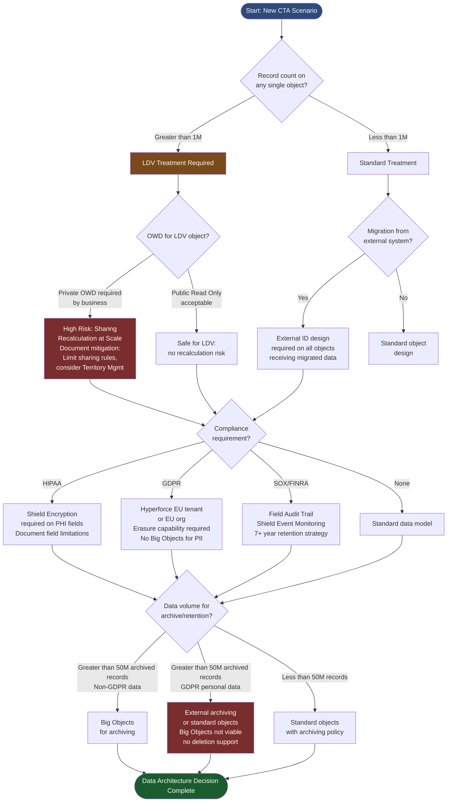
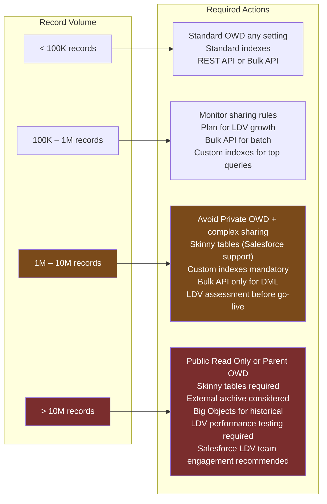
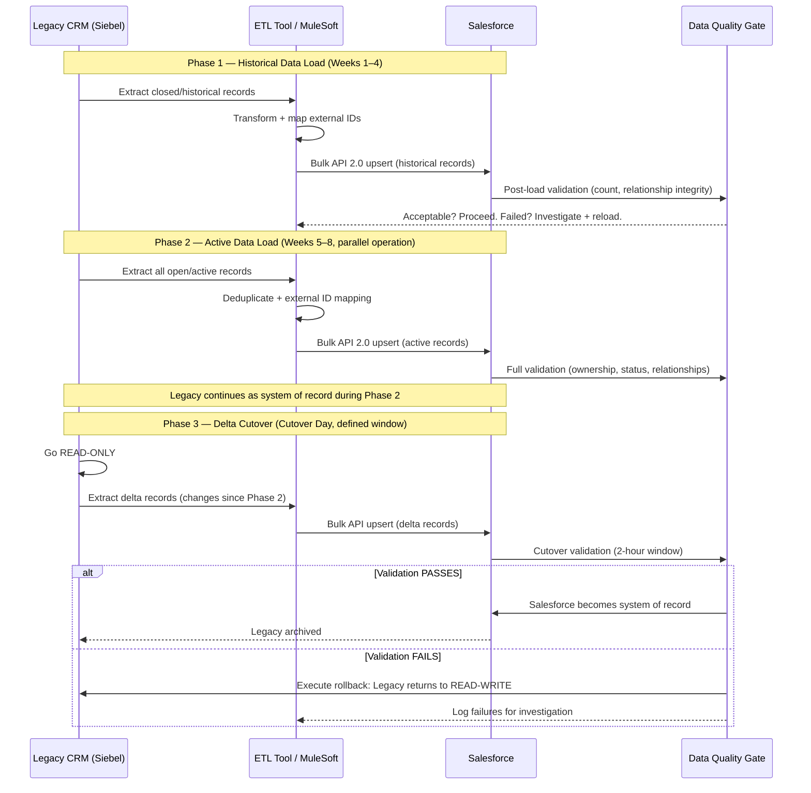

# Data Architecture in CTA Scenarios

## Overview / Context

Data architecture is the most consistently underestimated domain in CTA board exams. Candidates with strong functional Salesforce backgrounds enter the exam having spent their careers making Salesforce work — and functional Salesforce works perfectly well with modest data volumes and clean data from a single source. Enterprise CTA scenarios deliberately introduce conditions where those assumptions break: record volumes in the tens of millions, migrations from legacy systems with decades of dirty data, multiple upstream sources of truth, compliance requirements that dictate how data is stored and how long it is retained. The candidate who treats data architecture as an afterthought — designing the sharing model, integration, and application architecture first and then asking "where does the data go?" — will produce an architecture that fails in production.

In CTA scenarios, data architecture decisions cascade into every other domain. The number of records on the Account object determines whether the security sharing model is viable at scale. The presence of a migration requirement from a legacy CRM determines whether external IDs must be part of the object design. A GDPR or HIPAA requirement determines whether Shield Platform Encryption is mandatory and which fields must be encrypted — which in turn determines which fields can be used in formula fields, reports, and SOQL WHERE clauses. Candidates who treat these domains as independent and design them in isolation will produce architectures with internal contradictions that a CTA panel will find within the first five minutes of Q&A.

The practical skill the CTA board is testing in the data architecture domain is the ability to identify, from the scenario narrative, the data conditions that require specialized treatment — and then to name and justify the specific Salesforce capability or pattern that addresses each condition. Broad statements ("we'll handle large data volumes with best practices") are penalized; specific statements ("the 5M Account records qualify as an LDV object; we will set OWD to Public Read Only to avoid sharing recalculation at scale, implement skinny tables for the top three query patterns, and use selective custom indexes on ExternalId__c and CreatedDate") demonstrate architectural depth.

---

## Core Concepts / Framework

### The Five-Question Data Architecture Framework

For every CTA scenario, answer all five questions in sequence before designing any other domain. Data architecture answers constrain security, integration, and application architecture.

---

#### Question 1: Volume — What Are the Record Counts and Which Objects Will Hit LDV Thresholds?

**LDV (Large Data Volume) threshold:** Any single Salesforce object with more than 1 million records is an LDV object. At this scale, standard platform behaviors — sharing recalculation, full-table SOQL queries, ad-hoc reports — begin to degrade. The architecture must explicitly account for this.

**How LDV appears in CTA scenarios:**
- "5 million customer records" — the word "customer" usually maps to Account
- "50 million transactions over 7 years" — the word "transaction" likely maps to a custom object or Opportunity
- "3 years of historical case data" — estimate records per year × 3
- "Leading global retailer" — implies large transaction volume even if not stated; ask in Q&A

**LDV implications by category:**

| Implication | Detail |
|-------------|--------|
| OWD restriction | Private OWD on an LDV object with active sharing rules triggers sharing recalculation that can lock org performance for hours or days. Public Read Only OWD eliminates this. If business requirements demand Private OWD (sales reps can't see each other's accounts), design must account for the performance risk explicitly. |
| SOQL selectivity | Queries on LDV objects that do not use indexed fields in WHERE clauses trigger full table scans. Salesforce's query optimizer requires queries returning >100K records to use at least one indexed field. Custom indexes must be requested from Salesforce support for non-standard indexed fields. |
| DML volume | Bulk DML via REST API on LDV objects is a common bottleneck. Bulk API 2.0 is required for batch operations >10K records. |
| Sharing recalculation | When OWD changes or sharing rules are modified on an LDV object, Salesforce recalculates sharing for all records. On 5M records, this can take days. Plan OWD changes carefully; never change OWD on a live LDV object without a maintenance window. |
| Async triggers | Triggers on LDV objects must be designed to handle bulk operations — all trigger logic must be bulkified, collections used, no SOQL inside loops. |

**LDV threshold decision matrix:**

| Records per Object | Sharing Recommendation | Query Strategy | DML Strategy |
|-------------------|----------------------|----------------|--------------|
| < 100K | Any OWD viable | Standard indexes sufficient | REST API or Bulk API |
| 100K – 1M | Monitor sharing rule count; plan for growth | Review query patterns; add custom indexes for top filters | Bulk API recommended for batch |
| 1M – 10M | Avoid Private OWD with complex sharing rules; prefer Public Read Only | Skinny tables for top query patterns; custom indexes mandatory | Bulk API only for batch |
| > 10M | Public Read Only or Controlled by Parent OWD; Apex Managed Sharing only when truly required | Skinny tables, selective indexes, consider External Objects or Big Objects for archive | Bulk API only; consider external archiving before migration |

---

#### Question 2: Schema Design — What Are the Core Entities and Their Relationships?

**Standard vs. custom objects — the CTA principle:**
Always prefer standard objects. Standard objects carry built-in integration points, platform automation, reporting capabilities, and upgrade safety. Custom objects should be created only when no standard object appropriately models the entity, or when an installed Industry Cloud (FSC, Health Cloud, Manufacturing Cloud) provides a specialized standard object that supersedes the generic one.

**Relationship type decisions:**

| Relationship | When to Use | Key Properties | When NOT to Use |
|--------------|-------------|----------------|-----------------|
| Master-Detail | Child always belongs to parent; cascade delete desired; child roll-up summaries needed | OWD of child = Controlled by Parent; deleting parent deletes all children; up to 40 MD per object | When child can exist without parent; when cascade delete is a risk |
| Lookup | Optional relationship; child can exist without parent | No cascade delete; child inherits own OWD; nullable | When roll-up summaries are required (use MD instead) |
| Hierarchical Lookup | Self-referential, User object only | Used for manager hierarchy | Only for User; cannot use for custom hierarchy |
| External Lookup | Relates Salesforce objects to External Objects (OData) | Crosses org boundary; joins to external data source | When real-time performance <200ms required |
| Indirect Lookup | Relates External Objects to Salesforce objects via External ID | External Object is the child | Same performance considerations as External Objects |

**Polymorphic lookups — what a CTA candidate must know:**
The `WhoId` field on Task and Event is polymorphic — it can reference either a Contact or a Lead. The `WhatId` field can reference any object that supports activity. Polymorphic lookups have specific implications:
- They cannot be used in report filter criteria the same way as standard lookups
- SOQL queries on polymorphic fields require `TYPEOF` syntax and are more complex
- Schema discovery for polymorphic fields requires `getSObjectField()` calls in Apex
- CTA signal: if a scenario involves activity management at scale or custom reporting on activities, name this constraint

**External IDs — design principle:**
Every object that will receive data from an external system — in migration or ongoing integration — must have an `ExternalId__c` field (Text, External ID, Unique) populated with the source system's primary key. This enables:
- Idempotent upserts (prevent duplicate records from retry operations)
- Relationship mapping during migration (parent lookup by external ID rather than Salesforce ID)
- Integration reconciliation (find the Salesforce record matching a source record)
- CTA rule: if a scenario includes migration or integration, the architecture must include external ID strategy. The panel will ask.

---

#### Question 3: Access Patterns — Who Queries What, How Often, and on What Fields?

Salesforce's query optimizer makes decisions about whether to use an index based on query selectivity. For LDV objects, non-selective queries result in full table scans that degrade performance for all users on the org.

**Selectivity thresholds:**
- A query is selective if its result set is < 10% of total records (up to 1M records) or < 333K records (above 10M)
- Standard indexed fields: Id, Name, OwnerId, CreatedDate, Email (on Lead/Contact), ExternalId__c fields marked as External ID
- Custom indexed fields: must be requested from Salesforce support; not all field types are indexable
- Non-selective queries on LDV objects go to a system-level queue and can cause timeouts

**Skinny tables:**
A skinny table is a Salesforce internal performance optimization: a narrow copy of selected fields from a large object, maintained in a separate optimized table. This eliminates the overhead of joining the main object's column store for the most common query patterns.
- Must be created by Salesforce support — not self-service
- Contains up to 100 fields from the parent object
- Does not contain fields from related objects
- Best for: objects with >10M records and predictable, repeated query patterns on the same set of fields
- Not appropriate for: dynamically evolving schemas, objects with <1M records (overhead not justified)

**Report and dashboard architecture:**
- Report type limits: reports can join up to 4 objects (primary + 3 related); if reporting requirements exceed this, evaluate Einstein Analytics / Tableau CRM
- Cross-object formula fields in reports: each cross-object formula counts against column limits
- Async reports: reports over 2K records run asynchronously; large reports (>100K rows) may time out — design summary reports for operational use, export for analytical use

---

#### Question 4: Migration Design — Source, Sequence, Quality Gates, and Rollback

**The 3-Phase Migration Pattern (CTA standard):**

```
Phase 1 — Historical Data Load
  Bulk load completed/closed records from source system
  Lowest business risk (inactive records)
  No production cutover dependency
  Data quality accepted at "good enough" threshold
  Purpose: migrate the archive, reduce legacy system read queries

Phase 2 — Active Data Load
  Load all open/active records with full business validation
  Run in parallel with legacy (legacy still writes, SF not yet live)
  Deduplication performed BEFORE this load
  External IDs used for all upserts
  Validate business rules post-load: ownership, relationships, status

Phase 3 — Delta Cutover
  Capture all changes in legacy since Phase 2 load
  Identify delta records (timestamp or CDC-based)
  Load delta with defined downtime window (legacy goes read-only)
  Cutover Salesforce to production writes
  Validate post-cutover integrity within 2-hour window
  Execute rollback plan if validation fails
```

**Critical migration design elements the panel will probe:**

| Element | What Good Looks Like | What Failing Looks Like |
|---------|---------------------|------------------------|
| External IDs | Every migrated record has ExternalId__c tied to source PK; all relationship lookups by external ID | Relationships loaded by name or email; duplicates created on retry |
| Deduplication | Dedup performed against source before migration, then Duplicate Rules activated post-migration | Migration loads raw source data into Salesforce; duplicates discovered post-go-live |
| Rollback plan | Documented procedure to restore legacy system as primary in < RTO; tested in sandbox | "We'll fix issues after cutover" |
| Data quality gate | Defined acceptance criteria for post-load validation (record count, relationship integrity, field population %) | No formal quality gate; "we'll check if anything looks wrong" |
| Transformation | Source-to-target field mapping with transformation rules documented; null handling and default values defined | "We'll map the fields in the ETL tool" |
| Volume & timing | Bulk API throughput calculated against record count to confirm migration fits in cutover window | Timeline stated without throughput analysis |

**Rollback plan requirements:**
- A migration without a rollback plan is an unacceptable architecture
- Rollback requires: (1) legacy system in read-only mode (not destructively modified during cutover), (2) defined validation criteria that trigger rollback, (3) rollback time within RTO
- The panel will ask: "What happens at Hour 3 of the cutover window when you discover 15% of Account-Contact relationships are broken?" The answer must include a specific rollback procedure.

---

#### Question 5: Governance — Who Owns the Data, What Is the System of Record, How Are Duplicates Prevented?

**Master Data Management (MDM) in CTA scenarios:**
When a scenario describes multiple source systems that each contain customer data (CRM, ERP, marketing database, service system), the architecture requires an explicit decision about which system is the master of record for each data entity. Without this decision, the architecture produces conflicting records and no clear resolution process.

- **Salesforce as MDM hub:** appropriate when Salesforce is the primary operational system and other systems receive updates from Salesforce. Requires robust duplicate prevention (Duplicate Rules + Matching Rules) and a data stewardship process.
- **External MDM hub pattern:** when multiple enterprise systems share customer data and none is clearly primary. Tools like Informatica MDM, IBM MDM, or Reltio maintain the golden record and distribute to downstream systems. Salesforce receives from the MDM hub. This is the correct pattern for large enterprises with fragmented customer data.
- **Data stewardship process:** who resolves merge conflicts? This is an organizational architecture question as much as a technical one. The CTA presentation should name the data stewardship model.

**Duplicate Rules and Matching Rules:**
- Native Salesforce deduplication — good for ongoing prevention of new duplicates
- NOT a bulk deduplication tool — will not clean up 500K existing duplicates
- Matching algorithms: Fuzzy name matching, email exact match, phone normalization
- CTA recommendation: perform bulk deduplication BEFORE migration using external tools (Data.com Clean, Informatica, RingLead), then activate Duplicate Rules for ongoing prevention

---

### Big Objects, Skinny Tables, External Objects — CTA Decision Matrix

| Pattern | Use When | Do Not Use When | CTA Signal in Scenario |
|---------|----------|-----------------|----------------------|
| Big Objects | Archive data >50M records; must remain in Salesforce ecosystem; compliance/audit data retention; IoT data | Real-time reporting required; SOQL queries needed; triggers needed; SOSL/search needed | "7-year retention," "audit log archive," "IoT sensor data," "historical transaction archive" |
| Skinny Tables | LDV object with >10M records; same query pattern repeated; performance tuning for specific use case | Schema changes frequently; object <1M records; cross-object query optimization needed | Performance NFR on LDV object; "page load too slow on Account list view" |
| External Objects | Data too large/sensitive to load into Salesforce; reporting on external data without ETL; read-mostly access patterns | Real-time performance <200ms; data must appear in SOSL search results; triggers required | "Data must remain in data warehouse," "cannot move data to cloud," "read-only view of ERP data" |
| Data Archiving | Records >3–5 years old; no active business process; storage cost optimization | Legal/compliance requires data in Salesforce audit trail; active reports reference old records | "Storage costs," "historical data performance impact," "records not touched in 3 years" |

---

### Data Residency and Compliance

**GDPR and data architecture:**
- EU personal data must reside in EU data centers — requires Hyperforce with EU tenant selection, or a dedicated EU org
- "Right to erasure" (Article 17): the architecture must support deletion of individual records and all related data on request. Implications:
  - Historical data loaded in migration must be deletable (Big Objects do NOT support deletion — cannot use Big Objects for GDPR-scoped personal data)
  - Backup copies must also honor erasure requests — document the backup provider's erasure capability
  - Marketing Cloud and other connected systems must also receive erasure instructions — the architecture must include a cross-system erasure flow
- "Right to access" (Article 15): the architecture should include a mechanism to export all data about a specific individual — Privacy Center addresses this

**HIPAA and data architecture:**
- All Protected Health Information (PHI) must be encrypted at rest — Shield Platform Encryption required
- Minimum Necessary Access principle: only those with a clinical or operational need to access PHI should have field-level access to encrypted PHI fields
- Field list for Shield: identify every field that contains PHI (Name, DOB, Diagnosis, SSN, Insurance ID) — each must be individually configured for encryption
- Encrypted fields cannot be used in: formula fields, roll-up summaries, reports (filter/grouping), most list views, SOQL WHERE clauses — these limitations must be addressed in the architecture (alternate unencrypted reference fields, separate query patterns)

---

### Integration of Data Architecture with Sharing Model

This is the cross-domain relationship that CTA candidates most frequently miss:

- **LDV + Private OWD + Complex Sharing Rules = Performance Disaster:** Sharing recalculation on a 5M-record object with 200 sharing rules can cause org-wide lockouts lasting 6–24 hours. If the business requires Private OWD on an LDV object, the architecture must address how sharing recalculation is managed — either by severely limiting sharing rule complexity, using Territory Management to replace role-based sharing, or re-examining whether Public Read Only OWD with row-level security via permission filters is viable.
- **Skinny tables contain only fields from the base object:** If the most common query pattern requires fields from a related object (Account Name on Opportunity), a skinny table will not help. The architecture must use denormalization (formula fields to bring parent data to child) or cross-object indexes.

---

## PTA / SA Relevance

### Parallels to Daily Advisory Work

The 5-question framework maps directly to the data architecture section of a technical discovery workbook. In enterprise customer engagements, every new cloud deployment should begin with a data volume assessment — which objects will hold the most records in Year 1, Year 3, and Year 5? A customer who is deploying Salesforce with 200K Accounts today but has a stated growth target of 5M Accounts in 3 years needs an LDV-aware architecture on day one.

The migration pattern is directly applicable to any Salesforce implementation replacing a legacy CRM. The 3-phase pattern (historical, active, delta cutover) is standard in enterprise migrations, but the details — external IDs, rollback plan, quality gates — are precisely what differentiates a CTA-caliber architecture from a consultant's standard approach.

MDM conversations are increasingly relevant at SA level as customers deploy multiple Salesforce clouds (Sales + Service + Marketing + Commerce) and realize they have Customer 360 fragmentation. Introducing MDM patterns early in the advisory relationship positions the SA as a strategic advisor rather than a product implementer.

### How to Use This in Customer Engagements

**In pre-sales:** When qualifying an opportunity, the record volume question should appear in your discovery call script. "How many customer records do you have today, and what's your growth trajectory?" is not a technical detail — it determines whether the engagement requires LDV expertise and whether the standard SI partner is equipped to handle it.

**In architecture workshops:** Use the external ID design conversation as a forcing function to identify all source systems. "For every object we migrate, we need an external ID tied to the source system primary key. What are all the source systems that will contribute records to each object?" This surfaces integration requirements that customers often forget to mention.

**In governance conversations:** The MDM discussion — "which system is the master of record for each data entity?" — is one of the highest-value advisory conversations an SA can have. Most enterprise customers have never formally answered this question. Helping them answer it creates lasting architectural clarity.

**In QBRs:** Data volume reporting (records per object, storage consumption, sharing rule counts) should be a standing agenda item in customer QBRs for any large-org customer. Performance degradation that appears post-deployment almost always traces back to data volume thresholds that were not anticipated at design time.

---

## Architecture / Scenario

### Data Architecture Decision Tree



### LDV Threshold Treatment Matrix



### 3-Phase Migration Sequence



---

## Key Principles to Apply

1. **Every CTA scenario with >1M records on any object requires an explicit LDV strategy.** Name the object, the volume, and the three specific LDV mitigation decisions: OWD, index strategy, DML approach. Never present an LDV object without all three addressed.

2. **External IDs are mandatory on every object that receives migrated or integrated data.** The architecture must include ExternalId__c field design as a first-class component, not an implementation detail. Specify the field name convention, the source system it maps to, and how it enables idempotent upserts.

3. **Migration must always include a rollback plan.** An architecture that describes migration phases without defining rollback criteria and rollback procedure is incomplete. The panel will probe this in Q&A.

4. **Big Objects cannot support GDPR erasure.** Big Object records cannot be deleted individually. Architectures that use Big Objects to store GDPR-scoped personal data are architecturally incorrect. This is a common trap when candidates see "GDPR + 50M records" and reach for Big Objects.

5. **Skinny tables are a Salesforce-support-provisioned optimization, not a self-service feature.** Name them in the architecture with the caveat that they require engagement with Salesforce Support and typically take days to provision. Do not present them as a configuration step.

6. **The data model must be designed to accommodate Phase 2 and Phase 3 without rework.** Schema changes between phases that require data re-migration are an architectural failure. Design the complete target state data model in Phase 1, even if not all objects are populated until Phase 2.

7. **Encrypted fields cannot be used in formula fields, roll-up summaries, or SOQL WHERE clauses.** When Shield Platform Encryption is required, the architecture must explicitly address the reporting and integration implications of each encrypted field. This is a common source of integration breakage post-deployment.

8. **Deduplication is a pre-migration activity, not a post-migration cleanup.** Loading dirty source data and then running Duplicate Rules is not a data governance strategy. Bulk deduplication must happen in the source or in the ETL tool before loading into Salesforce.

---

## Common Mistakes (CTA Candidates + Real Implementations)

1. **Candidate does not address data migration at all.** If the scenario says "migrate from Siebel" and the candidate's architecture never mentions migration design, the panel will note that a major work stream was entirely ignored. Migration is not an implementation detail — it is an architectural concern.

2. **Candidate proposes Private OWD on an LDV object without addressing sharing recalculation.** "Sales reps see only their own accounts" sounds like a simple security requirement; on a 5M-record Account object with 300 sharing rules, it is an architectural time bomb. The candidate must either justify why it is acceptable (sharing rule volume is low, sharing recalculation cadence is manageable) or propose an alternative (Territory Management, Public Read Only with permission filters).

3. **Candidate uses Big Objects to archive GDPR-scoped personal data.** Big Objects do not support record deletion, so an individual's "right to erasure" cannot be honored. This is a direct compliance failure in the architecture.

4. **Candidate treats data migration as a Phase 3 activity.** Historical data migration is commonly — and correctly — deferred to Phase 2. But active data migration (the records the business will use on day one) must be in Phase 1. An architecture that goes live without active data being migrated has no business value.

5. **No mention of deduplication strategy.** Every scenario with a CRM migration has legacy duplicates. An architecture that loads source data without a deduplication strategy will produce a Salesforce org with duplicate records from day one. The panel expects to hear: dedup strategy (external tool, native Duplicate Rules, MDM), when dedup occurs (before migration, post-migration), and how ongoing duplicates are prevented.

6. **External IDs omitted from the data model.** Candidates who describe a migration without external IDs are describing a migration that cannot be idempotently replayed if it fails. The panel knows that enterprise migrations always require reruns. An architecture without external IDs on migrated objects is a known failure pattern.

7. **In real implementations: LDV not assessed before go-live.** The most common data architecture failure in production deployments is an object that was within volume limits at go-live but grows past the LDV threshold 12–18 months later without any architecture change. Design for Year 3 volume, not go-live volume.

8. **Candidates confuse skinny tables with custom indexes.** These are different optimizations: a custom index helps the query optimizer find records faster; a skinny table reduces the I/O cost of reading the selected fields. Both may be needed on the same object. Naming both and explaining when each is appropriate demonstrates depth that a candidate who says only "we'll optimize queries" does not.

---

## Practice Questions / Scenario Exercises

**Exercise 1 — LDV Architecture**

Scenario excerpt: *"RetailGlobal has 8.5 million customer Account records, 42 million Order records (custom object), and 120 million Order Line Items. Sales reps should only be able to see accounts and orders they own. The company requires real-time reporting on order status for regional managers."*

Questions:
1. Identify which objects require LDV treatment and specify the exact architectural response for each.
2. The "sales reps see only their own accounts" requirement combined with the 8.5M record count — what is the risk, and what are the two architectural options for resolving it?
3. For real-time reporting on Order records at 42M scale, what is the architectural recommendation and why?
4. Design the external ID strategy for Account, Order, and Order Line Item objects assuming the source system is SAP.

**Model Answer Guidance:** All three objects require LDV treatment. Account (8.5M) + Private OWD = sharing recalculation risk; options are (1) evaluate Territory Management to replace role-based sharing — scales better for large volumes, or (2) reduce sharing rule complexity to minimize recalculation time. Order (42M) and Order Line Item (120M) should use Public Read Only OWD (Controlled by Parent for Line Items) since order security flows from Account ownership. Real-time reporting on 42M Orders is not viable with standard SOQL-based reports; recommend Tableau CRM (Einstein Analytics) with an Incremental sync dataset that processes only new/changed records. External IDs: Account_ExternalId__c (SAP Customer Number), Order_ExternalId__c (SAP Order Number), OrderLineItem_ExternalId__c (SAP Item Number + Order Number composite).

---

**Exercise 2 — Migration Design**

Scenario excerpt: *"LegacyCo is migrating 15 years of data from an on-premise Oracle-based CRM. The migration scope includes 2.1M Account records, 8.4M Contact records, 12.3M Activity records, and 1.7M Opportunity records. The legacy system will be decommissioned 90 days after Salesforce go-live. GDPR applies to all EU records (approx 40% of total volume)."*

Questions:
1. Design the complete 3-phase migration plan with timeline estimates for each phase.
2. What is the deduplication strategy given 2.1M Accounts and 8.4M Contacts from 15 years of data?
3. GDPR "right to erasure" applies to the migrated data — what architectural implication does this have for your migration design?
4. The 90-day decommission window — what is your rollback plan if critical data integrity issues are discovered on Day 60?

**Model Answer Guidance:** Phase 1 (Weeks 1–4): historical closed records (Opportunities closed >2 years, Activities >1 year, inactive Contacts). Phase 2 (Weeks 5–10): active Accounts, Contacts, open Opportunities. Phase 3 (cutover Day 1): delta since Phase 2, with 4-hour downtime window and 2-hour validation gate. Deduplication: bulk dedup of source data using Informatica or RingLead on Account (name + address fuzzy match), Contact (email exact match + name fuzzy), before any load; activate Salesforce Duplicate Rules for ongoing prevention. GDPR/erasure: Big Objects cannot be used for any EU personal data; all migrated records must be in standard objects with deletable records; Privacy Center configured for erasure workflow. Day-60 rollback: Oracle DB maintained in read-only state for 90 days precisely to enable rollback; rollback involves reverting Salesforce URL routing and re-activating Oracle as primary; data corrupted in Salesforce identified and corrected from Oracle source.

---

**Exercise 3 — Compliance + Data Architecture**

Scenario excerpt: *"HealthNet manages 560,000 patient records, all considered PHI. They require a 10-year retention of all field changes to clinical data fields. Integration feeds clinical case data to a downstream data warehouse. All access to PHI fields must be auditable."*

Questions:
1. Which Shield components are required and why? For each, name the specific business requirement it satisfies.
2. Shield Platform Encryption is applied to 12 fields on the Case object (PatientName, DOB, Diagnosis, etc.). The downstream data warehouse integration queries these fields in a SOQL WHERE clause. What is the problem and how do you resolve it?
3. The 10-year field change retention requirement — what is the native Salesforce capability that addresses it, and what is the limitation the architecture must account for?
4. Design the data model for "auditable access to PHI fields" — which capability provides this?

**Model Answer Guidance:** Shield components: (1) Platform Encryption — encrypts PHI fields at rest (HIPAA requirement); (2) Field Audit Trail — 10-year field change history; (3) Event Monitoring — auditable access log for who queried which PHI records. SOQL WHERE on encrypted fields: encrypted fields cannot be indexed or filtered in SOQL; the data warehouse integration cannot filter by PatientName or DOB. Resolution: add an unencrypted patient identifier (MRN, patient number) as the integration join key; encrypted PHI fields are only read (not filtered) by the integration. Field Audit Trail: retains up to 10 years of field history (configurable); limit is that it retains history for specific fields only, not all fields by default — must configure which fields are audited. Auditable PHI access: Event Monitoring generates login and API usage logs; specific field-level access requires EventLogFile analysis for Report and ReportExport events.

---

**Exercise 4 — Schema and MDM**

Scenario excerpt: *"GlobalBank has customer data in 4 systems: Salesforce (current CRM), Siebel (legacy CRM being retired), SAP CRM (international), and a homegrown loan origination system. Each system has 'customers' but they are not deduplicated across systems. The bank estimates 20–40% overlap between systems. The target state is a single view of the customer in Salesforce."*

Questions:
1. Recommend a Master Data Management architecture and justify the choice (Salesforce-as-MDM-hub vs. external MDM hub).
2. Design the data model for the Account object that supports the 4-source integration, including external ID fields.
3. What Salesforce-native capabilities support ongoing deduplication, and what are their limitations at this scale?
4. The "single view of the customer" objective — what Salesforce capability or data model pattern most directly supports this?

**Model Answer Guidance:** External MDM hub required: 4 source systems with 20–40% overlap is beyond what Salesforce-native Duplicate Rules can handle; recommend Informatica MDM or Reltio as the golden record engine. Salesforce receives the resolved golden record from MDM hub via API; downstream feeds (SAP, Siebel, loan system) also receive resolved records from hub. Account external IDs: SalesforceExternalId__c (legacy Salesforce ID), SiebelCustomerId__c, SAPCustomerNumber__c, LoanSystemId__c — all four source IDs on the Account object to enable reconciliation. Salesforce Duplicate Rules limitation: can prevent new duplicates going forward but cannot bulk-resolve the existing cross-system overlap; the bulk dedup must happen in the MDM platform. Single customer view: Salesforce's Account object as the target entity, with all 4 source IDs mapped; a custom "Customer Profiles" related list showing all source system references; Customer 360 / Data Cloud if licensed as the unified profile layer.
