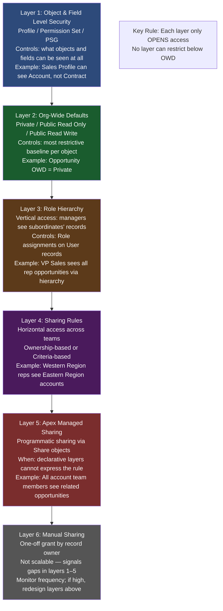
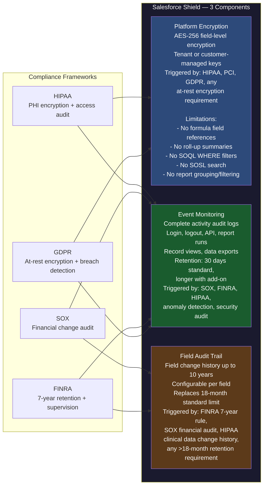

# Security & Sharing Architecture in CTA Scenarios

## Overview / Context

Security and sharing is the domain where the highest concentration of CTA candidate failures occur. The failure mode is almost never a lack of knowledge about individual Salesforce security features — most candidates can name OWD settings, describe role hierarchies, and explain Shield. The failure is one of two kinds: (1) treating security as a layer applied after the functional architecture is designed, instead of as a foundational constraint that determines the entire architecture; or (2) presenting security decisions without demonstrating the cross-domain consequences of those decisions.

Requirements in this domain are rarely stated with the precision that functional requirements are. A requirement that reads "managers should be able to see their team's performance" implies a role hierarchy design, a specific OWD setting, and possibly a role-based sharing rule — but none of those words appear in the requirement. A requirement that reads "agents should not see each other's accounts" implies Private OWD on Account, which cascades into LDV performance implications if the Account object exceeds 1M records. Reading these implied security requirements and surfacing their architectural implications is the skill the panel is testing.

The cascading effects of security decisions into other domains are a primary CTA differentiator. A candidate who says "OWD for Account is Private, role hierarchy gives manager visibility, sharing rules handle cross-team access" has described the security model correctly at a surface level. A candidate who continues with "given that Account will hold 5M records, Private OWD with the proposed 87 sharing rules creates a sharing recalculation risk; we mitigate this by constraining sharing rule complexity and establishing a sharing recalculation maintenance window during which DML-intensive integrations are suspended" has demonstrated the systems-level thinking the CTA credential represents.

---

## Core Concepts / Framework

### The Security Design Order — Non-Negotiable Sequence

Security design must proceed in this exact sequence. Skipping layers or designing them out of order produces architectures with gaps and contradictions. The CTA panel is trained to ask questions that expose non-sequential security thinking.

```
Layer 1 — Object and Field Level Security (FLS)
  What can each profile/permission set access?
  Controls: Profile, Permission Set, Permission Set Group
  Design first because: all subsequent layers only share what OFG already permits

Layer 2 — Org-Wide Defaults (OWD)
  What is the most restrictive baseline access for each object?
  Controls: OWD per object, separate for internal and external users
  Design second because: OWD establishes the floor from which all sharing opens up

Layer 3 — Role Hierarchy
  Vertical sharing: users higher in the hierarchy see records owned by users below them
  Controls: Role assignments, "Grant Access Using Hierarchies" checkbox per object
  Design third because: hierarchy is the primary mechanism for management visibility

Layer 4 — Sharing Rules
  Horizontal sharing: cross-team, criteria-based, or ownership-based access
  Controls: ownership-based rules, criteria-based rules
  Design fourth because: rules only extend access, never restrict below OWD

Layer 5 — Apex Managed Sharing
  Programmatic sharing for complex rules not expressible declaratively
  Controls: Apex Share objects (AccountShare, OpportunityShare, etc.)
  Design fifth because: only use when layers 1–4 are insufficient; adds maintenance complexity

Layer 6 — Manual Sharing
  One-off record sharing by record owners
  Design last because: not a scalable or architectural mechanism; signals incomplete layers 1–5
  If manual sharing is frequent, the security model is wrong
```

**The critical rule:** Each layer only grants additional access — it never restricts below the OWD. If OWD is Public Read Only, you cannot restrict individual records to Private using sharing rules. If a business requirement demands that specific records be restricted below the OWD, the OWD itself must be set lower. This is a common misunderstanding among candidates.

---

### OWD Decision Framework

**Starting principle:** Set OWD to the most restrictive setting that makes business sense, then open access upward through the hierarchy and rules. The question is not "what is the default setting?" but "what is the most restrictive baseline the business can operate with?"

| OWD Setting | Meaning | When to Use | When NOT to Use |
|-------------|---------|-------------|-----------------|
| Private | Users see only records they own (or records explicitly shared with them) | Sales Cloud: reps shouldn't see each other's accounts/opportunities; any scenario where data isolation between users is a core business requirement | LDV objects (>1M records) with complex sharing requirements; orgs where sharing recalculation time is unacceptable |
| Public Read Only | All users can see all records; only owners can edit | Shared reference data (Products, Price Books); LDV objects where visibility must be broad; any case where edit restriction is the primary control | When complete isolation between users is required |
| Public Read/Write | All users can see and edit all records | Service Cloud cases in a shared queue model; internal knowledge bases | When any data isolation between users is required |
| Controlled by Parent | Child record inherits parent's OWD | Standard MD relationship children: Case Comments, Opportunity Products, Contact (optional — usually separate) | When child needs independent sharing from parent |
| Private (External OWD) | Experience Cloud users see only their own records | Community portals where customers should not see each other's data | When community users legitimately need cross-account access (dealer portals, partner communities) |

**Private OWD + LDV — the CTA trap:**
This combination requires explicit architectural justification. The panel knows that Private OWD on a 5M-record object with >50 sharing rules creates a sharing recalculation process that can lock org database performance for hours. If a scenario forces this combination, the candidate must:
1. Acknowledge the risk explicitly
2. Propose specific mitigations (limit sharing rule count, use Territory Management, define recalculation maintenance windows)
3. Or propose an architectural alternative (Territory Management, Public Read Only + permission filters)

---

### Sharing Rules: Design Boundaries and Performance

**Ownership-based sharing rules:** "Share records owned by [Role/Queue/Public Group] with [Role/Queue/Public Group]"
- Relatively simple to process
- Tied to record ownership — if ownership changes, sharing is recalculated for that record
- Good for: cross-team visibility where team membership is stable

**Criteria-based sharing rules:** "Share records where [Field] = [Value] with [Role/Queue/Public Group]"
- More flexible but more computationally expensive
- Triggered by field changes that match criteria — every matching field update triggers recalculation for that record
- Use when: sharing depends on record attributes (Region, Status, Record Type) not just ownership
- Performance risk: high-volume field updates that match criteria rules can cause continuous background sharing recalculation

**The 300 sharing rule limit:**
Each object can have at most 300 sharing rules (ownership + criteria-based combined). Hitting this limit is a scenario signal that appears in complex multi-region, multi-role CTA scenarios. When 300 sharing rules are not enough:
- **Apex Managed Sharing:** programmatic sharing using Share objects — no limit on programmatic shares, but requires Apex code maintenance and bulk handling
- **Territory Management:** designed specifically for large sales orgs; replaces role-based sharing for Account access with a territory overlay
- **Re-examine OWD:** if 300 sharing rules are required to open access up from Private, consider whether Public Read Only with edit restriction via Validation Rules or Field-Level Security achieves the same business outcome with far less sharing complexity
- **Role Hierarchy re-design:** flattening a role hierarchy to reduce the number of distinct roles that need horizontal sharing

**Territory Management (Enterprise Territory Management — ETM):**
- Purpose-built for large sales organizations where account ownership is defined by geography, product line, or industry vertical, not by a single user hierarchy
- Territories can be assigned to multiple accounts simultaneously, and accounts can belong to multiple territories
- Territory assignment rules: automated, criteria-based territory assignment (e.g., all Accounts where BillingState = "CA" belong to Western Territory)
- When to recommend in CTA: large sales org (>500 users), multi-dimensional account coverage model (account owned by region + by product + by industry), Private OWD on LDV Account object would require too many sharing rules
- ETM does not replace the role hierarchy — it supplements it for Account-specific sharing

---

### Experience Cloud (Communities) Security

Experience Cloud introduces a second security layer that operates independently from internal Salesforce security. Candidates who treat community users as identical to internal users will produce an architecture with serious security gaps.

**External OWD:**
- Each object has two OWD settings: Internal OWD and External OWD
- External OWD applies to all non-internal Salesforce users (Experience Cloud users, guest users)
- External OWD can be the same as or more restrictive than Internal OWD; it cannot be less restrictive than Internal OWD
- Common pattern: Account OWD = Private (internal), External OWD = Private (community users see only their own account's data)

**Guest User OWD — the most critical security risk:**
- The Guest User profile applies to all unauthenticated visitors to an Experience Cloud site
- Before Spring '21, Guest User access was commonly misconfigured, leading to data leaks where anonymous internet users could access internal records via SOQL queries embedded in Salesforce components
- Current best practice: Guest User OWD should be Private on all objects; only expose specific records to Guest via the Guest User Sharing Rule (a special sharing rule type for unauthenticated users)
- CTA rule: always address Guest User security explicitly when the scenario includes Experience Cloud with public pages

**Sharing Sets:**
- Expose specific records to portal users based on a relationship between the user's Contact (or Account) and the record
- Example: a customer (Contact) can see all Cases where Case.ContactId = their Contact ID — without needing to explicitly share each case
- Sharing Sets replace the need for explicit sharing rules for portal user access
- Limitation: Sharing Sets only work for contacts who are direct members of accounts; they do not work across account hierarchies

**Share Groups:**
- Allow portal users within the same account to see each other's records
- Use when: partner portal users from the same company need to collaborate on shared records
- Less commonly tested on CTA but understanding the concept demonstrates depth

---

### Shield: Three Components and Their Triggers

**Component 1 — Shield Platform Encryption:**

Encrypts data at rest at the field level. This is AES-256 encryption with a tenant-specific key managed in Salesforce's key management system (or customer-managed keys for highest security).

| Trigger in CTA Scenario | Why Shield Encryption |
|------------------------|----------------------|
| HIPAA requirement | PHI fields must be encrypted at rest; BAA required |
| PCI-DSS | Payment card data (if stored) must be encrypted; recommendation is to not store PANs in Salesforce |
| GDPR with sensitive data | Personal data at rest encryption; combined with Hyperforce EU for data residency |
| "Sensitive fields must be encrypted" | Any explicit encryption requirement |
| FedRAMP | Government Cloud requirements include encryption standards |

**Encryption limitations that the architecture must address:**
- Encrypted fields cannot appear in formula fields that reference them
- Encrypted fields cannot be used in roll-up summary formulas
- Encrypted fields cannot be filtered or grouped in reports
- Encrypted fields cannot be indexed for SOQL WHERE clauses
- SOSL (global search) does not work on encrypted fields
- These limitations affect: integration callouts that filter on encrypted fields, reports that aggregate on encrypted fields, list views that filter on encrypted fields
- Mitigation pattern: maintain a non-encrypted reference identifier (patient number, customer ID) that can be used for search/filter; encrypted fields are read-only from a query perspective

**Component 2 — Shield Event Monitoring:**

Provides detailed event logs of all user activity: logins, logouts, API access, report runs, record views, data exports.

| Trigger in CTA Scenario | Why Event Monitoring |
|------------------------|---------------------|
| SOX compliance | Audit trail of who accessed/changed financial data |
| FINRA | Supervision of broker activity; 7-year retention of access logs |
| HIPAA | Access to PHI must be auditable (Minimum Necessary Access verification) |
| "Full audit of data access" | Any scenario requiring access logging beyond standard record history |
| Security anomaly detection | Identify unusual access patterns (mass data export, off-hours access) |

**Component 3 — Shield Field Audit Trail:**

Extends standard Salesforce field history from 18 months to up to 10 years (configurable). Tracks changes to specific fields over the configured retention period.

| Trigger in CTA Scenario | Why Field Audit Trail |
|------------------------|-----------------------|
| "7-year retention of data changes" | Standard field history only retains 18 months |
| FINRA | 7-year record-keeping requirement for financial services |
| SOX | Audit of financial field changes |
| "Complete audit trail of clinical data" | Healthcare requirement for EMR data change history |
| "Who changed what when" for executive data | Any scenario where historical field change data is legally required |

---

### Compliance Frameworks and Their Salesforce Security Implications

| Framework | Applicable Organizations | Key Security Requirements | Salesforce Architecture Response |
|-----------|------------------------|--------------------------|----------------------------------|
| GDPR | Any org processing EU personal data | Data residency (EU), consent tracking, right to erasure, data minimization, breach notification within 72 hours | Hyperforce EU tenant; Privacy Center for consent + erasure; Shield Encryption for at-rest protection; Event Monitoring for breach detection |
| HIPAA | US healthcare organizations handling PHI | Encryption at rest, access controls (minimum necessary), audit trail, Business Associate Agreement | Shield Platform Encryption (PHI fields); Shield Event Monitoring (access audit); BAA from Salesforce (required, available); role-based FLS for minimum necessary access |
| SOX | US public companies | Separation of duties for financial data, audit trail of changes, access controls on financial records | Shield Field Audit Trail (financial field changes); Shield Event Monitoring; role-based access to financial objects; approval processes for financial record changes |
| FINRA | Financial services broker-dealers | 7-year retention of all communications and records, supervision of broker activity | Shield Field Audit Trail (7-year retention); Event Monitoring; secure Einstein Activity Capture for email retention |
| FedRAMP | US Federal Government agencies | Government Cloud, specific security controls (FIPS 140-2 encryption, background check requirements) | Salesforce Government Cloud Plus; customer-managed encryption keys; FedRAMP Authorized products only |
| PCI-DSS | Any org processing payment cards | Cardholder data cannot be stored unencrypted; network segmentation; access controls | Do not store PANs in Salesforce (redirect to payment processor); if stored, Shield Platform Encryption; no payment card data in sandbox; tokenization pattern |

---

### Multi-Cloud Security Considerations

**When the scenario spans multiple Salesforce products:**

**Marketing Cloud:**
- Marketing Cloud data (Contact Builder contacts, journey data) lives in Marketing Cloud's infrastructure, not in the core Salesforce org
- Marketing Cloud Connect synchronizes records between the two, but the security models are independent
- Marketing Cloud has its own role-based access (Administrator, Content Creator, Email Sender, etc.)
- PHI/PII in Marketing Cloud must be governed by Marketing Cloud's own encryption and access controls — Shield Encryption in the core org does not extend to Marketing Cloud

**Financial Services Cloud (FSC):**
- Account-Contact relationships in FSC use the Financial Account model, which creates complex relationships (Household → Individual → Financial Accounts)
- The Household model affects the role hierarchy: a financial advisor might need to see all members of a household across different Contact records
- FSC uses Account-Contact Relationships (a junction object) rather than the standard Contact-Account relationship — this affects sharing model design
- Sharing Sets and Sharing Groups for FSC communities require configuration against FSC-specific objects

**Field Service Lightning (FSL):**
- Service Territories replace geographic role hierarchy for field technician routing
- Permission Sets for FSL are distinct from standard Salesforce permissions: Dispatcher, Technician, Field Service Admin
- Mobile users (technicians) have specific offline data sync security considerations — which records are synced to the device, which remain server-only

---

## PTA / SA Relevance

### Parallels to Daily Advisory Work

The security design order maps directly to the sequence in which SA-led architecture workshops should address security. The most common workshop anti-pattern is jumping to "what sharing rules do we need?" before the OWD and role hierarchy are established. The security design order prevents this.

The compliance framework table is a direct advisory tool. When a customer mentions HIPAA or GDPR, the SA who immediately maps the regulatory requirement to the specific Salesforce capability (Shield Platform Encryption, Hyperforce, Field Audit Trail) is demonstrating advisory value. The SA who says "we'll address compliance during implementation" is deferring a design-time concern to an implementation-time surprise.

Guest User security is a live advisory issue in field engagements. Data breaches resulting from misconfigured Experience Cloud guest user access have occurred at real Salesforce customers. Raising this proactively in any Experience Cloud engagement — especially any engagement with public-facing pages — is both technically correct and reputationally important.

### How to Use This in Customer Engagements

**In security design workshops:** Lead with the security design order as your workshop agenda. "We will design object and field security first, OWD second, role hierarchy third, sharing rules fourth." This prevents the team from designing sharing rules that conflict with an OWD setting that hasn't been decided yet.

**In compliance conversations:** The compliance table is directly usable as a discovery tool. "Your organization processes HIPAA-covered PHI. That means we need Shield Platform Encryption on PHI fields, a BAA with Salesforce, and Shield Event Monitoring for access audit. Let me walk you through how each of those works and what the implementation implications are." This is a conversation most implementation partners are not equipped to lead at this level.

**In Experience Cloud engagements:** Make Guest User security a Day 1 design decision, not an afterthought. The question "which objects and records will be accessible to unauthenticated users?" should be answered before any Experience Cloud component is configured.

**In ISV product evaluations:** When customers are evaluating AppExchange products, the security question is critical: does the managed package request Admin-level permissions? Does it access all records? Does it send data outside the org? Package security review is an SA advisory service that customers rarely ask for but always benefit from.

---

## Architecture / Scenario

### Security Layering Diagram



### Sharing Model Decision Flowchart

```mermaid
flowchart TD
    A([Start: Sharing Model Design]) --> B{Does the business require\ndata isolation between peers?}
    B -- Yes: reps can't see each other --> C[OWD = Private]
    B -- No: all can see all, only edit restriction --> D[OWD = Public Read Only]
    C --> E{Record volume on this object?}
    E -- Greater than 1M records --> F{How many sharing rules needed?}
    E -- Less than 1M records --> G[Private OWD is viable\nDesign role hierarchy + sharing rules]
    F -- Fewer than 50 sharing rules --> H[Private OWD viable\nDocument recalculation risk\nSchedule maintenance windows for OWD changes]
    F -- Greater than 50 sharing rules --> I{Is account ownership\ngeography or segment based?}
    I -- Yes --> J[Territory Management\nreplaces sharing rules for Account access\nScales to thousands of territories]
    I -- No --> K[Consider Apex Managed Sharing\nor re-examine OWD]
    G --> L{Are there cross-team visibility requirements?}
    D --> L
    H --> L
    J --> L
    K --> L
    L -- Yes --> M{Is cross-team access based on\nrecord ownership or record attributes?}
    M -- Ownership: "Western team sees Eastern team's accounts" --> N[Ownership-based Sharing Rule]
    M -- Attributes: "Everyone sees accounts in Status=Strategic" --> O[Criteria-based Sharing Rule\nMonitor for performance on field updates]
    L -- No --> P{Experience Cloud users?}
    N --> P
    O --> P
    P -- Yes, with public pages --> Q[Audit Guest User OWD\nSet Guest User OWD = Private\nCreate Guest User Sharing Rules\nfor specific public records only]
    P -- Yes, authenticated community --> R[Configure External OWD\nConfigure Sharing Sets for record access\nReview Share Groups for peer access]
    P -- No --> S([Security Model Complete])
    Q --> S
    R --> S

    style A fill:#2d4a7a,color:#fff
    style S fill:#1a5c2e,color:#fff
    style F fill:#7a4a1a,color:#fff
    style Q fill:#7a2d2d,color:#fff
```

### Shield Architecture Diagram



---

## Key Principles to Apply

1. **Always design security in layer order.** FLS → OWD → Role Hierarchy → Sharing Rules → Apex → Manual. Designing sharing rules before the OWD is set creates contradictions. The panel will find them.

2. **OWD determines the floor, never the ceiling.** You cannot restrict below OWD using sharing rules. If business requirements need record-level isolation, set OWD appropriately first. This is a fundamental platform behavior that candidates must demonstrate fluency in.

3. **Private OWD on an LDV object requires explicit justification and mitigation.** Never present Private OWD on a >1M record object without immediately addressing sharing recalculation performance risk. The panel knows this is a problematic combination and will wait for you to surface it.

4. **Guest User OWD must always be addressed in Experience Cloud architectures.** Default to: Guest User OWD = Private on all objects; Guest User Sharing Rule used only for the specific records that must be publicly visible. Any other configuration requires explicit justification.

5. **Compliance requirements determine Shield component selection, not preference.** Don't recommend Shield as a general best practice — recommend specific Shield components because of specific regulatory requirements. "We recommend Platform Encryption because the scenario requires HIPAA compliance for PHI fields" demonstrates design intent; "we recommend Shield for security" does not.

6. **Encrypted fields cannot be filtered, grouped, or searched.** Every time Shield Platform Encryption is recommended, immediately state this limitation and name the specific fields and integrations that will be affected. An architecture that recommends encryption without addressing its limitations is incomplete.

7. **Never over-share to compensate for a missing process.** If users complain that they can't access records they need, the first response should be to examine whether the sharing model is correct, not to loosen the OWD. Over-sharing trades operational convenience for security risk.

8. **The sharing model must be documented and tested before go-live.** The CTA architecture includes a User Acceptance Testing plan for the sharing model — test scenarios that verify each role sees exactly what it should see, and no more. Sharing model defects found in production are expensive and embarrassing.

---

## Common Mistakes (CTA Candidates + Real Implementations)

1. **Designing sharing rules before setting OWD.** Candidates who present 12 sharing rules without first stating the OWD for each affected object have designed in a vacuum. The panel will immediately ask "what is the OWD?" and if the sharing rules don't logically follow from the OWD, the architecture has a structural flaw.

2. **Private OWD + LDV object without acknowledging the performance risk.** The panel has seen this fail in production. A candidate who presents this combination without surfacing the risk appears to be unaware of it. A candidate who surfaces it with mitigations appears to be in control of the architecture.

3. **Forgetting External OWD in Experience Cloud scenarios.** Internal OWD and External OWD are independent settings. Many candidates design the internal sharing model correctly and then present Experience Cloud security as if internal OWD automatically applies to community users. It does not — External OWD must be explicitly designed.

4. **Not addressing Guest User security.** Experience Cloud guest access is the most common source of Salesforce data leaks. Any CTA scenario with a public-facing portal that does not explicitly address Guest User security is missing a critical risk. The panel will probe this.

5. **Recommending Shield without naming the specific triggering requirement.** "We recommend Shield Platform Encryption for security" is a non-architectural statement. "We recommend Shield Platform Encryption because the scenario requires HIPAA compliance and the following 8 fields on the Case object contain PHI" demonstrates that the recommendation is grounded in the scenario requirements.

6. **Not stating the Shield encryption limitations.** Recommending Shield Platform Encryption without acknowledging that encrypted fields cannot be indexed, cannot be used in SOQL WHERE clauses, and cannot appear in formula fields means the candidate either doesn't know the limitations or didn't think through the integration and reporting implications. Either way, the panel will ask.

7. **Manual sharing as an architectural mechanism.** If a candidate's architecture includes "record owners will manually share records with their managers," the panel hears: "layers 1–5 of the security model are insufficient for this requirement." Manual sharing is not architecture; it is a workaround. Name it only in the context of "manual sharing exists but should be minimized through the correct implementation of sharing rules."

8. **In real implementations: not testing the sharing model before go-live.** The most expensive security mistakes in Salesforce implementations are discovered post-launch when users either cannot access records they need (operational failure) or can access records they shouldn't (security failure). Both are architectural defects. The CTA presentation must include a sharing model test plan.

---

## Practice Questions / Scenario Exercises

**Exercise 1 — Multi-Tier Sharing Model**

Scenario excerpt: *"GlobalSales Inc. has 2,300 sales reps organized in 4 geographic regions, each with sub-territories. Sales reps should only see accounts in their territory. Regional managers should see all accounts in their region. A National Accounts team needs access to all accounts above $10M annual revenue regardless of territory. There are 4.2 million Account records."*

Questions:
1. Design the complete security model (OWD, Role Hierarchy, Sharing Rules) and justify each decision.
2. Given the 4.2M Account records, what is the performance risk of Private OWD, and what two architectural options would you evaluate?
3. The National Accounts team requirement ("all accounts above $10M revenue") — which sharing mechanism handles this, and what are its performance implications?
4. Draw the role hierarchy structure that supports this organization.

**Model Answer Guidance:** OWD = Private on Account (reps cannot see each other's accounts). Role Hierarchy: National → 4 Regional Directors → Territory Managers → Reps (hierarchy gives upward visibility). 4.2M records + Private OWD = LDV recalculation risk. Option 1: Territory Management (ETM) — replaces sharing rules with territory overlay; scales well for geographic organizations; recommended here. Option 2: Reduce sharing rule complexity and accept recalculation risk with maintenance windows. National Accounts team: Criteria-based sharing rule — "Share Account where AnnualRevenue > 10,000,000 with National Accounts Public Group." Performance implication: every Account record where AnnualRevenue changes across the $10M threshold triggers sharing recalculation for that record; monitor for bulk updates that could trigger mass recalculation.

---

**Exercise 2 — Experience Cloud Security**

Scenario excerpt: *"CustomerConnect portal is a public-facing Experience Cloud site. Anonymous visitors can browse a product catalog. Authenticated customers can view and manage their own cases and orders. Partner users (resellers) can view all cases for their account and submit orders on behalf of their customers. The portal is a B2B2C model."*

Questions:
1. Design the Guest User security configuration for anonymous product catalog browsing.
2. For authenticated customer users — which sharing mechanism gives customers access to their own cases and orders without requiring individual sharing rules?
3. Partner users need to see all cases across their customer accounts — what is the Experience Cloud sharing mechanism, and how does Account hierarchy factor in?
4. What is the External OWD configuration for Case and Order objects, and how does it differ from Internal OWD?

**Model Answer Guidance:** Guest User: External OWD = Private on all objects; create Guest User Sharing Rule for Product/Product Catalog object to expose product records to unauthenticated users; ensure no other object is accessible to guest. Customer users (Sharing Sets): create a Sharing Set on Case where User.ContactId = Case.ContactId — this gives each customer access to their own cases without individual sharing rules; same pattern for Order. Partner users: Sharing Sets work for direct Account membership; for hierarchical access (partner sees all customer-account cases), consider Account Relationships (available in FSC) or Apex Managed Sharing to traverse the account hierarchy programmatically. External OWD: Case = Private (External) — customers see only their own; Internal OWD Case may be different (Public Read Only for agents). External OWD for Order = Private — customers and partners see only their related records.

---

**Exercise 3 — Compliance-Driven Security Architecture**

Scenario excerpt: *"MedGroup Health is implementing Health Cloud for 450 clinical staff. The system will contain PHI including patient name, date of birth, diagnosis codes, and insurance information. State law requires all PHI field changes to be retained for 7 years. The HIPAA BAA is in place. A clinical audit team must be able to review all access to any patient record.*"

Questions:
1. Which Shield components are required? For each, name the specific regulatory trigger.
2. List the fields that require Platform Encryption and describe the architectural implication for the integration that pulls patient data to the EMR system via SOQL.
3. The 7-year field change retention requirement — which Shield component addresses this, and what is the configuration approach?
4. "Clinical audit team can review all access to any patient record" — which capability provides this, and what is the data format/access mechanism?

**Model Answer Guidance:** Shield Platform Encryption (HIPAA: PHI at rest), Shield Event Monitoring (HIPAA: access audit), Shield Field Audit Trail (7-year retention exceeds 18-month standard). Encrypted fields: FirstName, LastName, BirthDate, DiagnosisCode__c, InsuranceId__c, SSN (if stored). EMR integration problem: these fields cannot appear in SOQL WHERE clauses after encryption; the integration must use PatientMRN__c (unencrypted external ID) as the join key, then retrieve the encrypted field values after lookup. Field Audit Trail: configure the specific clinical fields to be tracked; set retention period to 7 years (10 years max is available); note that Field Audit Trail is not retroactive — history only tracked from activation date forward. Access audit for clinical audit team: Event Monitoring EventLogFile — specifically the RecordAccess, ReportExport, and ApiTotalUsage event types; clinical audit team accesses via EventLogFile API or by enabling the Event Monitoring analytics package in CRM Analytics.

---

**Exercise 4 — Sharing Model Conflict Resolution**

Scenario excerpt: *"The sales team currently uses Private OWD on Opportunity with role hierarchy. A new requirement states: 'All opportunities where the account is flagged as a Strategic Account must be visible to the entire Executive team, regardless of territory.' There are 1.1 million Opportunity records. The Executive team has 12 members."*

Questions:
1. Which sharing mechanism handles the "Strategic Account" visibility requirement and what are the trigger conditions?
2. The 1.1M Opportunity records combined with this new requirement — what is the architectural risk and how do you mitigate it?
3. An alternative approach: instead of a sharing rule, propose an Apex Managed Sharing solution. When would you choose Apex Managed Sharing over a criteria-based rule?
4. If the "Strategic Account" flag changes frequently (50–100 accounts reclassified per week), what does this mean for the sharing architecture?

**Model Answer Guidance:** Criteria-based Sharing Rule: "Share Opportunity where Account.IsStrategic__c = TRUE with Executive Team Public Group." OWD = Private means this rule opens access above the floor. 1.1M records: LDV risk is moderate but manageable at 1.1M (the threshold is 1M — just over). The criteria-based rule on a cross-object field (Account.IsStrategic__c) is evaluated when the field changes; 50–100 reclassifications/week means 50–100 Opportunity batch re-sharing operations weekly — at 1.1M records with many related opportunities per account, this could be hundreds of thousands of sharing recalculations per week. Apex Managed Sharing: choose over criteria-based when (1) the rule involves multiple conditions that cannot be expressed declaratively, (2) the cross-object relationship is too complex for criteria-based rules, (3) you need to control exactly when recalculation occurs (batch control vs. trigger-based). For frequent flag changes: monitor sharing recalculation queue depth; if recalculation is causing performance degradation, move to Apex Managed Sharing with a scheduled batch that recalculates Strategic Account sharing nightly rather than on every field change.
