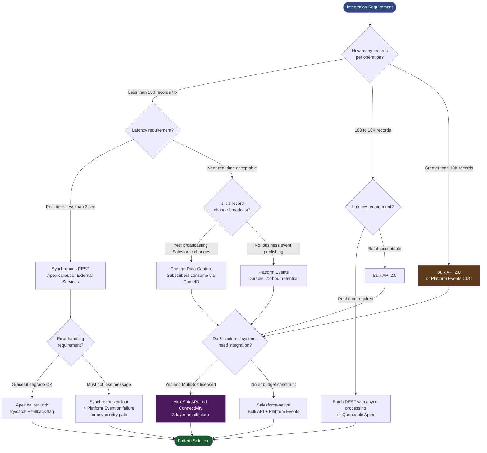
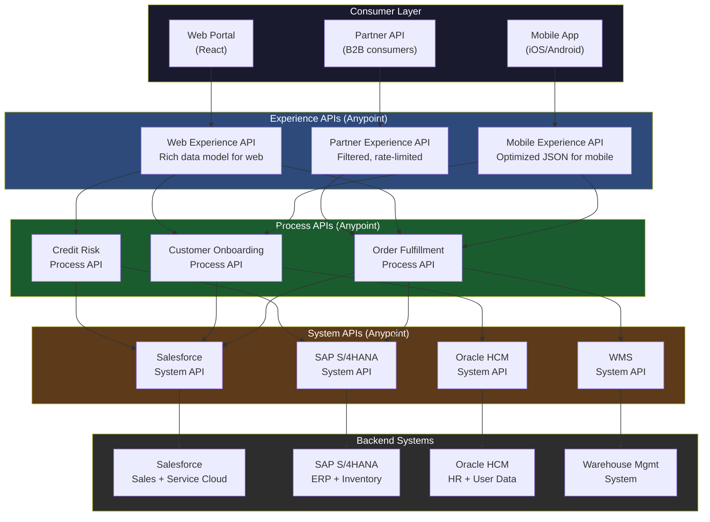
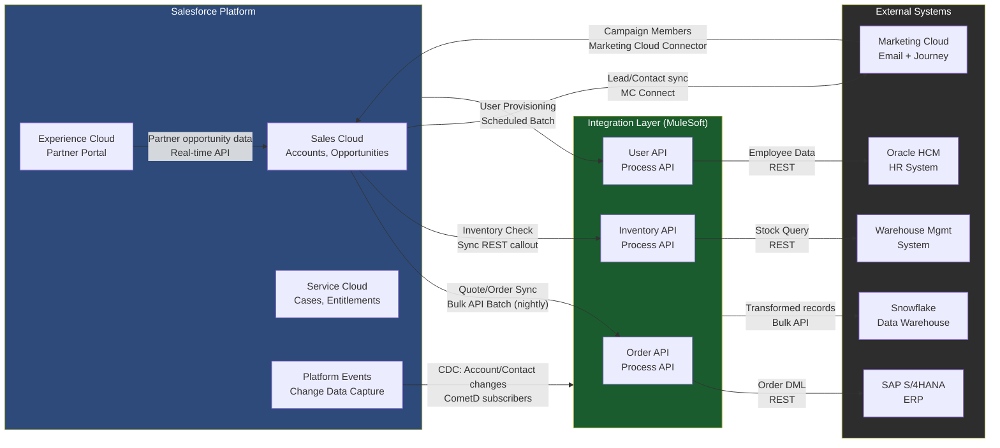

# Integration Architecture in CTA Scenarios

## Overview / Context

Integration architecture appears in virtually every CTA scenario. Enterprise organizations do not operate in a single system — they have ERPs, HR systems, data warehouses, marketing automation platforms, pricing engines, and proprietary internal applications, all of which must exchange data with Salesforce. The CTA board tests whether a candidate understands that integration is not merely a technical implementation detail but an architectural domain with its own patterns, constraints, trade-offs, and failure modes that must be designed explicitly.

The most common integration failure in CTA presentations is defaulting to REST API as the answer for every integration requirement. REST API is one of 5–7 distinct integration patterns, each appropriate for a specific combination of volume, latency, reliability, direction, and error handling requirements. A candidate who says "we'll integrate with SAP via REST API" for a scenario involving 500K daily record syncs has selected a pattern that will fail under load. The panel knows this, and the Q&A will systematically expose it.

The second common failure is treating integration as a list of connections rather than a designed system. Enterprise integration architecture must address: which system is the system of record for each data entity (covered in data architecture), what the data flow direction is for each integration, what the error handling and retry strategy is, what the monitoring approach is, and where transformations occur. An architecture that names "SAP integration" as a bullet point without answering these questions is not an integration architecture — it is an integration inventory.

---

## Core Concepts / Framework

### Integration Patterns — Definitions, Use Cases, and Mechanisms

---

#### Pattern 1: Request-Reply (Synchronous)

**Definition:** The calling system sends a request, waits synchronously for a response, and continues processing based on that response. The caller is blocked until the response arrives.

**When to use in CTA scenarios:**
- Real-time inventory availability check during quote creation — the sales rep needs the answer before the page renders
- Credit check during opportunity creation — the system must know the result before allowing the record to save
- Address validation on Lead entry — immediate feedback required
- Tax calculation during order finalization — result determines order total before save

**Salesforce mechanism:**
- Outbound from Salesforce: `HttpRequest` in Apex (synchronous callout); External Services (declarative REST callout defined by OpenAPI schema)
- Inbound to Salesforce: REST API (GET/POST/PATCH/DELETE) or SOAP API; called by external system

**Constraints the architecture must address:**
- Apex callout timeout: 120 seconds maximum — if the external system cannot respond within 120 seconds, the callout fails and the transaction must handle the error
- Cannot be called from async Apex contexts (Batch Apex, Queueable, Future methods) without specific workarounds — this is a common design trap
- Governor limit: 100 callouts per transaction — if a single Apex context makes more than 100 external calls, a `LimitException` is thrown
- Error handling is the caller's responsibility: the Apex code must explicitly handle timeout, HTTP error codes (4xx, 5xx), and malformed responses
- Tight coupling: if the external system is unavailable, the Salesforce operation fails — design must include graceful degradation (allow record save with a "pending validation" flag, retry later)

**When NOT to use:**
- High-volume batch operations (>100K records per run) — Bulk API is correct
- Fire-and-forget notifications — Platform Events or outbound messaging is correct
- Long-running processes (>120 seconds) — Async pattern required

---

#### Pattern 2: Fire and Forget (Asynchronous One-Way)

**Definition:** The sending system dispatches a message and does not wait for a confirmation or response. The message is received and processed independently.

**When to use:**
- Order status update notification to customer service system
- Audit log event to data warehouse
- Non-critical downstream sync (marketing system, analytics feed)
- Notification to external system that a record was created in Salesforce

**Salesforce mechanisms:**
- Platform Events (publish): publish an event from Apex, Flow, or Process Builder; external subscribers consume via CometD or Pub/Sub API
- Outbound Messaging (SOAP-based): triggered by workflow rule; sends a SOAP message to a configured endpoint; old mechanism, being deprecated in favor of Platform Events
- Queueable Apex: async execution where response is not needed in the original transaction context

**Key behavior:**
- The sender's transaction commits regardless of whether the downstream system receives the message
- If the downstream system fails, the Platform Event is retained for 72 hours (durable Platform Events) and the subscriber can replay from a position
- Does not guarantee delivery order in high-volume scenarios

**When NOT to use:**
- When downstream failure must roll back the Salesforce transaction (use synchronous with transactional semantics instead)
- When confirmation of receipt is required before the user can continue

---

#### Pattern 3: Batch / Bulk Synchronization

**Definition:** Scheduled or triggered bulk data transfer between systems, processing large volumes in batches at defined intervals.

**When to use:**
- Overnight load of Salesforce opportunity data to data warehouse (ETL)
- Daily inventory sync from WMS to Salesforce Product object
- Weekly HR data sync (user provisioning from Oracle HCM to Salesforce)
- Full refresh of pricing data from SAP to Salesforce Price Books

**Salesforce mechanisms:**
- Bulk API 2.0: designed for high-volume DML operations (millions of records); ingest and query jobs; handles governor limits internally; recommended for any operation >10K records
- Scheduled Apex: execute Apex on a CRON schedule; good for lightweight batch operations
- Scheduled Flows: same capability via declarative automation
- External system batch jobs that call Salesforce REST API are not appropriate for >10K records — this is a common anti-pattern

**Volume constraints and calculations:**
- Bulk API 2.0 ingest: typically 150M records per 24-hour window (varies by org edition)
- Bulk API 2.0 parallel jobs: up to 10 parallel open jobs
- Throughput calculation: if nightly sync must complete in 4 hours, at 20K records/minute throughput, maximum batch size = 4.8M records per nightly run — validate this against stated volume
- CSV format: Bulk API uses CSV; ensure field data types, null handling, and escape characters are defined in the ETL transformation

**When NOT to use:**
- Real-time or near-real-time requirements
- Interactive user-facing operations
- Volumes small enough that real-time callouts are viable

---

#### Pattern 4: Publish-Subscribe (Event-Driven)

**Definition:** Publishers emit events without knowledge of subscribers; subscribers register interest in event types and react independently. Loose coupling between systems.

**When to use:**
- Change Data Capture (CDC): broadcast Salesforce record changes to all downstream consumers without point-to-point integration
- Platform Events for loose coupling: Order Created event consumed by billing, fulfillment, and notification systems independently
- Decoupling Salesforce from middleware: Salesforce publishes events; MuleSoft or other middleware subscribes and routes to appropriate systems

**Salesforce mechanisms:**

| Mechanism | What It Publishes | Subscribers | Retention |
|-----------|------------------|-------------|-----------|
| Platform Events | Custom business events (not tied to record changes) | Any CometD/Pub Sub API subscriber; Apex triggers; Flows | 72 hours (durable); 24 hours (standard) |
| Change Data Capture (CDC) | Record create/update/delete/undelete for selected Salesforce objects | External subscribers via CometD; Apex triggers; Flows | 72 hours |
| Streaming API (PushTopic) | SOQL query result changes (legacy mechanism) | CometD subscribers | 24 hours (default) |

**CDC vs. Platform Events — the CTA distinction:**
- CDC publishes automatically when a Salesforce record changes — no code required to publish
- Platform Events are explicitly published by code or Flow — they represent business events, not necessarily record changes
- Use CDC when: external systems need to react to Salesforce record changes (downstream sync)
- Use Platform Events when: you need to publish a business event that may not correspond directly to a record change (Order Processing event, Fraud Alert event)

**Limits that shape architecture:**
- Platform Events: 250K event publishes per day per org (verify current limits at salesforce.com/limits) — high-frequency events can exhaust this
- Subscriber count: multiple independent subscribers can consume the same event channel without coordination
- Replay: subscribers can replay from a specific replay ID — enables recovery from temporary subscriber downtime

---

#### Pattern 5: Streaming / Real-Time Push

**Definition:** The server pushes data to subscribed clients continuously as changes occur, without the client polling.

**When to use:**
- Real-time call center supervisor dashboard (live queue statistics)
- Live order tracking for Experience Cloud portal
- IoT sensor data ingestion requiring immediate display
- Real-time fraud alert notification

**Salesforce mechanisms:**
- CometD / Bayeux protocol: Salesforce's push mechanism for Streaming API, CDC, and Platform Events
- Streaming API (PushTopic): define a SOQL query as the "topic"; when matching records change, subscribers receive the update — legacy, still functional
- Platform Events with CometD: modern replacement for PushTopic in most cases

---

### Integration Pattern Selection Framework

Before selecting a pattern for any integration in a CTA scenario, answer four questions:

| Question | Low Answer → Pattern | High Answer → Pattern |
|----------|--------------------|-----------------------|
| Volume (records per operation) | Low (<100): Sync REST | High (>10K): Bulk API |
| Latency (how fast must result arrive) | Real-time (<2s): Sync | Batch acceptable: Async or Bulk |
| Reliability (consequence of failure) | Fire-and-forget: Async one-way | Must not lose: Durable PE, MuleSoft with retry |
| Direction (who initiates) | SF calls out: Apex callout | External calls in: REST/SOAP API |

**Pattern selection decision matrix:**

| Integration Scenario | Volume | Latency | Reliability | Pattern Selection |
|---------------------|--------|---------|-------------|------------------|
| Real-time credit check on quote | Low | <2s | Graceful degrade | Sync REST callout + fallback logic |
| Nightly SAP order sync | High | Batch | High | Bulk API 2.0 from MuleSoft |
| Broadcast Salesforce record changes to 5 downstream systems | Medium | Near-real-time | Durable required | Change Data Capture → subscribers |
| Order placed event to multiple consumers | Medium | Near-real-time | Durable required | Platform Events (durable) |
| Real-time agent dashboard | N/A | <1s | Visual only | CometD streaming subscription |
| ETL from Salesforce to data warehouse | Very High | Nightly | High | Bulk API Query jobs |
| IoT device registration | Low-Medium | Moderate | High | REST API with Heroku for IoT gateway |

---

### MuleSoft in CTA Scenarios

**When to recommend MuleSoft:**
1. **5+ external systems** requiring integration — at this scale, point-to-point connections become unmanageable; a central integration layer is architecturally justified
2. **Complex data transformation** — different schemas, protocols, message formats; MuleSoft's DataWeave transformation language handles complex mapping
3. **Enterprise API governance** — API catalog, versioning, rate limiting, consumer management; Anypoint Platform provides this
4. **Reuse across multiple consumers** — the same System API is called by multiple Process APIs; MuleSoft's layered architecture enables reuse
5. **Customer already licensed for MuleSoft** — the scenario mentions existing MuleSoft license or Anypoint Platform; do not recommend a competing product

**API-Led Connectivity — the three-layer model the panel expects:**

```
Experience APIs (Consumer-facing endpoints)
  Purpose: Consumer-specific contracts tailored to each consumer's data format
  Examples: Mobile App API, Web Portal API, Partner API
  Characteristics: thin, fast, consumer-optimized; translates from Process API to consumer format
  Change frequency: HIGH (consumer requirements evolve)

Process APIs (Business logic and orchestration)
  Purpose: Implement business processes; coordinate across multiple System APIs
  Examples: Order Fulfillment Process API, Customer Onboarding Process API
  Characteristics: business logic, orchestration, sequential or parallel calls to System APIs
  Change frequency: MEDIUM (business process changes)

System APIs (Thin wrappers on individual systems)
  Purpose: Expose individual system capabilities as reusable APIs with consistent interface
  Examples: Salesforce System API, SAP System API, Oracle HCM System API
  Characteristics: one System API per source system; handles auth, protocol translation
  Change frequency: LOW (systems don't change often)
```

**Why API-Led matters in CTA:**
- Re-platforming a backend system (replacing SAP with a new ERP) only requires updating the SAP System API, not all Process APIs and Experience APIs that depend on it — this is the architectural value proposition
- New consumers (new mobile app) only require a new Experience API, not changes to Process or System layers
- The CTA panel will ask: "Why not use direct point-to-point integrations?" — the answer is: system and process reuse, change isolation, and governance at scale

**When NOT to recommend MuleSoft:**
- Simple 2-system integration (Salesforce + 1 external system with basic sync) — over-engineering
- Budget constraint (no ISV licenses) — recommend platform-native (Platform Events, Bulk API, Apex callouts)
- SMB/startup scenario — MuleSoft pricing is enterprise-grade; recommend lighter-weight middleware (Workato, Zapier for simple cases, or Salesforce-native)

---

### Heroku in CTA Scenarios

**Appropriate use cases:**
- Compute-intensive processing that would exhaust Salesforce governor limits (complex ML inference, image processing, real-time graph traversal)
- Long-running processes that cannot complete within 60-second Apex execution limit
- Custom web applications that need both Salesforce data and non-Salesforce compute
- IoT gateway (ingest high-frequency device data, aggregate, then sync to Salesforce)
- Developer-facing APIs with more flexible rate limits than Salesforce's

**Heroku Connect:**
- Bidirectional sync between Heroku Postgres database and Salesforce objects
- Throughput: up to 10K records/minute
- Appropriate for: Salesforce data replicated to Heroku for complex queries, custom web apps that need Salesforce data in Postgres
- Not appropriate for: real-time (<5 second) sync requirements, very large objects (>10M records — Heroku Connect latency increases)

**Over-engineering signal:**
If a candidate recommends Heroku for an integration that Salesforce-native capabilities (Apex, Flow, Platform Events, Bulk API) can handle within governor limits, the panel may view this as an unnecessary architecture complexity. Heroku solves specific problems; it is not a default integration platform.

---

### The Integration Middleware Pattern

**Anti-pattern — direct API coupling:**
External system → (direct API call) → Salesforce REST API

Problems: tight coupling (external system must know Salesforce API details), no retry/error handling in transport layer, authentication management burden on caller, no centralized monitoring, governor limit exposure (external system can hammer Salesforce API without rate limiting).

**Pattern — Integration middleware layer:**
External system → Integration Middleware (MuleSoft/Boomi/Informatica) → Salesforce

Benefits: middleware handles retry with backoff, protocol translation, transformation, monitoring, rate limiting, authentication token management. Salesforce receives well-formed, validated payloads. If Salesforce has an outage, middleware queues messages rather than losing them.

---

### Error Handling and Idempotency

Every integration in a CTA architecture must address error handling. The panel will always ask "what happens when X fails?" For every integration pattern:

| Integration Pattern | Error Handling Design |
|--------------------|----------------------|
| Sync REST callout | Try/catch in Apex; HTTP response code handling; fallback behavior (allow record save with pending flag); timeout = 120s max |
| Platform Events | Durable Platform Events (72-hour retention); subscriber can replay from replay ID after recovery; dead letter queue pattern for poison events |
| Bulk API | Error file generated per job; review error file after each batch; retry failed records from error file; do not re-submit entire batch |
| Middleware (MuleSoft) | Retry with exponential backoff; dead letter queue (DLQ) for permanently failed messages; alerting on DLQ depth; circuit breaker for degraded external systems |
| CDC | CDC events are durable for 72 hours; subscriber uses replay ID to resume; no messages lost during 72-hour subscriber downtime |

**Idempotency — the CTA integration principle:**
Every integration that creates or updates records must be idempotent — applying the same operation twice produces the same result as applying it once. This enables safe retry.
- Mechanism: External ID + Upsert operation; the same source record applied twice via upsert does not create a duplicate
- Requirement: every migrated and integrated record must have an ExternalId__c field tied to the source system's primary key
- Consequences of non-idempotent integration: retry after failure creates duplicate records; manual deduplication required post-incident

---

### Governor Limits That Shape Integration Architecture

These limits are not just implementation constraints — they are architectural constraints. An architecture that ignores them will fail in production.

| Governor Limit | Value | Architectural Implication |
|---------------|-------|--------------------------|
| Apex callouts per transaction | 100 | Cannot loop over records calling out per-record; batch callouts required; consider Platform Events for bulk notification |
| Apex callout timeout | 120 seconds | External system must respond within 120s or callout fails; design external system for this SLA or use async pattern |
| Salesforce REST API daily limit | 1,000 × (number of licenses) | High-frequency external callers must use Bulk API or batching; dedicated integration user license recommended |
| Bulk API concurrent jobs | 10 | Multiple parallel ETL streams limited to 10; schedule batch jobs to respect this |
| Platform Events per day | 250K (verify current) | High-frequency event publishing (every record change) can exhaust this; evaluate CDC instead for record change broadcast |
| Maximum Flow interview wait time | 48 hours | Async flows with waiting steps must complete within 48 hours or timeout |
| API version compatibility | N−3 versions supported | Integration clients must be updated within N−3 release window; older versions unsupported |

---

## PTA / SA Relevance

### Parallels to Daily Advisory Work

Integration pattern selection is a daily SA activity in enterprise pre-sales and architecture advisory. When a customer asks "how do we integrate Salesforce with SAP?", the SA who responds with a pattern discussion (synchronous vs. batch, volume considerations, error handling) versus the SA who responds with "we'll use REST API" is distinguishing architectural thinking from implementation thinking. This is the exact differentiation the CTA panel is testing.

The MuleSoft API-Led Connectivity discussion is directly applicable to any customer who has or is considering MuleSoft. Explaining the 3-layer model and the business value (change isolation, reuse, governance) is a pre-sales conversation that positions Salesforce's full platform value. Many customers purchase MuleSoft without understanding why it is architecturally superior to point-to-point at scale.

Error handling and idempotency are live advisory topics. Production integration failures — duplicate records, lost updates, data inconsistencies — almost always trace back to missing error handling and non-idempotent integration design. SAs who raise these concerns in architecture reviews are preventing production incidents.

### How to Use This in Customer Engagements

**In integration architecture workshops:** Use the 4-question framework (Volume, Latency, Reliability, Direction) as a structured discovery exercise. For each integration requirement, walk through the 4 questions together with the customer's IT team. This produces a defensible pattern selection that both Salesforce and the customer can stand behind.

**In MuleSoft conversations:** Use the 5-trigger criteria (5+ systems, complex transformation, governance, reuse, existing license) as a qualification tool. If the customer meets 3 or more criteria, MuleSoft is architecturally justified. If they meet fewer than 2, propose a simpler approach. This prevents over-selling and builds credibility.

**In integration health reviews:** For existing customers, the integration inventory review — mapping each integration to its current pattern and asking whether volume, latency, and error handling are still appropriate given current data volumes — is a high-value advisory service. Systems that were integrated 3 years ago at 50K records/day may now be at 500K records/day and should be using Bulk API instead of REST.

**In incident post-mortems:** The most common source of integration incidents is missing error handling and retry logic. When a customer experiences a data integrity incident related to integration, the SA who can immediately identify whether idempotency was designed (look for external IDs + upsert) and whether a retry mechanism existed (look for Platform Event replay ID or middleware DLQ) is demonstrating expertise that builds long-term customer trust.

---

## Architecture / Scenario

### Integration Pattern Selection Flowchart



### MuleSoft API-Led Connectivity Architecture



### 5-System Enterprise Integration Architecture



---

## Key Principles to Apply

1. **Pattern selection before technology selection.** Never name a technology (REST API, MuleSoft, Platform Events) before identifying the correct pattern (sync, async, batch, event-driven). The pattern flows from volume + latency + reliability requirements; the technology implements the pattern.

2. **Every integration needs error handling.** An integration architecture without explicit error handling, retry strategy, and dead letter queue for failed messages is incomplete. The panel will always ask "what happens when X fails?" Have a specific answer for every integration.

3. **Governor limits are architectural constraints, not implementation details.** The 100-callout-per-transaction limit, the 120-second callout timeout, the 250K Platform Events per day limit — these must appear in the architecture if the integration volumes approach them. A candidate who ignores governor limits until implementation is not architecting.

4. **Idempotency is required for all integration that creates or updates records.** Design with external IDs and upsert from day one. Every integration that doesn't include idempotency will create duplicates when messages are retried.

5. **MuleSoft recommendation requires at least two justifying criteria.** Single-system integration, simple bidirectional sync, or SMB scenarios do not justify MuleSoft. When recommending MuleSoft, name the specific criteria that justify it: number of systems, transformation complexity, reuse requirement.

6. **CDC and Platform Events are not interchangeable.** CDC is for broadcasting Salesforce record changes to downstream systems; Platform Events are for business events that may or may not correspond to record changes. Use the right mechanism for the right purpose.

7. **The integration middleware layer protects Salesforce from direct external coupling.** When an enterprise architecture has external systems calling Salesforce APIs directly, every external system becomes aware of Salesforce's API specifics. When a middleware layer sits between them, backend system changes are isolated. This is the architectural argument for MuleSoft, regardless of transformation requirements.

8. **Volume calculations must be done, not assumed.** If the scenario states 500K records synced daily in a 4-hour window, calculate the throughput requirement in records per minute, check against Bulk API throughput, and verify the architecture is feasible. "We'll use Bulk API" without the calculation is not an architectural statement.

---

## Common Mistakes (CTA Candidates + Real Implementations)

1. **Recommending REST API for high-volume batch integration.** REST API is not designed for bulk data operations. Using REST API to sync 500K records results in 500K individual HTTP requests, governor limit exhaustion, and timeouts. Bulk API 2.0 is the correct mechanism for any batch operation >10K records. The panel knows this; candidates who don't are penalized.

2. **No error handling described for any integration.** Every integration can fail. An architecture that presents 5 integrations without discussing what happens when each one fails is missing a critical section. The Q&A will immediately ask "what happens when the SAP connection is unavailable?" and the candidate who has not designed for this will struggle.

3. **Recommending MuleSoft for a 2-system integration.** A customer with Salesforce + one external system does not need MuleSoft. Recommending it without justification reads as either upsell without value or lack of proportionality in architectural thinking. The panel will challenge: "Why MuleSoft here? What value does API-Led Connectivity provide for a 2-system integration?"

4. **Ignoring volume in integration design.** A candidate who says "we'll sync inventory from WMS to Salesforce daily" without specifying the record count, the sync window, the throughput calculation, and the Bulk API job configuration is describing a requirement, not an architecture.

5. **Confusing Platform Events and Change Data Capture.** These are distinct mechanisms with different triggers, use cases, and subscription models. A candidate who uses them interchangeably, or who recommends Platform Events for broadcasting Salesforce record changes (CDC is correct for this), reveals a surface-level understanding of the integration platform.

6. **Designing synchronous integrations for fire-and-forget notifications.** Using Apex synchronous callouts to send notifications to an external system means the Salesforce transaction is blocked waiting for the notification to be acknowledged. Platform Events are the correct mechanism: publish the event and let the subscriber handle it asynchronously.

7. **Apex callouts inside loops.** This is both a governor limit violation (>100 callouts per transaction) and an integration anti-pattern. Any integration that makes one callout per record is incorrectly designed. Batch callouts (collect records, then make one callout) or Platform Events (publish one event per record, subscriber handles in batch) are the correct approaches.

8. **In real implementations: not testing integration error paths.** Integration tests in most projects only test the happy path. The first production incident is always a failure mode that was never tested: the external system returning a 500 error, the Bulk API job producing error records, the Platform Event subscriber going offline for 73 hours (just past the 72-hour retention window). Designing integration error handling is architectural; testing it is implementation discipline.

---

## Practice Questions / Scenario Exercises

**Exercise 1 — Pattern Selection**

Scenario excerpt: *"MegaBank needs Salesforce integrated with: (1) Mainframe account system for real-time balance display on account detail page; (2) SAP for nightly GL transaction sync (2M records/night); (3) Marketing Cloud for contact sync; (4) Fraud detection system requiring alert within 500ms of a suspicious transaction event in Salesforce; (5) Data warehouse for full daily export."*

Questions:
1. Select the integration pattern for each of the 5 integrations and justify each selection against volume, latency, and reliability criteria.
2. For integration #1 (real-time balance display): what is the Apex callout timeout implication, and what is your graceful degradation design if the mainframe is unavailable?
3. For integration #4 (fraud alert within 500ms): evaluate Platform Events vs. synchronous callout for this requirement. Which is architecturally correct and why?
4. Would you recommend MuleSoft for this scenario? Apply the 5-criteria test and justify your recommendation.

**Model Answer Guidance:** (1) Balance display: Sync REST callout — real-time, user-facing, low volume. SAP GL sync: Bulk API 2.0 nightly batch job — 2M records, batch acceptable. Marketing Cloud: MC Connector + Platform Events — near-real-time contact sync, existing connector handles this. Fraud alert: Platform Events published from Apex trigger + external subscriber via CometD — 500ms requirement is met by event publication latency, not synchronous callout. Data warehouse: Bulk API Query job (SOQL-based export) or CDC to DW subscriber. (2) Mainframe timeout: design 120s timeout; if mainframe unavailable, display "Balance temporarily unavailable" on page rather than blocking page load; use @future or Lightning Data Service async pattern. (3) Fraud alert: Platform Events — publishing a PE from an Apex trigger adds <50ms latency; external subscriber receives via CometD within ~200ms; synchronous callout would couple the fraud transaction to mainframe availability and could block the 500ms window if mainframe is slow. (4) MuleSoft: Yes — 5 external systems (meets criteria), mix of protocols (mainframe likely non-HTTP), reuse across integrations, MegaBank is enterprise-grade where API governance is expected.

---

**Exercise 2 — MuleSoft Architecture**

Scenario excerpt: *"HealthNetwork is integrating Salesforce Health Cloud with: Epic (EMR), Cerner (lab results), a custom patient scheduling system, and a state health registry. Different departments use different subsets of this data — mobile nurses app, patient portal, billing department, and care coordinator desktop.*"

Questions:
1. Design the API-Led Connectivity architecture with specific APIs named at each layer.
2. The state health registry uses a SOAP/XML protocol while all other systems use REST/JSON — how does MuleSoft's architecture handle this, and at which layer is the protocol translation performed?
3. A new billing system needs to be integrated in 6 months — how does the API-Led architecture reduce the integration effort for this new consumer?
4. Describe the retry and error handling design for the Epic EMR System API when Epic undergoes maintenance (2-hour weekly window, Sundays 2–4am).

**Model Answer Guidance:** System APIs: Epic System API, Cerner System API, Scheduling System API, State Registry System API, Health Cloud System API. Process APIs: Patient 360 Process API (aggregates from Epic + Cerner), Scheduling Process API, Compliance Reporting Process API (uses Registry). Experience APIs: Mobile Nurse API (lightweight, offline-capable), Patient Portal API (FHIR-compliant), Billing API, Care Coordinator API. Protocol translation: at the System API layer — State Registry System API wraps the SOAP/XML interface and exposes a REST/JSON interface to Process APIs; all translation is isolated to the System API layer. New billing system: only a new Billing Experience API is required (or reuse existing one); the Process and System APIs already exist and are reusable. Epic maintenance handling: System API implements circuit breaker pattern (detect repeated failures, open circuit during maintenance); requests during maintenance window return a cached last-known patient record or queue for retry; MuleSoft's VM Queue or ObjectStore stores retry messages during the 2-hour window; after maintenance, replay queue in order with exponential backoff.

---

**Exercise 3 — Event-Driven Architecture**

Scenario excerpt: *"LogisticsHub processes 50,000 order status updates per day from 300 shipping carriers. Each update must: (1) update the Order record in Salesforce; (2) notify the customer via Marketing Cloud; (3) update a real-time driver tracking dashboard for operations; (4) log to a compliance data warehouse."*

Questions:
1. Design the event-driven architecture using Platform Events and CDC for this scenario.
2. Calculate whether 50,000 events/day is within Platform Event limits and what your contingency is if volume grows.
3. The real-time dashboard requires sub-second updates — how does the architecture serve this requirement?
4. Design the dead letter queue pattern for events where the Marketing Cloud notification fails after 3 retries.

**Model Answer Guidance:** Architecture: carriers post updates to a Salesforce REST API endpoint (unauthenticated via Connected App); REST handler creates/updates Order records via Bulk API batching every 5 minutes (not 50K individual REST calls); CDC on Order object broadcasts changes to all 3 subscribers (Marketing Cloud connector, Dashboard streaming, DW feed). Platform Event calculation: 50K updates/day ÷ 86,400 seconds = ~0.58 updates/second; well within 250K/day limit. If volume grows to 500K/day, consider CDC instead of Platform Events (CDC has different limits based on event type). Real-time dashboard: subscribe to Order CDC via CometD in the browser; Salesforce Streaming API pushes updates as they occur; driver tracking component uses aura:force:refreshView or LWC wire adapter for CDC. Dead letter queue: after 3 failed Marketing Cloud notification attempts, publish a FailedNotification__e Platform Event with full payload; a separate subscriber (Apex trigger or MuleSoft flow) consumes FailedNotification__e events, logs to a Failed Notifications custom object, and creates a Task for the operations team to manually follow up.

---

**Exercise 4 — Governor Limits and Architecture Redesign**

Scenario excerpt: *"A Salesforce org has an Apex trigger on the Account object that makes a callout to a credit rating service for every Account record insert or update. The org processes approximately 2,000 Account inserts and 15,000 Account updates per day through a batch integration from SAP. The operations team has started seeing LimitException errors in the batch integration logs."*

Questions:
1. Identify all governor limit violations in the current design.
2. Redesign the integration architecture to eliminate the violations without losing the credit check functionality.
3. The credit check result needs to appear on the Account record within 5 minutes of the Account being saved — how does the redesigned architecture meet this SLA?
4. If the credit rating service becomes unavailable, what is the failure mode in the original design vs. the redesigned architecture?

**Model Answer Guidance:** Violations: (1) Callout in trigger — batch operations process records in groups of 200; each trigger context may attempt 200 callouts, exceeding the 100-callout-per-transaction limit; (2) Callout in synchronous Apex context processing bulk DML — triggers called from Bulk API contexts cannot make callouts (mixed DML/callout restriction in some contexts); (3) 17K operations/day × potential individual REST calls = API daily limit risk. Redesign: Trigger publishes a Platform Event (CreditCheckRequired__e) for each Account insert/update — no callout in trigger; a separate Queueable Apex subscriber consumes the Platform Event in async context, batches Account IDs, makes a single callout per batch to credit rating service (batch endpoint preferred), and updates Account credit fields via DML. 5-minute SLA: Platform Event delivery is near-instantaneous; Queueable Apex processes within seconds of enqueue; total latency from Account save to credit field update is typically <60 seconds; well within 5-minute SLA. Failure mode comparison: Original — credit check service unavailable causes every Account save to fail with a callout error, blocking the batch integration entirely. Redesigned — credit check service unavailable causes Platform Events to queue; Account saves succeed; when service recovers, queued events are processed; Account credit fields are updated retrospectively; no blocking of batch integration.
