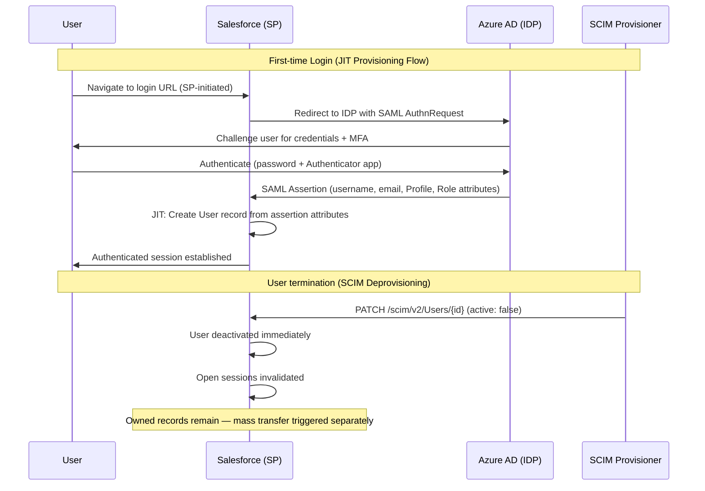
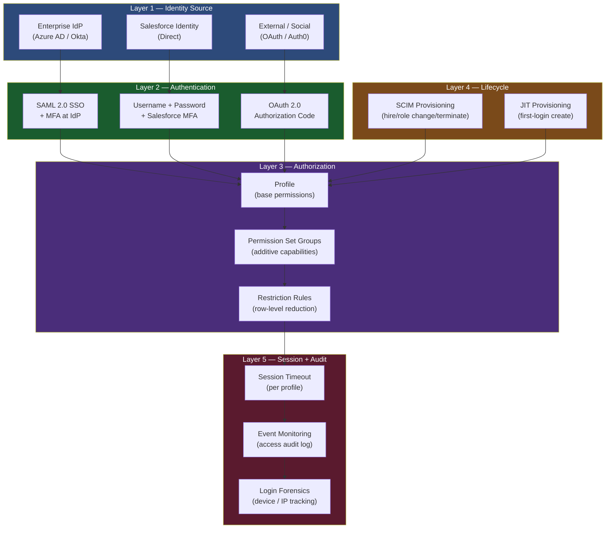
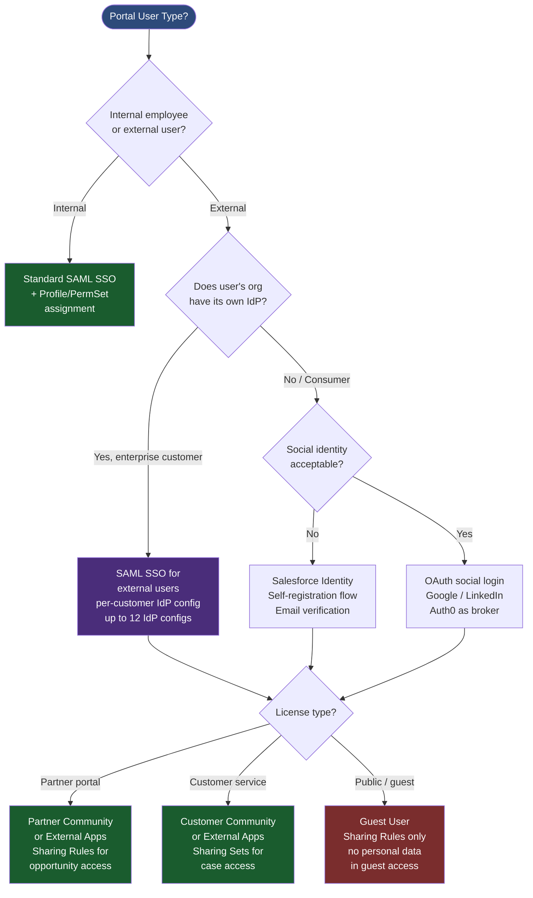

# Identity and Access Management in CTA Scenarios

## Overview

Identity and Access Management (IAM) is one of the most frequently underweighted domains in CTA board presentations. Candidates with strong integration or data architecture backgrounds often treat IAM as a checkbox — "we'll configure SSO" — and move on. The CTA panel, however, consistently uses identity scenarios to probe depth, because IAM decisions have downstream consequences for every other domain: the user object design affects sharing model performance, the SSO configuration determines session security posture, the portal identity architecture drives license cost and experience design, and the user lifecycle automation affects who can access what data when they change roles or leave the organization.

In enterprise Salesforce deployments, IAM is where the tension between organizational security policy and Salesforce platform constraints is most acute. An enterprise with a mature Zero Trust identity posture will demand things that conflict with Salesforce's session model. A healthcare organization with HIPAA obligations will require automatic session timeout, MFA on all PHI-accessible profiles, and a full audit trail of login events. A global organization with employees in 45 countries needs a federated identity architecture that can route authentication to the right identity provider per user geography without requiring users to know which IDP applies to them.

For a PTA, IAM conversations are high-stakes advisory opportunities. Most customers have an IT Security team with strong opinions about identity that were formed in the context of on-premise systems and SaaS applications that support standard SAML or OIDC flows. Salesforce has its own session model, MFA requirements, and delegated authentication quirks that conflict with enterprise assumptions in predictable ways. Understanding these conflicts in advance — and being able to explain them clearly — is a CTA-level capability.

---

## Core Framework / Approach

### The Five-Layer IAM Architecture Model

IAM decisions must be made in this order, because each layer constrains the next:

```
Layer 1 — User Identity Source (Who manages user identity?)
Layer 2 — Authentication Protocol (How do users prove who they are?)
Layer 3 — Authorization Model (What can authenticated users do?)
Layer 4 — User Lifecycle Automation (How does access change over time?)
Layer 5 — Session and Audit Controls (What happens during and after the session?)
```

---

#### Layer 1 — User Identity Source

**The fundamental question:** Is Salesforce the identity authority or a relying party?

| Identity Source | When Applicable | CTA Implication |
|----------------|----------------|-----------------|
| Salesforce-native identity | Small orgs; companies without enterprise IdP; temporary or contractor users | Users managed directly in Salesforce; no SSO; simpler architecture but less secure for enterprise |
| Enterprise IdP (SAML 2.0) | All enterprise internal users; company has Active Directory, Azure AD, Okta, Ping | Salesforce is the Service Provider (SP); enterprise IdP is the Identity Provider (IDP); users not stored in Salesforce identity |
| External Identity (Experience Cloud) | Customer portal users; partner users; community users | Registration + login managed by Experience Cloud login flows or external OAuth providers; users have Contact or Lead records in Salesforce |
| Social or Consumer Identity (OAuth) | Consumer-facing portals; B2C scenarios | Auth0, Facebook, Google as identity providers; very limited Salesforce authorization scope |

**Key IAM distinction:** Internal users (employees, contractors, agents) and external users (customers, partners) should be treated as entirely separate identity domains with different protocols, different license types, and different lifecycle processes.

---

#### Layer 2 — Authentication Protocol

**SAML 2.0 — the enterprise standard:**
- Salesforce acts as the SAML Service Provider (SP)
- Enterprise IdP (Azure AD, Okta, Ping) acts as the SAML Identity Provider (IDP)
- My Domain must be configured before SAML SSO can be enabled
- SP-Initiated SSO: user navigates to Salesforce URL → Salesforce redirects to IDP → IDP authenticates → SAML assertion returned → user logged into Salesforce
- IDP-Initiated SSO: user navigates to IDP portal → selects Salesforce app → IDP sends SAML assertion → user logged into Salesforce
- CTA relevance: SP-initiated is the more common user flow; IDP-initiated is required when users access Salesforce only through an SSO portal (intranets, enterprise app catalogs)

**SAML configuration decisions the panel will probe:**

| Decision | Options | Recommendation |
|----------|---------|----------------|
| Just-in-Time (JIT) provisioning | Enabled or disabled | Enabled for large orgs; creates Salesforce user on first SSO login; eliminates manual user creation; requires SAML assertion to include Profile/Role attributes |
| My Domain URL | Standard or enhanced domain | Enhanced domain required for modern Salesforce; affects all login URLs, org URLs, and API endpoints — deploy with a communication plan |
| SSO error handling | IdP handles or Salesforce handles | Define behavior when IDP is unreachable — can users use username/password fallback? Security policy decision. |
| MFA requirement | IDP-enforced or Salesforce-enforced | IDP-enforced MFA (Okta Verify, Authenticator app) is preferred; Salesforce MFA enforcement is a backup for users not in scope of IdP MFA |

**OAuth 2.0 — integration and API authentication:**
- Connected Apps enable OAuth flows for external systems and integrations
- Key flows: Authorization Code (user-facing apps), Client Credentials (machine-to-machine), JWT Bearer (headless server-to-server)
- CTA relevance: when scenario describes a third-party application or integration that accesses Salesforce APIs, the Connected App + OAuth flow must be specified
- Named Credentials: for Salesforce-initiated callouts to external systems, Named Credentials store the authentication details; avoid hardcoding credentials in Apex

---

#### Layer 3 — Authorization Model

Authorization in Salesforce is the intersection of Identity (who are you?) and Access Control (what can you do?). The CTA board treats these as distinct domains but expects candidates to show how they interact.

**The Salesforce authorization stack:**

```
Profile → defines object-level access (CRUD), field-level access (FLS), system permissions
Permission Sets → additive permissions on top of Profile; specific capabilities for specific roles
Permission Set Groups → bundle multiple Permission Sets; assignable as a unit
Restriction Rules → reduce visibility below what sharing rules grant; filter which records a user sees
Custom Permissions → feature flags for in-app conditional logic
```

**CTA principle on Profiles vs. Permission Sets:**
- Minimum viable profiles: the target state is one Profile per user type (Internal Standard, Internal Admin, Portal User, Guest User)
- All additive permissions via Permission Sets, organized into Permission Set Groups
- This approach supports role changes without profile reassignment (a common cause of access errors in complex orgs)
- Never proliferate profiles: organizations with 40+ profiles have an unmanageable access model

**License type → object access implications:**

| License | Key Access Characteristics | Portal/Experience Limitation |
|---------|---------------------------|------------------------------|
| Salesforce Full CRM | Access to all standard objects; unlimited custom objects | N/A |
| Salesforce Platform | Access to custom objects; limited standard objects (Accounts, Contacts) | N/A |
| Customer Community | Access to standard objects: Cases, Contacts, custom objects | Cannot access Leads, Opportunities, standard CRM objects directly |
| Customer Community Plus | Adds role-based sharing support, more object access | Can access Accounts, Opportunities with sharing rules |
| Partner Community | Access to standard sales objects; deal registration | Supports lead and opportunity management |
| External Apps | Replaces Customer/Partner Community for new implementations | Flexible object access; supports Sharing Sets and Sharing Rules |

---

#### Layer 4 — User Lifecycle Automation

User lifecycle is the CTA topic that candidates most often treat as a manual process ("IT will create users when employees join and deactivate them when they leave"). The panel probes this because manual lifecycle management is the most common source of unauthorized access in Salesforce deployments.

**The four lifecycle events that require automation:**

| Event | What Must Happen in Salesforce | Automation Mechanism |
|-------|-------------------------------|---------------------|
| Hire / onboarding | User record created; Profile + Permission Sets assigned; Role assigned; Territory assigned; License consumed | SCIM 2.0 provisioning from IdP (Okta, Azure AD); or HR system → API integration |
| Role change | Permission Set Group reassigned; Role updated; Territory reassigned; record ownership possibly transferred | SCIM attribute sync; Salesforce Flow triggered by HR system event |
| Leave of absence | User account suspended (deactivated); owned records reassigned to manager | SCIM deprovisioning; ownership transfer via Apex |
| Termination | User deactivated immediately; owned records transferred; session invalidated; audit log exported | SCIM deprovisioning; Named Credential rotation; session termination via API |

**SCIM 2.0 provisioning — when to recommend:**
- Standard for enterprise deployments with Okta, Azure AD, or Ping
- Eliminates manual user creation and deactivation
- Syncs Group membership to Salesforce Permission Set Group assignments
- CTA caveat: SCIM provisioning does not handle Salesforce-specific attributes (Role, Territory) — these typically require a hybrid approach where SCIM handles the basics and a custom integration handles Salesforce-specific assignments

**JIT Provisioning vs. SCIM:**

| Approach | When to Use | Trade-offs |
|----------|-------------|------------|
| JIT Provisioning | Users exist in IdP; create on first login; simpler setup | No pre-provisioning; user must log in once before record exists; cannot pre-assign records to user |
| SCIM Provisioning | Large orgs; HR-driven lifecycle; immediate deprovisioning required | More complex setup; requires IdP SCIM connector configuration |
| Manual | Small orgs; few users; no IdP SCIM support | Error-prone; access granted late; deactivation missed; never recommended for enterprise |

---

#### Layer 5 — Session and Audit Controls

**Session security settings the panel will probe:**

| Setting | CTA-Relevant Detail |
|---------|-------------------|
| Session timeout | Must be configured per profile for sensitive profiles (admin, healthcare, financial); 15-minute timeout for PHI-accessible profiles; standard users 2-4 hours |
| Lock sessions to IP | High-security profiles only; mobile users cannot use this |
| Trusted IP ranges | Limit Salesforce access to corporate network for admin profiles; does not apply to field/mobile users |
| Session security levels | High-assurance sessions required for specific pages (setup, data export); MFA step-up authentication for these actions |
| Connected App session policy | Restrict third-party app access to specific IP ranges; enforce refresh token rotation |

**Login Forensics and Event Monitoring:**
- Shield Event Monitoring: API to access event log files — Login, Logout, API, Report, ReportExport, ListViewExport events
- Login Forensics: Identity Verification, authentication method, source IP, device ID — available as Platform Event stream
- CTA relevance: any scenario with audit requirements (SOX, HIPAA, PCI, FedRAMP) requires Event Monitoring; "who accessed PHI field X?" is an Event Monitoring question

---

### Portal Identity Architecture — Experience Cloud

Experience Cloud portal identity has its own IAM model that is distinct from internal user identity and requires explicit treatment in CTA presentations.

**Three portal identity patterns:**

**Pattern 1 — Salesforce Identity (Self-Registration)**
- Portal users self-register; Contact record created at registration
- Password managed by Salesforce identity
- Appropriate for: B2B partner portals with known customer base; customer service portals

**Pattern 2 — Social Identity (OAuth)**
- Users authenticate with Google, LinkedIn, or other social providers
- Salesforce creates an external identity record linked to the OAuth token
- Appropriate for: B2C consumer portals where users already have social accounts

**Pattern 3 — Enterprise IdP (SAML/SSO) for External Users**
- Company's B2B customer has their own identity infrastructure; delegates authentication to their IdP
- Salesforce Experience Cloud acts as SP for the customer's IDP
- Appropriate for: large enterprise B2B customers who demand SSO; healthcare portals where patient identity is managed by a health system's IdP
- CTA complexity: each enterprise customer may have a different IdP; the architecture must support multiple IdP configurations (Salesforce supports up to 12 SSO configurations per org)

**Sharing model for portal users — the governance challenge:**
- Experience Cloud users have their own sharing model separate from internal users
- Sharing Sets: grant portal users access to records linked to their Account or Contact; suitable for Customer Community license
- Sharing Rules: grant Customer Community Plus or Partner Community users access via role-based sharing
- Guest Users: most restricted; Guest User sharing rules grant access to public-facing records only; never grant Guest User access to personal data
- CTA trap: candidates frequently forget that portal users exist in the role hierarchy and have sharing implications for internal users' record visibility

---

## PTA / SA Relevance

### Parallels to Daily Advisory Work

IAM architecture conversations are among the highest-stakes advisory conversations a PTA has with enterprise customers. The IT Security team has final approval on identity architecture, and they often have requirements that pre-date Salesforce's current capabilities. Understanding the current state — "does this customer have Okta or Azure AD? Are they enforcing MFA today? Do they have SCIM connectors already licensed?" — determines what you can realistically propose.

SCIM provisioning, in particular, is a capability that dramatically reduces post-go-live access risk but requires IT involvement that implementation teams often bypass. Advocating for SCIM configuration in the initial deployment — even if it adds two weeks to the project — is the kind of architectural recommendation that prevents the "ex-employee still has active Salesforce credentials 6 months after termination" post-mortem.

### How to Use This in Customer Engagements

**In security workshops:** Use the Five-Layer IAM model as a discovery framework. For each layer, ask: "What is your current state? What is your target state? Is there a gap?" This structured approach surfaces requirements that customers don't think to mention because they assume SSO and MFA are Salesforce defaults (they aren't, fully).

**In compliance reviews:** When a customer mentions SOX, HIPAA, or PCI, the IAM implications are immediate and specific. SOX requires separation of duties between system admins and business users — the architecture must show how Salesforce Admin permissions are segregated. HIPAA requires MFA and session timeout for PHI access. PCI requires strong authentication for any user who can access payment card data.

**In partner deployments:** Partner Community and Experience Cloud B2B deployments are where IAM complexity peaks. Each enterprise partner customer may have different IdP requirements, different data visibility requirements, and different user lifecycle processes. Designing a scalable portal IAM architecture that accommodates N enterprise customers without N custom configurations is a CTA-level architectural challenge.

---

## Architecture / Diagrams

### Enterprise SSO Architecture — SAML 2.0 with JIT Provisioning



### Five-Layer IAM Architecture



### Portal Identity Decision Tree



---

## Key Principles to Apply

1. **My Domain is a prerequisite for SSO — and a production risk.** My Domain deployment changes all Salesforce URLs and must be communicated to all users and integrated systems in advance. Deploying My Domain to production without coordination causes integration breakage and user confusion. Name this operational risk explicitly in the IAM section.

2. **Profile count should be minimized; Permission Sets are additive.** The CTA target state is one Profile per license type, with Permission Sets handling all role variation. A scenario that currently has 40 profiles is a governance problem that the architecture should address — name the principle and the migration path.

3. **SCIM provisioning is the only acceptable lifecycle mechanism for enterprise deployments.** Manual user management at scale is an organizational control failure. If a scenario describes 5,000+ users, the architecture must include automated provisioning. Name the SCIM connector for the customer's IdP (Okta SCIM, Azure AD SCIM).

4. **JIT provisioning does not cover Salesforce-specific attributes (Role, Territory, Record Types).** JIT creates the user but cannot set Salesforce-specific access attributes from the SAML assertion without custom SAML mappings or supplemental provisioning. Name this gap in the architecture.

5. **Guest User access is the highest-risk identity in the org.** Guest users are unauthenticated; they should never have access to records containing personal data. Any architecture that grants Guest User access to personal data is a data breach risk. The panel will probe this.

6. **Session timeout must be profile-specific for compliance scenarios.** Setting a global session timeout that accommodates mobile field users (2-4 hours) while meeting HIPAA requirements for PHI-access profiles (15 minutes) requires per-profile session policy configuration. Name both requirements and both policies.

7. **Event Monitoring is the audit capability — not just login history.** Login History provides basic login records. Event Monitoring provides detailed API usage, report access, record-level access patterns, and data export events. Any compliance requirement that includes "who accessed this data?" requires Event Monitoring.

---

## Common Mistakes (CTA Candidates)

1. **Treating SSO as a single-line item.** "We'll configure SSO using Azure AD" is not an IAM architecture. The panel expects: My Domain configuration, SAML vs. OAuth choice, SP vs. IDP-initiated flow, JIT vs. SCIM provisioning, MFA enforcement point, session policy, and connected app configuration for any API integrations.

2. **Ignoring portal identity entirely.** Many scenarios involve an Experience Cloud component. Candidates who design internal user identity and then say "portal users will also use SSO" without specifying how have left a major gap.

3. **Confusing Authentication and Authorization.** SSO is authentication — it verifies who you are. Profile, Permission Sets, and Sharing Rules are authorization — they determine what you can do. These are distinct architectural layers. Conflating them ("SSO gives users the right access") is a conceptual error the panel will probe.

4. **No user lifecycle design.** An architecture without a user provisioning and deprovisioning plan is missing an operational domain. The panel will ask: "How is a user deactivated when they leave the company?" If the answer is "IT will do it manually," that is not an architecture.

5. **Forgetting that portal users can affect internal sharing.** Experience Cloud users appear in the role hierarchy below the base account holder's role. This means that granting a portal user access to Account records can create sharing recalculation implications for the internal sharing model — particularly on LDV objects. Candidates who design portal identity in isolation from the sharing model miss this interaction.

---

## Practice Exercises

**Exercise 1 — SSO Architecture Design**

Design the complete SSO architecture for a 3,000-person insurance company. Known facts: IdP is Okta, all employees need Salesforce access, 500 contractors need limited access, a customer portal serves 50,000 policyholders. For each user type, specify: identity source, authentication protocol, provisioning mechanism, Profile/Permission Set strategy, session timeout.

**Exercise 2 — Compliance IAM Audit**

Given a healthcare organization with HIPAA obligations: list every IAM control that must be in place, organized by the Five-Layer model. For each control, name the Salesforce configuration that implements it.

**Exercise 3 — My Domain Risk Assessment**

A customer is planning to deploy My Domain to their production org in 30 days. They have 250 connected integrations. Identify the risks and write a My Domain deployment checklist covering: pre-deployment communication, integration impact assessment, testing in sandbox, rollout sequencing, and rollback procedure.

**Exercise 4 — Portal Identity Architecture**

Design the complete portal IAM architecture for a financial services firm offering a self-service portal to business clients. Business clients have their own IT teams and require SSO using their own corporate IdPs. There are 200 business clients, each with 5-50 users. Specify: how you handle the 200 IdP configurations (or why you don't need 200), the license strategy, the sharing model for account and case data, and the user lifecycle process.
