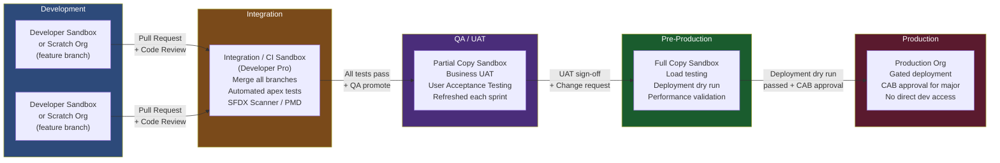
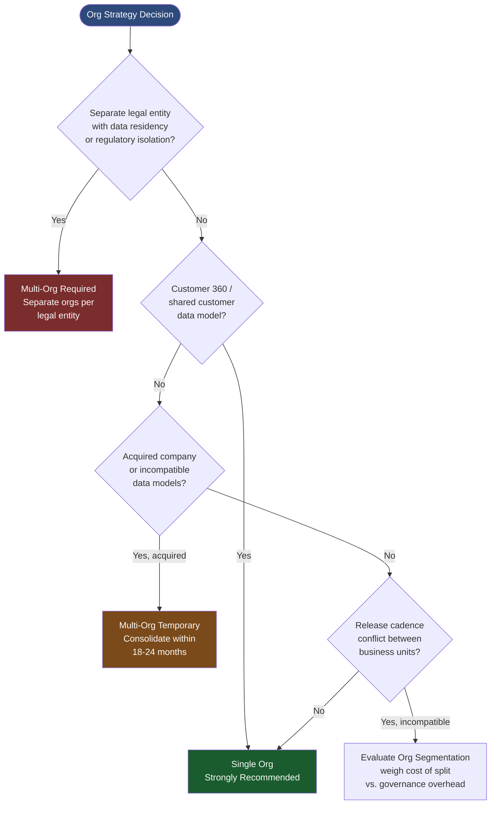
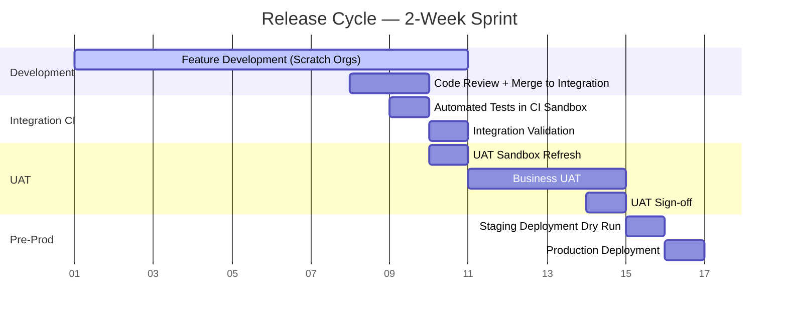

# Application Lifecycle Management in CTA Scenarios

## Overview

Application Lifecycle Management (ALM) is the CTA domain that candidates most consistently underestimate and most frequently fail to address with sufficient depth. In the context of the CTA board exam, ALM is not about knowing how to click through Deployment Manager or create a scratch org — it is about making strategic decisions regarding org strategy, environment design, release governance, and long-term extensibility. These are exactly the decisions that determine whether a Salesforce implementation remains maintainable and scalable over a 5-year horizon or accumulates technical debt that makes every future enhancement more expensive than the last.

The CTA board probes ALM because these decisions are irreversible in costly ways. An org strategy decision made at deployment — single org vs. multiple orgs, managed package vs. unmanaged metadata, SFDX-based source-driven development vs. org-based change sets — shapes the entire delivery model for years. A development environment design that was adequate for the initial team of five developers becomes a bottleneck when the program scales to thirty developers across three time zones. A release governance model that relies on one senior admin to manually deploy every change to production creates a single point of failure that eventually causes a production incident. The CTA panel is evaluating whether you understand these long-term implications and can design an ALM architecture that prevents them.

For a PTA, ALM is where strategic advisory has the highest leverage. Most customers reach out to architects when ALM is already broken — the sandbox refresh cycle is three months behind, changes are being deployed directly to production because no one can get the deployment process to work, and the development team has given up on version control. Getting ahead of ALM with a well-designed environment strategy and governance model at the start of an engagement prevents the post-go-live crisis call.

---

## Core Framework / Approach

### The Four ALM Decisions

In every CTA scenario, four ALM decisions must be made explicitly. Each has options, and the correct option is determined by the scenario's scale, team, compliance posture, and release cadence requirements.

---

#### Decision 1 — Org Strategy

**The question:** How many Salesforce orgs are required, and what is the relationship between them?

**Option A — Single Production Org**

All business processes run in one Salesforce org. This is the default recommendation for most enterprise deployments.

When to choose:
- All business processes benefit from a unified data model and shared customer record
- Customer 360 view is a primary architectural goal
- Integration cost savings from a single point of truth
- Central governance is feasible (one admin/dev team, one release process)

Risks:
- Governor limits become shared resources across all teams
- Customization from one business unit can impact another's performance
- Sandbox refresh strategy must accommodate all teams simultaneously
- Release cadence conflicts between business units (Sales wants to deploy weekly; Service needs monthly validation)

**Option B — Multiple Production Orgs**

When to choose:
- Different business units have truly incompatible data models or release cadences
- Regulatory requirements mandate data isolation between subsidiaries (legal entity separation, GDPR jurisdiction separation)
- An acquired company needs immediate Salesforce access but org consolidation is on a 2-year roadmap
- A specific product or subsidiary was already on Salesforce and the consolidation cost exceeds the benefit

CTA implications of multi-org:
- Every integration must now manage cross-org authentication (Connected App + OAuth between orgs)
- Customer 360 requires explicit cross-org data synchronization or an MDM layer
- ALM governance duplicates: two deployment pipelines, two release calendars, two sets of governance processes
- License costs potentially increase (no license sharing across orgs)

**Option C — Org Segmentation by Function (Service Org, Sales Org)**

A specific variant of multi-org where different Salesforce clouds are deployed in separate orgs due to licensing, acquisition, or functional separation. Increasingly rare with modern Salesforce but still present in scenarios involving acquired companies or legacy multi-org estates.

**CTA recommendation framework:**

```
If any of these are true → Multi-Org may be justified:
  ✓ Legal entity with separate data residency requirement
  ✓ Acquired company (temp isolation pre-consolidation)
  ✓ Business units with incompatible data models that cannot be schema-reconciled
  ✓ Regulatory mandate for data isolation (financial services regulated entities)

If all of these are true → Single Org is recommended:
  ✓ Customer 360 is a stated goal
  ✓ Shared customer, account, or product data
  ✓ Central IT governance and release process feasible
  ✓ No legal entity data isolation requirement
```

---

#### Decision 2 — Development and Packaging Model

**The question:** How is customization developed, version-controlled, and packaged for deployment?

**Option A — Org-Based Development + Change Sets**

Traditional approach: developers work directly in a sandbox, changes tracked in Change Sets, deployed via Deployment Manager.

Viable when:
- Small team (1-3 developers)
- Low-complexity customization (primarily configuration, declarative)
- No CI/CD requirement
- Salesforce Professional Edition or Essentials (no Metadata API full access)

Limitations at CTA scale:
- Change Sets do not track developer identity
- Merge conflicts are impossible to resolve — last deployment wins
- No automated testing integration
- Impossible to reconstruct what exactly changed between releases
- Does not support scratch orgs or second-generation packaging

**Option B — Source-Driven Development (SFDX)**

Salesforce DX model: metadata stored in version control (Git), scratch orgs for development, CI/CD pipeline for automated deployment.

Recommended for:
- Teams of 4+ developers
- CI/CD requirement
- Managed Package development (ISV or internal reusable components)
- Complex customization with regular releases

SFDX components the CTA architecture must specify:
- Version control system (GitHub, Azure DevOps, GitLab)
- CI/CD tool (GitHub Actions, Azure Pipelines, Jenkins, Copado, Gearset)
- Developer workspace strategy (scratch orgs vs. sandboxes)
- Org shape definition (scratch org definition file with features and settings)

**Option C — Second-Generation Managed Package (2GP)**

For ISV products or internal reusable components that must be deployed across multiple orgs.
- Metadata grouped in namespaced packages
- Version-locked: installing a specific package version is auditable and repeatable
- Upgrade management: major/minor/patch version semantics
- Dependency management: packages can declare dependencies on other packages

CTA relevance: if the scenario involves an ISV, a product that will be deployed to 100+ customer orgs, or a shared component platform for a multi-org enterprise, 2GP is the correct model. Name it explicitly with the justification.

---

#### Decision 3 — Environment Strategy

**The question:** What sandboxes are required, for what purpose, and at what tier?

**Sandbox types the CTA must know cold:**

| Sandbox Type | Data | Configuration | Refresh Interval | Purpose |
|--------------|------|---------------|-----------------|---------|
| Developer | No data | No config copy | Daily | Individual feature development; scratch org alternative |
| Developer Pro | No data | No config copy | Daily | Larger metadata sets; integrations with external systems |
| Partial Copy | Sample of production data (10K records max per object) | Full config copy | 5 days | UAT; realistic data shapes for testing |
| Full Copy | Full copy of production data | Full config copy | 29 days | Load testing; pre-production validation; cutover rehearsal |

**Minimum viable environment strategy for enterprise:**

```
DEV sandboxes (Developer or Developer Pro):
  - One per active developer (or feature branch / scratch org)
  - Short-lived; frequent refresh
  - Purpose: isolated feature development

Integration / QA sandbox (Developer Pro or Partial Copy):
  - Continuously deployed from CI/CD pipeline
  - All in-flight changes merged here first
  - Purpose: integration testing; catch merge conflicts; automated test suite

UAT sandbox (Partial Copy):
  - Refreshed from production every sprint
  - Business users perform acceptance testing here
  - No developer access post-release candidate creation
  - Purpose: business validation before production deployment

Staging / Pre-Prod sandbox (Full Copy):
  - Infrequent refresh (monthly)
  - Mirror of production configuration and data volume
  - Performance testing; deployment dry runs; go-live rehearsals
  - Purpose: final validation gate before production deployment

Production
  - Gated deployment: only through approved CI/CD pipeline
  - No direct developer access (enforced by Role Hierarchy + Permission Sets)
  - Purpose: live business system
```

**CTA ALM rule:** A production deployment without a pre-production validation environment is an unacceptable architecture. Any scenario that describes direct-to-production deployments requires a recommendation to add a proper staging environment.

---

#### Decision 4 — Release Governance

**The question:** How does a change flow from developer to production, and who approves it at each stage?

**The Release Train Model:**

For organizations with multiple teams and competing deployment needs, the Release Train is the standard governance model:

```
Cadence: Fixed release window (e.g., bi-weekly)
Work in Progress: Feature branches developed independently
Feature Flag Gate: Features toggled off at deployment; enabled after validation
Code Review: Pull Request review by senior developer or architect before merge
Automated Testing Gate: CI must pass all apex tests, coverage >75%, zero test failures
UAT Sign-Off: Named business user signs off on each feature in UAT
Change Advisory Board (CAB): For major releases, CAB reviews risk and approves production deployment
Deployment: Automated pipeline to production; manual deployment requires CAB exception
Rollback: Defined rollback procedure for each release; tested in staging
```

**Key governance controls the CTA panel will ask about:**

| Control | Why It Matters | Salesforce Implementation |
|---------|---------------|--------------------------|
| Separation of duties | Admin who builds feature should not approve own deployment | Approval process in Copado or Azure Pipelines; separate deploy role |
| Test coverage gate | Prevents deployments that break existing functionality | CI requires 75% coverage; Apex test run must be green |
| Rollback procedure | Production incidents require rapid rollback capability | Defined rollback deployment package; change set containing prior metadata version |
| Environment parity | Staging should match production to prevent environment-specific bugs | Full Copy sandbox; data masking for sensitive fields |
| Metadata audit | Track who deployed what, when, and why | Git commit history; Copado deployment log; Salesforce Setup Audit Trail |

---

### Package Management and Dependency Architecture

**Managed vs. Unmanaged Packages — CTA Decision:**

| Attribute | Managed Package | Unmanaged Package |
|-----------|----------------|------------------|
| Source code visible? | No | Yes |
| Upgradeable? | Yes — subscriber installs new version | No — requires reinstallation |
| Namespace | Required | Optional |
| Use case | ISV products; locked-down internal platforms | Code sharing; templates; starter kits |
| IP protection | Yes | No |
| CTA recommendation | When component will be distributed or needs controlled upgrade lifecycle | When source access needed; one-time deployment |

**ISV vs. Enterprise 2GP — when the scenario describes an ISV or a platform:**
- ISV: separate packaging org (DEV HUB or packaging org); scratch orgs for development; AppExchange submission
- Internal platform team: Dev Hub in enterprise org; internal packages across business unit sandboxes; version governance

---

### Technical Debt and Refactoring Architecture

CTA scenarios frequently describe orgs with accumulated technical debt: 200 custom fields, 40+ profiles, trigger proliferation, hardcoded IDs in Apex, no trigger framework. The CTA presentation must address how this is resolved without breaking production.

**The technical debt remediation pattern:**

```
Phase 1 — Audit and Classification
  Run dependency analysis (SFDX Scanner, code review)
  Classify: active use, unused, dormant, high-risk
  Priority: unused code scheduled for deletion; high-risk code scheduled for refactoring

Phase 2 — Safe Refactoring (in parallel with new development)
  Establish trigger framework (one trigger per object, handler class pattern)
  Replace hardcoded IDs with Custom Metadata Types or Custom Settings
  Consolidate profiles to minimum viable set + Permission Sets
  Delete confirmed-unused fields and code (requires sandbox validation)

Phase 3 — Governance Controls (prevent re-accumulation)
  Code review required for all Apex changes
  Automated SFDX Scanner in CI pipeline (PMD, ESLint)
  Monthly unused code audit
  Architecture review required for new custom objects
```

---

## PTA / SA Relevance

### Parallels to Daily Advisory Work

The ALM decisions in this framework map directly to the conversations a PTA has in technical program reviews. When a customer's SI partner is proposing "change sets to production," the PTA role is to advocate for source-driven development and a proper CI/CD pipeline — not because it's trendy, but because the customer's future ability to maintain, extend, and audit their Salesforce implementation depends on it.

The environment strategy conversation — specifically the Partial Copy and Full Copy sandbox question — is one where PTA guidance has direct budget impact. Partial Copy and Full Copy sandboxes have additional license cost; customers often skip them to save budget. The consequence is testing in a Developer sandbox with no production data shape, and then discovering performance problems on go-live day when real data volumes expose query patterns that never appeared in testing. Making this case proactively — "the Full Copy sandbox cost is 5% of your total licensing; a go-live failure costs 20% in emergency support, business disruption, and reputation damage" — is PTA-level advisory.

### How to Use This in Customer Engagements

**In technical discovery:** The four ALM questions should appear in every technical discovery. "How many developers are on your team? What is your release cadence? Do you have version control? What sandbox types do you currently use?" These questions establish the maturity baseline and identify the ALM gaps to address.

**In governance workshops:** The Release Train model is a high-value deliverable for customers with multiple development teams. Walking a customer through the concepts of feature branching, CI/CD gates, and CAB approval processes — and then mapping these to Copado or Gearset workflows — positions the PTA as an ALM advisor beyond product configuration.

**In escalations:** ALM failures are almost always involved in production incidents. When a customer has a P1 incident caused by a bad deployment, the first question is "what was the change, who made it, and why wasn't it caught in testing?" Without a proper ALM pipeline, none of these questions have a clean answer. Post-incident, the PTA advisory is to implement the ALM controls that would have prevented the incident — but pre-incident advisory that installs those controls first is more valuable.

---

## Architecture / Diagrams

### Enterprise ALM Pipeline



### Org Strategy Decision Matrix



### Sandbox Refresh and Release Cadence



---

## Key Principles to Apply

1. **Org strategy is irreversible in the short term.** Merging two Salesforce orgs is a multi-year, multi-million-dollar program. Getting the org strategy right at the start is the single highest-leverage ALM decision. The CTA panel expects a clear justification for single vs. multi-org, not just a statement.

2. **Change Sets are not acceptable for enterprise ALM.** Any enterprise scenario with more than 3 developers, a CI/CD requirement, or a need for audit traceability requires SFDX-based source-driven development. Recommending Change Sets for an enterprise deployment is a red flag for the panel.

3. **Every production deployment requires a pre-production validation environment.** This is non-negotiable. A staging environment that mirrors production configuration and data volume is the final quality gate. Without it, production incidents from deployment errors are inevitable.

4. **Test coverage is a floor, not a target.** Apex test coverage of 75% is the Salesforce minimum for deployment. CTA architectures recommend higher — 85-90% — because 75% coverage can mask entire code paths. Automated test runs in CI are mandatory.

5. **Technical debt must be actively managed, not just acknowledged.** A scenario that describes an existing org with technical debt requires an explicit remediation plan in the architecture. "We'll address technical debt over time" is not an architecture. The refactoring pattern — audit, classify, refactor, govern — is a deliverable.

6. **Separation of duties in ALM is a compliance requirement, not an option.** For SOX-regulated customers, the developer who writes code cannot also be the person who deploys it to production. This architectural control must be explicitly named and implemented through CI/CD pipeline approval gates.

7. **SFDX Scanner and code quality gates are architectural components.** Automated static analysis (PMD for Apex, ESLint for LWC) in the CI pipeline prevents technical debt accumulation. Name the specific tools in the architecture.

---

## Common Mistakes (CTA Candidates)

1. **Skipping ALM entirely or treating it as an implementation detail.** "We'll use standard Salesforce deployment practices" is not an ALM architecture. The panel will ask follow-up questions about org strategy, environment design, and release governance — and a candidate who hasn't addressed these will have no answers.

2. **Recommending Change Sets for an enterprise deployment.** Change Sets were designed for small teams making infrequent configuration changes. Recommending them for a 20-developer team on a complex CRM implementation signals unfamiliarity with modern ALM practices.

3. **Ignoring org strategy when the scenario has multiple business units or acquired companies.** Candidates assume "one company = one Salesforce org." The panel may be deliberately testing whether you recognize when a multi-org or phased consolidation strategy is warranted.

4. **No environment strategy detail.** "We'll use sandboxes for testing" is not an environment strategy. The architecture must specify sandbox types, refresh cadence, purpose per environment, and who has access to each.

5. **Missing the technical debt implication.** When a scenario describes an existing Salesforce org with 200+ custom objects, multiple conflicting trigger implementations, or "40 profiles covering 200 users," the ALM architecture must address how this debt is managed. Ignoring it means the future-state architecture will immediately inherit the debt.

6. **No rollback procedure for production deployments.** The panel will ask "what happens if this deployment fails?" The answer must include: how quickly can you detect the failure, what is the rollback mechanism, how long does rollback take, and what is the communication plan.

---

## Practice Exercises

**Exercise 1 — Org Strategy Decision**

Scenario: A global manufacturing company has three Salesforce orgs acquired through three acquisitions over five years. They want a unified customer view. Business unit A is APAC, heavily customized for Japanese regulatory requirements. Business unit B is EU, with GDPR obligations and an EU data residency requirement. Business unit C is US, the largest deployment with 15,000 users. Design the org strategy and consolidation roadmap.

**Exercise 2 — Environment Design**

Design the complete environment strategy for a 30-developer team building a complex Sales + Service + Experience Cloud deployment. Include: number and type of each sandbox, refresh cadence, access controls per environment, CI/CD tooling recommendation, and what gate must pass before promotion from each environment to the next.

**Exercise 3 — Release Governance Design**

A customer has experienced three production incidents in six months caused by unvetted deployments. Design the release governance model that would have prevented each incident. The customer has 8 developers, a weekly release cadence, and is currently using Change Sets. Design the transition from Change Sets to SFDX + CI/CD, including the intermediate state where both approaches coexist.

**Exercise 4 — Technical Debt Audit**

Given a Salesforce org with: 47 Apex triggers (multiple per object), no test classes for 23 of them, 58 profiles, 2,000 custom fields across all objects, 15 hardcoded org IDs in Apex, and no version control. Design the technical debt remediation program. Include: assessment approach, priority order, which items can be done in parallel, risks to production during remediation, and governance controls to prevent re-accumulation.
