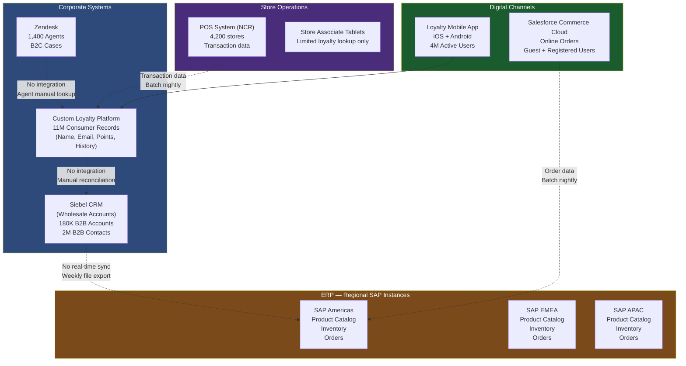
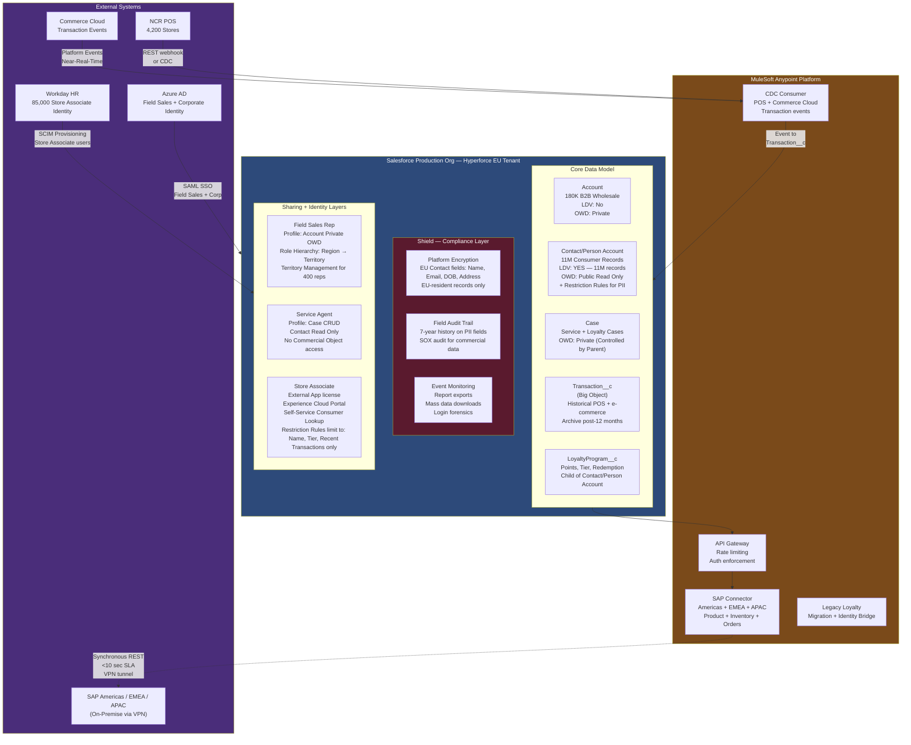

# Retail Enterprise Scenario

## Business Background

RetailGlobal is a specialty apparel and lifestyle retailer with operations in 38 countries, 4,200 retail store locations, and an e-commerce platform generating $8.2B in annual revenue. The company employs 85,000 retail associates and 2,800 corporate staff, including 400 field sales representatives who manage wholesale accounts with regional department stores and specialty retailers.

The company is currently running a fragmented technology stack: a 12-year-old Oracle Siebel CRM for wholesale account management, a custom-built customer loyalty platform managing 11 million consumer records, and three regional instances of SAP (Americas, EMEA, APAC) for product catalog, inventory, and order management. Customer service for retail consumers is managed through a separate Zendesk instance with 1,400 agents globally. The e-commerce platform (Salesforce Commerce Cloud, existing) captures online transactions but does not write customer interaction data back to any CRM.

The business is initiating a "One Customer" program — a strategic initiative to create a unified customer record across wholesale B2B accounts and B2C consumer profiles, consolidate customer service into a single platform, enable store associates to access customer history and loyalty information at point of sale, and give field sales representatives a 360-degree view of their wholesale accounts including recent consumer activity at retail locations. The company has an 18-month delivery window tied to a major board commitment and a $45M transformation budget.

---

## Current Architecture

---

## Requirements

1. **Data Architecture:** Migrate all 180K wholesale Accounts, 2M wholesale Contacts, and 11 million consumer records into Salesforce. Consumer records are a mix of registered loyalty members and guest shoppers — some records have email only, some have full PII, some are duplicates across the loyalty platform and Zendesk. The architecture must produce a single deduplicated customer record for each unique individual, mapped to the correct Account (for B2B) or as a standalone Contact/Person Account (for B2C consumers). Existing loyalty point balances and transaction history must migrate.

2. **Security and Sharing:** Field sales representatives (400 users) should only see wholesale Accounts they own and their direct team's accounts. Regional managers see all accounts in their geography. Service agents (1,400 users) should see any consumer's case and profile but only data relevant to service (no wholesale commercial data). Store associates (85,000 users) need read-only access to a consumer's name, loyalty tier, and recent purchase history — no other data. All consumer PII must be protected under GDPR for EU records (approximately 4.5 million of the 11 million consumers are EU residents).

3. **Integration:** Real-time product availability lookup for field sales representatives viewing wholesale accounts (SAP inventory). Order entry from Salesforce must write back to SAP as a confirmed wholesale order within a 10-second SLA. The three regional SAP instances must all be accessible from Salesforce. E-commerce and POS transaction data must appear in the consumer's Salesforce record within 15 minutes of transaction completion (near-real-time, not batch).

4. **Identity and Access:** 85,000 store associates will log into a Salesforce Experience Cloud portal using their existing store employee credentials managed in the company's HR system (Workday). Field sales, managers, and corporate staff are in Azure AD and require SAML SSO. The 11 million loyalty consumers have existing usernames and passwords in the legacy loyalty platform — the migration must preserve their ability to log into the new consumer portal without resetting their password.

5. **Application Lifecycle Management:** The "One Customer" program will be delivered in three phases over 18 months by a team of 40 developers across three time zones (US, UK, India). The existing Salesforce Commerce Cloud org must not be disrupted — it is a revenue-critical system processing $8.2B annually. The retail org uses Managed Packages from three independent ISVs for store operations integrations. A governance model must ensure that the 40-developer team can release without interfering with Commerce Cloud operations.

6. **Performance and Scalability:** With 85,000 store associate portal users and 11 million consumer records, the architecture must be able to sustain concurrent sessions for up to 15,000 store associates during peak retail periods (Black Friday, holiday season) while maintaining a sub-2-second page load for the customer lookup that associates perform at point of sale.

---

## Constraints

- All EU consumer data must reside in EU data centers (Hyperforce EU tenant required or separate EU org)
- SAP systems are on-premise; no SAP API modernization is in scope for this project
- The Salesforce Commerce Cloud org is production-critical and cannot be included in the new org — it must remain separate
- Budget: $45M total; SI partner already selected; Salesforce licensing already negotiated (Sales Cloud, Service Cloud, Experience Cloud, MuleSoft, Shield)
- Timeline: 18 months to full production; 6-month checkpoint for board review
- The company has 3 existing Salesforce ISV managed packages that must be retained; all are on AppExchange but two are older versions with no update path
- Field sales reps are on mobile devices with inconsistent network connectivity in international markets

---

## Sample Solution Architecture

---

## Recommended Approach

### Data Architecture

The 11 million consumer records constitute the most complex data architecture challenge. Person Accounts are the correct object model when a single record must represent both B2C consumer identity (loyalty member, customer) and have Case and Activity relationships. Standard Contact alone cannot carry the commercial relationship and transactional history at this scale while remaining searchable for associates. The 11M Person Account records exceed the LDV threshold; OWD is set to Public Read Only for Person Accounts, with Restriction Rules applied via Permission Sets for the Store Associate profile — associates can only see records assigned to their store's geographic territory through a Restriction Rule filter on the Store_Location__c field.

Historical transaction data (POS and e-commerce) post-12 months is archived to a custom Big Object (Transaction__c). This keeps the live transactional object below 50M records while preserving 7+ years of history for loyalty calculations and compliance. Since this data is not GDPR-scoped personal data (it is purchase history, not contact information), Big Objects are acceptable for archival here — critically, the GDPR-scoped fields (Name, Email, DOB) remain in the standard Person Account record where they are deletable.

B2B Account and Contact objects (180K, 2M) are below LDV thresholds and use standard Private OWD with Role Hierarchy sharing for the wholesale sales team.

### Security and Sharing

The multi-audience sharing model is the most complex element. Three completely separate user populations need Salesforce access with zero data bleed between them:

- Field sales reps see wholesale Accounts (Private OWD, role hierarchy) and no consumer data
- Service agents see Cases and Consumer records but no commercial wholesale data (Profile-based object permissions — no Account CRUD, no Opportunity access)
- Store associates see only a consumer's name, loyalty tier, and recent 90-day transactions (Restriction Rules on Person Account, scoped to fields only relevant to in-store service)

Restriction Rules enforce the store associate limitation — rather than creating a custom object for the associate view, Restriction Rules filter what records and fields the associate profile can see, eliminating the need for separate object/data synchronization.

### Integration

The SAP integration is the highest-risk integration component. Three on-premise SAP instances, a 10-second write-back SLA, and a real-time product availability requirement via inconsistent mobile connectivity are a combination that requires careful design. MuleSoft acts as the intermediary for all SAP connections: (1) a synchronous REST API exposed by MuleSoft to Salesforce for product availability lookup (MuleSoft → SAP RFC call, response cached 5 minutes for performance); (2) an order write-back flow from Salesforce via MuleSoft Platform Event → MuleSoft order creation API → SAP BAPI — the 10-second SLA is met by an asynchronous pattern where Salesforce immediately shows "Order Pending" status and a Platform Event updates the record to "Order Confirmed" when SAP responds.

For mobile field reps with inconsistent connectivity, Salesforce Mobile App with offline-first capability (Briefcase) caches the rep's account and product data locally; order entry is queued offline and submitted when connectivity is restored.

POS and e-commerce transaction events are published to MuleSoft as webhooks, transformed to Platform Events, and consumed by Salesforce Flows that create/update Transaction__c records in near-real-time (target: 15 minutes from transaction to Salesforce update).

### Identity and Access

85,000 store associates present the largest identity challenge — this is Experience Cloud at significant scale. Workday SCIM provisioning creates and deactivates Experience Cloud External App user records as associates join and leave stores. The loyalty consumer identity migration uses a custom identity bridge: during migration, each consumer record receives a hashed token from the legacy platform that maps to their legacy password credential; the consumer portal offers a one-time "confirm your account" flow that validates against the legacy hash without requiring a password reset.

### Application Lifecycle Management

A single Production Org with Hyperforce EU tenant satisfies data residency. Commerce Cloud remains a separate org. The 40-developer team requires SFDX-based development with four environment tiers: feature sandboxes (Developer Pro per developer), a continuous integration sandbox (Developer Pro, auto-deployed by CI), a UAT/Partial Copy sandbox (refreshed bi-weekly), and a Full Copy pre-production sandbox for load testing. Release cadence is bi-weekly. Commerce Cloud APIs are governed by a separate integration team; a contract-first API governance model ensures that changes to shared APIs follow a versioning protocol.

---

## Key Trade-offs to Discuss

**Trade-off 1 — Person Accounts vs. Contacts for Consumer Records**

Person Accounts unify the consumer identity with all standard Salesforce capabilities (Cases, Activities, Opportunity linkage for future B2B2C scenarios) but have limitations: cannot convert to standard Account/Contact model post-deployment, and Person Account records count against standard account sharing limits. Alternative: use standard Contact with a custom Consumer Profile object as a child. This preserves the Account/Contact model but adds object complexity and eliminates standard Case management via Contact. Decision: Person Accounts, because the business requirement for consumer-facing service (Cases) and future B2B2C analytics is more important than the theoretical conversion flexibility.

**Trade-off 2 — EU Data Residency: Hyperforce EU Tenant vs. Separate EU Org**

Hyperforce EU tenant with a single org keeps architecture simpler — no cross-org data sync, unified reporting, single governance model. Risk: Hyperforce EU tenant is a product configuration, not a separate regulatory boundary; some legal interpretations of GDPR may require a physically separate org. Separate EU org creates a permanent cross-org integration overhead. Decision: Hyperforce EU tenant with contractual data residency commitment from Salesforce, with a fallback plan documented for separate EU org if legal review requires it. This is explicitly stated as an assumption requiring legal validation.

**Trade-off 3 — SAP Order Write-Back: Synchronous vs. Asynchronous**

Synchronous order write-back within 10 seconds requires a VPN-quality connection to SAP at all times — a single SAP downtime event causes Salesforce order entry to fail entirely. Asynchronous write-back (Platform Event → MuleSoft queue → SAP) reduces Salesforce-to-SAP coupling at the cost of an intermediate "pending" state that field reps and customers see. Decision: asynchronous pattern with Platform Event-driven status update; the business requirement for resilience outweighs the desire for synchronous confirmation.

**Trade-off 4 — Big Objects for Transaction History vs. External Data Archive**

Big Objects keep transaction history in Salesforce, accessible via SOQL (with limitations), and visible in page layouts. External archive (e.g., S3 + Tableau CRM) provides more analytical flexibility but breaks the "single platform" goal and requires an additional tool. Decision: Big Objects for 12-month archive tier; records older than 12 months exported to AWS S3 + Tableau CRM dataset for historical analytics. This two-tier approach balances Salesforce storage costs with operational query needs.

---

## Common Candidate Mistakes

1. **Using standard Contacts instead of Person Accounts for the consumer population.** Contacts in Salesforce must be associated with an Account. 11 million standalone B2C consumers without a corporate Account affiliation are awkward to model as Contacts — they require either a dummy "Individual" Account (anti-pattern, creates 11M spurious Account records) or Person Accounts. Candidates who reach for standard Contact without addressing this reveal that they haven't worked with large B2C populations in Salesforce.

2. **Ignoring the GDPR vs. Big Objects conflict.** A candidate who hears "11M consumer records, GDPR, 7-year retention" and immediately proposes Big Objects for archiving has made a critical error. GDPR right to erasure cannot be satisfied with Big Objects. The architecture must keep GDPR-scoped personal data in standard objects (with deletable records) and archive only non-personal or anonymized transactional data to Big Objects.

3. **Not accounting for the 85,000 concurrent user scale.** Experience Cloud portal performance at 85,000 users during peak periods requires explicit architectural treatment: static resource caching, CDN for asset delivery, Visualforce/LWC page complexity limits, and sharing set design that avoids excessive sharing recalculation. A candidate who says "Experience Cloud for store associates" without addressing scale is missing a critical NFR.

4. **Proposing direct SAP integration without MuleSoft.** The scenario explicitly states MuleSoft is licensed. Direct Salesforce-to-SAP connection (SAP connector for Salesforce) bypasses the corporate integration platform and creates a point-to-point dependency that the enterprise integration team will object to. The architecture should use MuleSoft as the integration hub for all SAP connections.

5. **Missing the store associate identity at scale.** "85,000 store associates will log in via Azure AD" is wrong — store associates are managed in Workday (the HR system), not Azure AD (the corporate IdP for office workers). These are two different user populations with two different identity management systems. Conflating them signals a candidate who read the scenario too quickly.

---

## Panel Q&A Preparation

**Q1: "You've proposed Person Accounts for 11 million consumer records. When the business decides to add a B2B component for their wholesale relationship with a specific retailer who is also a loyalty consumer, how does your data model handle someone who is both a B2C consumer and a B2B Account contact?"**

Sample Answer: "This is a real tension in the Person Account model. A loyalty consumer who is also a business contact cannot simultaneously be a Person Account and a Contact on a B2B Account. The recommended approach is to create a Contact record on the B2B Account and establish a lookup relationship between the Contact and their Person Account consumer record through a custom junction. This preserves the B2B relationship on the Account and the consumer loyalty data on the Person Account. For the approximately 50-100K individuals who are likely to have this dual relationship, the data model complexity is justified. Alternatively, if the board anticipates significant B2B2C scale, we should evaluate Salesforce Data Cloud as the unified identity layer — Data Cloud can unify Person Account and Contact records as a single consumer profile without requiring the underlying data model to change."

**Q2: "Your synchronous SAP product availability lookup via MuleSoft targets sub-3-second response. The SAP systems are on-premise with VPN latency. What's your actual latency budget breakdown and what happens when SAP is slow?"**

Sample Answer: "The latency budget is: Salesforce → MuleSoft ~200ms, MuleSoft → VPN → SAP ~500-800ms, SAP processing ~300-500ms, response path ~500ms — total approximately 1.5-2 seconds in normal conditions. The 3-second target gives headroom. The critical design element is a 5-minute cache at MuleSoft for product availability data — the vast majority of lookups hit the cache, not SAP live. For cache misses, a graceful degradation: if the SAP call exceeds 3 seconds, the UI shows a 'Availability data temporarily unavailable' message rather than blocking the rep's workflow. The rep can still enter the order; it goes into a pending queue. This is preferable to blocking the rep's session entirely during a SAP slow period."

**Q3: "The 11 million consumer record migration — you described a deduplication approach, but you haven't quantified the duplication rate or described the matching logic. How do you deduplicate a record that exists in the loyalty platform, Zendesk, and Commerce Cloud as three different records?"**

Sample Answer: "The first step is a data profiling exercise across all three sources to quantify duplication. Based on industry norms for multi-channel retailers, I'd estimate 15-25% cross-system duplication. The matching logic is: exact email match as the primary identifier (most reliable), with fuzzy name + address match as secondary for records without email. Records from Zendesk will have Case history but incomplete profile data — these are matched to loyalty records by email and merged, with Case history migrated to the Salesforce Case object. Records from Commerce Cloud are primarily transactional; guest checkout records without email are loaded as anonymous transaction records without a Contact/Person Account linkage. The deduplication tooling — I'd recommend Informatica or Reltio — runs before any load. Post-migration, Duplicate Rules with email-based exact matching prevent new duplicates from SSO registration and portal self-service."

**Q4: "You mentioned Hyperforce EU tenant for GDPR compliance. Can you explain specifically which GDPR articles Hyperforce satisfies and which ones it does not?"**

Sample Answer: "Hyperforce data residency satisfies Article 44-49 regarding transfer of personal data to third countries — specifically, by ensuring EU personal data is stored and processed in EU data centers, we address the data transfer restriction for EU residents' data. Hyperforce does not by itself satisfy Article 17 (right to erasure) — that requires the application to support deletion of individual records, which standard Salesforce does. It does not satisfy Article 15 (right of access) — Privacy Center addresses that with automated data subject access request fulfillment. It does not satisfy Article 25 (privacy by design) — that requires our application architecture decisions, like minimum necessary access and Shield encryption. My assumption was that Hyperforce addresses data residency; the remaining GDPR articles require application-level controls, which I've addressed in the Shield components and sharing model."

**Q5: "What if the business decides, six months into the project, that they want to give franchise operators access to all consumer activity at their franchise stores — not just lookup, but operational management? How does your architecture adapt?"**

Sample Answer: "This is actually the scenario I'd flag as a future requirement risk during architecture review. The current store associate model — Experience Cloud, External App license, Restriction Rules for read-only access — supports lookup only. Expanding to operational management (creating cases, updating loyalty records, managing store events) would require moving franchise operators from External App license to a more capable license type, likely Customer Community Plus or a Salesforce platform license. The sharing model would need extension: instead of Restriction Rules limiting visibility to store territory, we'd add object-level CRUD permissions for operational objects. The architecture can accommodate this — the Experience Cloud site structure and the Person Account model support this expansion — but it requires a license cost re-evaluation and a new profile/permission set design for the franchise operator user type. I'd scope this as a Phase 3 initiative in the roadmap."

**Q6: "Your deployment strategy has 40 developers across three time zones. How do you prevent two teams from deploying conflicting changes to the same metadata component?"**

Sample Answer: "This is managed at the version control level through branch-based development and enforced merge policies. Each developer works on a named feature branch. The CI/CD pipeline runs automated conflict detection when a pull request targets the integration branch — conflicting changes to the same component are flagged before merge, not discovered at deployment time. The integration branch is the source of truth; feature branches must be rebased against it before merge approval. For high-contention components — typically the primary trigger framework files, the master flow for consumer record creation, and any shared utility classes — we designate a component owner who reviews all PRs touching those files. We also use a metadata dependency scanner (Salesforce DX built-in) to identify components that are touched by multiple in-flight branches and escalate these to architecture review before both branches attempt to merge in the same sprint."

**Q7: "The board has given you 18 months. You're now at month 12 and Phase 2 (consumer migration) is three months behind. What do you cut, defer, or restructure to still deliver board value by month 18?"**

Sample Answer: "First, I'd distinguish between deliverables that affect the board narrative and deliverables that are operational. The board committed to 'One Customer' — I'd protect: the unified 360 view for field sales reps (wholesale + consumer activity), the consolidated service agent experience, and the consumer portal for loyalty members. What I'd defer: the full historical transaction migration (Phase 1 historical load is done; defer the remaining 7-year transaction archive to Phase 4); the Workday SCIM provisioning automation (switch to manual provisioning with IT support as interim); the full Big Object archiving strategy (keep recent transactions in the main object temporarily). I'd also break consumer migration into a 'Priority Market' release — migrate EU and US consumers first (80% of loyalty value), defer APAC consumer migration to Phase 4 with a bridge API keeping the legacy platform active for APAC. This gets the board's core narrative — 'One Customer' platform live — while deferring operational completeness to the next phase."
