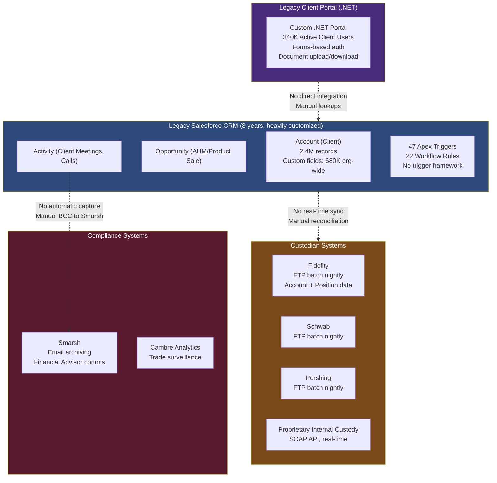
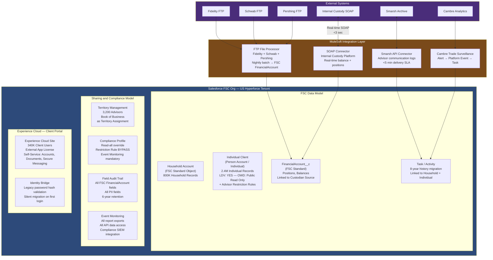

# Financial Services Enterprise Scenario

## Business Background

NorthStar Capital is a wealth management and retail banking firm with $180B in assets under management, 2.4 million retail banking clients, 85,000 high-net-worth wealth management clients, and 3,200 financial advisors across 280 branch offices in the US and Canada. The firm is a registered investment advisor (RIA) and broker-dealer, subject to FINRA, SEC, and OCC regulatory oversight, with strict requirements for client data protection, communication record-keeping, and audit trail completeness.

The company is deploying Salesforce Financial Services Cloud (FSC) to replace its legacy Salesforce CRM (standard Sales Cloud, heavily customized over 8 years) and a separate client portal built on a custom .NET stack. The objectives are: a unified client-advisor relationship model using FSC's Household and Relationship objects, integrated financial account data from four custodian systems (Fidelity, Schwab, Pershing, and a proprietary internal custody platform), a compliant client communication system that satisfies FINRA Rule 4511 (communication record retention), and a mobile advisor experience for the 3,200 field advisors.

The current Salesforce org has been in production for 8 years and contains 680,000 custom fields, 47 Apex triggers (several overlapping), 22 workflow rules that need migration to Flow, and no version control. The legacy client portal serves 340,000 active client users today and the migration must preserve their login credentials and session continuity.

---

## Current Architecture

---

## Requirements

1. **Data Architecture:** Migrate all 2.4M client records (Account), all associated Contacts, Activities, and Opportunities into the new FSC data model — specifically, map existing Accounts to FSC Household and Individual Client objects. The migration must maintain 8 years of activity history (Activity, Tasks) and opportunity history. 680K custom fields in the current org must be rationalized — the architecture must include a field usage assessment and a target field count reduction. All financial account data from four custodian systems must be available in Salesforce, linked to the correct household and client records, updated at minimum nightly with Fidelity, Schwab, and Pershing (batch acceptable for these three), and near-real-time with the internal custody platform.

2. **Security and Sharing:** FINRA and SEC regulations require strict separation between advisor access to client records and internal compliance/audit access. A financial advisor may only see the clients assigned to their book of business — even if they are in the same branch. Branch managers see all clients in their branch. Regional directors see all clients in their region. Compliance officers require read-only access to ALL client records and ALL communications, regardless of advisor assignment, but their access must be logged and auditable. All client PII must have field-level audit trails. No advisor should be able to bulk-export client data without triggering a compliance alert.

3. **Integration:** The four custodian systems use three different protocols: Fidelity, Schwab, and Pershing deliver nightly FTP file feeds in proprietary formats; the internal custody platform exposes a SOAP API for real-time balance and position queries. The architecture must: (1) ingest the nightly FTP feeds and map them to FSC Financial Account objects, (2) provide real-time balance lookup from the internal custody system for advisor views, (3) write advisor communication logs back to Smarsh within 5 minutes of the communication occurring (FINRA rule requirement), and (4) accept trade surveillance alerts from Cambre Analytics and create compliance tasks in Salesforce for review.

4. **Identity and Access:** The 3,200 financial advisors use Azure AD SSO with Duo MFA. The 340,000 client portal users currently authenticate with username/password against the legacy .NET portal's user database. The migration must bring these users into Experience Cloud without requiring a password reset. Advisors accessing client data must have a High-Assurance session (MFA-elevated) regardless of their SSO state. The compliance team (120 users) requires a separate login policy with session recordings enabled.

5. **Application Lifecycle Management:** The existing Salesforce org has 680K custom fields, 47 overlapping Apex triggers, and no version control. The migration to FSC is being done as a "new build" in a fresh FSC org (not an in-place upgrade). The delivery team is 25 developers. The program governance requires that all production deployments are approved by a Change Advisory Board (CAB) and logged for regulatory audit purposes.

6. **Compliance and Audit:** FINRA Rule 4511 requires all client-related communications to be retained for 6 years, accessible for regulatory examination within 48 hours of request. Shield Field Audit Trail must capture changes to all financial account data fields and client PII fields. Event Monitoring must capture all data access events. The architecture must be able to produce a complete audit trail of "who accessed client X's record and what did they see" within 2 hours of a regulatory inquiry.

---

## Constraints

- Salesforce Financial Services Cloud (FSC) is the target platform; the generic Sales Cloud customization model should not be replicated in the new org
- Shield Platform Encryption + Field Audit Trail + Event Monitoring are licensed and must be used
- MuleSoft is available for integration; no new point-to-point integrations approved by IT governance
- All data must remain in US data centers; no Hyperforce global tenant (SEC/FINRA compliance)
- The legacy .NET portal must remain operational during migration (no hard cutover for client portal)
- The new FSC org must be SOC 2 Type II certified before going live with client data
- 47 existing Apex triggers must be evaluated and consolidated; no triggers may be migrated without code review and test coverage verification

---

## Sample Solution Architecture

---

## Recommended Approach

### Data Architecture

The FSC migration from legacy Sales Cloud requires a deliberate data model remapping, not a lift-and-shift. The most critical decision is the Household model: FSC's Household Account standard object groups family members under a single addressable household unit, enabling wealth management workflows (household AUM view, household-level suitability, joint account management). The 2.4M legacy Account records must be analyzed to identify which represent individuals (most retail banking clients) and which represent household groups (HNW wealth management clients). Approximately 800K households are estimated based on industry household ratios; the remaining 1.6M are individual clients.

Individual client records exceed the LDV threshold at 2.4M records. OWD is set to Public Read Only (to avoid sharing recalculation at scale), with advisor book-of-business access enforced through Territory Management, not sharing rules. Territory Management handles the 3,200 advisor assignments efficiently at scale; sharing rules would generate 3,200+ rules with associated recalculation risk.

The 680K custom field count in the legacy org is an organizational governance failure. The remediation approach: run field usage analysis (Salesforce Object Usage Dashboards, custom SOQL on FieldDefinition SObject) to identify fields with <5% population rate. Target: eliminate 60-70% of unused custom fields before migration. Only fields with active business use migrate to FSC.

### Security and Sharing

The compliance officer access pattern ("read all client records, fully audited") is a specific anti-pattern in standard Salesforce sharing: you cannot simply "grant access to all records" for a profile without either Public OWD (wrong — too broad) or manual sharing on every record (impossible at 2.4M records). The solution is a View All Data permission for the Compliance profile, scoped to specific objects (Client, FinancialAccount, Activity), combined with mandatory Event Monitoring log capture for every record view by a compliance user. This is a deliberate design choice: View All Data is a system permission that bypasses sharing, but its use is limited to the Compliance profile and every access is logged.

Bulk export prevention: custom restriction rules and Salesforce Shield Event Monitoring capture all ReportExport and DataExport events; a Salesforce Flow triggered by an EventLogFile API read sends a real-time alert to the compliance SIEM when any user exports more than 500 records in a single session.

### Integration

The four custodian integrations represent four distinct integration patterns in one scenario:

- **Fidelity/Schwab/Pershing FTP:** MuleSoft FTP listener polls for nightly files, transforms the proprietary format to FSC FinancialAccount schema, upserts via Bulk API 2.0. External ID on FinancialAccount is the custodian's account number, ensuring idempotent upserts on retry.
- **Internal Custody SOAP:** MuleSoft SOAP connector wraps the legacy SOAP endpoint in a REST API consumed by Salesforce Apex via Named Credential callout. Response cached in a Platform Cache partition for 2 minutes for frequently-accessed balances.
- **Smarsh:** When an advisor sends a compliant email from Salesforce, a Platform Event is published; MuleSoft consumes the event and pushes the communication record to Smarsh's API within the 5-minute SLA window. Smarsh archives the communication and returns a retention confirmation that is stored on the Activity record in Salesforce.
- **Cambre trade alerts:** Cambre webhooks to MuleSoft; MuleSoft publishes a Platform Event to Salesforce; a Flow creates a Compliance Task on the affected client record and assigns it to the designated compliance officer.

### Identity and Access

The 340,000 legacy portal users' identity migration uses a silent credential bridge: during the migration, the legacy .NET authentication service is retained as a validation endpoint. When an existing client logs into the new Experience Cloud portal for the first time, their credentials are validated against the legacy .NET auth service via an API call. On successful validation, the Experience Cloud user record is activated with a new Salesforce-issued session; the legacy password is never stored in Salesforce. After 90 days, the legacy auth bridge is retired and all users must use Salesforce-native or SSO authentication.

High-Assurance session for advisors: all advisor profiles require High-Assurance session level for access to financial account data. This is enforced via Session Security Level Required on the FinancialAccount related list page — advisors who are SSO-authenticated without MFA step-up are prompted for verification before financial data loads.

### Application Lifecycle Management

The fresh FSC org eliminates legacy technical debt — but the 47 existing triggers must be evaluated, not migrated wholesale. Each trigger undergoes code review against a defined checklist: bulkified?, tested (>85% coverage)?, single trigger per object compliance?, handler class pattern used?. Triggers failing review are rewritten before migration. The 22 workflow rules are migrated to Flow as part of the FSC build (Workflow Rules are being retired by Salesforce; this is the right time to migrate).

The regulatory requirement for CAB approval of all production deployments is implemented in the CI/CD pipeline: Copado or Azure Pipelines requires a designated CAB approver's digital signature before any production deployment executes. This approval is logged with timestamp, approver identity, and deployment manifest — providing the regulatory audit trail.

---

## Key Trade-offs to Discuss

**Trade-off 1 — In-Place FSC Migration vs. New Org Build**

In-place migration (upgrade current org to FSC) preserves 8 years of history and all existing integrations but inherits 680K custom fields, 47 untested triggers, and no version control. New org build allows clean FSC architecture but requires full data migration, full integration rebuild, and a parallel-operation period. Decision: new org build, because the technical debt in the current org would undermine the FSC data model and performance at scale. The data migration investment is justified by the long-term maintainability gain.

**Trade-off 2 — Territory Management vs. Sharing Rules for Book of Business**

Territory Management handles the dynamic book-of-business assignment model (advisors inherit and lose clients through territory changes) without creating individual sharing rules per advisor. Sharing Rules on 3,200 advisors × 2.4M client records would generate a sharing recalculation nightmare. Trade-off: Territory Management requires careful design (territory hierarchy, assignment rules) and has its own complexity for migration from the existing sharing model. Decision: Territory Management — the performance benefit at 2.4M records with 3,200 users is decisive.

**Trade-off 3 — Smarsh Integration Pattern: Platform Event vs. Direct Apex Callout**

Platform Event → MuleSoft → Smarsh is asynchronous with guaranteed delivery (Platform Events have 72-hour replay); delivery within 5 minutes is achievable. Direct Apex callout to Smarsh in the email send flow is synchronous and immediate but introduces a synchronous callout in the user interaction path — if Smarsh is slow or unavailable, advisor email send fails. Decision: Platform Event pattern for resilience; FINRA compliance requires reliable delivery, not immediate delivery; a 5-minute window satisfies the rule.

**Trade-off 4 — View All Data vs. Sharing Model Bypass for Compliance**

View All Data is a blunt permission but it is the only practical mechanism for 2.4M records. The alternative — a scheduled batch that creates Manual Sharing records for the compliance team — is not viable at 2.4M record scale. The control is the mandatory Event Monitoring log, not the access restriction. This is a defensible compliance model: access is broad but fully audited, which satisfies FINRA's audit access requirements.

---

## Common Candidate Mistakes

1. **Migrating the legacy Salesforce customization into FSC.** FSC provides a pre-built financial services data model — Household, Individual Client, FinancialAccount, FinancialGoal, RecordAlert. Candidates who rebuild the legacy custom object model in FSC ("I'll recreate the existing Account model") are paying the FSC license cost without getting the FSC value. The migration must remap legacy objects to FSC standard objects.

2. **Not addressing the FINRA communication retention requirement.** "Advisors will email clients from Salesforce" without specifying how those communications are captured and retained is a regulatory compliance failure. FINRA Rule 4511 is non-negotiable; the Smarsh integration is architecturally required, not optional.

3. **Ignoring the 8-year activity history migration.** Activity history is often treated as optional migration scope ("we'll just migrate open records"). For regulated financial services, historical client communications are material records — they cannot be abandoned in the legacy org. The migration scope must include Activity records, and the volume (~10-20M activities estimated over 8 years) requires Bulk API migration planning.

4. **Using sharing rules instead of Territory Management for 3,200 advisors.** This is the same LDV sharing mistake as in other scenarios, but more severe because financial services sharing models are highly dynamic (client reassignments, advisor departures, team changes). Territory Management is purpose-built for this use case in FSC and is the only viable pattern at this scale.

5. **Missing that the internal custody platform uses SOAP, not REST.** Many candidates default to REST API patterns for all integrations. The internal custody platform constraint — SOAP API, real-time — requires a MuleSoft SOAP connector wrapping the legacy endpoint, not a REST callout from Apex. Missing this reveals that the candidate didn't read the integration constraints carefully.

---

## Panel Q&A Preparation

**Q1: "You've proposed Territory Management for advisor book-of-business sharing. If an advisor is terminated and their 800 clients need to be reassigned to three different advisors in three different regions, how does your architecture handle that?"**

Sample Answer: "Territory Management handles this through territory reassignment — the terminated advisor's clients are reassigned to the three successor territories by updating the Account's territory assignment, not through manual sharing record creation. The sharing rules update automatically when territory assignment changes. The specific workflow: HR system (Workday) SCIM deprovisioning deactivates the advisor's Salesforce user; a parallel process in Salesforce (Flow triggered by User deactivation) runs a territory reassignment batch that reassigns all clients in the terminated advisor's territory to temporary holding territories managed by each regional manager. Branch managers then complete the final assignment to successor advisors within the branch. This is fully automated except for the final business decision of which successor advisor gets which client."

**Q2: "FINRA requires communication records to be accessible within 48 hours of regulatory inquiry. Can you describe the exact mechanism for producing all of Advisor Smith's client communications from 2019 to today?"**

Sample Answer: "Smarsh is the system of record for communication archives — it satisfies FINRA 4511 archiving. The Salesforce side holds the communication log as Activity records with a Smarsh retention confirmation ID stored on each Activity. For a regulatory inquiry on Advisor Smith, we have two paths: (1) Smarsh's built-in regulatory examination response feature — Smarsh supports direct export of all communications for a specified user over a date range, typically available within 4 hours; (2) from Salesforce, EventLogFile API gives us the access audit trail, and the Activity records with Smarsh IDs provide the link to the archived communications. The 48-hour window is well within reach for either path. I'd also note that all compliance inquiries that trigger this process should be tracked as a Compliance Case in Salesforce, providing an audit trail of the inquiry itself."

**Q3: "You've licensed FSC. The business comes to you in Month 6 and says they want to add Advisor Recruitment — tracking prospective advisors, managing their onboarding pipeline. How do you accommodate this in the FSC data model without breaking the client-facing architecture?"**

Sample Answer: "Advisor Recruitment is a standard CRM use case that FSC doesn't natively model — there's no 'Prospective Advisor' standard object in FSC. The options: (1) use a separate record type on the Contact object for Prospective Advisors, with a separate Record Type-specific page layout and sharing model from the Client Contacts — this keeps all people in the Contact model but uses Record Types to separate the recruiting workflow from client management; (2) use Salesforce Recruiting / Einstein Recruiter as a separate module; (3) use a simple Lead-to-Opportunity model for recruits (Lead = prospective advisor, Opportunity = the offer stage). I'd recommend option 1 for simplicity — a Contact Record Type called 'Prospective Advisor' with a custom recruitment stage field and a private sharing model separate from client sharing. This avoids introducing a new object category and stays within the FSC data model structure."

**Q4: "Your SOAP integration to the internal custody platform — if the SOAP service goes down during trading hours, what happens to advisors who are trying to view client balances?"**

Sample Answer: "The real-time SOAP call for balance lookup is a secondary data presentation layer, not a transaction-critical path. The FSC FinancialAccount records in Salesforce always contain the most recent nightly batch balance as a fallback. If the real-time SOAP call fails, the UI degrades gracefully — showing the last-known balance with a timestamp ('Balance as of last night, real-time data unavailable') rather than showing an error or blank balance. The MuleSoft SOAP connector implements a circuit breaker pattern: after 3 consecutive failures within 60 seconds, the connector marks the endpoint as unavailable and all requests fall through to the cached balance without attempting the SOAP call. This prevents advisor page loads from hanging while the circuit breaker is tripping."

**Q5: "The 680K custom fields — you said you'd do a field usage analysis and eliminate 60-70%. What is the business risk of eliminating a field that someone forgot to mention was being used?"**

Sample Answer: "This is the highest data architecture risk in the migration program. The mitigation approach is multi-layered. First, the field usage analysis uses FieldDefinition metadata queries to identify fields with zero records populated — these are safe to eliminate. For fields with low population (<5%) but non-zero, we schedule business user review sessions where field owners confirm whether the field is actively used or can be retired. Second, we maintain the legacy org in read-only access for 6 months after go-live — if a field is discovered to be missing post-migration, the data can be retrieved from the legacy org for a defined recovery window. Third, for fields that are eliminated, we document the elimination decision in a data dictionary with the approving business owner signature — this creates a clear audit trail if a field is later found to have been needed. No field is eliminated without documented business owner sign-off."
