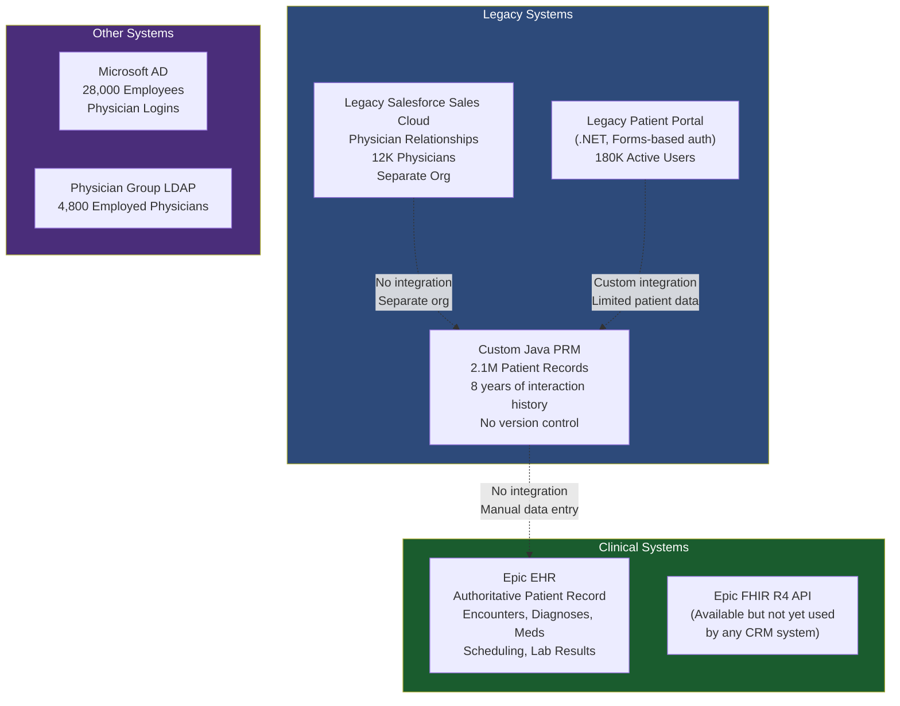
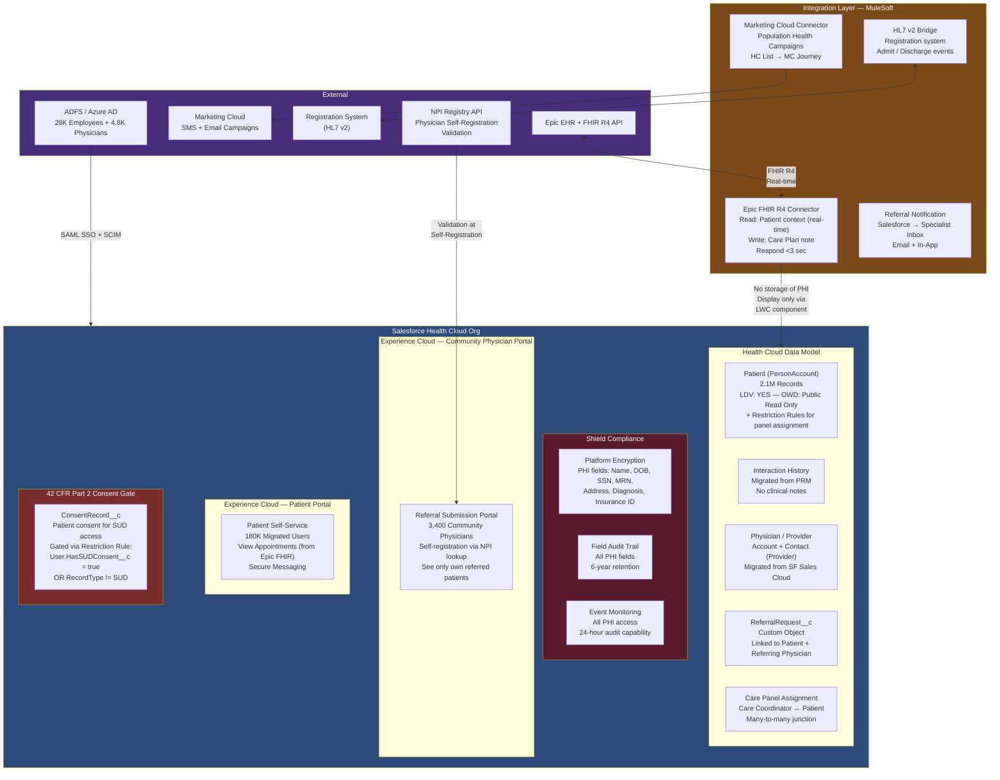

# Healthcare Enterprise Scenario

## Business Background

MedNet Health is a regional integrated delivery network (IDN) operating 12 hospitals, 180 outpatient clinics, and a physician group of 4,800 employed physicians across three states (Texas, Oklahoma, Arkansas). The network serves 2.1 million unique patients annually, has 28,000 employees, and operates both a commercial insurance line and a self-insured health plan for employees. MedNet is a covered entity under HIPAA and is subject to Texas Medical Records Act (TMRA), Arkansas Medical Records Law, and 42 CFR Part 2 for substance use disorder records.

The company is deploying Salesforce Health Cloud to replace two legacy systems: an 18-year-old patient relationship management (PRM) system built on a custom Java stack, and a physician outreach and relationship management system (separate Salesforce Sales Cloud org, 4 years old). The goals are: unified patient and physician relationship management in a single Health Cloud org, a patient self-service portal replacing the legacy patient portal (180,000 active portal users), a physician referral management workflow enabling community physicians to refer patients to MedNet specialists, and a population health program management capability for chronic disease management outreach.

The most architecturally complex element: the company's Epic EHR (electronic health record) contains the authoritative patient record — Salesforce Health Cloud will not replace or replicate Epic but must surface relevant clinical context for the patient relationship and outreach workflows. Any PHI displayed in Salesforce must be sourced from Epic via an HL7 FHIR API, never stored permanently in Salesforce. This constraint is driven by both HIPAA minimum-necessary access requirements and the legal team's determination that duplicating PHI in a CRM system increases liability.

---

## Current Architecture

---

## Requirements

1. **Data Architecture:** Migrate 2.1M patient records from the legacy Java PRM into Salesforce Health Cloud as Patient standard objects (PersonAccount/IndividualContact model). Migrate 8 years of patient interaction history (outreach calls, care coordination notes, program enrollment records — not clinical notes). Migrate 12K physician records from the legacy Salesforce Sales Cloud org. PHI fields (Name, DOB, SSN, MRN, Address, Diagnosis) must be encrypted at rest using Shield Platform Encryption. Clinical data from Epic (encounter history, active diagnoses, current medications, lab results, upcoming appointments) must be displayed in real-time in Salesforce via FHIR API but never stored in Salesforce. A FHIR read should resolve in under 3 seconds.

2. **Security and Sharing:** Three user populations with strictly different access rights: (a) Care Coordinators (600 users) — manage chronic disease programs, need full patient profile + interaction history + Epic clinical context for their assigned patient panel; (b) Physician Relationship Managers (80 users) — manage physician referral relationships, need physician records but no patient records; (c) Community Physicians (referral portal — 3,400 community physicians who refer patients to MedNet) — need a self-service portal to submit referrals and see the status of their referred patients only. Community physicians must not see other physicians' patients. 42 CFR Part 2 records (substance use disorder) require a separate consent gate — even care coordinators cannot access a patient's SUD information without recorded patient consent.

3. **Integration:** (a) Epic FHIR R4 bidirectional integration: read patient clinical context (real-time); write care plan activities from Salesforce back to Epic as a Care Plan note (for coordination continuity); (b) referral intake: community physician submits referral in portal → creates a Referral Request record in Salesforce → triggers outreach workflow → sends notification to the target MedNet specialist's Salesforce inbox; (c) a patient outreach SMS/email campaign capability for population health programs (e.g., "all patients diagnosed with Type 2 Diabetes not seen in 12 months") driven by Health Cloud List Views + Salesforce Marketing Cloud; (d) the legacy PRM's existing HL7 v2 interface to the registration system must be replaced or bridged.

4. **Identity and Access:** 28,000 employees and 4,800 employed physicians use Microsoft AD with existing ADFS federation. Community physician portal users (3,400) are not in AD; they use NPI number-validated self-registration. Patient portal users (migrated from legacy, 180,000) must preserve their existing credentials. Automatic session timeout of 15 minutes applies to all users with access to PHI, per HIPAA technical safeguards. MFA is required for any session accessing unmasked PHI fields.

5. **Application Lifecycle Management:** The legacy Salesforce Sales Cloud physician org must be decommissioned after the Health Cloud migration is complete. The two orgs will run in parallel for 3 months. The delivery team is 18 developers with a 14-month timeline. Health Cloud upgrades and managed package updates must go through a change-controlled process — any Health Cloud managed package update must be tested in sandbox before production deployment.

6. **Compliance:** HIPAA requires a Business Associate Agreement (BAA) with Salesforce (in place). All PHI must be encrypted at rest (Shield Platform Encryption). A comprehensive audit log of every access to PHI fields must be maintained and producible within 24 hours for a HIPAA audit. 42 CFR Part 2 SUD records require explicit patient consent before any user can access them — consent must be captured, stored, and gate-enforce in Salesforce. The legacy PRM and legacy Sales Cloud orgs must be decommissioned within 6 months of Health Cloud go-live, per legal requirement (eliminate duplicate PHI storage).

---

## Sample Solution Architecture

---

## Recommended Approach

### Data Architecture

The "no PHI permanently stored in Salesforce" requirement from Epic is the central architectural constraint and must be stated as Assumption #1 before any architecture is presented. This is not a standard Health Cloud deployment pattern — most Health Cloud implementations use the Data Model with stored clinical data. MedNet's legal team has made a specific risk-based decision to use Epic as the system of record for clinical data and Salesforce as the system of engagement.

The implication: Salesforce Health Cloud stores only non-clinical patient relationship data (contact information, program enrollment, care coordination notes, referral records, interaction history). Clinical context (diagnoses, medications, encounters, lab results) is fetched from Epic via FHIR API on demand and displayed through an LWC component that renders FHIR resources in the page context without writing to any Salesforce object. This pattern is called the "FHIR as a view" integration model — Salesforce is the UI layer, Epic is the data layer for clinical content.

Shield Platform Encryption applies to all PHI fields on the Patient PersonAccount object. The critical limitation: encrypted fields cannot be used in SOQL WHERE clauses, formula fields, or reports. This means that patient lookup by Name or DOB is not performant via standard SOQL. The architecture must include an alternate unencrypted reference field (MRN, patient external ID) as the search/lookup key, with Name and DOB encrypted.

### Security and Sharing

The 42 CFR Part 2 consent gate is the most technically complex security requirement. Federal law prohibits disclosure of SUD information without explicit patient consent — even to other treating providers. The implementation: a custom ConsentRecord__c object captures patient consent grants (including who received consent and for what purpose). A Restriction Rule on the SUD-flagged Patient records (RecordType = SUD_Patient or a custom SUD_Flag__c boolean) restricts visibility to users who have a user-level field (HasActiveSUDConsent__c = true) — this field is set by a Flow triggered when a valid ConsentRecord__c is recorded for that patient and that care coordinator. Without this flag, the restriction rule hides SUD-flagged records entirely, even from care coordinators who otherwise have panel access.

Community physician portal access is governed by Sharing Sets: referral records created by a community physician are visible to that physician via a Sharing Set on ReferralRequest__c tied to the physician's Contact record. Community physicians never see the Patient record directly — they see only the Referral Request status, which is a separate record containing no PHI beyond what the physician provided at submission.

### Integration

The Epic FHIR R4 integration must be bidirectional but asymmetrically designed:
- **Read path:** Salesforce LWC component triggers an Apex callout → Named Credential to MuleSoft FHIR gateway → Epic FHIR R4 Patient/$everything endpoint → FHIR Bundle returned → LWC renders resources client-side, no data written to Salesforce objects. The 3-second SLA requirement is met by caching the FHIR response in Platform Cache (keyed by MRN + timestamp) for 5 minutes — this handles repeated views of the same patient without re-calling Epic.
- **Write path:** When a care coordinator completes a care plan activity in Salesforce, a Platform Event triggers a MuleSoft flow that constructs an HL7 FHIR CarePlan resource and writes it to Epic via the FHIR API. Epic is the source of truth; Salesforce writes are additive, not authoritative.

Population health campaigns use Marketing Cloud: Health Cloud List View generates a patient cohort (e.g., Type 2 Diabetes + no visit in 12 months) → published to Marketing Cloud via the Health Cloud MC Connector → MC Journey sends SMS outreach → patient responses and opt-outs are written back to Health Cloud via the Marketing Cloud Data Stream.

### Identity and Access

Community physician self-registration with NPI validation: the Experience Cloud self-registration flow calls an Apex action that validates the submitted NPI number against the CMS National Plan & Provider Enumeration System (NPPES) API. Valid NPI + matching name from NPPES creates a pending physician account; an internal credentialing workflow reviews and activates the account within 24-48 hours. This prevents unauthorized portal access while allowing physicians to self-register without calling an admin.

The 180,000 patient portal users use the same legacy credential bridge pattern as the retail scenario: silent credential validation against the legacy portal's auth endpoint on first login to Experience Cloud, activating the new Salesforce session without a password reset. The bridge is decommissioned after 90 days.

### Application Lifecycle Management

The parallel operation of the legacy Sales Cloud org (physician records) and the new Health Cloud org creates a 3-month data synchronization requirement. A MuleSoft lightweight sync flow keeps physician records in both systems consistent during the parallel period, using the Physician's NPI as the master key. When the Health Cloud physician data is validated by the Physician Relationship Manager team, the Sales Cloud org is decommissioned on a scheduled date.

Health Cloud managed package updates require a specific change control process: updates are received in a Development sandbox first, regression-tested against a full suite of Apex tests, validated in UAT, and then scheduled for production deployment during a defined maintenance window. This is architecturally important because Health Cloud managed package updates can modify object permissions, field behaviors, and data model relationships in ways that break custom code.

---

## Key Trade-offs to Discuss

**Trade-off 1 — FHIR as a View vs. Stored Clinical Data**

Storing clinical data from Epic in Salesforce would enable offline access, faster page loads, richer reporting (population health queries on Salesforce data), and reduced Epic API load. But MedNet's legal decision is that duplicating PHI in a CRM system increases liability and HIPAA breach surface. The "FHIR as a view" approach requires network connectivity for every clinical context view and a 3-second latency budget. Trade-off: real-time accuracy and reduced PHI liability vs. offline capability and performance. Recommendation: honor the legal decision; mitigate performance with Platform Cache; document the offline limitation as a known architectural constraint.

**Trade-off 2 — 42 CFR Part 2 Consent Gate: Restriction Rules vs. Record Types + Profiles**

Using Restriction Rules keeps the SUD records in the same object as general patient records, which simplifies reporting and care coordination when consent is granted. A full separation approach (separate object or separate community for SUD patients) provides stronger isolation but fragments the patient 360 view. Restriction Rules are the technically correct Salesforce mechanism for row-level conditional access — they are evaluated post-sharing and can be driven by user attributes set at runtime. Decision: Restriction Rules with dynamic consent-driven user attribute.

**Trade-off 3 — Patient Portal on Experience Cloud vs. Epic MyChart**

Epic MyChart already provides a patient portal. Why rebuild on Experience Cloud? The answer is that MyChart provides clinical workflow access (scheduling, lab results, messaging with providers) while MedNet's Health Cloud portal focuses on care coordination and population health program enrollment — different workflows, different user experience goals. The two portals can coexist and should be presented as complementary, not competing. The architecture must explain this distinction or the panel will ask.

---

## Common Candidate Mistakes

1. **Storing Epic clinical data in Salesforce Health Cloud objects.** The scenario explicitly states that PHI should not be permanently stored in Salesforce. A candidate who designs a nightly batch to replicate Epic patient records into Health Cloud has violated the primary architectural constraint. "FHIR as a view" is not a standard pattern that candidates default to — it requires reading the constraint carefully.

2. **Ignoring 42 CFR Part 2.** Most candidates know HIPAA. Far fewer know 42 CFR Part 2, which is a separate and stricter federal regulation governing substance use disorder treatment records. A healthcare scenario with any mention of behavioral health, substance use, or addiction treatment triggers 42 CFR Part 2 requirements. Missing this in a healthcare scenario is a significant gap.

3. **Proposing direct Apex callout to Epic FHIR without a circuit breaker or caching strategy.** A synchronous FHIR call to Epic every time a care coordinator opens a patient record without any caching is a performance time bomb. Epic is an enterprise EHR with rate limiting and occasional maintenance windows. The architecture must include response caching and graceful degradation.

4. **Using Guest User for the community physician portal.** Community physicians are authenticated users — they have NPI-validated accounts and see their own patients' referral status. Guest User is unauthenticated and cannot support this access model. Community physicians need External App license Experience Cloud users with a Sharing Set. Candidates who say "the referral portal will be publicly accessible" have misunderstood the access model.

5. **No mention of encrypted field limitations on patient lookup.** Shield Platform Encryption on Name and DOB means SOQL searches on these fields are not possible. If a care coordinator wants to find a patient by name, how does the architecture support this? This question will come in Q&A; the architecture must have an answer (MRN as unencrypted lookup key, or Salesforce Search with Einstein Search for encrypted fields).

---

## Panel Q&A Preparation

**Q1: "The FHIR read for clinical context must complete in 3 seconds. Epic FHIR API responses for complex patients can take 4-6 seconds. What's your architectural response to a patient who has 20 years of encounter history and the FHIR call consistently times out?"**

Sample Answer: "The 3-second SLA applies to the user experience, not the FHIR round-trip. The mitigation is a progressive loading pattern in the LWC component: the page renders immediately with Salesforce-native data (name, care panel, interaction history), then initiates the FHIR call asynchronously. A loading indicator shows while the FHIR data loads; the care coordinator can begin working with Salesforce data while waiting for clinical context. For patients with very large FHIR bundles, we implement resource-specific lazy loading: the FHIR component requests Condition resources first (most critical for care coordination), then Medication, then Encounter history — each resource category appears as it resolves rather than waiting for the full bundle. Platform Cache stores the most recent FHIR response for 5 minutes; for a care coordinator who opens the record twice in a single session, the second view is instant."

**Q2: "Your 42 CFR Part 2 consent gate uses Restriction Rules driven by a user-level Boolean field. If a care coordinator has a valid consent for Patient A but not Patient B, and a new SUD-flagged patient is assigned to their panel, how does the system ensure the care coordinator cannot accidentally access the new patient's SUD records?"**

Sample Answer: "The HasActiveSUDConsent__c field on the User object is designed as a permission set or permission set group assignment, not a single Boolean — I should clarify that. The consent mechanism works at the patient-coordinator level through a custom ConsentRecord__c object that links a specific Patient to a specific User with a consent type, consent date, and expiration. The Restriction Rule is not a single user-level Boolean — it filters SUD records to only be visible to users who have an active ConsentRecord__c linking them to that specific patient. This is implemented as an apex-managed sharing or restriction rule that evaluates the junction. When a new SUD patient is assigned to the care coordinator's panel, the Restriction Rule prevents access until a ConsentRecord__c is created for that patient-coordinator pair. The care coordinator sees the patient in their panel but sees a consent-required notice rather than the clinical or SUD records."

**Q3: "You're migrating 2.1 million patient records from a custom Java PRM. How do you validate that none of the PHI fields have been corrupted or misrouted during migration, without exposing the data to non-authorized validation users?"**

Sample Answer: "Data validation for PHI migration is a controlled process. First, validation occurs in a Full Copy sandbox of the Health Cloud org — not in production, not in a shared environment. The validation team is a small group with specific HIPAA data stewardship authorization (documented in the BAA appendix). The validation methodology is checksum-based: before migration, the source system exports SHA-256 hashes of each patient's key PHI fields. After migration, the destination org runs the same hash algorithm against the migrated records. Mismatches are flagged without exposing the plaintext PHI values. Second, statistical sampling: 1% random sample of migrated records is reviewed by an authorized data quality analyst against the source system, with all access events logged in Event Monitoring. Third, relationship integrity validation: count of records per object, count of linked Contacts per Account, count of Activities per Patient — aggregate counts that confirm structural integrity without requiring PHI field review."

**Q4: "Marketing Cloud population health campaigns — HIPAA permits use of PHI for 'treatment operations' without individual consent, but using PHI to drive outreach campaigns may cross into marketing. How does your architecture address this distinction?"**

Sample Answer: "This is a genuine legal question that the architecture cannot fully answer — it requires a compliance review with MedNet's HIPAA compliance officer. What the architecture can do is provide the technical controls that support whatever policy decision is made. From an architecture perspective: the Health Cloud List View that generates the patient cohort for population health outreach is filtered to treatment-context campaigns only — the platform does not technically prevent misuse, but the governance model requires that every campaign list is tagged with its authorized purpose (treatment operations vs. marketing) and reviewed by the HIPAA Privacy Officer before being transmitted to Marketing Cloud. For treatment-purpose outreach (diabetic care management, post-discharge follow-up), HIPAA permits use under treatment operations without individual consent. For marketing-purpose campaigns (new service line promotion, elective procedure offers), individual authorization is required. The architecture supports both paths but the policy gate between them is an organizational control, not a technical one — and I'd name that explicitly in the architecture review with the compliance team."

**Q5: "The community physician portal relies on NPI validation for self-registration. What prevents a bad actor from using a legitimate physician's NPI to register and access referral status data?"**

Sample Answer: "NPI validation alone is not sufficient identity assurance — you're right. The self-registration flow includes NPI validation as a first factor, but activation requires a second verification step: an email sent to the address on record in the NPPES NPI registry, which is the physician's professional email. The community physician must click a confirmation link from that specific email address. For physicians who have an incorrect or outdated email in NPPES, the flow provides an alternative path: phone verification against the clinic's main number listed in NPPES, validated by a credentialing team member who calls the number. The account is manually activated after phone verification. Additionally, community physician accounts are restricted in scope — they can only see the Referral Requests they submitted and the status of those referrals. There is no path from the community physician portal to any Patient record directly. Even if an unauthorized person registered using a stolen NPI, the maximum exposure is seeing the referral submissions made by that specific physician account — not other patients' records."
