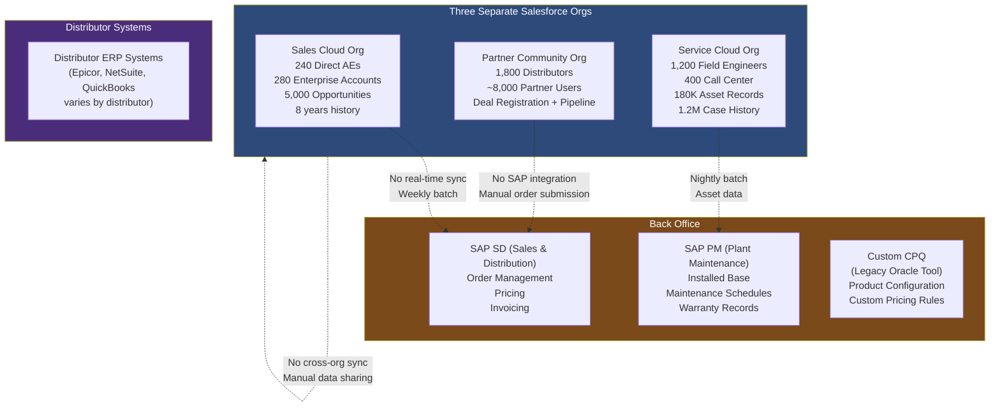
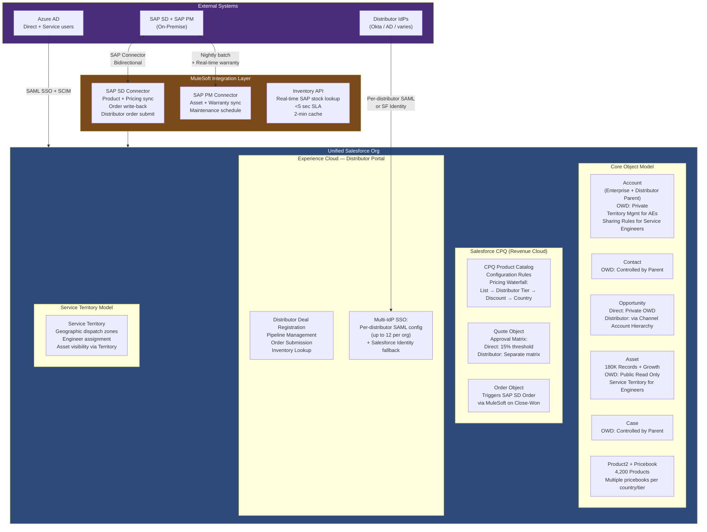

# B2B Enterprise Scenario

## Business Background

GlobalTech Manufacturing is a $12B industrial equipment manufacturer with operations in 22 countries, selling through a network of 1,800 authorized distributors and 280 direct enterprise accounts. The company makes complex capital equipment (CNC machinery, industrial robots, precision measurement systems) with a typical B2B sales cycle of 6-18 months, deal sizes ranging from $50K to $25M, and an installed base of 180,000 units in 45 countries. After-sales service and parts represent 35% of total revenue and are growing at 12% annually.

GlobalTech has three distinct go-to-market motions running simultaneously: (1) direct enterprise sales to large manufacturers (Ford, Boeing, Caterpillar) managed by 240 direct account executives; (2) distributor channel sales through 1,800 distributors who sell to mid-market and SMB manufacturers; (3) service and parts revenue managed by 1,200 field service engineers and a 400-person service call center. Each motion has its own sales process, commission model, pricing rules, and customer data.

The company currently has three separate Salesforce orgs: a Sales Cloud org for direct sales (8 years old), a Partner Community org for distributor management (4 years old), and a Service Cloud org for post-sales service (3 years old). The board has approved a "One Platform" initiative to consolidate to a single Salesforce org with unified customer and product data, enable cross-motion visibility (a direct AE should see service tickets for their enterprise accounts), and build a distributor portal that gives distributors a modern deal registration and pipeline management experience.

---

## Current Architecture

---

## Requirements

1. **Data Architecture:** Consolidate all Account (280 enterprise + ~50K distributor customer accounts), Contact, Opportunity, Asset, and Case records from three Salesforce orgs into a single unified org. The 180,000 Asset records (one per installed equipment unit) are the foundation of the service business — each Asset has a serial number, model, installation date, warranty expiration, and service history. Migrating Asset records with their complete case and maintenance history is mandatory. Product catalog must be synchronized from SAP — 4,200 active products, 180,000 SKUs including parts and accessories. Revenue from the SAP opportunity-to-order process must be visible on the Salesforce Opportunity without replacing SAP as the order management system.

2. **Security and Sharing:** Direct AEs (240 users) must see only their assigned enterprise accounts and opportunities; they must not see distributor-managed accounts or each other's accounts. Distributor users (8,000 portal users) must see only the accounts and opportunities in their assigned territory; Distributors are legal entities and competitors to each other — distributor A must never see distributor B's pipeline or customer data. Service engineers (1,200) need access to all Assets and Cases for their assigned service territory — they are not organized by customer ownership but by geographic dispatch territory. A service engineer must be able to look up any installed Asset for any customer in their territory, regardless of which AE or distributor sold it. Regional sales managers (30) need pipeline visibility across both direct AEs and distributor deals in their region, but not into other regions.

3. **Integration:** (a) SAP SD product and pricing sync: CPQ must reflect real-time SAP pricing for enterprise opportunities (list price + discount authorization); (b) SAP SD order write-back: when an Opportunity closes-won, the order details must be written to SAP SD to create a sales order; (c) SAP PM asset sync: installed base (Asset records) maintained in SAP PM must sync to Salesforce daily with current warranty and maintenance schedule data; (d) CPQ replacement: the legacy Oracle CPQ must be replaced with Salesforce CPQ (Revenue Cloud); (e) distributor order submission: distributor users submit purchase orders from the portal to SAP SD via the portal; (f) real-time inventory availability lookup for distributor users placing orders.

4. **Identity and Access:** 280 direct AEs, 30 regional managers, and 1,200 service engineers use Azure AD SSO. The 8,000 distributor portal users are managed in the distributor companies' own identity systems (varies — some have Okta, some have Active Directory, some have no SSO capability). Distributors who have their own IdP must be able to configure SSO for their users. Distributors without an IdP will use Salesforce-managed identity (username/password). No single identity architecture serves all distributors.

5. **Application Lifecycle Management:** The three-org consolidation is a major program with an estimated 30-month timeline. A phased approach is required: Phase 1 (months 1-12) consolidate Sales Cloud and Service Cloud to unified org; Phase 2 (months 13-24) migrate Partner Community to the unified org's Experience Cloud; Phase 3 (months 25-30) retire all three legacy orgs. During Phase 2, both the legacy Partner Community org and the new Experience Cloud portal must be operational in parallel.

6. **CPQ and Pricing Architecture:** Salesforce CPQ must handle: 4,200 products with complex configuration rules (compatible/incompatible options, required components), volume discounts based on distributor tier (Platinum, Gold, Silver, Bronze), country-specific pricing for 22 countries, and multi-currency support. Enterprise deals require approval workflows for discounts above 15%; distributor deals have a different approval matrix. Configurations must be validated against SAP's product compatibility rules before a quote is submitted.

---

## Constraints

- SAP SD and SAP PM are on-premise and will not be replaced or modernized in this program's scope
- Salesforce CPQ (Revenue Cloud) is the approved replacement for the legacy Oracle CPQ
- MuleSoft is the approved integration platform
- The three existing Salesforce orgs have different Salesforce release versions and different managed package versions; a metadata audit is required before consolidation
- Distributor user count (8,000) makes full Salesforce licenses cost-prohibitive; Experience Cloud External App or Partner Community licenses required
- 42 countries means multi-currency, multi-tax-rate, and varying regulatory requirements for quote and order documents
- Phase 1 deadline is hard: the direct sales team's fiscal year renewal is at month 12; the consolidated org must be live for all direct AEs before that date

---

## Sample Solution Architecture

---

## Recommended Approach

### Data Architecture

The three-org consolidation data migration is unique because all three source systems are Salesforce — the migration tooling is different from migrating from a legacy non-Salesforce system, but the data quality challenges are the same or worse. Three separate orgs have almost certainly developed conflicting Account record definitions: the same customer company (e.g., a large distributor who is also an enterprise customer) exists in all three orgs as three separate Account records. The migration must deduplicate across all three sources before loading into the unified org.

External ID strategy for three-org migration: each source org has a Salesforce Record ID. These IDs are preserved as three separate external ID fields on each object in the unified org: `SalesOrgId__c`, `PartnerOrgId__c`, `ServiceOrgId__c`. This enables bidirectional reconciliation during the parallel operation period and provides an audit trail of the source record for every migrated record.

Asset records (180K) are the highest-fidelity requirement. Each Asset has a serial number that is unique globally — the serial number becomes the External ID (`SerialNumber__c`) and is the join key between the Salesforce Asset and the SAP PM asset record. This enables idempotent sync from SAP PM and prevents duplicate Asset records for the same physical equipment.

### Security and Sharing

This scenario has the most complex multi-audience sharing model of any practice scenario. Four user populations with fundamentally different access boundaries:

1. **Direct AEs:** Account-based private sharing via Territory Management (280 enterprise accounts, 240 AEs)
2. **Distributor users:** Account-based sharing scoped to the distributor's customer accounts, enforced via Sharing Sets on Experience Cloud — distributor Account serves as the "parent" and a Sharing Set grants access to all child customer Accounts linked to that distributor
3. **Service engineers:** Asset and Case access via Service Territory — engineers see all Assets in their dispatch territory regardless of Account ownership; this is enforced via a custom Apex Managed Sharing class that grants read access to Assets and Cases based on service territory assignment, not OWD or standard sharing rules
4. **Regional managers:** visibility across AE pipeline (standard role hierarchy) and distributor pipeline in their region (sharing rule on Opportunity where Distributor Region field matches the manager's region)

The tension: Account OWD must be Private (AEs can't see each other's accounts), but Service Engineers need access to all Accounts in their territory to view Assets. This requires Apex Managed Sharing for Account (read-only) for the Service Engineer profile, scoped by territory. The sharing rule alone won't work because territory boundaries don't align with Account ownership.

### Integration (CPQ-SAP Pricing)

Salesforce CPQ's pricing waterfall must be synchronized with SAP SD's pricing conditions (VKORG-based pricing in SAP). The pattern: MuleSoft publishes SAP pricing conditions as a nightly sync to Salesforce Pricebooks — one Pricebook per country × pricing tier (22 countries × 4 distributor tiers = up to 88 Pricebooks, rationalized to actual active combinations). CPQ uses the appropriate Pricebook based on the distributor tier and quote country.

For enterprise deals, a real-time SAP pricing call for unusual configurations (custom bundles, special pricing requests) is made via a CPQ Pricing Plugin — a custom Apex class that calls MuleSoft → SAP pricing API to return dynamic pricing for non-standard configurations. The 15-second CPQ quote pricing SLA is met by the plugin pattern.

### Identity for Distributor Portal (Multi-IdP)

Salesforce Experience Cloud supports up to 12 SAML SSO configurations per org. With 1,800 distributors, this is not enough to provide SSO for every distributor individually. The architecture tiers the approach:
- **Top 12 distributors by revenue** (representing ~60% of distributor revenue): individual SAML SSO configurations using the distributor's own IdP
- **Mid-tier distributors (100-200 users each)**: grouped SSO via a shared Okta tenant maintained by GlobalTech as a "managed IdP" service for distributors who want SSO but don't have their own IdP
- **Long-tail distributors (typically 1-5 users)**: Salesforce-managed identity (username + password + Salesforce MFA)

This tiered approach covers SSO for ~80% of distributor revenue without requiring 1,800 SAML configurations.

### CPQ Architecture

Salesforce CPQ handles the product configuration complexity through Configuration Rules (Required, Exclude, Dependency) and Product Rules. The 4,200 products with 180,000 SKUs require a rationalized product hierarchy: Product Family → Product Category → Base Model → Configuration Options (attributes). Product compatibility rules are maintained in CPQ as validation rules that check the SAP compatibility matrix (synced nightly to a custom object `ProductCompatibility__c`).

---

## Key Trade-offs to Discuss

**Trade-off 1 — Single Org vs. Hub-and-Spoke Multi-Org**

Single org gives unified customer view, unified product catalog, and simpler integration. The trade-off: 8,000 distributor portal users + 1,640 internal users sharing governor limits, apex execution, and org-wide storage. Hub-and-spoke (separate distributor portal org that syncs with a central CRM org) isolates distributor portal load from internal CRM performance but reintroduces cross-org synchronization complexity. Decision: single org — the business goal of cross-motion visibility (AE sees service tickets; regional manager sees both direct and distributor pipeline) is impossible across orgs without real-time sync. The governor limit concern is real but addressable through performance architecture (limits monitoring, API call optimization, bulkified integration patterns).

**Trade-off 2 — Salesforce CPQ vs. External CPQ (SAP CPQ, PROS)**

Salesforce CPQ integrates natively with Salesforce data model (Quotes, Orders, Opportunity Products). SAP CPQ or PROS provides deeper pricing engine capability and native SAP integration. For GlobalTech's primary complexity (product configuration rules and multi-tier pricing), Salesforce CPQ is sufficient. The scenario-specific reason to choose Salesforce CPQ: it can be deployed in the distributor portal (Experience Cloud supports CPQ for partner users), enabling distributors to generate quotes directly. External CPQ tools do not support this without a custom integration layer.

**Trade-off 3 — Phased Org Consolidation Timeline: 30 Months Risk**

30 months is a long parallel operation period. Every month of parallel operation is a month of dual data entry risk, data divergence between orgs, and user confusion about which system to use. The mitigation: define clear system-of-record boundaries immediately, even before full migration. From Day 1 of Phase 1, direct AEs must use only the unified org for new opportunity creation. The legacy Sales Cloud org moves to read-only as soon as the unified org is live for direct AEs. This prevents the drift that typically occurs in long parallel operation windows.

**Trade-off 4 — Apex Managed Sharing vs. Territory Management for Service Engineers**

Territory Management could theoretically solve the service engineer access problem (assign territories to accounts). But Field Service territory management in Salesforce (FSL Service Territories) is a different model from Account territory management — they don't share the same territory record. Building a custom Apex Managed Sharing class provides full control over the access grant logic but increases code complexity and maintenance overhead. Decision: Apex Managed Sharing for service territory access, with a clear code ownership and test coverage requirement (this is the highest-risk custom code in the org).

---

## Common Candidate Mistakes

1. **Treating the three-org consolidation as a data migration with no deduplication.** Three Salesforce orgs with overlapping customers will have the same company represented three times. A candidate who proposes "migrate all Account records from all three orgs" without a deduplication and matching strategy will produce a unified org with 3× duplicate records.

2. **Ignoring the distributor competitive isolation requirement.** "Distributors can see accounts in their territory via sharing rules" is not sufficient — sharing rules based on territory can accidentally expose distributor A's customers to distributor B if they share geographic territory. The architecture must explicitly prove that no sharing rule, sharing set, or OWD setting permits cross-distributor visibility.

3. **Overlooking the Service Engineer access model.** The service engineer requirement — "see all Assets in their service territory regardless of who sold it" — conflicts directly with Account Private OWD. Candidates who design Account Private OWD without addressing the service engineer exception have an internal architectural contradiction. The panel will probe this immediately.

4. **Not addressing the CPQ-SAP pricing synchronization.** Salesforce CPQ without current SAP pricing data produces quotes with incorrect pricing. The nightly pricing sync from SAP SD to Salesforce Pricebooks is a mandatory integration component, not an afterthought. Missing it in the architecture leaves CPQ without its data foundation.

5. **Proposing 1,800 SAML SSO configurations for distributors.** Salesforce supports 12 SAML SSO configurations per org. A candidate who says "every distributor gets their own SSO configuration" reveals unfamiliarity with this platform limit.

---

## Panel Q&A Preparation

**Q1: "A service engineer opens an Asset record for a customer that belongs to a competing distributor's territory. The distributor shouldn't see the service engineer's notes about that customer. But the service engineer needs full case access. How do you prevent data bleed?"**

Sample Answer: "The data bleed risk is real — the service engineer has read access to the Account (to find the Asset), but should not see the distributor's opportunity pipeline, quote data, or deal registration data for that account. The isolation is implemented through object-level permission differences, not record-level sharing. Service engineer Profile grants: Asset CRUD, Case CRUD, Account read. Service engineer Profile does not grant: Opportunity read, Quote read, CPQ object access. The distributor's competitive data lives in Opportunity, Quote, and CPQ objects — which the service engineer cannot see regardless of Account sharing. The only overlap risk is Account fields that the distributor has customized with deal-sensitive information. Those fields should be on a related object (a custom Distributor_Deal_Note__c), not on the Account record itself, and that object is outside the service engineer's profile permissions."

**Q2: "Your CPQ implementation has 4,200 products and 180,000 SKUs. A distributor is configuring a complex robot installation that requires validating compatibility with 15 optional accessories. How does CPQ handle this without timing out?"**

Sample Answer: "CPQ performance at this scale requires a well-designed product hierarchy and selective configuration rule evaluation. The configuration rules are structured to evaluate only the rules relevant to the selected product category — a robot configuration loads only robot-category compatibility rules, not the rules for CNC machinery. This is managed through CPQ's built-in rule scoping using Product Families. For the 15-option validation at configuration time, the CPQ pricing plugin calls SAP compatibility matrix via MuleSoft — this is a single batch call that validates all 15 selected options against the matrix in one request, rather than 15 sequential calls. The response is cached in Platform Cache for the session. If the SAP call is unavailable, CPQ degrades gracefully to native CPQ product rules (which cover the most common incompatibility cases) with a warning that real-time SAP validation is pending — preventing the configuration from being finalized without SAP validation while not blocking the user's session."

**Q3: "The distributor portal runs on the same org as the internal CRM. A distributor processes 500 orders in a burst during a trade show. What is the impact on internal users, and how do you mitigate it?"**

Sample Answer: "The risk is shared API limits and processing capacity. Salesforce org-level API limits are 1,000 calls per user per 24 hours for licensed users, and overall org API limits scale with user count. 8,000 distributor users × 1,000 API calls is a substantial ceiling. For burst scenarios: the distributor order submission flow is designed with MuleSoft queuing — distributor order submissions are published as Platform Events and consumed by a MuleSoft integration in batches, rather than triggering synchronous Apex processing for each order. Platform Event publishing is decoupled from the SAP order write — the distributor sees immediate confirmation that the order is submitted; the SAP write happens asynchronously. This decouples the burst from the SAP API call rate. For internal CRM users, the Apex governor limit concern during burst periods is mitigated by keeping the distributor portal flows declarative (Flow + Platform Events) rather than Apex-heavy, staying within the Flow governor limits that are separate from the Apex limits."

**Q4: "The 30-month program — at month 18, you're mid-Partner Community migration. A key distributor tells you they won't migrate to the new portal because their ERP integrates directly with the old Partner Community via a custom API. What do you do?"**

Sample Answer: "This is a program management and architecture decision. The distributor's ERP-to-Partner Community integration is a constraint that wasn't captured in the initial program scope — this is exactly the kind of undiscovered dependency that lengthens migration timelines. The technical resolution: the distributor's ERP integration point is recreated as a Connected App and REST API endpoint on the new unified org during the parallel period. We provide the distributor with new API credentials and a technical spec for the endpoint (same request/response format as the legacy Partner Community API where possible). The new endpoint is tested with the distributor's ERP team in a staging environment before their portal migration date. Their migration date shifts by 4-6 weeks to accommodate the ERP integration re-point. This is disclosed to the program steering committee as a scope addition with cost and timeline implication — it's not a reason to abandon the migration, but it must be formally scoped and funded."

**Q5: "Salesforce CPQ for Experience Cloud — distributor users generating quotes. What happens to quote generation performance when you have 8,000 distributors creating quotes simultaneously against a CPQ catalog with 180,000 SKUs?"**

Sample Answer: "This is a known CPQ scalability concern. The mitigation strategy: CPQ for portal users (External Users) uses the same CPQ engine as internal users, but the product catalog presented to portal users is filtered to their market segment and distributor tier — a distributor in the industrial automation space sees only the robot and automation product lines, not the full 4,200 product catalog. This is implemented through CPQ Product Visibility rules based on the distributor's Account attributes. For 8,000 concurrent users, we also implement CPQ Search Index optimization — enabling the CPQ product search to use Salesforce Search rather than SOQL-based filtering, which performs significantly better at catalog scale. Peak load testing in a Full Copy sandbox with simulated concurrent CPQ sessions is a mandatory pre-go-live gate for the distributor portal launch."
