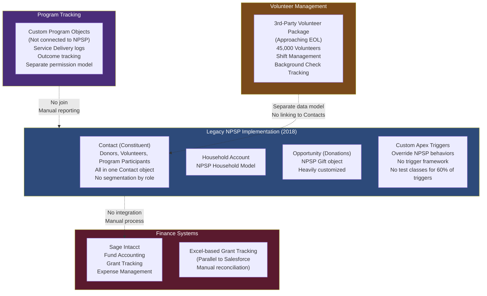
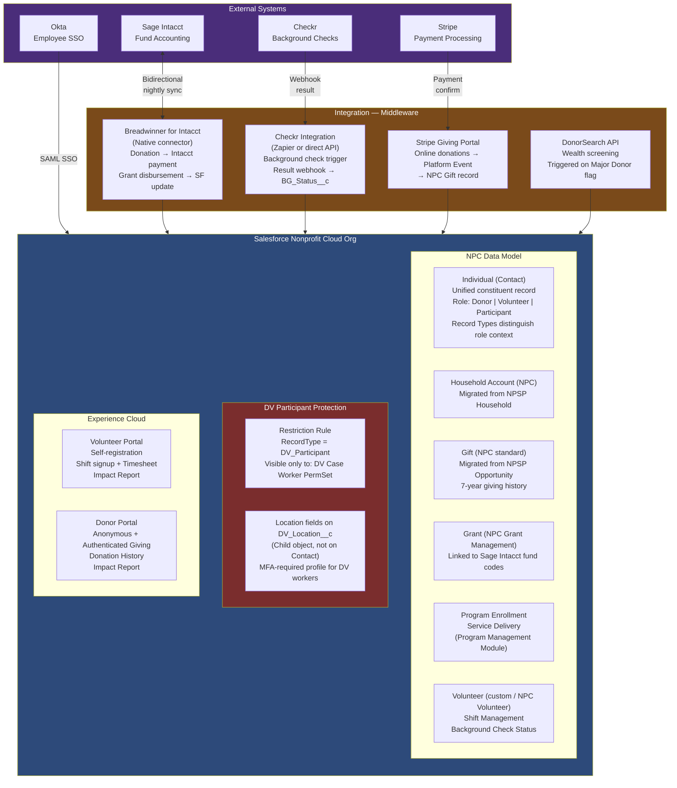

# Nonprofit Enterprise Scenario

## Business Background

HopeWorks Foundation is a large national nonprofit organization headquartered in Chicago with programs operating in 38 US states and 12 countries. The organization has $420M in annual revenue (primarily grants and major donations), 1,200 employees, 45,000 volunteers, and serves 340,000 program participants annually across its three primary mission areas: workforce development (job training and placement), emergency food assistance, and youth education programs.

HopeWorks has used Salesforce Nonprofit Success Pack (NPSP) for 6 years but has outgrown its original configuration. The current implementation was deployed by a small consulting firm in 2018 and has accumulated significant technical debt: NPSP has been heavily customized with Apex triggers that override standard NPSP behaviors, the volunteer management is handled with a third-party managed package that is approaching end-of-support, and the program tracking is managed through a patchwork of custom objects that do not connect to the donor and fund management data.

The organization is migrating to Salesforce Nonprofit Cloud (the modern replacement for NPSP) while simultaneously: (1) implementing Program Management Module (PMM) for unified program participant tracking, (2) replacing the expiring volunteer management package with Salesforce Volunteers for Salesforce or a modern alternative, (3) deploying a donor-facing giving portal on Experience Cloud, (4) integrating with their accounting system (Sage Intacct) for fund accounting reconciliation, and (5) creating a unified data model that connects donor giving history, grant activity, and program outcomes — so the Development team can show major donors the direct impact of their gifts.

The architectural complexity is driven by the intersection of strict nonprofit accounting requirements, the sensitivity of donor and program participant data (some participants are in domestic violence shelters — their location must never be disclosed), and the scale challenge of managing 45,000 volunteers across 38 states with varying compliance requirements.

---

## Current Architecture

---

## Requirements

1. **Data Architecture:** Migrate all Contact, Account (Household), Opportunity (Donation), and Campaign records from NPSP to Nonprofit Cloud. The 340,000 program participants include a protected subgroup of approximately 8,500 participants in domestic violence shelter programs — their addresses and location data must be protected such that only case workers with a specific authorization can access it. Additionally, some contacts are simultaneously donors, volunteers, and program participants — the unified data model must support the same person appearing in all three roles without creating duplicate records. Seven years of giving history must migrate, including soft credits. Sage Intacct fund account codes must be mappable to Salesforce opportunities and grant records.

2. **Security and Sharing:** Fundraising staff (120 users) manage donor relationships — they need full access to giving history, wealth prospect data, and donor engagement records, but should not see program participant records. Program staff (350 users) manage service delivery to participants — they need full access to program enrollment, service delivery, and outcome data, but should not see donor giving history or wealth prospect data. Volunteers (45,000) need a self-service portal to view and sign up for volunteer shifts, complete their timesheets, and view their impact report — but should never see any donor, program participant, or organizational financial data. The domestic violence shelter participants have an additional layer: even within the program staff, only designated domestic violence case workers (12 users) can see the protected location data.

3. **Integration:** (a) Sage Intacct bidirectional: donations entered in Salesforce must create payment transactions in Sage Intacct; grant disbursements created in Sage Intacct must appear in Salesforce as grant activity updates; monthly fund reconciliation report must match between systems; (b) background check integration: the volunteer management workflow requires integration with a third-party background check provider (Checkr or equivalent) — volunteer applications trigger a background check; results update the volunteer's record in Salesforce; volunteers with failed checks must be flagged and removed from active shift assignments; (c) a donor-facing giving portal that accepts online donations via Stripe and creates Salesforce Opportunities in real-time; (d) a wealth screening integration (DonorSearch or iWave) for major donor prospect identification.

4. **Identity and Access:** 1,200 employees use Okta SSO. Volunteers (45,000) self-register on the Experience Cloud portal using email + password (no SSO required). Donors use the giving portal as anonymous or authenticated users — anonymous donation is supported (no login required), but authenticated donors get a donation history view. The domestic violence case workers (12 users) require Multi-Factor Authentication every session for access to protected participant data, even when the org-wide session policy does not require MFA.

5. **Application Lifecycle Management:** The nonprofit technical team is two Salesforce administrators with no development background and no version control experience. There is no SI partner engaged — HopeWorks has chosen to self-implement with guidance from a Salesforce Success Architect. The release governance must be designed for a team of two that can realistically be followed without CI/CD tooling. The 60% of triggers without test classes must be remediated before migration; the architecture must either remove the triggers (if they duplicate Nonprofit Cloud standard functionality) or document and test them.

6. **Reporting and Impact Measurement:** The board and major donors require an "impact report" that links: a donor's total giving → the specific programs funded → the participant outcomes achieved. This requires joining Opportunity (donation), Fund__c (grant allocation), Program_Enrollment__c (PMM enrollment), and Service_Delivery__c (PMM service delivery) objects. The report must be publishable to the donor-facing portal. The board requires a real-time grant compliance dashboard showing grant expenditure vs. budget for each active grant.

---

## Constraints

- Budget: $320K total for technology and implementation; Salesforce Nonprofit Cloud licenses are discounted through the Power of Us program (10 free licenses, 80% discount on additional licenses)
- The technical team has no Apex development experience; any new custom code requires an external developer or a declarative-only approach
- Sage Intacct integration must use the Salesforce Connector for Intacct (native connector, no MuleSoft budget) or a third-party middleware (Breadwinner or DBSync — both used widely in the nonprofit sector)
- Data sensitivity: domestic violence participant data is protected under Illinois Domestic Violence Act and federal Violence Against Women Act (VAWA) — location data cannot be stored in any cloud system accessible by unauthenticated users
- Volunteer background check data (pass/fail, report date) is sensitive personal data; the actual background check report must stay with Checkr, not be stored in Salesforce
- Timeline: Nonprofit Cloud migration must complete before NPSP sunset date

---

## Sample Solution Architecture

---

## Recommended Approach

### Data Architecture

The most nuanced data model challenge is the single constituent who can be a donor, a volunteer, and a program participant. In Nonprofit Cloud, the Individual (Contact/Person) record is the unified constituent, with Record Types differentiating the role context (Donor, Volunteer, Program Participant). A person can have multiple role-based record types — or, in NPC's more modern approach, role is tracked through related objects: a Contact can have both a Gift record (as donor), a Volunteer_Shift_Registration__c (as volunteer), and a Program_Enrollment__c (as participant), all linked to the same Contact without the Contact record needing to switch Record Types.

The domestic violence participant protection is implemented at two levels: the participant's address and shelter location are stored in a separate child object `DV_Location__c` (not on the Contact record), visible only to the DV Case Worker permission set via a Restriction Rule on that object. The Contact record for a DV participant is visible to Program staff (they can see their enrollment and service delivery), but the DV_Location__c child records are invisible to anyone without the DV Case Worker permission. This two-object design separates the sensitive location from the program operational data.

### Security and Sharing

The three-audience isolation (Fundraising, Program, Volunteer) is implemented through Profile-based object permissions:
- Fundraising staff: can see Gift, Donor record type Contacts, Accounts (Households) — no access to PMM objects (Program_Enrollment__c, Service_Delivery__c)
- Program staff: can see PMM objects, Participant record type Contacts — no access to Gift records or wealth prospect fields (FLS restriction on Prospect_Rating__c, Estimated_Gift_Capacity__c)
- Volunteer portal users: can see Volunteer_Shift__c and their own Timesheet — no access to any other Contacts, no access to any financial or program participant data

The giving history visibility rule is particularly important: a donor should be able to view their own giving history in the portal, but fundraising staff who view a Contact record see the full giving history while program staff see no financial fields. This is achieved through Record Type-specific Page Layouts and Field-Level Security on Opportunity/Gift fields for the program staff profile.

### Integration: Sage Intacct

The Breadwinner connector is the appropriate choice for a nonprofit with no MuleSoft budget. It provides bidirectional Salesforce ↔ Intacct sync with Opportunity → Intacct Transaction Journal Entry for donations, and Intacct AP Transaction → Salesforce Grant Disbursement record for grant accounting. The key design decision: which system initiates each transaction type?

- Donation processing: initiated in Salesforce (Gift entry by fundraising staff or Stripe online gift) → synced to Intacct as the accounting record
- Grant disbursements: initiated in Intacct (accounting system for grants) → synced to Salesforce for program reporting

The fund code mapping — Intacct fund accounts to Salesforce Grant records — requires a cross-reference table maintained as a Custom Metadata Type (`IntacctFundCode__mdt`) that maps each Intacct fund code to the corresponding Salesforce Grant record. This allows the integration to route transactions without hardcoded fund codes.

### ALM for a Two-Person Admin Team

This is the CTA scenario that tests whether candidates recognize when enterprise ALM patterns are inappropriate. A Release Train model with Copado and CI/CD pipeline is not realistic for two non-developers. The right ALM model for this team:

1. **Sandbox strategy:** One Developer sandbox for change testing, one Partial Copy for UAT (if licensed). All changes tested in Developer sandbox before production deployment.
2. **Version control: Gearset Free Tier or Salesforce CLI with Git.** Salesforce CLI can push/pull metadata to a GitHub repository without requiring developer expertise. The admins commit changed metadata to Git after each deployment. This provides audit trail and rollback capability without full CI/CD.
3. **Change Sets for deployment.** Not ideal for scale, but appropriate for a two-admin team. Every change set is documented with a business description and tested in the Developer sandbox.
4. **Trigger remediation:** The legacy Apex triggers must be evaluated by an external Apex developer (budget for a short-term contractor engagement). Triggers that duplicate NPC standard behaviors (NPSP rollup triggers, household management) are deleted; triggers with unique business logic are documented, tested, and retained.

### Reporting and Impact Architecture

The impact report join (Donation → Fund → Program Enrollment → Service Delivery → Outcome) requires a custom report type that spans all four objects. Salesforce standard reports support up to 4-object joins — this is exactly at the limit. If the impact report requires more than 4 object joins, Tableau CRM (Einstein Analytics) is the recommendation, using a Dataset that joins all relevant objects at the data layer.

The grant compliance dashboard (expenditure vs. budget by grant) is a Salesforce Dashboard driven by a Report on the Grant__c object with related Grant_Expense__c records synced from Intacct. Real-time is achievable through a Streaming API push or a scheduled report refresh.

---

## Key Trade-offs to Discuss

**Trade-off 1 — NPC Migration Timing vs. NPSP Stability**

NPSP is not being sunset immediately — Salesforce has committed to supporting it for several years post-NPC launch. Migrating now incurs implementation risk (NPC is newer, ecosystem knowledge is smaller). Waiting incurs technical debt risk (NPSP customizations continue to accumulate). Decision: migrate now, because HopeWorks's current customizations are already breaking NPSP standard behaviors — the NPSP implementation is already technically unsupported by design. A clean NPC implementation is worth the migration cost.

**Trade-off 2 — Volunteer Portal on Experience Cloud vs. VolunteerHub or External Tool**

Experience Cloud + custom volunteer management requires building shift management, background check workflows, and timesheet functionality. External volunteer management tools (VolunteerHub, GivePulse, Timecounts) provide this out of the box with Salesforce integration. Trade-off: Experience Cloud integration is tighter but requires development investment. External tool is faster to deploy but adds a monthly SaaS cost and a Salesforce data sync dependency. Decision: given the budget constraints and two-admin technical team, an external volunteer management tool with Salesforce integration is the pragmatic recommendation for Phase 1; custom Experience Cloud volunteer portal is a Phase 2 enhancement.

**Trade-off 3 — Stripe Direct Integration vs. Giving Platform (Classy, Fundraise Up)**

Stripe provides payment processing but requires custom donation form development. Giving platforms (Classy, Fundraise Up) provide pre-built donor experience, recurring giving management, peer-to-peer fundraising, and Salesforce native integration, at the cost of a platform fee (typically 2-3% of online donations). For a $420M nonprofit, Fundraise Up or Classy's Salesforce native connector is the better recommendation — it provides peer-to-peer fundraising and campaign management capabilities that a custom Stripe integration would require months to replicate.

---

## Common Candidate Mistakes

1. **Recommending enterprise ALM (Copado, full CI/CD) for a two-admin team.** This is a common mistake by candidates who apply the same ALM pattern to every scenario. Context matters. A two-admin team without development experience needs an ALM model they can actually follow. Recommending Copado and Docker-based scratch org pipelines for this team is technically correct but operationally impossible.

2. **Using a single Contact Record Type for all constituents.** The "one person = one record" principle is correct for deduplication, but without role differentiation, fundraising staff see all 340,000 program participants and program staff see all 120,000 donors — both are privacy violations. Record Types or a constituent role model must differentiate access, not just deduplication.

3. **Missing the VAWA/domestic violence data protection requirement.** Most candidates see "nonprofit" and think about donation management. Candidates who read the scenario carefully notice the domestic violence shelter program and the legal protection requirement. Missing it reveals incomplete scenario reading.

4. **Proposing MuleSoft for Sage Intacct integration.** MuleSoft is not in this organization's budget. The scenario explicitly provides a budget constraint and names the available middleware options. A candidate who proposes MuleSoft has ignored the budget constraint — which is a C-H (hard constraint) that shapes the entire integration architecture.

5. **Designing donor and participant data in separate orgs.** The impact reporting requirement — "show donors the outcomes of their gifts" — requires joining donation and program outcome data. Separate orgs make this impossible without a cross-org data synchronization layer. Single org is the correct architecture for this reporting requirement.

---

## Panel Q&A Preparation

**Q1: "A domestic violence program participant is also a donor and a volunteer. How does your data model handle this — do they appear as one Contact record or three?"**

Sample Answer: "One Contact record with three role relationships — this is the core purpose of a unified constituent model. The Contact has a Record Type of Individual (or Constituent in NPC terminology). Their donor role is expressed through Gift records (NPC) linked to the Contact. Their volunteer role is expressed through Volunteer Shift Registration records linked to the Contact. Their program participant role is expressed through Program Enrollment records in PMM linked to the Contact. The DV Location data is in a child object linked to the Contact, visible only to DV Case Workers. The Contact record itself shows the person's name and contact information — field-level security ensures that fundraising staff see the gift-related fields but not the PMM enrollment fields, and program staff see the PMM fields but not the gift financial fields. The record is unified; access is role-differentiated at the field and related list level."

**Q2: "The NPSP-to-NPC migration — you have 60% of triggers without test classes. How do you migrate a trigger with no test class to Nonprofit Cloud without being able to deploy it to production?"**

Sample Answer: "Salesforce requires 75% code coverage for production deployment. A trigger without a test class has 0% coverage and cannot be deployed. The remediation path: each trigger must be evaluated by an Apex developer before migration. The evaluation question for each trigger is: does NPC's standard platform already provide this behavior? If yes — the trigger is a redundant override and should be deleted, not migrated. For the subset of triggers with unique logic: an external Apex developer (contracted for a fixed scope) writes test classes to 85% coverage. The development cost of this remediation is included in the project budget and timeline. This is a Phase 0 activity — it must be completed before any Nonprofit Cloud metadata is touched. Deploying to NPC before trigger remediation means carry-forward technical debt that will break NPC standard behaviors on day one."

**Q3: "The grant compliance dashboard — you said it's real-time. But Sage Intacct syncs on a nightly basis via Breadwinner. How is the dashboard real-time if the data comes from a nightly batch?"**

Sample Answer: "Good catch — I should clarify 'near-real-time' vs. 'real-time.' The grant compliance dashboard is real-time for expenditures entered in Salesforce (like volunteer labor costs logged as service delivery). For expenditures entered in Intacct (vendor invoices, payroll allocations), the dashboard reflects the previous night's sync — so the data is up to 24 hours delayed for Intacct-side entries. For the board's grant oversight use case, 24-hour latency on expense entries is acceptable. The Intacct Breadwinner connector supports on-demand sync for specific records — the Development Director can manually trigger a sync for a specific grant if they need an up-to-date number before a board meeting. True real-time sync would require a webhook from Intacct on every transaction — possible with custom Intacct scripting, but outside the current project scope and budget."

**Q4: "45,000 volunteers logging into an Experience Cloud portal — what's your licensing strategy and what does that cost the organization?"**

Sample Answer: "Experience Cloud External App licenses (formerly Communities licenses) are the appropriate license type for volunteers — they can access custom objects (Volunteer Shift, Timesheet) and limited standard objects. For a nonprofit on Power of Us pricing, External App licenses are significantly discounted — typically around $5/user/year for volunteers at nonprofit tiers. For 45,000 volunteers, that's approximately $225K/year in licensing. However, the Power of Us discount tiers mean that only active volunteers need licenses at any given time — if the 45,000 represents the total volunteer database but only 8,000 are active in any given month, the organization licenses 8,000 active users with the ability to add more as needed. HopeWorks's $320K total budget includes licensing — this is an area where the architecture recommendation must be very clear about the licensing cost implication and I'd recommend confirming the exact Power of Us pricing with the Account Executive before finalizing the architecture."

**Q5: "The impact report linking donor gifts to program outcomes — a major donor wants to know that their specific $100,000 gift to the workforce development program resulted in 47 job placements. How does the data model support that causal chain?"**

Sample Answer: "The causal chain is: Gift (Opportunity) → Campaign (fundraising campaign tied to a program) → Program_Enrollment__c (PMM enrollment funded by that campaign/grant) → Service_Delivery__c (services received) → Outcome__c (job placement recorded). The link from the donor gift to the program outcomes is through the Campaign and Grant funding chain. The architecture requires a Fund Allocation design: each Grant__c or Campaign record has an allocated budget to a specific Program. Service Delivery records for participants in that Program are tagged with the Program (and by extension, the Campaign/Grant). The impact report aggregates Service Delivery outcomes (job placements, in this case) for all participants in Programs funded by campaigns associated with the donor's gift. The limitation I should be honest about: this is program attribution, not perfect causal attribution — a participant's job placement is credited to the programs they participated in during the funded period, not to the donor's specific dollar. That is standard practice in nonprofit impact reporting and is what major donors expect."
