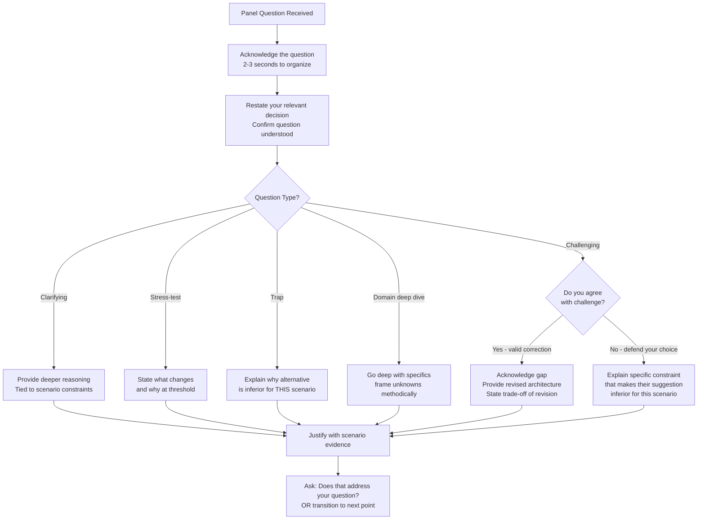
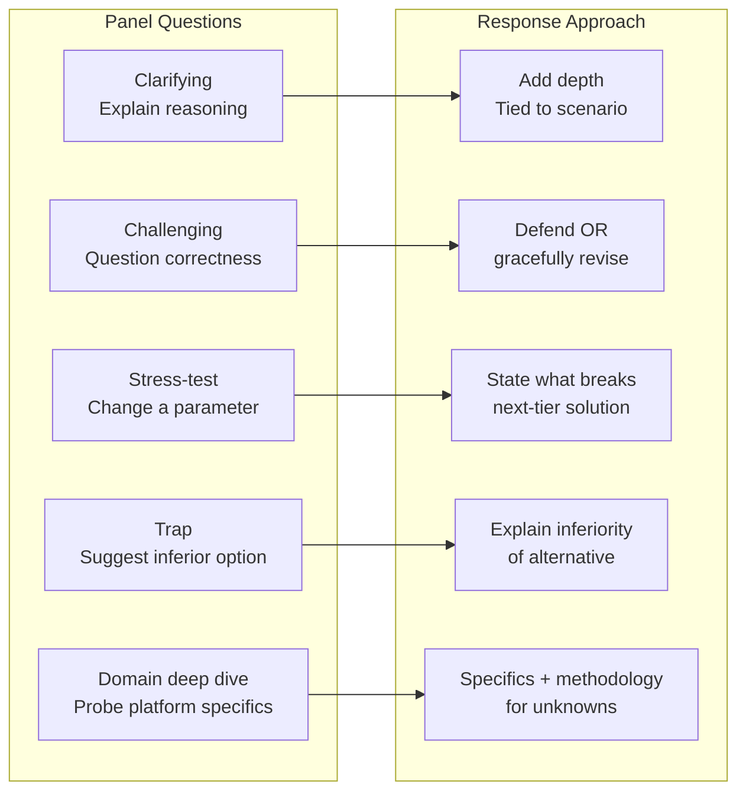

# Panel Questions Strategy (Q&A Phase)

## Overview / Context

The 45-minute Q&A phase of the CTA board exam is, for most candidates, the most psychologically demanding part of the session. You have just spent 45 minutes presenting an architecture you designed under time pressure in a high-stakes environment — and now three CTAs, each with deep expertise in at least one domain, are about to challenge every significant decision you made. The panel is not trying to help you succeed in Q&A; they are stress-testing your depth, your composure, and your ability to defend or revise architectural choices under pressure.

For a PTA who regularly presents architecture recommendations to customers and partners, the Q&A phase may feel superficially familiar. But there is a critical difference: in customer advisory work, your audience accepts your framing, may not challenge your assumptions, and rarely has the Salesforce platform depth to probe your integration pattern choices. The CTA panel has all of that depth and is specifically tasked with finding the edges of your knowledge. The candidate who walks out of Q&A having maintained composure, answered with specificity, and revised one answer gracefully when corrected almost always passes.

The Q&A phase tests five things simultaneously: depth (can you go 3 levels deep on any decision?), breadth (do you understand the implications across domains?), composure (can you handle being told you're wrong?), adaptability (can you revise your solution without losing the thread?), and communication (can you explain your reasoning clearly to both technical and non-technical panelists?). Preparation for Q&A is not just content review — it's rehearsal of the response framework under simulated pressure.

## Foundations

The Q&A phase begins immediately after you finish presenting, or sometimes the panel will interrupt during your presentation. You are standing (or seated) with your whiteboard diagrams visible. The panel has been taking notes throughout your presentation and has identified the 5-8 decisions they want to challenge.

Each panelist typically specializes in different domains. One might be a data architecture expert, another an integration specialist, the third might focus on security and compliance. This means Q&A often has a pattern: the domain specialist probes deeply in their area, while the others watch how you handle pressure and cross-domain reasoning.

You are not expected to be perfect. The panel knows that no candidate has infinite knowledge. What differentiates passing candidates is how they handle the boundaries of their knowledge: with confidence and methodology ("I'd validate this assumption by..."), not with bluffing or shutdown.

The most important mindset shift for Q&A: you are not in a debate. You are in a collaborative architecture review. If a panelist corrects you, they are not penalizing you — they are giving you an opportunity to demonstrate that you can update your thinking. Candidates who get defensive, argue with panelists, or refuse to revise positions consistently fail.

---

## Core Concepts / Framework

### Types of Questions (5 Categories)

**Type 1: Clarifying Questions**
The panel asks you to explain your reasoning more completely. This is not a challenge — it's an invitation to add depth.

Examples:
- "Why did you choose Platform Events over Change Data Capture for this requirement?"
- "You mentioned you'd use MuleSoft for the SAP integration. Can you walk through what the integration would look like at the API level?"
- "What specifically about this scenario made you recommend Private OWD over Public Read Only?"

Response approach: Restate the decision, provide the specific reasoning tied to the scenario, state the trade-off.

**Type 2: Challenging Questions**
The panel questions whether your recommendation is correct. This is the most common Q&A type.

Examples:
- "You recommended a single org with Hyperforce data residency for GDPR. But Hyperforce data residency for specific objects is a relatively new feature — what's your fallback if the customer's contracted org tier doesn't support it?"
- "You said you'd resolve the trigger performance issue by implementing a trigger framework. The org has 47 triggers written by 5 different consultants. How long does that refactoring take and what's the risk to production?"
- "Your integration architecture requires sub-3-second response time from SAP. SAP is on-premise. Have you accounted for VPN latency?"

Response approach: Don't be defensive. Acknowledge the challenge, address it directly, revise if warranted.

**Type 3: Stress-Testing / "What If" Questions**
The panel changes a parameter from the scenario to see if your architecture degrades gracefully.

Examples:
- "What if the volume of customer records was 50M instead of 5M? Does your architecture still hold?"
- "What if the client's Azure AD was being migrated to Okta in parallel — what would change in your identity design?"
- "What if the 18-month timeline was compressed to 12 months? What would you cut from Phase 1?"
- "What if the SAP system had to go offline for a 6-hour maintenance window every Sunday? What does that mean for your real-time integration?"

Response approach: Think out loud. State what changes and why. Show that your architecture has considered extensibility.

**Type 4: Trap Questions**
The panel asks why you didn't use a specific approach — sometimes that approach is actually worse. This tests whether you know the platform well enough to recognize an inferior option and explain why it's inferior.

Examples:
- "Why didn't you use Change Sets for the deployment strategy?" (answer: change sets don't scale to enterprise multi-team development, no versioning)
- "Why didn't you recommend Salesforce Connect instead of a batch sync for the SAP data?" (answer: External Objects via Salesforce Connect aren't appropriate for 500K records real-time lookup — latency at volume, no offline, no reporting)
- "Why didn't you use workflow rules instead of Flow for the approval process?" (answer: workflow rules are being retired, limited functionality, can't handle multi-step approval sequences)

Response approach: Explain specifically why the alternative is inferior for this scenario, don't just say "I prefer X."

**Type 5: Domain-Specific Deep Dives**
A panelist with deep expertise in one domain drills into the specifics of your solution in their area.

Examples (from a data architect panelist):
- "Your migration plan says 3 phases. What's your exact approach to deduplication in Phase 1? What tool, what matching key, what's the exception handling process for records that can't be automatically merged?"
- "You mentioned LDV strategy for 5M customer records. What specific index strategy do you recommend and on which fields? And what's the impact on the nightly sharing recalculation?"

Examples (from an integration architect panelist):
- "You mentioned Platform Events with 72-hour retention. What's your dead letter queue (DLQ) strategy for events that expire before the subscriber processes them?"
- "Your Bulk API batch job — what's your error handling when 5% of records fail validation?"

Response approach: Go deep. This is where your genuine expertise shows. If you don't know the specific answer, frame it methodically: "My approach would be X, but I'd need to validate the specific configuration options with a proof-of-concept in a developer sandbox."

---

### The Response Framework: ARAJE

For every panel question, use this response structure:

**A — Acknowledge:** Confirm you understood the question. "That's a great challenge to my recommendation..."
This is not just politeness — it buys you 2 seconds to organize your thoughts.

**R — Restate:** Briefly restate the relevant decision. "My recommendation was to use [X] for [reason]."
This ensures you're answering the right question and demonstrates that your decision was intentional.

**A — Answer:** Give the direct answer to the question.

**J — Justify:** Provide the specific reasoning. Not "it's best practice" — tied to the scenario constraints.

**E — Evolve (if needed):** If the panel has identified a gap or error, state how you'd revise. "You're right — I didn't account for [X]. If I revise my architecture, I would..."

---

### Handling Being Wrong

This is the most important skill in Q&A. A candidate who gets defensive when corrected will fail. A candidate who revises gracefully and shows understanding of why they were wrong will pass.

Correct response pattern:
> "You're right — I underweighted the impact of [X]. In my revised approach, I would [specific change]. The reason I initially chose [original approach] was [reason], but the constraint you've identified means that [consequence] — so [revised approach] is the more appropriate solution. The trade-off in the revised approach is [trade-off]."

What makes this answer pass:
- Accepts the correction without defensiveness
- Provides a revised solution (not just "you're right, I was wrong")
- Explains the reasoning for both the original and revised approach
- States the trade-off of the revised approach (shows you're not just capitulating, you're analyzing)

---

### Handling Uncertainty

When you genuinely don't know the answer:

Correct:
> "I'd want to validate that assumption. Based on my knowledge of the platform, my instinct is [X] because [reasoning]. To confirm, I'd run a proof of concept in a developer sandbox to validate [specific behavior]. If it turns out [assumption] isn't true, I'd pivot to [alternative]."

Correct (for scenario-specific unknowns):
> "The scenario doesn't specify [data point]. If [condition A], I'd recommend [X] because [reason]. If [condition B], I'd recommend [Y] because [reason]. In discovery, I'd validate [data point] before finalizing the architecture."

Incorrect:
- "It depends." (without stating the dependency)
- Silence
- "I'm not sure" (without recovery)
- Bluffing an answer you don't actually know — experienced CTAs will catch this immediately

---

### What Not to Do in Q&A

| Behavior | Why It Fails |
|----------|-------------|
| Get defensive when challenged | Signals inability to collaborate under pressure |
| Argue with a panelist | Signals poor judgment; panelists are experienced CTAs |
| Say "it depends" without specifying the dependency | Signals you don't actually know the answer |
| Bluff an answer on a topic you don't know | Experienced panelists will probe deeper and expose it |
| Abandon your entire solution when challenged | Signals you didn't think it through; a good solution can be defended or revised selectively |
| Answer a different question than what was asked | Signals evasion |
| Apologize excessively | Signals lack of confidence; wastes time |
| Use filler phrases: "basically," "sort of," "kind of" | Signals uncertainty and reduces authority |
| Speak exclusively to one panelist | Two-thirds of the panel feels ignored |

---

### Preparing for Common Panel Questions

Before your exam, prepare model answers for these 10 question categories:

**1. "Why didn't you recommend [alternative approach]?"**
Preparation: For every major decision in your architecture, know the top 2 alternatives and why each is inferior for this scenario.

**2. "What if the volume was 10x higher?"**
Preparation: Know the LDV thresholds, governor limits, and platform ceilings for each component you've designed. Be able to state where your architecture degrades and what the next-tier solution would be.

**3. "Your [timeline] is too aggressive. What would you cut?"**
Preparation: Know your MoSCoW prioritization cold. Be ready to defer Phase 2 items while preserving Phase 1 integrity.

**4. "What is the total cost of your solution?"**
Preparation: Know approximate Salesforce licensing costs — Service Cloud, Experience Cloud, MuleSoft, Shield — well enough to speak to cost implications of your choices. You don't need exact pricing, but you need to acknowledge cost trade-offs.

**5. "Walk me through what happens if [integration] fails at 2 AM."**
Preparation: Every integration in your solution needs an error handling story: retry strategy, dead letter queue, alerting, data recovery.

**6. "How does your security model handle [specific user type] accessing [specific data]?"**
Preparation: Walk through your sharing model for at least 3 user types. Know which layer of the security stack (FLS → OWD → Role Hierarchy → Sharing Rules → Apex) handles each scenario.

**7. "You mentioned [Salesforce feature]. How does it actually work under the hood?"**
Preparation: For every feature you recommend, be able to explain: how it works, its limits/constraints, common failure modes, and configuration requirements.

**8. "How would you phase this differently if the compliance requirement had to be live in 90 days?"**
Preparation: Know how a compliance forcing function compresses a phasing plan. Compliance cannot be deferred — it becomes the gating item for Phase 1.

**9. "What monitoring and observability do you have for this architecture post-go-live?"**
Preparation: Know the Salesforce observability stack: Shield Event Monitoring, Health Check, Governor Limit monitoring, external integration monitoring (MuleSoft Anypoint, Datadog).

**10. "If you were starting this engagement over knowing what you know now, what would you do differently?"**
Preparation: This tests self-awareness and growth mindset. Prepare a genuine reflection on one architectural trade-off you made and how you might approach it differently with more information.

---

## PTA / SA Relevance

### Parallels to Daily Advisory Work

A PTA regularly faces Q&A-style challenges in internal deal reviews, partner architecture workshops, and customer executive briefings. The dynamics are different but structurally similar:

- **Deal reviews** function like a panel Q&A: an internal architect or product expert challenges your recommendation ("Why are you recommending MuleSoft for this? Can't they use Salesforce Connect?"). The skill is the same — defend with specificity, not with authority.
- **Architecture workshops** with skeptical customers mirror stress-testing questions ("What if our SAP goes down? What if we grow 10x?"). Preparing for CTA Q&A sharpens your ability to answer these confidently.
- **Executive escalations** mirror the "handling being wrong" scenario — when a senior stakeholder identifies a gap in your recommendation, how you respond determines whether trust is maintained or lost.

The key difference: in customer advisory, you can say "let me get back to you on that." In the CTA Q&A, you have to answer now. CTA prep builds the habit of thinking through implications to the second and third order before presenting.

### How to Use This in Customer Engagements

**Pre-architecture red team:** Before presenting an architecture recommendation to a customer, simulate a Q&A panel with internal teammates. Ask each person to play the role of a skeptical stakeholder in a different domain. This sharpens both the architecture and the presentation.

**Trade-off documentation:** In customer proposals, explicitly document the alternatives considered and why they were rejected — the same discipline the CTA board requires. This prevents the "why didn't you consider X?" question in customer reviews.

**Revision posture:** When a customer or internal reviewer identifies a gap, use the ARAJE framework. Acknowledge the gap, restate the original decision, revise with specificity. This is more credible than either defending blindly or capitulating entirely.

---

## Architecture / Scenario

### Q&A Response Flow

### Question Type Classification

---

## Key Principles to Apply

- **Every major decision must be pre-defended.** Before your exam, anticipate the top 3 challenges against each architectural choice and prepare your response. This is not memorization — it's reinforcing that your decisions were deliberate.
- **Composure is architecture.** The panel is as interested in how you handle pressure as what you know. Composure signals mature judgment.
- **Revision is strength, not weakness.** A candidate who updates their solution when given new information demonstrates the most important quality of a trusted architect: the ability to separate ego from recommendation.
- **Specificity wins.** "I'd use a trigger framework" loses to "I'd implement a TDTM-pattern trigger handler that consolidates all Account triggers into a single dispatch handler with recursion prevention and bulkification at the collection level."
- **The "it depends" answer requires naming the dependency.** Never leave a dependency unstated. "It depends on whether the volume exceeds 1M records — if so, I'd change X to Y because..."
- **Own your assumptions.** You stated assumptions in your opening. If Q&A reveals an assumption was wrong, address it directly: "That challenges my assumption that X. Revising for that..."
- **Acknowledge domain depth limitations gracefully.** "I'm not as deep on the Black Diamond API specifics as I would be after a technical discovery session, but my recommendation is based on the documented rate limits. I'd validate the exact batch configuration in a proof-of-concept."
- **The closing question of every Q&A answer:** "Does that address your question?" or simply transitioning clearly signals you've finished answering and invites follow-up.

---

## Common Mistakes (CTA Candidates + Real Implementations)

**Mistake 1: Getting defensive when challenged**
Manifestation: "No, I think my approach is right because..." with escalating defensiveness.
Why it fails: The panel reads this as inability to collaborate and update under new information — a critical quality for a CTA in real engagements.
Correction: Acknowledge the challenge first. Even if you're going to defend your choice, acknowledge the validity of the challenge before explaining why your answer holds.

**Mistake 2: Saying "it depends" without the dependency**
Manifestation: Panel asks about handling a specific failure scenario. Candidate says "It depends on the business requirements."
Why it fails: Every architecture depends on something. Not naming the dependency suggests you don't actually know what it depends on.
Correction: Always complete the sentence: "It depends on X. If X is true, the answer is A because... If X is false, the answer is B because..."

**Mistake 3: Bluffing platform specifics**
Manifestation: Candidate claims Platform Events can hold 10,000 events in queue per subscriber when the actual limit is much lower.
Why it fails: At least one panelist will know the correct limit. Being caught bluffing is worse than admitting you don't know the exact number.
Correction: Frame with what you know: "I'd need to confirm the exact retention limit, but the 72-hour durable PE retention is the relevant design constraint I'd plan around."

**Mistake 4: Abandoning the solution entirely when challenged**
Manifestation: Panel says "Your sharing model won't scale." Candidate immediately says "You're right, I'll redesign the whole security model."
Why it fails: Signals the original design wasn't thought through. Also loses valuable Q&A time.
Correction: Make targeted revisions. "You're right that the sharing rule count creates recalculation risk. I'd address that specifically by [targeted fix], while keeping the rest of the sharing model as designed."

**Mistake 5: Answering a different question than asked**
Manifestation: Panel asks about error handling for a specific integration. Candidate explains the integration architecture again instead.
Why it fails: Looks like evasion. The panel knows you didn't answer the question.
Correction: Restate the question mentally before answering. If you're not sure what's being asked: "Are you asking specifically about [X]?" before answering.

**Mistake 6: Speaking only to one panelist**
Manifestation: One panelist asks all the hard questions, candidate begins directing all answers to that person.
Why it fails: The other two panelists contribute to the scoring and feel excluded.
Correction: Begin the answer to the asking panelist, then sweep eye contact across all three as you complete the answer.

**Mistake 7: Stopping at the first answer without testing assumptions**
Manifestation: Panel asks "What if volume doubles?" Candidate answers for exactly 2x but doesn't extrapolate.
Why it fails: The panel often escalates: "What about 10x? 100x?" If you only answered 2x, you appear not to understand the architectural limits.
Correction: Answer 2x, then proactively address the boundary condition: "At 2x we're still within the same pattern. At roughly 10x, we'd hit [limit], at which point I'd shift to [next-tier solution]."

**Mistake 8: Treating Q&A as separate from the presentation**
Manifestation: Candidate treats Q&A as adversarial — something to survive rather than complete the architecture story.
Why it fails: The best CTA candidates treat Q&A as the continuation of a collaborative design session. That mindset shift is visible to the panel.
Correction: At the end of your presentation, explicitly invite the Q&A: "I'm happy to go deeper on any of these decisions or explore alternative approaches." This signals confidence rather than defensiveness.

---

## Practice Questions / Scenario Exercises

**Exercise 1: The Stress-Test Sequence**
You recommended a single Salesforce org with Hyperforce data residency for a scenario with 3M EU customer records and 500K US records. The panel asks:
- "What if the EU data grows to 30M records in 5 years?"
- "What if you add Japan operations — does Hyperforce support APAC data residency in the same org?"
- "What if the customer's contract tier doesn't include Hyperforce?"

Practice formulating complete ARAJE responses for each. Each answer should acknowledge, restate, answer with specifics, justify with platform knowledge, and (for the last question) evolve the architecture.

**Model answer approach for Q3:** "If the contract tier doesn't include Hyperforce, I'd need to revise the architecture. The options are: (1) upgrade the contract to Hyperforce — I'd include this as a licensing prerequisite in my solution scope, or (2) move to a separate EU org with Salesforce-to-Salesforce sync for consolidated reporting. The trade-off for option 2 is increased complexity in reporting and cross-org processes. I should have flagged the Hyperforce licensing requirement as a constraint in my presentation — that's a gap I'd address by explicitly listing it as a dependency."

---

**Exercise 2: The Trap Question**
You designed a batch integration using Bulk API 2.0 for a 500K record nightly sync. The panel asks:
"Why didn't you use Salesforce Connect with External Objects for this integration? It would avoid the batch entirely."

Practice formulating a response that explains why Salesforce Connect is inferior for this specific scenario.

**Model answer approach:** "Salesforce Connect is designed for real-time lookup of data from external sources where the data doesn't need to be stored in Salesforce. For this scenario, we have two requirements that make it inappropriate. First, the volume: Salesforce Connect has per-request limits and at 500K records with advisor-facing views, we'd hit rate limits during peak usage. Second, offline: our mobile offline requirement means data must be physically stored in Salesforce — External Objects can't be accessed offline. Third, reporting: External Objects have limitations in CRM Analytics and reports that would impact the CFO dashboard requirement. Bulk API 2.0 nightly sync brings the data into Salesforce where it's fully reportable, offline-accessible, and not subject to external API rate limits."

---

**Exercise 3: Being Wrong Gracefully**
You recommended SAML IDP-initiated SSO for a customer's employee portal. A panelist says:
"Your employees bookmark direct Salesforce URLs and access Salesforce through a mobile app. IDP-initiated flow requires users to start at the IDP portal. How does that work for direct URL access?"

This is a valid correction — SP-initiated is more appropriate for this scenario. Practice the ARAJE response for being wrong and revising.

**Model answer approach:** "You're right — I should have designed this as SP-initiated SAML. IDP-initiated flow requires users to start at the Azure AD portal, which breaks the experience for users who bookmark Salesforce URLs directly or access via mobile deep links. In the SP-initiated flow, when a user navigates to a Salesforce URL, Salesforce redirects to Azure AD for authentication and then returns the user to their original destination — that's the correct design for this scenario. The configuration change is in the Connected App settings — disabling IDP-initiated and ensuring the login URL is the Salesforce login page with the appropriate SAML parameter. I should have identified the access pattern (direct URL vs portal-first) as a requirement signal in my scenario analysis."

---

**Exercise 4: The Domain Deep Dive**
A panelist with data architecture expertise asks:
"You said you'd migrate 4.2M records from Siebel with deduplication. Walk me through the exact deduplication methodology: what matching keys you'd use, what tool, how you'd handle the false-positive rate, and what your exception process is for records that can't be auto-merged."

This is a domain deep dive requiring specificity. Practice going 4 levels deep on a topic you know.

**Model answer approach (structure):** Matching keys (email + phone + name + address fuzzy match), tool (Data.com or Informatica MDM or native Duplicate Rules for this scale — Informatica preferred for 4.2M), false-positive handling (confidence scoring: auto-merge above 95%, human review queue for 80-95%, keep separate below 80%), exception process (data steward role reviews queue weekly, business rules for merge precedence: Siebel is master for service history, e-commerce is master for purchase history, loyalty app is master for points balance).

---

**Exercise 5: The Cost Challenge**
You recommended MuleSoft as the integration layer for a 5-system integration scenario. The panel asks:
"MuleSoft licensing is significant. For a $4M total budget, can you justify the MuleSoft cost? What's your alternative if the budget doesn't support it?"

Practice formulating a cost-aware trade-off response without apologizing for MuleSoft.

**Model answer approach:** Acknowledge the cost reality, quantify the value (5 systems × bidirectional integrations = complexity that without middleware creates point-to-point spaghetti), state the alternative (Salesforce platform-native: External Services, Apex callouts, Platform Events — works for 2-3 systems, becomes unmanageable for 5+ with complex transformations), and present a phased option if budget is truly a constraint (MuleSoft for the 2 most complex integrations — SAP and Black Diamond — native Apex for the simpler ones).
